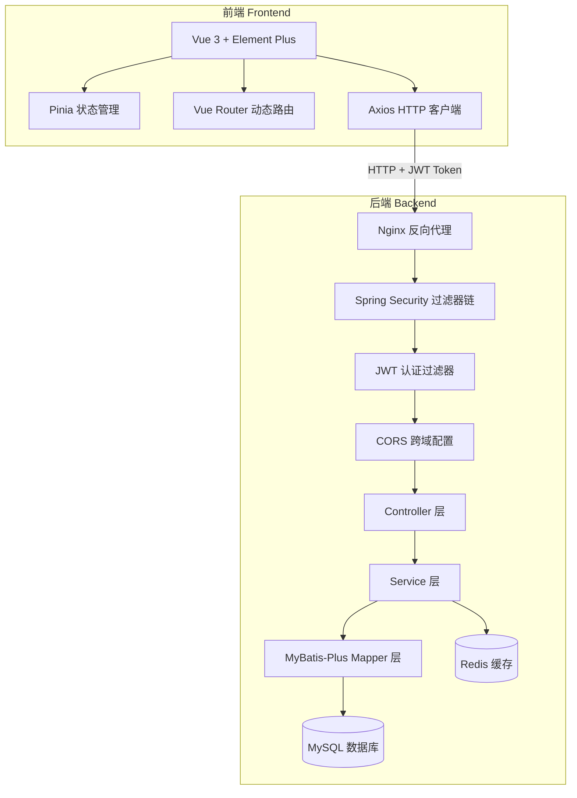
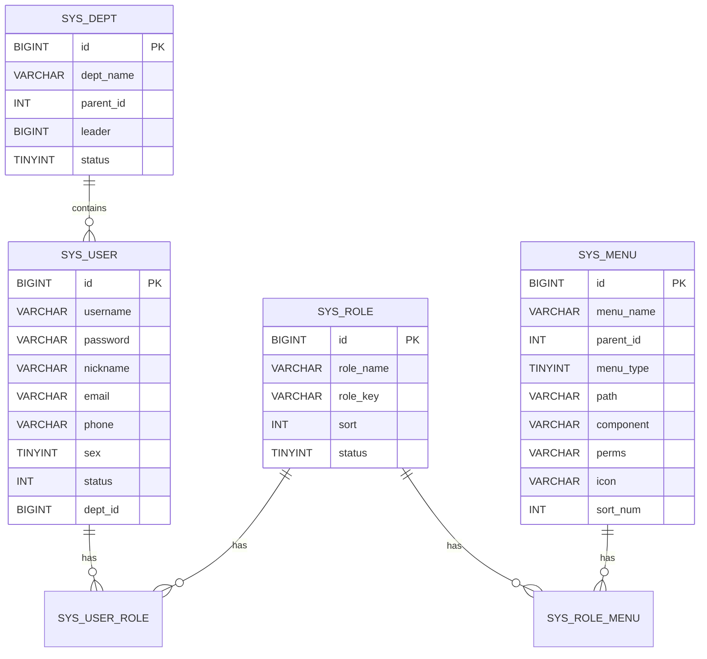
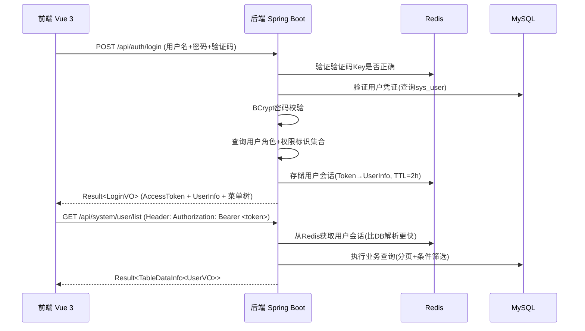

## 产品概述

一个类似若依（RuoYi）的完整后台管理系统，采用前后端分离架构。系统基于 RBAC 权限模型，支持用户管理、角色管理、菜单管理、部门管理、字典管理、操作日志、登录日志七大核心模块，集成 Redis 缓存和 MySQL 持久化存储，提供完整的认证授权体系和动态路由菜单功能。

## 核心功能

- **用户管理**：用户 CRUD 操作、分配角色、重置密码、修改状态（启用/禁用）、按部门和关键字搜索
- **角色管理**：角色 CRUD 操作、分配菜单权限、数据权限设置（全部/本部门/本部门及以下/仅本人）、状态切换
- **菜单管理**：树形菜单 CRUD、动态路由生成、菜单类型区分（目录/菜单/按钮）、权限标识配置、排序/图标/显示状态
- **部门管理**：树形组织架构 CRUD、层级部门管理、负责人设置
- **字典管理**：字典类型管理 + 字典数据维护，支持新增/编辑/删除字典项，前端可调用接口获取字典数据
- **操作日志**：自动记录用户操作（通过 AOP 切面），支持按模块/操作人/时间范围筛选查询，支持清空日志
- **登录日志**：记录用户登录信息（IP 地址、浏览器、操作系统、登录状态），支持在线用户查看和强制下线
- **系统监控**：Redis 连接信息展示、基础服务器信息
- **统一认证**：JWT + Redis 双 Token 机制（Access Token 短期有效 + Redis 存储会话）、图形验证码登录、密码加密存储
- **权限控制**：RBAC 权限模型 + 按钮级权限标识 + 数据权限（部门维度）

## 环境信息

- MySQL: 127.0.0.1:3306, 用户名 root, 密码 root1234, 数据库名 ruoyi_admin
- Redis: 127.0.0.1:6379（无密码）

## Tech Stack

- **后端框架**: Spring Boot 3.2.0 + Java 17
- **安全框架**: Spring Security 6 + JWT（jjwt 0.12.5）
- **ORM 框架**: MyBatis-Plus 3.5.5（分页插件、代码生成器）
- **数据库**: MySQL 8.x（10 张核心表）
- **缓存**: Spring Data Redis（Token 存储 / 验证码缓存 / 字典缓存 / 会话管理）
- **API 文档**: Knife4j（Swagger 增强）
- **工具库**: Hutool（通用工具）、Apache Commons Lang3
- **前端框架**: Vue 3 (Composition API) + Vite 5.x
- **UI 组件库**: Element Plus
- **状态管理**: Pinia
- **HTTP 客户端**: Axios（拦截器封装）
- **路由**: Vue Router 4（动态路由 + 导航守卫）

## Tech Architecture

### 系统整体架构



### RBAC 权限模型



### 认证与鉴权流程



### 数据库表设计（10 张核心表）

| 表名 | 说明 | 关键字段 |
| --- | --- | --- |
| sys_user | 用户表 | id, username, password, nickname, email, phone, sex, status, dept_id |
| sys_role | 角色表 | id, role_name, role_key, sort, status, data_scope |
| sys_menu | 菜单权限表 | id, menu_name, parent_id, menu_type(M/D/F), path, component, perms, icon, sort_num, visible, status |
| sys_dept | 部门表 | id, dept_name, parent_id, order_num, leader, phone, email, status, ancestors |
| sys_user_role | 用户角色关联表 | user_id, role_id |
| sys_role_menu | 角色菜单关联表 | role_id, menu_id |
| sys_dict_type | 字典类型表 | dict_name, dict_type, status |
| sys_dict_data | 字典数据表 | dict_type, dict_label, dict_value, css_class, sort |
| sys_oper_log | 操作日志表 | module, business_type, method, request_method, oper_param, json_result, oper_ip, oper_time, status |
| sys_logininfor | 登录日志表 | user_name, ipaddr, login_location, browser, os, msg, login_time |


### API 接口设计

| 方法 | 路径 | 说明 | 认证 | 权限 |
| --- | --- | --- | --- | --- |
| POST | /api/auth/captcha | 获取验证码 | 否 | - |
| POST | /api/auth/login | 登录 | 否 | - |
| POST | /api/auth/logout | 登出 | 是 | - |
| GET | /api/system/user/list | 用户列表 | 是 | system:user:list |
| POST | /api/system/user | 新增用户 | 是 | system:user:add |
| PUT | /api/system/user | 编辑用户 | 是 | system:user:edit |
| DELETE | /api/system/user/{ids} | 删除用户 | 是 | system:user:remove |
| PUT | /api/user/resetPwd | 重置密码 | 是 | system:user:resetPwd |
| PUT | /api/user/changeStatus | 修改状态 | 是 | system:user:edit |
| GET | /api/system/role/list | 角色列表 | 是 | system:role:list |
| POST | /api/system/role | 新增角色 | 是 | system:role:add |
| PUT | /api/system/role | 编辑角色 | 是 | system:role:edit |
| DELETE | /api/system/role/{ids} | 删除角色 | 是 | system:role:remove |
| GET | /api/system/menu/treeSelect | 菜单树（下拉选择） | 是 | - |
| GET | /api/system/menu/list | 菜单列表 | 是 | system:menu:list |
| GET | /api/system/menu/tree | 菜单树 | 是 | - |
| POST | /api/system/menu | 新增菜单 | 是 | system:menu:add |
| PUT | /api/system/menu | 编辑菜单 | 是 | system:menu:edit |
| DELETE | /api/system/menu/{id} | 删除菜单 | 是 | system:menu:remove |
| GET | /Routers | 获取路由信息（前端动态加载） | 是 | - |
| GET | /GetInfo | 获取当前用户信息+权限+路由 | 是 | - |
| GET | /api/system/dept/list | 部门树 | 是 | system:dept:list |
| POST | /api/system/dept | 新增部门 | 是 | system:dept:add |
| PUT | /api/system/dept | 编辑部门 | 是 | system:dept:edit |
| DELETE | /api/system/dept/{id} | 删除部门 | 是 | system:dept:remove |
| GET | /api/system/dict/type/list | 字典类型列表 | 是 | system:dict:list |
| POST | /api/system/dict/type | 新增字典类型 | 是 | system:dict:add |
| PUT | /api/system/dict/type | 编辑字典类型 | 是 | system:dict:edit |
| DELETE | /api/system/dict/type/{ids} | 删除字典类型 | 是 | system:dict:remove |
| GET | /api/system/dict/data/list | 字典数据列表 | 是 | - |
| POST | /api/system/dict/data | 新增字典数据 | 是 | - |
| PUT | /api/system/dict/data | 编辑字典数据 | 是 | - |
| DELETE | /api/system/dict/data/{ids} | 删除字典数据 | 是 | - |
| GET | /api/system/dict/data/type/{dictType} | 按类型获取字典 | 否（带缓存） | - |
| GET | /api/monitor/operlog/list | 操作日志列表 | 是 | monitor:operlog:list |
| DELETE | /api/monitor/operlog/{ids} | 清除日志 | 是 | monitor:operlog:remove |
| GET | /api/monitor/logininfor/list | 登录日志列表 | 是 | monitor:logininfor:list |
| DELETE | /api/monitor/logininfor/{ids} | 清除登录日志 | 是 | monitor:logininfor:remove |


## Implementation Notes

### 复用现有代码策略

- **Result.java** (`common/Result.java`): 直接复用已有类（code/message/data 结构完全符合需求）
- **JwtUtil.java** (`utils/JwtUtil.java`): 扩展增强，增加 userId/permissions claims 支持
- **JwtAuthenticationFilter.java** (`security/`): 重构为从 Redis 加载用户详情（而非每次解析 Token 查 DB）
- **SecurityConfig.java** (`config/`): 大幅扩展，增加放行静态资源/CORS/验证码接口/白名单等配置
- **application.yml**: 更新数据库连接信息（root/root1234）、添加 Redis 配置
- **pom.xml**: 增加 Redis、Knife4j、Hutool、Commons-Lang3 依赖
- **旧实体/Mapper** (User.java/Task.java 等): 不删除但不再使用，新建 sys_* 前缀的实体体系

### 性能与可靠性考虑

- Redis 作为 Session 存储：避免每次请求解析 JWT 并查数据库获取用户信息，Token 有效期内直接从 Redis 读取
- MyBatis-Plus 分页插件：所有列表接口必须走分页，禁止全量查询
- AOP 日志切面：使用自定义注解 `@Log(title = "xxx", businessType = BusinessType.xxx)` 自动记录操作日志，非侵入式
- 验证码防爆破：Redis 存储验证码 Key（5 分钟 TTL），限制同一 IP 尝试次数
- 数据库索引：sys_user.username 唯一索引、sys_dept.ancestors 索引、sys_logininfor.user_name 索引
- 密码安全：BCrypt 加密存储（strength=10），重置密码时随机生成并返回明文一次

### 代码规范约束（来自 workspace 规则）

- Java: 4 空格缩进, PascalCase 类名, camelCase 方法变量, 中文注释, 语句末尾加分号
- 前端 JS/TS: 2 空格缩进, 单引号字符串, 不加分号, 组件名 PascalCase
- Controller 必须使用 Result<T> 包装返回值
- Git: Conventional Commits 格式（feat/fix/docs/style/refactor/test/chore）

### 爆炸半径控制

- 在现有 task-manager-backend 项目基础上扩展（同包名 com.taskmanager）
- 保留旧文件不删除（User.java/Task.java 及相关 Mapper），新文件使用 sys_ 前缀命名
- 前端作为独立项目 task-manager-frontend 放在同级目录
- 所有新功能通过新 Controller/Service/Mapper 文件实现，不修改旧有逻辑

## Directory Structure

```
c:\dev\code\ai_code\codebuddy_test1\
├── task-manager-backend/                              # [MODIFY] 已存在的 Spring Boot 后端项目（大幅扩展）
│   ├── pom.xml                                        # [MODIFY] 新增 Redis/Knife4j/Hutool/Lombok 依赖
│   ├── src/main/java/com/taskmanager/
│   │   ├── TaskManagerApplication.java                # [KEEP] 启动类保持不变
│   │   │
│   │   ├── common/                                    # [MODIFY] 公共模块（复用 Result.java）
│   │   │   ├── Result.java                            # [KEEP] 统一响应格式（已存在，直接复用）
│   │   │   ├── constant/                              # [NEW] 常量定义目录
│   │   │   │   └── Constants.java                     # [NEW] 全局常量（CacheName/Token前缀/通用状态码等）
│   │   │   ├── annotation/                            # [NEW] 自定义注解
│   │   │   │   └── Log.java                           # [NEW] 操作日志注解（AOP 切面用，含 title/businessType）
│   │   │   ├── enums/                                 # [NEW] 枚举定义
│   │   │   │   └── BusinessTypeEnum.java              # [NEW] 业务操作类型枚举（INSERT/UPDATE/DELETE/IMPORT/EXPORT/GRPC等）
│   │   │   ├── exception/                             # [NEW] 异常处理
│   │   │   │   ├── GlobalExceptionHandler.java        # [NEW] 全局异常拦截器（业务异常/参数异常/认证异常/权限异常统一捕获）
│   │   │   │   ├── ServiceException.java              # [NEW] 业务异常类（code + message）
│   │   │   │   └── CaptchaException.java              # [NEW] 验证码异常
│   │   │   └── utils/                                 # [NEW] 工具类
│   │   │       ├── PageUtils.java                     # [NEW] 分页工具（MyBatis-Plus IPage → TableDataInfo 转换）
│   │   │       └── StringUtils.java                   # [NEW] 字符串工具（继承Hutool扩展）
│   │   │
│   │   ├── config/                                    # [MODIFY] 配置类（扩展现有 SecurityConfig）
│   │   │   ├── SecurityConfig.java                    # [MODIFY] 扩展 CORS、资源处理器、验证码/白名单放行
│   │   │   ├── MybatisPlusConfig.java                 # [NEW] MyBatis-Plus 配置（分页插件 + 防全表更新拦截器）
│   │   │   ├── RedisConfig.java                       # [NEW] Redis 序列化配置（String/Hash 序列化器）
│   │   │   └── CorsConfig.java                        # [NEW] CORS 跨域详细配置
│   │   │
│   │   ├── security/                                  # [MODIFY] 安全模块（增强现有 JWT 机制）
│   │   │   ├── JwtUtil.java                           # [MODIFY] 扩展：支持 userId/claims，增加 refresh 逻辑
│   │   │   ├── JwtAuthenticationFilter.java           # [MODIFY] 重构：从 Redis 获取用户信息构建 Authentication
│   │   │   ├── LoginUser.java                         # [NEW] 登录用户身份信息（实现 UserDetails，包含用户/权限集合）
│   │   │   ├── TokenService.java                      # [NEW] Token 服务（Redis 创建/刷新/删除/验证 Token）
│   │   │   └── UserDetailsServiceImpl.java            # [NEW] UserDetailsService 实现（从 DB 加载用户详情+权限）
│   │   │
│   │   ├── domain/                                    # [NEW] 系统领域对象（若依风格命名）
│   │   │   ├── SysUser.java                           # [NEW] 用户实体（@TableName("sys_user"), Lombok @Data）
│   │   │   ├── SysRole.java                           # [NEW] 角色实体（@TableName("sys_role")）
│   │   │   ├── SysMenu.java                           # [NEW] 菜单实体（@TableName("sys_menu"), 含 children 字段用于树形结构）
│   │   │   ├── SysDept.java                           # [NEW] 部门实体（@TableName("sys_dept"), 含 children 字段）
│   │   │   ├── SysUserRole.java                       # [NEW] 用户角色关联实体（复合主键 user_id+role_id）
│   │   │   ├── SysRoleMenu.java                       # [NEW] 角色菜单关联实体（复合主键 role_id+menu_id）
│   │   │   ├── SysDictType.java                       # [NEW] 字典类型实体
│   │   │   ├── SysDictData.java                       # [NEW] 字典数据实体
│   │   │   ├── SysOperLog.java                        # [NEW] 操作日志实体
│   │   │   └── SysLogininfor.java                     # [NEW] 登录日志实体
│   │   │
│   │   ├── mapper/                                    # [MODIFY] Mapper 层（新增系统 Mapper）
│   │   │   ├── (保留旧的 UserMapper.java/TaskMapper.java) # [KEEP] 旧文件保留
│   │   │   ├── SysUserMapper.java                     # [NEW] 用户 Mapper（extends BaseMapper<SysUser>）
│   │   │   ├── SysRoleMapper.java                     # [NEW] 角色 Mapper（extends BaseMapper<SysRole>）
│   │   │   ├── SysMenuMapper.java                     # [NEW] 菜单 Mapper（extends BaseMapper<SysMenu>, 含 selectMenuTreeByUserId 自定义方法）
│   │   │   ├── SysDeptMapper.java                     # [NEW] 部门 Mapper（extends BaseMapper<SysDept>, 含 selectDeptTree 自定义方法）
│   │   │   ├── SysUserRoleMapper.java                 # [NEW] 用户角色关联 Mapper
│   │   │   ├── SysRoleMenuMapper.java                 # [NEW] 角色菜单关联 Mapper
│   │   │   ├── SysDictTypeMapper.java                 # [NEW] 字典类型 Mapper
│   │   │   ├── SysDictDataMapper.java                 # [NEW] 字典数据 Mapper
│   │   │   ├── SysOperLogMapper.java                  # [NEW] 操作日志 Mapper
│   │   │   └── SysLogininforMapper.java               # [NEW] 登录日志 Mapper
│   │   │
│   │   ├── service/                                   # [NEW] 服务层
│   │   │   ├── ISysUserService.java                   # [NEW] 用户服务接口
│   │   │   ├── impl/
│   │   │   │   └── SysUserServiceImpl.java             # [NEW] 用户服务实现（CRUD + 分配角色 + 重置密码 + 查询用户/角色/权限）
│   │   │   ├── ISysRoleService.java                   # [NEW] 角色服务接口
│   │   │   │   └── SysRoleServiceImpl.java             # [NEW] 角色服务实现（CRUD + 分配权限 + 数据权限范围）
│   │   │   ├── ISysMenuService.java                   # [NEW] 菜单服务接口
│   │   │   │   └── SysMenuServiceImpl.java             # [NEW] 菜单服务实现（CRUD + 构建菜单树 + router 元数据）
│   │   │   ├── ISysDeptService.java                   # [NEW] 部门服务接口
│   │   │   │   └── SysDeptServiceImpl.java             # [NEW] 部门服务实现（CRUD + 构建部门树）
│   │   │   ├── ISysDictTypeService.java               # [NEW] 字典类型服务接口
│   │   │   │   └── SysDictTypeServiceImpl.java         # [NEW] 字典类型服务实现
│   │   │   ├── ISysDictDataService.java               # [NEW] 字典数据服务接口
│   │   │   │   └── SysDictDataServiceImpl.java         # [NEW] 字典数据服务实现（按 type 查询 + Redis 缓存）
│   │   │   ├── ISysOperLogService.java                # [NEW] 操作日志服务接口
│   │   │   │   └── SysOperLogServiceImpl.java          # [NEW] 操作日志服务实现（查询 + 清空）
│   │   │   ├── ISysLogininforService.java             # [NEW] 登录日志服务接口
│   │   │   │   └── SysLogininforServiceImpl.java       # [NEW] 登录日志服务实现（记录 + 查询 + 清空）
│   │   │   ├── SysPermissionService.java              # [NEW] 权限服务（创建过滤器的 PermissionService Bean）
│   │   │   └── impl/
│   │   │       └── SysPermissionServiceImpl.java      # [NEW] 权限服务实现（hasPermi 判断 + 过滤权限数据）
│   │   │
│   │   ├── controller/                                # [NEW] 控制器层
│   │   │   ├── SysLoginController.java                # [NEW] 登录认证控制器（login/logout/captcha/getInfo/getRouters）
│   │   │   ├── SysUserController.java                 # [NEW] 用户管理控制器（CRUD + resetPwd + changeStatus）
│   │   │   ├── SysRoleController.java                 # [NEW] 角色管理控制器（CRUD + authUser/dataScope）
│   │   │   ├── SysMenuController.java                 # [NEW] 菜单管理控制器（list/tree/treeSelect + CRUD）
│   │   │   ├── SysDeptController.java                 # [NEW] 部门管理控制器（list/tree + CRUD + excludeChild）
│   │   │   ├── SysDictTypeController.java             # [NEW] 字典类型控制器（CRUD + optionselect）
│   │   │   ├── SysDictDataController.java             # [NEW] 字典数据控制器（CRAD + 按 type 查询）
│   │   │   ├── SysOperlogController.java              # [NEW] 操作日志控制器（list + remove/export）
│   │   │   └── SysLogininforController.java           # [NEW] 登录日志控制器（list + remove + 清空）
│   │   │
│   │   └── aspect/                                    # [NEW] AOP 切面
│   │       └── LogAspect.java                         # [NEW] 操作日志切面（拦截 @Log 注解的方法，异步写入 sys_oper_log）
│   │
│   └── src/main/resources/
│       ├── application.yml                            # [MODIFY] 更新 DB 连接(root/root1234)、新增 Redis 配置、新增 Knife4j
│       ├── schema.sql                                  # [REPLACE] 完整的若依风格建表脚本（10张表 + 初始化数据）
│       └── mapper/
│           ├── (保留旧的 XML)                          # [KEEP] TaskMapper.xml/UserMapper.xml
│           ├── SysUserMapper.xml                       # [NEW] 用户相关 SQL（selectAllocatedList/selectAssignedRoleList 等）
│           ├── SysRoleMapper.xml                       # [NEW] 角色 SQL（selectRoleList + selectRolesByUserId）
│           ├── SysMenuMapper.xml                       # [NEW] 菜单 SQL（selectMenuTree + selectMenusByUserId + selectMenuTreeAll）
│           ├── SysDeptMapper.xml                       # [NEW] 部门 SQL（selectDeptTree + selectChildrenDeptById）
│           ├── SysDictDataMapper.xml                   # [NEW] 字典数据 SQL
│           └── SysOperLogMapper.xml                    # [NEW] 操作日志 SQL（insertOperlog + selectOperlogList）
│
├── task-manager-frontend/                             # [NEW] Vue 3 前端项目（全新创建）
│   ├── package.json                                   # [NEW] npm 依赖（vue3/vite/element-plus/pinia/vue-router/axios/nprogress）
│   ├── vite.config.js                                 # [NEW] Vite 配置（代理 /dev-api -> http://localhost:8080）
│   ├── index.html                                     # [NEW] HTML 入口
│   ├── public/
│   │   └── favicon.ico                                # [NEW] 图标
│   └── src/
│       ├── main.js                                    # [NEW] 应用入口（注册 Element Plus/Pinia/Router）
│       ├── App.vue                                    # [NEW] 根组件
│       ├── permission.js                              # [NEW] 路由守卫（token 存在 → getInfo → 动态添加路由）
│       ├── router/
│       │   └── index.js                               # [NEW] 路由配置（静态路由 + 动态路由合并 + addRoutes 逻辑）
│       ├── api/
│       │   ├── request.js                             # [NEW] Axios 封装（baseURL/dev-api、请求拦截注入 token、响应拦截错误处理/401跳登录）
│       │   ├── auth.js                                # [NEW] 登录认证 API（captcha/login/logout/getInfo/getRouters）
│       │   ├── system/
│       │   │   ├── user.js                            # [NEW] 用户管理 API
│       │   │   ├── role.js                            # [NEW] 角色管理 API
│       │   │   ├── menu.js                            # [NEW] 菜单管理 API
│       │   │   ├── dept.js                            # [NEW] 部门管理 API
│       │   │   └── dict.js                            # [NEW] 字典管理 API
│       │   └── monitor/
│       │       ├── operlog.js                         # [NEW] 操作日志 API
│       │       └── logininfor.js                      # [NEW] 登录日志 API
│       ├── store/
│       │   ├── index.js                               # [NEW] Pinia 根 Store
│       │   ├── modules/
│       │   │   ├── useUserStore.js                    # [NEW] 用户 Store（token/userInfo/roles/permissions/actions）
│       │   │   └── useAppStore.js                     # [NEW] 应用 Store（sidebar折叠/设备类型）
│       ├── utils/
│       │   ├── auth.js                                # [NEW] Token 存取（getToken/setToken/removeToken → localStorage）
│       │   └── validate.js                            # [NEW] 校验工具函数
│       ├── layout/                                    # [NEW] 整体布局组件
│       │   └── index.vue                              # [NEW] 主布局（侧边栏 + 顶部导航 + 内容区）
│       ├── components/
│       │   └── Sidebar/
│       │       ├── index.vue                          # [NEW] 侧边栏容器（Logo + 菜单列表 + 折叠动画）
│       │       ├── SidebarItem.vue                    # [NEW] 递归菜单项（支持多级子菜单）
│       │       └── Logo.vue                           # [NEW] Logo 区域
│       ├── views/
│       │   ├── login.vue                              # [NEW] 登录页面（居中卡片 + 表单 + 验证码图片 + 记住密码）
│       │   ├── register.vue                           # [NEW] 注册页面（可选）
│       │   ├── dashboard/
│       │   │   └── index.vue                          # [NEW] 首页仪表盘（统计卡片 + 快捷入口）
│       │   └── system/
│       │       ├── user/
│       │       │   └── index.vue                      # [NEW] 用户管理页（搜索栏 + 表格 + 新增/编辑弹窗 + 分配角色弹窗）
│       │       ├── role/
│       │       │   └── index.vue                      # [NEW] 角色管理页（表格 + 新增/编辑弹窗 + 菜单权限树弹窗）
│       │       ├── menu/
│       │       │   └── index.vue                      # [NEW] 菜单管理页（表格 + 新增/编辑弹窗（图标选择/上级菜单选择））
│       │       ├── dept/
│       │       │   └── index.vue                      # [NEW] 部门管理页（树形表格 + 新增/编辑弹窗）
│       │       └── dict/
│       │           └── index.vue                      # [NEW] 字典管理页（左侧字典类型列表 + 右侧字典数据表格 Tab 页）
│       └── assets/
│           └── styles/
│               ├── index.scss                         # [NEW] 全局样式 + Element Plus 变量覆盖
│               ├── sidebar.scss                       # [NEW] 侧边栏专用样式
│               └── variables.scss                     # [NEW] SCSS 变量（颜色/间距/字体）
```

## Key Code Structures

```java
// LoginUser - 登录用户身份信息（核心安全对象）
public class LoginUser implements UserDetails {
    private SysUser user;
    private Set<String> permissions;          // 权限标识集合（如 system:user:list）
    private List<SysRole> roles;              // 角色列表
}

// TokenService - Redis 会话管理（核心认证机制）
@Service
public class TokenService {
    // 生成 UUID Token → Redis Hash 存储 LoginUser（TTL = 过期时间）
    public String createToken(LoginUser loginUser);
    // 从 Redis 获取并刷新过期时间
    public LoginUser getLoginUser(String token);
    // 删除 Redis 中的 Token（登出）
    public void delLoginUser(String token);
    // 验证 Token 是否有效且未过期
    public void verifyToken(LoginUser loginUser);
}

// @Log 注解 - 操作日志标记
@Target({ ElementType.METHOD })
@Retention(RetentionPolicy.RUNTIME)
public @interface Log {
    String title();                           // 模块名称
    BusinessType businessType() default OTHER; // 操作类型
}
```

## 设计风格

采用经典若依（RuoYi）后台管理系统布局风格，以清爽的蓝色系为主色调，白色内容区域搭配浅灰色背景。整体遵循"左侧固定导航 + 顶部面包屑导航 + 右侧主内容区"的经典三段式后台布局。界面强调专业性和功能性，使用适度的圆角、阴影和过渡动画提升交互体验，同时保持与若依一致的视觉语言。

## 应用类型

Web（桌面端后台管理系统），面向管理员使用的 SPA 单页应用。

## 页面规划

共 7 个核心页面：

### 页面 1：登录页（LoginView）

- **背景装饰块**：全屏渐变背景或纯色背景（#2d3a4b 深色调），中央偏右放置动态粒子效果或几何图案装饰
- **Logo 标题块**：左上角或登录卡片顶部展示系统 Logo 和名称 "RuoYi Admin"
- **登录表单块**：白色圆角卡片容器，内含用户名输入框（前置用户图标）、密码输入框（前置锁图标）、验证码输入框 + 验证码图片（可点击刷新）、记住密码 Checkbox、登录按钮（主色调，宽度撑满）、底部注册链接
- **表单校验**：Element Plus ElForm Rules 校验（必填/长度/格式）

### 页面 2：首页仪表盘（Dashboard）

- **欢迎语块**：顶部显示 "早安/下午好，XXX" + 当前日期时间和一段问候语
- **统计卡片块**：一行 4 个 ElCard 统计卡片（总用户数、今日新增、活跃角色数、总菜单数），每个卡片含图标（不同颜色）+ 数值 + 描述文字
- **快捷操作块**：常用功能快捷入口（新建用户、角色管理等）按钮组
- **系统信息块**：展示 Redis 连接状态、MySQL 版本、系统运行时间等信息

### 页面 3：用户管理页（SysUser）

- **搜索工具栏块**：一行搜索表单，包含用户名输入框、手机号输入框、状态下拉框（正常/停用）、创建时间日期范围选择器、搜索按钮、重置按钮、右侧"新增用户"按钮（主色）、"导出"按钮（可选）、"导入"按钮（可选）
- **数据表格块**：ElTable 表格，列包括：用户名（可点击查看详情）、昵称、部门、手机号、状态（ElSwitch 开关可直接切换）、创建时间、操作列（编辑/删除/重置密码）。支持多选（checkbox 列）+ 批量删除
- **新增/编辑弹窗块**：ElDialog 弹窗，表单项包括：用户名（编辑时禁用）、密码（新增必填/编辑选填，带强度提示）、昵称、部门（树形下拉选择 ElTreeSelect）、手机号、邮箱、性别（RadioGroup）、状态下拉框、备注（Input），底部确定/取消按钮
- **分配角色弹窗块**：ElDialog 弹窗，内含角色列表 Transfer 穿梭框或 CheckboxGroup，左右两侧分配角色

### 页面 4：角色管理页（SysRole）

- **搜索工具栏块**：角色名输入框 + 权限字符输入框 + 状态下拉框 + 搜索/重置/新增按钮
- **数据表格块**：ElTable 表格，列包括：角色名称、权限字符、显示顺序、状态（Tag 标签 正常/停用）、创建时间、操作列（编辑/删除/分配权限/数据权限）
- **新增/编辑弹窗块**：ElDialog 弹窗，表单项包括：角色名称、权限字符（英文唯一）、显示顺序（数字输入）、备注、状态下拉框
- **菜单权限弹窗块**：ElDialog 弹窗，内含 ElTree 树形控件（勾选模式，show-checkbox），展示完整菜单树供勾选分配权限，支持全选/父子联动
- **数据权限弹窗块**：ElDialog 弹窗，数据权限范围 RadioGroup 选择（全部数据/本部门数据/本部门及以下/仅本人数据）+ 部门树形选择

### 页面 5：菜单管理页（SysMenu）

- **搜索工具栏块**：菜单名称输入框 + 状态下拉框 + 搜索/重置/新增按钮（右上角）
- **数据表格块**：ElTable 树形表格（row-key + tree-props + default-expand-all），列包括：菜单名称（图标 + 名称，缩进表示层级）、排序、权限标识、组件路径、类型 Tag（目录/菜单/按钮，不同颜色）、状态（显示/隐藏）、操作列（新增子菜单/编辑/删除）
- **新增/编辑弹窗块**：ElDialog 弹窗，表单项包括：上级菜单（树形下拉选择，可选"主类目"/"顶级"）、菜单类型（RadioGroup 目录/菜单/按钮）、菜单名称、排序、路由地址（path）、组件路径（component，选择菜单类型时显示）、权限标识（perms，按钮类型时显示）、显示状态（显示/隐藏 RadioGroup）、是否外链、缓存、可见性

### 页面 6：部门管理页（SysDept）

- **搜索工具栏块**：部门名称输入框 + 状态下拉框 + 搜索/重置/新增/展开/折叠按钮
- **数据表格块**：ElTable 树形表格，列包括：部门名称（缩进树形结构）、排序、负责人、联系电话、邮箱、状态（Tag 标签）、创建时间、操作列（新增子部门/编辑/删除）
- **新增/编辑弹窗块**：ElDialog 弹窗，表单项包括：上级部门（树形下拉选择）、部门名称、显示顺序、负责人、联系电话、邮箱、状态下拉框

### 页面 7：日志管理页（SysOperLog / SysLogininfor）

- **Tab 切换块**：顶部 ElTabs 切换（操作日志 Tab / 登录日志 Tab）
- **操作日志搜索栏**：系统模块下拉框 + 操作类型下拉框 + 操作人员输入框 + 日期范围 + 搜索/重置/清空按钮
- **操作日志表格块**：ElTable 表格，列包括：日志ID、系统模块、操作类型（Tag 不同颜色）、操作方式（POST/GET Tag）、请求方法名、请求参数（可展开查看 JSON）、操作状态（成功/失败 Tag）、操作耗时、操作人、操作IP、操作时间、操作列（查看详情）
- **登录日志搜索栏**：登录账号输入框 + IP 地址输入框 + 状态下拉框（成功/失败） + 日期范围 + 搜索/重置/解锁/清空按钮
- **登录日志表格块**：ElTable 表格，列包括：日志ID、用户名、IP 地址、登录地点、浏览器、操作系统、登录消息、登录时间、操作列（解锁/删除）
- **详情弹窗块**：ElDialog 弹窗，展示操作日志详细信息（请求参数/响应结果的 JSON 格式化展示，使用 `<pre>` 标签）

### 全局布局组件（Layout - 非独立页面，所有页面共用）

- **侧边栏（Sidebar）**：左侧固定宽度 210px（可折叠至 64px），深蓝色背景（#304156），顶部 Logo 区域（折叠时只显示图标），下方 ElMenu 菜单（unique-opened, collapse-transition, default-active 跟随路由高亮），支持无限层级嵌套（递归 SidebarItem），激活项高亮色（#1890ff），悬停半透明效果
- **顶部导航栏（Navbar）**：高度 50px 白色背景 + 底部 1px 边框，左侧汉堡菜单折叠按钮（三横线图标），中间面包屑导航（Breadcrumb，当前路由层级），右侧功能区：全屏切换按钮、头像 Dropdown 下拉菜单（个人中心/退出登录）
- **主内容区（AppMain）**：灰色背景（#f0f2f5），内部白色容器 padding 20px，含视图出口 `<router-view>`，页面切换过渡动画（fade-transform）

## Agent Extensions

### SubAgent

- **code-explorer**
- Purpose: 在实施过程中探索大量文件结构和跨文件引用关系，确保代码一致性
- Expected outcome: 准确定位所有需要修改的文件及其依赖关系