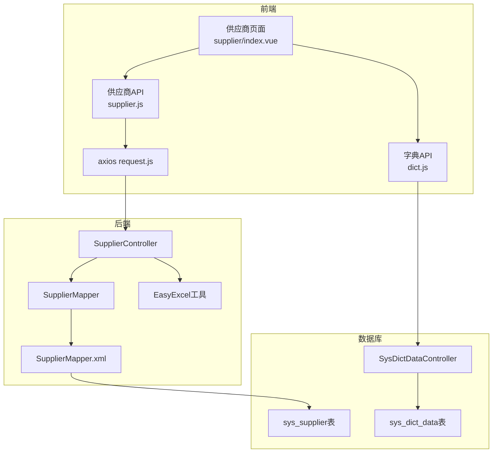

## 产品概述

在现有若依风格后台管理系统中，新增"供应商管理"模块，包含供应商信息的增删改查、多条件搜索、Excel导入导出功能。

## 核心功能

- **供应商列表**: 展示公司名称、省份、联系人、电话1-4、联系状态、品类、详细地址，支持分页
- **多条件搜索**: 省份（多选下拉+模糊搜索）、公司名称（模糊搜索）、联系人（模糊搜索）、品类（多选下拉+模糊搜索）、联系状态（下拉选择）
- **联系状态**: 未联系、已加微信、未接、空号、已下单（字典管理）
- **品类管理**: 通过字典管理品类选项，供应商可关联多个品类
- **省份管理**: 通过字典管理省份选项，支持模糊搜索
- **新增/编辑**: 弹窗表单，包含所有字段，品类和省份支持多选
- **删除**: 支持单条和批量逻辑删除
- **Excel导入**: 上传Excel文件批量导入供应商数据
- **Excel导出**: 按当前搜索条件导出供应商数据为Excel文件

## 技术栈

### 后端

- Spring Boot 3.2.0 + Java 17 + MyBatis-Plus 3.5.5（复用现有）
- **EasyExcel 3.3.3**（新增，用于Excel导入导出）
- Spring Security + @PreAuthorize 权限控制（复用现有）

### 前端

- Vue 3 + Element Plus + Vite（复用现有）
- **xlsx (SheetJS)**（新增，前端Excel模板下载/数据解析）

## 实现方案

### 核心策略

按照现有项目的RuoYi风格模式，Controller直接注入Mapper（无Service层），新增供应商相关的完整CRUD + 导入导出链路。品类和省份使用字典系统管理，多值字段（品类）以逗号分隔存储。

### 关键技术决策

1. **EasyExcel选型**: 项目已有Hutool但无POI/EasyExcel。EasyExcel内存占用低、API简洁、与RuoYi生态兼容，是最佳选择。在实体类上使用`@ExcelProperty`注解，导出时直接流式写入响应。

2. **多值字段存储**: 品类字段（category）存储为逗号分隔字符串（如"电子产品,机械设备"），搜索时使用MySQL的`FIND_IN_SET`函数匹配。省去了关联表和额外JOIN，符合项目当前无Service层的简洁架构。

3. **省份/品类下拉**: 通过字典系统`sys_dict_type`+`sys_dict_data`管理，利用现有的`/api/system/dict/data/type/{dictType}`公开接口获取选项，前端使用`el-select`的`filterable`+`multiple`属性实现多选+模糊搜索。

4. **导入导出**: 后端EasyExcel处理，导出接口返回`application/octet-stream`流，导入接口接收`multipart/form-data`。前端导出用axios blob下载，导入用`el-upload`组件。

5. **联系状态**: 字典类型`supplier_contact_status`，5个选项分别用0-4作为dictValue，便于排序和扩展。

## 实现要点

- **性能**: 省份字典数据量小（34条），页面加载时一次性获取缓存在前端；品类同理。分页查询使用MyBatis-Plus分页插件，`FIND_IN_SET`无法走索引但对当前数据量影响可忽略。
- **日志**: 导入导出操作使用`@Log`注解记录，businessType分别为`IMPORT`和`EXPORT`。
- **安全**: 所有接口添加`@PreAuthorize`权限注解，导入导出各有独立权限标识。
- **兼容**: 新增菜单和字典数据通过SQL脚本插入，超级管理员自动获得新菜单权限（`sys_role_menu`需手动插入或通过菜单管理分配）。

## 架构设计



## 目录结构

### 后端新增/修改文件

```
task-manager-backend/
├── pom.xml                                                    # [MODIFY] 新增EasyExcel依赖
├── src/main/resources/
│   ├── schema.sql                                             # [MODIFY] 新增sys_supplier建表语句、菜单权限数据、字典数据、角色菜单关联
│   └── mapper/
│       └── SupplierMapper.xml                                 # [NEW] 供应商Mapper XML，含分页查询（多条件动态SQL）
└── src/main/java/com/taskmanager/
    ├── domain/
    │   └── Supplier.java                                      # [NEW] 供应商实体类，含@TableName、@ExcelProperty注解
    ├── mapper/
    │   └── SupplierMapper.java                                # [NEW] 供应商Mapper接口，继承BaseMapper，含自定义分页查询方法
    └── controller/
        └── SupplierController.java                            # [NEW] 供应商Controller，CRUD + 导入导出接口
```

### 前端新增/修改文件

```
task-manager-frontend/
├── src/
│   ├── api/system/
│   │   └── supplier.js                                        # [NEW] 供应商API模块（list/get/add/update/del/export/import）
│   ├── views/system/supplier/
│   │   └── index.vue                                          # [NEW] 供应商管理页面（搜索栏+表格+分页+弹窗+导入导出）
│   └── store/modules/
│       └── usePermissionStore.js                              # [MODIFY] COMPONENT_MAP新增supplier组件映射
```

### 各文件详细说明

**Supplier.java**: 供应商实体，字段包括supplierId、companyName、province、contactPerson、phone1-4、contactStatus、category、address，及通用审计字段。使用`@ExcelProperty`标注Excel列映射，category字段使用自定义转换器处理逗号分隔。

**SupplierMapper.java**: 继承`BaseMapper<Supplier>`，定义`selectSupplierList`方法，参数含Page、companyName（模糊）、province（多选List）、contactPerson（模糊）、category（多选List）、contactStatus。

**SupplierMapper.xml**: 实现分页查询SQL，province用`IN`条件，category用`FIND_IN_SET`循环OR匹配，文本字段用`LIKE CONCAT`模糊搜索，固定`WHERE del_flag='0'`。

**SupplierController.java**: 路由`/api/system/supplier`，包含：

- `GET /list` - 分页列表（@PreAuthorize system:supplier:list）
- `GET /{id}` - 详情查询
- `POST` - 新增
- `PUT` - 修改
- `DELETE /{ids}` - 批量逻辑删除
- `POST /export` - 导出Excel（返回流）
- `POST /import` - 导入Excel（接收MultipartFile）

**supplier.js**: 前端API模块，listSupplier/getSupplier/addSupplier/updateSupplier/delSupplier/exportSupplier/importSupplier。

**supplier/index.vue**: 完整页面，搜索栏含省份多选filterable下拉、公司名称输入框、联系人输入框、品类多选filterable下拉、状态单选下拉；操作栏含新增/删除/导入/导出按钮；表格展示所有字段；弹窗表单含完整编辑功能。

**usePermissionStore.js**: 在COMPONENT_MAP中新增`'system/supplier/index': () => import('@/views/system/supplier/index.vue')`。

**schema.sql**: 新增sys_supplier建表语句、供应商管理菜单（目录+菜单+7个按钮权限）、3个字典类型（supplier_contact_status、supplier_category、supplier_province）及字典数据、角色菜单关联数据。

**pom.xml**: 新增EasyExcel依赖`com.alibaba:easyexcel:3.3.3`。

## 设计风格

采用与现有系统管理模块一致的RuoYi风格，使用Element Plus组件库，保持页面布局、配色、交互与现有模块（用户管理、角色管理等）完全统一。

## 页面设计 - 供应商管理页

### 搜索栏

- 横向排列的`el-form:inline`布局
- 省份：`el-select`多选+filterable，宽度200px，placeholder"请选择省份"
- 公司名称：`el-input`，宽度180px，placeholder"请输入公司名称"，支持回车搜索
- 联系人：`el-input`，宽度150px，placeholder"请输入联系人"，支持回车搜索
- 品类：`el-select`多选+filterable，宽度200px，placeholder"请选择品类"
- 联系状态：`el-select`单选，宽度130px，placeholder"联系状态"
- 搜索/重置按钮

### 操作按钮栏

- 新增按钮（primary + Plus图标）
- 删除按钮（danger + Delete图标，批量禁用）
- 导入按钮（info + Upload图标）
- 导出按钮（warning + Download图标）

### 数据表格

- 列：选择框 | 公司名称 | 省份 | 联系人 | 电话1 | 电话2 | 电话3 | 电话4 | 联系状态 | 品类 | 详细地址 | 操作
- 联系状态列使用`el-tag`标签样式：未联系(info)、已加微信(success)、未接(warning)、空号(danger)、已下单(primary)
- 品类列超长时show-overflow-tooltip
- 操作列：修改、删除

### 分页

- 标准分页组件，sizes=[10,20,50]

### 新增/修改弹窗

- 宽度650px，表单label-width=90px
- 两列布局：公司名称+省份、联系人+联系状态、电话1+电话2、电话3+电话4
- 品类：多选filterable下拉
- 详细地址：textarea 3行
- 备注：textarea 2行

### 导入弹窗

- 宽度400px
- `el-upload`拖拽上传区域，仅允许.xlsx/.xls
- 提供模板下载链接
- 显示上传结果（成功/失败条数）

## Agent Extensions

### SubAgent

- **code-explorer**: 在实现阶段用于查找SecurityConfig中的白名单配置（导入导出接口是否需要放行），以及确认现有前端样式文件中的CSS class定义（如mb-16、pagination-container等），确保新增页面样式与现有页面一致。