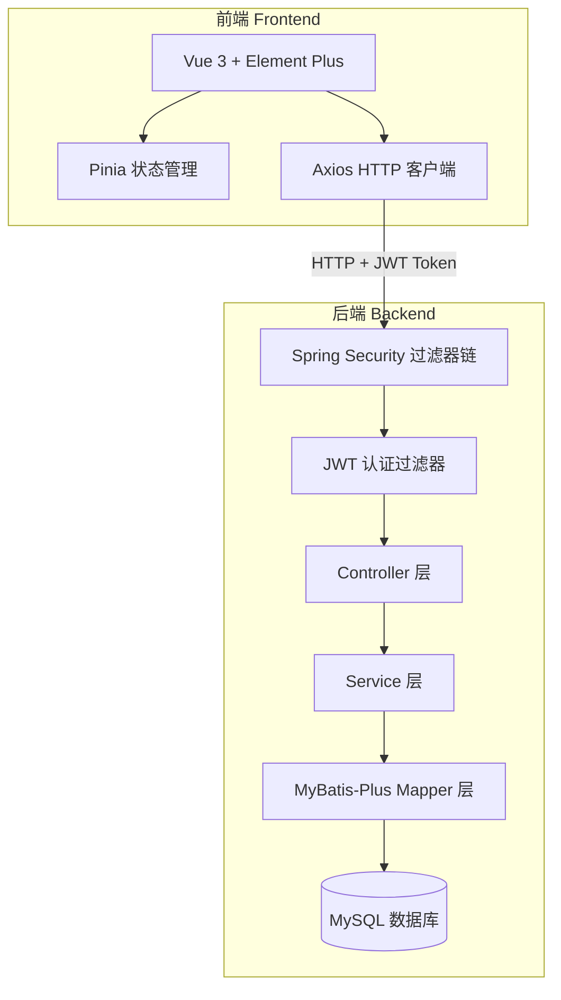
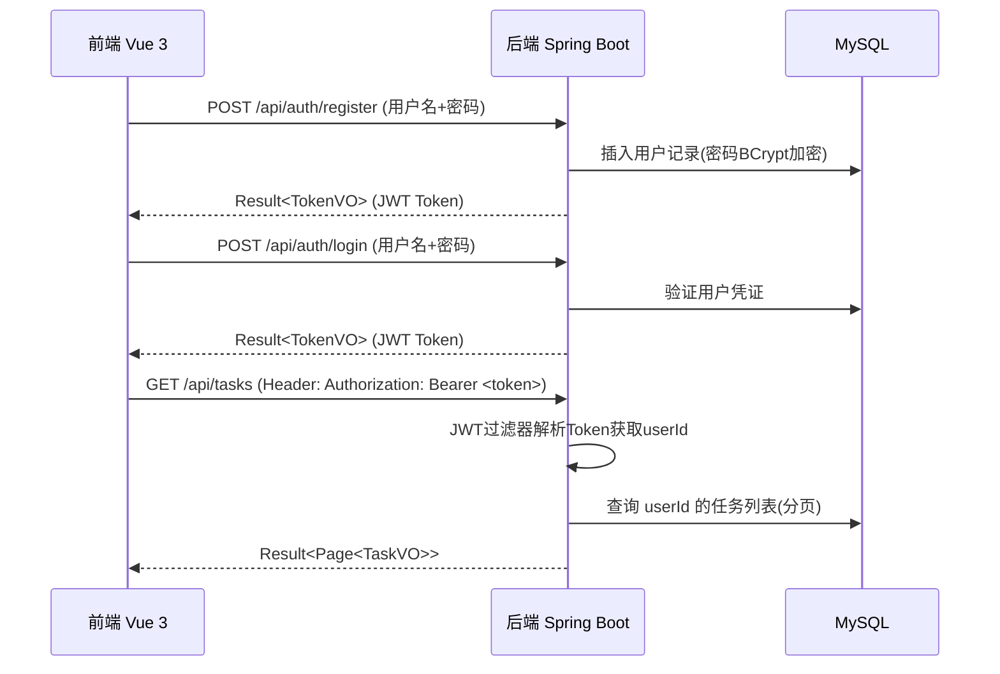

RAG 搜索结果与本项目技术栈无直接关联（返回的是微信支付、TRTC、TDesign、地图等无关内容）。所有可用知识库已全部搜索完毕，均无相关技术内容。

**最终探索结论（完整）：**

1. **工作区状态**：`c:\dev\code\ai_code\codebuddy_test1\` - 空目录，全新项目
2. **用户需求**：极简任务管理系统，前后端分离架构
3. **技术栈**：

- 后端：Spring Boot 3.x + Spring Security + JWT + MyBatis-Plus + MySQL
- 前端：Vue 3 + Element Plus + Pinia + Axios

4. **核心功能**：用户注册登录、任务 CRUD、状态筛选、用户数据隔离
5. **规则确认**：Result<T> 统一响应格式（code/message/data）、代码规范（4空格Java/2空格前端/中文注释/单引号JS/Conventional Commits）
6. **知识库搜索**：所有 7 个可用知识库均已搜索，均无相关内容（微信生态相关）
7. **可用扩展**：无相关扩展可用于本项目

无需进一步探索。现在直接输出完整的方案。<plan_result>
<req>

## 产品概述

一个极简任务管理系统（Task Manager），采用前后端分离架构。系统支持用户注册和登录认证，登录后每个用户可以独立管理自己的任务（增删改查），支持按任务状态进行筛选，确保用户之间的数据完全隔离。

## 核心功能

- **用户模块**：用户注册（用户名+密码）、用户登录（返回 JWT Token）、Token 刷新
- **任务模块**：创建任务、修改任务、删除任务、查询任务列表（支持分页）、按状态筛选（待办/进行中/已完成）、任务详情查询
- **数据隔离**：通过 JWT 中的用户 ID 确保每个用户只能操作自己的任务数据
- **统一响应**：后端所有 API 均使用 Result<T> 格式返回（code/message/data）
</req>

<tech>

## Tech Stack

- **后端框架**：Spring Boot 3.x + Spring Security + JWT（jjwt / java-jwt）
- **ORM 框架**：MyBatis-Plus（简化 CRUD 操作，内置分页插件）
- **数据库**：MySQL 8.x
- **前端框架**：Vue 3（Composition API）+ Vite
- **UI 组件库**：Element Plus
- **状态管理**：Pinia
- **HTTP 客户端**：Axios（封装请求/响应拦截器，自动附加 JWT Token）
- **构建工具**：Maven（后端）/ Vite（前端）

## Tech Architecture

### 系统架构

前后端分离架构，后端提供 RESTful API，前端 SPA 单页应用调用 API 完成交互。



### 认证流程



### 数据库设计

- **user 表**：id (BIGINT, 主键, 自增), username (VARCHAR, 唯一), password (VARCHAR, BCrypt加密), nickname (VARCHAR), created_at (DATETIME), updated_at (DATETIME)
- **task 表**：id (BIGINT, 主键, 自增), user_id (BIGINT, 外键), title (VARCHAR), description (TEXT), status (TINYINT, 0待办/1进行中/2已完成), priority (TINYINT, 0低/1中/2高), due_date (DATE), created_at (DATETIME), updated_at (DATETIME)

### API 接口设计

| 方法 | 路径 | 说明 | 认证 |
| --- | --- | --- | --- |
| POST | /api/auth/register | 用户注册 | 否 |
| POST | /api/auth/login | 用户登录 | 否 |
| GET | /api/tasks | 任务列表（分页+筛选） | 是 |
| POST | /api/tasks | 创建任务 | 是 |
| GET | /api/tasks/{id} | 任务详情 | 是 |
| PUT | /api/tasks/{id} | 更新任务 | 是 |
| DELETE | /api/tasks/{id} | 删除任务 | 是 |


### 安全策略

- 密码使用 BCrypt 加密存储
- JWT Token 使用 HS256 算法签名，设置合理过期时间（Access Token 2h, Refresh Token 7d）
- Spring Security 配置：放行 /api/auth/** 路径，其余路径需认证
- MyBatis-Plus 数据权限拦截器：自动追加 `user_id = 当前登录用户ID` 条件

## Implementation Notes

- **统一响应格式**：严格遵守 workspace 规则中的 Result<T> 类定义（code/message/data），Controller 层必须使用 Result.success() / Result.error() 包装返回值
- **代码规范**：后端 Java 使用 4 空格缩进，前端使用 2 空格缩进；注释使用中文；字符串使用单引号（前端）；类名 PascalCase，方法/变量 camelCase，常量 UPPER_SNAKE_CASE
- **性能考虑**：任务列表查询走 MyBatis-Plus 分页插件，避免全量查询；为 task 表的 user_id 和 status 字段建立联合索引
- **CORS 配置**：后端需配置跨域，允许前端开发服务器端口访问
- **JWT 存储**：前端将 Access Token 存储在内存/Pinia 中，Refresh Token 可存 localStorage 用于自动续期
- **爆炸半径控制**：仅操作新建文件，不涉及已有代码变更

## Directory Structure

```
c:\dev\code\ai_code\codebuddy_test1\
├── task-manager-backend/                          # [NEW] Spring Boot 后端项目
│   ├── pom.xml                                    # [NEW] Maven 项目配置文件（Spring Boot 3.x parent + 依赖管理）
│   ├── src/main/java/com/taskmanager/
│   │   ├── TaskManagerApplication.java            # [NEW] Spring Boot 启动类
│   │   ├── common/                                # [NEW] 公共模块
│   │   │   ├── result/                            # [NEW] 统一响应格式
│   │   │   │   └── Result.java                    # [NEW] Result<T> 泛型响应类（code/message/data + success/error 静态方法）
│   │   │   ├── exception/                         # [NEW] 全局异常处理
│   │   │   │   ├── GlobalExceptionHandler.java    # [NEW] 全局异常拦截器，统一返回错误格式
│   │   │   │   └── BusinessException.java         # [NEW] 业务异常类
│   │   │   └── constants/                         # [NEW] 常量定义
│   │   │       └── TaskStatusConstants.java       # [NEW] 任务状态常量（待办/进行中/已完成）
│   │   ├── config/                                # [NEW] 配置类
│   │   │   ├── SecurityConfig.java                # [NEW] Spring Security 配置（密码编码器、CORS、请求授权规则）
│   │   │   ├── MybatisPlusConfig.java             # [NEW] MyBatis-Plus 配置（分页插件、数据权限拦截器）
│   │   │   └── JwtConfig.java                     # [NEW] JWT 工具配置（密钥、过期时间）
│   │   ├── security/                              # [NEW] 安全模块
│   │   │   ├── JwtUtil.java                       # [NEW] JWT 工具类（生成/解析/验证 Token）
│   │   │   ├── JwtAuthenticationFilter.java       # [NEW] JWT 认证过滤器（从请求头提取并验证 Token）
│   │   │   └── UserDetailsServiceImpl.java        # [NEW] UserDetailsService 实现（加载用户详情）
│   │   ├── entity/                                # [NEW] 实体类
│   │   │   ├── User.java                         # [NEW] 用户实体（对应 user 表）
│   │   │   └── Task.java                          # [NEW] 任务实体（对应 task 表）
│   │   ├── dto/                                   # [NEW] 数据传输对象
│   │   │   ├── LoginRequest.java                 # [NEW] 登录请求 DTO（username/password）
│   │   │   ├── RegisterRequest.java              # [NEW] 注册请求 DTO（username/password/nickname）
│   │   │   ├── TaskCreateRequest.java            # [NEW] 创建任务请求 DTO
│   │   │   ├── TaskUpdateRequest.java            # [NEW] 更新任务请求 DTO
│   │   │   └── TokenVO.java                      # [NEW] Token 返回 VO（accessToken/refreshToken）
│   │   ├── vo/                                    # [NEW] 视图对象
│   │   │   ├── TaskVO.java                       # [NEW] 任务视图对象（返回给前端的任务信息）
│   │   │   └── UserVO.java                       # [NEW] 用户视图对象
│   │   ├── mapper/                                # [NEW] MyBatis-Plus Mapper 接口
│   │   │   ├── UserMapper.java                   # [NEW] 用户 Mapper（继承 BaseMapper<User>）
│   │   │   └── TaskMapper.java                   # [NEW] 任务 Mapper（继承 BaseMapper<Task>）
│   │   ├── service/                               # [NEW] 服务层
│   │   │   ├── UserService.java                  # [NEW] 用户服务接口
│   │   │   ├── impl/
│   │   │   │   └── UserServiceImpl.java          # [NEW] 用户服务实现（注册/登录/用户查询）
│   │   │   ├── TaskService.java                  # [NEW] 任务服务接口
│   │   │   └── impl/
│   │   │       └── TaskServiceImpl.java          # [NEW] 任务服务实现（CRUD + 数据隔离）
│   │   └── controller/                            # [NEW] 控制器层
│   │       ├── AuthController.java               # [NEW] 认证控制器（注册/登录接口）
│   │       └── TaskController.java               # [NEW] 任务控制器（任务 CRUD 接口）
│   └── src/main/resources/
│       ├── application.yml                        # [NEW] 应用配置（端口、数据库连接、JWT配置、MyBatis-Plus配置）
│       └── schema.sql                             # [NEW] 数据库初始化脚本（建表语句 + 初始数据）
│
├── task-manager-frontend/                         # [NEW] Vue 3 前端项目
│   ├── package.json                               # [NEW] npm 依赖配置（vue 3, element-plus, pinia, axios, vue-router）
│   ├── vite.config.js                             # [NEW] Vite 构建配置（代理转发到后端 8080 端口）
│   ├── index.html                                 # [NEW] HTML 入口文件
│   ├── public/                                    # [NEW] 静态资源目录
│   └── src/
│       ├── main.js                                # [NEW] 应用入口（引入 Element Plus / Pinia / Router）
│       ├── App.vue                                # [NEW] 根组件
│       ├── router/                                # [NEW] 路由配置
│       │   └── index.js                           # [NEW] 路由定义（登录/任务列表 + 导航守卫）
│       ├── api/                                   # [NEW] API 请求模块
│       │   ├── request.js                         # [NEW] Axios 实例（baseURL、请求/响应拦截器、Token 注入、401 处理）
│       │   ├── auth.js                            # [NEW] 认证相关 API（register/login）
│       │   └── task.js                            # [NEW] 任务相关 API（CRUD 接口封装）
│       ├── stores/                                # [NEW] Pinia 状态管理
│       │   ├── useUserStore.js                    # [NEW] 用户状态（token、userInfo、登录/登出动作）
│       │   └── useTaskStore.js                    # [NEW] 任务状态（任务列表、分页、筛选条件）
│       ├── views/                                 # [NEW] 页面组件
│       │   ├── LoginView.vue                      # [NEW] 登录/注册页面（表单切换）
│       │   └── TaskView.vue                      # [NEW] 任务管理页面（列表+创建/编辑）
│       ├── components/                            # [NEW] 可复用组件
│       │   ├── TaskForm.vue                       # [NEW] 任务表单弹窗组件（创建/编辑共用）
│       │   └── TaskCard.vue                       # [NEW] 任务卡片组件（展示单个任务信息）
│       ├── utils/                                 # [NEW] 工具函数
│       │   └── auth.js                            # [NEW] Token 存取工具函数
│       └── assets/                                # [NEW] 资源文件
│           └── styles/                            # [NEW] 全局样式
│               └── global.css                     # [NEW] 全局 CSS 变量和通用样式
```

## Key Code Structures

```java
// 统一响应格式 - 严格遵循 workspace 规则
public class Result<T> {
    private int code;
    private String message;
    private T data;
    
    public static <T> Result<T> success(T data) { ... }
    public static <T> Result<T> error(int code, String message) { ... }
}

// 数据权限拦截器核心逻辑 - 确保用户数据隔离
// 在 MyBatis-Plus 配置中添加拦截器，自动为 Task 查询追加 user_id = currentUserId 条件
```

</tech>

<design framework="Vue" component="Element Plus">
<description>

## 设计风格

采用现代简约的中后台管理系统风格，以清新蓝色为主色调，搭配白色背景和浅灰色卡片区域。整体布局清晰直观，强调功能性同时保持视觉舒适度。使用圆角卡片、柔和阴影、流畅过渡动画提升用户体验。

## 应用类型

Web（桌面端），面向后台管理的单页应用。

## 页面规划

共 2 个核心页面：

### 页面 1：登录/注册页（LoginView）

- **顶部导航块**：简洁的系统 Logo 和名称 "Task Manager"，居中展示
- **登录/注册表单块**：卡片容器内包含 Tab 切换（登录/注册），表单项包括用户名输入框、密码输入框，登录按钮，底部 "忘记密码" 链接（预留）。使用 Element Plus 的 ElForm 进行表单校验
- **底部版权块**：简短的版权信息文字

### 页面 2：任务管理页（TaskView）

- **顶部导航栏块**：左侧 Logo + 系统名称，右侧显示当前用户昵称 + 退出登录按钮
- **工具栏块**：搜索框（按标题搜索）+ 状态筛选下拉框（全部/待办/进行中/已完成）+ 新建任务按钮（主色调醒目按钮）
- **任务列表块**：使用 ElTable 表格或 ElCard 卡片网格展示任务，每条任务显示标题、优先级标签（不同颜色区分）、状态标签、截止日期、操作按钮（编辑/删除）。支持分页（ElPagination）
- **任务弹窗块**：点击新建/编辑时弹出 ElDialog 对话框，包含任务标题输入框、描述文本域、优先级选择器、状态选择器、截止日期选择器、确定/取消按钮
</description>

<style_keywords>
<keyword>Modern Minimalism</keyword>
<keyword>Clean Interface</keyword>
<keyword>Rounded Card</keyword>
<keyword>Soft Shadow</keyword>
<keyword>Smooth Transition</keyword>
</style_keywords>

<font_system fontFamily="PingFang SC">
<heading size="24px" weight="600"></heading>
<subheading size="18px" weight="500"></subheading>
<body size="14px" weight="400"></body>
</font_system>

<color_system>
<primary_colors>
<color>#409EFF</color>
<color>#337ECC</color>
<color>#66B1FF</color>
</primary_colors>
<background_colors>
<color>#F5F7FA</color>
<color>#FFFFFF</color>
</background_colors>
<text_colors>
<color>#303133</color>
<color>#606266</color>
<color>#909399</color>
</text_colors>
<functional_colors>
<color>#67C23A</color>
<color>#E6A23C</color>
<color>#F56C6C</color>
</functional_colors>
</color_system>
</design>

<extensions>
</extensions>

<todolist>
<item id="init-backend-project" deps="">初始化 Spring Boot 后端项目骨架（pom.xml + 目录结构 + application.yml + 启动类）</item>
<item id="impl-common-security-layer" deps="init-backend-project">实现公共层和安全层（Result类/JWT工具/SecurityConfig/全局异常处理）</item>
<item id="impl-backend-entity-api" deps="impl-common-security-layer">实现后端实体/Mapper/Service/Controller 全套代码及数据库脚本</item>
<item id="init-frontend-project" deps="">初始化 Vue 3 前端项目（Vite + Element Plus + Pinia + Router + Axios 封装）</item>
<item id="impl-frontend-pages" deps="init-frontend-project">实现前端页面（登录注册页 + 任务管理页 + 任务弹窗组件 + 状态管理 Store）</item>
</todolist>
</plan_result>