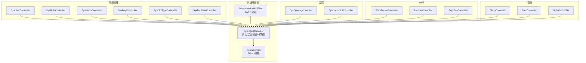
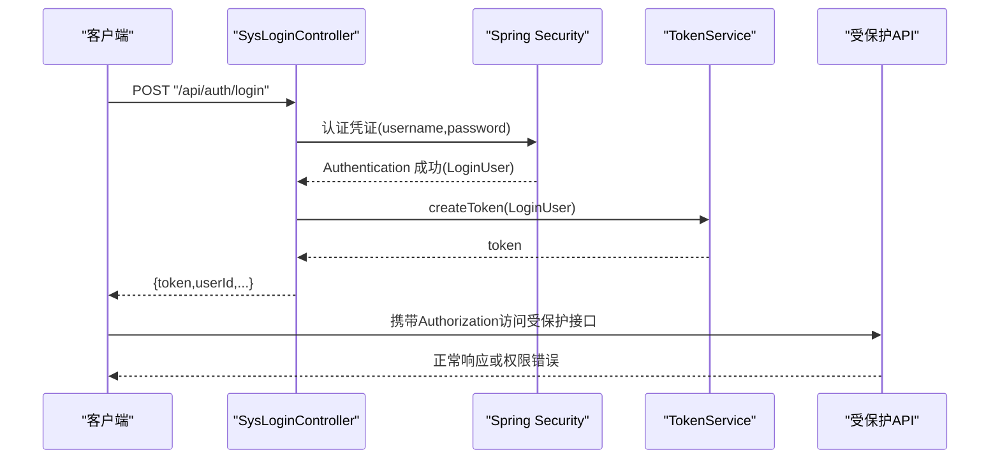
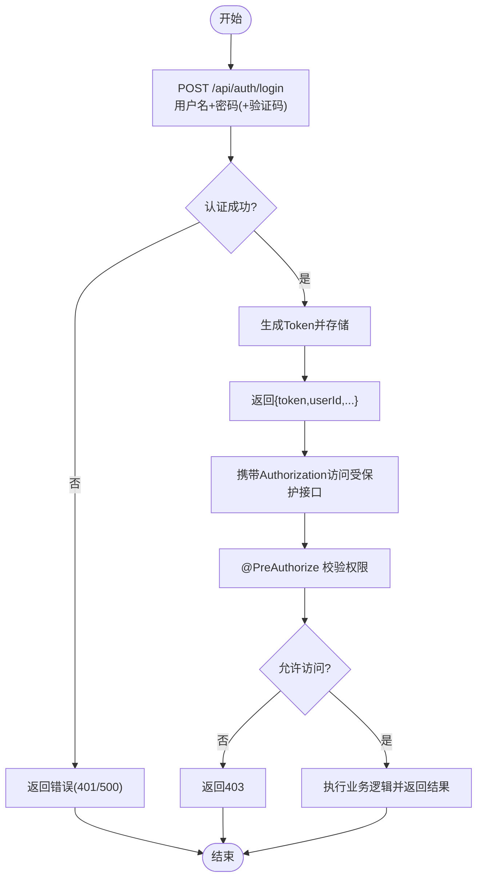
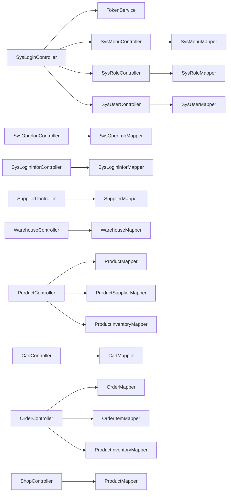

# API接口文档

<cite>
**本文引用的文件**
- [SysLoginController.java](file://task-manager-backend/src/main/java/com/taskmanager/controller/SysLoginController.java)
- [SysUserController.java](file://task-manager-backend/src/main/java/com/taskmanager/controller/SysUserController.java)
- [SysRoleController.java](file://task-manager-backend/src/main/java/com/taskmanager/controller/SysRoleController.java)
- [SysMenuController.java](file://task-manager-backend/src/main/java/com/taskmanager/controller/SysMenuController.java)
- [SysDeptController.java](file://task-manager-backend/src/main/java/com/taskmanager/controller/SysDeptController.java)
- [SysDictTypeController.java](file://task-manager-backend/src/main/java/com/taskmanager/controller/SysDictTypeController.java)
- [SysDictDataController.java](file://task-manager-backend/src/main/java/com/taskmanager/controller/SysDictDataController.java)
- [SysOperlogController.java](file://task-manager-backend/src/main/java/com/taskmanager/controller/SysOperlogController.java)
- [SysLogininforController.java](file://task-manager-backend/src/main/java/com/taskmanager/controller/SysLogininforController.java)
- [SupplierController.java](file://task-manager-backend/src/main/java/com/taskmanager/controller/SupplierController.java)
- [WarehouseController.java](file://task-manager-backend/src/main/java/com/taskmanager/controller/WarehouseController.java)
- [ProductController.java](file://task-manager-backend/src/main/java/com/taskmanager/controller/ProductController.java)
- [OrderController.java](file://task-manager-backend/src/main/java/com/taskmanager/controller/OrderController.java)
- [CartController.java](file://task-manager-backend/src/main/java/com/taskmanager/controller/CartController.java)
- [ShopController.java](file://task-manager-backend/src/main/java/com/taskmanager/controller/ShopController.java)
</cite>

## 目录
1. [简介](#简介)
2. [项目结构](#项目结构)
3. [核心组件](#核心组件)
4. [架构总览](#架构总览)
5. [详细组件分析](#详细组件分析)
6. [依赖分析](#依赖分析)
7. [性能考虑](#性能考虑)
8. [故障排除指南](#故障排除指南)
9. [结论](#结论)
10. [附录](#附录)

## 简介
本文件为 CodeBuddy 任务管理系统提供的完整 API 接口文档，覆盖认证与授权、系统管理（用户、角色、菜单、部门、字典）、监控（操作日志、登录日志）、供应商管理、仓储管理以及电商模块（商品、购物车、订单、商店）的 RESTful 接口规范。文档包含每个端点的 HTTP 方法、URL 模式、请求参数、响应格式、状态码含义、认证流程说明、调用示例与错误处理建议，并提供权限控制的最佳实践。

## 项目结构
后端采用 Spring Boot + MyBatis-Plus 架构，按功能域划分控制器层，统一通过 Result 包装响应，使用 Spring Security + JWT 进行认证与权限控制。前端通过拦截器注入认证头，后端通过过滤器解析 Token 并校验权限。

图表来源
- [SysLoginController.java:31-327](file://task-manager-backend/src/main/java/com/taskmanager/controller/SysLoginController.java#L31-L327)
- [SysUserController.java:20-132](file://task-manager-backend/src/main/java/com/taskmanager/controller/SysUserController.java#L20-L132)
- [SysRoleController.java:19-83](file://task-manager-backend/src/main/java/com/taskmanager/controller/SysRoleController.java#L19-L83)
- [SysMenuController.java:19-86](file://task-manager-backend/src/main/java/com/taskmanager/controller/SysMenuController.java#L19-L86)
- [SysDeptController.java:19-85](file://task-manager-backend/src/main/java/com/taskmanager/controller/SysDeptController.java#L19-L85)
- [SysDictTypeController.java:19-78](file://task-manager-backend/src/main/java/com/taskmanager/controller/SysDictTypeController.java#L19-L78)
- [SysDictDataController.java:19-88](file://task-manager-backend/src/main/java/com/taskmanager/controller/SysDictDataController.java#L19-L88)
- [SysOperlogController.java:18-80](file://task-manager-backend/src/main/java/com/taskmanager/controller/SysOperlogController.java#L18-L80)
- [SysLogininforController.java:17-87](file://task-manager-backend/src/main/java/com/taskmanager/controller/SysLogininforController.java#L17-L87)
- [WarehouseController.java:29-190](file://task-manager-backend/src/main/java/com/taskmanager/controller/WarehouseController.java#L29-L190)
- [ProductController.java:34-237](file://task-manager-backend/src/main/java/com/taskmanager/controller/ProductController.java#L34-L237)
- [SupplierController.java:29-201](file://task-manager-backend/src/main/java/com/taskmanager/controller/SupplierController.java#L29-L201)
- [ShopController.java:22-93](file://task-manager-backend/src/main/java/com/taskmanager/controller/ShopController.java#L22-L93)
- [CartController.java:23-134](file://task-manager-backend/src/main/java/com/taskmanager/controller/CartController.java#L23-L134)
- [OrderController.java:37-303](file://task-manager-backend/src/main/java/com/taskmanager/controller/OrderController.java#L37-L303)

章节来源
- [SysLoginController.java:31-327](file://task-manager-backend/src/main/java/com/taskmanager/controller/SysLoginController.java#L31-L327)

## 核心组件
- 认证与路由：提供登录、登出、验证码、获取当前用户信息、动态路由等接口，支持管理员与普通用户差异化菜单树。
- 系统管理：用户、角色、菜单、部门、字典类型与数据的 CRUD 与分页查询。
- 监控：操作日志与登录日志的分页查询、详情、批量删除与清空。
- WMS：供应商、仓库、商品的增删改查、导入导出、模板下载。
- 电商：公开商品查询与详情、购物车增删改、订单提交/取消、登录态下单。

章节来源
- [SysLoginController.java:31-327](file://task-manager-backend/src/main/java/com/taskmanager/controller/SysLoginController.java#L31-L327)
- [SysUserController.java:20-132](file://task-manager-backend/src/main/java/com/taskmanager/controller/SysUserController.java#L20-L132)
- [SysOperlogController.java:18-80](file://task-manager-backend/src/main/java/com/taskmanager/controller/SysOperlogController.java#L18-L80)
- [SupplierController.java:29-201](file://task-manager-backend/src/main/java/com/taskmanager/controller/SupplierController.java#L29-L201)
- [WarehouseController.java:29-190](file://task-manager-backend/src/main/java/com/taskmanager/controller/WarehouseController.java#L29-L190)
- [ProductController.java:34-237](file://task-manager-backend/src/main/java/com/taskmanager/controller/ProductController.java#L34-L237)
- [OrderController.java:37-303](file://task-manager-backend/src/main/java/com/taskmanager/controller/OrderController.java#L37-L303)
- [CartController.java:23-134](file://task-manager-backend/src/main/java/com/taskmanager/controller/CartController.java#L23-L134)
- [ShopController.java:22-93](file://task-manager-backend/src/main/java/com/taskmanager/controller/ShopController.java#L22-L93)

## 架构总览
认证流程从登录获取 Token 开始，后续请求携带 Authorization 头，后端通过过滤器解析并校验权限，再进入对应控制器处理业务。

图表来源
- [SysLoginController.java:103-135](file://task-manager-backend/src/main/java/com/taskmanager/controller/SysLoginController.java#L103-L135)

章节来源
- [SysLoginController.java:103-135](file://task-manager-backend/src/main/java/com/taskmanager/controller/SysLoginController.java#L103-L135)

## 详细组件分析

### 认证与授权接口
- 登录
  - 方法与路径：POST /api/auth/login
  - 请求体：用户名、密码、可选验证码uuid与code
  - 响应：token、userId、userName、nickName
  - 状态码：200 成功；500 验证码错误或认证失败
- 注册
  - 方法与路径：POST /api/auth/register
  - 请求体：用户名、密码、昵称、手机号
  - 响应：成功/失败
  - 状态码：200 成功；错误提示
- 获取验证码
  - 方法与路径：GET /api/auth/captcha
  - 响应：验证码图片与uuid
- 登出
  - 方法与路径：POST /api/auth/logout
  - 响应：成功
- 获取当前用户信息
  - 方法与路径：GET /api/auth/getInfo
  - 响应：用户、角色列表、权限列表
  - 状态码：401 未登录或过期
- 获取动态路由
  - 方法与路径：GET /api/auth/getRouters
  - 响应：菜单树（前端路由格式）
  - 状态码：401 未登录或过期

章节来源
- [SysLoginController.java:62-197](file://task-manager-backend/src/main/java/com/taskmanager/controller/SysLoginController.java#L62-L197)

### 系统管理接口

#### 用户管理
- 列表查询
  - 方法与路径：GET /api/system/user/list
  - 参数：pageNum、pageSize、userName、phonenumber、status、deptId
  - 响应：分页数据
- 获取详情
  - 方法与路径：GET /api/system/user/{userId}
- 新增用户
  - 方法与路径：POST /api/system/user
  - 请求体：用户信息（密码会被加密）
- 修改用户
  - 方法与路径：PUT /api/system/user
  - 请求体：用户信息（若提供新密码则加密更新）
- 删除用户
  - 方法与路径：DELETE /api/system/user/{userIds}
  - 行为：逻辑删除（delFlag=2）
- 重置密码
  - 方法与路径：PUT /api/system/user/resetPwd
  - 请求体：userId
  - 响应：提示信息
- 修改状态
  - 方法与路径：PUT /api/system/user/changeStatus
  - 请求体：用户状态

章节来源
- [SysUserController.java:33-130](file://task-manager-backend/src/main/java/com/taskmanager/controller/SysUserController.java#L33-L130)

#### 角色管理
- 列表查询
  - 方法与路径：GET /api/system/role/list
  - 参数：pageNum、pageSize、roleName、roleKey、status
  - 响应：分页数据
- 获取详情
  - 方法与路径：GET /api/system/role/{roleId}
- 新增角色
  - 方法与路径：POST /api/system/role
  - 请求体：角色信息（默认dataScope=1）
- 修改角色
  - 方法与路径：PUT /api/system/role
- 删除角色
  - 方法与路径：DELETE /api/system/role/{roleIds}
  - 行为：逻辑删除（delFlag=2）

章节来源
- [SysRoleController.java:29-81](file://task-manager-backend/src/main/java/com/taskmanager/controller/SysRoleController.java#L29-L81)

#### 菜单管理
- 列表查询（平铺）
  - 方法与路径：GET /api/system/menu/list
- 菜单树（用于权限分配）
  - 方法与路径：GET /api/system/menu/treeSelect
- 获取详情
  - 方法与路径：GET /api/system/menu/{menuId}
- 新增菜单
  - 方法与路径：POST /api/system/menu
  - 请求体：菜单信息（默认visible=0，status=0）
- 修改菜单
  - 方法与路径：PUT /api/system/menu
- 删除菜单
  - 方法与路径：DELETE /api/system/menu/{menuId}
  - 行为：存在子菜单时拒绝删除（物理删除）

章节来源
- [SysMenuController.java:27-84](file://task-manager-backend/src/main/java/com/taskmanager/controller/SysMenuController.java#L27-L84)

#### 部门管理
- 部门树
  - 方法与路径：GET /api/system/dept/list
- 获取详情
  - 方法与路径：GET /api/system/dept/{deptId}
- 新增部门
  - 方法与路径：POST /api/system/dept
  - 请求体：部门信息（parentId为0时ancestors=0）
- 修改部门
  - 方法与路径：PUT /api/system/dept
- 删除部门
  - 方法与路径：DELETE /api/system/dept/{deptId}
  - 行为：存在下级部门时拒绝删除（逻辑删除）

章节来源
- [SysDeptController.java:27-83](file://task-manager-backend/src/main/java/com/taskmanager/controller/SysDeptController.java#L27-L83)

#### 字典类型管理
- 列表查询
  - 方法与路径：GET /api/system/dict/type/list
  - 参数：dictName、dictType、status
- 获取详情
  - 方法与路径：GET /api/system/dict/type/{dictId}
- 新增类型
  - 方法与路径：POST /api/system/dict/type
  - 请求体：字典类型（默认status=0）
- 修改类型
  - 方法与路径：PUT /api/system/dict/type
- 删除类型
  - 方法与路径：DELETE /api/system/dict/type/{dictIds}

章节来源
- [SysDictTypeController.java:27-76](file://task-manager-backend/src/main/java/com/taskmanager/controller/SysDictTypeController.java#L27-L76)

#### 字典数据管理
- 列表查询
  - 方法与路径：GET /api/system/dict/data/list
  - 参数：pageNum、pageSize、dictType
- 按类型查询（公开）
  - 方法与路径：GET /api/system/dict/data/type/{dictType}
- 获取详情
  - 方法与路径：GET /api/system/dict/data/{dictCode}
- 新增数据
  - 方法与路径：POST /api/system/dict/data
  - 请求体：字典数据（默认status=0，isDefault=N）
- 修改数据
  - 方法与路径：PUT /api/system/dict/data
- 删除数据
  - 方法与路径：DELETE /api/system/dict/data/{dictCodes}

章节来源
- [SysDictDataController.java:27-86](file://task-manager-backend/src/main/java/com/taskmanager/controller/SysDictDataController.java#L27-L86)

### 监控接口

#### 操作日志
- 列表查询
  - 方法与路径：GET /api/monitor/operlog/list
  - 参数：module、businessType、operName、status
  - 响应：分页数据
- 获取详情
  - 方法与路径：GET /api/monitor/operlog/{operId}
- 批量删除
  - 方法与路径：DELETE /api/monitor/operlog/{operIds}
- 清空日志
  - 方法与路径：DELETE /api/monitor/operlog/clean

章节来源
- [SysOperlogController.java:25-78](file://task-manager-backend/src/main/java/com/taskmanager/controller/SysOperlogController.java#L25-L78)

#### 登录日志
- 列表查询
  - 方法与路径：GET /api/monitor/logininfor/list
  - 参数：userName、ipaddr、status
  - 响应：分页数据
- 获取详情
  - 方法与路径：GET /api/monitor/logininfor/{infoId}
- 批量删除
  - 方法与路径：DELETE /api/monitor/logininfor/{infoIds}
- 清空日志
  - 方法与路径：DELETE /api/monitor/logininfor/clean
- 账号解锁（预留）
  - 方法与路径：GET /api/monitor/logininfor/unlock/{userName}

章节来源
- [SysLogininforController.java:25-85](file://task-manager-backend/src/main/java/com/taskmanager/controller/SysLogininforController.java#L25-L85)

### 供应商管理接口
- 列表查询
  - 方法与路径：GET /api/system/supplier/list
  - 参数：companyName、province（逗号分隔）、contactPerson、category（逗号分隔）、contactStatus
  - 响应：分页数据
- 获取详情
  - 方法与路径：GET /api/system/supplier/{supplierId}
- 新增供应商
  - 方法与路径：POST /api/system/supplier
  - 请求体：供应商信息（默认delFlag=0）
- 修改供应商
  - 方法与路径：PUT /api/system/supplier
- 删除供应商
  - 方法与路径：DELETE /api/system/supplier/{supplierIds}
  - 行为：逻辑删除（delFlag=2）
- 导出Excel
  - 方法与路径：POST /api/system/supplier/export
  - 参数：companyName、province、contactPerson、category、contactStatus
- 导入Excel
  - 方法与路径：POST /api/system/supplier/import
  - 参数：file（multipart）
- 下载导入模板
  - 方法与路径：POST /api/system/supplier/template

章节来源
- [SupplierController.java:48-200](file://task-manager-backend/src/main/java/com/taskmanager/controller/SupplierController.java#L48-L200)

### 仓储管理接口

#### 仓库管理
- 列表查询
  - 方法与路径：GET /api/wms/warehouse/list
  - 参数：warehouseName、warehouseCode、province（逗号分隔）、warehouseType、status
  - 响应：分页数据
- 获取所有正常仓库
  - 方法与路径：GET /api/wms/warehouse/listAll
- 获取详情
  - 方法与路径：GET /api/wms/warehouse/{warehouseId}
- 新增仓库
  - 方法与路径：POST /api/wms/warehouse
  - 请求体：仓库信息（默认delFlag=0）
- 修改仓库
  - 方法与路径：PUT /api/wms/warehouse
- 删除仓库
  - 方法与路径：DELETE /api/wms/warehouse/{warehouseIds}
  - 行为：逻辑删除（delFlag=2）
- 导出Excel
  - 方法与路径：POST /api/wms/warehouse/export
  - 参数：warehouseName、warehouseCode、province、warehouseType、status
- 导入Excel
  - 方法与路径：POST /api/wms/warehouse/import
  - 参数：file（multipart）
- 下载导入模板
  - 方法与路径：POST /api/wms/warehouse/template

章节来源
- [WarehouseController.java:39-189](file://task-manager-backend/src/main/java/com/taskmanager/controller/WarehouseController.java#L39-L189)

#### 商品管理
- 列表查询
  - 方法与路径：GET /api/wms/product/list
  - 参数：productName、skuCode、status、minPrice、maxPrice
  - 响应：分页数据
- 获取详情
  - 方法与路径：GET /api/wms/product/{productId}
  - 响应：商品+供应商列表+库存列表
- 新增商品
  - 方法与路径：POST /api/wms/product
  - 请求体：商品+供应商列表+库存列表
- 修改商品
  - 方法与路径：PUT /api/wms/product
  - 请求体：商品+供应商列表+库存列表（先逻辑删除旧关联再插入新关联）
- 删除商品
  - 方法与路径：DELETE /api/wms/product/{productIds}
  - 行为：逻辑删除（delFlag=2），并清理关联
- 导出Excel
  - 方法与路径：POST /api/wms/product/export
  - 参数：productName、skuCode、status、minPrice、maxPrice
- 导入Excel
  - 方法与路径：POST /api/wms/product/import
  - 参数：file（multipart）
- 下载导入模板
  - 方法与路径：POST /api/wms/product/template

章节来源
- [ProductController.java:48-236](file://task-manager-backend/src/main/java/com/taskmanager/controller/ProductController.java#L48-L236)

### 电商模块接口

#### 商店（公开）
- 商品列表
  - 方法与路径：GET /api/shop/products
  - 参数：pageNum、pageSize、productName、minPrice、maxPrice
  - 响应：分页数据（仅返回上架且未删除商品）
- 商品详情
  - 方法与路径：GET /api/shop/products/{productId}
  - 响应：商品+总库存

章节来源
- [ShopController.java:32-91](file://task-manager-backend/src/main/java/com/taskmanager/controller/ShopController.java#L32-L91)

#### 购物车（登录）
- 获取列表
  - 方法与路径：GET /api/shop/cart/list
- 添加商品
  - 方法与路径：POST /api/shop/cart/add
  - 请求体：productId、quantity
- 修改数量
  - 方法与路径：PUT /api/shop/cart/update
  - 请求体：cartId、quantity
- 删除项
  - 方法与路径：DELETE /api/shop/cart/{cartIds}
  - 参数：逗号分隔的cartId字符串

章节来源
- [CartController.java:33-123](file://task-manager-backend/src/main/java/com/taskmanager/controller/CartController.java#L33-L123)

#### 订单（登录）
- 提交订单
  - 方法与路径：POST /api/shop/order/submit
  - 请求体：cartIds、收货人、电话、地址、备注
  - 流程：校验购物车项→生成订单号→扣减库存→创建订单与明细→删除购物车项
- 我的订单列表
  - 方法与路径：GET /api/shop/order/list
  - 参数：pageNum、pageSize
- 订单详情
  - 方法与路径：GET /api/shop/order/{orderId}
- 取消订单
  - 方法与路径：PUT /api/shop/order/cancel/{orderId}
  - 流程：校验订单状态→更新状态→恢复库存

章节来源
- [OrderController.java:56-232](file://task-manager-backend/src/main/java/com/taskmanager/controller/OrderController.java#L56-L232)

### 认证流程与权限控制

图表来源
- [SysLoginController.java:103-135](file://task-manager-backend/src/main/java/com/taskmanager/controller/SysLoginController.java#L103-L135)
- [SysUserController.java:33-130](file://task-manager-backend/src/main/java/com/taskmanager/controller/SysUserController.java#L33-L130)

章节来源
- [SysLoginController.java:103-135](file://task-manager-backend/src/main/java/com/taskmanager/controller/SysLoginController.java#L103-L135)
- [SysUserController.java:33-130](file://task-manager-backend/src/main/java/com/taskmanager/controller/SysUserController.java#L33-L130)

## 依赖分析

图表来源
- [SysLoginController.java:35-57](file://task-manager-backend/src/main/java/com/taskmanager/controller/SysLoginController.java#L35-L57)
- [SysUserController.java:24-28](file://task-manager-backend/src/main/java/com/taskmanager/controller/SysUserController.java#L24-L28)
- [SysOperlogController.java:22-23](file://task-manager-backend/src/main/java/com/taskmanager/controller/SysOperlogController.java#L22-L23)
- [SupplierController.java:33-34](file://task-manager-backend/src/main/java/com/taskmanager/controller/SupplierController.java#L33-L34)
- [WarehouseController.java:33-34](file://task-manager-backend/src/main/java/com/taskmanager/controller/WarehouseController.java#L33-L34)
- [ProductController.java:38-45](file://task-manager-backend/src/main/java/com/taskmanager/controller/ProductController.java#L38-L45)
- [OrderController.java:41-54](file://task-manager-backend/src/main/java/com/taskmanager/controller/OrderController.java#L41-L54)
- [CartController.java:27-31](file://task-manager-backend/src/main/java/com/taskmanager/controller/CartController.java#L27-L31)
- [ShopController.java:26-30](file://task-manager-backend/src/main/java/com/taskmanager/controller/ShopController.java#L26-L30)

章节来源
- [SysLoginController.java:35-57](file://task-manager-backend/src/main/java/com/taskmanager/controller/SysLoginController.java#L35-L57)
- [SysUserController.java:24-28](file://task-manager-backend/src/main/java/com/taskmanager/controller/SysUserController.java#L24-L28)
- [SysOperlogController.java:22-23](file://task-manager-backend/src/main/java/com/taskmanager/controller/SysOperlogController.java#L22-L23)
- [SupplierController.java:33-34](file://task-manager-backend/src/main/java/com/taskmanager/controller/SupplierController.java#L33-L34)
- [WarehouseController.java:33-34](file://task-manager-backend/src/main/java/com/taskmanager/controller/WarehouseController.java#L33-L34)
- [ProductController.java:38-45](file://task-manager-backend/src/main/java/com/taskmanager/controller/ProductController.java#L38-L45)
- [OrderController.java:41-54](file://task-manager-backend/src/main/java/com/taskmanager/controller/OrderController.java#L41-L54)
- [CartController.java:27-31](file://task-manager-backend/src/main/java/com/taskmanager/controller/CartController.java#L27-L31)
- [ShopController.java:26-30](file://task-manager-backend/src/main/java/com/taskmanager/controller/ShopController.java#L26-L30)

## 性能考虑
- 分页查询：所有列表接口均支持分页，建议前端设置合理 pageSize 并进行懒加载。
- 缓存与并发：商品下单涉及库存扣减，建议在数据库层面使用行级锁或乐观锁保证一致性。
- 导入导出：Excel 导入采用流式读取，建议限制单次导入条数并提供进度反馈。
- 日志清理：定期清理操作日志与登录日志，避免表膨胀影响查询性能。

## 故障排除指南
- 401 未登录或过期：确认 Authorization 头是否正确传递，Token 是否过期。
- 403 权限不足：确认用户角色与权限标识是否具备相应 @PreAuthorize 注解权限。
- 500 服务器错误：检查请求参数格式、必填字段与业务前置条件（如验证码、库存、子节点存在性）。
- Excel 导入失败：检查模板字段映射、数据类型与唯一性约束，关注返回中的失败行号与原因。

章节来源
- [SysLoginController.java:154-170](file://task-manager-backend/src/main/java/com/taskmanager/controller/SysLoginController.java#L154-L170)
- [SysMenuController.java:72-83](file://task-manager-backend/src/main/java/com/taskmanager/controller/SysMenuController.java#L72-L83)
- [SupplierController.java:154-184](file://task-manager-backend/src/main/java/com/taskmanager/controller/SupplierController.java#L154-L184)
- [WarehouseController.java:145-173](file://task-manager-backend/src/main/java/com/taskmanager/controller/WarehouseController.java#L145-L173)
- [ProductController.java:162-190](file://task-manager-backend/src/main/java/com/taskmanager/controller/ProductController.java#L162-L190)

## 结论
本 API 文档覆盖了认证、系统管理、监控、供应商、仓储与电商模块的完整接口规范。建议在生产环境中：
- 强制开启验证码登录；
- 对敏感接口增加限流与审计；
- 定期清理日志与监控指标；
- 使用 HTTPS 传输并妥善保管 Token。

## 附录

### API 调用示例（通用）
- 登录获取 Token
  - POST /api/auth/login
  - 请求体：{ "userName": "...", "password": "...", "uuid": "...", "code": "...", "rememberMe": false }
  - 响应：{ "code": 200, "msg": "...", "data": { "token": "...", "userId": 123, ... } }
- 访问受保护接口
  - GET /api/system/user/list
  - 请求头：Authorization: Bearer <token>
  - 响应：{ "code": 200, "msg": "...", "data": { "rows": [...], "total": 100 } }

### 错误码约定
- 200：成功
- 400：请求参数错误
- 401：未登录或登录已过期
- 403：权限不足
- 500：服务器内部错误