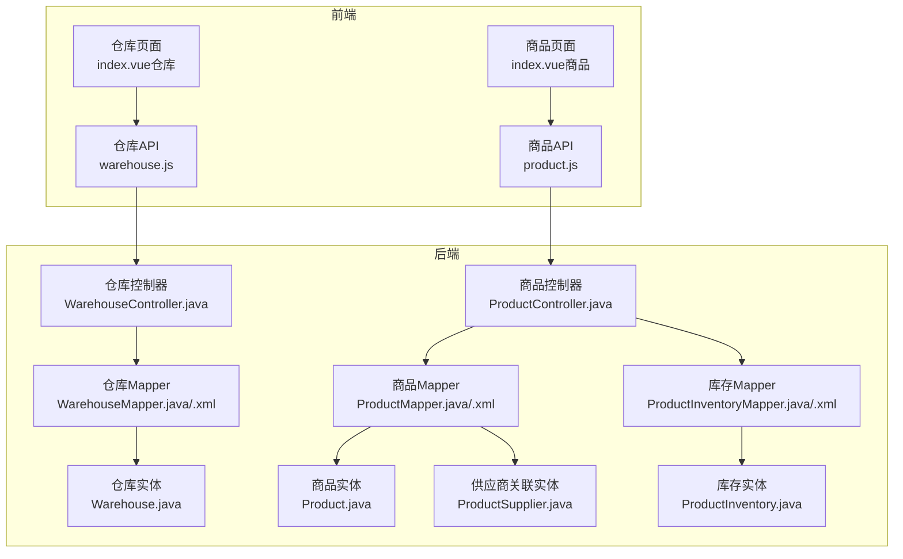
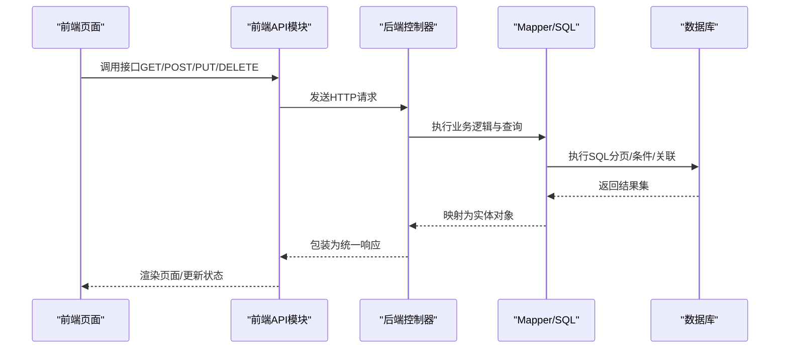
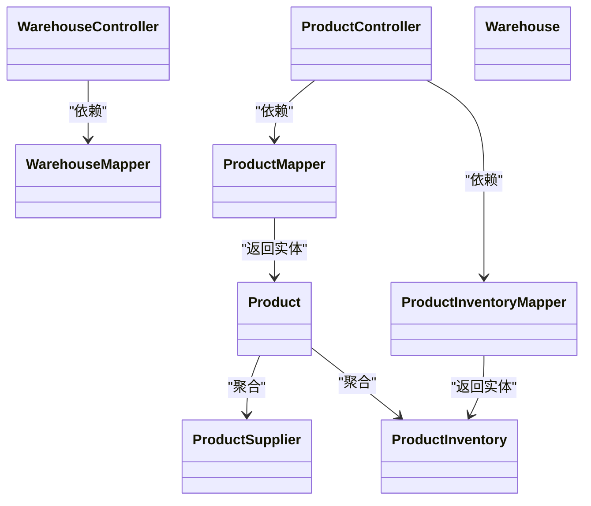
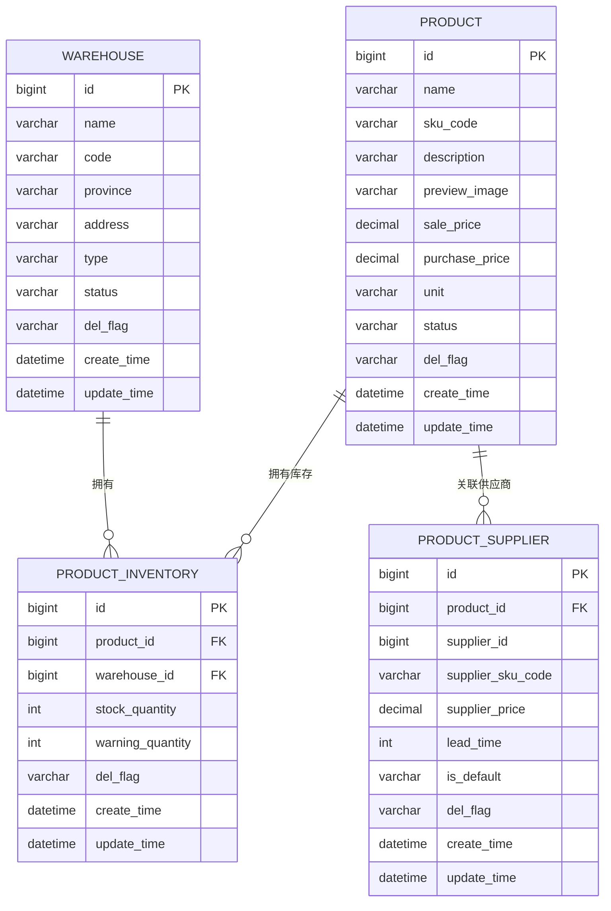
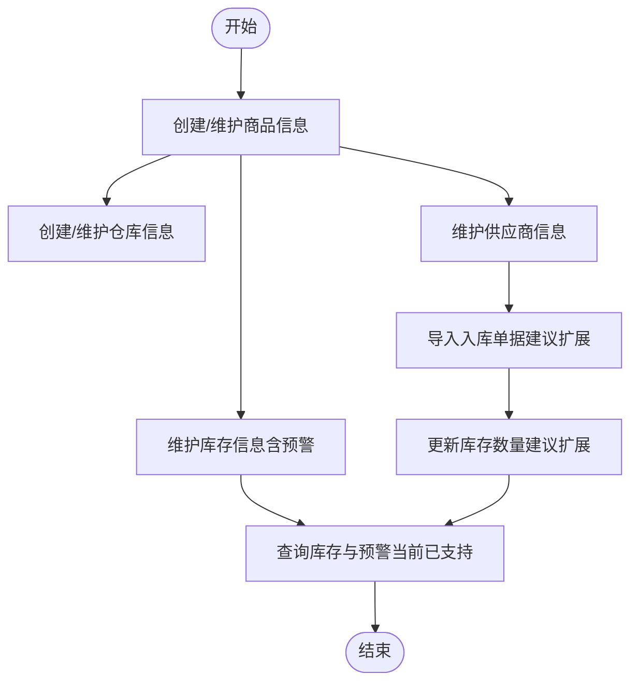

# 仓储管理接口

<cite>
**本文引用的文件**
- [WarehouseController.java](file://task-manager-backend/src/main/java/com/taskmanager/controller/WarehouseController.java)
- [Warehouse.java](file://task-manager-backend/src/main/java/com/taskmanager/domain/Warehouse.java)
- [WarehouseMapper.java](file://task-manager-backend/src/main/java/com/taskmanager/mapper/WarehouseMapper.java)
- [WarehouseMapper.xml](file://task-manager-backend/src/main/resources/mapper/WarehouseMapper.xml)
- [ProductController.java](file://task-manager-backend/src/main/java/com/taskmanager/controller/ProductController.java)
- [Product.java](file://task-manager-backend/src/main/java/com/taskmanager/domain/Product.java)
- [ProductInventory.java](file://task-manager-backend/src/main/java/com/taskmanager/domain/ProductInventory.java)
- [ProductSupplier.java](file://task-manager-backend/src/main/java/com/taskmanager/domain/ProductSupplier.java)
- [ProductMapper.java](file://task-manager-backend/src/main/java/com/taskmanager/mapper/ProductMapper.java)
- [ProductMapper.xml](file://task-manager-backend/src/main/resources/mapper/ProductMapper.xml)
- [ProductInventoryMapper.java](file://task-manager-backend/src/main/java/com/taskmanager/mapper/ProductInventoryMapper.java)
- [ProductInventoryMapper.xml](file://task-manager-backend/src/main/resources/mapper/ProductInventoryMapper.xml)
- [warehouse.js](file://task-manager-frontend/src/api/wms/warehouse.js)
- [product.js](file://task-manager-frontend/src/api/wms/product.js)
- [index.vue（仓库）](file://task-manager-frontend/src/views/wms/warehouse/index.vue)
- [index.vue（商品）](file://task-manager-frontend/src/views/wms/product/index.vue)
</cite>

## 目录
1. [引言](#引言)
2. [项目结构](#项目结构)
3. [核心组件](#核心组件)
4. [架构总览](#架构总览)
5. [详细组件分析](#详细组件分析)
6. [依赖分析](#依赖分析)
7. [性能考虑](#性能考虑)
8. [故障排查指南](#故障排查指南)
9. [结论](#结论)
10. [附录](#附录)

## 引言
本文件面向CodeBuddy任务管理系统中的仓储管理模块，聚焦于仓库与商品两大领域的API接口文档与实现解析。内容覆盖：
- 仓库信息维护：新增、修改、删除、列表查询、导出导入、模板下载
- 商品信息管理：新增、修改、删除、列表查询、详情查询（含供应商与库存）
- 库存查询：按商品维度聚合各仓库库存与预警
- 出入库操作：当前代码未提供出入库接口，建议在后续版本中扩展
- 高级功能：库存预警、批次与有效期管理（当前未实现，建议在后续版本中扩展）

本文件同时提供数据模型、接口定义、调用流程、错误处理与最佳实践，帮助前后端协同开发与运维保障。

## 项目结构
仓储管理模块由后端Spring Boot工程与前端Vue工程组成，采用“控制器-服务-持久层”分层设计，MyBatis-Plus负责ORM映射，前端通过Axios封装的API模块对接后端REST接口。

图表来源
- [WarehouseController.java:1-190](file://task-manager-backend/src/main/java/com/taskmanager/controller/WarehouseController.java#L1-L190)
- [ProductController.java:1-237](file://task-manager-backend/src/main/java/com/taskmanager/controller/ProductController.java#L1-L237)
- [WarehouseMapper.java:1-40](file://task-manager-backend/src/main/java/com/taskmanager/mapper/WarehouseMapper.java#L1-L40)
- [WarehouseMapper.xml:1-56](file://task-manager-backend/src/main/resources/mapper/WarehouseMapper.xml#L1-L56)
- [ProductMapper.java:1-40](file://task-manager-backend/src/main/java/com/taskmanager/mapper/ProductMapper.java#L1-L40)
- [ProductMapper.xml:1-55](file://task-manager-backend/src/main/resources/mapper/ProductMapper.xml#L1-L55)
- [ProductInventoryMapper.java:1-26](file://task-manager-backend/src/main/java/com/taskmanager/mapper/ProductInventoryMapper.java#L1-L26)
- [ProductInventoryMapper.xml:1-39](file://task-manager-backend/src/main/resources/mapper/ProductInventoryMapper.xml#L1-L39)
- [Warehouse.java:1-70](file://task-manager-backend/src/main/java/com/taskmanager/domain/Warehouse.java#L1-L70)
- [Product.java:1-97](file://task-manager-backend/src/main/java/com/taskmanager/domain/Product.java#L1-L97)
- [ProductInventory.java:1-67](file://task-manager-backend/src/main/java/com/taskmanager/domain/ProductInventory.java#L1-L67)
- [ProductSupplier.java:1-71](file://task-manager-backend/src/main/java/com/taskmanager/domain/ProductSupplier.java#L1-L71)
- [warehouse.js:1-52](file://task-manager-frontend/src/api/wms/warehouse.js#L1-L52)
- [product.js:1-47](file://task-manager-frontend/src/api/wms/product.js#L1-L47)
- [index.vue（仓库）:1-428](file://task-manager-frontend/src/views/wms/warehouse/index.vue#L1-L428)
- [index.vue（商品）:1-516](file://task-manager-frontend/src/views/wms/product/index.vue#L1-L516)

章节来源
- [WarehouseController.java:1-190](file://task-manager-backend/src/main/java/com/taskmanager/controller/WarehouseController.java#L1-L190)
- [ProductController.java:1-237](file://task-manager-backend/src/main/java/com/taskmanager/controller/ProductController.java#L1-L237)
- [warehouse.js:1-52](file://task-manager-frontend/src/api/wms/warehouse.js#L1-L52)
- [product.js:1-47](file://task-manager-frontend/src/api/wms/product.js#L1-L47)

## 核心组件
- 仓库管理控制器：提供仓库的CRUD、分页列表、条件筛选、导出导入、模板下载等能力
- 商品管理控制器：提供商品CRUD、详情聚合（供应商、库存）、导出导入、模板下载等能力
- Mapper与XML：定义分页查询、条件过滤、关联查询（库存含仓库名）等SQL逻辑
- 实体类：仓库、商品、库存、供应商关联的字段与非数据库字段（如库存汇总、仓库名等）
- 前端API与页面：封装HTTP请求、字典加载、分页与导入导出交互

章节来源
- [WarehouseController.java:1-190](file://task-manager-backend/src/main/java/com/taskmanager/controller/WarehouseController.java#L1-L190)
- [ProductController.java:1-237](file://task-manager-backend/src/main/java/com/taskmanager/controller/ProductController.java#L1-L237)
- [WarehouseMapper.java:1-40](file://task-manager-backend/src/main/java/com/taskmanager/mapper/WarehouseMapper.java#L1-L40)
- [WarehouseMapper.xml:1-56](file://task-manager-backend/src/main/resources/mapper/WarehouseMapper.xml#L1-L56)
- [ProductMapper.java:1-40](file://task-manager-backend/src/main/java/com/taskmanager/mapper/ProductMapper.java#L1-L40)
- [ProductMapper.xml:1-55](file://task-manager-backend/src/main/resources/mapper/ProductMapper.xml#L1-L55)
- [ProductInventoryMapper.java:1-26](file://task-manager-backend/src/main/java/com/taskmanager/mapper/ProductInventoryMapper.java#L1-L26)
- [ProductInventoryMapper.xml:1-39](file://task-manager-backend/src/main/resources/mapper/ProductInventoryMapper.xml#L1-L39)
- [Warehouse.java:1-70](file://task-manager-backend/src/main/java/com/taskmanager/domain/Warehouse.java#L1-L70)
- [Product.java:1-97](file://task-manager-backend/src/main/java/com/taskmanager/domain/Product.java#L1-L97)
- [ProductInventory.java:1-67](file://task-manager-backend/src/main/java/com/taskmanager/domain/ProductInventory.java#L1-L67)
- [ProductSupplier.java:1-71](file://task-manager-backend/src/main/java/com/taskmanager/domain/ProductSupplier.java#L1-L71)
- [warehouse.js:1-52](file://task-manager-frontend/src/api/wms/warehouse.js#L1-L52)
- [product.js:1-47](file://task-manager-frontend/src/api/wms/product.js#L1-L47)

## 架构总览
后端采用REST风格接口，统一返回包装对象；前端通过API模块发起请求，页面组件负责渲染与交互。数据流从页面到API再到控制器，最终落到Mapper与数据库。

图表来源
- [WarehouseController.java:1-190](file://task-manager-backend/src/main/java/com/taskmanager/controller/WarehouseController.java#L1-L190)
- [ProductController.java:1-237](file://task-manager-backend/src/main/java/com/taskmanager/controller/ProductController.java#L1-L237)
- [WarehouseMapper.xml:1-56](file://task-manager-backend/src/main/resources/mapper/WarehouseMapper.xml#L1-L56)
- [ProductMapper.xml:1-55](file://task-manager-backend/src/main/resources/mapper/ProductMapper.xml#L1-L55)
- [ProductInventoryMapper.xml:1-39](file://task-manager-backend/src/main/resources/mapper/ProductInventoryMapper.xml#L1-L39)
- [warehouse.js:1-52](file://task-manager-frontend/src/api/wms/warehouse.js#L1-L52)
- [product.js:1-47](file://task-manager-frontend/src/api/wms/product.js#L1-L47)

## 详细组件分析

### 仓库管理接口

- 接口概览
  - GET /api/wms/warehouse/list：分页+条件筛选仓库列表
  - GET /api/wms/warehouse/listAll：获取所有正常状态仓库（用于下拉）
  - GET /api/wms/warehouse/{warehouseId}：按ID获取仓库详情
  - POST /api/wms/warehouse：新增仓库（逻辑删除标志初始化为“存在”）
  - PUT /api/wms/warehouse：修改仓库
  - DELETE /api/wms/warehouse/{ids}：批量逻辑删除（更新delFlag为“删除”）
  - POST /api/wms/warehouse/export：导出仓库数据为Excel
  - POST /api/wms/warehouse/import：导入Excel为仓库数据
  - POST /api/wms/warehouse/template：下载导入模板

- 请求参数与响应格式
  - 列表查询参数（GET /list）
    - pageNum：页码，默认1
    - pageSize：每页大小，默认10
    - warehouseName：仓库名称（模糊）
    - warehouseCode：仓库编码（模糊）
    - province：省份（可多选，逗号分隔字符串）
    - warehouseType：仓库类型
    - status：状态
  - 新增/修改请求体：仓库实体字段（见仓库实体）
  - 删除路径参数：多个ID以逗号拼接
  - 导出/导入：导出为Excel二进制流；导入为multipart文件
  - 统一响应：Result<T>，包含状态码、消息与数据

- 业务逻辑说明
  - 列表查询支持多条件组合，省份使用IN子句进行多选匹配
  - 正常状态仓库用于下拉选择时过滤状态为“正常”
  - 删除采用逻辑删除，不物理移除数据
  - 导入/导出基于EasyExcel，支持模板下载与错误统计

- 数据模型与关联
  - 仓库实体字段：仓库ID、名称、编码、省市区、类型、状态、备注、时间戳与删除标志
  - Mapper/SQL：分页查询、条件过滤、排序
  - 前端页面：字典加载（仓库类型、状态）、分页、搜索、导入导出、弹窗编辑

- 错误处理与边界
  - 导入空文件校验与异常捕获，失败行数与原因汇总返回
  - 导出/模板下载设置正确的Content-Type与文件名

章节来源
- [WarehouseController.java:1-190](file://task-manager-backend/src/main/java/com/taskmanager/controller/WarehouseController.java#L1-L190)
- [WarehouseMapper.java:1-40](file://task-manager-backend/src/main/java/com/taskmanager/mapper/WarehouseMapper.java#L1-L40)
- [WarehouseMapper.xml:1-56](file://task-manager-backend/src/main/resources/mapper/WarehouseMapper.xml#L1-L56)
- [Warehouse.java:1-70](file://task-manager-backend/src/main/java/com/taskmanager/domain/Warehouse.java#L1-L70)
- [warehouse.js:1-52](file://task-manager-frontend/src/api/wms/warehouse.js#L1-L52)
- [index.vue（仓库）:1-428](file://task-manager-frontend/src/views/wms/warehouse/index.vue#L1-L428)

### 商品管理接口

- 接口概览
  - GET /api/wms/product/list：分页+条件筛选商品列表
  - GET /api/wms/product/{productId}：获取商品详情（含供应商与库存列表）
  - POST /api/wms/product：新增商品（事务内保存供应商与库存）
  - PUT /api/wms/product：修改商品（先逻辑删除旧关联，再保存新关联）
  - DELETE /api/wms/product/{ids}：批量逻辑删除（含供应商与库存）
  - POST /api/wms/product/export：导出商品数据为Excel
  - POST /api/wms/product/import：导入Excel为商品数据
  - POST /api/wms/product/template：下载导入模板

- 请求参数与响应格式
  - 列表查询参数（GET /list）
    - pageNum/pageSize：分页
    - productName/skuCode：名称/SKU（模糊）
    - status：状态
    - minPrice/maxPrice：价格区间
  - 详情查询：返回商品实体，包含供应商列表与库存列表（非数据库字段）
  - 新增/修改请求体：商品实体+供应商列表+库存列表
  - 删除路径参数：多个ID以逗号拼接
  - 导出/导入：同仓库模块

- 业务逻辑说明
  - 详情聚合：根据productId分别查询供应商与库存列表，并注入到商品对象
  - 新增/修改：事务内保存供应商与库存，确保一致性
  - 删除：对商品、供应商关联、库存记录均执行逻辑删除
  - 导入/导出：基于EasyExcel，模板下载

- 数据模型与关联
  - 商品实体：商品ID、名称、SKU、描述、图片、价格、单位、状态、备注、时间戳与删除标志
  - 供应商关联实体：商品ID、供应商ID、供应商SKU、报价、交货周期、默认标记、备注与时间戳
  - 库存实体：商品ID、仓库ID、库存数量、预警数量、备注与时间戳（非数据库字段包含仓库名/编码）
  - Mapper/SQL：商品分页与条件过滤、按ID查询详情、库存按商品ID关联查询（含仓库名）

- 错误处理与边界
  - 导入空文件校验与异常捕获，失败行数与原因汇总返回
  - 详情查询若为空则直接返回空对象

章节来源
- [ProductController.java:1-237](file://task-manager-backend/src/main/java/com/taskmanager/controller/ProductController.java#L1-L237)
- [ProductMapper.java:1-40](file://task-manager-backend/src/main/java/com/taskmanager/mapper/ProductMapper.java#L1-L40)
- [ProductMapper.xml:1-55](file://task-manager-backend/src/main/resources/mapper/ProductMapper.xml#L1-L55)
- [ProductInventoryMapper.java:1-26](file://task-manager-backend/src/main/java/com/taskmanager/mapper/ProductInventoryMapper.java#L1-L26)
- [ProductInventoryMapper.xml:1-39](file://task-manager-backend/src/main/resources/mapper/ProductInventoryMapper.xml#L1-L39)
- [Product.java:1-97](file://task-manager-backend/src/main/java/com/taskmanager/domain/Product.java#L1-L97)
- [ProductSupplier.java:1-71](file://task-manager-backend/src/main/java/com/taskmanager/domain/ProductSupplier.java#L1-L71)
- [ProductInventory.java:1-67](file://task-manager-backend/src/main/java/com/taskmanager/domain/ProductInventory.java#L1-L67)
- [product.js:1-47](file://task-manager-frontend/src/api/wms/product.js#L1-L47)
- [index.vue（商品）:1-516](file://task-manager-frontend/src/views/wms/product/index.vue#L1-L516)

### 库存查询与预警

- 库存查询
  - 商品详情接口会返回库存列表，其中包含仓库名称与编码（通过LEFT JOIN查询）
  - 库存实体包含库存数量与预警数量字段，可用于前端展示与预警判断

- 库存预警
  - 当前代码未实现库存预警触发逻辑（如低于预警数量时的告警），可在业务层或定时任务中扩展
  - 建议在商品详情或库存列表中增加“预警状态”标识，便于用户快速识别

- 批次与有效期管理
  - 当前代码未实现批次号与有效期字段，可在库存实体或新增库存明细表中扩展
  - 建议引入批次号、生产日期、有效期字段，并在出入库流程中强制校验

章节来源
- [ProductInventoryMapper.xml:1-39](file://task-manager-backend/src/main/resources/mapper/ProductInventoryMapper.xml#L1-L39)
- [ProductInventory.java:1-67](file://task-manager-backend/src/main/java/com/taskmanager/domain/ProductInventory.java#L1-L67)
- [Product.java:1-97](file://task-manager-backend/src/main/java/com/taskmanager/domain/Product.java#L1-L97)

### 出入库操作（当前未实现）
- 现状：后端未提供出入库接口，前端亦未实现对应页面
- 建议：新增出入库控制器与Mapper，定义出入库单据、明细与库存变更规则，确保事务一致性与审计日志

章节来源
- [ProductController.java:1-237](file://task-manager-backend/src/main/java/com/taskmanager/controller/ProductController.java#L1-L237)
- [WarehouseController.java:1-190](file://task-manager-backend/src/main/java/com/taskmanager/controller/WarehouseController.java#L1-L190)

## 依赖分析

图表来源
- [WarehouseController.java:1-190](file://task-manager-backend/src/main/java/com/taskmanager/controller/WarehouseController.java#L1-L190)
- [ProductController.java:1-237](file://task-manager-backend/src/main/java/com/taskmanager/controller/ProductController.java#L1-L237)
- [WarehouseMapper.java:1-40](file://task-manager-backend/src/main/java/com/taskmanager/mapper/WarehouseMapper.java#L1-L40)
- [ProductMapper.java:1-40](file://task-manager-backend/src/main/java/com/taskmanager/mapper/ProductMapper.java#L1-L40)
- [ProductInventoryMapper.java:1-26](file://task-manager-backend/src/main/java/com/taskmanager/mapper/ProductInventoryMapper.java#L1-L26)
- [Warehouse.java:1-70](file://task-manager-backend/src/main/java/com/taskmanager/domain/Warehouse.java#L1-L70)
- [Product.java:1-97](file://task-manager-backend/src/main/java/com/taskmanager/domain/Product.java#L1-L97)
- [ProductInventory.java:1-67](file://task-manager-backend/src/main/java/com/taskmanager/domain/ProductInventory.java#L1-L67)
- [ProductSupplier.java:1-71](file://task-manager-backend/src/main/java/com/taskmanager/domain/ProductSupplier.java#L1-L71)

## 性能考虑
- 分页与条件查询
  - 使用MyBatis分页插件与条件标签，避免一次性加载全量数据
  - 省份多选使用IN子句，建议控制选项数量，避免SQL膨胀
- 关联查询
  - 商品详情的供应商与库存查询应限制数量，避免超大对象
- 导入导出
  - 导出最大记录数限制在XML中已设定，避免内存溢出
  - 导入采用分页监听器逐批写入，提升稳定性
- 前端交互
  - 列表分页与搜索参数合理化，减少不必要的请求

[本节为通用指导，无需列出具体文件来源]

## 故障排查指南
- 导入失败
  - 确认上传文件格式为xlsx/xls
  - 查看返回消息中的失败行数与原因，逐行修正
- 导出空白或乱码
  - 确认后端设置了正确的Content-Type与文件名编码
  - 前端下载时使用Blob与a标签触发下载
- 权限不足
  - 控制器使用权限注解保护，需确保登录用户具备相应菜单权限
- 逻辑删除
  - 删除接口为逻辑删除，查询需过滤delFlag为“存在”，避免显示已删数据

章节来源
- [WarehouseController.java:140-190](file://task-manager-backend/src/main/java/com/taskmanager/controller/WarehouseController.java#L140-L190)
- [ProductController.java:157-206](file://task-manager-backend/src/main/java/com/taskmanager/controller/ProductController.java#L157-L206)
- [index.vue（仓库）:385-422](file://task-manager-frontend/src/views/wms/warehouse/index.vue#L385-L422)
- [index.vue（商品）:454-475](file://task-manager-frontend/src/views/wms/product/index.vue#L454-L475)

## 结论
仓储管理模块提供了完善的仓库与商品基础能力，涵盖CRUD、分页筛选、导入导出与详情聚合。库存查询与预警、批次与有效期管理尚未实现，建议在后续版本中扩展。整体架构清晰、职责分离明确，适合进一步扩展出入库、盘点、调拨等高级功能。

[本节为总结性内容，无需列出具体文件来源]

## 附录

### 数据模型与关联关系

图表来源
- [Warehouse.java:1-70](file://task-manager-backend/src/main/java/com/taskmanager/domain/Warehouse.java#L1-L70)
- [Product.java:1-97](file://task-manager-backend/src/main/java/com/taskmanager/domain/Product.java#L1-L97)
- [ProductSupplier.java:1-71](file://task-manager-backend/src/main/java/com/taskmanager/domain/ProductSupplier.java#L1-L71)
- [ProductInventory.java:1-67](file://task-manager-backend/src/main/java/com/taskmanager/domain/ProductInventory.java#L1-L67)

### 仓储业务流程示例（概念流程）
以下为概念流程图，展示从商品入库到库存查询的关键步骤。当前代码未实现出入库接口，建议参考此流程设计出入库控制器与Mapper。

[本图为概念流程，不直接映射到具体源码文件，故不提供图表来源]