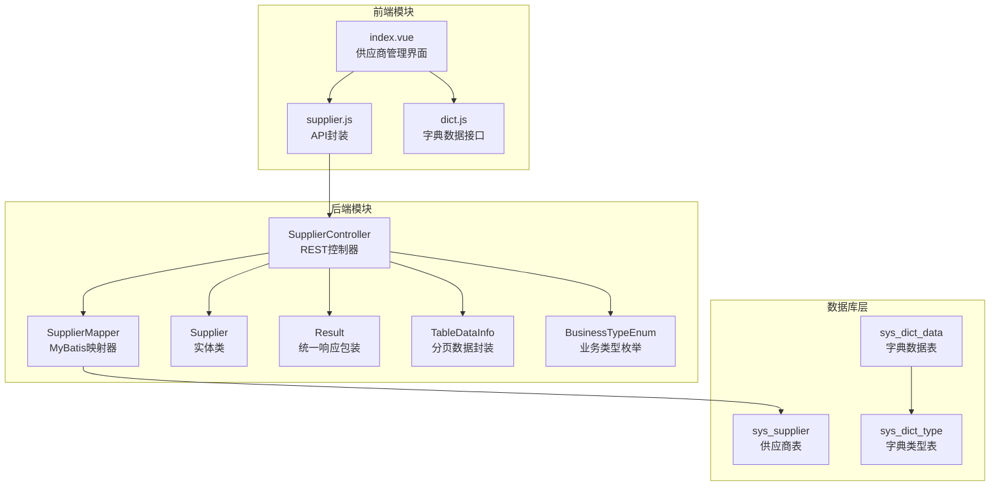
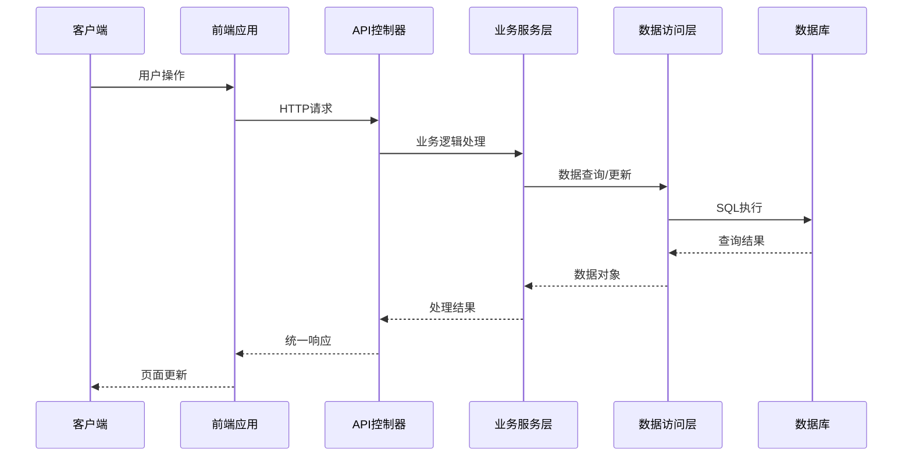
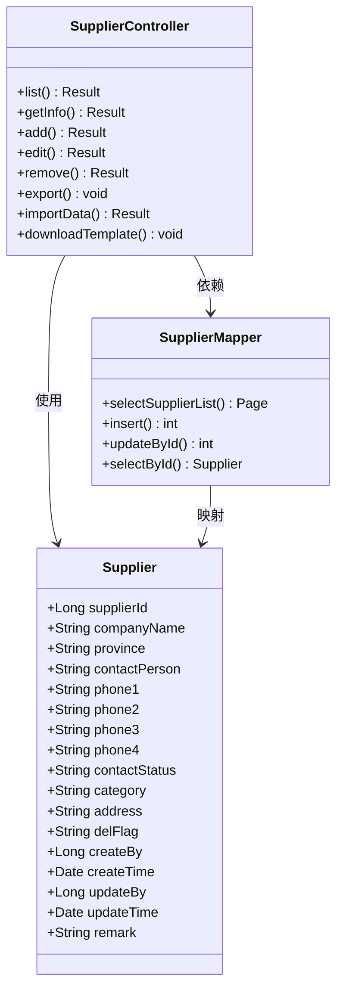
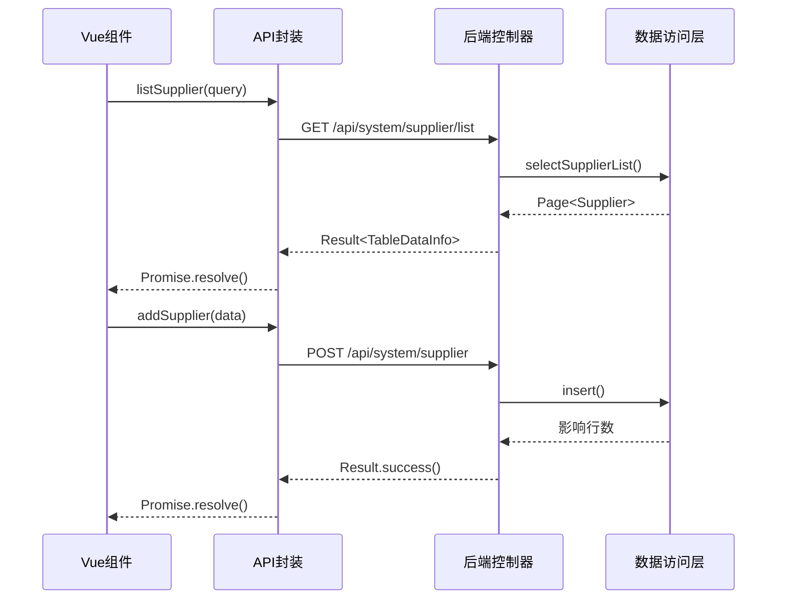
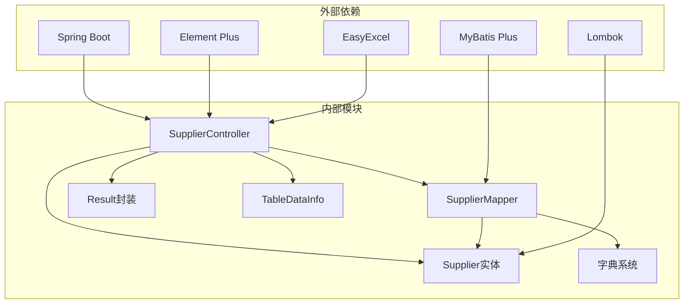

# 供应商管理接口

<cite>
**本文引用的文件**
- [Supplier.java](file://task-manager-backend/src/main/java/com/taskmanager/domain/Supplier.java)
- [SupplierController.java](file://task-manager-backend/src/main/java/com/taskmanager/controller/SupplierController.java)
- [SupplierMapper.java](file://task-manager-backend/src/main/java/com/taskmanager/mapper/SupplierMapper.java)
- [SupplierMapper.xml](file://task-manager-backend/src/main/resources/mapper/SupplierMapper.xml)
- [supplier.js](file://task-manager-frontend/src/api/system/supplier.js)
- [index.vue](file://task-manager-frontend/src/views/system/supplier/index.vue)
- [Result.java](file://task-manager-backend/src/main/java/com/taskmanager/common/Result.java)
- [TableDataInfo.java](file://task-manager-backend/src/main/java/com/taskmanager/common/utils/TableDataInfo.java)
- [BusinessTypeEnum.java](file://task-manager-backend/src/main/java/com/taskmanager/common/enums/BusinessTypeEnum.java)
- [schema.sql](file://task-manager-backend/src/main/resources/schema.sql)
- [test-data.sql](file://task-manager-backend/src/main/resources/test-data.sql)
</cite>

## 目录
1. [简介](#简介)
2. [项目结构](#项目结构)
3. [核心组件](#核心组件)
4. [架构概览](#架构概览)
5. [详细组件分析](#详细组件分析)
6. [依赖分析](#依赖分析)
7. [性能考虑](#性能考虑)
8. [故障排除指南](#故障排除指南)
9. [结论](#结论)
10. [附录](#附录)

## 简介
本文件为CodeBuddy任务管理系统中的供应商管理模块提供详细的API接口文档。该模块实现了供应商信息的完整生命周期管理，包括增删改查、状态管理、联系人管理、批量导入导出等功能。系统采用前后端分离架构，后端基于Spring Boot + MyBatis Plus，前端使用Vue.js + Element Plus，通过RESTful API进行交互。

供应商管理模块支持以下核心功能：
- 供应商信息的增删改查操作
- 多条件分页查询与筛选
- 供应商联系状态管理（未联系、已加微信、未接、空号、已下单）
- 商品品类分类管理
- 批量数据导入导出
- Excel模板下载与验证
- 完整的操作日志记录

## 项目结构
供应商管理模块在项目中的组织结构如下：



**图表来源**
- [SupplierController.java:1-201](file://task-manager-backend/src/main/java/com/taskmanager/controller/SupplierController.java#L1-L201)
- [SupplierMapper.java:1-35](file://task-manager-backend/src/main/java/com/taskmanager/mapper/SupplierMapper.java#L1-L35)
- [Supplier.java:1-86](file://task-manager-backend/src/main/java/com/taskmanager/domain/Supplier.java#L1-L86)

**章节来源**
- [SupplierController.java:1-201](file://task-manager-backend/src/main/java/com/taskmanager/controller/SupplierController.java#L1-L201)
- [SupplierMapper.java:1-35](file://task-manager-backend/src/main/java/com/taskmanager/mapper/SupplierMapper.java#L1-L35)
- [Supplier.java:1-86](file://task-manager-backend/src/main/java/com/taskmanager/domain/Supplier.java#L1-L86)

## 核心组件
供应商管理模块由以下核心组件构成：

### 后端核心组件
1. **SupplierController**: REST API控制器，处理所有供应商相关的HTTP请求
2. **SupplierMapper**: MyBatis映射器接口，定义数据访问方法
3. **Supplier**: 实体类，映射sys_supplier数据库表结构
4. **Result**: 统一响应格式封装
5. **TableDataInfo**: 分页数据封装工具类

### 前端核心组件
1. **supplier.js**: API接口封装，提供供应商管理的前端调用方法
2. **index.vue**: 供应商管理界面，包含CRUD操作和数据展示
3. **字典系统**: 支持省份、品类、联系状态的动态配置

**章节来源**
- [SupplierController.java:29-31](file://task-manager-backend/src/main/java/com/taskmanager/controller/SupplierController.java#L29-L31)
- [SupplierMapper.java:15-34](file://task-manager-backend/src/main/java/com/taskmanager/mapper/SupplierMapper.java#L15-L34)
- [Supplier.java:17-85](file://task-manager-backend/src/main/java/com/taskmanager/domain/Supplier.java#L17-L85)

## 架构概览
供应商管理模块采用经典的三层架构设计：



**图表来源**
- [SupplierController.java:48-67](file://task-manager-backend/src/main/java/com/taskmanager/controller/SupplierController.java#L48-L67)
- [SupplierMapper.xml:28-54](file://task-manager-backend/src/main/resources/mapper/SupplierMapper.xml#L28-L54)

## 详细组件分析

### 数据模型设计

供应商实体类定义了完整的供应商信息结构：



**图表来源**
- [Supplier.java:19-85](file://task-manager-backend/src/main/java/com/taskmanager/domain/Supplier.java#L19-L85)
- [SupplierController.java:30-31](file://task-manager-backend/src/main/java/com/taskmanager/controller/SupplierController.java#L30-L31)
- [SupplierMapper.java:15-34](file://task-manager-backend/src/main/java/com/taskmanager/mapper/SupplierMapper.java#L15-L34)

#### 核心字段说明

| 字段名 | 类型 | 描述 | 业务规则 |
|--------|------|------|----------|
| supplierId | Long | 供应商ID | 主键，自动递增 |
| companyName | String | 公司名称 | 必填，最大长度限制 |
| province | String | 省份 | 可选，来自字典数据 |
| contactPerson | String | 联系人 | 可选，最大长度限制 |
| phone1-phone4 | String | 电话号码 | 可选，支持多个联系方式 |
| contactStatus | String | 联系状态 | 枚举值：0未联系,1已加微信,2未接,3空号,4已下单 |
| category | String | 品类 | 多选，逗号分隔存储 |
| address | String | 详细地址 | 可选，最大长度限制 |
| delFlag | String | 删除标志 | 枚举值：0存在,2删除（逻辑删除） |
| createBy/updateBy | Long | 创建/更新用户ID | 系统自动维护 |
| createTime/updateTime | Date | 创建/更新时间 | 系统自动维护 |

**章节来源**
- [Supplier.java:23-84](file://task-manager-backend/src/main/java/com/taskmanager/domain/Supplier.java#L23-L84)

### API接口规范

#### 1. 供应商列表查询

**接口地址**: `GET /api/system/supplier/list`

**请求参数**:

| 参数名 | 类型 | 是否必需 | 默认值 | 描述 |
|--------|------|----------|--------|------|
| pageNum | Integer | 否 | 1 | 页码 |
| pageSize | Integer | 否 | 10 | 每页大小 |
| companyName | String | 否 | - | 公司名称（模糊搜索） |
| province | String | 否 | - | 省份（多选，逗号分隔） |
| contactPerson | String | 否 | - | 联系人（模糊搜索） |
| category | String | 否 | - | 品类（多选，逗号分隔） |
| contactStatus | String | 否 | - | 联系状态 |

**响应数据结构**:
```json
{
  "code": 200,
  "message": "success",
  "data": {
    "total": 100,
    "rows": [
      {
        "supplierId": 1,
        "companyName": "深圳市华强电子有限公司",
        "province": "广东",
        "contactPerson": "张总",
        "phone1": "0755-88880001",
        "phone2": "13900002001",
        "contactStatus": "0",
        "category": "电子产品",
        "address": "广东省深圳市福田区华强北路1号电子大厦A座1201",
        "remark": "主营电子元器件批发"
      }
    ],
    "pageNum": 1,
    "pageSize": 10,
    "pages": 10
  }
}
```

**业务规则**:
- 支持多条件组合查询
- 省份和品类参数为逗号分隔的多选值
- 联系状态为精确匹配
- 公司名称和联系人为模糊匹配

**章节来源**
- [SupplierController.java:48-67](file://task-manager-backend/src/main/java/com/taskmanager/controller/SupplierController.java#L48-L67)
- [SupplierMapper.xml:28-54](file://task-manager-backend/src/main/resources/mapper/SupplierMapper.xml#L28-L54)

#### 2. 供应商详情查询

**接口地址**: `GET /api/system/supplier/{supplierId}`

**路径参数**:
- supplierId: Long - 供应商ID（必填）

**响应数据**: 单个Supplier对象

**业务规则**:
- 支持查询单个供应商的完整信息
- 自动过滤已删除的供应商记录

**章节来源**
- [SupplierController.java:72-76](file://task-manager-backend/src/main/java/com/taskmanager/controller/SupplierController.java#L72-L76)

#### 3. 供应商新增

**接口地址**: `POST /api/system/supplier`

**请求体**: Supplier对象（除主键外的所有字段）

**响应数据**: 成功标识

**业务规则**:
- 自动设置delFlag为"0"（存在状态）
- 系统自动填充创建时间和创建用户
- 支持批量新增（通过导入功能）

**章节来源**
- [SupplierController.java:81-88](file://task-manager-backend/src/main/java/com/taskmanager/controller/SupplierController.java#L81-L88)

#### 4. 供应商修改

**接口地址**: `PUT /api/system/supplier`

**请求体**: Supplier对象（包含完整更新信息）

**响应数据**: 成功标识

**业务规则**:
- 支持部分字段更新
- 自动更新更新时间和更新用户
- 不允许修改主键

**章节来源**
- [SupplierController.java:93-99](file://task-manager-backend/src/main/java/com/taskmanager/controller/SupplierController.java#L93-L99)

#### 5. 供应商删除

**接口地址**: `DELETE /api/system/supplier/{supplierIds}`

**路径参数**:
- supplierIds: Long[] - 供应商ID数组（支持批量删除）

**响应数据**: 成功标识

**业务规则**:
- 采用逻辑删除（delFlag设为"2"）
- 不支持物理删除
- 支持批量删除操作

**章节来源**
- [SupplierController.java:104-115](file://task-manager-backend/src/main/java/com/taskmanager/controller/SupplierController.java#L104-L115)

#### 6. 供应商数据导出

**接口地址**: `POST /api/system/supplier/export`

**请求参数**:
- companyName: String - 公司名称
- province: String - 省份（多选）
- contactPerson: String - 联系人
- category: String - 品类（多选）
- contactStatus: String - 联系状态

**响应**: Excel文件流（application/vnd.openxmlformats-officedocument.spreadsheetml.sheet）

**业务规则**:
- 支持全量导出（无分页限制）
- 自动设置正确的响应头
- 文件名为"供应商数据.xlsx"

**章节来源**
- [SupplierController.java:117-147](file://task-manager-backend/src/main/java/com/taskmanager/controller/SupplierController.java#L117-L147)

#### 7. 供应商数据导入

**接口地址**: `POST /api/system/supplier/import`

**请求方式**: multipart/form-data

**请求参数**:
- file: MultipartFile - Excel文件（xlsx/xls格式）

**响应数据**: 导入结果统计

**响应示例**:
```json
{
  "code": 200,
  "message": "success",
  "data": "成功导入100条，失败5条。第15行[某公司]导入失败：重复主键冲突；第23行[另一公司]导入失败：手机号格式不正确"
}
```

**业务规则**:
- 支持Excel文件批量导入
- 自动清除主键避免重复
- 流式读取，支持大文件导入
- 导入失败的记录会返回具体错误信息

**章节来源**
- [SupplierController.java:149-184](file://task-manager-backend/src/main/java/com/taskmanager/controller/SupplierController.java#L149-L184)

#### 8. 导入模板下载

**接口地址**: `POST /api/system/supplier/template`

**响应**: Excel模板文件流

**业务规则**:
- 下载标准的供应商导入模板
- 包含所有必填字段的说明
- 便于用户快速准备导入数据

**章节来源**
- [SupplierController.java:186-199](file://task-manager-backend/src/main/java/com/taskmanager/controller/SupplierController.java#L186-L199)

### 前端集成接口

前端通过supplier.js封装了所有供应商管理相关的API调用：



**图表来源**
- [supplier.js:3-46](file://task-manager-frontend/src/api/system/supplier.js#L3-L46)
- [SupplierController.java:48-99](file://task-manager-backend/src/main/java/com/taskmanager/controller/SupplierController.java#L48-L99)

**章节来源**
- [supplier.js:1-47](file://task-manager-frontend/src/api/system/supplier.js#L1-L47)

### 状态管理机制

供应商联系状态采用字典配置的方式管理：

| 状态值 | 状态名称 | 颜色标识 | 描述 |
|--------|----------|----------|------|
| 0 | 未联系 | info | 初次接触，尚未建立联系 |
| 1 | 已加微信 | success | 已通过微信建立联系 |
| 2 | 未接 | warning | 电话未接通，需要再次尝试 |
| 3 | 空号 | danger | 电话号码无效，需要更新 |
| 4 | 已下单 | primary | 已完成首次订单，建立合作关系 |

**章节来源**
- [schema.sql:368-373](file://task-manager-backend/src/main/resources/schema.sql#L368-L373)
- [test-data.sql:127-148](file://task-manager-backend/src/main/resources/test-data.sql#L127-L148)

### 数据验证与约束

系统实现了多层次的数据验证和业务约束：

1. **数据库层面约束**:
   - 主键自增约束
   - 非空字段约束
   - 枚举值范围约束
   - 唯一性约束（如适用）

2. **业务层面约束**:
   - 逻辑删除机制
   - 字典数据验证
   - 多选字段格式验证
   - 导入数据格式校验

3. **前端层面约束**:
   - 表单必填项验证
   - 字段长度限制
   - 格式验证（电话号码等）
   - 实时状态显示

**章节来源**
- [Supplier.java:23-84](file://task-manager-backend/src/main/java/com/taskmanager/domain/Supplier.java#L23-L84)
- [index.vue:293-296](file://task-manager-frontend/src/views/system/supplier/index.vue#L293-L296)

## 依赖分析

供应商管理模块的依赖关系如下：



**图表来源**
- [SupplierController.java:10-16](file://task-manager-backend/src/main/java/com/taskmanager/controller/SupplierController.java#L10-L16)
- [SupplierMapper.java:3-8](file://task-manager-backend/src/main/java/com/taskmanager/mapper/SupplierMapper.java#L3-L8)

### 关键依赖说明

1. **Spring Boot**: 提供Web框架和依赖注入功能
2. **MyBatis Plus**: 提供ORM映射和分页查询功能
3. **EasyExcel**: 提供Excel导入导出功能
4. **Element Plus**: 提供前端UI组件和表单验证
5. **Lombok**: 简化Java实体类代码

**章节来源**
- [SupplierController.java:13-16](file://task-manager-backend/src/main/java/com/taskmanager/controller/SupplierController.java#L13-L16)
- [SupplierMapper.java:3-8](file://task-manager-backend/src/main/java/com/taskmanager/mapper/SupplierMapper.java#L3-L8)

## 性能考虑

### 数据库优化策略

1. **索引设计**:
   - 在del_flag字段上建立索引，支持快速过滤
   - 在常用查询字段上建立复合索引
   - 优化LIKE查询的性能

2. **查询优化**:
   - 使用分页查询避免全表扫描
   - 多条件查询使用IN和FIND_IN_SET优化
   - 缓存热点数据

3. **连接池配置**:
   - 合理配置数据库连接池大小
   - 设置连接超时和空闲回收时间

### 前端性能优化

1. **虚拟滚动**:
   - 大数据量表格使用虚拟滚动
   - 懒加载字典数据

2. **缓存策略**:
   - 缓存字典数据减少网络请求
   - 表单数据本地缓存

3. **异步处理**:
   - 导入导出使用异步处理
   - 大数据量操作使用进度反馈

## 故障排除指南

### 常见问题及解决方案

#### 1. Excel导入失败

**问题现象**: 导入过程中出现异常或部分数据导入失败

**可能原因**:
- Excel文件格式不正确
- 字段格式不符合要求
- 数据重复或缺失
- 数据库连接异常

**解决步骤**:
1. 检查Excel文件格式（必须为.xlsx或.xls）
2. 下载最新模板文件重新填写
3. 检查必填字段是否完整
4. 查看返回的具体错误信息定位问题

**章节来源**
- [SupplierController.java:155-184](file://task-manager-backend/src/main/java/com/taskmanager/controller/SupplierController.java#L155-L184)

#### 2. 查询结果为空

**问题现象**: 供应商列表查询返回空数据

**可能原因**:
- 查询条件过于严格
- 数据已被逻辑删除
- 权限不足

**解决步骤**:
1. 检查查询条件是否合理
2. 确认供应商状态正常
3. 验证用户权限
4. 尝试简化查询条件

#### 3. 导出文件异常

**问题现象**: Excel导出文件无法打开或内容不完整

**可能原因**:
- 服务器内存不足
- 文件流写入异常
- 浏览器兼容性问题

**解决步骤**:
1. 检查服务器内存使用情况
2. 减少导出数据量
3. 更换浏览器尝试
4. 检查服务器日志

### 错误码说明

| 错误码 | 描述 | 可能原因 | 解决方案 |
|--------|------|----------|----------|
| 200 | 成功 | 正常操作 | 无需处理 |
| 400 | 请求参数错误 | 参数格式不正确 | 检查请求参数 |
| 401 | 未授权 | 权限不足 | 检查用户权限 |
| 404 | 资源不存在 | ID不存在 | 验证资源ID |
| 500 | 服务器内部错误 | 系统异常 | 查看服务器日志 |

**章节来源**
- [Result.java:39-74](file://task-manager-backend/src/main/java/com/taskmanager/common/Result.java#L39-L74)

## 结论

供应商管理模块提供了完整的供应商生命周期管理功能，具有以下特点：

1. **功能完整性**: 覆盖供应商管理的所有核心需求
2. **用户体验良好**: 前后端分离，界面友好
3. **扩展性强**: 基于字典系统，易于扩展新的状态和分类
4. **性能可靠**: 采用分页查询和批量操作优化
5. **安全可控**: 基于权限控制和操作日志

该模块为CodeBuddy任务管理系统的采购管理和供应链集成奠定了坚实基础，能够有效支撑企业的供应商管理工作。

## 附录

### 最佳实践建议

1. **数据质量控制**:
   - 建立供应商信息质量检查机制
   - 定期清理无效联系信息
   - 建立供应商分级管理制度

2. **流程优化**:
   - 建立标准化的供应商准入流程
   - 完善供应商评估和考核机制
   - 建立供应商风险预警机制

3. **技术维护**:
   - 定期备份供应商数据
   - 监控系统性能指标
   - 及时更新系统版本

4. **用户培训**:
   - 提供系统使用培训
   - 建立操作手册
   - 定期收集用户反馈

### 版本升级指南

当需要升级供应商管理模块时，建议遵循以下步骤：

1. **备份现有数据**: 确保数据安全
2. **测试环境验证**: 在测试环境验证升级效果
3. **逐步上线**: 采用灰度发布策略
4. **监控系统状态**: 上线后密切监控系统运行状态
5. **用户通知**: 及时通知用户系统升级信息