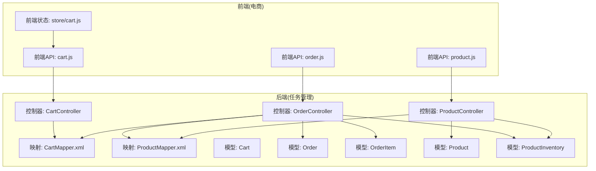
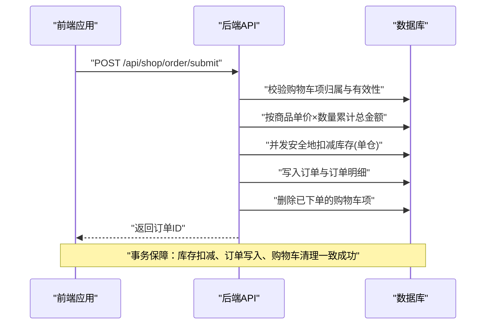
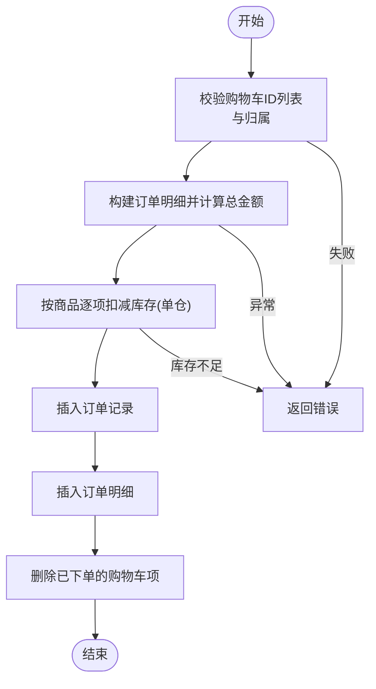
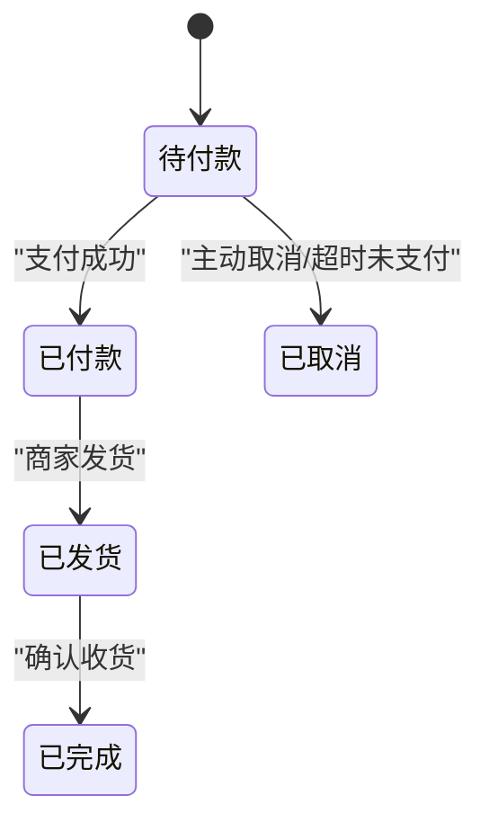
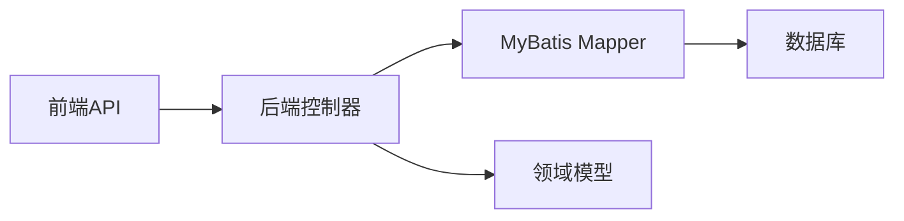

# 电商模块接口

<cite>
**本文引用的文件**
- [CartController.java](file://task-manager-backend/src/main/java/com/taskmanager/controller/CartController.java)
- [OrderController.java](file://task-manager-backend/src/main/java/com/taskmanager/controller/OrderController.java)
- [ProductController.java](file://task-manager-backend/src/main/java/com/taskmanager/controller/ProductController.java)
- [Cart.java](file://task-manager-backend/src/main/java/com/taskmanager/domain/Cart.java)
- [Order.java](file://task-manager-backend/src/main/java/com/taskmanager/domain/Order.java)
- [OrderItem.java](file://task-manager-backend/src/main/java/com/taskmanager/domain/OrderItem.java)
- [Product.java](file://task-manager-backend/src/main/java/com/taskmanager/domain/Product.java)
- [ProductInventory.java](file://task-manager-backend/src/main/java/com/taskmanager/domain/ProductInventory.java)
- [CartMapper.xml](file://task-manager-backend/src/main/resources/mapper/CartMapper.xml)
- [ProductMapper.xml](file://task-manager-backend/src/main/resources/mapper/ProductMapper.xml)
- [cart.js](file://ecommerce-frontend/src/api/cart.js)
- [order.js](file://ecommerce-frontend/src/api/order.js)
- [product.js](file://ecommerce-frontend/src/api/product.js)
- [cart.js](file://ecommerce-frontend/src/store/cart.js)
- [application.yml](file://task-manager-backend/src/main/resources/application.yml)
</cite>

## 目录
1. [简介](#简介)
2. [项目结构](#项目结构)
3. [核心组件](#核心组件)
4. [架构总览](#架构总览)
5. [详细组件分析](#详细组件分析)
6. [依赖分析](#依赖分析)
7. [性能考虑](#性能考虑)
8. [故障排查指南](#故障排查指南)
9. [结论](#结论)
10. [附录](#附录)

## 简介
本文件为 CodeBuddy 任务管理系统中的电商模块接口文档，覆盖购物车管理、订单管理与商品展示三大核心功能。文档面向前后端开发者与测试人员，提供接口定义、数据模型、业务规则、关键流程（如库存扣减、价格计算、订单状态流转）以及用户体验优化建议。所有接口均基于后端 Spring Boot 控制器与 MyBatis-Plus 的实现，前端通过独立的电商前端工程调用后端 API。

## 项目结构
电商模块由后端 Java 控制器与领域模型、MyBatis XML 映射，以及前端 Vue/Pinia 调用组成。后端控制器负责鉴权、事务与业务编排；前端通过统一请求封装调用后端接口，并在 Pinia 中维护购物车状态与选择态。

**图表来源**
- [CartController.java:23-134](file://task-manager-backend/src/main/java/com/taskmanager/controller/CartController.java#L23-L134)
- [OrderController.java:37-303](file://task-manager-backend/src/main/java/com/taskmanager/controller/OrderController.java#L37-L303)
- [ProductController.java:34-237](file://task-manager-backend/src/main/java/com/taskmanager/controller/ProductController.java#L34-L237)
- [CartMapper.xml:4-14](file://task-manager-backend/src/main/resources/mapper/CartMapper.xml#L4-L14)
- [ProductMapper.xml:26-54](file://task-manager-backend/src/main/resources/mapper/ProductMapper.xml#L26-L54)
- [cart.js:1-36](file://ecommerce-frontend/src/api/cart.js#L1-L36)
- [order.js:1-36](file://ecommerce-frontend/src/api/order.js#L1-L36)
- [product.js:1-19](file://ecommerce-frontend/src/api/product.js#L1-L19)
- [cart.js:1-53](file://ecommerce-frontend/src/store/cart.js#L1-L53)

**章节来源**
- [application.yml:1-79](file://task-manager-backend/src/main/resources/application.yml#L1-L79)

## 核心组件
- 购物车控制器：提供获取、添加、修改数量、删除购物车项等接口，需登录态。
- 订单控制器：提供提交订单、查询订单列表、订单详情、取消订单等接口，需登录态。
- 商品控制器：提供商品列表、详情、新增/编辑/删除（逻辑删除）、导入导出等接口，需相应权限。
- 数据模型：购物车、订单、订单明细、商品、商品库存等，承载电商数据与业务字段。
- 前端API与状态：统一请求封装与 Pinia 购物车状态管理。

**章节来源**
- [CartController.java:23-134](file://task-manager-backend/src/main/java/com/taskmanager/controller/CartController.java#L23-L134)
- [OrderController.java:37-303](file://task-manager-backend/src/main/java/com/taskmanager/controller/OrderController.java#L37-L303)
- [ProductController.java:34-237](file://task-manager-backend/src/main/java/com/taskmanager/controller/ProductController.java#L34-L237)
- [Cart.java:18-61](file://task-manager-backend/src/main/java/com/taskmanager/domain/Cart.java#L18-L61)
- [Order.java:19-65](file://task-manager-backend/src/main/java/com/taskmanager/domain/Order.java#L19-L65)
- [OrderItem.java:16-44](file://task-manager-backend/src/main/java/com/taskmanager/domain/OrderItem.java#L16-L44)
- [Product.java:20-97](file://task-manager-backend/src/main/java/com/taskmanager/domain/Product.java#L20-L97)
- [ProductInventory.java:17-67](file://task-manager-backend/src/main/java/com/taskmanager/domain/ProductInventory.java#L17-L67)
- [cart.js:1-36](file://ecommerce-frontend/src/api/cart.js#L1-L36)
- [order.js:1-36](file://ecommerce-frontend/src/api/order.js#L1-L36)
- [product.js:1-19](file://ecommerce-frontend/src/api/product.js#L1-L19)
- [cart.js:1-53](file://ecommerce-frontend/src/store/cart.js#L1-L53)

## 架构总览
电商模块采用“前后端分离”架构：前端通过 axios 封装的 request 发起 HTTP 请求，后端以 Spring MVC 控制器暴露 REST 接口，使用 MyBatis-Plus 进行数据库访问。认证与授权通过 Spring Security + JWT 实现，事务性操作在订单提交与取消等关键流程中保证一致性。

**图表来源**
- [OrderController.java:59-153](file://task-manager-backend/src/main/java/com/taskmanager/controller/OrderController.java#L59-L153)
- [OrderController.java:192-232](file://task-manager-backend/src/main/java/com/taskmanager/controller/OrderController.java#L192-L232)

## 详细组件分析

### 购物车管理接口
- 获取购物车列表
  - 方法与路径：GET /api/shop/cart/list
  - 鉴权：需要登录
  - 请求参数：无
  - 响应：Result<List<Cart>>
  - 业务规则：仅返回当前登录用户购物车，聚合商品名称、预览图、单价、单位等信息
  - 关键实现参考：[CartController.java:36-41](file://task-manager-backend/src/main/java/com/taskmanager/controller/CartController.java#L36-L41)，[CartMapper.xml:5-12](file://task-manager-backend/src/main/resources/mapper/CartMapper.xml#L5-L12)

- 添加到购物车
  - 方法与路径：POST /api/shop/cart/add
  - 鉴权：需要登录
  - 请求体：Cart（productId, quantity，默认为1）
  - 响应：Result<Void>
  - 业务规则：商品必须存在且状态正常；若同用户同商品已存在则累加数量，否则新增
  - 关键实现参考：[CartController.java:47-77](file://task-manager-backend/src/main/java/com/taskmanager/controller/CartController.java#L47-L77)

- 修改购物车数量
  - 方法与路径：PUT /api/shop/cart/update
  - 鉴权：需要登录
  - 请求体：Cart（cartId, quantity）
  - 响应：Result<Void>
  - 业务规则：quantity<=0 时删除该项；否则更新数量
  - 关键实现参考：[CartController.java:83-104](file://task-manager-backend/src/main/java/com/taskmanager/controller/CartController.java#L83-L104)

- 删除购物车项
  - 方法与路径：DELETE /api/shop/cart/{cartIds}
  - 鉴权：需要登录
  - 路径参数：cartIds（逗号分隔的ID字符串）
  - 响应：Result<Void>
  - 业务规则：仅删除当前用户名下的购物车项
  - 关键实现参考：[CartController.java:110-123](file://task-manager-backend/src/main/java/com/taskmanager/controller/CartController.java#L110-L123)

- 前端调用与状态
  - 前端API：[cart.js:1-36](file://ecommerce-frontend/src/api/cart.js#L1-L36)
  - 购物车状态：Pinia store 维护列表、选中集合、数量与总价计算
  - 关键实现参考：[cart.js:1-53](file://ecommerce-frontend/src/store/cart.js#L1-L53)

**章节来源**
- [CartController.java:36-123](file://task-manager-backend/src/main/java/com/taskmanager/controller/CartController.java#L36-L123)
- [CartMapper.xml:5-12](file://task-manager-backend/src/main/resources/mapper/CartMapper.xml#L5-L12)
- [cart.js:1-36](file://ecommerce-frontend/src/api/cart.js#L1-L36)
- [cart.js:1-53](file://ecommerce-frontend/src/store/cart.js#L1-L53)

### 订单管理接口
- 提交订单
  - 方法与路径：POST /api/shop/order/submit
  - 鉴权：需要登录
  - 请求体：OrderSubmitDTO（cartIds[], 收货人信息与备注）
  - 响应：Result<Long>（订单ID）
  - 业务规则与流程要点：
    - 校验购物车项归属与存在性
    - 逐项计算小计并累计总金额
    - 并发安全地从可用仓库扣减库存（单仓）
    - 写入订单与订单明细
    - 删除已下单的购物车项
  - 关键实现参考：[OrderController.java:59-153](file://task-manager-backend/src/main/java/com/taskmanager/controller/OrderController.java#L59-L153)

- 订单列表
  - 方法与路径：GET /api/shop/order/list?pageNum&pageSize
  - 鉴权：需要登录
  - 请求参数：pageNum, pageSize（默认1/10）
  - 响应：Result<Page<Order>>
  - 业务规则：仅返回当前用户订单，按创建时间倒序
  - 关键实现参考：[OrderController.java:158-168](file://task-manager-backend/src/main/java/com/taskmanager/controller/OrderController.java#L158-L168)

- 订单详情
  - 方法与路径：GET /api/shop/order/{orderId}
  - 鉴权：需要登录
  - 路径参数：orderId
  - 响应：Result<Order>（包含 orderItems）
  - 业务规则：仅允许查看本人订单
  - 关键实现参考：[OrderController.java:173-187](file://task-manager-backend/src/main/java/com/taskmanager/controller/OrderController.java#L173-L187)

- 取消订单
  - 方法与路径：PUT /api/shop/order/cancel/{orderId}
  - 鉴权：需要登录
  - 路径参数：orderId
  - 响应：Result<Void>
  - 业务规则：仅待付款（status=0）可取消；执行状态更新并恢复库存
  - 关键实现参考：[OrderController.java:192-232](file://task-manager-backend/src/main/java/com/taskmanager/controller/OrderController.java#L192-L232)

- 前端调用
  - 前端API：[order.js:1-36](file://ecommerce-frontend/src/api/order.js#L1-L36)

**章节来源**
- [OrderController.java:59-232](file://task-manager-backend/src/main/java/com/taskmanager/controller/OrderController.java#L59-L232)
- [order.js:1-36](file://ecommerce-frontend/src/api/order.js#L1-L36)

### 商品展示接口
- 商品列表（公开）
  - 方法与路径：GET /api/shop/products
  - 鉴权：无需登录
  - 请求参数：pageNum, pageSize, productName, skuCode, status, minPrice, maxPrice
  - 响应：Result<Page<Product>>
  - 业务规则：按条件过滤、分页、按创建时间倒序
  - 关键实现参考：[ProductController.java:48-63](file://task-manager-backend/src/main/java/com/taskmanager/controller/ProductController.java#L48-L63)，[ProductMapper.xml:26-46](file://task-manager-backend/src/main/resources/mapper/ProductMapper.xml#L26-L46)

- 商品详情（公开）
  - 方法与路径：GET /api/shop/products/{productId}
  - 鉴权：无需登录
  - 路径参数：productId
  - 响应：Result<Product>（包含供应商与库存列表）
  - 关键实现参考：[ProductController.java:65-77](file://task-manager-backend/src/main/java/com/taskmanager/controller/ProductController.java#L65-L77)

- 前端调用
  - 前端API：[product.js:1-19](file://ecommerce-frontend/src/api/product.js#L1-L19)

**章节来源**
- [ProductController.java:48-77](file://task-manager-backend/src/main/java/com/taskmanager/controller/ProductController.java#L48-L77)
- [ProductMapper.xml:26-54](file://task-manager-backend/src/main/resources/mapper/ProductMapper.xml#L26-L54)
- [product.js:1-19](file://ecommerce-frontend/src/api/product.js#L1-L19)

### 数据模型与业务规则

#### 购物车（Cart）
- 字段概览：cartId, userId, productId, quantity, createTime, updateTime
- 非持久字段：productName, previewImage, salePrice, unit
- 业务规则：同一用户对同一商品仅有一条记录，重复添加累加数量

**章节来源**
- [Cart.java:18-61](file://task-manager-backend/src/main/java/com/taskmanager/domain/Cart.java#L18-L61)

#### 订单（Order）
- 字段概览：orderId, orderNo, userId, totalAmount, status, 收货信息, remark, createTime, updateTime
- 非持久字段：orderItems
- 状态枚举：0待付款, 1已付款, 2已发货, 3已完成, 4已取消

**章节来源**
- [Order.java:19-65](file://task-manager-backend/src/main/java/com/taskmanager/domain/Order.java#L19-L65)

#### 订单明细（OrderItem）
- 字段概览：itemId, orderId, productId, productName, salePrice, quantity, subtotal

**章节来源**
- [OrderItem.java:16-44](file://task-manager-backend/src/main/java/com/taskmanager/domain/OrderItem.java#L16-L44)

#### 商品（Product）
- 字段概览：productId, productName, skuCode, description, previewImage, mobileContent, salePrice, purchasePrice, unit, status, delFlag, createBy, createTime, updateBy, updateTime, remark
- 非持久字段：supplierList, inventoryList, totalStock

**章节来源**
- [Product.java:20-97](file://task-manager-backend/src/main/java/com/taskmanager/domain/Product.java#L20-L97)

#### 商品库存（ProductInventory）
- 字段概览：id, productId, warehouseId, stockQuantity, warningQuantity, delFlag, createBy, createTime, updateBy, updateTime, remark
- 非持久字段：warehouseName, warehouseCode

**章节来源**
- [ProductInventory.java:17-67](file://task-manager-backend/src/main/java/com/taskmanager/domain/ProductInventory.java#L17-L67)

### 关键业务流程

#### 订单提交流程（含库存扣减与价格计算）

**图表来源**
- [OrderController.java:59-153](file://task-manager-backend/src/main/java/com/taskmanager/controller/OrderController.java#L59-L153)

#### 订单状态流转

**图表来源**
- [Order.java:38-39](file://task-manager-backend/src/main/java/com/taskmanager/domain/Order.java#L38-L39)
- [OrderController.java:192-232](file://task-manager-backend/src/main/java/com/taskmanager/controller/OrderController.java#L192-L232)

## 依赖分析
- 控制器依赖：各控制器依赖对应的 Mapper 与领域模型；订单控制器额外依赖库存与商品相关 Mapper。
- 前端依赖：API 层仅依赖后端接口路径；Pinia 状态层依赖 API 层。
- 数据库映射：购物车列表通过联表查询聚合商品信息；商品列表支持多条件动态拼接。

**图表来源**
- [CartController.java:27-31](file://task-manager-backend/src/main/java/com/taskmanager/controller/CartController.java#L27-L31)
- [OrderController.java:41-54](file://task-manager-backend/src/main/java/com/taskmanager/controller/OrderController.java#L41-L54)
- [ProductController.java:38-45](file://task-manager-backend/src/main/java/com/taskmanager/controller/ProductController.java#L38-L45)

**章节来源**
- [CartMapper.xml:5-12](file://task-manager-backend/src/main/resources/mapper/CartMapper.xml#L5-L12)
- [ProductMapper.xml:26-54](file://task-manager-backend/src/main/resources/mapper/ProductMapper.xml#L26-L54)

## 性能考虑
- 连接池与缓存：后端使用 HikariCP 连接池与 Redis 缓存配置，建议在高并发场景下开启连接池监控与慢查询日志。
- 分页查询：商品列表与订单列表均采用分页，避免一次性加载大量数据。
- 事务边界：订单提交与取消使用事务，确保库存扣减与订单状态一致性。
- 前端状态：Pinia 聚合计算购物车总价与数量，减少重复计算与网络请求。

**章节来源**
- [application.yml:10-31](file://task-manager-backend/src/main/resources/application.yml#L10-L31)
- [application.yml:33-44](file://task-manager-backend/src/main/resources/application.yml#L33-L44)
- [cart.js:9-17](file://ecommerce-frontend/src/store/cart.js#L9-L17)

## 故障排查指南
- 购物车相关
  - “商品不存在或已下架”：检查商品状态与 delFlag，确认商品存在且状态正常。
  - “购物车项不存在或无权操作”：确认 cartId 属于当前用户。
  - 参考实现：[CartController.java:53-57](file://task-manager-backend/src/main/java/com/taskmanager/controller/CartController.java#L53-L57)，[CartController.java:88-92](file://task-manager-backend/src/main/java/com/taskmanager/controller/CartController.java#L88-L92)

- 订单相关
  - “购物车不能为空/购物车项不存在”：确认传入 cartIds 有效且全部属于当前用户。
  - “库存不足”：检查对应商品库存与仓库可用数量。
  - “只有待付款订单才能取消”：确认订单状态为 0。
  - 参考实现：[OrderController.java:64-68](file://task-manager-backend/src/main/java/com/taskmanager/controller/OrderController.java#L64-L68)，[OrderController.java:106-127](file://task-manager-backend/src/main/java/com/taskmanager/controller/OrderController.java#L106-L127)，[OrderController.java:199-203](file://task-manager-backend/src/main/java/com/taskmanager/controller/OrderController.java#L199-L203)

- 商品相关
  - “商品不存在”：确认 productId 有效且 delFlag 为正常值。
  - 参考实现：[ProductController.java:68-77](file://task-manager-backend/src/main/java/com/taskmanager/controller/ProductController.java#L68-L77)

**章节来源**
- [CartController.java:53-92](file://task-manager-backend/src/main/java/com/taskmanager/controller/CartController.java#L53-L92)
- [OrderController.java:64-127](file://task-manager-backend/src/main/java/com/taskmanager/controller/OrderController.java#L64-L127)
- [OrderController.java:199-203](file://task-manager-backend/src/main/java/com/taskmanager/controller/OrderController.java#L199-L203)
- [ProductController.java:68-77](file://task-manager-backend/src/main/java/com/taskmanager/controller/ProductController.java#L68-L77)

## 结论
电商模块接口设计清晰，职责明确，围绕购物车、订单与商品三大域提供了完整的 CRUD 与业务编排能力。通过严格的鉴权、事务与库存扣减策略，保障了交易一致性与稳定性。前端通过统一 API 与状态管理提升了交互效率。建议在生产环境中结合监控与压测持续优化性能与可靠性。

## 附录

### 接口一览表
- 购物车
  - GET /api/shop/cart/list → 获取当前用户购物车列表
  - POST /api/shop/cart/add → 添加到购物车
  - PUT /api/shop/cart/update → 修改购物车数量
  - DELETE /api/shop/cart/{cartIds} → 删除购物车项
- 订单
  - POST /api/shop/order/submit → 提交订单
  - GET /api/shop/order/list → 当前用户订单列表
  - GET /api/shop/order/{orderId} → 订单详情
  - PUT /api/shop/order/cancel/{orderId} → 取消订单
- 商品（公开）
  - GET /api/shop/products → 商品列表
  - GET /api/shop/products/{productId} → 商品详情

**章节来源**
- [CartController.java:36-123](file://task-manager-backend/src/main/java/com/taskmanager/controller/CartController.java#L36-L123)
- [OrderController.java:59-187](file://task-manager-backend/src/main/java/com/taskmanager/controller/OrderController.java#L59-L187)
- [ProductController.java:48-77](file://task-manager-backend/src/main/java/com/taskmanager/controller/ProductController.java#L48-L77)