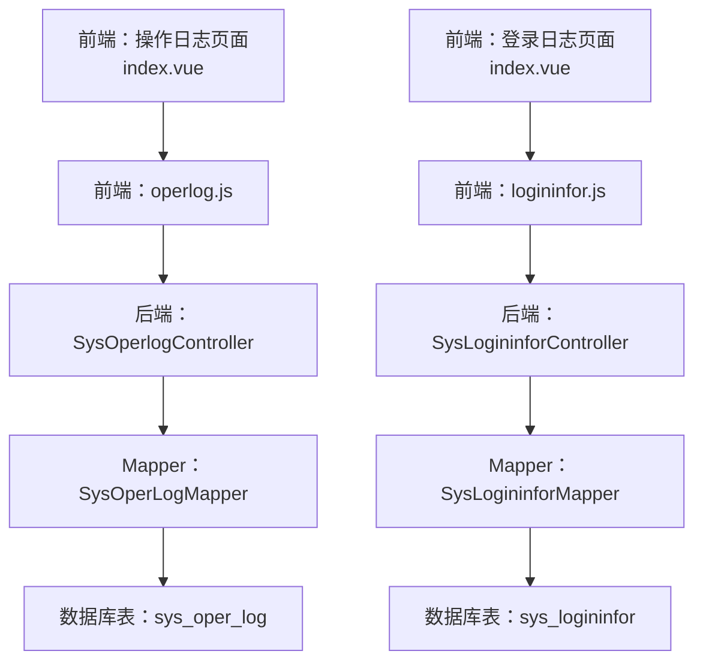
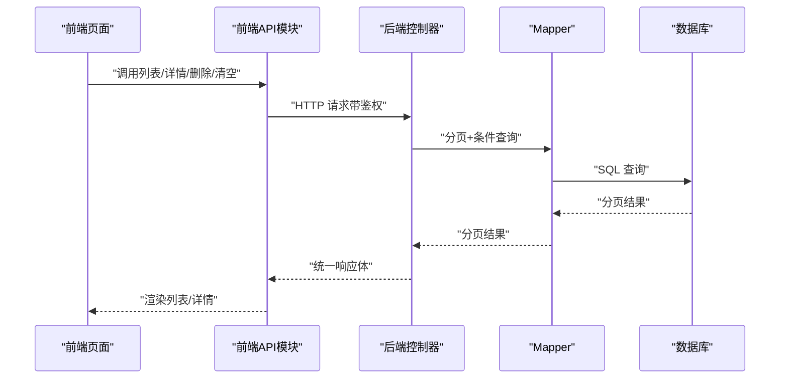
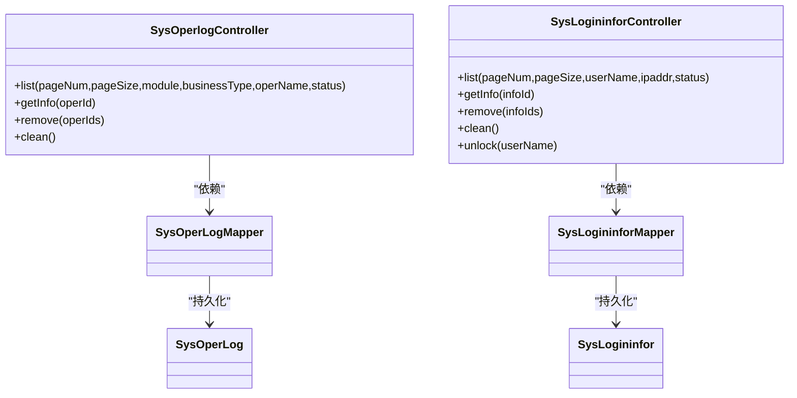

# 监控接口

<cite>
**本文引用的文件**
- [SysOperlogController.java](file://task-manager-backend/src/main/java/com/taskmanager/controller/SysOperlogController.java)
- [SysLogininforController.java](file://task-manager-backend/src/main/java/com/taskmanager/controller/SysLogininforController.java)
- [SysOperLog.java](file://task-manager-backend/src/main/java/com/taskmanager/domain/SysOperLog.java)
- [SysLogininfor.java](file://task-manager-backend/src/main/java/com/taskmanager/domain/SysLogininfor.java)
- [BusinessTypeEnum.java](file://task-manager-backend/src/main/java/com/taskmanager/common/enums/BusinessTypeEnum.java)
- [Log.java](file://task-manager-backend/src/main/java/com/taskmanager/common/annotation/Log.java)
- [SysOperLogMapper.java](file://task-manager-backend/src/main/java/com/taskmanager/mapper/SysOperLogMapper.java)
- [SysLogininforMapper.java](file://task-manager-backend/src/main/java/com/taskmanager/mapper/SysLogininforMapper.java)
- [operlog.js](file://task-manager-frontend/src/api/monitor/operlog.js)
- [logininfor.js](file://task-manager-frontend/src/api/monitor/logininfor.js)
- [index.vue（操作日志）](file://task-manager-frontend/src/views/monitor/operlog/index.vue)
- [index.vue（登录日志）](file://task-manager-frontend/src/views/monitor/logininfor/index.vue)
- [SysOperlogControllerTest.java](file://task-manager-backend/src/test/java/com/taskmanager/controller/SysOperlogControllerTest.java)
- [SysLogininforControllerTest.java](file://task-manager-backend/src/test/java/com/taskmanager/controller/SysLogininforControllerTest.java)
</cite>

## 目录
1. [简介](#简介)
2. [项目结构](#项目结构)
3. [核心组件](#核心组件)
4. [架构总览](#架构总览)
5. [详细组件分析](#详细组件分析)
6. [依赖分析](#依赖分析)
7. [性能考虑](#性能考虑)
8. [故障排查指南](#故障排查指南)
9. [结论](#结论)
10. [附录](#附录)

## 简介
本文件为 CodeBuddy 任务管理系统“监控模块”的 API 接口文档，覆盖“操作日志”和“登录日志”的查询、统计、管理能力。文档面向系统管理员与前端开发人员，提供完整接口清单、参数说明、分页机制、字段定义、过滤条件、权限要求以及性能优化建议，并给出日志分析、统计报表与导出的使用示例与最佳实践。

## 项目结构
监控模块由后端 Spring Boot 控制器与前端 Vue 组件构成，采用前后端分离架构：
- 后端控制器负责接收请求、执行权限校验、调用 Mapper 进行数据库分页查询与过滤，并返回统一结果包装。
- 前端通过封装的 API 模块调用后端接口，完成日志列表展示、筛选、分页与管理操作。

图表来源
- [SysOperlogController.java:18-79](file://task-manager-backend/src/main/java/com/taskmanager/controller/SysOperlogController.java#L18-L79)
- [SysLogininforController.java:17-86](file://task-manager-backend/src/main/java/com/taskmanager/controller/SysLogininforController.java#L17-L86)
- [operlog.js:1-18](file://task-manager-frontend/src/api/monitor/operlog.js#L1-L18)
- [logininfor.js:1-18](file://task-manager-frontend/src/api/monitor/logininfor.js#L1-L18)

章节来源
- [SysOperlogController.java:18-79](file://task-manager-backend/src/main/java/com/taskmanager/controller/SysOperlogController.java#L18-L79)
- [SysLogininforController.java:17-86](file://task-manager-backend/src/main/java/com/taskmanager/controller/SysLogininforController.java#L17-L86)
- [operlog.js:1-18](file://task-manager-frontend/src/api/monitor/operlog.js#L1-L18)
- [logininfor.js:1-18](file://task-manager-frontend/src/api/monitor/logininfor.js#L1-L18)

## 核心组件
- 操作日志控制器：提供分页查询、详情查询、批量删除、清空、按模块/业务类型/操作人/状态筛选。
- 登录日志控制器：提供分页查询、详情查询、批量删除、清空、按账号/IP/状态筛选，预留账号解锁接口。
- 数据模型：操作日志与登录日志实体定义了字段、类型与含义；业务类型枚举定义了操作分类。
- 前端 API 封装：统一暴露 GET/DELETE 等方法，便于页面直接调用。

章节来源
- [SysOperlogController.java:28-78](file://task-manager-backend/src/main/java/com/taskmanager/controller/SysOperlogController.java#L28-L78)
- [SysLogininforController.java:27-85](file://task-manager-backend/src/main/java/com/taskmanager/controller/SysLogininforController.java#L27-L85)
- [SysOperLog.java:16-73](file://task-manager-backend/src/main/java/com/taskmanager/domain/SysOperLog.java#L16-L73)
- [SysLogininfor.java:16-49](file://task-manager-backend/src/main/java/com/taskmanager/domain/SysLogininfor.java#L16-L49)
- [BusinessTypeEnum.java:8-55](file://task-manager-backend/src/main/java/com/taskmanager/common/enums/BusinessTypeEnum.java#L8-L55)
- [operlog.js:3-17](file://task-manager-frontend/src/api/monitor/operlog.js#L3-L17)
- [logininfor.js:3-17](file://task-manager-frontend/src/api/monitor/logininfor.js#L3-L17)

## 架构总览
后端控制器通过 MyBatis-Plus 的分页器与条件构造器实现高效查询；前端页面通过封装的 API 发起请求并渲染结果。权限注解确保只有具备相应权限的用户可访问。

图表来源
- [SysOperlogController.java:28-78](file://task-manager-backend/src/main/java/com/taskmanager/controller/SysOperlogController.java#L28-L78)
- [SysLogininforController.java:27-85](file://task-manager-backend/src/main/java/com/taskmanager/controller/SysLogininforController.java#L27-L85)
- [operlog.js:3-17](file://task-manager-frontend/src/api/monitor/operlog.js#L3-L17)
- [logininfor.js:3-17](file://task-manager-frontend/src/api/monitor/logininfor.js#L3-L17)

## 详细组件分析

### 操作日志接口
- 接口目标：查询与管理操作日志，支持按模块、业务类型、操作人、状态筛选，支持分页与详情查看。
- 权限要求：需具备 monitor:operlog:list、monitor:operlog:query、monitor:operlog:remove 等权限位。

接口清单
- GET /api/monitor/operlog/list
  - 功能：分页查询操作日志列表
  - 权限：monitor:operlog:list
  - 查询参数：
    - pageNum：页码，默认 1
    - pageSize：每页条数，默认 10
    - module：模块名称（模糊匹配）
    - businessType：业务类型（0 其它、1 新增、2 修改、3 删除 等）
    - operName：操作人员（模糊匹配）
    - status：操作状态（0 正常、1 异常）
  - 返回：分页结果，包含 total 与 rows
  - 示例：参见单元测试中的请求构造与断言
    - [SysOperlogControllerTest.java:111-143](file://task-manager-backend/src/test/java/com/taskmanager/controller/SysOperlogControllerTest.java#L111-L143)

- GET /api/monitor/operlog/{operId}
  - 功能：获取操作日志详情
  - 权限：monitor:operlog:query
  - 路径参数：operId（日志主键）
  - 示例：参见单元测试
    - [SysOperlogControllerTest.java:162-167](file://task-manager-backend/src/test/java/com/taskmanager/controller/SysOperlogControllerTest.java#L162-L167)

- DELETE /api/monitor/operlog/{operIds}
  - 功能：批量删除操作日志
  - 权限：monitor:operlog:remove
  - 路径参数：operIds（逗号分隔的多个主键）
  - 示例：参见单元测试
    - [SysOperlogControllerTest.java:178-181](file://task-manager-backend/src/test/java/com/taskmanager/controller/SysOperlogControllerTest.java#L178-L181)

- DELETE /api/monitor/operlog/clean
  - 功能：清空所有操作日志
  - 权限：monitor:operlog:remove
  - 示例：参见单元测试
    - [SysOperlogControllerTest.java:192-195](file://task-manager-backend/src/test/java/com/taskmanager/controller/SysOperlogControllerTest.java#L192-L195)

前端对接要点
- 前端已封装对应方法，可直接调用：
  - listOperLog(query)
  - getOperLog(operId)
  - delOperLog(operIds)
  - cleanOperLog()
  - 参考：[operlog.js:3-17](file://task-manager-frontend/src/api/monitor/operlog.js#L3-L17)
- 页面组件已定义查询参数与分页控件，待接入后端 API 即可使用：
  - 参考：[index.vue（操作日志）:75-89](file://task-manager-frontend/src/views/monitor/operlog/index.vue#L75-L89)

日志字段定义（操作日志）
- operId：日志主键
- module：模块标题
- businessType：业务类型（枚举映射）
- method：方法名称
- requestMethod：请求方式（GET/POST/PUT/DELETE）
- operatorType：操作类别（0 其它、1 后台用户）
- operName：操作人员
- deptName：部门名称
- operUrl：请求URL
- operIp：主机地址（IP）
- operLocation：操作地点
- operParam：请求参数（JSON 格式）
- jsonResult：返回参数（JSON 格式）
- status：操作状态（0 正常、1 异常）
- errorMsg：错误消息
- operTime：操作时间
- costTime：消耗时间（毫秒）

章节来源
- [SysOperlogController.java:28-78](file://task-manager-backend/src/main/java/com/taskmanager/controller/SysOperlogController.java#L28-L78)
- [SysOperLog.java:16-73](file://task-manager-backend/src/main/java/com/taskmanager/domain/SysOperLog.java#L16-L73)
- [BusinessTypeEnum.java:8-55](file://task-manager-backend/src/main/java/com/taskmanager/common/enums/BusinessTypeEnum.java#L8-L55)
- [operlog.js:3-17](file://task-manager-frontend/src/api/monitor/operlog.js#L3-L17)
- [index.vue（操作日志）:75-89](file://task-manager-frontend/src/views/monitor/operlog/index.vue#L75-L89)
- [SysOperlogControllerTest.java:93-196](file://task-manager-backend/src/test/java/com/taskmanager/controller/SysOperlogControllerTest.java#L93-L196)

### 登录日志接口
- 接口目标：查询与管理登录日志，支持按账号、IP、状态筛选，支持分页与详情查看。
- 权限要求：需具备 monitor:logininfor:list、monitor:logininfor:query、monitor:logininfor:remove、monitor:logininfor:unlock 等权限位。

接口清单
- GET /api/monitor/logininfor/list
  - 功能：分页查询登录日志列表
  - 权限：monitor:logininfor:list
  - 查询参数：
    - pageNum：页码，默认 1
    - pageSize：每页条数，默认 10
    - userName：用户账号（模糊匹配）
    - ipaddr：登录IP（模糊匹配）
    - status：登录状态（0 成功、1 失败）
  - 返回：分页结果，包含 total 与 rows
  - 示例：参见单元测试中的请求构造与断言
    - [SysLogininforControllerTest.java:111-142](file://task-manager-backend/src/test/java/com/taskmanager/controller/SysLogininforControllerTest.java#L111-L142)

- GET /api/monitor/logininfor/{infoId}
  - 功能：获取登录日志详情
  - 权限：monitor:logininfor:query
  - 路径参数：infoId（日志主键）
  - 示例：参见单元测试
    - [SysLogininforControllerTest.java:161-166](file://task-manager-backend/src/test/java/com/taskmanager/controller/SysLogininforControllerTest.java#L161-L166)

- DELETE /api/monitor/logininfor/{infoIds}
  - 功能：批量删除登录日志
  - 权限：monitor:logininfor:remove
  - 路径参数：infoIds（逗号分隔的多个主键）
  - 示例：参见单元测试
    - [SysLogininforControllerTest.java:177-181](file://task-manager-backend/src/test/java/com/taskmanager/controller/SysLogininforControllerTest.java#L177-L181)

- DELETE /api/monitor/logininfor/clean
  - 功能：清空所有登录日志
  - 权限：monitor:logininfor:remove
  - 示例：参见单元测试
    - [SysLogininforControllerTest.java:191-194](file://task-manager-backend/src/test/java/com/taskmanager/controller/SysLogininforControllerTest.java#L191-L194)

- GET /api/monitor/logininfor/unlock/{userName}
  - 功能：账号解锁（预留接口）
  - 权限：monitor:logininfor:unlock
  - 路径参数：userName（用户账号）
  - 说明：当前预留，未实现具体逻辑
  - 示例：参见单元测试
    - [SysLogininforControllerTest.java:199-200](file://task-manager-backend/src/test/java/com/taskmanager/controller/SysLogininforControllerTest.java#L199-L200)

前端对接要点
- 前端已封装对应方法，可直接调用：
  - listLogininfor(query)
  - delLogininfor(infoIds)
  - cleanLogininfor()
  - unlockLogininfor(userName)
  - 参考：[logininfor.js:3-17](file://task-manager-frontend/src/api/monitor/logininfor.js#L3-L17)
- 页面组件已定义查询参数与分页控件，待接入后端 API 即可使用：
  - 参考：[index.vue（登录日志）:62-78](file://task-manager-frontend/src/views/monitor/logininfor/index.vue#L62-L78)

日志字段定义（登录日志）
- infoId：访问ID
- userName：用户账号
- ipaddr：登录IP地址
- loginLocation：登录地点
- browser：浏览器类型
- os：操作系统
- status：登录状态（0 成功、1 失败）
- msg：提示消息
- loginTime：访问时间

章节来源
- [SysLogininforController.java:27-85](file://task-manager-backend/src/main/java/com/taskmanager/controller/SysLogininforController.java#L27-L85)
- [SysLogininfor.java:16-49](file://task-manager-backend/src/main/java/com/taskmanager/domain/SysLogininfor.java#L16-L49)
- [logininfor.js:3-17](file://task-manager-frontend/src/api/monitor/logininfor.js#L3-L17)
- [index.vue（登录日志）:62-78](file://task-manager-frontend/src/views/monitor/logininfor/index.vue#L62-L78)
- [SysLogininforControllerTest.java:93-200](file://task-manager-backend/src/test/java/com/taskmanager/controller/SysLogininforControllerTest.java#L93-L200)

### 权限与注解
- 权限注解：@PreAuthorize 使用 SpEL 表达式校验权限位，确保接口安全访问。
- 业务类型注解：@Log 注解用于标记需要记录操作日志的方法，配合切面自动采集请求参数、响应参数、业务类型等信息。
- 业务类型枚举：定义了 OTHER、INSERT、UPDATE、DELETE、GRANT、EXPORT、IMPORT、FORCE、GENCODE、CLEAN 等业务类型，便于前端筛选与统计。

章节来源
- [SysOperlogController.java:28-78](file://task-manager-backend/src/main/java/com/taskmanager/controller/SysOperlogController.java#L28-L78)
- [SysLogininforController.java:27-85](file://task-manager-backend/src/main/java/com/taskmanager/controller/SysLogininforController.java#L27-L85)
- [Log.java:13-37](file://task-manager-backend/src/main/java/com/taskmanager/common/annotation/Log.java#L13-L37)
- [BusinessTypeEnum.java:8-55](file://task-manager-backend/src/main/java/com/taskmanager/common/enums/BusinessTypeEnum.java#L8-L55)

## 依赖分析
- 控制器依赖 Mapper 接口进行数据访问，Mapper 继承 MyBatis-Plus 基类，天然支持分页与条件查询。
- 前端 API 模块对控制器接口进行轻量封装，便于在页面中直接调用。
- 前端页面组件通过查询参数与分页控件与后端接口形成闭环。

图表来源
- [SysOperlogController.java:22-23](file://task-manager-backend/src/main/java/com/taskmanager/controller/SysOperlogController.java#L22-L23)
- [SysLogininforController.java:21-22](file://task-manager-backend/src/main/java/com/taskmanager/controller/SysLogininforController.java#L21-L22)
- [SysOperLogMapper.java:11-12](file://task-manager-backend/src/main/java/com/taskmanager/mapper/SysOperLogMapper.java#L11-L12)
- [SysLogininforMapper.java:11-12](file://task-manager-backend/src/main/java/com/taskmanager/mapper/SysLogininforMapper.java#L11-L12)
- [SysOperLog.java:16-73](file://task-manager-backend/src/main/java/com/taskmanager/domain/SysOperLog.java#L16-L73)
- [SysLogininfor.java:16-49](file://task-manager-backend/src/main/java/com/taskmanager/domain/SysLogininfor.java#L16-L49)

章节来源
- [SysOperlogController.java:22-23](file://task-manager-backend/src/main/java/com/taskmanager/controller/SysOperlogController.java#L22-L23)
- [SysLogininforController.java:21-22](file://task-manager-backend/src/main/java/com/taskmanager/controller/SysLogininforController.java#L21-L22)
- [SysOperLogMapper.java:11-12](file://task-manager-backend/src/main/java/com/taskmanager/mapper/SysOperLogMapper.java#L11-L12)
- [SysLogininforMapper.java:11-12](file://task-manager-backend/src/main/java/com/taskmanager/mapper/SysLogininforMapper.java#L11-L12)

## 性能考虑
- 分页与排序
  - 后端默认按时间倒序，避免全表扫描；建议前端固定排序字段并合理设置 pageSize。
- 条件过滤
  - 对字符串字段使用模糊匹配时，建议配合前缀索引或限定输入长度，减少回表与全表扫描。
- 索引建议
  - 在 operTime、loginTime、operName、userName、operIp、ipaddr 等高频过滤字段上建立合适索引，提升查询效率。
- 缓存策略
  - 对热点查询（如最近 N 条登录日志）可引入 Redis 缓存，降低数据库压力。
- 批处理与异步
  - 批量删除与清空操作建议异步执行并提供进度反馈，避免阻塞主线程。
- 响应优化
  - 建议仅返回必要字段，避免传输大字段（如 JSON 参数），必要时提供“精简模式”与“详情模式”。

## 故障排查指南
- 权限不足
  - 现象：返回 403 Forbidden
  - 排查：确认用户是否具备 monitor:operlog:* 或 monitor:logininfor:* 权限位
  - 参考：单元测试中对无权限场景的断言
    - [SysOperlogControllerTest.java:213-217](file://task-manager-backend/src/test/java/com/taskmanager/controller/SysOperlogControllerTest.java#L213-L217)
    - [SysLogininforControllerTest.java:200-200](file://task-manager-backend/src/test/java/com/taskmanager/controller/SysLogininforControllerTest.java#L200-L200)
- 参数不合法
  - 现象：查询无结果或结果异常
  - 排查：检查 pageNum/pageSize 是否越界；模糊匹配参数是否过短；业务类型/状态枚举值是否正确
- 数据量过大
  - 现象：接口响应慢
  - 排查：增加时间范围、缩小业务类型范围、调整分页大小；评估索引与 SQL 执行计划
- 前端未接入
  - 现象：页面空白或无数据
  - 排查：确认前端 API 方法已正确调用，且已将查询参数绑定到分页组件

章节来源
- [SysOperlogControllerTest.java:213-217](file://task-manager-backend/src/test/java/com/taskmanager/controller/SysOperlogControllerTest.java#L213-L217)
- [SysLogininforControllerTest.java:200-200](file://task-manager-backend/src/test/java/com/taskmanager/controller/SysLogininforControllerTest.java#L200-L200)

## 结论
监控模块提供了完善的日志查询与管理能力，结合权限注解与统一响应包装，既保证了安全性也提升了可维护性。通过合理的索引设计、分页策略与缓存方案，可在高并发场景下保持稳定性能。建议管理员定期清理历史日志、设定合理的保留周期，并基于日志进行安全审计与运行状态分析。

## 附录

### API 使用示例与最佳实践
- 日志查询
  - 操作日志：传入 pageNum、pageSize、module、businessType、operName、status，获取分页列表
  - 登录日志：传入 pageNum、pageSize、userName、ipaddr、status，获取分页列表
- 统计报表
  - 基于业务类型与状态进行聚合统计（如每日登录成功/失败趋势），建议后端提供聚合接口或前端二次聚合
- 导出功能
  - 建议后端提供 CSV/Excel 导出接口，前端触发下载；若后端暂未提供，可先将分页数据拉取至前端再本地导出
- 最佳实践
  - 固定排序字段（时间倒序），避免重复翻页导致的数据抖动
  - 严格控制模糊匹配的字符长度，防止全表扫描
  - 对敏感字段（如请求参数）进行脱敏处理后再入库或导出