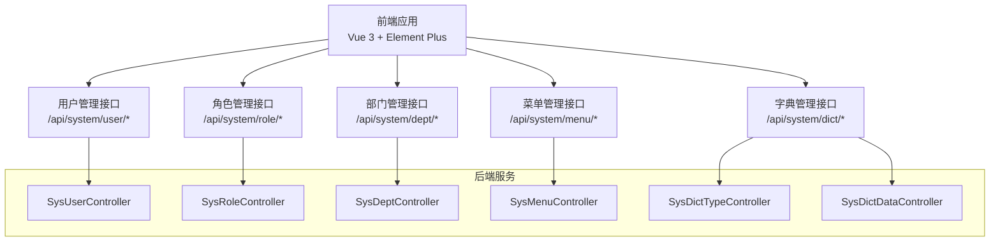
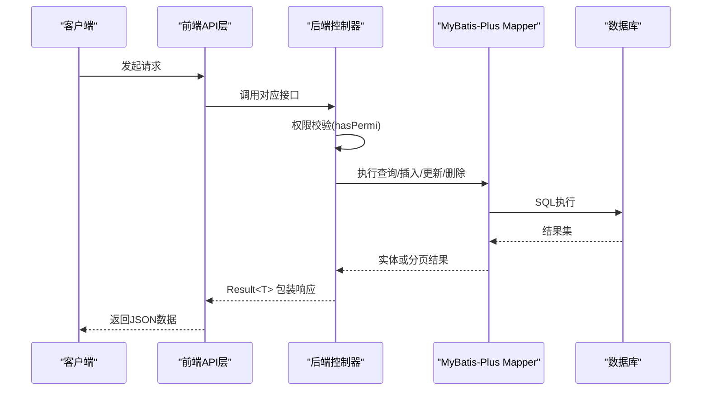
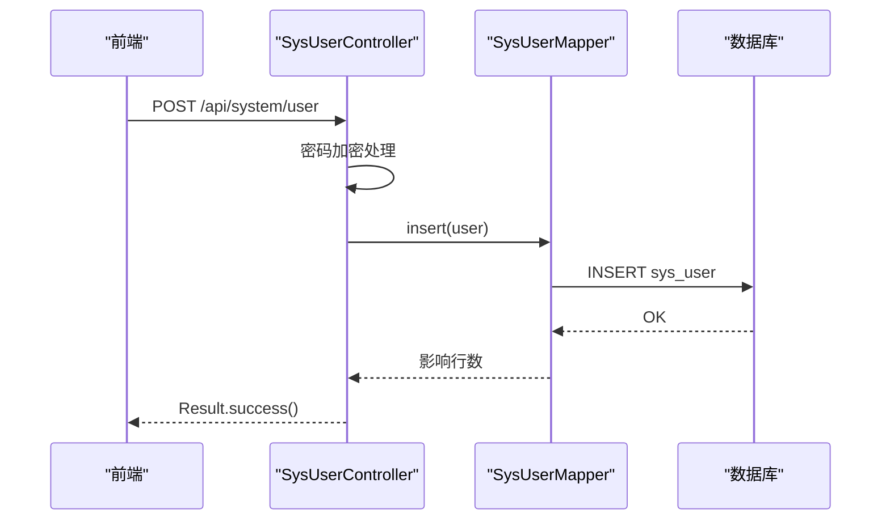
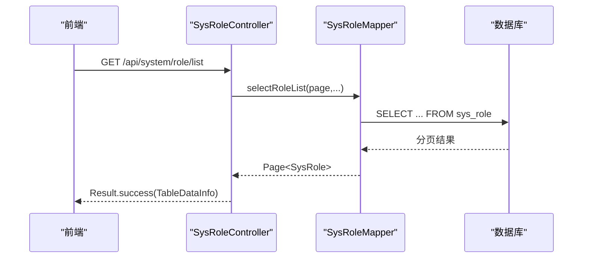
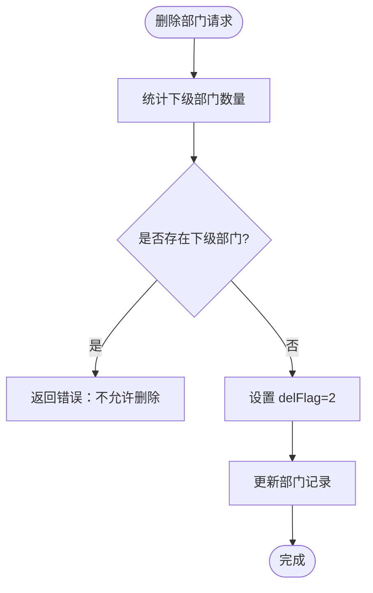
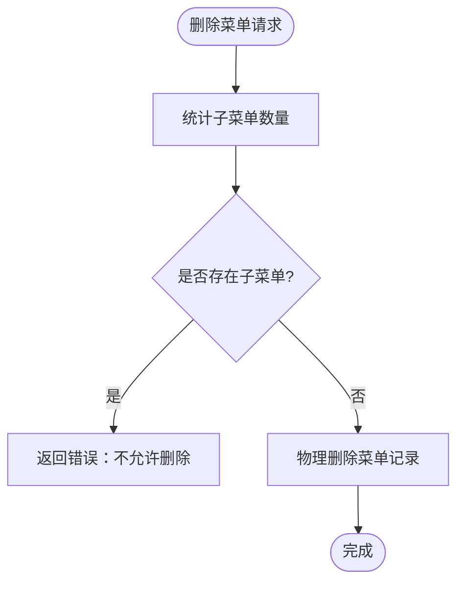
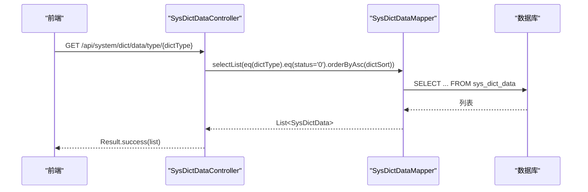
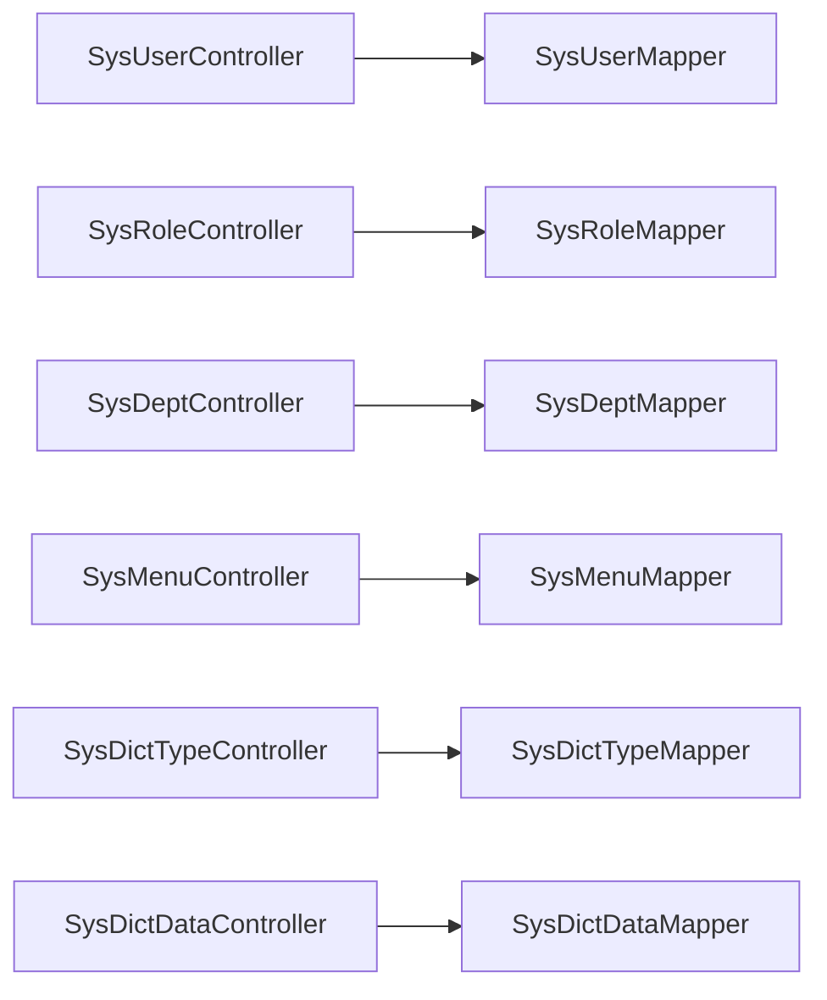

# 系统管理接口

<cite>
**本文档引用的文件**
- [SysUserController.java](file://task-manager-backend/src/main/java/com/taskmanager/controller/SysUserController.java)
- [SysRoleController.java](file://task-manager-backend/src/main/java/com/taskmanager/controller/SysRoleController.java)
- [SysDeptController.java](file://task-manager-backend/src/main/java/com/taskmanager/controller/SysDeptController.java)
- [SysMenuController.java](file://task-manager-backend/src/main/java/com/taskmanager/controller/SysMenuController.java)
- [SysDictTypeController.java](file://task-manager-backend/src/main/java/com/taskmanager/controller/SysDictTypeController.java)
- [SysDictDataController.java](file://task-manager-backend/src/main/java/com/taskmanager/controller/SysDictDataController.java)
- [SysUser.java](file://task-manager-backend/src/main/java/com/taskmanager/domain/SysUser.java)
- [SysRole.java](file://task-manager-backend/src/main/java/com/taskmanager/domain/SysRole.java)
- [SysDept.java](file://task-manager-backend/src/main/java/com/taskmanager/domain/SysDept.java)
- [SysMenu.java](file://task-manager-backend/src/main/java/com/taskmanager/domain/SysMenu.java)
- [SysDictType.java](file://task-manager-backend/src/main/java/com/taskmanager/domain/SysDictType.java)
- [SysDictData.java](file://task-manager-backend/src/main/java/com/taskmanager/domain/SysDictData.java)
- [user.js](file://task-manager-frontend/src/api/system/user.js)
- [role.js](file://task-manager-frontend/src/api/system/role.js)
- [dept.js](file://task-manager-frontend/src/api/system/dept.js)
- [menu.js](file://task-manager-frontend/src/api/system/menu.js)
- [dict.js](file://task-manager-frontend/src/api/system/dict.js)
</cite>

## 目录
1. [简介](#简介)
2. [项目结构](#项目结构)
3. [核心组件](#核心组件)
4. [架构总览](#架构总览)
5. [详细组件分析](#详细组件分析)
6. [依赖分析](#依赖分析)
7. [性能考虑](#性能考虑)
8. [故障排除指南](#故障排除指南)
9. [结论](#结论)
10. [附录](#附录)

## 简介
本文件为 CodeBuddy 任务管理系统中“系统管理”模块的完整 API 接口文档，覆盖用户管理、角色管理、部门管理、菜单管理、字典管理等核心功能。文档面向系统管理员与开发者，提供每个模块的 CRUD 操作接口说明、请求参数、响应格式、分页机制、排序规则、权限控制、数据验证与业务规则等实现细节，并给出数据模型说明与接口调用示例。

## 项目结构
系统管理模块采用前后端分离架构，后端基于 Spring Boot + MyBatis-Plus，前端基于 Vue 3 + Element Plus。后端通过 REST 控制器暴露统一前缀为 `/api/system` 的管理接口，前端通过独立的 API 文件封装各模块请求方法。

图表来源
- [SysUserController.java:20-131](file://task-manager-backend/src/main/java/com/taskmanager/controller/SysUserController.java#L20-L131)
- [SysRoleController.java:19-82](file://task-manager-backend/src/main/java/com/taskmanager/controller/SysRoleController.java#L19-L82)
- [SysDeptController.java:19-84](file://task-manager-backend/src/main/java/com/taskmanager/controller/SysDeptController.java#L19-L84)
- [SysMenuController.java:19-85](file://task-manager-backend/src/main/java/com/taskmanager/controller/SysMenuController.java#L19-L85)
- [SysDictTypeController.java:19-77](file://task-manager-backend/src/main/java/com/taskmanager/controller/SysDictTypeController.java#L19-L77)
- [SysDictDataController.java:19-87](file://task-manager-backend/src/main/java/com/taskmanager/controller/SysDictDataController.java#L19-L87)

章节来源
- [SysUserController.java:1-132](file://task-manager-backend/src/main/java/com/taskmanager/controller/SysUserController.java#L1-L132)
- [SysRoleController.java:1-83](file://task-manager-backend/src/main/java/com/taskmanager/controller/SysRoleController.java#L1-L83)
- [SysDeptController.java:1-85](file://task-manager-backend/src/main/java/com/taskmanager/controller/SysDeptController.java#L1-L85)
- [SysMenuController.java:1-86](file://task-manager-backend/src/main/java/com/taskmanager/controller/SysMenuController.java#L1-L86)
- [SysDictTypeController.java:1-78](file://task-manager-backend/src/main/java/com/taskmanager/controller/SysDictTypeController.java#L1-L78)
- [SysDictDataController.java:1-88](file://task-manager-backend/src/main/java/com/taskmanager/controller/SysDictDataController.java#L1-L88)

## 核心组件
- 用户管理模块：支持用户列表查询（分页+条件）、详情获取、新增、修改、删除（逻辑删除）、重置密码、修改状态。
- 角色管理模块：支持角色列表查询（分页+条件）、详情获取、新增、修改、删除（逻辑删除）。
- 部门管理模块：支持部门树形列表、详情获取、新增（自动计算祖先路径）、修改、删除（校验子部门与关联用户）。
- 菜单管理模块：支持菜单平铺列表、菜单树选择、详情获取、新增、修改、删除（校验子菜单，注意 sys_menu 无 del_flag，执行物理删除）。
- 字典管理模块：支持字典类型分页查询、详情、新增、修改、删除；支持字典数据分页查询、按类型查询（公开接口）、详情、新增、修改、删除。

章节来源
- [SysUserController.java:30-130](file://task-manager-backend/src/main/java/com/taskmanager/controller/SysUserController.java#L30-L130)
- [SysRoleController.java:26-81](file://task-manager-backend/src/main/java/com/taskmanager/controller/SysRoleController.java#L26-L81)
- [SysDeptController.java:26-83](file://task-manager-backend/src/main/java/com/taskmanager/controller/SysDeptController.java#L26-L83)
- [SysMenuController.java:26-84](file://task-manager-backend/src/main/java/com/taskmanager/controller/SysMenuController.java#L26-L84)
- [SysDictTypeController.java:26-76](file://task-manager-backend/src/main/java/com/taskmanager/controller/SysDictTypeController.java#L26-L76)
- [SysDictDataController.java:26-86](file://task-manager-backend/src/main/java/com/taskmanager/controller/SysDictDataController.java#L26-L86)

## 架构总览
后端控制器通过 Spring Security 注解进行权限控制，所有接口均以统一前缀 `/api/system` 暴露。分页使用 MyBatis-Plus Page 对象，返回统一包装结果对象。前端通过独立 API 文件封装请求方法，便于复用与维护。

图表来源
- [SysUserController.java:33-44](file://task-manager-backend/src/main/java/com/taskmanager/controller/SysUserController.java#L33-L44)
- [SysRoleController.java:29-39](file://task-manager-backend/src/main/java/com/taskmanager/controller/SysRoleController.java#L29-L39)
- [SysDeptController.java:27-31](file://task-manager-backend/src/main/java/com/taskmanager/controller/SysDeptController.java#L27-L31)
- [SysMenuController.java:27-31](file://task-manager-backend/src/main/java/com/taskmanager/controller/SysMenuController.java#L27-L31)
- [SysDictTypeController.java:27-40](file://task-manager-backend/src/main/java/com/taskmanager/controller/SysDictTypeController.java#L27-L40)
- [SysDictDataController.java:27-37](file://task-manager-backend/src/main/java/com/taskmanager/controller/SysDictDataController.java#L27-L37)

## 详细组件分析

### 用户管理接口
- 接口前缀：/api/system/user
- 权限注解：hasPermi('system:user:list'|'system:user:query'|'system:user:add'|'system:user:edit'|'system:user:remove'|'system:user:resetPwd')
- 分页与筛选：支持 pageNum、pageSize，默认值分别为 1、10；可选筛选字段包括 userName、phonenumber、status、deptId。
- 列表查询：GET /list
- 详情获取：GET /{userId}
- 新增用户：POST，请求体为 SysUser，密码自动加密，状态默认 0，删除标志默认 0。
- 修改用户：PUT，请求体为 SysUser；若传入新密码则加密更新，否则保留旧密码。
- 删除用户：DELETE /{userIds}，批量逻辑删除（delFlag=2）。
- 重置密码：PUT /resetPwd，请求体为 SysUser，设置默认密码并加密。
- 修改状态：PUT /changeStatus，请求体为 SysUser。

图表来源
- [SysUserController.java:59-70](file://task-manager-backend/src/main/java/com/taskmanager/controller/SysUserController.java#L59-L70)
- [SysUser.java:16-79](file://task-manager-backend/src/main/java/com/taskmanager/domain/SysUser.java#L16-L79)

章节来源
- [SysUserController.java:30-130](file://task-manager-backend/src/main/java/com/taskmanager/controller/SysUserController.java#L30-L130)
- [user.js:1-37](file://task-manager-frontend/src/api/system/user.js#L1-L37)
- [SysUser.java:16-79](file://task-manager-backend/src/main/java/com/taskmanager/domain/SysUser.java#L16-L79)

### 角色管理接口
- 接口前缀：/api/system/role
- 权限注解：hasPermi('system:role:list'|'system:role:query'|'system:role:add'|'system:role:edit'|'system:role:remove')
- 列表查询：GET /list，支持 roleName、roleKey、status 筛选。
- 详情获取：GET /{roleId}
- 新增角色：POST，请求体为 SysRole；未设置时默认 delFlag=0、dataScope=1。
- 修改角色：PUT，请求体为 SysRole。
- 删除角色：DELETE /{roleIds}，批量逻辑删除（delFlag=2）。

图表来源
- [SysRoleController.java:29-40](file://task-manager-backend/src/main/java/com/taskmanager/controller/SysRoleController.java#L29-L40)
- [SysRole.java:16-64](file://task-manager-backend/src/main/java/com/taskmanager/domain/SysRole.java#L16-L64)

章节来源
- [SysRoleController.java:26-81](file://task-manager-backend/src/main/java/com/taskmanager/controller/SysRoleController.java#L26-L81)
- [role.js:1-22](file://task-manager-frontend/src/api/system/role.js#L1-L22)
- [SysRole.java:16-64](file://task-manager-backend/src/main/java/com/taskmanager/domain/SysRole.java#L16-L64)

### 部门管理接口
- 接口前缀：/api/system/dept
- 权限注解：hasPermi('system:dept:list'|'system:dept:query'|'system:dept:add'|'system:dept:edit'|'system:dept:remove')
- 部门树形列表：GET /list，返回整棵树形结构。
- 详情获取：GET /{deptId}
- 新增部门：POST，请求体为 SysDept；父节点为空时 ancestors=0，否则继承父级 ancestors 并拼接 parentId；默认 delFlag=0、status=0。
- 修改部门：PUT，请求体为 SysDept。
- 删除部门：DELETE /{deptId}，若存在下级部门则拒绝删除，否则逻辑删除（delFlag=2）。

图表来源
- [SysDeptController.java:69-83](file://task-manager-backend/src/main/java/com/taskmanager/controller/SysDeptController.java#L69-L83)
- [SysDept.java:20-72](file://task-manager-backend/src/main/java/com/taskmanager/domain/SysDept.java#L20-L72)

章节来源
- [SysDeptController.java:26-83](file://task-manager-backend/src/main/java/com/taskmanager/controller/SysDeptController.java#L26-L83)
- [dept.js:1-22](file://task-manager-frontend/src/api/system/dept.js#L1-L22)
- [SysDept.java:20-72](file://task-manager-backend/src/main/java/com/taskmanager/domain/SysDept.java#L20-L72)

### 菜单管理接口
- 接口前缀：/api/system/menu
- 权限注解：hasPermi('system:menu:list'|'system:menu:query'|'system:menu:add'|'system:menu:edit'|'system:menu:remove')
- 菜单列表：GET /list，返回平铺列表（供前端构建树）。
- 菜单树选择：GET /treeSelect，返回可用于权限分配的树形菜单。
- 详情获取：GET /{menuId}
- 新增菜单：POST，请求体为 SysMenu；默认 visible=0、status=0。
- 修改菜单：PUT，请求体为 SysMenu。
- 删除菜单：DELETE /{menuId}，若存在子菜单则拒绝删除；sys_menu 无 del_flag，执行物理删除。

图表来源
- [SysMenuController.java:68-84](file://task-manager-backend/src/main/java/com/taskmanager/controller/SysMenuController.java#L68-L84)
- [SysMenu.java:20-91](file://task-manager-backend/src/main/java/com/taskmanager/domain/SysMenu.java#L20-L91)

章节来源
- [SysMenuController.java:26-84](file://task-manager-backend/src/main/java/com/taskmanager/controller/SysMenuController.java#L26-L84)
- [menu.js:1-26](file://task-manager-frontend/src/api/system/menu.js#L1-L26)
- [SysMenu.java:20-91](file://task-manager-backend/src/main/java/com/taskmanager/domain/SysMenu.java#L20-L91)

### 字典管理接口
- 字典类型接口前缀：/api/system/dict/type
- 字典数据接口前缀：/api/system/dict/data
- 权限注解：hasPermi('system:dict:list'|'system:dict:query'|'system:dict:add'|'system:dict:edit'|'system:dict:remove')

字典类型（SysDictType）
- 列表查询：GET /list，支持 dictName、dictType、status 筛选，分页。
- 详情获取：GET /{dictId}
- 新增类型：POST，请求体为 SysDictType；默认 status=0。
- 修改类型：PUT，请求体为 SysDictType。
- 删除类型：DELETE /{dictIds}，批量物理删除。

字典数据（SysDictData）
- 列表查询：GET /list，支持 dictType 筛选，按 dictSort 升序，分页。
- 公开接口：GET /type/{dictType}，返回指定类型的可用字典数据（status=0，按排序升序）。
- 详情获取：GET /{dictCode}
- 新增数据：POST，请求体为 SysDictData；默认 status=0、isDefault=N。
- 修改数据：PUT，请求体为 SysDictData。
- 删除数据：DELETE /{dictCodes}，批量物理删除。

图表来源
- [SysDictDataController.java:40-49](file://task-manager-backend/src/main/java/com/taskmanager/controller/SysDictDataController.java#L40-L49)
- [SysDictData.java:16-64](file://task-manager-backend/src/main/java/com/taskmanager/domain/SysDictData.java#L16-L64)

章节来源
- [SysDictTypeController.java:26-76](file://task-manager-backend/src/main/java/com/taskmanager/controller/SysDictTypeController.java#L26-L76)
- [SysDictDataController.java:26-86](file://task-manager-backend/src/main/java/com/taskmanager/controller/SysDictDataController.java#L26-L86)
- [dict.js:1-48](file://task-manager-frontend/src/api/system/dict.js#L1-L48)
- [SysDictType.java:16-49](file://task-manager-backend/src/main/java/com/taskmanager/domain/SysDictType.java#L16-L49)
- [SysDictData.java:16-64](file://task-manager-backend/src/main/java/com/taskmanager/domain/SysDictData.java#L16-L64)

## 依赖分析
- 控制器层：各控制器通过 @PreAuthorize 进行权限校验，调用对应的 Mapper 完成数据访问。
- 数据访问层：使用 MyBatis-Plus Page 实现分页，LambdaQueryWrapper 实现动态条件查询。
- 统一响应：Result<T> 封装成功/失败响应，TableDataInfo 用于分页数据包装。
- 安全控制：Spring Security + 自定义权限表达式 @ss.hasPermi(...)。

图表来源
- [SysUserController.java:24-28](file://task-manager-backend/src/main/java/com/taskmanager/controller/SysUserController.java#L24-L28)
- [SysRoleController.java:23-24](file://task-manager-backend/src/main/java/com/taskmanager/controller/SysRoleController.java#L23-L24)
- [SysDeptController.java:23-24](file://task-manager-backend/src/main/java/com/taskmanager/controller/SysDeptController.java#L23-L24)
- [SysMenuController.java:23-24](file://task-manager-backend/src/main/java/com/taskmanager/controller/SysMenuController.java#L23-L24)
- [SysDictTypeController.java:23-24](file://task-manager-backend/src/main/java/com/taskmanager/controller/SysDictTypeController.java#L23-L24)
- [SysDictDataController.java:23-24](file://task-manager-backend/src/main/java/com/taskmanager/controller/SysDictDataController.java#L23-L24)

章节来源
- [SysUserController.java:1-132](file://task-manager-backend/src/main/java/com/taskmanager/controller/SysUserController.java#L1-L132)
- [SysRoleController.java:1-83](file://task-manager-backend/src/main/java/com/taskmanager/controller/SysRoleController.java#L1-L83)
- [SysDeptController.java:1-85](file://task-manager-backend/src/main/java/com/taskmanager/controller/SysDeptController.java#L1-L85)
- [SysMenuController.java:1-86](file://task-manager-backend/src/main/java/com/taskmanager/controller/SysMenuController.java#L1-L86)
- [SysDictTypeController.java:1-78](file://task-manager-backend/src/main/java/com/taskmanager/controller/SysDictTypeController.java#L1-L78)
- [SysDictDataController.java:1-88](file://task-manager-backend/src/main/java/com/taskmanager/controller/SysDictDataController.java#L1-L88)

## 性能考虑
- 分页查询：使用 MyBatis-Plus Page 对象，避免一次性加载大量数据。
- 动态条件：通过 LambdaQueryWrapper 构建查询条件，减少 SQL 拼接。
- 树形构建：部门与菜单实体在内存中通过 children 字段构建树，前端负责渲染，降低数据库层级查询复杂度。
- 密码加密：新增/修改用户时对密码进行加密存储，保障安全性。

## 故障排除指南
- 权限不足：接口返回鉴权失败，请确认当前用户是否具备相应权限标识。
- 删除失败：
  - 部门：存在下级部门时无法删除。
  - 菜单：存在子菜单时无法删除。
- 参数校验：请求体或查询参数不符合要求时，后端会返回错误响应，请检查必填字段与数据类型。
- 物理删除：菜单类型 sys_menu 未提供 del_flag 字段，删除为物理删除，谨慎操作。

章节来源
- [SysDeptController.java:74-78](file://task-manager-backend/src/main/java/com/taskmanager/controller/SysDeptController.java#L74-L78)
- [SysMenuController.java:73-79](file://task-manager-backend/src/main/java/com/taskmanager/controller/SysMenuController.java#L73-L79)

## 结论
系统管理模块提供了完善的用户、角色、部门、菜单、字典的 CRUD 能力，结合权限控制与分页查询，满足后台管理场景需求。建议在生产环境中配合日志审计、参数校验与更严格的业务规则，持续优化用户体验与系统稳定性。

## 附录

### 数据模型说明

用户（SysUser）
- 关键字段：userId、deptId、userName、nickName、userType、email、phonenumber、sex、avatar、password、status、delFlag、loginIp、loginDate、remark 等。
- 说明：密码采用 BCrypt 加密存储；状态 0 正常、1 停用；删除标志 0 存在、2 删除。

角色（SysRole）
- 关键字段：roleId、roleName、roleKey、roleSort、dataScope、menuCheckStrictly、deptCheckStrictly、status、delFlag、remark 等。
- 说明：dataScope 决定数据范围（1 全部、2 自定义、3 本部门、4 本部门及以下、5 仅本人）。

部门（SysDept）
- 关键字段：deptId、parentId、ancestors、deptName、orderNum、leader、phone、email、status、delFlag、children（非持久化）等。
- 说明：ancestors 记录祖先路径，用于快速构建树形结构。

菜单（SysMenu）
- 关键字段：menuId、menuName、parentId、orderNum、path、component、query、routeName（非持久化）、isFrame、isCache、menuType、visible、status、perms、icon、children（非持久化）等。
- 说明：menuType 取值区分目录、菜单、按钮；visible 控制显示状态。

字典类型（SysDictType）
- 关键字段：dictId、dictName、dictType、status、remark 等。
- 说明：dictType 作为唯一标识，status 0 正常、1 停用。

字典数据（SysDictData）
- 关键字段：dictCode、dictSort、dictLabel、dictValue、dictType、cssClass、listClass、isDefault、status、remark 等。
- 说明：isDefault Y/N；按 dictSort 升序排列。

章节来源
- [SysUser.java:16-79](file://task-manager-backend/src/main/java/com/taskmanager/domain/SysUser.java#L16-L79)
- [SysRole.java:16-64](file://task-manager-backend/src/main/java/com/taskmanager/domain/SysRole.java#L16-L64)
- [SysDept.java:20-72](file://task-manager-backend/src/main/java/com/taskmanager/domain/SysDept.java#L20-L72)
- [SysMenu.java:20-91](file://task-manager-backend/src/main/java/com/taskmanager/domain/SysMenu.java#L20-L91)
- [SysDictType.java:16-49](file://task-manager-backend/src/main/java/com/taskmanager/domain/SysDictType.java#L16-L49)
- [SysDictData.java:16-64](file://task-manager-backend/src/main/java/com/taskmanager/domain/SysDictData.java#L16-L64)