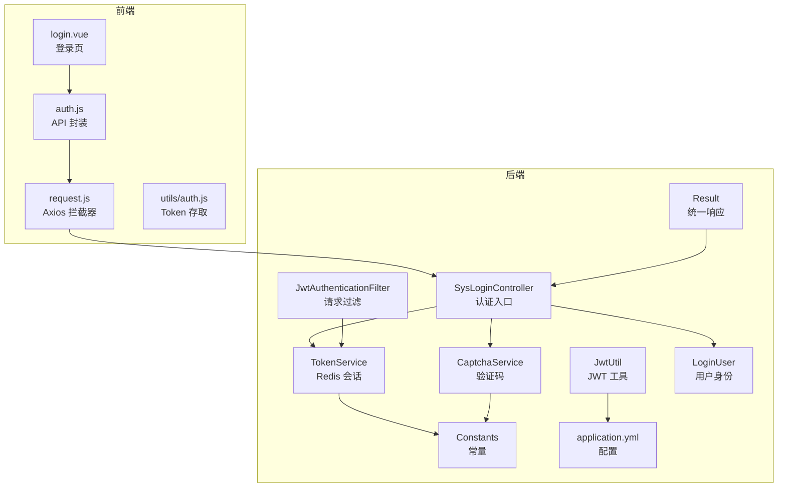
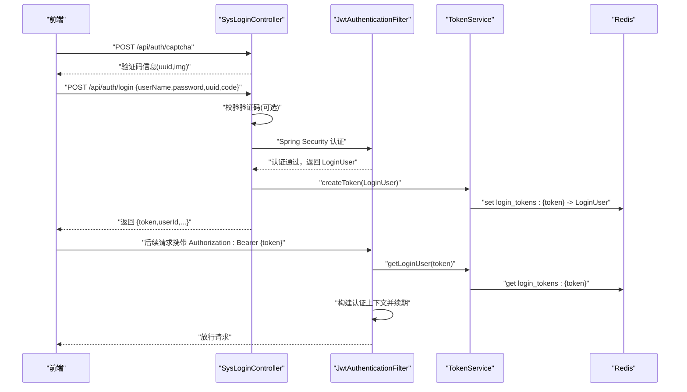
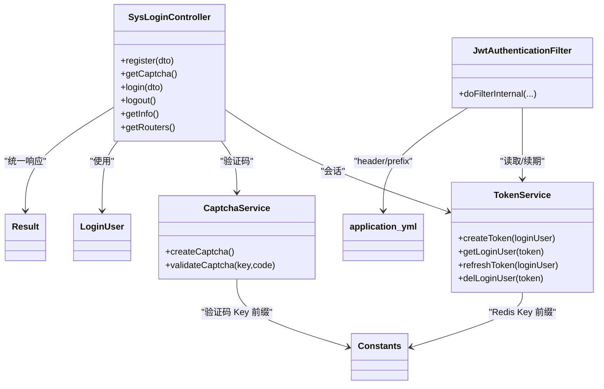
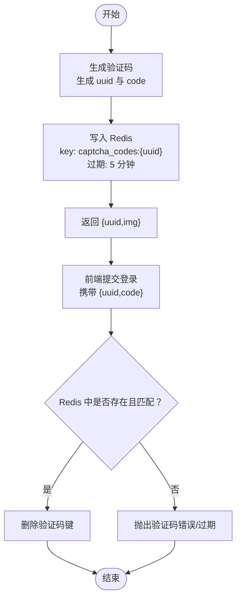
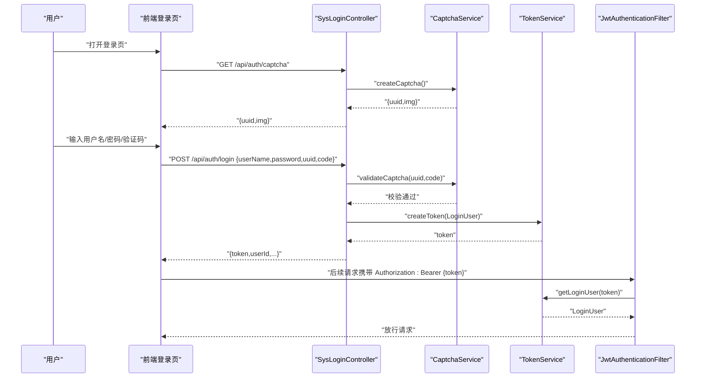

# 认证接口

<cite>
**本文引用的文件**
- [SysLoginController.java](file://task-manager-backend/src/main/java/com/taskmanager/controller/SysLoginController.java)
- [TokenService.java](file://task-manager-backend/src/main/java/com/taskmanager/security/TokenService.java)
- [CaptchaService.java](file://task-manager-backend/src/main/java/com/taskmanager/security/CaptchaService.java)
- [JwtAuthenticationFilter.java](file://task-manager-backend/src/main/java/com/taskmanager/security/JwtAuthenticationFilter.java)
- [JwtUtil.java](file://task-manager-backend/src/main/java/com/taskmanager/utils/JwtUtil.java)
- [LoginUser.java](file://task-manager-backend/src/main/java/com/taskmanager/security/LoginUser.java)
- [Constants.java](file://task-manager-backend/src/main/java/com/taskmanager/common/constant/Constants.java)
- [Result.java](file://task-manager-backend/src/main/java/com/taskmanager/common/Result.java)
- [application.yml](file://task-manager-backend/src/main/resources/application.yml)
- [auth.js（前端）](file://task-manager-frontend/src/api/auth.js)
- [auth.js（前端工具）](file://task-manager-frontend/src/utils/auth.js)
- [login.vue（前端登录页）](file://task-manager-frontend/src/views/login.vue)
- [request.js（前端请求封装）](file://task-manager-frontend/src/api/request.js)
</cite>

## 目录
1. [简介](#简介)
2. [项目结构](#项目结构)
3. [核心组件](#核心组件)
4. [架构总览](#架构总览)
5. [详细组件分析](#详细组件分析)
6. [依赖分析](#依赖分析)
7. [性能考量](#性能考量)
8. [故障排查指南](#故障排查指南)
9. [结论](#结论)
10. [附录](#附录)

## 简介
本文件为 CodeBuddy 任务管理系统的认证接口详细文档，覆盖以下能力：
- 用户登录与登出
- 图形验证码的获取与校验
- 获取当前登录用户信息（角色、权限）
- 动态路由信息（菜单树）获取
- JWT Token 的生成、验证与刷新机制
- 完整认证流程示例（从获取验证码到成功登录）
- 错误处理、权限验证与安全最佳实践

后端采用 Spring Security + Redis 会话管理；前端通过 Axios 拦截器自动注入认证头并统一封装响应。

## 项目结构
认证相关代码主要分布在后端控制器、安全模块与工具类，以及前端的 API 封装与登录页。

图示来源
- [SysLoginController.java:31-33](file://task-manager-backend/src/main/java/com/taskmanager/controller/SysLoginController.java#L31-L33)
- [JwtAuthenticationFilter.java:22-35](file://task-manager-backend/src/main/java/com/taskmanager/security/JwtAuthenticationFilter.java#L22-L35)
- [TokenService.java:18-26](file://task-manager-backend/src/main/java/com/taskmanager/security/TokenService.java#L18-L26)
- [CaptchaService.java:25-34](file://task-manager-backend/src/main/java/com/taskmanager/security/CaptchaService.java#L25-L34)
- [JwtUtil.java:18-31](file://task-manager-backend/src/main/java/com/taskmanager/utils/JwtUtil.java#L18-L31)
- [LoginUser.java:23-52](file://task-manager-backend/src/main/java/com/taskmanager/security/LoginUser.java#L23-L52)
- [Constants.java:8-39](file://task-manager-backend/src/main/java/com/taskmanager/common/constant/Constants.java#L8-L39)
- [Result.java:12-30](file://task-manager-backend/src/main/java/com/taskmanager/common/Result.java#L12-L30)
- [application.yml:51-56](file://task-manager-backend/src/main/resources/application.yml#L51-L56)
- [auth.js（前端）:1-53](file://task-manager-frontend/src/api/auth.js#L1-L53)
- [request.js（前端请求封装）:1-63](file://task-manager-frontend/src/api/request.js#L1-L63)
- [login.vue（前端登录页）:1-299](file://task-manager-frontend/src/views/login.vue#L1-L299)
- [auth.js（前端工具）:1-16](file://task-manager-frontend/src/utils/auth.js#L1-L16)

章节来源
- [SysLoginController.java:31-33](file://task-manager-backend/src/main/java/com/taskmanager/controller/SysLoginController.java#L31-L33)
- [application.yml:51-56](file://task-manager-backend/src/main/resources/application.yml#L51-L56)

## 核心组件
- 认证控制器：提供登录、登出、验证码、获取用户信息、获取路由等接口
- 会话服务：基于 Redis 的 Token 创建、刷新、删除与查询
- 验证码服务：生成图形验证码并校验
- JWT 工具：生成与验证 JWT（用于对比实现思路）
- 安全过滤器：从请求头提取 Token，从 Redis 解析用户并续期
- 统一响应：Result 统一返回结构
- 前端 API：封装 /api/auth 下各接口
- 前端拦截器：自动注入 Authorization 头并处理 401

章节来源
- [SysLoginController.java:31-33](file://task-manager-backend/src/main/java/com/taskmanager/controller/SysLoginController.java#L31-L33)
- [TokenService.java:18-26](file://task-manager-backend/src/main/java/com/taskmanager/security/TokenService.java#L18-L26)
- [CaptchaService.java:25-34](file://task-manager-backend/src/main/java/com/taskmanager/security/CaptchaService.java#L25-L34)
- [JwtUtil.java:18-31](file://task-manager-backend/src/main/java/com/taskmanager/utils/JwtUtil.java#L18-L31)
- [JwtAuthenticationFilter.java:22-35](file://task-manager-backend/src/main/java/com/taskmanager/security/JwtAuthenticationFilter.java#L22-L35)
- [Result.java:12-30](file://task-manager-backend/src/main/java/com/taskmanager/common/Result.java#L12-L30)
- [auth.js（前端）:1-53](file://task-manager-frontend/src/api/auth.js#L1-L53)
- [request.js（前端请求封装）:10-20](file://task-manager-frontend/src/api/request.js#L10-L20)

## 架构总览
后端采用“基于 Redis 的会话 Token”模式：
- 登录成功后生成随机 Token，保存至 Redis，设置过期时间
- 前端请求携带 Authorization: Bearer <token>
- 过滤器从请求头提取 Token，从 Redis 读取用户信息，构建认证上下文
- 每次有效请求自动刷新 Redis 过期时间

图示来源
- [SysLoginController.java:95-135](file://task-manager-backend/src/main/java/com/taskmanager/controller/SysLoginController.java#L95-L135)
- [JwtAuthenticationFilter.java:37-57](file://task-manager-backend/src/main/java/com/taskmanager/security/JwtAuthenticationFilter.java#L37-L57)
- [TokenService.java:34-41](file://task-manager-backend/src/main/java/com/taskmanager/security/TokenService.java#L34-L41)
- [Constants.java:28-29](file://task-manager-backend/src/main/java/com/taskmanager/common/constant/Constants.java#L28-L29)

## 详细组件分析

### 登录接口
- 方法与路径
  - POST /api/auth/login
- 请求体字段
  - userName: 用户名
  - password: 密码
  - uuid: 验证码唯一标识（可选，生产环境建议必填）
  - code: 验证码（可选）
  - rememberMe: 是否记住登录（当前实现未使用该字段）
- 成功响应
  - code: 200
  - data: 包含 token、userId、userName、nickName
- 异常与状态码
  - 验证码错误/过期：返回 500
  - 用户名或密码错误：由 Spring Security 抛出异常，最终统一为 500 或 401（取决于拦截器）
- 安全要点
  - 生产环境务必传入 uuid 与 code
  - 登录成功后将 LoginUser 写入 Redis，设置过期时间

章节来源
- [SysLoginController.java:103-135](file://task-manager-backend/src/main/java/com/taskmanager/controller/SysLoginController.java#L103-L135)
- [CaptchaService.java:96-112](file://task-manager-backend/src/main/java/com/taskmanager/security/CaptchaService.java#L96-L112)
- [TokenService.java:34-41](file://task-manager-backend/src/main/java/com/taskmanager/security/TokenService.java#L34-L41)
- [Result.java:39-51](file://task-manager-backend/src/main/java/com/taskmanager/common/Result.java#L39-L51)

### 登出接口
- 方法与路径
  - POST /api/auth/logout
- 行为
  - 删除 Redis 中对应的登录用户信息
  - 清空 Security 上下文
- 成功响应
  - code: 200

章节来源
- [SysLoginController.java:137-148](file://task-manager-backend/src/main/java/com/taskmanager/controller/SysLoginController.java#L137-L148)
- [TokenService.java:73-80](file://task-manager-backend/src/main/java/com/taskmanager/security/TokenService.java#L73-L80)

### 获取验证码接口
- 方法与路径
  - GET /api/auth/captcha
- 响应
  - data: { uuid, img }
  - img 为 base64 PNG
- 存储策略
  - Redis key: captcha_codes:{uuid}
  - 过期时间：5 分钟

章节来源
- [SysLoginController.java:92-98](file://task-manager-backend/src/main/java/com/taskmanager/controller/SysLoginController.java#L92-L98)
- [CaptchaService.java:36-50](file://task-manager-backend/src/main/java/com/taskmanager/security/CaptchaService.java#L36-L50)
- [Constants.java:22-26](file://task-manager-backend/src/main/java/com/taskmanager/common/constant/Constants.java#L22-L26)

### 获取当前用户信息接口
- 方法与路径
  - GET /api/auth/getInfo
- 响应
  - data: { user, roles[], permissions[] }
- 未登录/过期
  - 返回 401

章节来源
- [SysLoginController.java:149-170](file://task-manager-backend/src/main/java/com/taskmanager/controller/SysLoginController.java#L149-L170)
- [LoginUser.java:23-52](file://task-manager-backend/src/main/java/com/taskmanager/security/LoginUser.java#L23-L52)

### 获取路由信息接口
- 方法与路径
  - GET /api/auth/getRouters
- 行为
  - 管理员：返回全部菜单树
  - 普通用户：返回其授权菜单树
- 响应
  - data: 路由数组（包含 name、path、component、meta、children）

章节来源
- [SysLoginController.java:171-197](file://task-manager-backend/src/main/java/com/taskmanager/controller/SysLoginController.java#L171-L197)

### JWT 工具与刷新机制
- JWT 工具
  - 生成：基于配置的密钥与过期时间
  - 验证：使用相同密钥验证签名
  - 提取用户名：从载荷 subject 获取
- 刷新机制
  - 当前实现采用“基于 Redis 的会话 Token”，而非 JWT 刷新
  - 过滤器在每次有效请求后调用 TokenService.refreshToken() 续期

章节来源
- [JwtUtil.java:24-31](file://task-manager-backend/src/main/java/com/taskmanager/utils/JwtUtil.java#L24-L31)
- [JwtAuthenticationFilter.java:52-54](file://task-manager-backend/src/main/java/com/taskmanager/security/JwtAuthenticationFilter.java#L52-L54)
- [TokenService.java:64-71](file://task-manager-backend/src/main/java/com/taskmanager/security/TokenService.java#L64-L71)

### 前端对接
- API 封装
  - getCaptcha()/login()/logout()/getInfo()/getRouters()
- 请求拦截
  - 自动注入 Authorization: Bearer {token}
  - 统一处理 401，跳转登录页
- 登录页逻辑
  - 加载即拉取验证码
  - 输入验证码后提交登录
  - 登录成功后持久化 token 并跳转

章节来源
- [auth.js（前端）:1-53](file://task-manager-frontend/src/api/auth.js#L1-L53)
- [request.js（前端请求封装）:10-20](file://task-manager-frontend/src/api/request.js#L10-L20)
- [login.vue（前端登录页）:123-159](file://task-manager-frontend/src/views/login.vue#L123-L159)
- [auth.js（前端工具）:1-16](file://task-manager-frontend/src/utils/auth.js#L1-L16)

## 依赖分析
- 控制器依赖
  - AuthenticationManager：负责用户名/密码认证
  - TokenService：会话管理
  - CaptchaService：验证码
  - Mapper：菜单、角色、用户、用户角色
- 过滤器依赖
  - TokenService：从 Redis 读取用户并续期
- 配置依赖
  - application.yml：jwt.secret、jwt.expiration、jwt.header、jwt.prefix

图示来源
- [SysLoginController.java:35-57](file://task-manager-backend/src/main/java/com/taskmanager/controller/SysLoginController.java#L35-L57)
- [TokenService.java:18-26](file://task-manager-backend/src/main/java/com/taskmanager/security/TokenService.java#L18-L26)
- [CaptchaService.java:25-34](file://task-manager-backend/src/main/java/com/taskmanager/security/CaptchaService.java#L25-L34)
- [JwtAuthenticationFilter.java:22-35](file://task-manager-backend/src/main/java/com/taskmanager/security/JwtAuthenticationFilter.java#L22-L35)
- [Constants.java:8-39](file://task-manager-backend/src/main/java/com/taskmanager/common/constant/Constants.java#L8-L39)
- [Result.java:12-30](file://task-manager-backend/src/main/java/com/taskmanager/common/Result.java#L12-L30)
- [application.yml:51-56](file://task-manager-backend/src/main/resources/application.yml#L51-L56)

章节来源
- [SysLoginController.java:35-57](file://task-manager-backend/src/main/java/com/taskmanager/controller/SysLoginController.java#L35-L57)
- [TokenService.java:18-26](file://task-manager-backend/src/main/java/com/taskmanager/security/TokenService.java#L18-L26)
- [CaptchaService.java:25-34](file://task-manager-backend/src/main/java/com/taskmanager/security/CaptchaService.java#L25-L34)
- [JwtAuthenticationFilter.java:22-35](file://task-manager-backend/src/main/java/com/taskmanager/security/JwtAuthenticationFilter.java#L22-L35)
- [Constants.java:8-39](file://task-manager-backend/src/main/java/com/taskmanager/common/constant/Constants.java#L8-L39)
- [Result.java:12-30](file://task-manager-backend/src/main/java/com/taskmanager/common/Result.java#L12-L30)
- [application.yml:51-56](file://task-manager-backend/src/main/resources/application.yml#L51-L56)

## 性能考量
- Redis 过期时间
  - 登录 Token 默认 2 小时（可通过 jwt.expiration 配置）
  - 每次有效请求自动续期，降低频繁登录成本
- 验证码缓存
  - 验证码 5 分钟过期，避免长期占用内存
- 过滤器开销
  - 每次请求均需访问 Redis，建议合理设置 Redis 连接池与超时
- 前端缓存
  - 登录成功后仅缓存 token，避免重复登录

[本节为通用指导，无需列出章节来源]

## 故障排查指南
- 登录返回 401/500
  - 检查是否传入正确的 uuid 与 code（生产环境）
  - 检查用户名/密码是否正确
  - 检查 Redis 是否可用
- 验证码错误/过期
  - 验证码过期或不匹配会导致 500
  - 建议前端在失败后刷新验证码并清空输入
- 401 未授权
  - 前端拦截器会自动清除 token 并跳转登录页
  - 检查 Authorization 头是否正确注入
- 路由为空
  - 确认用户是否拥有菜单权限
  - 管理员可获取全部菜单

章节来源
- [SysLoginController.java:106-113](file://task-manager-backend/src/main/java/com/taskmanager/controller/SysLoginController.java#L106-L113)
- [CaptchaService.java:96-112](file://task-manager-backend/src/main/java/com/taskmanager/security/CaptchaService.java#L96-L112)
- [request.js（前端请求封装）:42-47](file://task-manager-frontend/src/api/request.js#L42-L47)

## 结论
本认证体系以 Redis 会话 Token 为核心，结合 Spring Security 与前端拦截器，提供了稳定、可扩展的认证能力。生产环境建议开启验证码校验与合理的过期策略，并在网关层统一处理跨域与安全头。

[本节为总结性内容，无需列出章节来源]

## 附录

### 接口一览表
- 获取验证码
  - 方法: GET
  - 路径: /api/auth/captcha
  - 响应: { uuid, img(base64) }
- 用户登录
  - 方法: POST
  - 路径: /api/auth/login
  - 请求: { userName, password, uuid?, code? }
  - 响应: { token, userId, userName, nickName }
- 用户登出
  - 方法: POST
  - 路径: /api/auth/logout
  - 响应: { code: 200 }
- 获取当前用户信息
  - 方法: GET
  - 路径: /api/auth/getInfo
  - 响应: { user, roles[], permissions[] }
- 获取路由信息
  - 方法: GET
  - 路径: /api/auth/getRouters
  - 响应: 路由数组（name/path/component/meta/children）

章节来源
- [SysLoginController.java:92-197](file://task-manager-backend/src/main/java/com/taskmanager/controller/SysLoginController.java#L92-L197)
- [auth.js（前端）:1-53](file://task-manager-frontend/src/api/auth.js#L1-L53)

### 验证码流程（后端）

图示来源
- [CaptchaService.java:36-50](file://task-manager-backend/src/main/java/com/taskmanager/security/CaptchaService.java#L36-L50)
- [CaptchaService.java:96-112](file://task-manager-backend/src/main/java/com/taskmanager/security/CaptchaService.java#L96-L112)
- [Constants.java:22-26](file://task-manager-backend/src/main/java/com/taskmanager/common/constant/Constants.java#L22-L26)

### 完整认证流程示例（从前端到后端）

图示来源
- [login.vue（前端登录页）:123-159](file://task-manager-frontend/src/views/login.vue#L123-L159)
- [auth.js（前端）:6-22](file://task-manager-frontend/src/api/auth.js#L6-L22)
- [SysLoginController.java:95-135](file://task-manager-backend/src/main/java/com/taskmanager/controller/SysLoginController.java#L95-L135)
- [CaptchaService.java:96-112](file://task-manager-backend/src/main/java/com/taskmanager/security/CaptchaService.java#L96-L112)
- [TokenService.java:34-41](file://task-manager-backend/src/main/java/com/taskmanager/security/TokenService.java#L34-L41)
- [JwtAuthenticationFilter.java:37-57](file://task-manager-backend/src/main/java/com/taskmanager/security/JwtAuthenticationFilter.java#L37-L57)

### 配置项参考
- jwt.secret: JWT 密钥（当前项目未直接使用）
- jwt.expiration: Token 过期时间（毫秒）
- jwt.header: 请求头名称（默认 Authorization）
- jwt.prefix: 前缀（默认 Bearer）
- Redis: login_tokens:... 与 captcha_codes:... 键空间

章节来源
- [application.yml:51-56](file://task-manager-backend/src/main/resources/application.yml#L51-L56)
- [Constants.java:22-29](file://task-manager-backend/src/main/java/com/taskmanager/common/constant/Constants.java#L22-L29)