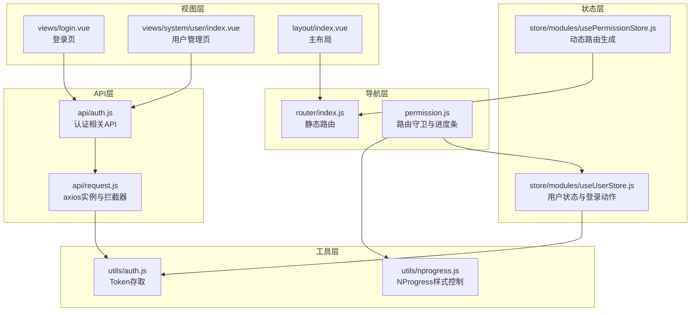
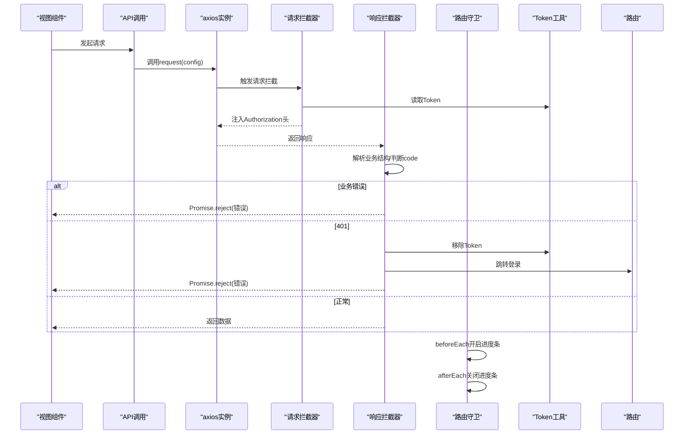
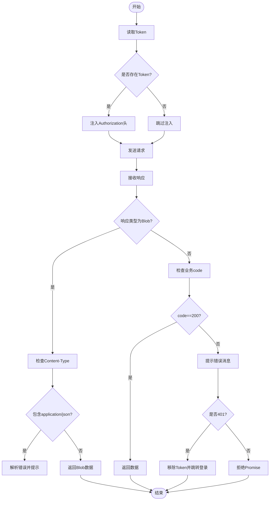
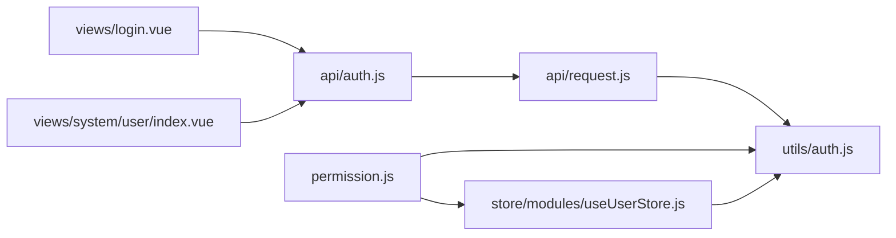

# HTTP拦截器

<cite>
**本文引用的文件**
- [request.js](file://task-manager-frontend/src/api/request.js)
- [auth.js](file://task-manager-frontend/src/utils/auth.js)
- [nprogress.js](file://task-manager-frontend/src/utils/nprogress.js)
- [useUserStore.js](file://task-manager-frontend/src/store/modules/useUserStore.js)
- [permission.js](file://task-manager-frontend/src/permission.js)
- [auth.js](file://task-manager-frontend/src/api/auth.js)
- [index.vue](file://task-manager-frontend/src/views/login.vue)
- [index.vue](file://task-manager-frontend/src/layout/index.vue)
- [index.vue](file://task-manager-frontend/src/views/system/user/index.vue)
- [index.js](file://task-manager-frontend/src/router/index.js)
</cite>

## 目录
1. [简介](#简介)
2. [项目结构](#项目结构)
3. [核心组件](#核心组件)
4. [架构总览](#架构总览)
5. [详细组件分析](#详细组件分析)
6. [依赖关系分析](#依赖关系分析)
7. [性能考量](#性能考量)
8. [故障排查指南](#故障排查指南)
9. [结论](#结论)
10. [附录](#附录)

## 简介
本文件面向CodeBuddy任务管理系统前端，系统性梳理HTTP拦截器的设计与实现，重点覆盖：
- axios封装与配置：基础URL、超时设置
- 请求拦截器：自动注入Token
- 响应拦截器：统一错误处理、401处理、Blob导出兼容
- Token生命周期：获取、存储、移除、失效跳转
- 错误处理策略：网络错误、业务错误、权限错误
- Loading与进度条：NProgress样式切换与路由守卫联动
- 请求流程图与错误处理示例路径

## 项目结构
围绕HTTP拦截器的关键文件组织如下：
- API层：统一请求封装与各业务API导出
- 工具层：Token存取与进度条样式控制
- 状态层：Pinia用户与权限状态管理
- 导航层：路由守卫与页面标题、进度条联动
- 视图层：登录页、系统管理页等使用示例

图表来源
- [request.js:1-63](file://task-manager-frontend/src/api/request.js#L1-L63)
- [auth.js:1-53](file://task-manager-frontend/src/api/auth.js#L1-L53)
- [auth.js:1-16](file://task-manager-frontend/src/utils/auth.js#L1-L16)
- [nprogress.js:1-7](file://task-manager-frontend/src/utils/nprogress.js#L1-L7)
- [useUserStore.js:1-52](file://task-manager-frontend/src/store/modules/useUserStore.js#L1-L52)
- [permission.js:1-53](file://task-manager-frontend/src/permission.js#L1-L53)
- [index.js:1-32](file://task-manager-frontend/src/router/index.js#L1-L32)
- [index.vue:1-299](file://task-manager-frontend/src/views/login.vue#L1-L299)
- [index.vue:1-240](file://task-manager-frontend/src/views/system/user/index.vue#L1-L240)
- [index.vue:1-50](file://task-manager-frontend/src/layout/index.vue#L1-L50)

章节来源
- [request.js:1-63](file://task-manager-frontend/src/api/request.js#L1-L63)
- [auth.js:1-16](file://task-manager-frontend/src/utils/auth.js#L1-L16)
- [nprogress.js:1-7](file://task-manager-frontend/src/utils/nprogress.js#L1-L7)
- [useUserStore.js:1-52](file://task-manager-frontend/src/store/modules/useUserStore.js#L1-L52)
- [permission.js:1-53](file://task-manager-frontend/src/permission.js#L1-L53)
- [index.js:1-32](file://task-manager-frontend/src/router/index.js#L1-L32)
- [index.vue:1-299](file://task-manager-frontend/src/views/login.vue#L1-L299)
- [index.vue:1-240](file://task-manager-frontend/src/views/system/user/index.vue#L1-L240)
- [index.vue:1-50](file://task-manager-frontend/src/layout/index.vue#L1-L50)

## 核心组件
- axios实例与拦截器：在API层集中封装，统一注入Token、统一错误处理、支持Blob导出场景
- Token工具：localStorage存取，移除时清理用户角色/权限缓存
- 路由守卫：在每次导航前后控制进度条与鉴权逻辑
- 用户状态：登录成功后持久化Token并拉取用户信息与动态路由
- 进度条：通过NProgress切换body类名实现全局loading指示

章节来源
- [request.js:1-63](file://task-manager-frontend/src/api/request.js#L1-L63)
- [auth.js:1-16](file://task-manager-frontend/src/utils/auth.js#L1-L16)
- [permission.js:1-53](file://task-manager-frontend/src/permission.js#L1-L53)

## 架构总览
HTTP拦截器作为请求/响应的“中枢”，贯穿以下流程：
- 请求阶段：从本地存储读取Token，注入Authorization头
- 响应阶段：统一解析后端返回结构；业务错误提示；401时清除Token并跳转登录
- 导航阶段：路由守卫开启/关闭进度条；登录态校验与动态路由生成

图表来源
- [request.js:10-60](file://task-manager-frontend/src/api/request.js#L10-L60)
- [auth.js:1-16](file://task-manager-frontend/src/utils/auth.js#L1-L16)
- [permission.js:10-52](file://task-manager-frontend/src/permission.js#L10-L52)

## 详细组件分析

### axios封装与配置
- 基础配置：baseURL指向/dev-api，超时30秒
- 请求拦截器：读取Token并注入Authorization头
- 响应拦截器：
  - Blob类型响应：当Content-Type包含application/json时，解析错误消息并提示
  - 业务错误：根据后端返回的code字段判断，非200即视为业务错误，统一提示
  - 401处理：业务错误code为401时，移除Token并跳转登录页
  - 网络错误：捕获error.response与error.message，统一提示

章节来源
- [request.js:5-60](file://task-manager-frontend/src/api/request.js#L5-L60)

### Token自动注入与生命周期
- 获取：从localStorage读取TokenKey
- 注入：请求拦截器在headers中附加Authorization头
- 存储：登录成功后通过用户状态管理写入localStorage
- 失效处理：响应拦截器遇到401时移除Token并跳转登录
- 清理：移除Token同时清理window中的用户角色/权限缓存键

图表来源
- [request.js:10-60](file://task-manager-frontend/src/api/request.js#L10-L60)
- [auth.js:1-16](file://task-manager-frontend/src/utils/auth.js#L1-L16)

章节来源
- [request.js:10-60](file://task-manager-frontend/src/api/request.js#L10-L60)
- [auth.js:1-16](file://task-manager-frontend/src/utils/auth.js#L1-L16)
- [useUserStore.js:17-21](file://task-manager-frontend/src/store/modules/useUserStore.js#L17-L21)

### 错误处理机制
- 网络错误：捕获error.response.data.message或error.message，统一提示
- 业务错误：后端返回结构中code!=200时视为业务错误，提示message
- 权限错误：业务错误code为401时，清除Token并跳转登录
- Blob导出：当响应为Blob且Content-Type为JSON时，解析错误并提示

章节来源
- [request.js:22-60](file://task-manager-frontend/src/api/request.js#L22-L60)

### Loading状态与进度条
- 进度条样式：通过向window.NProgress挂载start/done方法，切换document.body的loading类名
- 路由守卫联动：beforeEach开启进度条，afterEach关闭进度条
- 页面Loading：Element Plus的v-loading绑定在表格等组件上，配合响应拦截器的错误提示

章节来源
- [nprogress.js:1-7](file://task-manager-frontend/src/utils/nprogress.js#L1-L7)
- [permission.js:10-52](file://task-manager-frontend/src/permission.js#L10-L52)
- [index.vue:34-166](file://task-manager-frontend/src/views/system/user/index.vue#L34-L166)

### 请求重试与超时处理
- 超时：axios实例设置了30秒超时
- 重试：当前拦截器未实现自动重试逻辑。如需重试，可在调用方或更高层封装中实现（例如基于错误类型与次数限制进行重试）

章节来源
- [request.js:5-8](file://task-manager-frontend/src/api/request.js#L5-L8)

### 登录与动态路由
- 登录流程：登录页发起登录请求，成功后写入Token并跳转
- 用户信息：进入受保护路由时，通过用户状态管理拉取用户信息
- 动态路由：生成菜单路由并添加到路由器，完成权限校验与页面渲染

章节来源
- [index.vue:137-159](file://task-manager-frontend/src/views/login.vue#L137-L159)
- [useUserStore.js:26-32](file://task-manager-frontend/src/store/modules/useUserStore.js#L26-L32)
- [permission.js:20-38](file://task-manager-frontend/src/permission.js#L20-L38)
- [index.js:5-24](file://task-manager-frontend/src/router/index.js#L5-L24)

## 依赖关系分析
- request.js依赖utils/auth.js进行Token存取
- permission.js依赖utils/auth.js进行登录态判断，并与useUserStore、usePermissionStore协作
- 视图层组件通过API层发起请求，间接依赖拦截器的统一处理

图表来源
- [request.js:1-63](file://task-manager-frontend/src/api/request.js#L1-L63)
- [auth.js:1-16](file://task-manager-frontend/src/utils/auth.js#L1-L16)
- [permission.js:1-53](file://task-manager-frontend/src/permission.js#L1-L53)
- [useUserStore.js:1-52](file://task-manager-frontend/src/store/modules/useUserStore.js#L1-L52)
- [index.vue:1-299](file://task-manager-frontend/src/views/login.vue#L1-L299)
- [index.vue:1-240](file://task-manager-frontend/src/views/system/user/index.vue#L1-L240)
- [auth.js:1-53](file://task-manager-frontend/src/api/auth.js#L1-L53)

章节来源
- [request.js:1-63](file://task-manager-frontend/src/api/request.js#L1-L63)
- [auth.js:1-16](file://task-manager-frontend/src/utils/auth.js#L1-L16)
- [permission.js:1-53](file://task-manager-frontend/src/permission.js#L1-L53)
- [useUserStore.js:1-52](file://task-manager-frontend/src/store/modules/useUserStore.js#L1-L52)
- [index.vue:1-299](file://task-manager-frontend/src/views/login.vue#L1-L299)
- [index.vue:1-240](file://task-manager-frontend/src/views/system/user/index.vue#L1-L240)
- [auth.js:1-53](file://task-manager-frontend/src/api/auth.js#L1-L53)

## 性能考量
- 超时设置：30秒适中，兼顾网络稳定性与用户体验
- 请求头注入：仅在存在Token时注入，避免无谓开销
- 错误提示：统一通过消息组件提示，减少重复逻辑
- 进度条：仅在路由切换时开启/关闭，避免频繁DOM操作

## 故障排查指南
- 登录后仍提示未登录
  - 检查Token是否正确写入localStorage
  - 确认请求拦截器是否注入了Authorization头
  - 排查响应拦截器是否将401错误误判为业务错误
- 401频繁出现
  - 检查后端Token有效期与刷新策略
  - 确认前端移除Token后是否正确跳转登录
- 导出功能失败
  - 检查响应类型与Content-Type，确保Blob场景下的错误解析逻辑生效
- 页面长时间处于加载状态
  - 检查路由守卫是否正确关闭进度条
  - 确认组件的v-loading绑定与响应拦截器的错误处理

章节来源
- [request.js:22-60](file://task-manager-frontend/src/api/request.js#L22-L60)
- [permission.js:10-52](file://task-manager-frontend/src/permission.js#L10-L52)

## 结论
该HTTP拦截器以最小侵入的方式实现了：
- Token自动注入与统一错误处理
- 401自动跳转登录
- Blob导出场景的兼容
- 与路由守卫、状态管理的协同
建议后续可考虑在调用层增加可选的重试策略与更细粒度的错误分类，以进一步提升健壮性与可维护性。

## 附录
- 示例：登录页发起登录请求并写入Token
  - [index.vue:137-159](file://task-manager-frontend/src/views/login.vue#L137-L159)
- 示例：用户管理页使用v-loading与API调用
  - [index.vue:34-166](file://task-manager-frontend/src/views/system/user/index.vue#L34-L166)
- 示例：API层封装与拦截器
  - [request.js:1-63](file://task-manager-frontend/src/api/request.js#L1-L63)
- 示例：Token存取工具
  - [auth.js:1-16](file://task-manager-frontend/src/utils/auth.js#L1-L16)
- 示例：路由守卫与进度条
  - [permission.js:10-52](file://task-manager-frontend/src/permission.js#L10-L52)