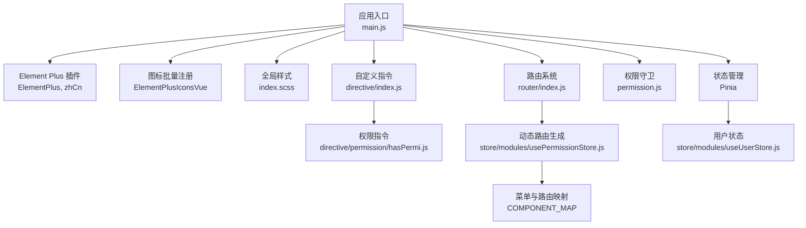
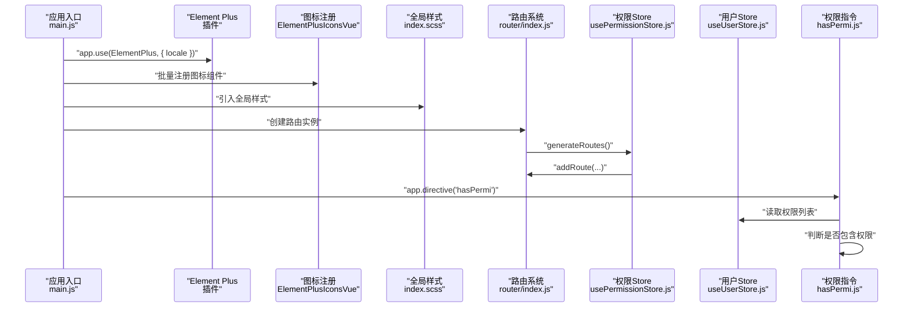
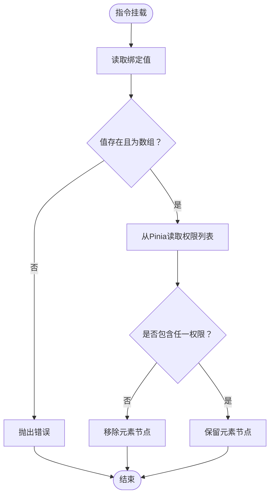
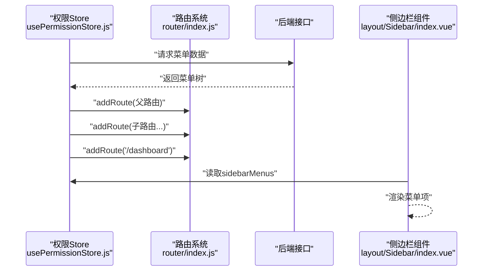
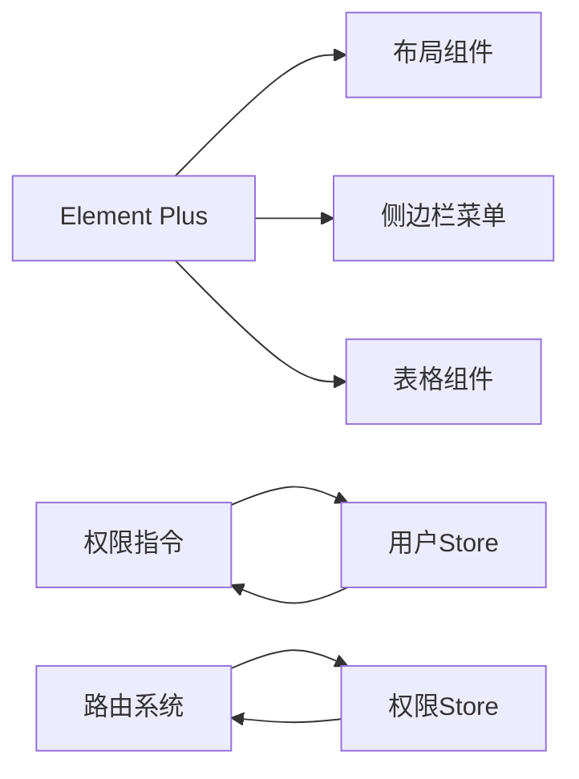

# UI组件库

<cite>
**本文引用的文件**
- [package.json](file://task-manager-frontend/package.json)
- [main.js](file://task-manager-frontend/src/main.js)
- [vite.config.js](file://task-manager-frontend/vite.config.js)
- [index.scss](file://task-manager-frontend/src/assets/styles/index.scss)
- [main.scss](file://task-manager-frontend/src/assets/styles/main.scss)
- [hasPermi.js](file://task-manager-frontend/src/directive/permission/hasPermi.js)
- [index.js](file://task-manager-frontend/src/directive/index.js)
- [index.vue](file://task-manager-frontend/src/layout/index.vue)
- [index.js](file://task-manager-frontend/src/router/index.js)
- [usePermissionStore.js](file://task-manager-frontend/src/store/modules/usePermissionStore.js)
- [useUserStore.js](file://task-manager-frontend/src/store/modules/useUserStore.js)
- [index.vue](file://task-manager-frontend/src/layout/Sidebar/index.vue)
- [auth.js](file://task-manager-frontend/src/utils/auth.js)
</cite>

## 目录
1. [简介](#简介)
2. [项目结构](#项目结构)
3. [核心组件](#核心组件)
4. [架构总览](#架构总览)
5. [详细组件分析](#详细组件分析)
6. [依赖关系分析](#依赖关系分析)
7. [性能考虑](#性能考虑)
8. [故障排查指南](#故障排查指南)
9. [结论](#结论)
10. [附录](#附录)

## 简介
本文件面向CodeBuddy任务管理系统前端的UI组件库，系统性梳理Element Plus组件库的集成与定制化实践，涵盖组件导入、主题与样式覆盖、自定义指令（权限指令hasPermi）设计与使用、全局样式的组织与管理、组件扩展策略、最佳实践与性能优化建议，并提供可直接定位到源码位置的示例路径，便于快速查阅与落地实施。

## 项目结构
任务管理系统前端采用Vue 3 + Vite + Element Plus技术栈，UI组件库以Element Plus为核心，结合Pinia状态管理、Vue Router路由体系、自定义指令与全局样式SCSS变量/混入/工具类进行统一管理。核心入口在应用启动阶段完成Element Plus注册、图标批量注册、国际化配置、全局样式引入与权限守卫挂载。

图示来源
- [main.js:1-24](file://task-manager-frontend/src/main.js#L1-L24)
- [index.js:1-32](file://task-manager-frontend/src/router/index.js#L1-L32)
- [usePermissionStore.js:1-105](file://task-manager-frontend/src/store/modules/usePermissionStore.js#L1-L105)
- [useUserStore.js:1-52](file://task-manager-frontend/src/store/modules/useUserStore.js#L1-L52)
- [index.js:1-8](file://task-manager-frontend/src/directive/index.js#L1-L8)
- [hasPermi.js:1-27](file://task-manager-frontend/src/directive/permission/hasPermi.js#L1-L27)

章节来源
- [main.js:1-24](file://task-manager-frontend/src/main.js#L1-L24)
- [vite.config.js:1-28](file://task-manager-frontend/vite.config.js#L1-L28)
- [package.json:1-30](file://task-manager-frontend/package.json#L1-L30)

## 核心组件
- Element Plus集成与国际化：在应用入口完成Element Plus插件注册与中文语言包注入，并通过循环注册图标组件实现按需使用的图标资源。
- 自定义指令：提供权限指令v-hasPermi，基于Pinia实时读取用户权限集合，动态控制DOM元素显示/移除。
- 全局样式：通过SCSS变量集中管理颜色、尺寸、布局参数；对Element Plus表格等组件进行样式覆盖；提供搜索栏、内容卡片、分页容器等常用布局工具类。
- 动态路由与菜单：根据后端返回的菜单结构动态生成路由与侧边栏菜单，支持父子级路径拼接与组件懒加载映射。
- 用户状态与鉴权：通过Pinia用户Store获取token、角色与权限列表，配合工具函数持久化与清理。

章节来源
- [main.js:1-24](file://task-manager-frontend/src/main.js#L1-L24)
- [hasPermi.js:1-27](file://task-manager-frontend/src/directive/permission/hasPermi.js#L1-L27)
- [index.scss:1-106](file://task-manager-frontend/src/assets/styles/index.scss#L1-L106)
- [usePermissionStore.js:1-105](file://task-manager-frontend/src/store/modules/usePermissionStore.js#L1-L105)
- [useUserStore.js:1-52](file://task-manager-frontend/src/store/modules/useUserStore.js#L1-L52)

## 架构总览
下图展示UI组件库在应用中的装配与交互流程：应用启动时注册Element Plus与图标，加载全局样式；路由初始化后由权限Store生成动态路由；侧边栏菜单基于权限菜单渲染；权限指令在组件挂载时读取用户权限并决定元素可见性。

图示来源
- [main.js:1-24](file://task-manager-frontend/src/main.js#L1-L24)
- [index.js:1-32](file://task-manager-frontend/src/router/index.js#L1-L32)
- [usePermissionStore.js:1-105](file://task-manager-frontend/src/store/modules/usePermissionStore.js#L1-L105)
- [useUserStore.js:1-52](file://task-manager-frontend/src/store/modules/useUserStore.js#L1-L52)
- [hasPermi.js:1-27](file://task-manager-frontend/src/directive/permission/hasPermi.js#L1-L27)

## 详细组件分析

### Element Plus集成与定制化
- 组件导入与图标注册：在应用入口中引入Element Plus并设置中文语言包，同时遍历图标对象将其注册为全局组件，便于模板中直接使用。
- 样式覆盖：通过SCSS变量与选择器覆盖Element Plus组件默认样式，例如表格边框色与表头背景色，确保与整体视觉一致。
- 国际化：统一设置Element Plus语言为中文，保证组件文案本地化。

章节来源
- [main.js:1-24](file://task-manager-frontend/src/main.js#L1-L24)
- [index.scss:42-46](file://task-manager-frontend/src/assets/styles/index.scss#L42-L46)

### 自定义指令：权限指令hasPermi
- 设计目标：在组件挂载阶段读取Pinia中的用户权限集合，根据绑定值判断是否具备操作权限，若无权限则移除对应DOM节点，避免无效渲染。
- 使用方式：在模板中通过v-hasPermi绑定权限数组，如v-hasPermi="['system:user:add']"；支持通配符'*:*:*'表示超级权限。
- 数据来源：指令内部通过useUserStore读取permissions，避免依赖过期的window全局变量，确保与后端权限保持同步。
- 错误处理：当未传入有效权限数组时抛出错误，提示正确使用方式。

图示来源
- [hasPermi.js:8-26](file://task-manager-frontend/src/directive/permission/hasPermi.js#L8-L26)

章节来源
- [hasPermi.js:1-27](file://task-manager-frontend/src/directive/permission/hasPermi.js#L1-L27)
- [index.js:1-8](file://task-manager-frontend/src/directive/index.js#L1-L8)
- [useUserStore.js:1-52](file://task-manager-frontend/src/store/modules/useUserStore.js#L1-L52)

### 全局样式组织与管理
- SCSS变量：集中定义主色、辅助色、侧边栏宽度、顶栏高度、内容区内边距等，便于统一风格与主题切换。
- 重置与基础样式：统一HTML/Body/#app的字体、字号、颜色与背景，重置列表内外边距，确保跨浏览器一致性。
- Element Plus覆盖：针对表格组件设置边框与表头背景色，提升阅读体验。
- 工具类：提供搜索栏容器、内容卡片容器、分页容器与过渡动画类，减少重复CSS编写。
- 进度条动画：通过伪元素与关键帧动画实现顶部进度条效果，适用于页面加载场景。

章节来源
- [index.scss:1-106](file://task-manager-frontend/src/assets/styles/index.scss#L1-L106)
- [main.scss:1-3](file://task-manager-frontend/src/assets/styles/main.scss#L1-L3)

### 动态路由与菜单生成
- 菜单到路由映射：后端返回菜单树，前端解析为路由配置，自动拼接父子路径，支持相对路径与绝对路径混合场景。
- 组件懒加载：通过COMPONENT_MAP将菜单component字段映射为动态import，结合Vite静态分析能力实现代码分割。
- 首页路由：固定添加/dashboard作为首页路由，meta中隐藏标题与图标，确保进入系统后的默认展示。
- 侧边栏菜单：从权限Store的sidebarMenus派生，过滤hidden菜单项，供Sidebar组件渲染。

图示来源
- [usePermissionStore.js:36-87](file://task-manager-frontend/src/store/modules/usePermissionStore.js#L36-L87)
- [index.js:1-32](file://task-manager-frontend/src/router/index.js#L1-L32)
- [index.vue:1-139](file://task-manager-frontend/src/layout/Sidebar/index.vue#L1-L139)

章节来源
- [usePermissionStore.js:1-105](file://task-manager-frontend/src/store/modules/usePermissionStore.js#L1-L105)
- [index.js:1-32](file://task-manager-frontend/src/router/index.js#L1-L32)
- [index.vue:1-139](file://task-manager-frontend/src/layout/Sidebar/index.vue#L1-L139)

### 布局与侧边栏
- 布局容器：通过计算属性响应侧边栏展开/收起状态，动态调整侧边栏宽度与主内容区marginLeft，实现平滑过渡。
- 侧边栏菜单：使用Element Plus的el-scrollbar与el-menu组件，设置背景色、文本色与激活文本色，统一视觉风格。
- 菜单项点击：统一通过router.push跳转，避免重复导航，确保路由与菜单状态一致。

章节来源
- [index.vue:1-50](file://task-manager-frontend/src/layout/index.vue#L1-L50)
- [index.vue:1-139](file://task-manager-frontend/src/layout/Sidebar/index.vue#L1-L139)

### 应用入口与构建配置
- 入口注册：在main.js中完成Element Plus、图标、Pinia、Router、全局样式与权限守卫的注册与挂载。
- 构建别名：Vite配置@指向src目录，简化模块导入路径；开发服务器代理/dev-api转发至后端服务。
- 依赖管理：package.json中声明Element Plus、图标、Axios、Vue Router、Pinia等依赖，以及Sass、自动导入与组件扫描插件。

章节来源
- [main.js:1-24](file://task-manager-frontend/src/main.js#L1-L24)
- [vite.config.js:1-28](file://task-manager-frontend/vite.config.js#L1-L28)
- [package.json:1-30](file://task-manager-frontend/package.json#L1-L30)

## 依赖关系分析
- 组件耦合与内聚：Element Plus作为UI层核心，被布局、侧边栏、表格等多处组件复用；权限指令与用户Store解耦，仅在挂载阶段读取权限，降低耦合度。
- 外部依赖：Element Plus提供UI基础；Pinia负责状态管理；Vue Router负责路由；Sass用于样式编译；Vite提供构建与开发环境。
- 指令与状态：权限指令依赖用户Store的权限数组，避免直接依赖window全局变量，提高稳定性与可测试性。

图示来源
- [main.js:1-24](file://task-manager-frontend/src/main.js#L1-L24)
- [usePermissionStore.js:1-105](file://task-manager-frontend/src/store/modules/usePermissionStore.js#L1-L105)
- [useUserStore.js:1-52](file://task-manager-frontend/src/store/modules/useUserStore.js#L1-L52)
- [hasPermi.js:1-27](file://task-manager-frontend/src/directive/permission/hasPermi.js#L1-L27)

章节来源
- [main.js:1-24](file://task-manager-frontend/src/main.js#L1-L24)
- [usePermissionStore.js:1-105](file://task-manager-frontend/src/store/modules/usePermissionStore.js#L1-L105)
- [useUserStore.js:1-52](file://task-manager-frontend/src/store/modules/useUserStore.js#L1-L52)
- [hasPermi.js:1-27](file://task-manager-frontend/src/directive/permission/hasPermi.js#L1-L27)

## 性能考虑
- 组件懒加载：通过动态import与COMPONENT_MAP实现按需加载，减少首屏体积，提升加载速度。
- 图标按需：仅注册需要的图标组件，避免引入全部图标导致包体膨胀。
- 样式按需：通过SCSS变量与覆盖，避免重复定义样式，减少CSS体积。
- 指令最小化：权限指令仅在mounted阶段读取权限并做一次性判定，避免频繁更新。
- 路由去重：侧边栏点击时记录lastNavigatedPath，防止重复导航带来的重复渲染。

## 故障排查指南
- 权限指令报错：当未正确传入权限数组或格式不正确时会抛出错误，请检查绑定值格式与权限字符串。
- 权限不生效：确认用户Store已正确拉取权限列表，且后端返回的权限标识与前端一致；避免依赖过期的window全局变量。
- 路由不显示：检查权限Store的generateRoutes是否成功调用，菜单children与父路径拼接逻辑是否正确。
- 样式覆盖失效：确认index.scss已在main.js中引入，且覆盖选择器优先级足够高；避免scoped样式影响全局覆盖。

章节来源
- [hasPermi.js:22-24](file://task-manager-frontend/src/directive/permission/hasPermi.js#L22-L24)
- [useUserStore.js:26-33](file://task-manager-frontend/src/store/modules/useUserStore.js#L26-L33)
- [usePermissionStore.js:36-87](file://task-manager-frontend/src/store/modules/usePermissionStore.js#L36-L87)
- [main.js:9-10](file://task-manager-frontend/src/main.js#L9-L10)

## 结论
该UI组件库以Element Plus为核心，结合Pinia与Vue Router实现了高内聚、低耦合的前端架构。通过SCSS变量与覆盖、自定义指令与动态路由，形成了一套可扩展、可维护的组件库方案。权限指令与用户状态管理确保了界面元素与后端权限的一致性；懒加载与按需注册提升了性能表现。建议在后续迭代中持续完善组件文档与测试用例，进一步沉淀组件复用规范与最佳实践。

## 附录
- 组件使用示例路径
  - 权限指令使用：[hasPermi.js:5-6](file://task-manager-frontend/src/directive/permission/hasPermi.js#L5-L6)
  - 动态路由生成：[usePermissionStore.js:36-87](file://task-manager-frontend/src/store/modules/usePermissionStore.js#L36-L87)
  - 全局样式引入：[main.js:10](file://task-manager-frontend/src/main.js#L10)
- 样式定制指南
  - SCSS变量与覆盖：[index.scss:1-106](file://task-manager-frontend/src/assets/styles/index.scss#L1-L106)
  - 全局样式聚合：[main.scss:1-3](file://task-manager-frontend/src/assets/styles/main.scss#L1-L3)
- 最佳实践
  - 组件导入：通过main.js集中注册Element Plus与图标，避免分散导入。
  - 权限控制：统一使用v-hasPermi指令，避免在组件内重复判断。
  - 路由管理：通过COMPONENT_MAP与后端菜单联动，确保路由与菜单一致。
  - 样式组织：将通用样式抽离至index.scss，按功能拆分工具类，提升复用性。