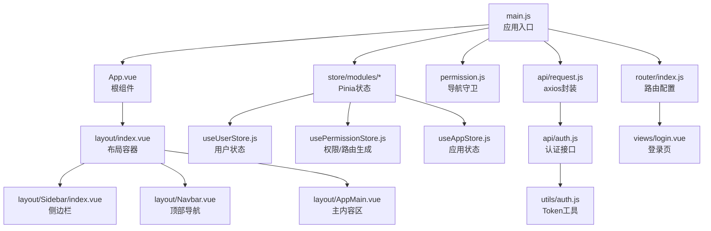
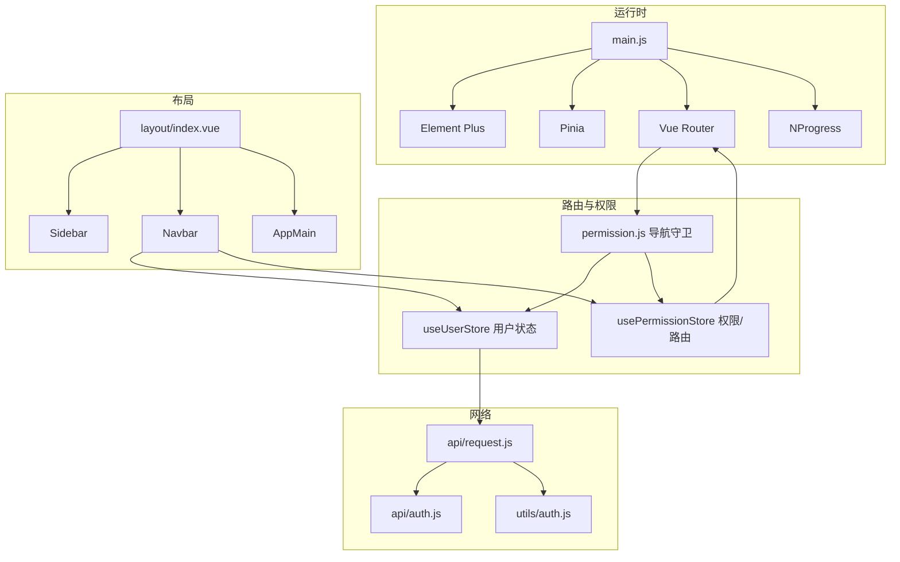
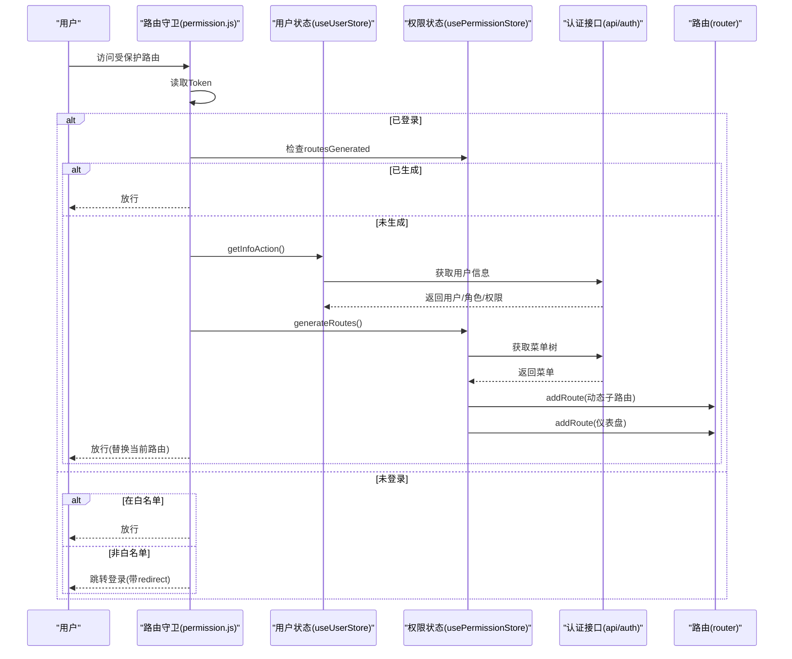
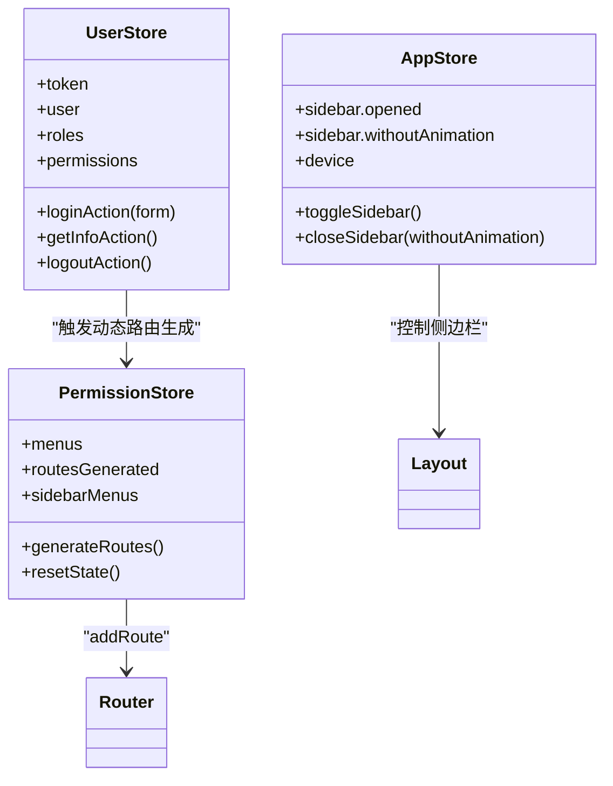
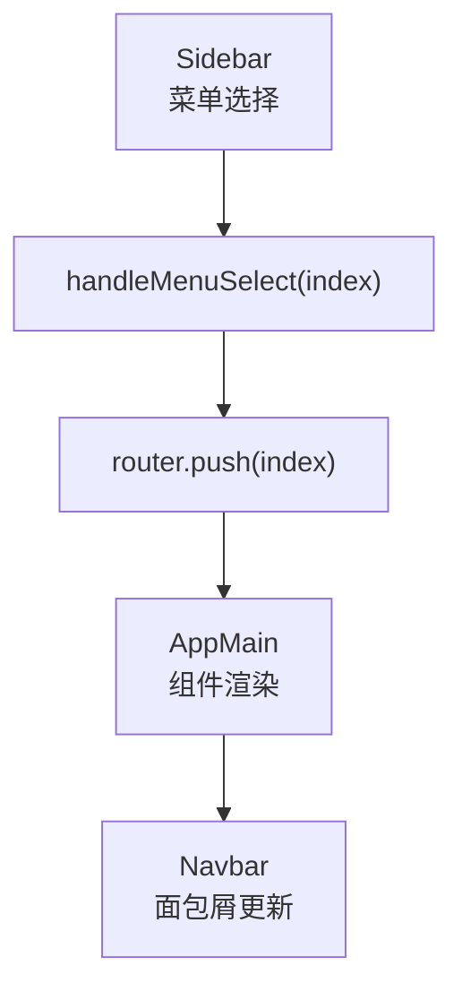
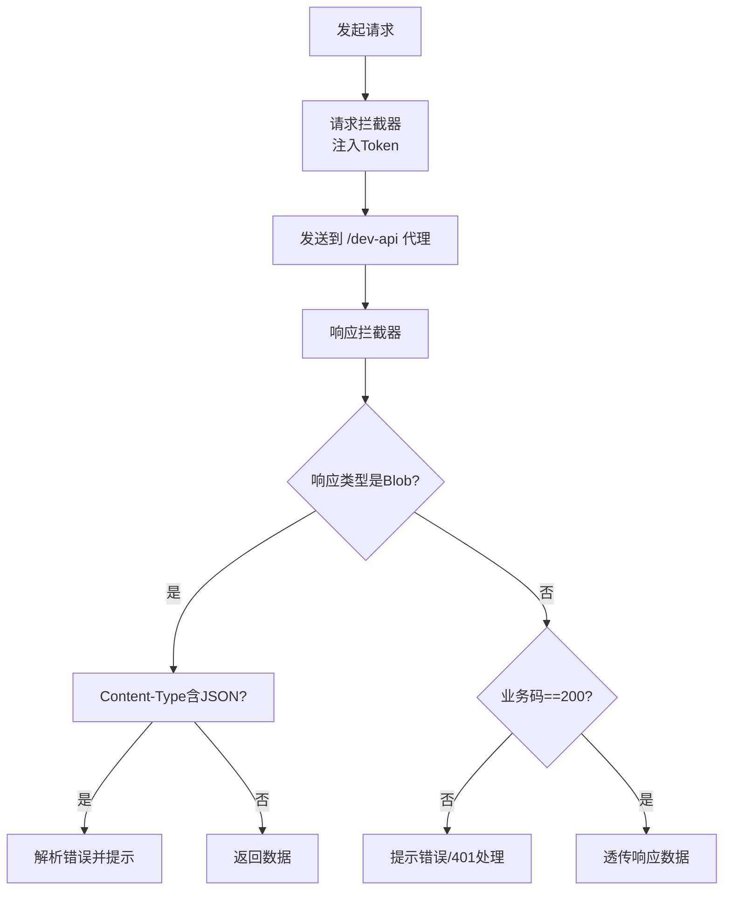
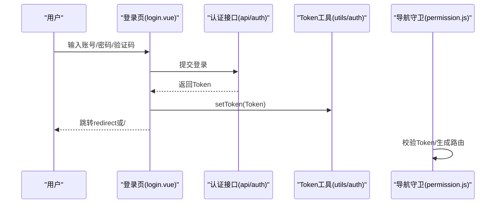
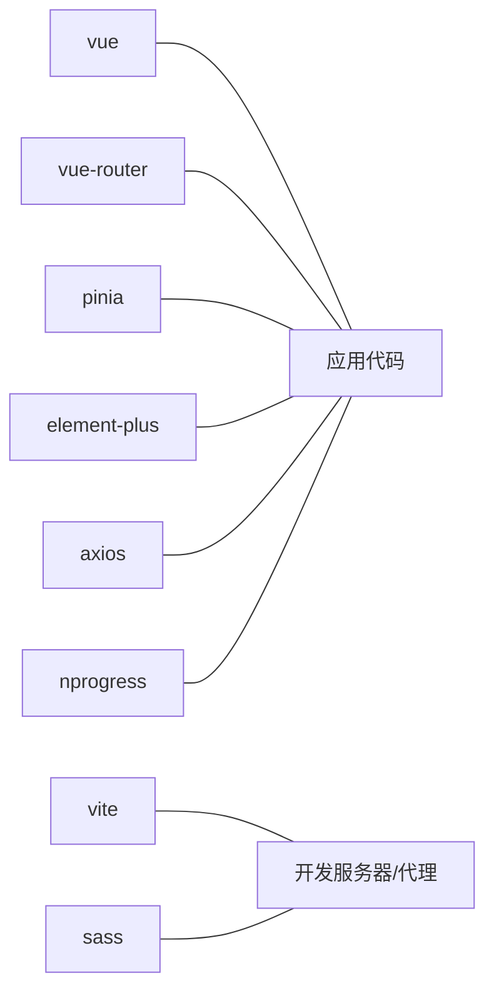

# 前端架构设计

<cite>
**本文引用的文件**
- [main.js](file://task-manager-frontend/src/main.js)
- [App.vue](file://task-manager-frontend/src/App.vue)
- [router/index.js](file://task-manager-frontend/src/router/index.js)
- [permission.js](file://task-manager-frontend/src/permission.js)
- [store/modules/useUserStore.js](file://task-manager-frontend/src/store/modules/useUserStore.js)
- [store/modules/usePermissionStore.js](file://task-manager-frontend/src/store/modules/usePermissionStore.js)
- [store/modules/useAppStore.js](file://task-manager-frontend/src/store/modules/useAppStore.js)
- [layout/index.vue](file://task-manager-frontend/src/layout/index.vue)
- [layout/Sidebar/index.vue](file://task-manager-frontend/src/layout/Sidebar/index.vue)
- [layout/Navbar.vue](file://task-manager-frontend/src/layout/Navbar.vue)
- [layout/AppMain.vue](file://task-manager-frontend/src/layout/AppMain.vue)
- [api/request.js](file://task-manager-frontend/src/api/request.js)
- [api/auth.js](file://task-manager-frontend/src/api/auth.js)
- [utils/auth.js](file://task-manager-frontend/src/utils/auth.js)
- [views/login.vue](file://task-manager-frontend/src/views/login.vue)
- [package.json](file://task-manager-frontend/package.json)
- [vite.config.js](file://task-manager-frontend/vite.config.js)
</cite>

## 目录
1. [引言](#引言)
2. [项目结构](#项目结构)
3. [核心组件](#核心组件)
4. [架构总览](#架构总览)
5. [详细组件分析](#详细组件分析)
6. [依赖关系分析](#依赖关系分析)
7. [性能考虑](#性能考虑)
8. [故障排查指南](#故障排查指南)
9. [结论](#结论)
10. [附录](#附录)

## 引言
本文件面向CodeBuddy任务管理系统前端，系统性梳理基于Vue 3的现代化前端架构，重点覆盖以下方面：
- Composition API的使用模式与组件设计原则
- 路由系统设计（静态路由与动态路由生成）
- 导航守卫实现与权限控制
- Pinia状态管理（用户、权限、应用状态）
- Element Plus组件库的集成与定制
- axios封装与HTTP拦截器（Token注入与错误处理）
- 布局系统（侧边栏、顶部导航、主内容区）
- 组件层次结构与数据流向图
- 性能优化策略与最佳实践

## 项目结构
前端采用按功能域分层的目录组织方式，核心模块包括：
- 应用入口与插件注册：main.js
- 根组件：App.vue
- 路由：router/index.js
- 权限与导航守卫：permission.js
- 状态管理：store/modules 下的用户、权限、应用状态模块
- 布局：layout 下的侧边栏、顶部导航、主内容区
- API封装与认证：api/request.js、api/auth.js、utils/auth.js
- 视图：views 下的页面组件
- 构建与代理：package.json、vite.config.js

图表来源
- [main.js:1-24](file://task-manager-frontend/src/main.js#L1-L24)
- [App.vue:1-4](file://task-manager-frontend/src/App.vue#L1-L4)
- [router/index.js:1-32](file://task-manager-frontend/src/router/index.js#L1-L32)
- [permission.js:1-53](file://task-manager-frontend/src/permission.js#L1-L53)
- [store/modules/useUserStore.js:1-52](file://task-manager-frontend/src/store/modules/useUserStore.js#L1-L52)
- [store/modules/usePermissionStore.js:1-105](file://task-manager-frontend/src/store/modules/usePermissionStore.js#L1-L105)
- [store/modules/useAppStore.js:1-24](file://task-manager-frontend/src/store/modules/useAppStore.js#L1-L24)
- [layout/index.vue:1-50](file://task-manager-frontend/src/layout/index.vue#L1-L50)
- [layout/Sidebar/index.vue:1-139](file://task-manager-frontend/src/layout/Sidebar/index.vue#L1-L139)
- [layout/Navbar.vue:1-120](file://task-manager-frontend/src/layout/Navbar.vue#L1-L120)
- [layout/AppMain.vue:1-24](file://task-manager-frontend/src/layout/AppMain.vue#L1-L24)
- [api/request.js:1-63](file://task-manager-frontend/src/api/request.js#L1-L63)
- [api/auth.js:1-53](file://task-manager-frontend/src/api/auth.js#L1-L53)
- [utils/auth.js:1-16](file://task-manager-frontend/src/utils/auth.js#L1-L16)
- [views/login.vue:1-299](file://task-manager-frontend/src/views/login.vue#L1-L299)

章节来源
- [main.js:1-24](file://task-manager-frontend/src/main.js#L1-L24)
- [package.json:1-30](file://task-manager-frontend/package.json#L1-L30)
- [vite.config.js:1-28](file://task-manager-frontend/vite.config.js#L1-L28)

## 核心组件
- 应用入口与插件注册：完成Element Plus、Pinia、路由、国际化、全局样式、进度条等初始化，并注册所有图标组件。
- 根组件：通过router-view承载路由视图。
- 路由系统：定义公共路由（登录、404、根布局），其余路由通过权限动态生成。
- 权限与导航守卫：白名单控制、Token校验、首次进入拉取用户信息与动态路由、标题与进度条管理。
- Pinia状态：用户状态（token、用户信息、角色、权限）、权限状态（菜单、路由生成标记）、应用状态（侧边栏开关、设备类型）。
- 布局系统：侧边栏菜单、顶部导航（面包屑、头像下拉）、主内容区过渡动画。
- API与认证：axios实例封装、请求/响应拦截器、认证接口封装、Token本地存储。

章节来源
- [main.js:1-24](file://task-manager-frontend/src/main.js#L1-L24)
- [App.vue:1-4](file://task-manager-frontend/src/App.vue#L1-L4)
- [router/index.js:1-32](file://task-manager-frontend/src/router/index.js#L1-L32)
- [permission.js:1-53](file://task-manager-frontend/src/permission.js#L1-L53)
- [store/modules/useUserStore.js:1-52](file://task-manager-frontend/src/store/modules/useUserStore.js#L1-L52)
- [store/modules/usePermissionStore.js:1-105](file://task-manager-frontend/src/store/modules/usePermissionStore.js#L1-L105)
- [store/modules/useAppStore.js:1-24](file://task-manager-frontend/src/store/modules/useAppStore.js#L1-L24)
- [layout/index.vue:1-50](file://task-manager-frontend/src/layout/index.vue#L1-L50)
- [layout/Sidebar/index.vue:1-139](file://task-manager-frontend/src/layout/Sidebar/index.vue#L1-L139)
- [layout/Navbar.vue:1-120](file://task-manager-frontend/src/layout/Navbar.vue#L1-L120)
- [layout/AppMain.vue:1-24](file://task-manager-frontend/src/layout/AppMain.vue#L1-L24)
- [api/request.js:1-63](file://task-manager-frontend/src/api/request.js#L1-L63)
- [api/auth.js:1-53](file://task-manager-frontend/src/api/auth.js#L1-L53)
- [utils/auth.js:1-16](file://task-manager-frontend/src/utils/auth.js#L1-L16)
- [views/login.vue:1-299](file://task-manager-frontend/src/views/login.vue#L1-L299)

## 架构总览
整体采用“入口初始化 + 路由守卫 + 动态路由 + 状态管理 + 布局 + API封装”的分层架构。Element Plus提供UI基础能力，axios负责网络通信，Pinia集中管理状态，Vue Router实现页面导航。

图表来源
- [main.js:1-24](file://task-manager-frontend/src/main.js#L1-L24)
- [permission.js:1-53](file://task-manager-frontend/src/permission.js#L1-L53)
- [store/modules/useUserStore.js:1-52](file://task-manager-frontend/src/store/modules/useUserStore.js#L1-L52)
- [store/modules/usePermissionStore.js:1-105](file://task-manager-frontend/src/store/modules/usePermissionStore.js#L1-L105)
- [layout/index.vue:1-50](file://task-manager-frontend/src/layout/index.vue#L1-L50)
- [api/request.js:1-63](file://task-manager-frontend/src/api/request.js#L1-L63)
- [api/auth.js:1-53](file://task-manager-frontend/src/api/auth.js#L1-L53)
- [utils/auth.js:1-16](file://task-manager-frontend/src/utils/auth.js#L1-L16)

## 详细组件分析

### 路由系统与导航守卫
- 静态路由：登录、404、根布局（重定向至仪表盘）。根布局作为动态路由的挂载点，children留空以便后续addRoute注入。
- 动态路由生成：首次登录后，通过用户信息获取角色/权限，调用后端接口获取菜单树，遍历生成子路由并addRoute到Layout下；同时注入仪表盘首页路由。
- 导航守卫：白名单放行；有Token则检查是否已生成路由，未生成则先获取用户信息再生成路由；无Token则跳转登录页并携带redirect参数；每次导航更新document.title并启动NProgress。

图表来源
- [permission.js:10-48](file://task-manager-frontend/src/permission.js#L10-L48)
- [store/modules/useUserStore.js:26-33](file://task-manager-frontend/src/store/modules/useUserStore.js#L26-L33)
- [store/modules/usePermissionStore.js:37-87](file://task-manager-frontend/src/store/modules/usePermissionStore.js#L37-L87)
- [api/auth.js:37-52](file://task-manager-frontend/src/api/auth.js#L37-L52)
- [router/index.js:5-24](file://task-manager-frontend/src/router/index.js#L5-L24)

章节来源
- [router/index.js:1-32](file://task-manager-frontend/src/router/index.js#L1-L32)
- [store/modules/usePermissionStore.js:1-105](file://task-manager-frontend/src/store/modules/usePermissionStore.js#L1-L105)
- [permission.js:1-53](file://task-manager-frontend/src/permission.js#L1-L53)

### Pinia状态管理
- 用户状态（useUserStore）：维护token、用户、角色、权限；提供登录、获取用户信息、登出动作；登出后清理token与状态并重定向登录。
- 权限状态（usePermissionStore）：维护菜单列表与routesGenerated标记；提供generateRoutes与resetState；根据后端菜单树生成路由并映射组件。
- 应用状态（useAppStore）：维护侧边栏展开状态与设备类型；提供toggleSidebar/closeSidebar动作，持久化侧边栏状态到localStorage。

图表来源
- [store/modules/useUserStore.js:6-51](file://task-manager-frontend/src/store/modules/useUserStore.js#L6-L51)
- [store/modules/usePermissionStore.js:26-93](file://task-manager-frontend/src/store/modules/usePermissionStore.js#L26-L93)
- [store/modules/useAppStore.js:3-23](file://task-manager-frontend/src/store/modules/useAppStore.js#L3-L23)

章节来源
- [store/modules/useUserStore.js:1-52](file://task-manager-frontend/src/store/modules/useUserStore.js#L1-L52)
- [store/modules/usePermissionStore.js:1-105](file://task-manager-frontend/src/store/modules/usePermissionStore.js#L1-L105)
- [store/modules/useAppStore.js:1-24](file://task-manager-frontend/src/store/modules/useAppStore.js#L1-L24)

### 布局系统
- 布局容器（layout/index.vue）：根据侧边栏opened状态计算侧边栏宽度与主内容区marginLeft，固定顶部导航与主内容区高度。
- 侧边栏（layout/Sidebar/index.vue）：使用Element Plus菜单组件渲染；支持折叠/展开；点击菜单项统一通过router.push导航；规范化菜单路径。
- 顶部导航（layout/Navbar.vue）：显示面包屑、头像下拉菜单；提供侧边栏切换与退出登录；展示用户昵称。
- 主内容区（layout/AppMain.vue）：基于router-view渲染组件，配合过渡动画提升切换体验。

图表来源
- [layout/Sidebar/index.vue:53-58](file://task-manager-frontend/src/layout/Sidebar/index.vue#L53-L58)
- [layout/AppMain.vue:3-7](file://task-manager-frontend/src/layout/AppMain.vue#L3-L7)
- [layout/Navbar.vue:56-58](file://task-manager-frontend/src/layout/Navbar.vue#L56-L58)

章节来源
- [layout/index.vue:1-50](file://task-manager-frontend/src/layout/index.vue#L1-L50)
- [layout/Sidebar/index.vue:1-139](file://task-manager-frontend/src/layout/Sidebar/index.vue#L1-L139)
- [layout/Navbar.vue:1-120](file://task-manager-frontend/src/layout/Navbar.vue#L1-L120)
- [layout/AppMain.vue:1-24](file://task-manager-frontend/src/layout/AppMain.vue#L1-L24)

### Element Plus集成与定制
- 插件注册：在main.js中安装Element Plus并设置中文语言；注册所有图标组件，便于模板中直接使用。
- 组件使用：侧边栏菜单、顶部导航下拉、表单、消息提示等均采用Element Plus组件。
- 定制化：通过SCSS变量与样式覆盖实现主题色、菜单背景色、字体大小等视觉定制。

章节来源
- [main.js:15-22](file://task-manager-frontend/src/main.js#L15-L22)
- [layout/Sidebar/index.vue:12-29](file://task-manager-frontend/src/layout/Sidebar/index.vue#L12-L29)
- [layout/Navbar.vue:18-33](file://task-manager-frontend/src/layout/Navbar.vue#L18-L33)

### axios封装与HTTP拦截器
- 实例配置：baseURL指向/dev-api，统一超时时间；通过Vite代理将/dev-api转发至后端服务。
- 请求拦截：从localStorage读取Token，存在则注入Authorization头。
- 响应拦截：对blob类型导出场景进行特殊处理；业务状态码非200时统一弹窗提示并按401处理（清除Token并跳转登录）；网络异常同样统一提示并按401处理。
- 错误处理：结合Element Plus的消息提示与路由跳转，保证用户体验一致。

图表来源
- [api/request.js:5-60](file://task-manager-frontend/src/api/request.js#L5-L60)
- [vite.config.js:18-24](file://task-manager-frontend/vite.config.js#L18-L24)
- [utils/auth.js:3-15](file://task-manager-frontend/src/utils/auth.js#L3-L15)

章节来源
- [api/request.js:1-63](file://task-manager-frontend/src/api/request.js#L1-L63)
- [utils/auth.js:1-16](file://task-manager-frontend/src/utils/auth.js#L1-L16)
- [vite.config.js:1-28](file://task-manager-frontend/vite.config.js#L1-L28)

### 登录流程与Token管理
- 登录页（views/login.vue）：支持用户名/密码、可选验证码（开发环境默认开启），提交后写入Token并跳转redirect或根路径。
- Token工具（utils/auth.js）：提供Token的读取、设置、移除；移除时同步清理window上的用户角色/权限缓存。
- 导航守卫：未登录访问受保护路由时，自动跳转登录并携带redirect参数；登录成功后按redirect回跳。

图表来源
- [views/login.vue:138-159](file://task-manager-frontend/src/views/login.vue#L138-L159)
- [api/auth.js:16-32](file://task-manager-frontend/src/api/auth.js#L16-L32)
- [utils/auth.js:7-9](file://task-manager-frontend/src/utils/auth.js#L7-L9)
- [permission.js:14-47](file://task-manager-frontend/src/permission.js#L14-L47)

章节来源
- [views/login.vue:1-299](file://task-manager-frontend/src/views/login.vue#L1-L299)
- [api/auth.js:1-53](file://task-manager-frontend/src/api/auth.js#L1-L53)
- [utils/auth.js:1-16](file://task-manager-frontend/src/utils/auth.js#L1-L16)
- [permission.js:1-53](file://task-manager-frontend/src/permission.js#L1-L53)

## 依赖关系分析
- 运行时依赖：Vue 3、Vue Router、Pinia、Element Plus、axios、nprogress。
- 构建与开发：Vite、Sass、自动导入与组件解析插件。
- 代理配置：将/dev-api前缀代理到后端服务，便于前后端分离开发。

图表来源
- [package.json:11-28](file://task-manager-frontend/package.json#L11-L28)
- [vite.config.js:1-28](file://task-manager-frontend/vite.config.js#L1-L28)

章节来源
- [package.json:1-30](file://task-manager-frontend/package.json#L1-L30)
- [vite.config.js:1-28](file://task-manager-frontend/vite.config.js#L1-L28)

## 性能考虑
- 路由懒加载：动态路由组件通过异步import实现按需加载，减少首屏体积。
- 组件懒加载：Element Plus图标在入口统一注册，避免重复注册开销。
- 状态持久化：侧边栏状态持久化到localStorage，减少重复计算与DOM操作。
- 进度条与过渡：NProgress与路由切换过渡动画提升交互感知。
- 代理与缓存：开发环境代理后端，避免跨域问题；生产环境建议后端配置CORS与缓存策略。

## 故障排查指南
- 登录后无法进入受保护页面
  - 检查Token是否正确写入localStorage
  - 确认导航守卫是否执行了用户信息获取与路由生成
  - 查看浏览器Network面板确认/dev-api代理是否生效
- 401错误频繁出现
  - 检查后端Token有效期与签发策略
  - 确认响应拦截器是否正确识别401并清除Token
- 菜单不显示或路由不生效
  - 确认后端返回的菜单树结构与component映射
  - 检查动态路由addRoute是否被调用且路径规范化

章节来源
- [permission.js:32-38](file://task-manager-frontend/src/permission.js#L32-L38)
- [api/request.js:42-59](file://task-manager-frontend/src/api/request.js#L42-L59)
- [store/modules/usePermissionStore.js:37-87](file://task-manager-frontend/src/store/modules/usePermissionStore.js#L37-L87)

## 结论
该前端架构以Vue 3为核心，结合Composition API、Pinia与Vue Router，实现了清晰的职责划分与良好的扩展性。通过导航守卫与动态路由生成，系统能够灵活适配权限体系；Element Plus与axios封装提供了稳定的UI与网络基础设施；布局系统与状态管理共同保障了良好的用户体验与开发效率。

## 附录
- 关键实现参考路径
  - 应用入口与插件注册：[main.js:1-24](file://task-manager-frontend/src/main.js#L1-L24)
  - 根组件与路由出口：[App.vue:1-4](file://task-manager-frontend/src/App.vue#L1-L4)
  - 静态路由与根布局：[router/index.js:5-24](file://task-manager-frontend/src/router/index.js#L5-L24)
  - 导航守卫与白名单：[permission.js:7-48](file://task-manager-frontend/src/permission.js#L7-L48)
  - 用户状态与登出：[store/modules/useUserStore.js:17-49](file://task-manager-frontend/src/store/modules/useUserStore.js#L17-L49)
  - 权限状态与动态路由生成：[store/modules/usePermissionStore.js:37-87](file://task-manager-frontend/src/store/modules/usePermissionStore.js#L37-L87)
  - 应用状态与侧边栏控制：[store/modules/useAppStore.js:11-22](file://task-manager-frontend/src/store/modules/useAppStore.js#L11-L22)
  - 布局容器与样式：[layout/index.vue:1-50](file://task-manager-frontend/src/layout/index.vue#L1-L50)
  - 侧边栏菜单与路径规范化：[layout/Sidebar/index.vue:69-83](file://task-manager-frontend/src/layout/Sidebar/index.vue#L69-L83)
  - 顶部导航与面包屑：[layout/Navbar.vue:56-58](file://task-manager-frontend/src/layout/Navbar.vue#L56-L58)
  - 主内容区过渡：[layout/AppMain.vue:4-7](file://task-manager-frontend/src/layout/AppMain.vue#L4-L7)
  - axios实例与拦截器：[api/request.js:5-60](file://task-manager-frontend/src/api/request.js#L5-L60)
  - 认证接口封装：[api/auth.js:16-52](file://task-manager-frontend/src/api/auth.js#L16-L52)
  - Token工具：[utils/auth.js:3-15](file://task-manager-frontend/src/utils/auth.js#L3-L15)
  - 登录页与验证码：[views/login.vue:124-159](file://task-manager-frontend/src/views/login.vue#L124-L159)
  - 构建与代理配置：[vite.config.js:18-24](file://task-manager-frontend/vite.config.js#L18-L24)