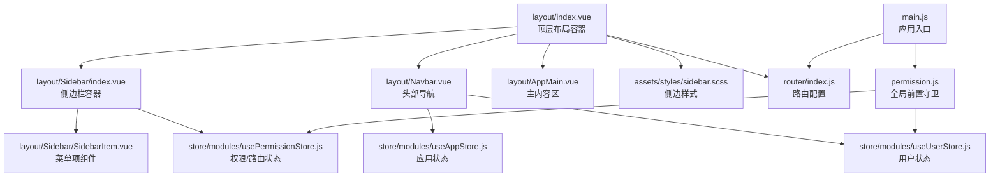
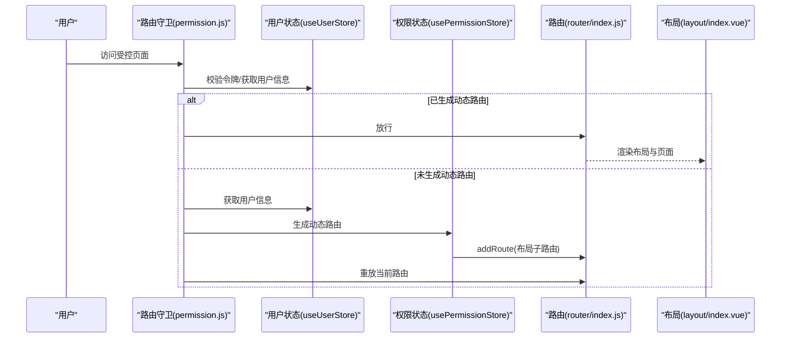
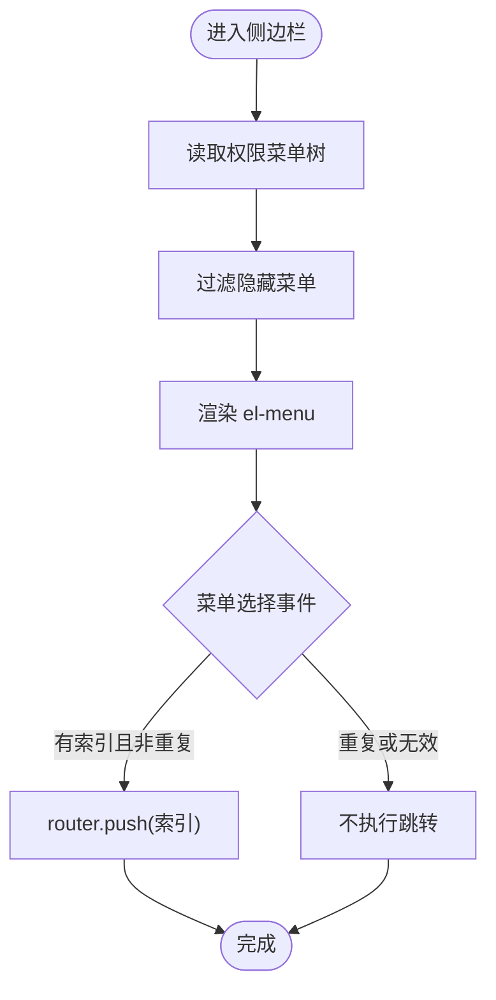
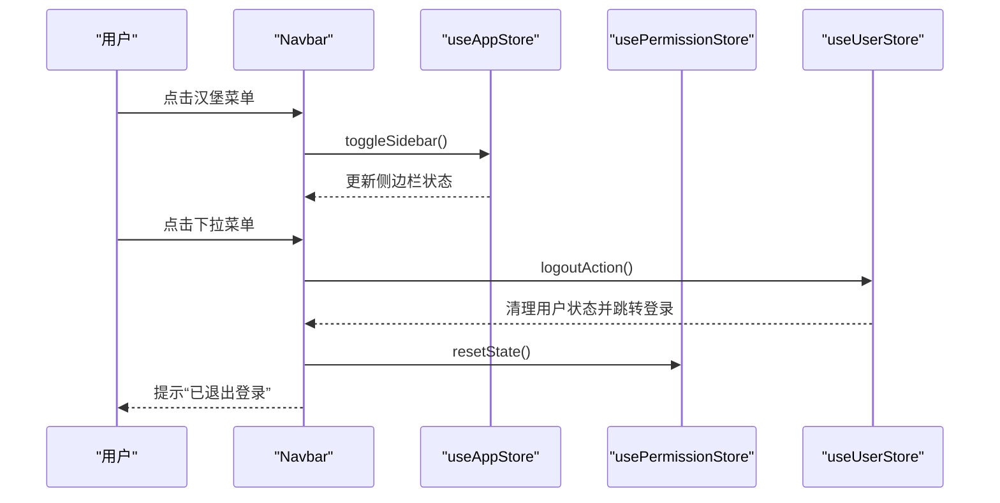
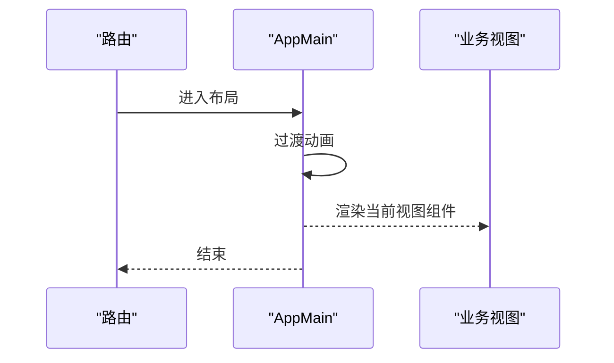
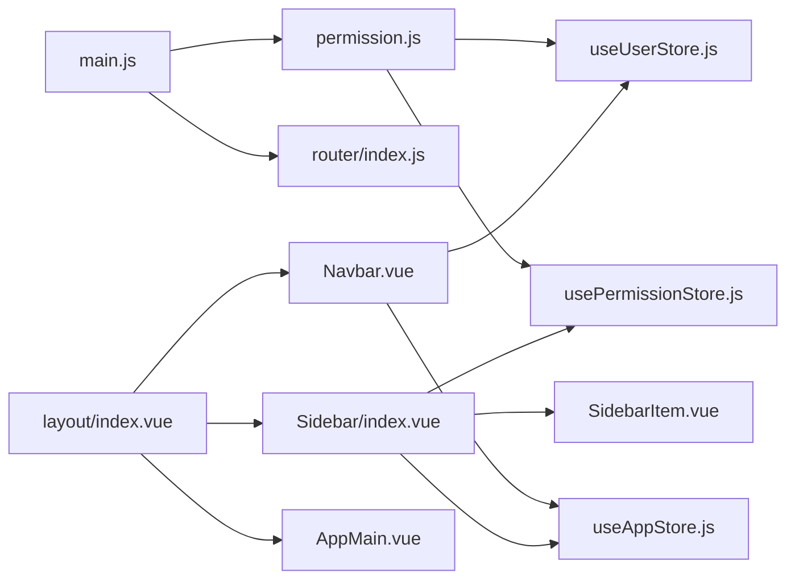

# 布局系统

<cite>
**本文引用的文件**
- [layout/index.vue](file://task-manager-frontend/src/layout/index.vue)
- [layout/Sidebar/index.vue](file://task-manager-frontend/src/layout/Sidebar/index.vue)
- [layout/Sidebar/SidebarItem.vue](file://task-manager-frontend/src/layout/Sidebar/SidebarItem.vue)
- [layout/Navbar.vue](file://task-manager-frontend/src/layout/Navbar.vue)
- [layout/AppMain.vue](file://task-manager-frontend/src/layout/AppMain.vue)
- [store/modules/useAppStore.js](file://task-manager-frontend/src/store/modules/useAppStore.js)
- [store/modules/usePermissionStore.js](file://task-manager-frontend/src/store/modules/usePermissionStore.js)
- [store/modules/useUserStore.js](file://task-manager-frontend/src/store/modules/useUserStore.js)
- [assets/styles/sidebar.scss](file://task-manager-frontend/src/assets/styles/sidebar.scss)
- [router/index.js](file://task-manager-frontend/src/router/index.js)
- [permission.js](file://task-manager-frontend/src/permission.js)
- [main.js](file://task-manager-frontend/src/main.js)
- [views/dashboard/index.vue](file://task-manager-frontend/src/views/dashboard/index.vue)
- [views/system/user/index.vue](file://task-manager-frontend/src/views/system/user/index.vue)
</cite>

## 目录
1. [简介](#简介)
2. [项目结构](#项目结构)
3. [核心组件](#核心组件)
4. [架构总览](#架构总览)
5. [详细组件分析](#详细组件分析)
6. [依赖关系分析](#依赖关系分析)
7. [性能考虑](#性能考虑)
8. [故障排查指南](#故障排查指南)
9. [结论](#结论)
10. [附录](#附录)

## 简介
本文件面向CodeBuddy任务管理系统的布局系统，系统性阐述整体布局架构的设计理念与实现细节，覆盖头部导航、侧边栏、主内容区域的布局策略；侧边栏菜单渲染、折叠展开、路由跳转；头部导航的用户信息展示、系统设置入口、退出登录交互；主内容区域的路由视图渲染、面包屑导航、页面标题；以及响应式布局与移动端适配策略。同时提供组件层次图与关键交互流程图，帮助开发者快速理解与维护。

## 项目结构
布局系统位于前端工程的布局目录中，采用“容器 + 组件”的分层组织方式：
- 布局容器：顶层布局容器负责整体尺寸与过渡动画控制
- 侧边栏：包含Logo区、滚动菜单区、菜单项递归渲染
- 头部导航：汉堡菜单、面包屑、用户下拉菜单
- 主内容区：路由视图容器，承载各业务页面

图表来源
- [layout/index.vue:1-50](file://task-manager-frontend/src/layout/index.vue#L1-L50)
- [layout/Sidebar/index.vue:1-139](file://task-manager-frontend/src/layout/Sidebar/index.vue#L1-L139)
- [layout/Sidebar/SidebarItem.vue:1-72](file://task-manager-frontend/src/layout/Sidebar/SidebarItem.vue#L1-L72)
- [layout/Navbar.vue:1-120](file://task-manager-frontend/src/layout/Navbar.vue#L1-L120)
- [layout/AppMain.vue:1-24](file://task-manager-frontend/src/layout/AppMain.vue#L1-L24)
- [store/modules/useAppStore.js:1-24](file://task-manager-frontend/src/store/modules/useAppStore.js#L1-L24)
- [store/modules/usePermissionStore.js:1-105](file://task-manager-frontend/src/store/modules/usePermissionStore.js#L1-L105)
- [store/modules/useUserStore.js:1-52](file://task-manager-frontend/src/store/modules/useUserStore.js#L1-L52)
- [assets/styles/sidebar.scss:1-59](file://task-manager-frontend/src/assets/styles/sidebar.scss#L1-L59)
- [router/index.js:1-32](file://task-manager-frontend/src/router/index.js#L1-L32)
- [permission.js:1-53](file://task-manager-frontend/src/permission.js#L1-L53)
- [main.js:1-24](file://task-manager-frontend/src/main.js#L1-L24)

章节来源
- [layout/index.vue:1-50](file://task-manager-frontend/src/layout/index.vue#L1-L50)
- [router/index.js:1-32](file://task-manager-frontend/src/router/index.js#L1-L32)
- [main.js:1-24](file://task-manager-frontend/src/main.js#L1-L24)

## 核心组件
- 顶层布局容器：通过计算属性读取应用状态，控制侧边栏宽度与主内容区边距，提供过渡动画与固定定位
- 侧边栏容器：渲染Logo与菜单，监听菜单选择事件，统一进行路由跳转，支持折叠/展开
- 侧边栏菜单项：递归渲染父子菜单，校验图标合法性，拼接完整路径
- 头部导航：左侧汉堡菜单切换侧边栏，右侧面包屑导航，用户头像下拉菜单提供退出登录
- 主内容区：基于router-view的过渡动画容器，承载业务页面

章节来源
- [layout/index.vue:15-23](file://task-manager-frontend/src/layout/index.vue#L15-L23)
- [layout/Sidebar/index.vue:33-84](file://task-manager-frontend/src/layout/Sidebar/index.vue#L33-L84)
- [layout/Sidebar/SidebarItem.vue:29-71](file://task-manager-frontend/src/layout/Sidebar/SidebarItem.vue#L29-L71)
- [layout/Navbar.vue:37-70](file://task-manager-frontend/src/layout/Navbar.vue#L37-L70)
- [layout/AppMain.vue:11-12](file://task-manager-frontend/src/layout/AppMain.vue#L11-L12)

## 架构总览
布局系统围绕“状态驱动 + 动态路由 + 权限控制”展开：
- 应用状态：侧边栏开关、设备类型等
- 用户状态：令牌、用户信息、角色与权限
- 权限状态：后端返回的菜单树、动态路由生成标记
- 路由系统：公共路由、布局嵌套、动态添加子路由
- 全局守卫：鉴权、标题设置、进度条、动态路由生成

图表来源
- [permission.js:10-48](file://task-manager-frontend/src/permission.js#L10-L48)
- [store/modules/useUserStore.js:26-33](file://task-manager-frontend/src/store/modules/useUserStore.js#L26-L33)
- [store/modules/usePermissionStore.js:37-87](file://task-manager-frontend/src/store/modules/usePermissionStore.js#L37-L87)
- [router/index.js:26-31](file://task-manager-frontend/src/router/index.js#L26-L31)
- [layout/index.vue:15-23](file://task-manager-frontend/src/layout/index.vue#L15-L23)

## 详细组件分析

### 侧边栏组件
- 菜单渲染：从权限状态读取菜单树，过滤隐藏项，递归渲染子菜单
- 折叠展开：通过应用状态控制宽度与过渡动画，本地持久化状态
- 路由跳转：统一处理菜单选择事件，避免重复导航，使用router.push
- 路径规范化：保证菜单路径以“/”开头，父子路径拼接

图表来源
- [layout/Sidebar/index.vue:64-84](file://task-manager-frontend/src/layout/Sidebar/index.vue#L64-L84)
- [layout/Sidebar/index.vue:53-58](file://task-manager-frontend/src/layout/Sidebar/index.vue#L53-L58)
- [store/modules/usePermissionStore.js:32-34](file://task-manager-frontend/src/store/modules/usePermissionStore.js#L32-L34)
- [store/modules/useAppStore.js:11-22](file://task-manager-frontend/src/store/modules/useAppStore.js#L11-L22)

章节来源
- [layout/Sidebar/index.vue:1-139](file://task-manager-frontend/src/layout/Sidebar/index.vue#L1-L139)
- [layout/Sidebar/SidebarItem.vue:1-72](file://task-manager-frontend/src/layout/Sidebar/SidebarItem.vue#L1-L72)
- [store/modules/useAppStore.js:1-24](file://task-manager-frontend/src/store/modules/useAppStore.js#L1-L24)
- [store/modules/usePermissionStore.js:1-105](file://task-manager-frontend/src/store/modules/usePermissionStore.js#L1-L105)

### 头部导航组件
- 汉堡菜单：调用应用状态切换侧边栏，并根据状态调整宽度
- 面包屑：基于matched数组过滤meta.title，支持重定向与路由链接
- 用户信息：从用户状态读取昵称，下拉菜单提供退出登录
- 退出登录：调用用户状态登出动作，清理权限状态，提示消息

图表来源
- [layout/Navbar.vue:53-69](file://task-manager-frontend/src/layout/Navbar.vue#L53-L69)
- [store/modules/useAppStore.js:11-22](file://task-manager-frontend/src/store/modules/useAppStore.js#L11-L22)
- [store/modules/useUserStore.js:38-49](file://task-manager-frontend/src/store/modules/useUserStore.js#L38-L49)
- [store/modules/usePermissionStore.js:89-92](file://task-manager-frontend/src/store/modules/usePermissionStore.js#L89-L92)

章节来源
- [layout/Navbar.vue:1-120](file://task-manager-frontend/src/layout/Navbar.vue#L1-L120)
- [store/modules/useUserStore.js:1-52](file://task-manager-frontend/src/store/modules/useUserStore.js#L1-L52)
- [store/modules/usePermissionStore.js:89-92](file://task-manager-frontend/src/store/modules/usePermissionStore.js#L89-L92)

### 主内容区域
- 路由视图：基于router-view渲染当前页面组件，使用过渡动画
- 页面标题：全局守卫设置document.title，带系统前缀
- 面包屑：Navbar基于route.matched生成面包屑
- 顶部留白：AppMain设置顶部间距与内边距，避免遮挡

图表来源
- [layout/AppMain.vue:3-7](file://task-manager-frontend/src/layout/AppMain.vue#L3-L7)
- [permission.js:10-12](file://task-manager-frontend/src/permission.js#L10-L12)

章节来源
- [layout/AppMain.vue:1-24](file://task-manager-frontend/src/layout/AppMain.vue#L1-L24)
- [permission.js:10-12](file://task-manager-frontend/src/permission.js#L10-L12)

### 响应式布局与移动端适配
- 固定定位与宽度控制：侧边栏与主内容区通过固定定位与margin-left控制，过渡动画平滑
- 侧边栏宽度：展开210px，收起64px，Logo在折叠模式居中
- 移动端策略：应用状态包含device字段，默认desktop；可结合媒体查询在样式层进一步扩展移动端适配

章节来源
- [layout/index.vue:25-48](file://task-manager-frontend/src/layout/index.vue#L25-L48)
- [layout/Sidebar/index.vue:86-139](file://task-manager-frontend/src/layout/Sidebar/index.vue#L86-L139)
- [assets/styles/sidebar.scss:1-59](file://task-manager-frontend/src/assets/styles/sidebar.scss#L1-L59)
- [store/modules/useAppStore.js:9](file://task-manager-frontend/src/store/modules/useAppStore.js#L9)

## 依赖关系分析
- 布局容器依赖应用状态与侧边栏组件
- 侧边栏依赖权限状态与路由库，菜单项依赖图标白名单
- 头部导航依赖应用状态、用户状态与权限状态
- 全局守卫依赖用户状态与权限状态，动态注入路由
- 应用入口注册Element Plus、Pinia、路由与全局守卫

图表来源
- [main.js:1-24](file://task-manager-frontend/src/main.js#L1-L24)
- [permission.js:1-53](file://task-manager-frontend/src/permission.js#L1-L53)
- [router/index.js:1-32](file://task-manager-frontend/src/router/index.js#L1-L32)
- [layout/index.vue:15-23](file://task-manager-frontend/src/layout/index.vue#L15-L23)
- [layout/Sidebar/index.vue:33-44](file://task-manager-frontend/src/layout/Sidebar/index.vue#L33-L44)
- [layout/Navbar.vue:37-49](file://task-manager-frontend/src/layout/Navbar.vue#L37-L49)

章节来源
- [main.js:1-24](file://task-manager-frontend/src/main.js#L1-L24)
- [permission.js:1-53](file://task-manager-frontend/src/permission.js#L1-L53)
- [router/index.js:1-32](file://task-manager-frontend/src/router/index.js#L1-L32)

## 性能考虑
- 路由懒加载：权限状态中的COMPONENT_MAP使用异步组件，按需加载页面
- 动态路由一次性生成：通过routesGenerated标记避免重复生成
- 本地存储：侧边栏状态持久化，减少首次渲染抖动
- 过渡动画：统一0.28s过渡，兼顾流畅与性能
- 面包屑与菜单：仅渲染可见项，减少DOM节点

章节来源
- [store/modules/usePermissionStore.js:5-24](file://task-manager-frontend/src/store/modules/usePermissionStore.js#L5-L24)
- [store/modules/usePermissionStore.js:89-92](file://task-manager-frontend/src/store/modules/usePermissionStore.js#L89-L92)
- [store/modules/useAppStore.js:6-16](file://task-manager-frontend/src/store/modules/useAppStore.js#L6-L16)
- [layout/Sidebar/index.vue:40-58](file://task-manager-frontend/src/layout/Sidebar/index.vue#L40-L58)

## 故障排查指南
- 登录过期或令牌失效
  - 现象：被重定向至登录页并提示“登录已过期，请重新登录”
  - 处理：清除令牌与状态，重新登录
  - 参考路径：[permission.js:32-38](file://task-manager-frontend/src/permission.js#L32-L38)，[useUserStore.js:38-49](file://task-manager-frontend/src/store/modules/useUserStore.js#L38-L49)
- 无法进入受控页面
  - 现象：未登录被重定向至登录页
  - 处理：携带redirect参数访问登录页
  - 参考路径：[permission.js:42-47](file://task-manager-frontend/src/permission.js#L42-L47)
- 侧边栏不响应点击
  - 现象：点击汉堡菜单无效果
  - 处理：检查应用状态toggleSidebar是否生效，确认localStorage状态
  - 参考路径：[useAppStore.js:11-22](file://task-manager-frontend/src/store/modules/useAppStore.js#L11-L22)，[Navbar.vue:53](file://task-manager-frontend/src/layout/Navbar.vue#L53)
- 菜单不显示或图标异常
  - 现象：菜单项不显示或图标不生效
  - 处理：检查meta.hidden、图标是否在白名单中，路径是否规范化
  - 参考路径：[SidebarItem.vue:32-53](file://task-manager-frontend/src/layout/Sidebar/SidebarItem.vue#L32-L53)，[Sidebar/index.vue:69-83](file://task-manager-frontend/src/layout/Sidebar/index.vue#L69-L83)

章节来源
- [permission.js:32-38](file://task-manager-frontend/src/permission.js#L32-L38)
- [permission.js:42-47](file://task-manager-frontend/src/permission.js#L42-L47)
- [useUserStore.js:38-49](file://task-manager-frontend/src/store/modules/useUserStore.js#L38-L49)
- [useAppStore.js:11-22](file://task-manager-frontend/src/store/modules/useAppStore.js#L11-L22)
- [layout/Navbar.vue:53](file://task-manager-frontend/src/layout/Navbar.vue#L53)
- [layout/Sidebar/SidebarItem.vue:32-53](file://task-manager-frontend/src/layout/Sidebar/SidebarItem.vue#L32-L53)
- [layout/Sidebar/index.vue:69-83](file://task-manager-frontend/src/layout/Sidebar/index.vue#L69-L83)

## 结论
该布局系统以Pinia状态管理为核心，结合Element Plus组件与Vue Router，实现了清晰的职责分离与良好的扩展性。通过全局守卫与动态路由生成，系统在安全与性能之间取得平衡；通过统一的样式与过渡动画，提供了稳定的用户体验。建议后续在移动端适配上增加媒体查询与手势交互，进一步提升跨端体验。

## 附录
- 示例视图：仪表盘与系统用户管理页面展示了布局容器如何承载业务页面
- 路由配置：公共路由与布局嵌套，配合动态路由生成形成完整的导航体系

章节来源
- [views/dashboard/index.vue:1-215](file://task-manager-frontend/src/views/dashboard/index.vue#L1-L215)
- [views/system/user/index.vue:1-240](file://task-manager-frontend/src/views/system/user/index.vue#L1-L240)
- [router/index.js:5-24](file://task-manager-frontend/src/router/index.js#L5-L24)