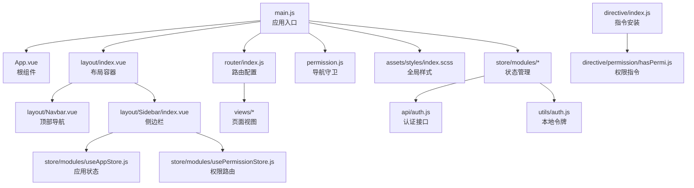
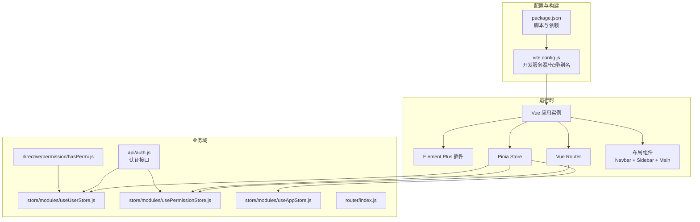
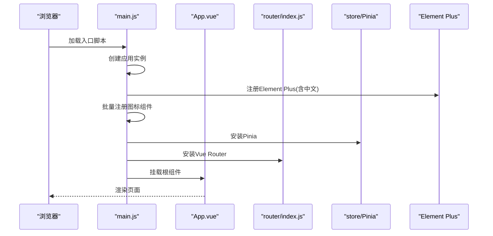
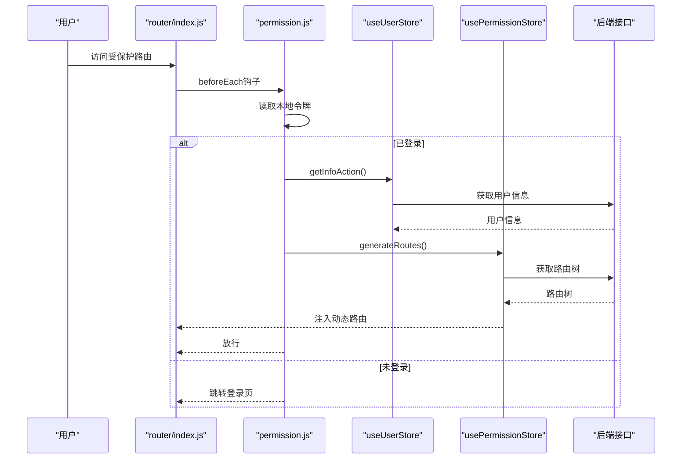
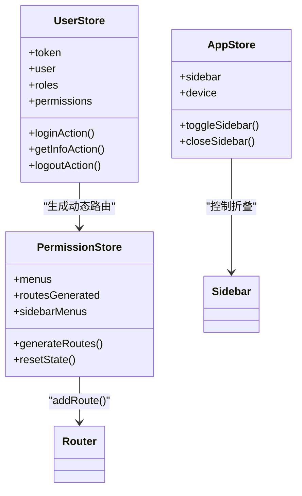
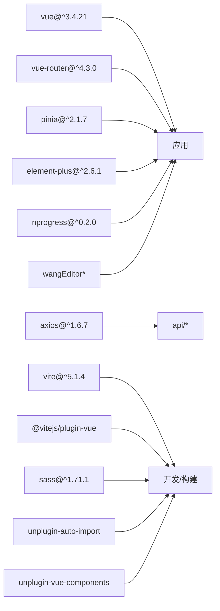

# 应用架构

<cite>
**本文引用的文件**
- [package.json](file://task-manager-frontend/package.json)
- [vite.config.js](file://task-manager-frontend/vite.config.js)
- [main.js](file://task-manager-frontend/src/main.js)
- [App.vue](file://task-manager-frontend/src/App.vue)
- [router/index.js](file://task-manager-frontend/src/router/index.js)
- [permission.js](file://task-manager-frontend/src/permission.js)
- [store/modules/useUserStore.js](file://task-manager-frontend/src/store/modules/useUserStore.js)
- [store/modules/usePermissionStore.js](file://task-manager-frontend/src/store/modules/usePermissionStore.js)
- [store/modules/useAppStore.js](file://task-manager-frontend/src/store/modules/useAppStore.js)
- [layout/index.vue](file://task-manager-frontend/src/layout/index.vue)
- [layout/Sidebar/index.vue](file://task-manager-frontend/src/layout/Sidebar/index.vue)
- [layout/Navbar.vue](file://task-manager-frontend/src/layout/Navbar.vue)
- [assets/styles/index.scss](file://task-manager-frontend/src/assets/styles/index.scss)
- [views/dashboard/index.vue](file://task-manager-frontend/src/views/dashboard/index.vue)
- [api/auth.js](file://task-manager-frontend/src/api/auth.js)
- [utils/auth.js](file://task-manager-frontend/src/utils/auth.js)
- [directive/index.js](file://task-manager-frontend/src/directive/index.js)
- [directive/permission/hasPermi.js](file://task-manager-frontend/src/directive/permission/hasPermi.js)
</cite>

## 目录
1. [引言](#引言)
2. [项目结构](#项目结构)
3. [核心组件](#核心组件)
4. [架构总览](#架构总览)
5. [详细组件分析](#详细组件分析)
6. [依赖分析](#依赖分析)
7. [性能考量](#性能考量)
8. [故障排查指南](#故障排查指南)
9. [结论](#结论)
10. [附录](#附录)

## 引言
本文件面向CodeBuddy任务管理系统前端应用，系统性梳理基于Vue 3的初始化流程、Element Plus集成策略、Vite构建与优化、目录结构与模块化组织、依赖管理与版本兼容性，并提供应用启动流程与时序图，帮助开发者快速理解并高效扩展该前端架构。

## 项目结构
前端采用“功能域+分层”的模块化组织方式：
- 根级配置：package.json定义脚本与依赖；vite.config.js提供开发服务器、代理与路径别名。
- 应用入口：main.js负责应用实例创建、插件注册、全局配置与挂载。
- 视图与布局：layout目录组织顶部导航、侧边栏与主内容区域；views按业务域划分页面。
- 状态管理：store/modules下按领域拆分Pinia Store（用户、权限、应用）。
- 路由：router/index.js集中声明公共路由与动态路由生成逻辑。
- API与工具：api目录封装HTTP请求；utils提供鉴权与进度条等工具。
- 指令：directive目录提供权限指令等可复用行为。
- 样式：assets/styles统一管理全局样式与Element Plus覆盖。

图表来源
- [main.js:1-24](file://task-manager-frontend/src/main.js#L1-L24)
- [App.vue:1-4](file://task-manager-frontend/src/App.vue#L1-L4)
- [router/index.js:1-32](file://task-manager-frontend/src/router/index.js#L1-L32)
- [permission.js:1-53](file://task-manager-frontend/src/permission.js#L1-L53)
- [layout/index.vue:1-50](file://task-manager-frontend/src/layout/index.vue#L1-L50)
- [layout/Navbar.vue:1-120](file://task-manager-frontend/src/layout/Navbar.vue#L1-L120)
- [layout/Sidebar/index.vue:1-139](file://task-manager-frontend/src/layout/Sidebar/index.vue#L1-L139)
- [store/modules/useAppStore.js:1-24](file://task-manager-frontend/src/store/modules/useAppStore.js#L1-L24)
- [store/modules/usePermissionStore.js:1-105](file://task-manager-frontend/src/store/modules/usePermissionStore.js#L1-L105)
- [api/auth.js:1-53](file://task-manager-frontend/src/api/auth.js#L1-L53)
- [utils/auth.js:1-16](file://task-manager-frontend/src/utils/auth.js#L1-L16)
- [directive/index.js:1-8](file://task-manager-frontend/src/directive/index.js#L1-L8)
- [directive/permission/hasPermi.js:1-27](file://task-manager-frontend/src/directive/permission/hasPermi.js#L1-L27)

章节来源
- [package.json:1-30](file://task-manager-frontend/package.json#L1-L30)
- [vite.config.js:1-28](file://task-manager-frontend/vite.config.js#L1-L28)
- [main.js:1-24](file://task-manager-frontend/src/main.js#L1-L24)

## 核心组件
- 应用实例与插件注册：在入口中创建Vue应用实例，注册Element Plus、Vue Router、Pinia，并完成图标全局注册与国际化配置。
- 路由系统：定义公共路由与Layout嵌套，结合导航守卫实现登录态校验与动态路由注入。
- 状态管理：用户信息、权限路由、应用侧边栏状态分别由独立Store管理，职责清晰。
- 布局与导航：顶部导航展示面包屑与用户操作；侧边栏根据权限渲染菜单并支持折叠。
- 权限指令：v-hasPermi指令基于Pinia实时读取权限，实现DOM级权限控制。
- 构建与样式：Vite提供开发服务器与代理；SCSS全局变量与覆盖提升UI一致性。

章节来源
- [main.js:1-24](file://task-manager-frontend/src/main.js#L1-L24)
- [router/index.js:1-32](file://task-manager-frontend/src/router/index.js#L1-L32)
- [permission.js:1-53](file://task-manager-frontend/src/permission.js#L1-L53)
- [store/modules/useUserStore.js:1-52](file://task-manager-frontend/src/store/modules/useUserStore.js#L1-L52)
- [store/modules/usePermissionStore.js:1-105](file://task-manager-frontend/src/store/modules/usePermissionStore.js#L1-L105)
- [store/modules/useAppStore.js:1-24](file://task-manager-frontend/src/store/modules/useAppStore.js#L1-L24)
- [layout/Navbar.vue:1-120](file://task-manager-frontend/src/layout/Navbar.vue#L1-L120)
- [layout/Sidebar/index.vue:1-139](file://task-manager-frontend/src/layout/Sidebar/index.vue#L1-L139)
- [directive/permission/hasPermi.js:1-27](file://task-manager-frontend/src/directive/permission/hasPermi.js#L1-L27)
- [assets/styles/index.scss:1-106](file://task-manager-frontend/src/assets/styles/index.scss#L1-L106)

## 架构总览
整体采用“入口装配 + 导航守卫 + 动态路由 + 状态管理 + 布局组件”的分层架构。Element Plus作为UI基础库，提供表格、表单、消息、进度条等组件能力；Pinia负责跨组件状态共享；Vue Router实现页面级路由与面包屑；SCSS全局样式统一视觉风格。

图表来源
- [package.json:1-30](file://task-manager-frontend/package.json#L1-L30)
- [vite.config.js:1-28](file://task-manager-frontend/vite.config.js#L1-L28)
- [main.js:1-24](file://task-manager-frontend/src/main.js#L1-L24)
- [router/index.js:1-32](file://task-manager-frontend/src/router/index.js#L1-L32)
- [permission.js:1-53](file://task-manager-frontend/src/permission.js#L1-L53)
- [store/modules/useUserStore.js:1-52](file://task-manager-frontend/src/store/modules/useUserStore.js#L1-L52)
- [store/modules/usePermissionStore.js:1-105](file://task-manager-frontend/src/store/modules/usePermissionStore.js#L1-L105)
- [store/modules/useAppStore.js:1-24](file://task-manager-frontend/src/store/modules/useAppStore.js#L1-L24)
- [api/auth.js:1-53](file://task-manager-frontend/src/api/auth.js#L1-L53)
- [directive/permission/hasPermi.js:1-27](file://task-manager-frontend/src/directive/permission/hasPermi.js#L1-L27)

## 详细组件分析

### Vue 应用初始化与插件装配
- 创建应用实例并挂载根组件。
- 注册Element Plus并设置中文语言环境；同时批量注册Element Plus图标组件，便于模板中直接使用。
- 安装Vue Router与Pinia，完成全局依赖注入。
- 引入全局样式与进度条，保证首屏体验一致。

图表来源
- [main.js:1-24](file://task-manager-frontend/src/main.js#L1-L24)
- [App.vue:1-4](file://task-manager-frontend/src/App.vue#L1-L4)
- [router/index.js:1-32](file://task-manager-frontend/src/router/index.js#L1-L32)
- [assets/styles/index.scss:1-106](file://task-manager-frontend/src/assets/styles/index.scss#L1-L106)

章节来源
- [main.js:1-24](file://task-manager-frontend/src/main.js#L1-L24)

### Element Plus 集成与主题/国际化
- 国际化：通过引入Element Plus中文语言包并传入插件配置，使组件内部文案与交互符合中文习惯。
- 图标：遍历并注册Element Plus图标集合，模板中可直接以组件形式使用图标。
- 样式覆盖：在全局SCSS中对表格等组件进行颜色与间距覆盖，保持品牌一致性。

章节来源
- [main.js:2-18](file://task-manager-frontend/src/main.js#L2-L18)
- [assets/styles/index.scss:42-46](file://task-manager-frontend/src/assets/styles/index.scss#L42-L46)

### Vite 构建与开发服务器
- 插件：启用Vue官方插件以支持单文件组件与组合式API。
- 别名：将@指向src目录，简化导入路径。
- 服务器：开放host、指定端口、允许跨主机；配置/dev-api代理转发至后端服务，便于前后端联调。
- 构建：通过脚本调用Vite进行打包与预览。

章节来源
- [vite.config.js:1-28](file://task-manager-frontend/vite.config.js#L1-L28)
- [package.json:6-10](file://task-manager-frontend/package.json#L6-L10)

### 路由与导航守卫
- 公共路由：登录、404等无需动态加载。
- 动态路由：登录成功后，从后端获取路由树，解析为子路由并注入到Layout下，同时生成侧边栏菜单。
- 导航守卫：在进入路由前检查令牌与白名单，未登录则跳转登录页；登录后若未生成路由则拉取用户信息并生成路由，最后放行。

图表来源
- [router/index.js:1-32](file://task-manager-frontend/src/router/index.js#L1-L32)
- [permission.js:10-48](file://task-manager-frontend/src/permission.js#L10-L48)
- [store/modules/useUserStore.js:26-32](file://task-manager-frontend/src/store/modules/useUserStore.js#L26-L32)
- [store/modules/usePermissionStore.js:37-87](file://task-manager-frontend/src/store/modules/usePermissionStore.js#L37-L87)
- [api/auth.js:37-52](file://task-manager-frontend/src/api/auth.js#L37-L52)

章节来源
- [router/index.js:1-32](file://task-manager-frontend/src/router/index.js#L1-L32)
- [permission.js:1-53](file://task-manager-frontend/src/permission.js#L1-L53)

### 状态管理（Pinia）
- useUserStore：维护token、用户信息、角色与权限；提供登录、获取信息、登出动作。
- usePermissionStore：维护菜单与路由生成状态；根据后端返回生成路由并注入；提供侧边栏菜单过滤。
- useAppStore：维护侧边栏展开状态与设备类型；支持持久化与切换。

图表来源
- [store/modules/useUserStore.js:1-52](file://task-manager-frontend/src/store/modules/useUserStore.js#L1-L52)
- [store/modules/usePermissionStore.js:1-105](file://task-manager-frontend/src/store/modules/usePermissionStore.js#L1-L105)
- [store/modules/useAppStore.js:1-24](file://task-manager-frontend/src/store/modules/useAppStore.js#L1-L24)

章节来源
- [store/modules/useUserStore.js:1-52](file://task-manager-frontend/src/store/modules/useUserStore.js#L1-L52)
- [store/modules/usePermissionStore.js:1-105](file://task-manager-frontend/src/store/modules/usePermissionStore.js#L1-L105)
- [store/modules/useAppStore.js:1-24](file://task-manager-frontend/src/store/modules/useAppStore.js#L1-L24)

### 布局与导航
- 布局容器：根据侧边栏展开状态动态调整主内容区宽度。
- 顶部导航：展示面包屑、用户头像与下拉菜单；支持切换侧边栏与退出登录。
- 侧边栏：基于权限Store渲染菜单；点击菜单项统一通过router.push导航，避免整页刷新。

章节来源
- [layout/index.vue:1-50](file://task-manager-frontend/src/layout/index.vue#L1-L50)
- [layout/Navbar.vue:1-120](file://task-manager-frontend/src/layout/Navbar.vue#L1-L120)
- [layout/Sidebar/index.vue:1-139](file://task-manager-frontend/src/layout/Sidebar/index.vue#L1-L139)

### 权限指令
- v-hasPermi：在挂载阶段读取Pinia中的权限数组，判断是否具备所需权限；不满足则移除对应DOM节点，避免无效渲染。

章节来源
- [directive/permission/hasPermi.js:1-27](file://task-manager-frontend/src/directive/permission/hasPermi.js#L1-L27)
- [directive/index.js:1-8](file://task-manager-frontend/src/directive/index.js#L1-L8)

### 示例页面（仪表盘）
- 展示欢迎语、统计卡片、快捷操作与系统信息；通过Promise.all并发拉取用户与角色统计，提升首屏性能。
- 使用Element Plus的布局、卡片、描述列表等组件，配合SCSS样式实现统一视觉。

章节来源
- [views/dashboard/index.vue:1-215](file://task-manager-frontend/src/views/dashboard/index.vue#L1-L215)

## 依赖分析
- 运行时依赖：Vue 3、Vue Router、Pinia、Element Plus、Axios、NProgress、wangEditor等。
- 开发依赖：Vite、@vitejs/plugin-vue、Sass、unplugin-auto-import、unplugin-vue-components等。
- 版本兼容性：Vue 3与Element Plus 2.x、Vue Router 4.x、Pinia 2.x在生态上高度兼容；Sass与Vite 5.x配合良好；自动导入与组件解析插件提升开发效率。

图表来源
- [package.json:11-28](file://task-manager-frontend/package.json#L11-L28)

章节来源
- [package.json:1-30](file://task-manager-frontend/package.json#L1-L30)

## 性能考量
- 路由懒加载：通过动态导入实现按需加载页面组件，减少首屏体积。
- 并发请求：仪表盘统计使用Promise.all并发拉取，缩短等待时间。
- 自动导入与组件解析：减少重复import，降低样板代码。
- 进度条：在路由切换时显示进度，改善感知性能。
- 样式隔离：SCSS作用域与覆盖策略，避免全局污染。

章节来源
- [views/dashboard/index.vue:97-108](file://task-manager-frontend/src/views/dashboard/index.vue#L97-L108)
- [permission.js:11-52](file://task-manager-frontend/src/permission.js#L11-L52)
- [assets/styles/index.scss:1-106](file://task-manager-frontend/src/assets/styles/index.scss#L1-L106)

## 故障排查指南
- 登录态失效：导航守卫捕获异常后清理令牌与状态并提示错误，随后重定向至登录页。
- 无权限访问：v-hasPermi指令移除无权限DOM，避免无效渲染；建议在后端同时校验权限。
- 代理不通：确认Vite代理配置与后端地址一致；检查changeOrigin与rewrite规则。
- 样式冲突：检查Element Plus覆盖项与组件属性是否正确；避免重复覆盖导致样式错乱。

章节来源
- [permission.js:32-38](file://task-manager-frontend/src/permission.js#L32-L38)
- [directive/permission/hasPermi.js:15-24](file://task-manager-frontend/src/directive/permission/hasPermi.js#L15-L24)
- [vite.config.js:18-24](file://task-manager-frontend/vite.config.js#L18-L24)
- [assets/styles/index.scss:42-46](file://task-manager-frontend/src/assets/styles/index.scss#L42-L46)

## 结论
该前端架构以Vue 3为核心，结合Element Plus、Pinia与Vue Router形成清晰的分层与职责边界；通过Vite提供高效的开发与构建体验；借助权限指令与导航守卫保障安全与可用性；全局样式与组件覆盖统一视觉风格。整体设计具备良好的可扩展性与可维护性，适合在任务管理场景下持续演进。

## 附录
- 目录结构设计原则
  - 按功能域划分：views、api、store/modules、layout等目录职责明确。
  - 模块化组织：每个领域一个Store或一组相关组件，降低耦合。
  - 路由与权限联动：路由动态生成与权限数据强关联，确保菜单与页面一致。
- 依赖管理策略
  - 将UI与工具类依赖置于dependencies，开发工具置于devDependencies。
  - 保持核心框架与UI库版本稳定，避免频繁升级带来的破坏性变更。
- 版本兼容性
  - Vue 3 + Element Plus 2.x + Vue Router 4.x + Pinia 2.x生态成熟，建议遵循官方兼容矩阵。