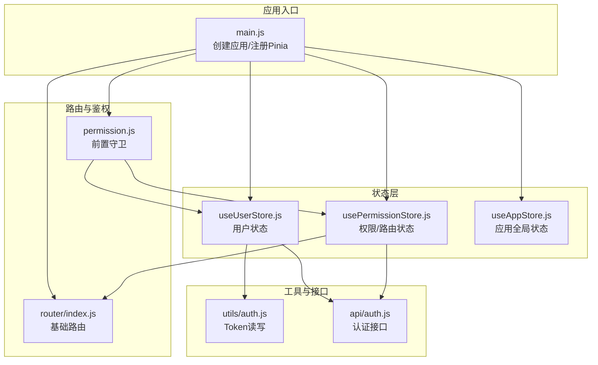
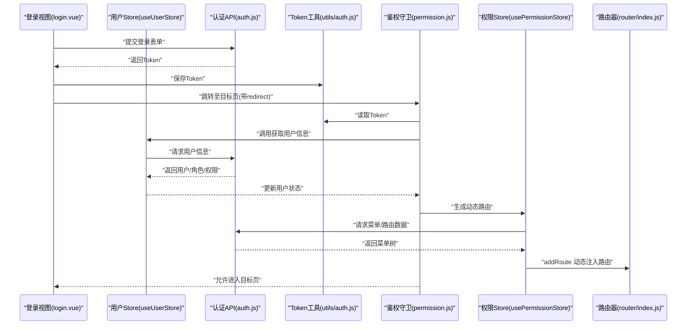
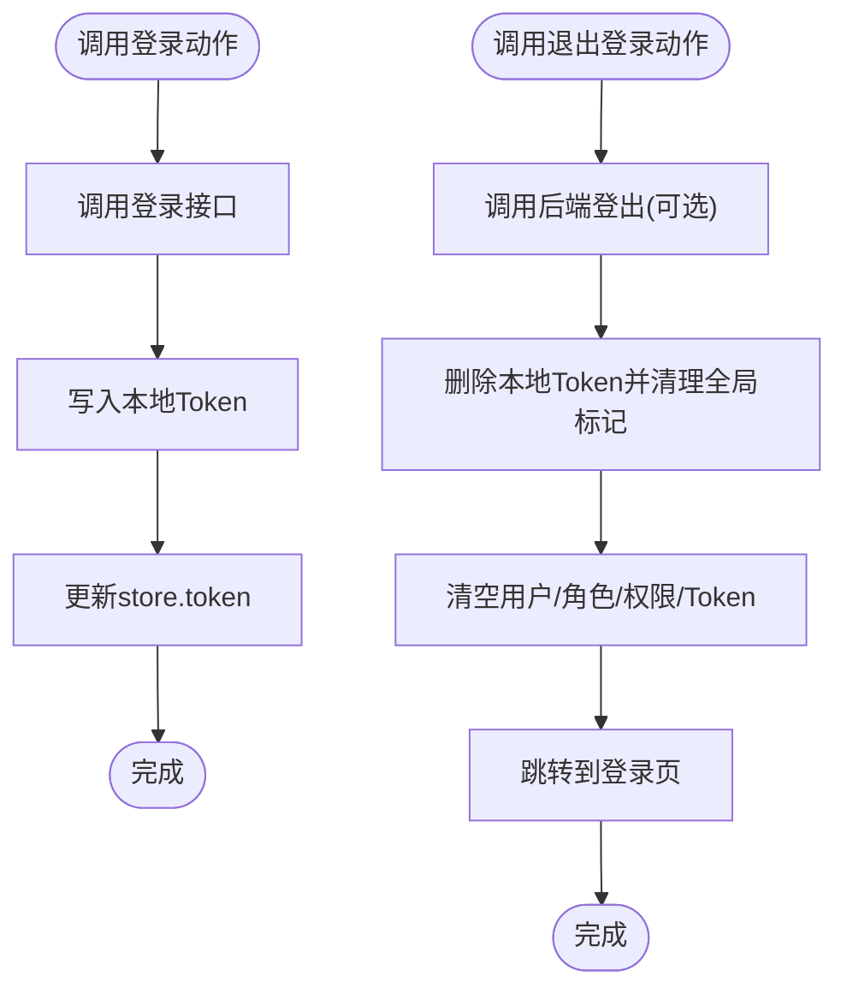
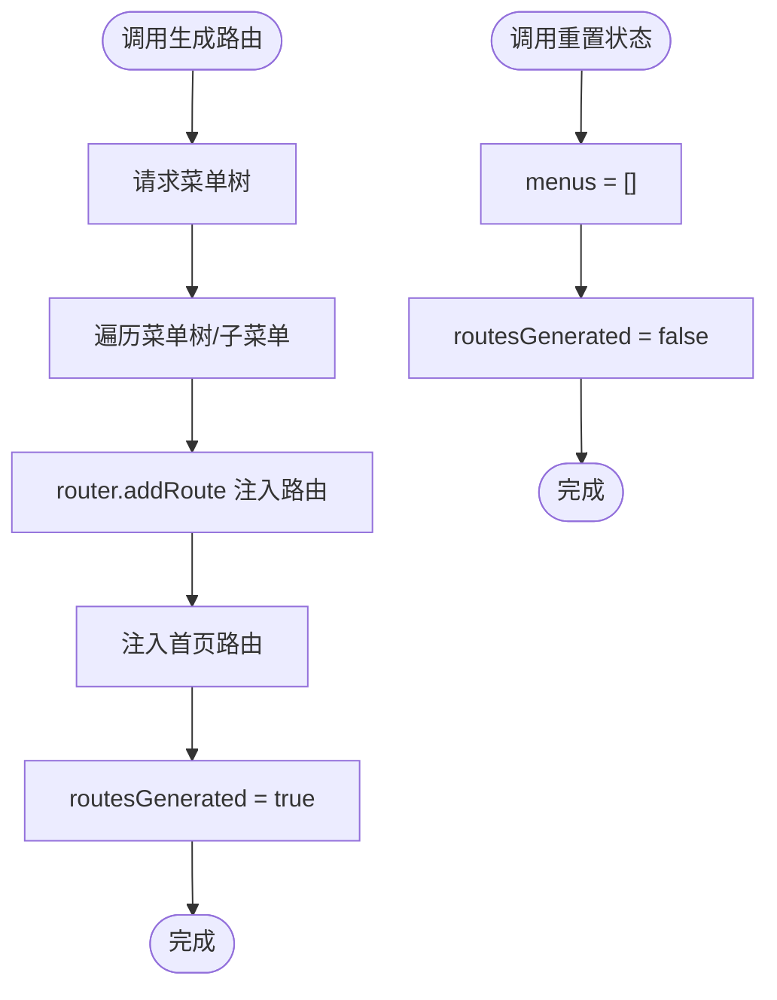
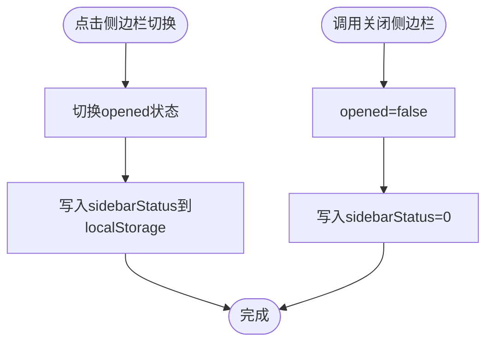
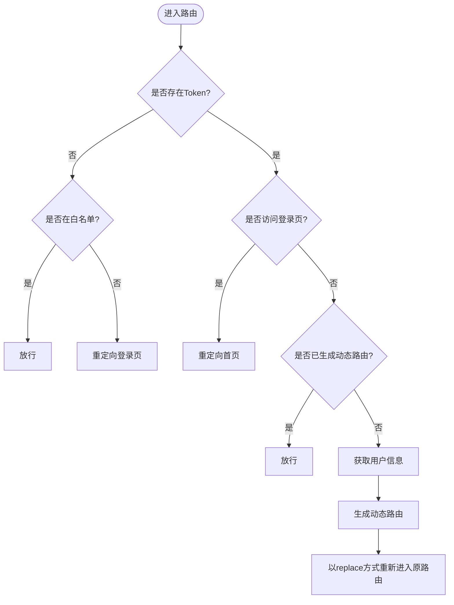
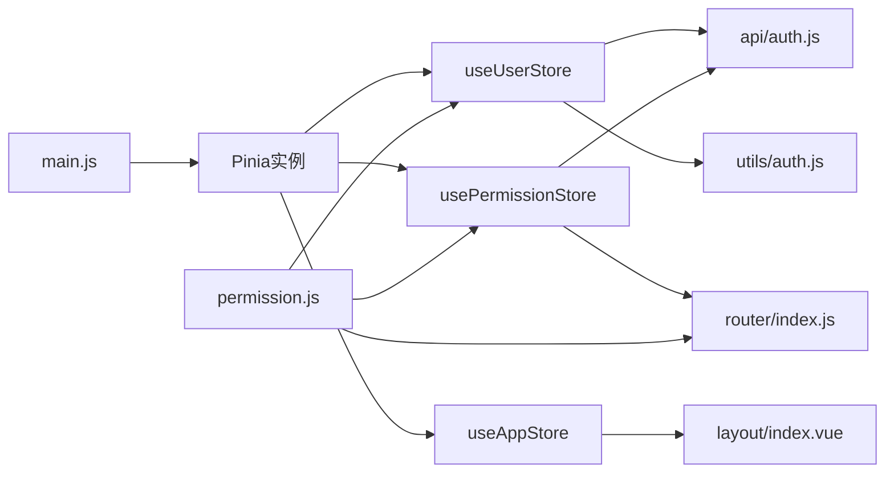

# 状态管理

<cite>
**本文引用的文件**
- [useUserStore.js](file://task-manager-frontend/src/store/modules/useUserStore.js)
- [usePermissionStore.js](file://task-manager-frontend/src/store/modules/usePermissionStore.js)
- [useAppStore.js](file://task-manager-frontend/src/store/modules/useAppStore.js)
- [main.js](file://task-manager-frontend/src/main.js)
- [auth.js](file://task-manager-frontend/src/utils/auth.js)
- [permission.js](file://task-manager-frontend/src/permission.js)
- [router/index.js](file://task-manager-frontend/src/router/index.js)
- [auth.js](file://task-manager-frontend/src/api/auth.js)
- [login.vue](file://task-manager-frontend/src/views/login.vue)
- [layout/index.vue](file://task-manager-frontend/src/layout/index.vue)
- [package.json](file://task-manager-frontend/package.json)
</cite>

## 目录
1. [简介](#简介)
2. [项目结构](#项目结构)
3. [核心组件](#核心组件)
4. [架构总览](#架构总览)
5. [详细组件分析](#详细组件分析)
6. [依赖关系分析](#依赖关系分析)
7. [性能考量](#性能考量)
8. [故障排查指南](#故障排查指南)
9. [结论](#结论)
10. [附录](#附录)

## 简介
本文件系统性梳理 CodeBuddy 任务管理系统前端的状态管理实现，围绕 Pinia 状态管理库展开，重点覆盖以下方面：
- Store 的定义与设计模式：状态、动作、派生状态（getters）
- 用户状态管理：用户信息存储、登录状态维护、Token 管理
- 权限状态管理：菜单权限、按钮权限、路由权限的状态维护与动态注入
- 应用状态管理：侧边栏开关、设备类型等全局状态
- 状态持久化与同步：本地存储、Token 同步、路由生成状态
- 状态流转图与组件交互示例

## 项目结构
任务管理前端采用模块化的状态管理组织方式，核心位于 src/store/modules 下，分别定义用户、权限与应用三类 Store；路由与鉴权守卫位于 src/router 与 src/permission 中；入口文件在 src/main.js 中注册 Pinia。

**图表来源**
- [main.js:1-24](file://task-manager-frontend/src/main.js#L1-L24)
- [useUserStore.js:1-52](file://task-manager-frontend/src/store/modules/useUserStore.js#L1-L52)
- [usePermissionStore.js:1-105](file://task-manager-frontend/src/store/modules/usePermissionStore.js#L1-L105)
- [useAppStore.js:1-24](file://task-manager-frontend/src/store/modules/useAppStore.js#L1-L24)
- [router/index.js:1-32](file://task-manager-frontend/src/router/index.js#L1-L32)
- [permission.js:1-53](file://task-manager-frontend/src/permission.js#L1-L53)
- [auth.js:1-16](file://task-manager-frontend/src/utils/auth.js#L1-L16)
- [auth.js:1-53](file://task-manager-frontend/src/api/auth.js#L1-L53)

**章节来源**
- [main.js:1-24](file://task-manager-frontend/src/main.js#L1-L24)
- [package.json:11-21](file://task-manager-frontend/package.json#L11-L21)

## 核心组件
- 用户状态模块（useUserStore）
  - 负责：Token 管理、用户信息、角色列表、权限列表
  - 关键动作：登录、获取用户信息、退出登录
- 权限状态模块（usePermissionStore）
  - 负责：菜单数据、动态路由生成状态、侧边栏菜单派生状态
  - 关键动作：生成动态路由、重置状态
- 应用状态模块（useAppStore）
  - 负责：侧边栏开关、设备类型
  - 关键动作：切换侧边栏、关闭侧边栏
- 鉴权守卫（permission.js）
  - 负责：登录态校验、动态路由生成、白名单放行、错误处理与重定向

**章节来源**
- [useUserStore.js:6-51](file://task-manager-frontend/src/store/modules/useUserStore.js#L6-L51)
- [usePermissionStore.js:26-94](file://task-manager-frontend/src/store/modules/usePermissionStore.js#L26-L94)
- [useAppStore.js:3-23](file://task-manager-frontend/src/store/modules/useAppStore.js#L3-L23)
- [permission.js:10-48](file://task-manager-frontend/src/permission.js#L10-L48)

## 架构总览
下图展示从用户登录到路由生成与页面渲染的完整状态流转过程，体现 Pinia Store 在用户态、权限态与应用态之间的协作。

**图表来源**
- [login.vue:138-159](file://task-manager-frontend/src/views/login.vue#L138-L159)
- [useUserStore.js:17-33](file://task-manager-frontend/src/store/modules/useUserStore.js#L17-L33)
- [auth.js:16-42](file://task-manager-frontend/src/api/auth.js#L16-L42)
- [auth.js:1-16](file://task-manager-frontend/src/utils/auth.js#L1-L16)
- [permission.js:14-38](file://task-manager-frontend/src/permission.js#L14-L38)
- [usePermissionStore.js:37-87](file://task-manager-frontend/src/store/modules/usePermissionStore.js#L37-L87)
- [router/index.js:4-24](file://task-manager-frontend/src/router/index.js#L4-L24)

## 详细组件分析

### 用户状态模块（useUserStore）
- 状态字段
  - token：当前登录态标识，来源于本地存储
  - user：当前用户对象
  - roles：用户角色数组
  - permissions：用户权限数组
- 动作（Actions）
  - 登录动作：调用登录接口，设置 Token 到本地存储与 store
  - 获取用户信息动作：拉取用户详情、角色与权限，并写入 store
  - 退出登录动作：调用后端登出接口，清理 Token 与 store 状态，重定向到登录页
- 设计要点
  - Token 与 store 同步：登录成功后同时写入本地存储与 store，保证刷新后仍可恢复
  - 异常兜底：退出登录使用 try/finally 确保状态清理与路由跳转

**图表来源**
- [useUserStore.js:17-49](file://task-manager-frontend/src/store/modules/useUserStore.js#L17-L49)
- [auth.js:16-32](file://task-manager-frontend/src/api/auth.js#L16-L32)
- [auth.js:1-16](file://task-manager-frontend/src/utils/auth.js#L1-L16)

**章节来源**
- [useUserStore.js:6-51](file://task-manager-frontend/src/store/modules/useUserStore.js#L6-L51)
- [auth.js:1-16](file://task-manager-frontend/src/utils/auth.js#L1-L16)

### 权限状态模块（usePermissionStore）
- 状态字段
  - menus：后端返回的菜单树数据
  - routesGenerated：动态路由是否已生成的布尔标志
- 派生状态（Getters）
  - sidebarMenus：过滤 hidden 字段后的侧边栏菜单集合
- 动作（Actions）
  - generateRoutes：拉取菜单树，解析父子路由，通过 router.addRoute 注入到 Layout 容器下，同时注入首页路由；完成后标记 routesGenerated
  - resetState：重置菜单与生成状态
- 组件映射
  - 静态组件映射表用于将菜单 component 字段解析为异步组件，便于按需加载

**图表来源**
- [usePermissionStore.js:37-93](file://task-manager-frontend/src/store/modules/usePermissionStore.js#L37-L93)
- [router/index.js:18-23](file://task-manager-frontend/src/router/index.js#L18-L23)

**章节来源**
- [usePermissionStore.js:26-94](file://task-manager-frontend/src/store/modules/usePermissionStore.js#L26-L94)

### 应用状态模块（useAppStore）
- 状态字段
  - sidebar：opened（是否展开）、withoutAnimation（动画开关）
  - device：设备类型（桌面端）
- 动作（Actions）
  - toggleSidebar：切换侧边栏状态，并将状态持久化到本地存储
  - closeSidebar：关闭侧边栏并持久化

**图表来源**
- [useAppStore.js:11-22](file://task-manager-frontend/src/store/modules/useAppStore.js#L11-L22)

**章节来源**
- [useAppStore.js:3-23](file://task-manager-frontend/src/store/modules/useAppStore.js#L3-L23)
- [layout/index.vue:22](file://task-manager-frontend/src/layout/index.vue#L22)

### 鉴权守卫（permission.js）
- 白名单：登录页无需登录
- 登录态判断：存在 Token 即视为已登录
- 路由生成策略：首次登录后拉取用户信息并生成动态路由，后续访问直接放行
- 错误处理：Token 过期或异常时清理 Token 与状态，提示并重定向登录页
- 标题与进度条：统一设置页面标题与加载进度

**图表来源**
- [permission.js:10-48](file://task-manager-frontend/src/permission.js#L10-L48)
- [router/index.js:4-24](file://task-manager-frontend/src/router/index.js#L4-L24)

**章节来源**
- [permission.js:1-53](file://task-manager-frontend/src/permission.js#L1-L53)

## 依赖关系分析
- 入口依赖
  - main.js 注册 Pinia 并挂载应用，确保 Store 可在全应用范围内使用
- 用户态依赖
  - useUserStore 依赖 utils/auth.js 进行 Token 读写，依赖 api/auth.js 进行认证与用户信息拉取
- 权限态依赖
  - usePermissionStore 依赖 api/auth.js 获取菜单树，依赖 router/index.js 注入动态路由
- 应用态依赖
  - useAppStore 依赖 localStorage 进行侧边栏状态持久化，被 layout/index.vue 计算属性消费
- 鉴权守卫依赖
  - permission.js 同时依赖 useUserStore 与 usePermissionStore，负责路由层面的统一拦截

**图表来源**
- [main.js:20](file://task-manager-frontend/src/main.js#L20)
- [useUserStore.js:2-4](file://task-manager-frontend/src/store/modules/useUserStore.js#L2-L4)
- [usePermissionStore.js:2-3](file://task-manager-frontend/src/store/modules/usePermissionStore.js#L2-L3)
- [useAppStore.js:6](file://task-manager-frontend/src/store/modules/useAppStore.js#L6)
- [layout/index.vue:22](file://task-manager-frontend/src/layout/index.vue#L22)
- [permission.js:3-4](file://task-manager-frontend/src/permission.js#L3-L4)

**章节来源**
- [main.js:1-24](file://task-manager-frontend/src/main.js#L1-L24)
- [useUserStore.js:1-52](file://task-manager-frontend/src/store/modules/useUserStore.js#L1-L52)
- [usePermissionStore.js:1-105](file://task-manager-frontend/src/store/modules/usePermissionStore.js#L1-L105)
- [useAppStore.js:1-24](file://task-manager-frontend/src/store/modules/useAppStore.js#L1-L24)
- [permission.js:1-53](file://task-manager-frontend/src/permission.js#L1-L53)

## 性能考量
- 动态路由按需注入：仅在首次登录后生成一次，避免重复注入带来的开销
- 本地存储缓存：侧边栏状态与 Token 写入 localStorage，减少初始化计算
- 组件懒加载：权限模块对组件路径进行静态映射，结合 Vite 的静态分析能力实现按需加载
- 路由替换：首次生成路由后以 replace 方式进入，避免历史栈冗余

[本节为通用建议，不直接分析具体文件]

## 故障排查指南
- 登录后无法进入页面
  - 检查鉴权守卫是否正确拉取用户信息与生成路由
  - 确认 Token 是否写入本地存储且未过期
- 退出登录后状态未清理
  - 确认退出登录动作是否执行了 Token 删除与 store $reset
- 侧边栏状态不同步
  - 检查 useAppStore 的 toggleSidebar/closeSidebar 是否写入 localStorage
  - 确认 layout/index.vue 是否正确订阅 store 的 sidebar 状态
- 菜单不显示或路由无效
  - 检查 usePermissionStore 的菜单树结构与 component 映射
  - 确认 router.addRoute 的路径拼接逻辑与 Layout 容器名一致

**章节来源**
- [permission.js:26-38](file://task-manager-frontend/src/permission.js#L26-L38)
- [useUserStore.js:38-49](file://task-manager-frontend/src/store/modules/useUserStore.js#L38-L49)
- [useAppStore.js:11-22](file://task-manager-frontend/src/store/modules/useAppStore.js#L11-L22)
- [layout/index.vue:22](file://task-manager-frontend/src/layout/index.vue#L22)
- [usePermissionStore.js:37-87](file://task-manager-frontend/src/store/modules/usePermissionStore.js#L37-L87)

## 结论
该状态管理方案以 Pinia 为核心，围绕用户态、权限态与应用态进行清晰分层：
- 用户态负责登录态与身份信息，配合 Token 工具实现跨刷新一致性
- 权限态负责菜单与路由的动态生成，确保界面与导航与后端授权一致
- 应用态负责全局 UI 行为（如侧边栏），并以本地存储实现持久化
- 鉴权守卫串联以上模块，形成从登录到路由生成再到页面渲染的闭环

[本节为总结性内容，不直接分析具体文件]

## 附录

### 状态持久化与同步机制
- Token 持久化：登录成功后写入 localStorage，退出登录时删除
- 侧边栏状态：切换/关闭时写入 localStorage，应用启动时读取
- 路由生成状态：首次生成后置位，避免重复生成

**章节来源**
- [auth.js:1-16](file://task-manager-frontend/src/utils/auth.js#L1-L16)
- [useAppStore.js:5-21](file://task-manager-frontend/src/store/modules/useAppStore.js#L5-L21)
- [permission.js:23-25](file://task-manager-frontend/src/permission.js#L23-L25)

### 组件状态交互示例
- 登录视图与用户 Store
  - 登录视图触发登录动作，随后写入 Token 并跳转
  - 用户 Store 更新 token 与用户信息，供其他模块使用
- 布局组件与应用 Store
  - 布局组件订阅应用 Store 的 sidebar 状态，响应侧边栏切换
- 鉴权守卫与权限 Store
  - 守卫在首次访问时生成动态路由，注入到路由器

**章节来源**
- [login.vue:138-159](file://task-manager-frontend/src/views/login.vue#L138-L159)
- [useUserStore.js:17-33](file://task-manager-frontend/src/store/modules/useUserStore.js#L17-L33)
- [layout/index.vue:22](file://task-manager-frontend/src/layout/index.vue#L22)
- [permission.js:26-31](file://task-manager-frontend/src/permission.js#L26-L31)
- [usePermissionStore.js:37-87](file://task-manager-frontend/src/store/modules/usePermissionStore.js#L37-L87)