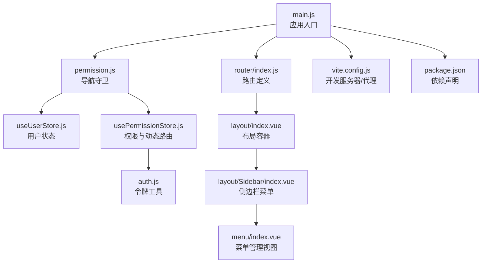
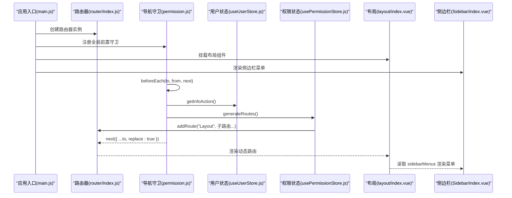
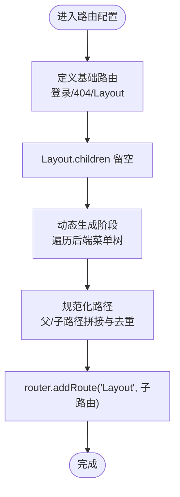
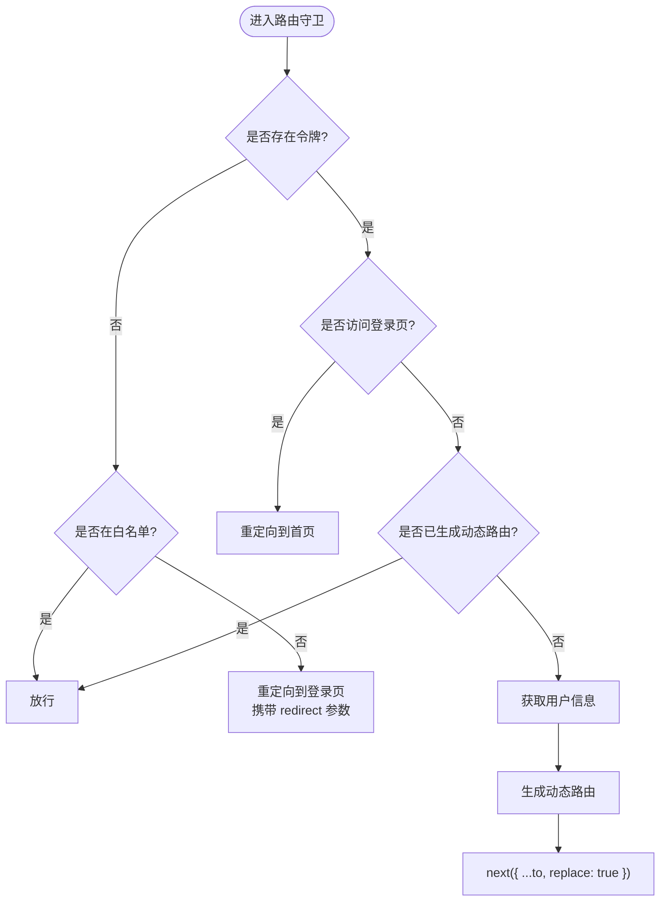
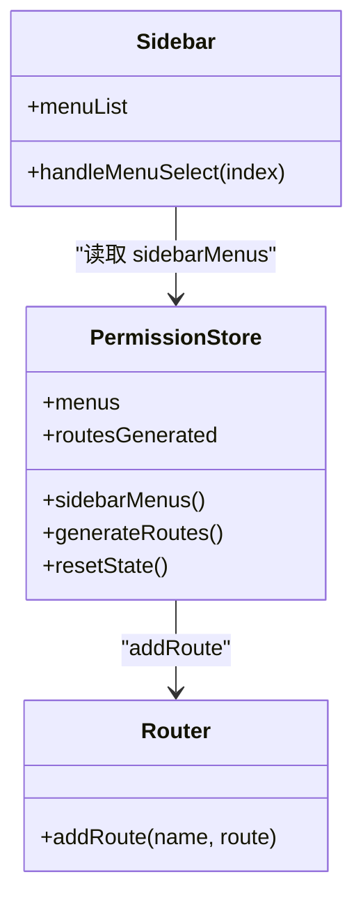
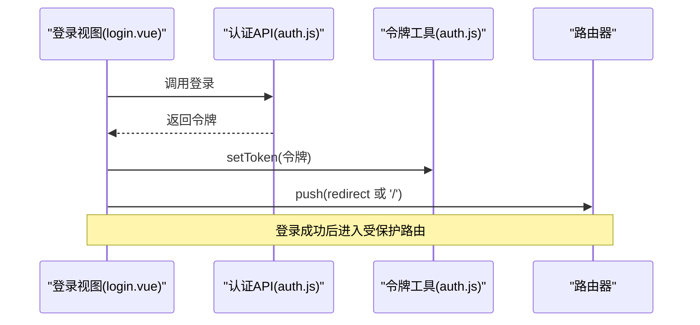
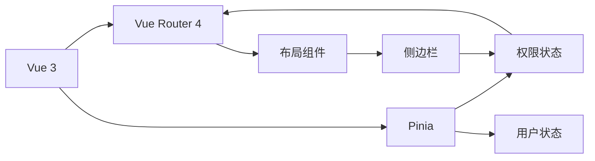

# 路由系统

<cite>
**本文引用的文件**
- [router/index.js](file://task-manager-frontend/src/router/index.js)
- [permission.js](file://task-manager-frontend/src/permission.js)
- [main.js](file://task-manager-frontend/src/main.js)
- [usePermissionStore.js](file://task-manager-frontend/src/store/modules/usePermissionStore.js)
- [useUserStore.js](file://task-manager-frontend/src/store/modules/useUserStore.js)
- [auth.js](file://task-manager-frontend/src/utils/auth.js)
- [login.vue](file://task-manager-frontend/src/views/login.vue)
- [index.vue](file://task-manager-frontend/src/layout/index.vue)
- [Sidebar/index.vue](file://task-manager-frontend/src/layout/Sidebar/index.vue)
- [menu/index.vue](file://task-manager-frontend/src/views/system/menu/index.vue)
- [vite.config.js](file://task-manager-frontend/vite.config.js)
- [package.json](file://task-manager-frontend/package.json)
</cite>

## 目录
1. [简介](#简介)
2. [项目结构](#项目结构)
3. [核心组件](#核心组件)
4. [架构总览](#架构总览)
5. [详细组件分析](#详细组件分析)
6. [依赖关系分析](#依赖关系分析)
7. [性能考虑](#性能考虑)
8. [故障排查指南](#故障排查指南)
9. [结论](#结论)
10. [附录](#附录)

## 简介
本文件面向 CodeBuddy 任务管理系统前端的路由体系，围绕 Vue Router 4 的配置与使用进行系统性说明，涵盖以下主题：
- 路由定义与嵌套路由
- 静态路由与动态路由设计策略
- 导航守卫（全局前置守卫、白名单机制）
- 权限控制与动态路由菜单生成
- 路由懒加载与性能优化
- 路由配置示例与权限控制流程图

目标是帮助开发者快速理解并扩展该路由系统，同时为非技术读者提供可读性强的概念性说明。

## 项目结构
前端路由相关的关键文件分布如下：
- 路由定义：src/router/index.js
- 导航守卫与权限拦截：src/permission.js
- 应用入口：src/main.js
- 权限与用户状态管理：src/store/modules/usePermissionStore.js、src/store/modules/useUserStore.js
- 认证工具与令牌管理：src/utils/auth.js
- 登录视图：src/views/login.vue
- 布局与侧边栏：src/layout/index.vue、src/layout/Sidebar/index.vue
- 菜单管理视图：src/views/system/menu/index.vue
- 构建与代理配置：vite.config.js
- 依赖声明：package.json

图表来源
- [main.js:1-24](file://task-manager-frontend/src/main.js#L1-L24)
- [router/index.js:1-32](file://task-manager-frontend/src/router/index.js#L1-L32)
- [permission.js:1-53](file://task-manager-frontend/src/permission.js#L1-L53)
- [usePermissionStore.js:1-105](file://task-manager-frontend/src/store/modules/usePermissionStore.js#L1-L105)
- [useUserStore.js:1-52](file://task-manager-frontend/src/store/modules/useUserStore.js#L1-L52)
- [auth.js:1-16](file://task-manager-frontend/src/utils/auth.js#L1-L16)
- [index.vue:1-50](file://task-manager-frontend/src/layout/index.vue#L1-L50)
- [Sidebar/index.vue:1-139](file://task-manager-frontend/src/layout/Sidebar/index.vue#L1-L139)
- [menu/index.vue:1-216](file://task-manager-frontend/src/views/system/menu/index.vue#L1-L216)
- [vite.config.js:1-28](file://task-manager-frontend/vite.config.js#L1-L28)
- [package.json:1-30](file://task-manager-frontend/package.json#L1-L30)

章节来源
- [main.js:1-24](file://task-manager-frontend/src/main.js#L1-L24)
- [router/index.js:1-32](file://task-manager-frontend/src/router/index.js#L1-L32)
- [permission.js:1-53](file://task-manager-frontend/src/permission.js#L1-L53)
- [usePermissionStore.js:1-105](file://task-manager-frontend/src/store/modules/usePermissionStore.js#L1-L105)
- [useUserStore.js:1-52](file://task-manager-frontend/src/store/modules/useUserStore.js#L1-L52)
- [auth.js:1-16](file://task-manager-frontend/src/utils/auth.js#L1-L16)
- [index.vue:1-50](file://task-manager-frontend/src/layout/index.vue#L1-L50)
- [Sidebar/index.vue:1-139](file://task-manager-frontend/src/layout/Sidebar/index.vue#L1-L139)
- [menu/index.vue:1-216](file://task-manager-frontend/src/views/system/menu/index.vue#L1-L216)
- [vite.config.js:1-28](file://task-manager-frontend/vite.config.js#L1-L28)
- [package.json:1-30](file://task-manager-frontend/package.json#L1-L30)

## 核心组件
- 路由器实例与基础路由
  - 在路由定义文件中创建路由器实例，并配置公共路由（登录页、404 错误页）以及根布局路由（包含 children 空数组，用于后续动态注入子路由）。
  - 关键点：使用历史模式；根路由作为“Layout”命名容器，便于后续通过 addRoute 动态挂载子路由。
- 导航守卫
  - 在全局前置守卫中实现登录态校验、白名单放行、动态路由生成与替换导航。
  - 结合进度条与标题设置，提升用户体验。
- 权限与用户状态
  - 用户状态管理负责登录、获取用户信息、登出等动作。
  - 权限状态管理负责拉取后端菜单树、解析为路由、注入到 Layout 容器，并维护侧边栏菜单列表。
- 布局与侧边栏
  - 布局组件承载侧边栏与主内容区域，侧边栏菜单基于权限状态渲染。
  - 侧边栏菜单点击统一通过 router.push 导航，保证与路由一致的行为。
- 登录视图
  - 提供表单校验、验证码、登录请求与重定向逻辑，登录成功后根据查询参数跳转至目标页。

章节来源
- [router/index.js:1-32](file://task-manager-frontend/src/router/index.js#L1-L32)
- [permission.js:1-53](file://task-manager-frontend/src/permission.js#L1-L53)
- [useUserStore.js:1-52](file://task-manager-frontend/src/store/modules/useUserStore.js#L1-L52)
- [usePermissionStore.js:1-105](file://task-manager-frontend/src/store/modules/usePermissionStore.js#L1-L105)
- [index.vue:1-50](file://task-manager-frontend/src/layout/index.vue#L1-L50)
- [Sidebar/index.vue:1-139](file://task-manager-frontend/src/layout/Sidebar/index.vue#L1-L139)
- [login.vue:1-299](file://task-manager-frontend/src/views/login.vue#L1-L299)

## 架构总览
下图展示了从应用启动到路由守卫生效、动态路由生成与菜单渲染的整体流程：

图表来源
- [main.js:1-24](file://task-manager-frontend/src/main.js#L1-L24)
- [router/index.js:1-32](file://task-manager-frontend/src/router/index.js#L1-L32)
- [permission.js:10-48](file://task-manager-frontend/src/permission.js#L10-L48)
- [useUserStore.js:26-33](file://task-manager-frontend/src/store/modules/useUserStore.js#L26-L33)
- [usePermissionStore.js:37-87](file://task-manager-frontend/src/store/modules/usePermissionStore.js#L37-L87)
- [index.vue:1-50](file://task-manager-frontend/src/layout/index.vue#L1-L50)
- [Sidebar/index.vue:64-64](file://task-manager-frontend/src/layout/Sidebar/index.vue#L64-L64)

## 详细组件分析

### 路由定义与嵌套路由
- 基础路由
  - 登录页与 404 错误页采用异步组件加载，减少首屏体积。
  - 根路由命名为 Layout，redirect 到仪表盘，children 数组留空，为后续动态注入子路由做准备。
- 嵌套路由
  - 动态路由通过 router.addRoute('Layout', ...) 注入，形成 Layout -> 子路由 的嵌套结构。
  - 子路由路径拼接遵循“父路径 + 子路径”，并规范化为绝对路径，避免重复或错误路径。

图表来源
- [router/index.js:4-24](file://task-manager-frontend/src/router/index.js#L4-L24)
- [usePermissionStore.js:42-76](file://task-manager-frontend/src/store/modules/usePermissionStore.js#L42-L76)

章节来源
- [router/index.js:4-24](file://task-manager-frontend/src/router/index.js#L4-L24)
- [usePermissionStore.js:42-76](file://task-manager-frontend/src/store/modules/usePermissionStore.js#L42-L76)

### 导航守卫与权限控制
- 白名单机制
  - 未登录状态下访问白名单路由（如登录页）直接放行。
- 登录态校验
  - 若存在令牌且访问登录页，则重定向到首页。
  - 若不存在令牌，则重定向到登录页并携带 redirect 参数。
- 动态路由生成
  - 首次进入受保护路由时，先获取用户信息，再调用权限状态生成动态路由，最后 replace 当前路由以避免重复生成。
- 异常处理
  - 生成动态路由过程中异常时，清理本地令牌与状态，提示过期并引导重新登录。

图表来源
- [permission.js:7-8](file://task-manager-frontend/src/permission.js#L7-L8)
- [permission.js:10-48](file://task-manager-frontend/src/permission.js#L10-L48)
- [useUserStore.js:26-33](file://task-manager-frontend/src/store/modules/useUserStore.js#L26-L33)
- [usePermissionStore.js:37-87](file://task-manager-frontend/src/store/modules/usePermissionStore.js#L37-L87)

章节来源
- [permission.js:7-8](file://task-manager-frontend/src/permission.js#L7-L8)
- [permission.js:10-48](file://task-manager-frontend/src/permission.js#L10-L48)
- [useUserStore.js:26-33](file://task-manager-frontend/src/store/modules/useUserStore.js#L26-L33)
- [usePermissionStore.js:37-87](file://task-manager-frontend/src/store/modules/usePermissionStore.js#L37-L87)

### 权限控制与动态路由菜单
- 菜单数据来源
  - 通过权限状态的异步方法拉取后端菜单树，保存到内存并用于生成路由与侧边栏菜单。
- 路由生成策略
  - 对于有子节点的菜单，逐个生成子路由；无子节点的菜单直接生成路由。
  - 组件解析采用静态映射表，确保 Vite 可静态分析与代码分割。
- 侧边栏菜单
  - 侧边栏从权限状态的 getter 中读取非隐藏菜单，统一规范化路径后再渲染。
  - 菜单点击通过 router.push 导航，避免重复跳转。

图表来源
- [usePermissionStore.js:26-94](file://task-manager-frontend/src/store/modules/usePermissionStore.js#L26-L94)
- [Sidebar/index.vue:64-64](file://task-manager-frontend/src/layout/Sidebar/index.vue#L64-L64)

章节来源
- [usePermissionStore.js:26-94](file://task-manager-frontend/src/store/modules/usePermissionStore.js#L26-L94)
- [Sidebar/index.vue:64-64](file://task-manager-frontend/src/layout/Sidebar/index.vue#L64-L64)

### 登录页与令牌管理
- 登录页
  - 表单校验、验证码（可选）、提交登录请求、设置令牌、根据 redirect 参数跳转。
- 令牌管理
  - 本地存储令牌键名固定，提供获取、设置、移除方法；登出时同步清理全局标记。

图表来源
- [login.vue:138-159](file://task-manager-frontend/src/views/login.vue#L138-L159)
- [auth.js:3-15](file://task-manager-frontend/src/utils/auth.js#L3-L15)

章节来源
- [login.vue:138-159](file://task-manager-frontend/src/views/login.vue#L138-L159)
- [auth.js:3-15](file://task-manager-frontend/src/utils/auth.js#L3-L15)

### 布局与侧边栏
- 布局容器
  - 包含侧边栏与主内容区，支持侧边栏展开/收起，动态调整主内容区宽度。
- 侧边栏菜单
  - 读取权限状态中的菜单列表，统一规范化路径，绑定 el-menu 的 select 事件，统一通过 router.push 导航。

章节来源
- [index.vue:1-50](file://task-manager-frontend/src/layout/index.vue#L1-L50)
- [Sidebar/index.vue:64-83](file://task-manager-frontend/src/layout/Sidebar/index.vue#L64-L83)

### 菜单管理视图
- 功能概览
  - 支持菜单树形展示、搜索过滤、新增/修改/删除、父子级选择、权限标识与路由地址配置。
- 数据结构
  - 后端返回菜单树，前端通过递归构建树形结构；表单字段覆盖菜单类型（目录/菜单/按钮）、路由地址、组件路径、权限标识、图标等。

章节来源
- [menu/index.vue:162-215](file://task-manager-frontend/src/views/system/menu/index.vue#L162-L215)

## 依赖关系分析
- 运行时依赖
  - Vue 3、Vue Router 4、Pinia、Element Plus、NProgress、Axios。
- 构建与开发
  - Vite 作为构建工具，配置了别名与开发代理，便于前后端联调。
- 路由与状态耦合
  - 导航守卫依赖用户与权限状态；权限状态依赖后端菜单树；布局与侧边栏依赖权限状态。

图表来源
- [package.json:11-20](file://task-manager-frontend/package.json#L11-L20)
- [main.js:13-22](file://task-manager-frontend/src/main.js#L13-L22)
- [usePermissionStore.js:1-3](file://task-manager-frontend/src/store/modules/usePermissionStore.js#L1-L3)
- [Sidebar/index.vue:37-43](file://task-manager-frontend/src/layout/Sidebar/index.vue#L37-L43)

章节来源
- [package.json:11-20](file://task-manager-frontend/package.json#L11-L20)
- [main.js:13-22](file://task-manager-frontend/src/main.js#L13-L22)
- [usePermissionStore.js:1-3](file://task-manager-frontend/src/store/modules/usePermissionStore.js#L1-L3)
- [Sidebar/index.vue:37-43](file://task-manager-frontend/src/layout/Sidebar/index.vue#L37-L43)

## 性能考虑
- 路由懒加载
  - 登录页与错误页采用异步组件导入，降低首屏包体。
  - 动态路由组件通过静态映射表集中管理，利于 Vite 静态分析与代码分割。
- 进度条与标题
  - 全局守卫中开启/关闭进度条，设置页面标题，改善交互体验。
- 代理与开发效率
  - 开发服务器代理将 /dev-api 请求转发到后端服务，减少跨域与调试成本。

章节来源
- [router/index.js:8-14](file://task-manager-frontend/src/router/index.js#L8-L14)
- [usePermissionStore.js:6-24](file://task-manager-frontend/src/store/modules/usePermissionStore.js#L6-L24)
- [permission.js:10-12](file://task-manager-frontend/src/permission.js#L10-L12)
- [vite.config.js:18-24](file://task-manager-frontend/vite.config.js#L18-L24)

## 故障排查指南
- 登录后无法进入受保护路由
  - 检查令牌是否正确写入本地存储；确认导航守卫中白名单与令牌判断逻辑。
  - 确认首次进入受保护路由时是否触发了动态路由生成。
- 动态路由未生效
  - 检查权限状态是否已标记 routesGenerated；确认 generateRoutes 是否被调用且成功。
  - 检查菜单树中子路由 path 是否规范（相对/绝对路径）。
- 侧边栏菜单不显示
  - 检查权限状态的 sidebarMenus 过滤逻辑；确认菜单 meta.hidden 字段是否正确。
- 登录页验证码问题
  - 检查验证码接口返回与前端赋值逻辑；确认表单规则与回车事件处理。

章节来源
- [permission.js:14-47](file://task-manager-frontend/src/permission.js#L14-L47)
- [usePermissionStore.js:37-87](file://task-manager-frontend/src/store/modules/usePermissionStore.js#L37-L87)
- [Sidebar/index.vue:64-64](file://task-manager-frontend/src/layout/Sidebar/index.vue#L64-L64)
- [login.vue:124-135](file://task-manager-frontend/src/views/login.vue#L124-L135)

## 结论
该路由系统以 Vue Router 4 为基础，结合 Pinia 状态管理与全局导航守卫，实现了“静态基础路由 + 动态权限路由”的混合策略。通过后端菜单树驱动前端路由与侧边栏菜单，既满足了权限控制需求，又保持了良好的可扩展性与性能表现。建议在后续迭代中进一步完善权限指令与细粒度权限校验，以及对动态路由的持久化与缓存策略。

## 附录
- 路由配置示例（路径引用）
  - 基础路由定义：[router/index.js:4-24](file://task-manager-frontend/src/router/index.js#L4-L24)
  - 动态路由生成：[usePermissionStore.js:37-87](file://task-manager-frontend/src/store/modules/usePermissionStore.js#L37-L87)
  - 导航守卫与白名单：[permission.js:7-8](file://task-manager-frontend/src/permission.js#L7-L8)、[permission.js:10-48](file://task-manager-frontend/src/permission.js#L10-L48)
  - 登录页与令牌：[login.vue:138-159](file://task-manager-frontend/src/views/login.vue#L138-L159)、[auth.js:3-15](file://task-manager-frontend/src/utils/auth.js#L3-L15)
  - 布局与侧边栏：[index.vue:1-50](file://task-manager-frontend/src/layout/index.vue#L1-L50)、[Sidebar/index.vue:64-83](file://task-manager-frontend/src/layout/Sidebar/index.vue#L64-L83)
  - 菜单管理视图：[menu/index.vue:162-215](file://task-manager-frontend/src/views/system/menu/index.vue#L162-L215)
  - 构建与代理：[vite.config.js:18-24](file://task-manager-frontend/vite.config.js#L18-L24)
  - 依赖声明：[package.json:11-20](file://task-manager-frontend/package.json#L11-L20)