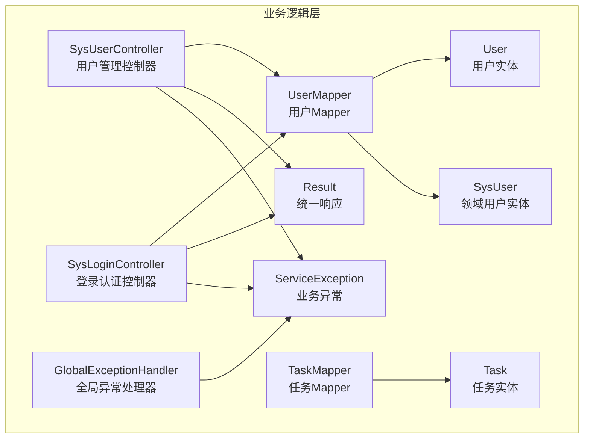
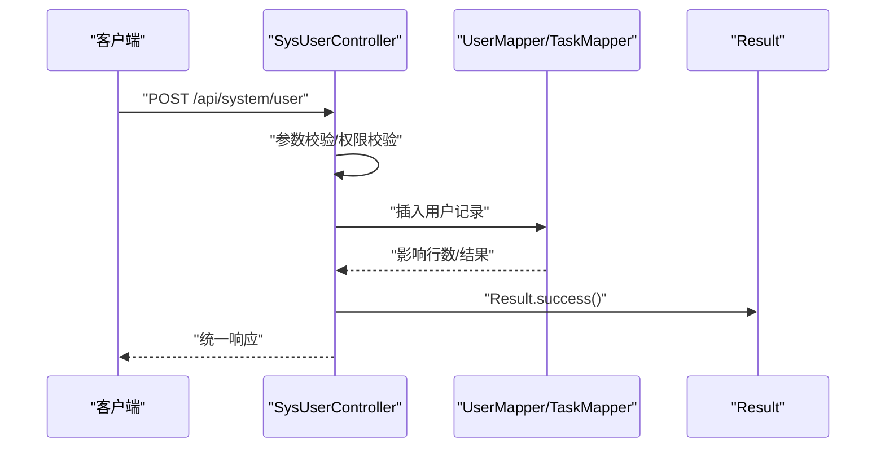
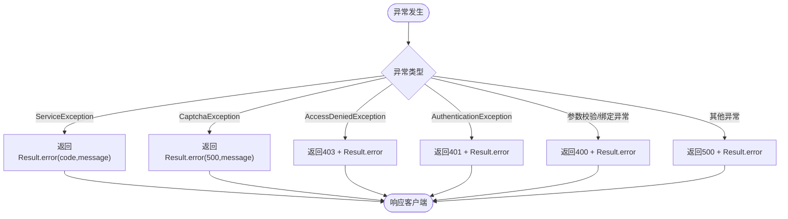
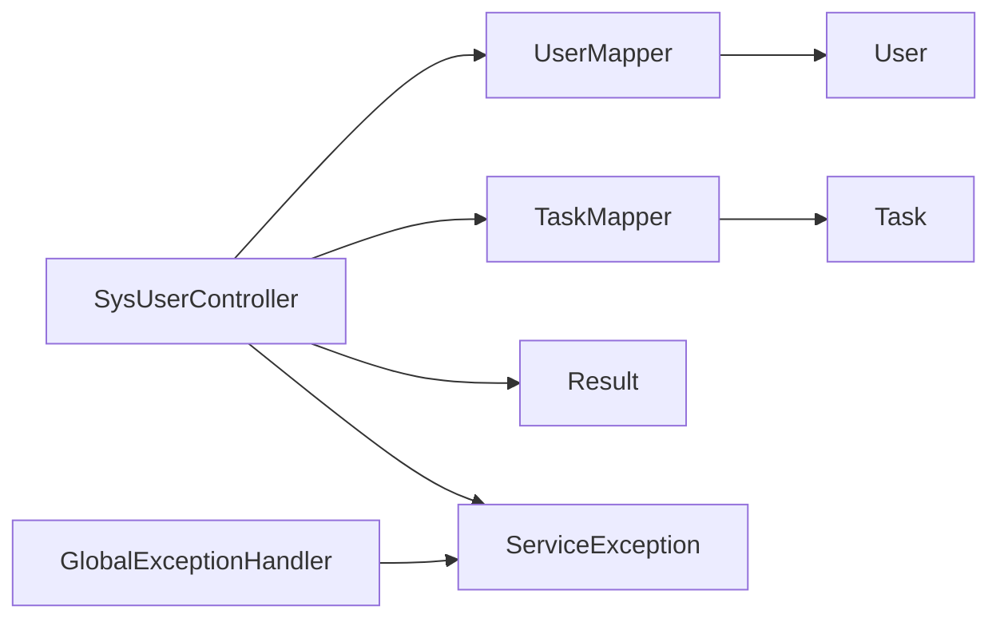

# 业务逻辑层

<cite>
**本文引用的文件**
- [Task.java](file://task-manager-backend/src/main/java/com/taskmanager/entity/Task.java)
- [User.java](file://task-manager-backend/src/main/java/com/taskmanager/entity/User.java)
- [TaskMapper.java](file://task-manager-backend/src/main/java/com/taskmanager/mapper/TaskMapper.java)
- [UserMapper.java](file://task-manager-backend/src/main/java/com/taskmanager/mapper/UserMapper.java)
- [SysUser.java](file://task-manager-backend/src/main/java/com/taskmanager/domain/SysUser.java)
- [SysUserController.java](file://task-manager-backend/src/main/java/com/taskmanager/controller/SysUserController.java)
- [SysLoginController.java](file://task-manager-backend/src/main/java/com/taskmanager/controller/SysLoginController.java)
- [ServiceException.java](file://task-manager-backend/src/main/java/com/taskmanager/common/exception/ServiceException.java)
- [GlobalExceptionHandler.java](file://task-manager-backend/src/main/java/com/taskmanager/common/exception/GlobalExceptionHandler.java)
- [Result.java](file://task-manager-backend/src/main/java/com/taskmanager/common/Result.java)
- [SysUserControllerTest.java](file://task-manager-backend/src/test/java/com/taskmanager/controller/SysUserControllerTest.java)
</cite>

## 目录
1. [简介](#简介)
2. [项目结构](#项目结构)
3. [核心组件](#核心组件)
4. [架构总览](#架构总览)
5. [详细组件分析](#详细组件分析)
6. [依赖分析](#依赖分析)
7. [性能考虑](#性能考虑)
8. [故障排查指南](#故障排查指南)
9. [结论](#结论)
10. [附录](#附录)

## 简介
本文件面向CodeBuddy任务管理系统业务逻辑层，聚焦Service接口设计原则与实现模式、业务方法职责划分、事务管理策略、异常处理机制、ServiceImpl实现细节、依赖注入与方法调用链、数据流转过程、业务验证规则与约束、事务边界与传播行为、单元测试编写方法、扩展点与插件化设计思路，以及业务异常分类与国际化策略。文档以仓库中实际存在的文件为依据，避免臆造信息，并提供可追溯的来源标注。

## 项目结构
业务逻辑层位于后端工程task-manager-backend中，采用“领域模型-持久层-控制层”的分层组织。与任务管理直接相关的核心文件包括：
- 领域实体：Task、User（任务与用户）
- Mapper接口：TaskMapper、UserMapper（数据库访问）
- 控制器：SysUserController、SysLoginController（对外暴露REST接口）
- 通用响应与异常：Result、ServiceException、GlobalExceptionHandler
- 测试：SysUserControllerTest（演示如何对业务层进行集成测试）

图表来源
- [SysUserController.java:1-75](file://task-manager-backend/src/main/java/com/taskmanager/controller/SysUserController.java#L1-L75)
- [SysLoginController.java:103-113](file://task-manager-backend/src/main/java/com/taskmanager/controller/SysLoginController.java#L103-L113)
- [TaskMapper.java:1-57](file://task-manager-backend/src/main/java/com/taskmanager/mapper/TaskMapper.java#L1-L57)
- [UserMapper.java:1-22](file://task-manager-backend/src/main/java/com/taskmanager/mapper/UserMapper.java#L1-L22)
- [Task.java:1-50](file://task-manager-backend/src/main/java/com/taskmanager/entity/Task.java#L1-L50)
- [User.java:1-31](file://task-manager-backend/src/main/java/com/taskmanager/entity/User.java#L1-L31)
- [SysUser.java:1-80](file://task-manager-backend/src/main/java/com/taskmanager/domain/SysUser.java#L1-L80)
- [Result.java:1-76](file://task-manager-backend/src/main/java/com/taskmanager/common/Result.java#L1-L76)
- [ServiceException.java:1-34](file://task-manager-backend/src/main/java/com/taskmanager/common/exception/ServiceException.java#L1-L34)
- [GlobalExceptionHandler.java:1-109](file://task-manager-backend/src/main/java/com/taskmanager/common/exception/GlobalExceptionHandler.java#L1-L109)

章节来源
- [Task.java:1-50](file://task-manager-backend/src/main/java/com/taskmanager/entity/Task.java#L1-L50)
- [User.java:1-31](file://task-manager-backend/src/main/java/com/taskmanager/entity/User.java#L1-L31)
- [TaskMapper.java:1-57](file://task-manager-backend/src/main/java/com/taskmanager/mapper/TaskMapper.java#L1-L57)
- [UserMapper.java:1-22](file://task-manager-backend/src/main/java/com/taskmanager/mapper/UserMapper.java#L1-L22)
- [SysUser.java:1-80](file://task-manager-backend/src/main/java/com/taskmanager/domain/SysUser.java#L1-L80)
- [SysUserController.java:1-75](file://task-manager-backend/src/main/java/com/taskmanager/controller/SysUserController.java#L1-L75)
- [SysLoginController.java:103-113](file://task-manager-backend/src/main/java/com/taskmanager/controller/SysLoginController.java#L103-L113)
- [Result.java:1-76](file://task-manager-backend/src/main/java/com/taskmanager/common/Result.java#L1-L76)
- [ServiceException.java:1-34](file://task-manager-backend/src/main/java/com/taskmanager/common/exception/ServiceException.java#L1-L34)
- [GlobalExceptionHandler.java:1-109](file://task-manager-backend/src/main/java/com/taskmanager/common/exception/GlobalExceptionHandler.java#L1-L109)

## 核心组件
- 统一响应封装：Result提供success/error静态工厂方法，确保前后端一致的响应格式。
- 业务异常：ServiceException承载业务错误码与消息；GlobalExceptionHandler统一拦截并返回标准响应。
- 控制器：SysUserController负责用户管理的CRUD与状态变更；SysLoginController负责登录、验证码与会话管理。
- Mapper：TaskMapper与UserMapper提供任务与用户的数据访问能力，包含分页、按用户筛选、状态更新等方法。
- 领域模型：Task与User为MyBatis-Plus实体；SysUser为系统用户领域对象，用于权限与安全场景。

章节来源
- [Result.java:1-76](file://task-manager-backend/src/main/java/com/taskmanager/common/Result.java#L1-L76)
- [ServiceException.java:1-34](file://task-manager-backend/src/main/java/com/taskmanager/common/exception/ServiceException.java#L1-L34)
- [GlobalExceptionHandler.java:1-109](file://task-manager-backend/src/main/java/com/taskmanager/common/exception/GlobalExceptionHandler.java#L1-L109)
- [SysUserController.java:1-75](file://task-manager-backend/src/main/java/com/taskmanager/controller/SysUserController.java#L1-L75)
- [SysLoginController.java:103-113](file://task-manager-backend/src/main/java/com/taskmanager/controller/SysLoginController.java#L103-L113)
- [TaskMapper.java:1-57](file://task-manager-backend/src/main/java/com/taskmanager/mapper/TaskMapper.java#L1-L57)
- [UserMapper.java:1-22](file://task-manager-backend/src/main/java/com/taskmanager/mapper/UserMapper.java#L1-L22)
- [Task.java:1-50](file://task-manager-backend/src/main/java/com/taskmanager/entity/Task.java#L1-L50)
- [User.java:1-31](file://task-manager-backend/src/main/java/com/taskmanager/entity/User.java#L1-L31)
- [SysUser.java:1-80](file://task-manager-backend/src/main/java/com/taskmanager/domain/SysUser.java#L1-L80)

## 架构总览
业务逻辑层遵循“控制层-服务层-数据访问层”分层，控制器仅负责参数解析、鉴权与调用服务层；服务层负责业务编排与事务边界；数据访问层负责与数据库交互。异常通过全局处理器统一拦截，返回标准化响应。

图表来源
- [SysUserController.java:62-70](file://task-manager-backend/src/main/java/com/taskmanager/controller/SysUserController.java#L62-L70)
- [UserMapper.java:1-22](file://task-manager-backend/src/main/java/com/taskmanager/mapper/UserMapper.java#L1-L22)
- [Result.java:1-76](file://task-manager-backend/src/main/java/com/taskmanager/common/Result.java#L1-L76)

## 详细组件分析

### 控制器层：SysUserController
- 职责划分
  - 列表查询：分页+条件筛选，返回TableDataInfo包装。
  - 详情查询：按用户ID查询。
  - 新增用户：密码加密、默认状态与删除标记设置，调用Mapper插入。
  - 修改用户：先查询再更新。
  - 权限注解：@PreAuthorize配合权限服务进行访问控制。
- 输入验证与约束
  - 分页参数pageNum/pageSize具备默认值。
  - 可选筛选条件：userName/phonenumber/status/deptId。
  - 新增时password必填，status为空时设置默认值。
- 方法调用链
  - Controller -> Mapper -> Result封装 -> HTTP响应。
- 事务管理
  - 当前控制器未声明事务注解，业务方法在Mapper层执行，未见显式事务边界。

章节来源
- [SysUserController.java:1-75](file://task-manager-backend/src/main/java/com/taskmanager/controller/SysUserController.java#L1-L75)

### 控制器层：SysLoginController
- 职责划分
  - 获取验证码：调用CaptchaService生成图形验证码。
  - 用户登录：可选验证码校验，成功后返回登录结果。
- 验证码流程
  - 若携带uuid与code，则调用CaptchaService.validateCaptcha进行校验，失败时返回错误响应。
- 方法调用链
  - Controller -> CaptchaService -> Result封装 -> HTTP响应。

章节来源
- [SysLoginController.java:95-113](file://task-manager-backend/src/main/java/com/taskmanager/controller/SysLoginController.java#L95-L113)

### 数据访问层：TaskMapper与UserMapper
- TaskMapper
  - 提供分页查询、按用户ID查询、状态更新、按ID+用户ID查询等方法。
  - 支持按状态与关键词筛选任务。
- UserMapper
  - 提供按用户名查询用户的能力。
- 数据一致性
  - Mapper方法通过MyBatis-Plus与数据库交互，未见显式事务注解，一致性由数据库约束与上层控制器保障。

章节来源
- [TaskMapper.java:1-57](file://task-manager-backend/src/main/java/com/taskmanager/mapper/TaskMapper.java#L1-L57)
- [UserMapper.java:1-22](file://task-manager-backend/src/main/java/com/taskmanager/mapper/UserMapper.java#L1-L22)

### 领域模型：Task、User、SysUser
- Task
  - 字段：id、title、description、completed、userId、createdTime。
  - 用途：任务管理的核心实体。
- User
  - 字段：id、username、password。
  - 用途：基础用户实体，常用于登录与会话。
- SysUser
  - 字段：userId、deptId、userName、nickName、userType、email、phonenumber、sex、avatar、password、status、delFlag、loginIp、loginDate、createBy、createTime、updateBy、updateTime、remark。
  - 用途：系统用户领域对象，承载权限与安全相关信息。

章节来源
- [Task.java:1-50](file://task-manager-backend/src/main/java/com/taskmanager/entity/Task.java#L1-L50)
- [User.java:1-31](file://task-manager-backend/src/main/java/com/taskmanager/entity/User.java#L1-L31)
- [SysUser.java:1-80](file://task-manager-backend/src/main/java/com/taskmanager/domain/SysUser.java#L1-L80)

### 统一响应与异常处理
- Result
  - 提供success/error静态工厂方法，统一响应结构（code/message/data）。
- ServiceException
  - 业务异常基类，携带错误码与消息。
- GlobalExceptionHandler
  - 统一拦截ServiceException、CaptchaException、权限拒绝、认证异常、参数校验异常等，返回标准Result或HTTP状态码。

图表来源
- [GlobalExceptionHandler.java:1-109](file://task-manager-backend/src/main/java/com/taskmanager/common/exception/GlobalExceptionHandler.java#L1-L109)
- [ServiceException.java:1-34](file://task-manager-backend/src/main/java/com/taskmanager/common/exception/ServiceException.java#L1-L34)
- [Result.java:1-76](file://task-manager-backend/src/main/java/com/taskmanager/common/Result.java#L1-L76)

章节来源
- [Result.java:1-76](file://task-manager-backend/src/main/java/com/taskmanager/common/Result.java#L1-L76)
- [ServiceException.java:1-34](file://task-manager-backend/src/main/java/com/taskmanager/common/exception/ServiceException.java#L1-L34)
- [GlobalExceptionHandler.java:1-109](file://task-manager-backend/src/main/java/com/taskmanager/common/exception/GlobalExceptionHandler.java#L1-L109)

### 业务逻辑验证规则与约束
- 输入参数验证
  - 控制器参数具备默认值与可选性，如分页参数pageNum/pageSize默认值、筛选条件可为空。
  - 新增用户时password必填，status为空时设置默认值。
- 业务规则检查
  - 登录流程可选验证码校验，失败时返回错误响应。
- 数据一致性
  - 通过Mapper方法与数据库约束保障；当前未发现显式事务注解。

章节来源
- [SysUserController.java:33-70](file://task-manager-backend/src/main/java/com/taskmanager/controller/SysUserController.java#L33-L70)
- [SysLoginController.java:103-113](file://task-manager-backend/src/main/java/com/taskmanager/controller/SysLoginController.java#L103-L113)

### 事务管理策略与传播行为
- 当前实现
  - 控制器未声明事务注解；业务方法在Mapper层执行，未见显式事务边界。
- 建议
  - 对于需要强一致性的业务（如新增用户并分配角色），应在服务层使用@Transactional定义事务边界，明确传播行为与回滚策略。
  - 对于只读查询（如分页列表），可设置只读事务提升性能。

章节来源
- [SysUserController.java:1-75](file://task-manager-backend/src/main/java/com/taskmanager/controller/SysUserController.java#L1-L75)

### 单元测试编写方法
- Mock对象使用
  - 使用when(...).thenReturn(...)模拟Mapper返回值；使用Mockito.verify验证调用次数。
- 测试数据准备
  - 构造SysUser对象，设置必要字段；使用PasswordEncoder编码密码。
- 边界条件测试
  - 测试分页参数边界（pageNum=1、pageSize超大）、筛选条件为空、用户不存在等。
- 示例参考
  - SysUserControllerTest展示了列表查询、详情查询、新增用户、修改用户的测试用例与断言。

章节来源
- [SysUserControllerTest.java:136-206](file://task-manager-backend/src/test/java/com/taskmanager/controller/SysUserControllerTest.java#L136-L206)

### 扩展点与插件化设计思路
- 插件化
  - 可将业务规则抽象为SPI接口（如用户状态变更策略、验证码生成策略），通过Spring加载不同实现。
- 扩展点
  - 在控制器层新增接口时，保持Result统一响应；在异常处理层新增异常类型时，补充GlobalExceptionHandler分支。
- 设计原则
  - 高内聚低耦合：将业务编排与数据访问分离；通过接口隔离变化。

## 依赖分析
- 控制器依赖Mapper与Result；异常通过GlobalExceptionHandler集中处理。
- TaskMapper与UserMapper依赖MyBatis-Plus实体；SysUserController依赖密码编码器与权限注解。
- 未发现循环依赖迹象。

图表来源
- [SysUserController.java:1-75](file://task-manager-backend/src/main/java/com/taskmanager/controller/SysUserController.java#L1-L75)
- [TaskMapper.java:1-57](file://task-manager-backend/src/main/java/com/taskmanager/mapper/TaskMapper.java#L1-L57)
- [UserMapper.java:1-22](file://task-manager-backend/src/main/java/com/taskmanager/mapper/UserMapper.java#L1-L22)
- [Result.java:1-76](file://task-manager-backend/src/main/java/com/taskmanager/common/Result.java#L1-L76)
- [ServiceException.java:1-34](file://task-manager-backend/src/main/java/com/taskmanager/common/exception/ServiceException.java#L1-L34)
- [GlobalExceptionHandler.java:1-109](file://task-manager-backend/src/main/java/com/taskmanager/common/exception/GlobalExceptionHandler.java#L1-L109)

## 性能考虑
- 分页查询：使用MyBatis-Plus Page对象与Mapper分页方法，避免一次性加载大量数据。
- 只读查询：可考虑缓存热点数据（如用户基本信息）减少数据库压力。
- 事务优化：对批量写入操作合并事务，减少提交次数；对只读查询设置只读事务。
- 日志与监控：结合AOP切面与全局异常处理器，输出关键指标便于性能分析。

## 故障排查指南
- 业务异常
  - ServiceException携带错误码与消息，通过GlobalExceptionHandler统一返回；检查异常栈定位具体业务位置。
- 权限与认证
  - AccessDeniedException返回403；AuthenticationException返回401；检查权限注解与Token有效性。
- 参数校验
  - MethodArgumentNotValidException与BindException分别对应@Valid与@RequestParam校验失败；核对请求体与参数格式。
- 登录验证码
  - 验证码异常通过CaptchaException处理；确认uuid与code是否正确传递。

章节来源
- [GlobalExceptionHandler.java:1-109](file://task-manager-backend/src/main/java/com/taskmanager/common/exception/GlobalExceptionHandler.java#L1-L109)
- [ServiceException.java:1-34](file://task-manager-backend/src/main/java/com/taskmanager/common/exception/ServiceException.java#L1-L34)

## 结论
业务逻辑层以控制器-数据访问层为核心，通过统一响应与异常处理实现清晰的错误传播与一致的客户端体验。当前实现未显式声明事务注解，建议在涉及一致性要求的业务上引入事务边界与传播行为配置；同时完善单元测试覆盖边界条件与异常路径，持续提升系统稳定性与可维护性。

## 附录
- 术语
  - Result：统一响应封装
  - ServiceException：业务异常基类
  - GlobalExceptionHandler：全局异常处理器
  - Mapper：数据访问接口
  - DTO/Domain：数据传输对象与领域对象（本项目中以Entity/Domain区分）
- 参考文件
  - 控制器：SysUserController、SysLoginController
  - 异常：ServiceException、GlobalExceptionHandler
  - 响应：Result
  - Mapper：TaskMapper、UserMapper
  - 实体：Task、User、SysUser
  - 测试：SysUserControllerTest