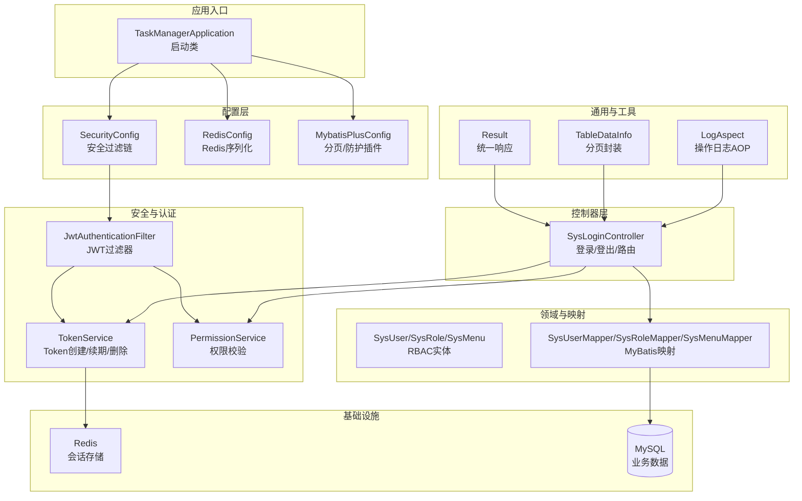
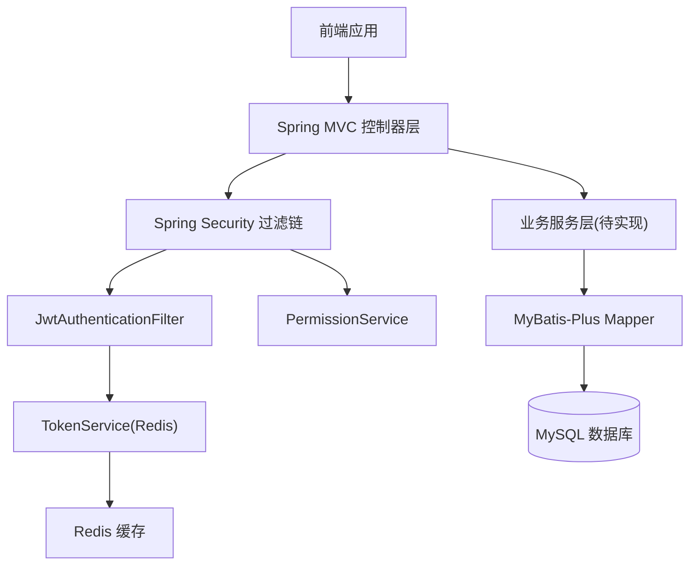
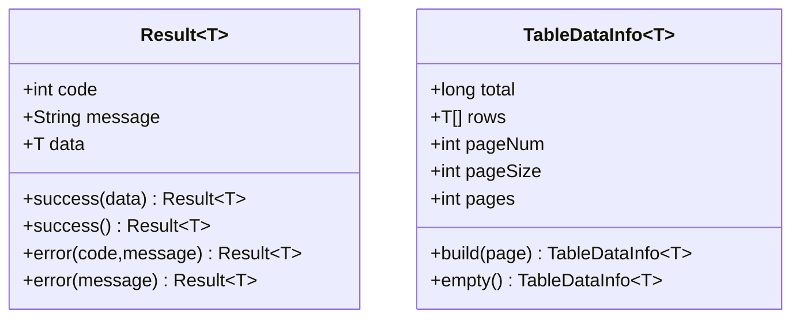
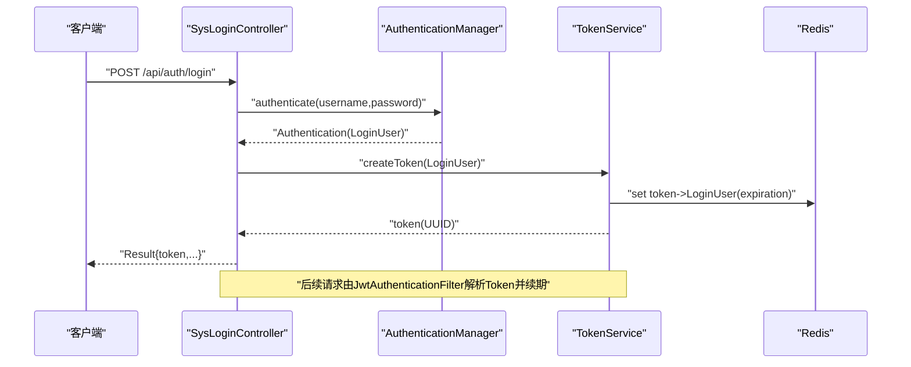
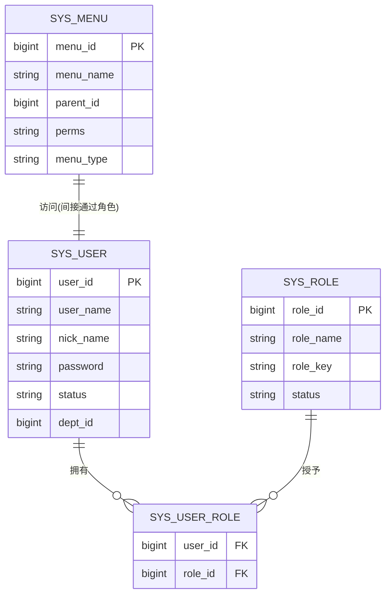
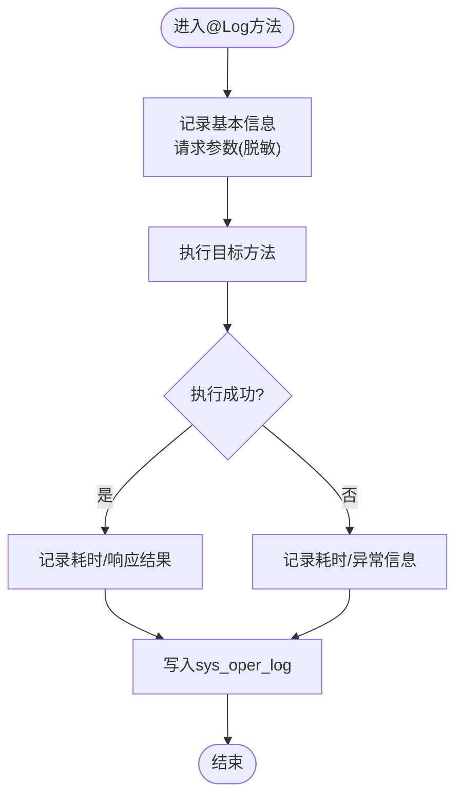
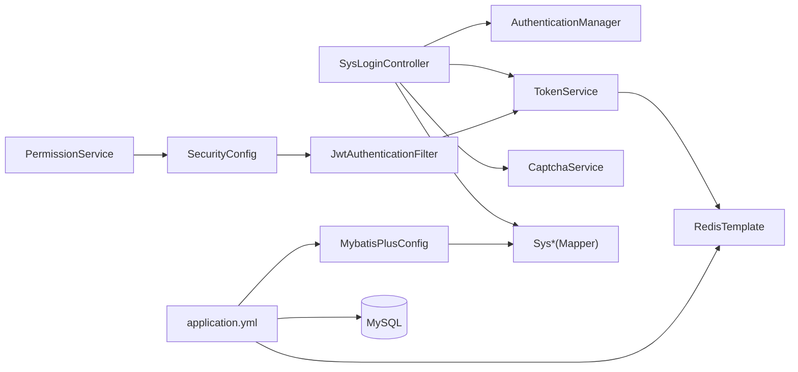

# 后端架构设计

<cite>
**本文引用的文件**
- [TaskManagerApplication.java](file://task-manager-backend/src/main/java/com/taskmanager/TaskManagerApplication.java)
- [SecurityConfig.java](file://task-manager-backend/src/main/java/com/taskmanager/config/SecurityConfig.java)
- [RedisConfig.java](file://task-manager-backend/src/main/java/com/taskmanager/config/RedisConfig.java)
- [MybatisPlusConfig.java](file://task-manager-backend/src/main/java/com/taskmanager/config/MybatisPlusConfig.java)
- [Result.java](file://task-manager-backend/src/main/java/com/taskmanager/common/Result.java)
- [TableDataInfo.java](file://task-manager-backend/src/main/java/com/taskmanager/common/utils/TableDataInfo.java)
- [JwtAuthenticationFilter.java](file://task-manager-backend/src/main/java/com/taskmanager/security/JwtAuthenticationFilter.java)
- [TokenService.java](file://task-manager-backend/src/main/java/com/taskmanager/security/TokenService.java)
- [PermissionService.java](file://task-manager-backend/src/main/java/com/taskmanager/security/PermissionService.java)
- [SysLoginController.java](file://task-manager-backend/src/main/java/com/taskmanager/controller/SysLoginController.java)
- [SysUser.java](file://task-manager-backend/src/main/java/com/taskmanager/domain/SysUser.java)
- [SysRole.java](file://task-manager-backend/src/main/java/com/taskmanager/domain/SysRole.java)
- [SysMenu.java](file://task-manager-backend/src/main/java/com/taskmanager/domain/SysMenu.java)
- [LogAspect.java](file://task-manager-backend/src/main/java/com/taskmanager/aspect/LogAspect.java)
- [application.yml](file://task-manager-backend/src/main/resources/application.yml)
</cite>

## 目录
1. [引言](#引言)
2. [项目结构](#项目结构)
3. [核心组件](#核心组件)
4. [架构总览](#架构总览)
5. [详细组件分析](#详细组件分析)
6. [依赖分析](#依赖分析)
7. [性能考虑](#性能考虑)
8. [故障排查指南](#故障排查指南)
9. [结论](#结论)
10. [附录](#附录)

## 引言
本文件面向CodeBuddy任务管理系统后端，系统采用Spring Boot + Spring Security + MyBatis-Plus + Redis的技术栈，围绕“控制器-服务-持久层”三层架构组织代码；以RBAC权限模型为核心，结合JWT无状态认证与Redis会话存储；通过统一响应格式Result与分页封装TableDataInfo提升接口一致性；借助AOP切面实现日志与权限横切能力；并通过多配置类完成安全、缓存、ORM与文档的集中治理。

## 项目结构
后端模块位于task-manager-backend，采用按层次与功能域混合的组织方式：
- config：安全、缓存、MyBatis-Plus配置
- controller：REST接口层，负责请求接入与参数校验
- service：业务服务层（本仓库未直接展示service实现，但通过控制器与mapper交互体现职责）
- mapper：MyBatis映射层，对应数据库表
- domain/entity：实体模型
- security：认证与授权相关组件（JWT、权限校验）
- common：通用工具与统一响应
- aspect：AOP切面（日志）
- resources：配置文件、SQL脚本、XML映射

图表来源
- [TaskManagerApplication.java:1-18](file://task-manager-backend/src/main/java/com/taskmanager/TaskManagerApplication.java#L1-L18)
- [SecurityConfig.java:1-116](file://task-manager-backend/src/main/java/com/taskmanager/config/SecurityConfig.java#L1-L116)
- [RedisConfig.java:1-33](file://task-manager-backend/src/main/java/com/taskmanager/config/RedisConfig.java#L1-L33)
- [MybatisPlusConfig.java:1-32](file://task-manager-backend/src/main/java/com/taskmanager/config/MybatisPlusConfig.java#L1-L32)
- [SysLoginController.java:1-327](file://task-manager-backend/src/main/java/com/taskmanager/controller/SysLoginController.java#L1-L327)
- [JwtAuthenticationFilter.java:1-70](file://task-manager-backend/src/main/java/com/taskmanager/security/JwtAuthenticationFilter.java#L1-L70)
- [TokenService.java:1-89](file://task-manager-backend/src/main/java/com/taskmanager/security/TokenService.java#L1-L89)
- [PermissionService.java:1-64](file://task-manager-backend/src/main/java/com/taskmanager/security/PermissionService.java#L1-L64)
- [Result.java:1-76](file://task-manager-backend/src/main/java/com/taskmanager/common/Result.java#L1-L76)
- [TableDataInfo.java:1-60](file://task-manager-backend/src/main/java/com/taskmanager/common/utils/TableDataInfo.java#L1-L60)
- [LogAspect.java:1-137](file://task-manager-backend/src/main/java/com/taskmanager/aspect/LogAspect.java#L1-L137)
- [SysUser.java:1-80](file://task-manager-backend/src/main/java/com/taskmanager/domain/SysUser.java#L1-L80)
- [SysRole.java:1-65](file://task-manager-backend/src/main/java/com/taskmanager/domain/SysRole.java#L1-L65)
- [SysMenu.java:1-92](file://task-manager-backend/src/main/java/com/taskmanager/domain/SysMenu.java#L1-L92)

章节来源
- [TaskManagerApplication.java:1-18](file://task-manager-backend/src/main/java/com/taskmanager/TaskManagerApplication.java#L1-L18)
- [application.yml:1-79](file://task-manager-backend/src/main/resources/application.yml#L1-L79)

## 核心组件
- 统一响应Result：提供success/error静态工厂方法，规范所有接口返回体结构，便于前端统一处理。
- 分页封装TableDataInfo：从MyBatis-Plus Page构建分页结果，包含总数、当前页数据、页码与总页数。
- 安全配置SecurityConfig：禁用CSRF、无状态会话、配置JWT过滤器链、放行公开接口、设置认证/鉴权异常处理器。
- JWT认证与会话：JwtAuthenticationFilter从请求头提取Token，TokenService基于Redis进行创建、续期、删除；登录成功后生成Token并写入Redis。
- RBAC权限：PermissionService提供hasPermi/lacksPermi校验，支持通配符权限；控制器中通过方法级安全注解配合使用。
- AOP日志：LogAspect环绕记录操作日志，包含请求参数（脱敏）、响应结果、耗时、异常等。
- ORM与分页：MybatisPlusConfig注入分页插件与全表更新/删除防护；application.yml开启驼峰映射与逻辑删除字段。

章节来源
- [Result.java:1-76](file://task-manager-backend/src/main/java/com/taskmanager/common/Result.java#L1-L76)
- [TableDataInfo.java:1-60](file://task-manager-backend/src/main/java/com/taskmanager/common/utils/TableDataInfo.java#L1-L60)
- [SecurityConfig.java:1-116](file://task-manager-backend/src/main/java/com/taskmanager/config/SecurityConfig.java#L1-L116)
- [JwtAuthenticationFilter.java:1-70](file://task-manager-backend/src/main/java/com/taskmanager/security/JwtAuthenticationFilter.java#L1-L70)
- [TokenService.java:1-89](file://task-manager-backend/src/main/java/com/taskmanager/security/TokenService.java#L1-L89)
- [PermissionService.java:1-64](file://task-manager-backend/src/main/java/com/taskmanager/security/PermissionService.java#L1-L64)
- [LogAspect.java:1-137](file://task-manager-backend/src/main/java/com/taskmanager/aspect/LogAspect.java#L1-L137)
- [MybatisPlusConfig.java:1-32](file://task-manager-backend/src/main/java/com/taskmanager/config/MybatisPlusConfig.java#L1-L32)
- [application.yml:1-79](file://task-manager-backend/src/main/resources/application.yml#L1-L79)

## 架构总览
系统采用前后端分离，后端以Spring MVC作为HTTP入口，Spring Security负责认证与授权，JWT作为无状态凭证，Redis存储会话，MyBatis-Plus提供ORM与分页能力。控制器层负责参数接收与返回值包装，服务层承载业务逻辑（本仓库未直接展示service实现），Mapper层负责数据持久化。

图表来源
- [SysLoginController.java:1-327](file://task-manager-backend/src/main/java/com/taskmanager/controller/SysLoginController.java#L1-L327)
- [SecurityConfig.java:1-116](file://task-manager-backend/src/main/java/com/taskmanager/config/SecurityConfig.java#L1-L116)
- [JwtAuthenticationFilter.java:1-70](file://task-manager-backend/src/main/java/com/taskmanager/security/JwtAuthenticationFilter.java#L1-L70)
- [TokenService.java:1-89](file://task-manager-backend/src/main/java/com/taskmanager/security/TokenService.java#L1-L89)
- [MybatisPlusConfig.java:1-32](file://task-manager-backend/src/main/java/com/taskmanager/config/MybatisPlusConfig.java#L1-L32)

## 详细组件分析

### 统一响应与分页封装
- 统一响应Result：提供成功/错误两类静态工厂方法，约定code/message/data三段式结构，便于前端统一拦截与提示。
- 分页封装TableDataInfo：从MP Page构建，包含total/rows/pageNum/pageSize/pages，简化前端分页渲染。

图表来源
- [Result.java:1-76](file://task-manager-backend/src/main/java/com/taskmanager/common/Result.java#L1-L76)
- [TableDataInfo.java:1-60](file://task-manager-backend/src/main/java/com/taskmanager/common/utils/TableDataInfo.java#L1-L60)

章节来源
- [Result.java:1-76](file://task-manager-backend/src/main/java/com/taskmanager/common/Result.java#L1-L76)
- [TableDataInfo.java:1-60](file://task-manager-backend/src/main/java/com/taskmanager/common/utils/TableDataInfo.java#L1-L60)

### JWT认证与会话管理
- 认证流程：控制器接收用户名/密码，交由AuthenticationManager完成认证；认证成功后由TokenService生成UUID格式Token并写入Redis，设置过期时间；随后返回给前端。
- 过滤链：JwtAuthenticationFilter在每个请求进入时从请求头提取Token，从Redis读取LoginUser，构建认证上下文，自动续期。
- 登出：删除Redis中的Token键，清空Security上下文。

图表来源
- [SysLoginController.java:103-135](file://task-manager-backend/src/main/java/com/taskmanager/controller/SysLoginController.java#L103-L135)
- [JwtAuthenticationFilter.java:37-57](file://task-manager-backend/src/main/java/com/taskmanager/security/JwtAuthenticationFilter.java#L37-L57)
- [TokenService.java:34-41](file://task-manager-backend/src/main/java/com/taskmanager/security/TokenService.java#L34-L41)

章节来源
- [SysLoginController.java:103-135](file://task-manager-backend/src/main/java/com/taskmanager/controller/SysLoginController.java#L103-L135)
- [JwtAuthenticationFilter.java:37-57](file://task-manager-backend/src/main/java/com/taskmanager/security/JwtAuthenticationFilter.java#L37-L57)
- [TokenService.java:34-41](file://task-manager-backend/src/main/java/com/taskmanager/security/TokenService.java#L34-L41)

### RBAC权限模型与权限校验
- 实体关系：SysUser与SysRole通过SysUserRole关联；SysMenu携带perms字段与children树形结构；用户登录后加载角色与权限集合。
- 方法级权限：通过@EnableMethodSecurity启用@PreAuthorize，结合自定义PermissionService的hasPermi/lacksPermi实现细粒度校验。
- 登录后端点：获取当前用户信息与动态路由，其中路由根据角色决定是否返回全部菜单树。

图表来源
- [SysUser.java:1-80](file://task-manager-backend/src/main/java/com/taskmanager/domain/SysUser.java#L1-L80)
- [SysRole.java:1-65](file://task-manager-backend/src/main/java/com/taskmanager/domain/SysRole.java#L1-L65)
- [SysMenu.java:1-92](file://task-manager-backend/src/main/java/com/taskmanager/domain/SysMenu.java#L1-L92)

章节来源
- [SysLoginController.java:153-197](file://task-manager-backend/src/main/java/com/taskmanager/controller/SysLoginController.java#L153-L197)
- [PermissionService.java:25-38](file://task-manager-backend/src/main/java/com/taskmanager/security/PermissionService.java#L25-L38)

### AOP日志切面
- 切入点：对标注@Log注解的方法进行环绕通知。
- 功能：记录模块、业务类型、请求URL/IP/方法、操作人、请求参数（脱敏）、响应结果、耗时、异常信息；最终异步落库。
- 异常处理：捕获异常并标记状态，保证日志写入的健壮性。

图表来源
- [LogAspect.java:44-97](file://task-manager-backend/src/main/java/com/taskmanager/aspect/LogAspect.java#L44-L97)

章节来源
- [LogAspect.java:1-137](file://task-manager-backend/src/main/java/com/taskmanager/aspect/LogAspect.java#L1-L137)

### 配置类设计思路
- SecurityConfig：无状态会话、放行公开接口、统一认证/鉴权异常输出、在UsernamePasswordAuthenticationFilter之前加入JWT过滤器。
- RedisConfig：Key/HashKey使用String序列化，Value使用JSON序列化，避免乱码并支持复杂对象。
- MybatisPlusConfig：注入分页插件与全表更新/删除防护插件，保障分页与安全。
- application.yml：数据源、Redis、MyBatis-Plus、Jackson、JWT、Knife4j文档与端口配置。

章节来源
- [SecurityConfig.java:1-116](file://task-manager-backend/src/main/java/com/taskmanager/config/SecurityConfig.java#L1-L116)
- [RedisConfig.java:1-33](file://task-manager-backend/src/main/java/com/taskmanager/config/RedisConfig.java#L1-L33)
- [MybatisPlusConfig.java:1-32](file://task-manager-backend/src/main/java/com/taskmanager/config/MybatisPlusConfig.java#L1-L32)
- [application.yml:1-79](file://task-manager-backend/src/main/resources/application.yml#L1-L79)

## 依赖分析
- 控制器依赖：SysLoginController依赖AuthenticationManager、TokenService、CaptchaService、各Mapper与PasswordEncoder。
- 安全组件依赖：JwtAuthenticationFilter依赖TokenService；TokenService依赖RedisTemplate；PermissionService依赖Security上下文。
- ORM依赖：Mapper依赖MyBatis-Plus分页插件；application.yml开启驼峰映射与逻辑删除字段。
- 配置依赖：SecurityConfig依赖JwtAuthenticationFilter与ObjectMapper；RedisConfig依赖RedisConnectionFactory；MybatisPlusConfig依赖MyBatis-Plus拦截器。

图表来源
- [SysLoginController.java:1-327](file://task-manager-backend/src/main/java/com/taskmanager/controller/SysLoginController.java#L1-L327)
- [SecurityConfig.java:1-116](file://task-manager-backend/src/main/java/com/taskmanager/config/SecurityConfig.java#L1-L116)
- [JwtAuthenticationFilter.java:1-70](file://task-manager-backend/src/main/java/com/taskmanager/security/JwtAuthenticationFilter.java#L1-L70)
- [TokenService.java:1-89](file://task-manager-backend/src/main/java/com/taskmanager/security/TokenService.java#L1-L89)
- [MybatisPlusConfig.java:1-32](file://task-manager-backend/src/main/java/com/taskmanager/config/MybatisPlusConfig.java#L1-L32)
- [application.yml:1-79](file://task-manager-backend/src/main/resources/application.yml#L1-L79)

章节来源
- [SysLoginController.java:1-327](file://task-manager-backend/src/main/java/com/taskmanager/controller/SysLoginController.java#L1-L327)
- [SecurityConfig.java:1-116](file://task-manager-backend/src/main/java/com/taskmanager/config/SecurityConfig.java#L1-L116)
- [JwtAuthenticationFilter.java:1-70](file://task-manager-backend/src/main/java/com/taskmanager/security/JwtAuthenticationFilter.java#L1-L70)
- [TokenService.java:1-89](file://task-manager-backend/src/main/java/com/taskmanager/security/TokenService.java#L1-L89)
- [MybatisPlusConfig.java:1-32](file://task-manager-backend/src/main/java/com/taskmanager/config/MybatisPlusConfig.java#L1-L32)
- [application.yml:1-79](file://task-manager-backend/src/main/resources/application.yml#L1-L79)

## 性能考虑
- 无状态认证：JWT减少服务器会话存储压力，结合Redis仅存储必要会话信息，降低内存占用。
- 自动续期：每次有效请求对Redis中的Token键进行过期时间刷新，避免频繁重建会话。
- 分页与防护：MyBatis-Plus分页插件避免一次性加载大量数据；全表更新/删除防护降低误操作风险。
- 连接池与序列化：HikariCP连接池参数合理设置；Redis使用JSON序列化支持复杂对象，兼顾可读性与性能。
- 日志异步：AOP日志写库在finally块中执行，避免阻塞主业务流程。

## 故障排查指南
- 401未认证：检查请求头Authorization是否符合配置的header/prefix，确认Token是否存在于Redis且未过期。
- 403权限不足：确认用户角色与权限集合是否正确加载，方法级权限注解是否生效。
- 登录失败：核对用户名/密码与验证码（生产环境必须启用），查看CaptchaService校验逻辑。
- 日志未记录：检查@Log注解是否正确标注，LogAspect是否生效，sys_oper_log写入是否抛出异常。
- 分页异常：确认请求参数pageNum/pageSize是否合规，Mapper是否使用了MyBatis-Plus分页插件。

章节来源
- [SecurityConfig.java:59-74](file://task-manager-backend/src/main/java/com/taskmanager/config/SecurityConfig.java#L59-L74)
- [JwtAuthenticationFilter.java:62-68](file://task-manager-backend/src/main/java/com/taskmanager/security/JwtAuthenticationFilter.java#L62-L68)
- [TokenService.java:49-62](file://task-manager-backend/src/main/java/com/taskmanager/security/TokenService.java#L49-L62)
- [LogAspect.java:88-96](file://task-manager-backend/src/main/java/com/taskmanager/aspect/LogAspect.java#L88-L96)

## 结论
该后端架构以清晰的三层结构为基础，结合RBAC权限模型与JWT无状态认证，辅以Redis会话存储与MyBatis-Plus分页防护，形成高内聚低耦合的系统设计。统一响应与AOP日志进一步提升了接口一致性和可观测性。通过合理的配置与扩展点，系统具备良好的性能表现与可维护性。

## 附录
- 关键配置项参考
  - JWT：secret、expiration、header、prefix
  - Redis：host/port/password/database/timeout
  - MyBatis-Plus：驼峰映射、mapper位置、逻辑删除字段
  - Knife4j：Swagger UI与API文档路径

章节来源
- [application.yml:51-79](file://task-manager-backend/src/main/resources/application.yml#L51-L79)