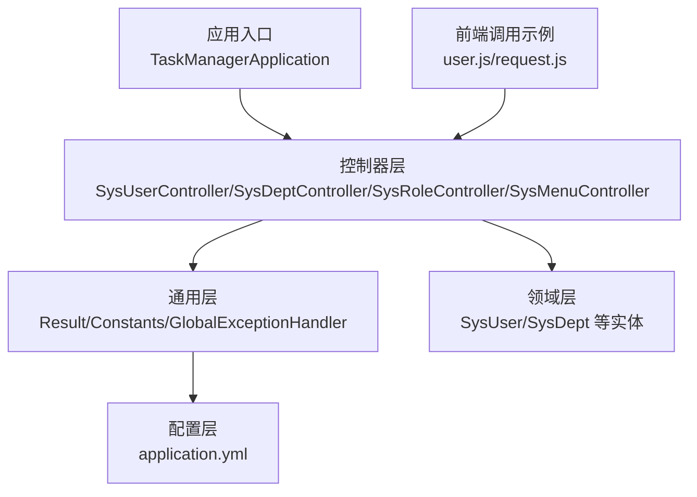
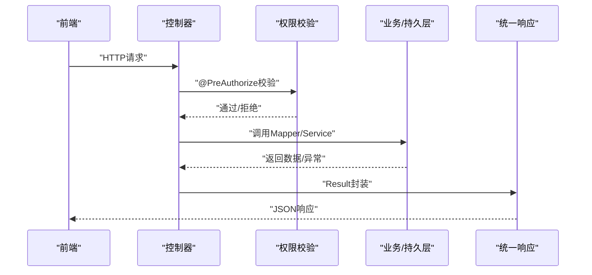
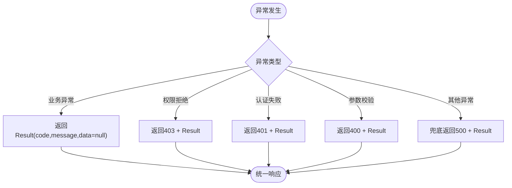
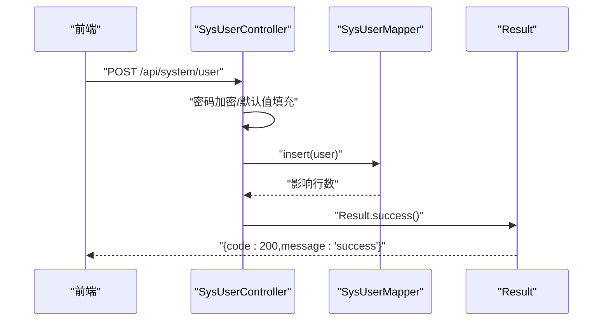
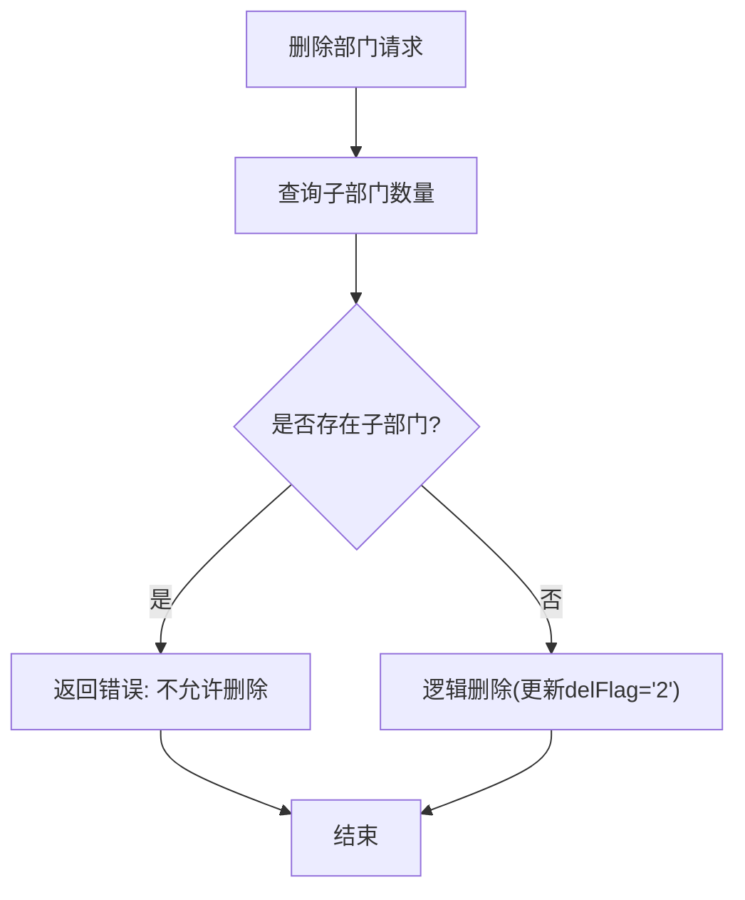
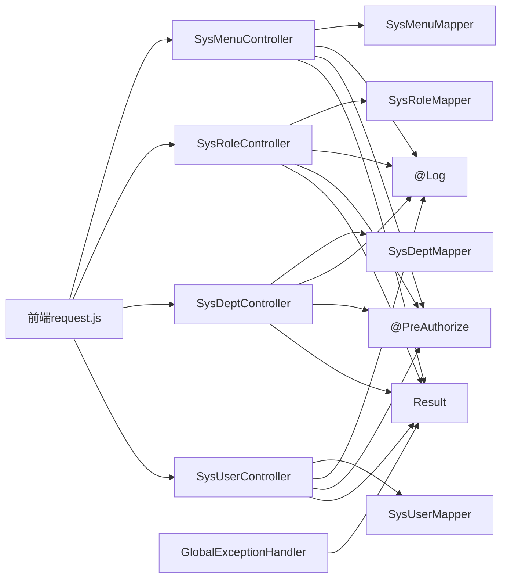
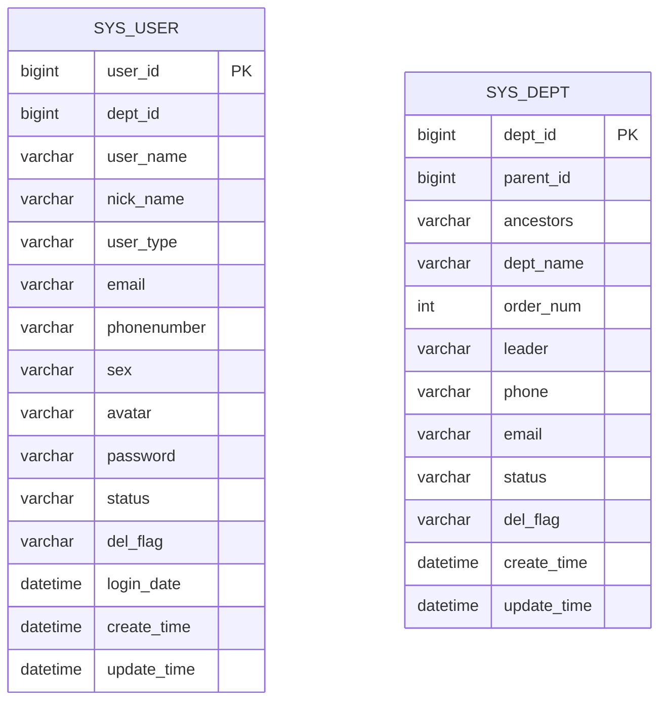

# RESTful API设计规范

<cite>
**本文引用的文件**
- [TaskManagerApplication.java](file://task-manager-backend/src/main/java/com/taskmanager/TaskManagerApplication.java)
- [Result.java](file://task-manager-backend/src/main/java/com/taskmanager/common/Result.java)
- [SysUserController.java](file://task-manager-backend/src/main/java/com/taskmanager/controller/SysUserController.java)
- [SysDeptController.java](file://task-manager-backend/src/main/java/com/taskmanager/controller/SysDeptController.java)
- [SysRoleController.java](file://task-manager-backend/src/main/java/com/taskmanager/controller/SysRoleController.java)
- [SysMenuController.java](file://task-manager-backend/src/main/java/com/taskmanager/controller/SysMenuController.java)
- [GlobalExceptionHandler.java](file://task-manager-backend/src/main/java/com/taskmanager/common/exception/GlobalExceptionHandler.java)
- [Constants.java](file://task-manager-backend/src/main/java/com/taskmanager/common/constant/Constants.java)
- [application.yml](file://task-manager-backend/src/main/resources/application.yml)
- [user.js](file://task-manager-frontend/src/api/system/user.js)
- [request.js](file://task-manager-frontend/src/api/request.js)
- [SysUser.java](file://task-manager-backend/src/main/java/com/taskmanager/domain/SysUser.java)
- [SysDept.java](file://task-manager-backend/src/main/java/com/taskmanager/domain/SysDept.java)
</cite>

## 目录
1. [引言](#引言)
2. [项目结构](#项目结构)
3. [核心组件](#核心组件)
4. [架构总览](#架构总览)
5. [详细组件分析](#详细组件分析)
6. [依赖分析](#依赖分析)
7. [性能考虑](#性能考虑)
8. [故障排查指南](#故障排查指南)
9. [结论](#结论)
10. [附录](#附录)

## 引言
本文件面向CodeBuddy任务管理系统的RESTful API设计，系统基于Spring Boot + MyBatis-Plus实现，采用统一响应格式与全局异常处理机制，提供标准的HTTP方法与资源路径设计规范，并结合前端调用示例说明请求参数、状态码与版本控制策略。本文旨在帮助开发者与测试人员快速理解并正确使用系统API。

## 项目结构
后端采用分层架构：
- 应用入口：启动类负责扫描Mapper包并启动应用
- 控制器层：以@RestController暴露REST接口，使用@RequestMapping进行路径前缀管理
- 通用层：Result统一响应封装、Constants全局常量、GlobalExceptionHandler全局异常处理
- 领域层：实体类映射数据库表结构
- 配置层：application.yml集中管理数据源、Redis、MyBatis-Plus、JWT、Knife4j等

图表来源
- [TaskManagerApplication.java:1-18](file://task-manager-backend/src/main/java/com/taskmanager/TaskManagerApplication.java#L1-L18)
- [SysUserController.java:1-132](file://task-manager-backend/src/main/java/com/taskmanager/controller/SysUserController.java#L1-L132)
- [SysDeptController.java:1-85](file://task-manager-backend/src/main/java/com/taskmanager/controller/SysDeptController.java#L1-L85)
- [SysRoleController.java:1-83](file://task-manager-backend/src/main/java/com/taskmanager/controller/SysRoleController.java#L1-L83)
- [SysMenuController.java:1-86](file://task-manager-backend/src/main/java/com/taskmanager/controller/SysMenuController.java#L1-L86)
- [Result.java:1-76](file://task-manager-backend/src/main/java/com/taskmanager/common/Result.java#L1-L76)
- [Constants.java:1-40](file://task-manager-backend/src/main/java/com/taskmanager/common/constant/Constants.java#L1-L40)
- [GlobalExceptionHandler.java:1-109](file://task-manager-backend/src/main/java/com/taskmanager/common/exception/GlobalExceptionHandler.java#L1-L109)
- [application.yml:1-79](file://task-manager-backend/src/main/resources/application.yml#L1-L79)
- [user.js:1-37](file://task-manager-frontend/src/api/system/user.js#L1-L37)
- [request.js:1-63](file://task-manager-frontend/src/api/request.js#L1-L63)

章节来源
- [TaskManagerApplication.java:1-18](file://task-manager-backend/src/main/java/com/taskmanager/TaskManagerApplication.java#L1-L18)
- [application.yml:1-79](file://task-manager-backend/src/main/resources/application.yml#L1-L79)

## 核心组件
- 统一响应格式Result：提供success/error静态方法，约定code/message/data三段式结构，便于前后端一致处理
- 全局异常处理GlobalExceptionHandler：集中捕获业务异常、权限异常、认证异常、参数校验异常等，返回标准Result格式
- 常量Constants：定义SUCCESS/FAIL/UNAUTHORIZED/FORBIDDEN等常用状态码，便于在代码中统一引用
- 控制器层：以/api/system/{resource}作为资源前缀，遵循REST风格的HTTP方法与路径映射

章节来源
- [Result.java:1-76](file://task-manager-backend/src/main/java/com/taskmanager/common/Result.java#L1-L76)
- [GlobalExceptionHandler.java:1-109](file://task-manager-backend/src/main/java/com/taskmanager/common/exception/GlobalExceptionHandler.java#L1-L109)
- [Constants.java:1-40](file://task-manager-backend/src/main/java/com/taskmanager/common/constant/Constants.java#L1-L40)

## 架构总览
系统通过控制器接收HTTP请求，经权限校验与参数处理后调用Mapper访问数据库，最终以Result封装返回。全局异常处理器确保异常被标准化输出。

图表来源
- [SysUserController.java:33-130](file://task-manager-backend/src/main/java/com/taskmanager/controller/SysUserController.java#L33-L130)
- [GlobalExceptionHandler.java:23-107](file://task-manager-backend/src/main/java/com/taskmanager/common/exception/GlobalExceptionHandler.java#L23-L107)
- [Result.java:39-74](file://task-manager-backend/src/main/java/com/taskmanager/common/Result.java#L39-L74)

## 详细组件分析

### 统一响应与异常处理
- 统一响应Result：提供成功与错误两类静态工厂方法，默认成功code为200，错误默认500；支持泛型承载任意数据类型
- 全局异常处理：覆盖业务异常、验证码异常、权限拒绝、认证失败、请求方式不支持、参数校验/绑定异常等，分别返回相应HTTP状态码与Result格式
- 前端拦截：前端对非200的业务码进行提示与登出处理，401时清理Token并跳转登录页

图表来源
- [GlobalExceptionHandler.java:27-107](file://task-manager-backend/src/main/java/com/taskmanager/common/exception/GlobalExceptionHandler.java#L27-L107)
- [Result.java:39-74](file://task-manager-backend/src/main/java/com/taskmanager/common/Result.java#L39-L74)

章节来源
- [GlobalExceptionHandler.java:1-109](file://task-manager-backend/src/main/java/com/taskmanager/common/exception/GlobalExceptionHandler.java#L1-L109)
- [Result.java:1-76](file://task-manager-backend/src/main/java/com/taskmanager/common/Result.java#L1-L76)
- [request.js:22-60](file://task-manager-frontend/src/api/request.js#L22-L60)

### 用户管理API设计
- 资源路径：/api/system/user
- 方法与操作：
  - GET /list：分页+条件查询用户列表
  - GET /{userId}：按ID查询用户详情
  - POST：新增用户（密码加密、默认状态与删除标志处理）
  - PUT：修改用户（密码为空则保留旧值，否则重新加密）
  - DELETE /{userIds}：批量逻辑删除（更新delFlag）
  - PUT /resetPwd：重置密码（默认密码加密存储）
  - PUT /changeStatus：修改用户状态
- 权限注解：@PreAuthorize配合权限表达式，确保操作鉴权
- 日志注解：@Log记录业务类型（新增/修改/删除）

图表来源
- [SysUserController.java:59-70](file://task-manager-backend/src/main/java/com/taskmanager/controller/SysUserController.java#L59-L70)
- [SysUserController.java:77-89](file://task-manager-backend/src/main/java/com/taskmanager/controller/SysUserController.java#L77-L89)
- [SysUserController.java:96-106](file://task-manager-backend/src/main/java/com/taskmanager/controller/SysUserController.java#L96-L106)
- [SysUserController.java:113-120](file://task-manager-backend/src/main/java/com/taskmanager/controller/SysUserController.java#L113-L120)
- [SysUserController.java:126-130](file://task-manager-backend/src/main/java/com/taskmanager/controller/SysUserController.java#L126-L130)

章节来源
- [SysUserController.java:1-132](file://task-manager-backend/src/main/java/com/taskmanager/controller/SysUserController.java#L1-L132)
- [user.js:3-36](file://task-manager-frontend/src/api/system/user.js#L3-L36)

### 部门管理API设计
- 资源路径：/api/system/dept
- 方法与操作：
  - GET /list：获取树形部门列表
  - GET /{deptId}：按ID查询部门详情
  - POST：新增部门（父节点祖先链拼接、默认状态与删除标志处理）
  - PUT：修改部门
  - DELETE /{deptId}：删除部门（若存在下级则拒绝删除）
- 业务约束：删除前检查子部门数量，避免破坏树形结构

图表来源
- [SysDeptController.java:74-82](file://task-manager-backend/src/main/java/com/taskmanager/controller/SysDeptController.java#L74-L82)

章节来源
- [SysDeptController.java:1-85](file://task-manager-backend/src/main/java/com/taskmanager/controller/SysDeptController.java#L1-L85)

### 角色管理API设计
- 资源路径：/api/system/role
- 方法与操作：
  - GET /list：分页+条件查询角色列表
  - GET /{roleId}：按ID查询角色详情
  - POST：新增角色（默认数据范围与删除标志处理）
  - PUT：修改角色
  - DELETE /{roleIds}：批量逻辑删除（更新delFlag）

章节来源
- [SysRoleController.java:1-83](file://task-manager-backend/src/main/java/com/taskmanager/controller/SysRoleController.java#L1-L83)

### 菜单管理API设计
- 资源路径：/api/system/menu
- 方法与操作：
  - GET /list：获取平铺菜单列表
  - GET /treeSelect：获取菜单树（用于权限分配）
  - GET /{menuId}：按ID查询菜单详情
  - POST：新增菜单（默认可见与状态处理）
  - PUT：修改菜单
  - DELETE /{menuId}：删除菜单（若存在子菜单则拒绝删除）
- 特殊说明：sys_menu表未设置delFlag字段，删除为物理删除

章节来源
- [SysMenuController.java:1-86](file://task-manager-backend/src/main/java/com/taskmanager/controller/SysMenuController.java#L1-L86)

### URL路径设计最佳实践
- 资源命名：使用名词复数形式，如/user、/dept、/role、/menu
- 层级结构：以/api/system作为系统模块前缀，再细分具体资源
- 参数传递：
  - 路径参数：使用/{id}传递单个资源标识
  - 查询参数：使用?key=value形式传递过滤/分页参数
  - 请求体：使用JSON对象传递新增/修改的资源数据
- 动作后缀：当资源操作无法仅用HTTP方法表达时，可使用动作后缀（如/resetPwd、/changeStatus），但应尽量保持与REST语义一致

章节来源
- [SysUserController.java:21](file://task-manager-backend/src/main/java/com/taskmanager/controller/SysUserController.java#L21)
- [SysDeptController.java:20](file://task-manager-backend/src/main/java/com/taskmanager/controller/SysDeptController.java#L20)
- [SysRoleController.java:20](file://task-manager-backend/src/main/java/com/taskmanager/controller/SysRoleController.java#L20)
- [SysMenuController.java:20](file://task-manager-backend/src/main/java/com/taskmanager/controller/SysMenuController.java#L20)
- [user.js:4-26](file://task-manager-frontend/src/api/system/user.js#L4-L26)

### HTTP方法与状态码使用规范
- GET：查询资源列表或详情，幂等
- POST：创建新资源
- PUT：更新资源（通常幂等，需保证重复调用结果一致）
- DELETE：删除资源（幂等，多次删除效果一致）
- 状态码：
  - 2xx 成功：200表示操作成功，201用于创建成功（当前实现多为200）
  - 4xx 客户端错误：400参数校验失败，401未认证，403无权限，405请求方法不支持
  - 5xx 服务器错误：500系统异常，503服务不可用（当前实现统一返回500描述）
- 前端处理：非200业务码统一提示；401时清理Token并跳转登录页

章节来源
- [GlobalExceptionHandler.java:49-65](file://task-manager-backend/src/main/java/com/taskmanager/common/exception/GlobalExceptionHandler.java#L49-L65)
- [GlobalExceptionHandler.java:70-98](file://task-manager-backend/src/main/java/com/taskmanager/common/exception/GlobalExceptionHandler.java#L70-L98)
- [request.js:39-59](file://task-manager-frontend/src/api/request.js#L39-L59)

### 控制器@RequestMapping注解与权限控制
- 路径映射：@RequestMapping定义资源前缀，各方法使用@GetMapping/@PostMapping/@PutMapping/@DeleteMapping定义具体操作
- 权限控制：@PreAuthorize结合权限表达式，确保用户具备相应操作权限
- 日志记录：@Log记录业务类型（新增/修改/删除），便于审计

章节来源
- [SysUserController.java:20-21](file://task-manager-backend/src/main/java/com/taskmanager/controller/SysUserController.java#L20-L21)
- [SysUserController.java:33-130](file://task-manager-backend/src/main/java/com/taskmanager/controller/SysUserController.java#L33-L130)
- [SysDeptController.java:19-20](file://task-manager-backend/src/main/java/com/taskmanager/controller/SysDeptController.java#L19-L20)
- [SysRoleController.java:19-20](file://task-manager-backend/src/main/java/com/taskmanager/controller/SysRoleController.java#L19-L20)
- [SysMenuController.java:19-20](file://task-manager-backend/src/main/java/com/taskmanager/controller/SysMenuController.java#L19-L20)

### API版本控制与向后兼容
- 当前实现：未显式引入版本号前缀（如/v1），所有接口位于根路径下
- 建议策略：
  - 路径版本：/api/v1/system/user
  - 头部版本：X-API-Version: 1
  - 向后兼容：新增字段采用默认值；删除字段保留但标注废弃；变更字段保持语义一致
- 当前Knife4j配置已启用，可通过Swagger UI查看接口文档

章节来源
- [application.yml:75-79](file://task-manager-backend/src/main/resources/application.yml#L75-L79)

### 请求参数验证与响应格式标准化
- 参数验证：
  - @Valid + @RequestBody：触发方法参数校验异常，统一由全局异常处理器捕获
  - @RequestParam：参数绑定异常统一处理
- 响应格式：
  - 统一使用Result包装，包含code/message/data
  - 成功：code=200，message="success"，data为具体数据
  - 失败：code为具体错误码，message为错误描述
- 时间格式：Jackson配置了日期格式与时区，确保前后端时间一致性

章节来源
- [GlobalExceptionHandler.java:78-98](file://task-manager-backend/src/main/java/com/taskmanager/common/exception/GlobalExceptionHandler.java#L78-L98)
- [Result.java:39-74](file://task-manager-backend/src/main/java/com/taskmanager/common/Result.java#L39-L74)
- [application.yml:46-49](file://task-manager-backend/src/main/resources/application.yml#L46-L49)

## 依赖分析
- 控制器依赖通用层Result与权限校验注解，部分控制器依赖日志注解与业务枚举
- Mapper层依赖MyBatis-Plus配置与逻辑删除字段
- 前端通过axios封装请求，统一注入Token并在拦截器中处理响应

图表来源
- [SysUserController.java:10-28](file://task-manager-backend/src/main/java/com/taskmanager/controller/SysUserController.java#L10-L28)
- [SysDeptController.java:7-24](file://task-manager-backend/src/main/java/com/taskmanager/controller/SysDeptController.java#L7-L24)
- [SysRoleController.java:8-24](file://task-manager-backend/src/main/java/com/taskmanager/controller/SysRoleController.java#L8-L24)
- [SysMenuController.java:7-24](file://task-manager-backend/src/main/java/com/taskmanager/controller/SysMenuController.java#L7-L24)
- [GlobalExceptionHandler.java:24-25](file://task-manager-backend/src/main/java/com/taskmanager/common/exception/GlobalExceptionHandler.java#L24-L25)
- [request.js:1-63](file://task-manager-frontend/src/api/request.js#L1-L63)

章节来源
- [SysUserController.java:1-132](file://task-manager-backend/src/main/java/com/taskmanager/controller/SysUserController.java#L1-L132)
- [SysDeptController.java:1-85](file://task-manager-backend/src/main/java/com/taskmanager/controller/SysDeptController.java#L1-L85)
- [SysRoleController.java:1-83](file://task-manager-backend/src/main/java/com/taskmanager/controller/SysRoleController.java#L1-L83)
- [SysMenuController.java:1-86](file://task-manager-backend/src/main/java/com/taskmanager/controller/SysMenuController.java#L1-L86)
- [GlobalExceptionHandler.java:1-109](file://task-manager-backend/src/main/java/com/taskmanager/common/exception/GlobalExceptionHandler.java#L1-L109)
- [request.js:1-63](file://task-manager-frontend/src/api/request.js#L1-L63)

## 性能考虑
- 分页查询：控制器使用Page分页，建议前端传入合理的pageSize，避免超大页导致数据库压力
- 缓存策略：当前未见显式缓存实现，可在高频查询接口上引入Redis缓存
- 连接池：HikariCP连接池参数已配置，可根据并发调整最大连接数
- 日志与监控：全局异常处理器记录错误日志，建议结合日志聚合与告警

## 故障排查指南
- 401未认证：检查前端是否正确注入Token；确认JWT配置与过期时间
- 403无权限：检查用户权限表达式与角色授权；确认@PreAuthorize注解生效
- 400参数错误：检查请求体JSON格式与必填字段；关注全局异常中的默认提示
- 500系统异常：查看后端日志定位具体异常；确认全局异常兜底逻辑
- 删除失败：对于存在子资源的删除操作，需先清理子资源或调整业务逻辑

章节来源
- [GlobalExceptionHandler.java:49-65](file://task-manager-backend/src/main/java/com/taskmanager/common/exception/GlobalExceptionHandler.java#L49-L65)
- [GlobalExceptionHandler.java:70-98](file://task-manager-backend/src/main/java/com/taskmanager/common/exception/GlobalExceptionHandler.java#L70-L98)
- [request.js:42-59](file://task-manager-frontend/src/api/request.js#L42-L59)

## 结论
本系统遵循RESTful设计原则，采用统一响应与全局异常处理机制，实现了清晰的资源路径与标准的状态码规范。通过权限注解与日志注解保障了安全性与可追溯性。建议后续引入API版本控制与缓存优化，进一步提升系统的可维护性与性能表现。

## 附录
- 数据模型概览（用户与部门）

图表来源
- [SysUser.java:22-79](file://task-manager-backend/src/main/java/com/taskmanager/domain/SysUser.java#L22-L79)
- [SysDept.java:26-71](file://task-manager-backend/src/main/java/com/taskmanager/domain/SysDept.java#L26-L71)