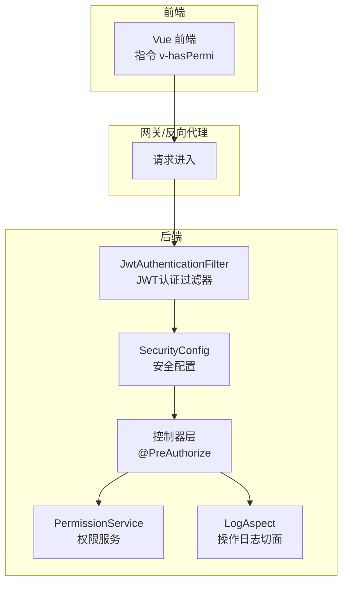
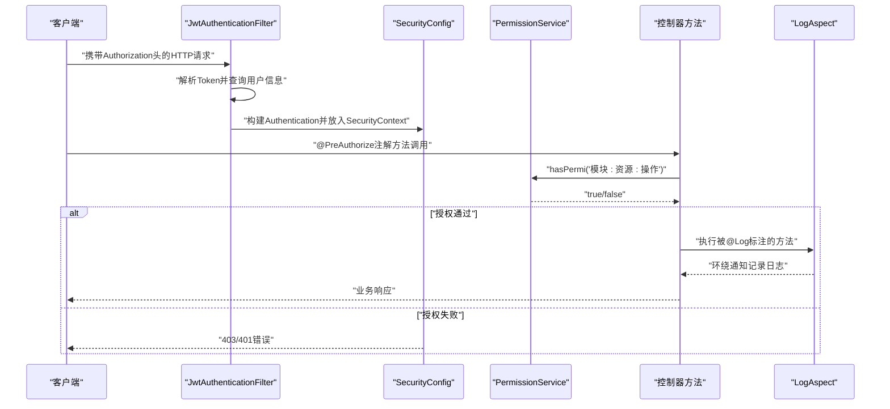
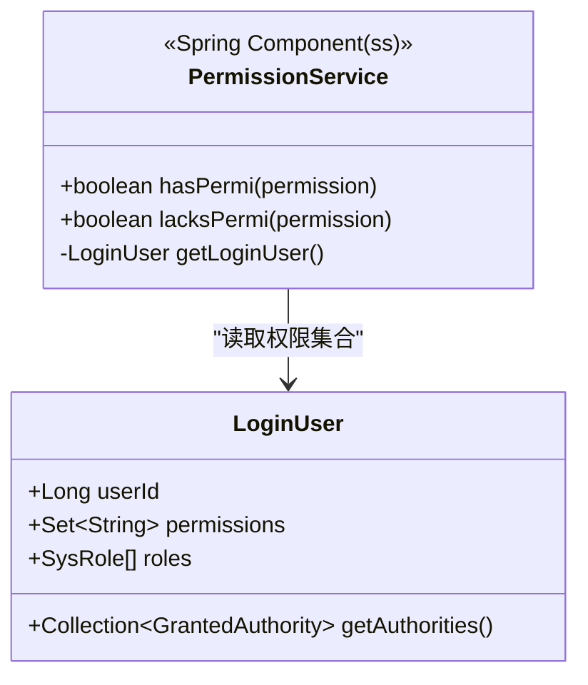
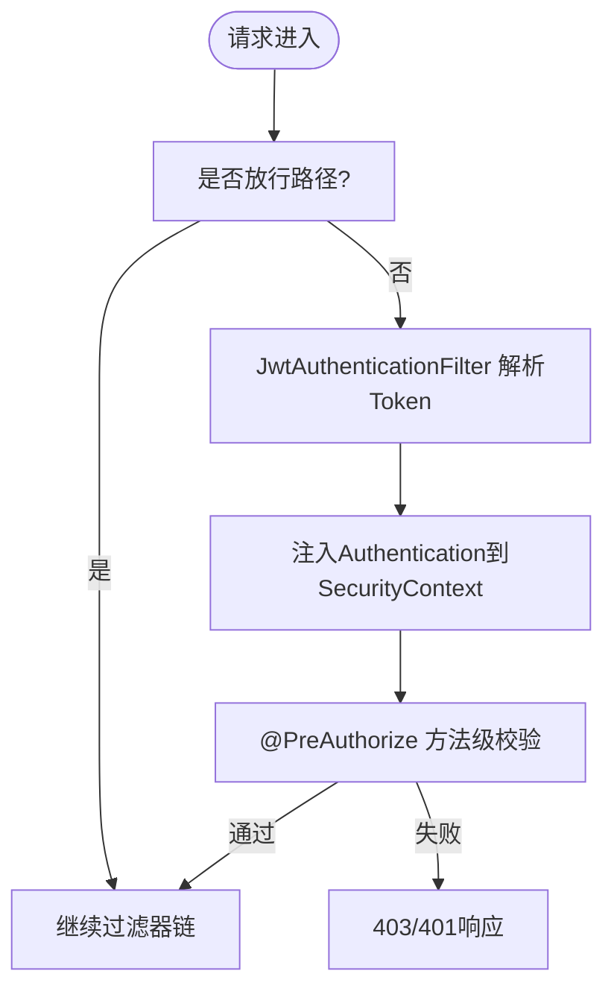
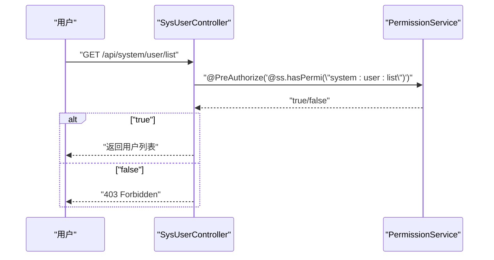
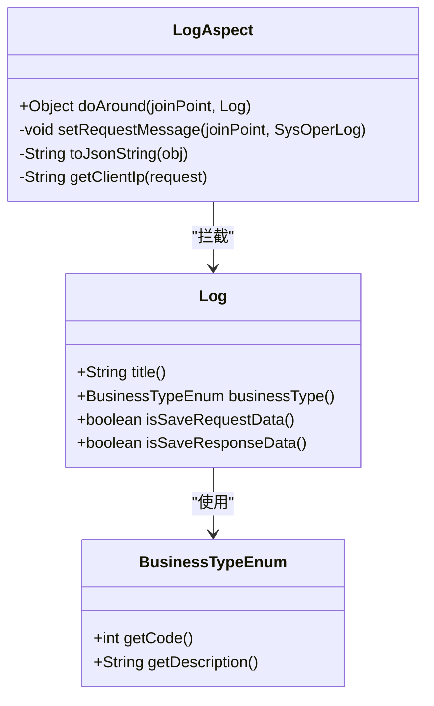
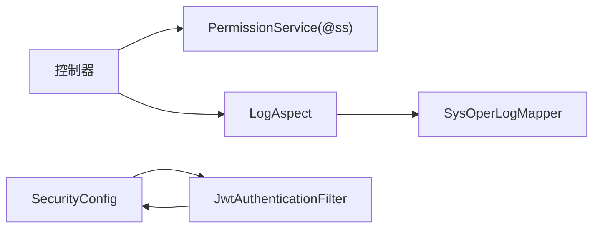

# 安全授权控制

<cite>
**本文引用的文件**
- [PermissionService.java](file://task-manager-backend/src/main/java/com/taskmanager/security/PermissionService.java)
- [SecurityConfig.java](file://task-manager-backend/src/main/java/com/taskmanager/config/SecurityConfig.java)
- [JwtAuthenticationFilter.java](file://task-manager-backend/src/main/java/com/taskmanager/security/JwtAuthenticationFilter.java)
- [LoginUser.java](file://task-manager-backend/src/main/java/com/taskmanager/security/LoginUser.java)
- [SysUserController.java](file://task-manager-backend/src/main/java/com/taskmanager/controller/SysUserController.java)
- [SysRoleController.java](file://task-manager-backend/src/main/java/com/taskmanager/controller/SysRoleController.java)
- [SysMenuController.java](file://task-manager-backend/src/main/java/com/taskmanager/controller/SysMenuController.java)
- [LogAspect.java](file://task-manager-backend/src/main/java/com/taskmanager/aspect/LogAspect.java)
- [Log.java](file://task-manager-backend/src/main/java/com/taskmanager/common/annotation/Log.java)
- [BusinessTypeEnum.java](file://task-manager-backend/src/main/java/com/taskmanager/common/enums/BusinessTypeEnum.java)
- [application.yml](file://task-manager-backend/src/main/resources/application.yml)
- [hasPermi.js](file://task-manager-frontend/src/directive/permission/hasPermi.js)
</cite>

## 目录
1. [引言](#引言)
2. [项目结构](#项目结构)
3. [核心组件](#核心组件)
4. [架构总览](#架构总览)
5. [详细组件分析](#详细组件分析)
6. [依赖分析](#依赖分析)
7. [性能考量](#性能考量)
8. [故障排查指南](#故障排查指南)
9. [结论](#结论)
10. [附录](#附录)

## 引言
本文件面向CodeBuddy任务管理系统中的安全授权控制，系统性阐述基于Spring Security Method Security的权限控制方案，重点覆盖：
- @PreAuthorize注解与权限表达式规范（hasPermi与hasRole）
- RBAC权限模型在控制器层的落地（用户、角色、菜单）
- PermissionService权限服务设计与权限计算逻辑
- @Log注解与日志记录机制及BusinessTypeEnum业务类型
- 权限配置最佳实践、常见场景处理、缓存与性能优化
- 权限验证失败的异常处理与安全防护

## 项目结构
后端采用Spring Boot + Spring Security + JWT + MyBatis-Plus架构，权限控制贯穿“过滤器链 + 方法级注解 + 切面日志”三层：
- 过滤器链负责认证（JWT解析、用户上下文注入）
- 方法级注解负责授权（@PreAuthorize）
- 切面负责审计日志（@Log）

图表来源
- [JwtAuthenticationFilter.java:1-70](file://task-manager-backend/src/main/java/com/taskmanager/security/JwtAuthenticationFilter.java#L1-L70)
- [SecurityConfig.java:1-116](file://task-manager-backend/src/main/java/com/taskmanager/config/SecurityConfig.java#L1-L116)
- [SysUserController.java:1-132](file://task-manager-backend/src/main/java/com/taskmanager/controller/SysUserController.java#L1-L132)
- [PermissionService.java:1-64](file://task-manager-backend/src/main/java/com/taskmanager/security/PermissionService.java#L1-L64)
- [LogAspect.java:1-137](file://task-manager-backend/src/main/java/com/taskmanager/aspect/LogAspect.java#L1-L137)

章节来源
- [SecurityConfig.java:31-97](file://task-manager-backend/src/main/java/com/taskmanager/config/SecurityConfig.java#L31-L97)
- [JwtAuthenticationFilter.java:22-70](file://task-manager-backend/src/main/java/com/taskmanager/security/JwtAuthenticationFilter.java#L22-L70)
- [application.yml:51-57](file://task-manager-backend/src/main/resources/application.yml#L51-L57)

## 核心组件
- 权限服务PermissionService：提供hasPermi与lacksPermi权限校验，支持通配符“*:*:*”超级管理员权限。
- 安全配置SecurityConfig：启用@EnableMethodSecurity，配置无状态会话、认证/授权入口点、放行路径。
- JWT认证过滤器JwtAuthenticationFilter：从请求头提取Token，解析用户信息并注入Security上下文。
- 登录用户LoginUser：实现UserDetails，承载用户、权限集合与角色列表，并将权限映射为GrantedAuthority。
- 控制器层：大量使用@PreAuthorize("@ss.hasPermi('模块:资源:操作')")进行方法级授权。
- 日志切面LogAspect：环绕拦截@Log注解，自动记录操作日志。

章节来源
- [PermissionService.java:13-64](file://task-manager-backend/src/main/java/com/taskmanager/security/PermissionService.java#L13-L64)
- [SecurityConfig.java:33-97](file://task-manager-backend/src/main/java/com/taskmanager/config/SecurityConfig.java#L33-L97)
- [JwtAuthenticationFilter.java:37-57](file://task-manager-backend/src/main/java/com/taskmanager/security/JwtAuthenticationFilter.java#L37-L57)
- [LoginUser.java:25-110](file://task-manager-backend/src/main/java/com/taskmanager/security/LoginUser.java#L25-L110)
- [SysUserController.java:33-130](file://task-manager-backend/src/main/java/com/taskmanager/controller/SysUserController.java#L33-L130)
- [LogAspect.java:44-97](file://task-manager-backend/src/main/java/com/taskmanager/aspect/LogAspect.java#L44-L97)

## 架构总览
下图展示从请求到鉴权再到日志记录的整体流程：

图表来源
- [JwtAuthenticationFilter.java:37-57](file://task-manager-backend/src/main/java/com/taskmanager/security/JwtAuthenticationFilter.java#L37-L57)
- [SecurityConfig.java:58-94](file://task-manager-backend/src/main/java/com/taskmanager/config/SecurityConfig.java#L58-L94)
- [PermissionService.java:25-38](file://task-manager-backend/src/main/java/com/taskmanager/security/PermissionService.java#L25-L38)
- [LogAspect.java:44-97](file://task-manager-backend/src/main/java/com/taskmanager/aspect/LogAspect.java#L44-L97)

## 详细组件分析

### 权限服务PermissionService
- 组件定位：Spring Bean别名为“ss”，供@PreAuthorize表达式直接调用。
- 关键能力：
  - hasPermi(permission)：若用户权限集合包含“*:*:*”则直接放行；否则精确匹配。
  - lacksPermi(permission)：与hasPermi相反，用于限制性校验。
  - getLoginUser()：从SecurityContextHolder中提取当前登录用户。
- 性能与复杂度：权限集合查找为O(n)（Set.contains），n为用户权限数量；整体为线性复杂度。
- 安全要点：空指针保护、空权限串保护、超级管理员通配符优先级高于普通权限。

图表来源
- [PermissionService.java:13-64](file://task-manager-backend/src/main/java/com/taskmanager/security/PermissionService.java#L13-L64)
- [LoginUser.java:25-110](file://task-manager-backend/src/main/java/com/taskmanager/security/LoginUser.java#L25-L110)

章节来源
- [PermissionService.java:17-38](file://task-manager-backend/src/main/java/com/taskmanager/security/PermissionService.java#L17-L38)
- [LoginUser.java:58-67](file://task-manager-backend/src/main/java/com/taskmanager/security/LoginUser.java#L58-L67)

### 安全配置与过滤器链
- 启用方法级安全：@EnableMethodSecurity开启@PreAuthorize。
- 无状态会话：SessionCreationPolicy.STATELESS，禁用CSRF。
- 认证入口点：未认证返回401，权限不足返回403。
- 放行路径：登录、注册、验证码、Knife4j、公开字典接口等。
- JWT过滤器前置：在标准表单过滤器之前执行，保证SecurityContext提前就绪。

图表来源
- [SecurityConfig.java:47-97](file://task-manager-backend/src/main/java/com/taskmanager/config/SecurityConfig.java#L47-L97)
- [JwtAuthenticationFilter.java:37-57](file://task-manager-backend/src/main/java/com/taskmanager/security/JwtAuthenticationFilter.java#L37-L57)

章节来源
- [SecurityConfig.java:33-97](file://task-manager-backend/src/main/java/com/taskmanager/config/SecurityConfig.java#L33-L97)

### 控制器层RBAC授权
- 用户管理：list/query/add/edit/remove/resetPwd/changeStatus均使用@PreAuthorize进行权限表达式校验。
- 角色管理：list/query/add/edit/remove。
- 菜单管理：list/treeSelect/query/add/edit/remove。
- 授权表达式示例：@ss.hasPermi('system:user:list')、@ss.hasPermi('system:role:add')、@ss.hasPermi('system:menu:edit')。
- 通用约定：模块:资源:操作，便于前端指令v-hasPermi匹配。

图表来源
- [SysUserController.java:33-45](file://task-manager-backend/src/main/java/com/taskmanager/controller/SysUserController.java#L33-L45)
- [PermissionService.java:25-38](file://task-manager-backend/src/main/java/com/taskmanager/security/PermissionService.java#L25-L38)

章节来源
- [SysUserController.java:33-130](file://task-manager-backend/src/main/java/com/taskmanager/controller/SysUserController.java#L33-L130)
- [SysRoleController.java:29-82](file://task-manager-backend/src/main/java/com/taskmanager/controller/SysRoleController.java#L29-L82)
- [SysMenuController.java:27-84](file://task-manager-backend/src/main/java/com/taskmanager/controller/SysMenuController.java#L27-L84)

### 日志与审计：@Log注解与LogAspect
- @Log注解：title（模块名）、businessType（业务类型枚举）、isSaveRequestData/isSaveResponseData。
- LogAspect切面：环绕通知，自动采集请求IP、URL、方法、耗时、结果/异常、操作人等，写入sys_oper_log。
- 敏感字段脱敏：对password字段进行掩码处理。
- BusinessTypeEnum：包含OTHER/INSERT/UPDATE/DELETE/GRANT/EXPORT/IMPORT/FORCE/GENCODE/CLEAN等。

图表来源
- [Log.java:16-37](file://task-manager-backend/src/main/java/com/taskmanager/common/annotation/Log.java#L16-L37)
- [BusinessTypeEnum.java:8-55](file://task-manager-backend/src/main/java/com/taskmanager/common/enums/BusinessTypeEnum.java#L8-L55)
- [LogAspect.java:44-137](file://task-manager-backend/src/main/java/com/taskmanager/aspect/LogAspect.java#L44-L137)

章节来源
- [Log.java:16-37](file://task-manager-backend/src/main/java/com/taskmanager/common/annotation/Log.java#L16-L37)
- [BusinessTypeEnum.java:8-55](file://task-manager-backend/src/main/java/com/taskmanager/common/enums/BusinessTypeEnum.java#L8-L55)
- [LogAspect.java:44-137](file://task-manager-backend/src/main/java/com/taskmanager/aspect/LogAspect.java#L44-L137)

### 前端权限指令v-hasPermi
- 指令行为：在mounted阶段读取Pinia中的permissions，若不包含所需权限则移除DOM元素。
- 与后端一致：支持通配符“*:*:*”。
- 作用范围：按钮级、页面级权限控制，避免无效渲染。

章节来源
- [hasPermi.js:8-27](file://task-manager-frontend/src/directive/permission/hasPermi.js#L8-L27)

## 依赖分析
- 组件耦合：
  - 控制器依赖PermissionService（@ss Bean）进行权限校验。
  - SecurityConfig与JwtAuthenticationFilter共同完成认证链路。
  - LogAspect依赖SysOperLogMapper与SecurityContext获取操作人。
- 外部依赖：
  - Redis：用于存储Token与用户信息（由TokenService间接使用）。
  - MySQL：权限与业务数据存储。
  - Knife4j/SpringDoc：在线文档。

图表来源
- [SysUserController.java:33-130](file://task-manager-backend/src/main/java/com/taskmanager/controller/SysUserController.java#L33-L130)
- [PermissionService.java:13-64](file://task-manager-backend/src/main/java/com/taskmanager/security/PermissionService.java#L13-L64)
- [SecurityConfig.java:33-97](file://task-manager-backend/src/main/java/com/taskmanager/config/SecurityConfig.java#L33-L97)
- [JwtAuthenticationFilter.java:37-57](file://task-manager-backend/src/main/java/com/taskmanager/security/JwtAuthenticationFilter.java#L37-L57)
- [LogAspect.java:33-97](file://task-manager-backend/src/main/java/com/taskmanager/aspect/LogAspect.java#L33-L97)

## 性能考量
- 权限计算：
  - PermissionService使用Set.contains进行权限匹配，时间复杂度O(1)，适合高频调用。
  - 建议在用户登录时一次性加载完整权限集，避免运行时动态拼装。
- 缓存策略：
  - Token与用户信息可缓存于Redis，结合JwtAuthenticationFilter自动续期，降低数据库压力。
  - 可考虑将常用权限集合缓存，减少重复查询。
- 日志写入：
  - LogAspect在finally中异步写库，出现异常时仍保证日志落盘，但需关注写库失败的降级策略（当前记录warn日志）。
- 并发与会话：
  - 无状态会话避免会话膨胀，提升横向扩展能力。

## 故障排查指南
- 403 Forbidden（权限不足）：
  - 检查用户是否具备对应“模块:资源:操作”权限。
  - 确认是否遗漏“*:*:*”超级管理员权限。
  - 核对@PreAuthorize表达式与实际权限是否一致。
- 401 Unauthorized（未认证）：
  - 检查请求头Authorization是否正确携带Bearer Token。
  - 校验Token是否过期或被撤销。
  - 确认JwtAuthenticationFilter是否正确解析并注入SecurityContext。
- 日志未记录：
  - 确认方法是否标注@Log且isSaveRequestData/isSaveResponseData配置合理。
  - 检查SysOperLogMapper是否可用，数据库连接是否正常。
- 前端按钮不可见：
  - 检查Pinia中permissions是否已更新，指令v-hasPermi绑定值是否正确。

章节来源
- [SecurityConfig.java:58-94](file://task-manager-backend/src/main/java/com/taskmanager/config/SecurityConfig.java#L58-L94)
- [JwtAuthenticationFilter.java:37-57](file://task-manager-backend/src/main/java/com/taskmanager/security/JwtAuthenticationFilter.java#L37-L57)
- [LogAspect.java:88-96](file://task-manager-backend/src/main/java/com/taskmanager/aspect/LogAspect.java#L88-L96)
- [hasPermi.js:9-25](file://task-manager-frontend/src/directive/permission/hasPermi.js#L9-L25)

## 结论
本系统以“JWT认证 + 方法级授权 + 切面日志”为核心的安全体系，实现了清晰的RBAC落地与可观测的审计能力。通过统一的权限服务与严格的放行策略，既保障了安全性，又兼顾了性能与可维护性。建议在生产环境中进一步完善权限缓存、日志降级与更细粒度的异常处理。

## 附录

### @PreAuthorize权限表达式编写规范
- 表达式语法：@ss.hasPermi('模块:资源:操作')
- 常见模块前缀：
  - system: 系统管理（用户、角色、菜单、字典等）
  - wms: 仓储管理（产品、仓库等）
  - 其他业务模块以此类推
- 通配符：'*:*:*'代表超级管理员，拥有全部权限
- 角色校验：可使用hasRole('角色标识')，结合角色表与用户角色关联表

章节来源
- [SysUserController.java:33-130](file://task-manager-backend/src/main/java/com/taskmanager/controller/SysUserController.java#L33-L130)
- [SysRoleController.java:29-82](file://task-manager-backend/src/main/java/com/taskmanager/controller/SysRoleController.java#L29-L82)
- [SysMenuController.java:27-84](file://task-manager-backend/src/main/java/com/taskmanager/controller/SysMenuController.java#L27-L84)
- [PermissionService.java:17-38](file://task-manager-backend/src/main/java/com/taskmanager/security/PermissionService.java#L17-L38)

### RBAC在控制器层的实现要点
- 用户权限：用户管理各接口均受@PreAuthorize保护
- 角色权限：角色管理各接口受@PreAuthorize保护
- 菜单权限：菜单管理各接口受@PreAuthorize保护
- 授权流程：登录 → JWT解析 → SecurityContext注入 → 方法级@PreAuthorize → 权限服务校验 → 业务执行

章节来源
- [SysUserController.java:30-130](file://task-manager-backend/src/main/java/com/taskmanager/controller/SysUserController.java#L30-L130)
- [SysRoleController.java:26-82](file://task-manager-backend/src/main/java/com/taskmanager/controller/SysRoleController.java#L26-L82)
- [SysMenuController.java:26-84](file://task-manager-backend/src/main/java/com/taskmanager/controller/SysMenuController.java#L26-L84)

### 权限配置最佳实践
- 统一权限命名：模块:资源:操作，避免歧义
- 最小权限原则：仅授予必要权限，避免授予通配符
- 超级管理员：仅限极少数运维账号，避免滥用
- 前后端一致：前端指令v-hasPermi与后端@PreAuthorize保持一致
- 权限变更：及时刷新用户权限缓存，避免陈旧权限生效

章节来源
- [hasPermi.js:8-27](file://task-manager-frontend/src/directive/permission/hasPermi.js#L8-L27)
- [PermissionService.java:17-38](file://task-manager-backend/src/main/java/com/taskmanager/security/PermissionService.java#L17-L38)

### 常见权限场景
- 新增用户：system:user:add
- 修改用户：system:user:edit
- 删除用户：system:user:remove
- 查询用户列表：system:user:list
- 分配角色：system:role:grant（可结合业务类型GRANT）
- 菜单管理：system:menu:add/edit/remove

章节来源
- [SysUserController.java:59-120](file://task-manager-backend/src/main/java/com/taskmanager/controller/SysUserController.java#L59-L120)
- [SysRoleController.java:50-82](file://task-manager-backend/src/main/java/com/taskmanager/controller/SysRoleController.java#L50-L82)
- [SysMenuController.java:49-84](file://task-manager-backend/src/main/java/com/taskmanager/controller/SysMenuController.java#L49-L84)
- [BusinessTypeEnum.java:22-32](file://task-manager-backend/src/main/java/com/taskmanager/common/enums/BusinessTypeEnum.java#L22-L32)

### 权限缓存策略与性能优化
- Token与用户信息：Redis缓存，自动续期
- 权限集合：登录时一次性加载，避免多次查询
- 日志写库：finally阶段落库，失败记录warn，建议增加重试或队列

章节来源
- [JwtAuthenticationFilter.java:44-54](file://task-manager-backend/src/main/java/com/taskmanager/security/JwtAuthenticationFilter.java#L44-L54)
- [LogAspect.java:88-96](file://task-manager-backend/src/main/java/com/taskmanager/aspect/LogAspect.java#L88-L96)
- [application.yml:18-32](file://task-manager-backend/src/main/resources/application.yml#L18-L32)

### 权限验证失败的异常处理与安全防护
- 未认证：401 Unauthorized，提示重新登录
- 权限不足：403 Forbidden，提示联系管理员授权
- 前端：指令v-hasPermi移除无权限DOM，避免无效交互
- 后端：@PreAuthorize返回false触发AccessDeniedException，由SecurityConfig统一处理

章节来源
- [SecurityConfig.java:58-94](file://task-manager-backend/src/main/java/com/taskmanager/config/SecurityConfig.java#L58-L94)
- [hasPermi.js:19-21](file://task-manager-frontend/src/directive/permission/hasPermi.js#L19-L21)