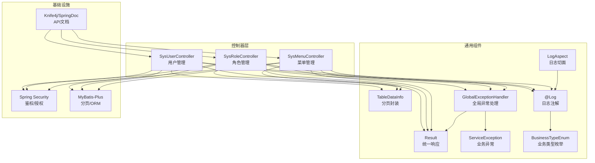
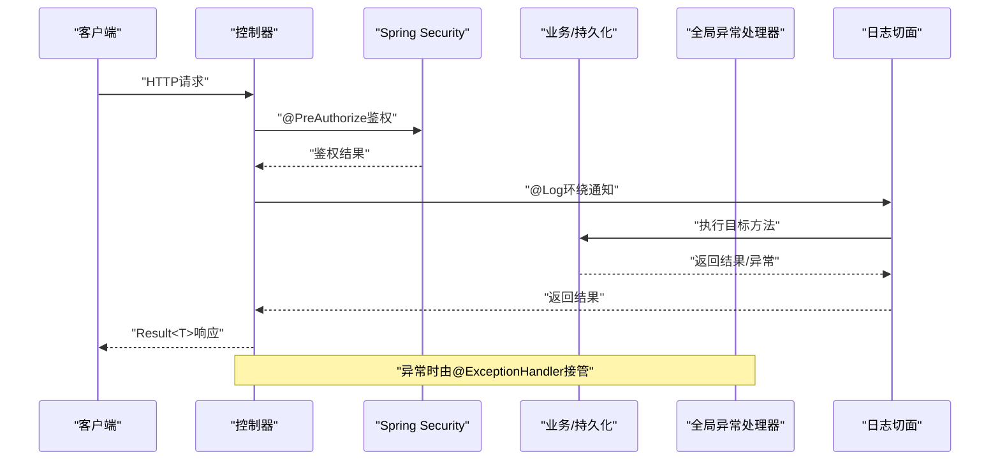
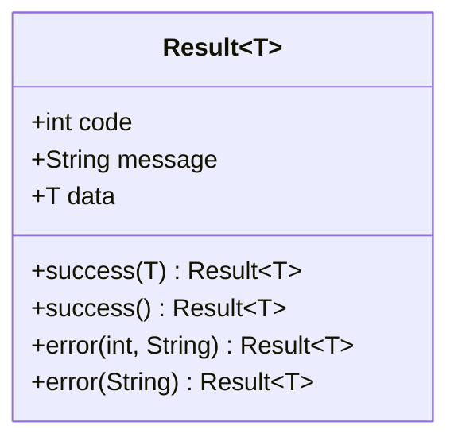
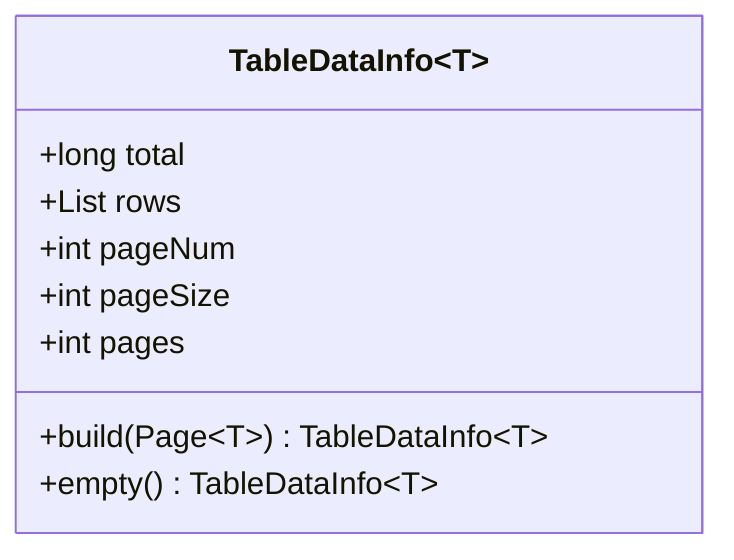
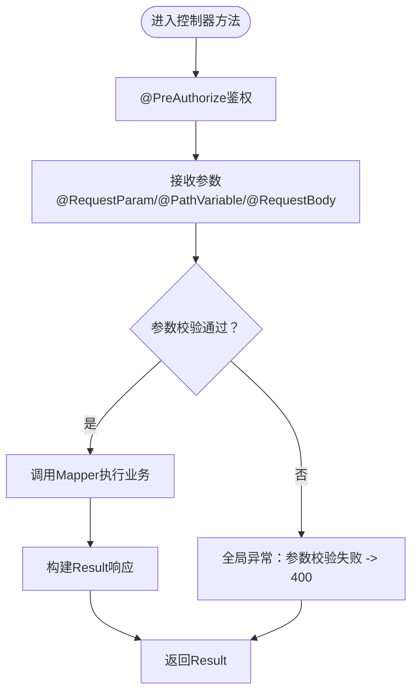
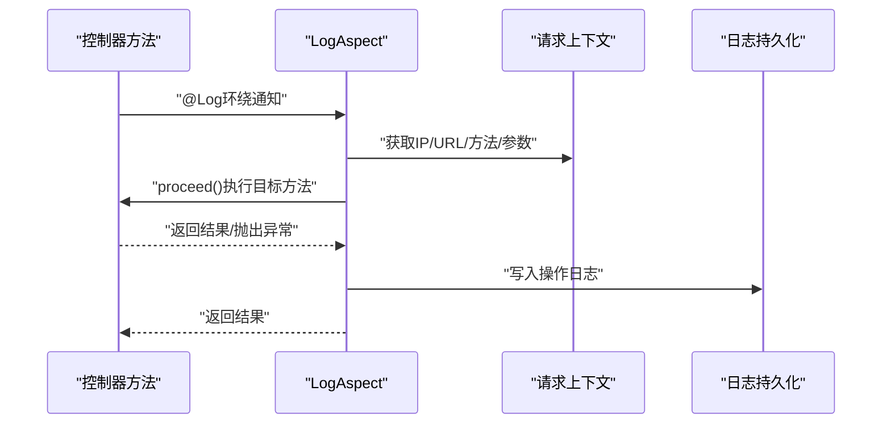
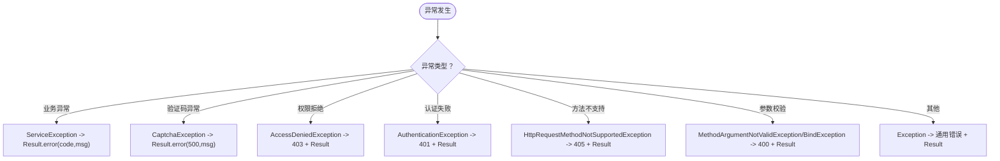
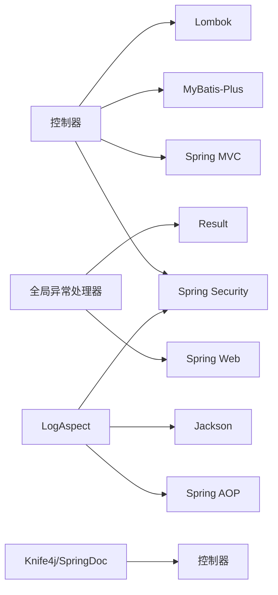

# 控制器层

<cite>
**本文引用的文件**
- [SysUserController.java](file://task-manager-backend/src/main/java/com/taskmanager/controller/SysUserController.java)
- [SysRoleController.java](file://task-manager-backend/src/main/java/com/taskmanager/controller/SysRoleController.java)
- [SysMenuController.java](file://task-manager-backend/src/main/java/com/taskmanager/controller/SysMenuController.java)
- [Result.java](file://task-manager-backend/src/main/java/com/taskmanager/common/Result.java)
- [TableDataInfo.java](file://task-manager-backend/src/main/java/com/taskmanager/common/utils/TableDataInfo.java)
- [GlobalExceptionHandler.java](file://task-manager-backend/src/main/java/com/taskmanager/common/exception/GlobalExceptionHandler.java)
- [ServiceException.java](file://task-manager-backend/src/main/java/com/taskmanager/common/exception/ServiceException.java)
- [Log.java](file://task-manager-backend/src/main/java/com/taskmanager/common/annotation/Log.java)
- [BusinessTypeEnum.java](file://task-manager-backend/src/main/java/com/taskmanager/common/enums/BusinessTypeEnum.java)
- [LogAspect.java](file://task-manager-backend/src/main/java/com/taskmanager/aspect/LogAspect.java)
- [SysUser.java](file://task-manager-backend/src/main/java/com/taskmanager/domain/SysUser.java)
- [application.yml](file://task-manager-backend/src/main/resources/application.yml)
- [SysUserControllerTest.java](file://task-manager-backend/src/test/java/com/taskmanager/controller/SysUserControllerTest.java)
- [BaseControllerTest.java](file://task-manager-backend/src/test/java/com/taskmanager/controller/BaseControllerTest.java)
- [pom.xml](file://task-manager-backend/pom.xml)
</cite>

## 目录
1. [简介](#简介)
2. [项目结构](#项目结构)
3. [核心组件](#核心组件)
4. [架构总览](#架构总览)
5. [详细组件分析](#详细组件分析)
6. [依赖分析](#依赖分析)
7. [性能考虑](#性能考虑)
8. [故障排查指南](#故障排查指南)
9. [结论](#结论)
10. [附录](#附录)

## 简介
本文件面向CodeBuddy任务管理系统的控制器层，系统性阐述RESTful API设计原则与实现规范，控制器类的职责与设计模式，统一响应格式Result的设计理念与实现，分页数据封装TableDataInfo的原理与使用，异常处理机制（含全局异常捕获、业务异常、参数校验异常），以及API文档生成与测试方法。同时给出性能优化策略与安全防护要点，帮助开发者快速理解并高效扩展控制器层。

## 项目结构
控制器层位于后端工程task-manager-backend中，采用按功能域划分的包结构，每个领域模块对应一个控制器类，统一通过@RestController暴露REST接口，并以统一响应包装Result进行输出。分页场景普遍使用MyBatis-Plus Page与TableDataInfo组合封装，异常处理通过@RestControllerAdvice集中处理，日志记录通过AOP切面注解Log与LogAspect实现。

图表来源
- [SysUserController.java:1-132](file://task-manager-backend/src/main/java/com/taskmanager/controller/SysUserController.java#L1-L132)
- [SysRoleController.java:1-83](file://task-manager-backend/src/main/java/com/taskmanager/controller/SysRoleController.java#L1-L83)
- [SysMenuController.java:1-86](file://task-manager-backend/src/main/java/com/taskmanager/controller/SysMenuController.java#L1-L86)
- [Result.java:1-76](file://task-manager-backend/src/main/java/com/taskmanager/common/Result.java#L1-L76)
- [TableDataInfo.java:1-60](file://task-manager-backend/src/main/java/com/taskmanager/common/utils/TableDataInfo.java#L1-L60)
- [GlobalExceptionHandler.java:1-109](file://task-manager-backend/src/main/java/com/taskmanager/common/exception/GlobalExceptionHandler.java#L1-L109)
- [ServiceException.java:1-35](file://task-manager-backend/src/main/java/com/taskmanager/common/exception/ServiceException.java#L1-L35)
- [LogAspect.java:1-137](file://task-manager-backend/src/main/java/com/taskmanager/aspect/LogAspect.java#L1-L137)
- [Log.java:1-38](file://task-manager-backend/src/main/java/com/taskmanager/common/annotation/Log.java#L1-L38)
- [BusinessTypeEnum.java:1-56](file://task-manager-backend/src/main/java/com/taskmanager/common/enums/BusinessTypeEnum.java#L1-L56)
- [application.yml:62-79](file://task-manager-backend/src/main/resources/application.yml#L62-L79)

章节来源
- [SysUserController.java:1-132](file://task-manager-backend/src/main/java/com/taskmanager/controller/SysUserController.java#L1-L132)
- [SysRoleController.java:1-83](file://task-manager-backend/src/main/java/com/taskmanager/controller/SysRoleController.java#L1-L83)
- [SysMenuController.java:1-86](file://task-manager-backend/src/main/java/com/taskmanager/controller/SysMenuController.java#L1-L86)
- [application.yml:1-79](file://task-manager-backend/src/main/resources/application.yml#L1-L79)

## 核心组件
- 统一响应Result：提供success/error静态工厂方法，统一返回code/message/data三段式结构，便于前端一致化处理。
- 分页封装TableDataInfo：从MyBatis-Plus Page构建分页数据，包含total、rows、pageNum、pageSize、pages等字段，适配前端分页组件。
- 全局异常处理GlobalExceptionHandler：集中捕获业务异常、参数校验异常、认证/权限异常、请求方式不支持等，统一返回Result或标准HTTP状态码。
- 日志注解与切面：@Log注解标记需要记录的操作日志，LogAspect环绕通知采集请求上下文、参数、耗时、结果/异常并落库。
- 控制器类：遵循REST命名与方法语义，使用@PreAuthorize进行权限控制，结合Mapper完成数据持久化。

章节来源
- [Result.java:1-76](file://task-manager-backend/src/main/java/com/taskmanager/common/Result.java#L1-L76)
- [TableDataInfo.java:1-60](file://task-manager-backend/src/main/java/com/taskmanager/common/utils/TableDataInfo.java#L1-L60)
- [GlobalExceptionHandler.java:1-109](file://task-manager-backend/src/main/java/com/taskmanager/common/exception/GlobalExceptionHandler.java#L1-L109)
- [Log.java:1-38](file://task-manager-backend/src/main/java/com/taskmanager/common/annotation/Log.java#L1-L38)
- [LogAspect.java:1-137](file://task-manager-backend/src/main/java/com/taskmanager/aspect/LogAspect.java#L1-L137)

## 架构总览
控制器层围绕“统一响应 + 分页封装 + 异常治理 + 日志切面 + 权限控制”展开，形成清晰的横切关注点分离。请求进入控制器后，参数经权限校验与必要校验，调用Mapper执行数据操作，最终以Result封装返回；异常在全局层面统一拦截并转换为标准响应；关键业务操作通过日志切面记录。

图表来源
- [SysUserController.java:30-130](file://task-manager-backend/src/main/java/com/taskmanager/controller/SysUserController.java#L30-L130)
- [GlobalExceptionHandler.java:27-107](file://task-manager-backend/src/main/java/com/taskmanager/common/exception/GlobalExceptionHandler.java#L27-L107)
- [LogAspect.java:44-97](file://task-manager-backend/src/main/java/com/taskmanager/aspect/LogAspect.java#L44-L97)

## 详细组件分析

### 统一响应Result设计与实现
- 设计理念：以code标识状态（200表示成功，业务错误可自定义）、message描述信息、data承载具体数据，简化前端分支判断。
- 成功响应：success(data)/success()两种工厂方法，分别用于带数据与无数据的成功返回。
- 错误响应：error(code,message)/error(message)两种工厂方法，前者支持业务自定义状态码，后者默认500。
- 使用方式：控制器直接返回Result.success()/Result.error(...)，无需手动拼装JSON。

图表来源
- [Result.java:12-75](file://task-manager-backend/src/main/java/com/taskmanager/common/Result.java#L12-L75)

章节来源
- [Result.java:1-76](file://task-manager-backend/src/main/java/com/taskmanager/common/Result.java#L1-L76)

### 分页封装TableDataInfo设计与使用
- 设计原理：从MyBatis-Plus Page对象提取total/records/current/size/pages，构造统一的分页容器，便于前端表格组件直接消费。
- 关键字段：total（总记录数）、rows（当前页数据列表）、pageNum/pageSize/pages（页码与页大小、总页数）。
- 构建方式：build(Page<T>)从分页查询结果构建；empty()用于空数据场景的默认分页对象。
- 控制器用法：将Mapper返回的Page<T>传入TableDataInfo.build，再由Result.success封装返回。

图表来源
- [TableDataInfo.java:14-59](file://task-manager-backend/src/main/java/com/taskmanager/common/utils/TableDataInfo.java#L14-L59)

章节来源
- [TableDataInfo.java:1-60](file://task-manager-backend/src/main/java/com/taskmanager/common/utils/TableDataInfo.java#L1-L60)

### 控制器类职责与设计模式
- 职责边界：接收HTTP请求、参数接收与简单校验、调用Mapper执行业务、封装Result返回。
- 设计模式：
  - 工厂模式：Result.success/error提供静态工厂方法，简化调用。
  - 包装器模式：TableDataInfo对Page进行二次封装，屏蔽分页细节。
  - 切面模式：@Log注解与LogAspect实现横切的日志记录。
- 权限控制：@PreAuthorize基于表达式进行细粒度权限校验，避免越权访问。
- 安全实践：密码统一通过PasswordEncoder加密存储；重置密码采用默认值并提示用户修改。

章节来源
- [SysUserController.java:30-130](file://task-manager-backend/src/main/java/com/taskmanager/controller/SysUserController.java#L30-L130)
- [SysRoleController.java:26-81](file://task-manager-backend/src/main/java/com/taskmanager/controller/SysRoleController.java#L26-L81)
- [SysMenuController.java:26-84](file://task-manager-backend/src/main/java/com/taskmanager/controller/SysMenuController.java#L26-L84)
- [Log.java:16-37](file://task-manager-backend/src/main/java/com/taskmanager/common/annotation/Log.java#L16-L37)

### RESTful API设计原则与实现规范
- HTTP方法选择：
  - GET：查询列表/详情（如“/list”、“/{id}”）
  - POST：新增资源
  - PUT：更新资源
  - DELETE：删除资源（控制器采用逻辑删除）
- URL路径设计：
  - 命名域：/api/{module}/{resource}
  - 列表：/list；详情：/{id}；特殊动作：如/resetPwd、/changeStatus
- 状态码使用：
  - 成功：200（Result.success）
  - 参数错误：400（全局异常捕获）
  - 权限不足：403（AccessDeniedException）
  - 未认证：401（AuthenticationException）
  - 方法不支持：405（HttpRequestMethodNotSupportedException）

章节来源
- [SysUserController.java:33-130](file://task-manager-backend/src/main/java/com/taskmanager/controller/SysUserController.java#L33-L130)
- [SysRoleController.java:29-81](file://task-manager-backend/src/main/java/com/taskmanager/controller/SysRoleController.java#L29-L81)
- [SysMenuController.java:27-84](file://task-manager-backend/src/main/java/com/taskmanager/controller/SysMenuController.java#L27-L84)
- [GlobalExceptionHandler.java:69-107](file://task-manager-backend/src/main/java/com/taskmanager/common/exception/GlobalExceptionHandler.java#L69-L107)

### 请求参数接收、数据验证、业务调用与响应封装
- 参数接收：@RequestParam用于查询参数，@PathVariable用于路径参数，@RequestBody用于请求体。
- 数据验证：参数校验异常由全局异常处理器捕获并返回400；复杂校验可在控制器内进行前置校验。
- 业务调用：控制器仅负责编排，实际数据持久化委托Mapper完成。
- 响应封装：统一使用Result.success/error，分页场景使用TableDataInfo包裹。

图表来源
- [SysUserController.java:33-130](file://task-manager-backend/src/main/java/com/taskmanager/controller/SysUserController.java#L33-L130)
- [GlobalExceptionHandler.java:78-98](file://task-manager-backend/src/main/java/com/taskmanager/common/exception/GlobalExceptionHandler.java#L78-L98)

章节来源
- [SysUserController.java:33-130](file://task-manager-backend/src/main/java/com/taskmanager/controller/SysUserController.java#L33-L130)
- [GlobalExceptionHandler.java:78-98](file://task-manager-backend/src/main/java/com/taskmanager/common/exception/GlobalExceptionHandler.java#L78-L98)

### 日志记录机制（@Log + LogAspect）
- 注解@Log：用于标记需要记录操作日志的方法，支持设置模块title、业务类型businessType、是否保存请求/响应参数。
- 切面LogAspect：环绕通知采集请求IP、URL、方法、耗时、操作人、请求参数（敏感字段脱敏）、响应结果/异常，并写入sys_oper_log。
- 业务类型：通过BusinessTypeEnum枚举映射不同操作类型（新增、修改、删除、授权等）。

图表来源
- [LogAspect.java:44-97](file://task-manager-backend/src/main/java/com/taskmanager/aspect/LogAspect.java#L44-L97)
- [Log.java:16-37](file://task-manager-backend/src/main/java/com/taskmanager/common/annotation/Log.java#L16-L37)
- [BusinessTypeEnum.java:8-38](file://task-manager-backend/src/main/java/com/taskmanager/common/enums/BusinessTypeEnum.java#L8-L38)

章节来源
- [LogAspect.java:1-137](file://task-manager-backend/src/main/java/com/taskmanager/aspect/LogAspect.java#L1-L137)
- [Log.java:1-38](file://task-manager-backend/src/main/java/com/taskmanager/common/annotation/Log.java#L1-L38)
- [BusinessTypeEnum.java:1-56](file://task-manager-backend/src/main/java/com/taskmanager/common/enums/BusinessTypeEnum.java#L1-L56)

### 异常处理机制
- 全局异常捕获：@RestControllerAdvice集中处理各类异常，返回Result或标准HTTP状态码。
- 业务异常：ServiceException携带自定义code与message，统一以Result.error(code,message)返回。
- 参数校验异常：MethodArgumentNotValidException与BindException统一返回400及错误信息。
- 权限/认证异常：AccessDeniedException返回403；AuthenticationException返回401。
- 兜底异常：Exception兜底记录日志并返回系统繁忙提示。

图表来源
- [GlobalExceptionHandler.java:27-107](file://task-manager-backend/src/main/java/com/taskmanager/common/exception/GlobalExceptionHandler.java#L27-L107)
- [ServiceException.java:10-34](file://task-manager-backend/src/main/java/com/taskmanager/common/exception/ServiceException.java#L10-L34)

章节来源
- [GlobalExceptionHandler.java:1-109](file://task-manager-backend/src/main/java/com/taskmanager/common/exception/GlobalExceptionHandler.java#L1-L109)
- [ServiceException.java:1-35](file://task-manager-backend/src/main/java/com/taskmanager/common/exception/ServiceException.java#L1-L35)

### API接口文档生成与测试方法
- 文档生成：通过Knife4j与SpringDoc在application.yml中配置扫描路径与UI入口，自动聚合控制器注解生成OpenAPI文档。
- 测试方法：使用MockMvc在BaseControllerTest基础上编写控制器测试，覆盖列表查询、新增、修改、删除、重置密码、修改状态等场景，并模拟权限与认证上下文。

章节来源
- [application.yml:62-79](file://task-manager-backend/src/main/resources/application.yml#L62-L79)
- [BaseControllerTest.java:1-89](file://task-manager-backend/src/test/java/com/taskmanager/controller/BaseControllerTest.java#L1-L89)
- [SysUserControllerTest.java:1-316](file://task-manager-backend/src/test/java/com/taskmanager/controller/SysUserControllerTest.java#L1-L316)

## 依赖分析
- 控制器依赖：
  - Spring MVC：提供@RestController、@RequestMapping、@GetMapping/@PostMapping等注解。
  - Spring Security：提供@PreAuthorize权限控制。
  - MyBatis-Plus：提供Page分页与Mapper接口。
  - Lombok：简化Result与TableDataInfo的getter/setter/构造函数。
- 异常处理依赖：
  - Spring Web：提供异常类型（MethodArgumentNotValidException、BindException、AccessDeniedException、AuthenticationException、HttpRequestMethodNotSupportedException）。
  - 全局异常处理器：统一返回Result或标准HTTP状态码。
- 日志依赖：
  - AOP：@Around环绕通知。
  - Jackson：序列化请求/响应参数。
  - Spring Security：获取当前登录用户信息。

图表来源
- [pom.xml:32-144](file://task-manager-backend/pom.xml#L32-L144)
- [SysUserController.java:10-13](file://task-manager-backend/src/main/java/com/taskmanager/controller/SysUserController.java#L10-L13)
- [GlobalExceptionHandler.java:14-15](file://task-manager-backend/src/main/java/com/taskmanager/common/exception/GlobalExceptionHandler.java#L14-L15)
- [LogAspect.java:8-19](file://task-manager-backend/src/main/java/com/taskmanager/aspect/LogAspect.java#L8-L19)

章节来源
- [pom.xml:1-206](file://task-manager-backend/pom.xml#L1-L206)

## 性能考虑
- 分页查询：使用MyBatis-Plus Page进行物理分页，避免一次性加载大量数据；合理设置pageSize上限，防止内存压力。
- 缓存策略：结合Redis缓存热点数据（如字典、菜单树），减少数据库压力；注意缓存一致性。
- 日志落库：日志写入采用异步或降级策略，避免阻塞主业务链路。
- 序列化开销：对大对象序列化进行控制，必要时使用DTO裁剪字段。
- 并发控制：对高并发写操作（新增/修改/删除）使用幂等设计与数据库唯一约束，避免重复提交。

## 故障排查指南
- 400参数错误：检查请求体JSON格式、必填字段、字段长度与类型；确认全局异常处理器捕获并返回的错误信息。
- 401未认证：确认请求头Authorization是否正确携带Token，Token是否过期或被禁用。
- 403权限不足：确认当前用户是否具备所需权限字符串（如system:user:list），检查角色与权限映射。
- 500系统异常：查看全局异常处理器日志，定位具体异常堆栈；确认ServiceException是否正确抛出并携带code/message。
- 删除失败：菜单删除前需检查是否存在子菜单，否则返回错误提示；确认逻辑删除字段delFlag配置生效。

章节来源
- [GlobalExceptionHandler.java:27-107](file://task-manager-backend/src/main/java/com/taskmanager/common/exception/GlobalExceptionHandler.java#L27-L107)
- [SysMenuController.java:68-84](file://task-manager-backend/src/main/java/com/taskmanager/controller/SysMenuController.java#L68-L84)
- [application.yml:42-44](file://task-manager-backend/src/main/resources/application.yml#L42-L44)

## 结论
控制器层通过统一响应、分页封装、全局异常处理与日志切面实现了清晰的横切关注点分离，既保证了接口的一致性与易用性，又提升了可观测性与安全性。遵循RESTful设计原则与权限控制策略，能够有效支撑业务扩展与维护。

## 附录
- API文档访问：启动应用后访问/swagger-ui.html或/v3/api-docs，按组配置扫描com.taskmanager.controller包。
- 测试运行：使用Maven命令执行测试，或在IDE中运行具体测试类；Mock测试通过MockMvc模拟HTTP请求与鉴权上下文。

章节来源
- [application.yml:62-79](file://task-manager-backend/src/main/resources/application.yml#L62-L79)
- [SysUserControllerTest.java:39-44](file://task-manager-backend/src/test/java/com/taskmanager/controller/SysUserControllerTest.java#L39-L44)