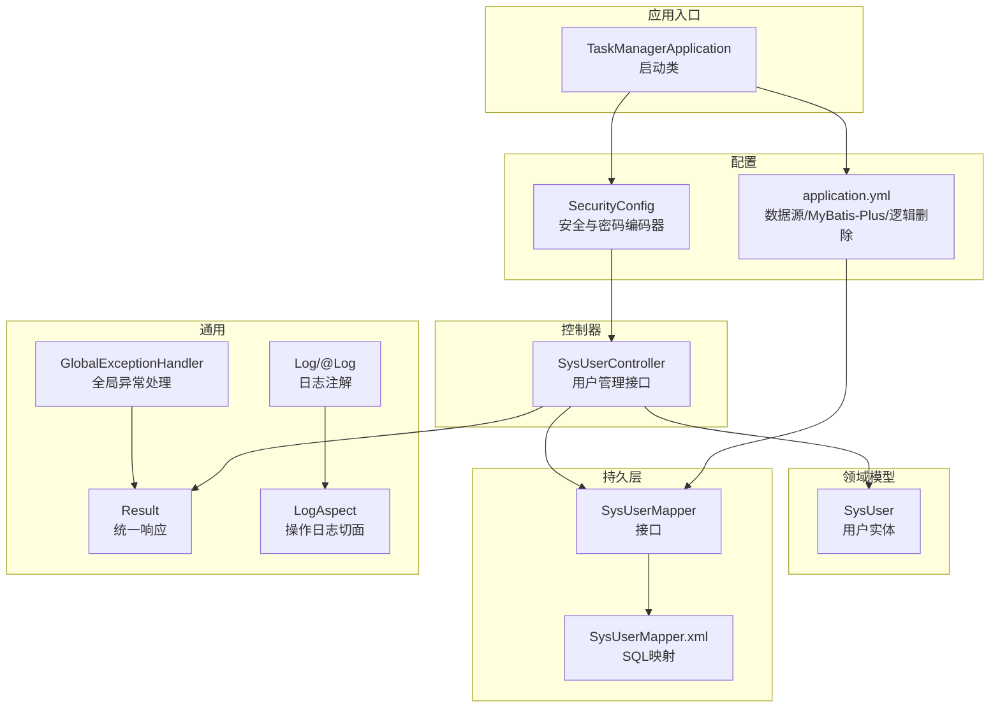
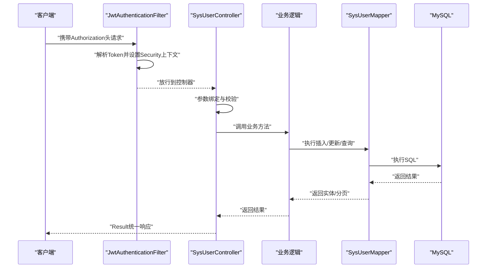
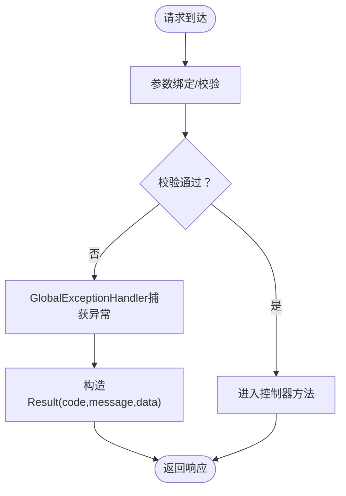
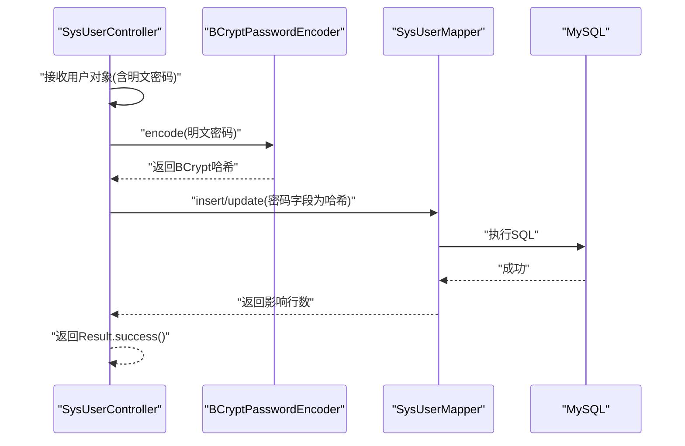
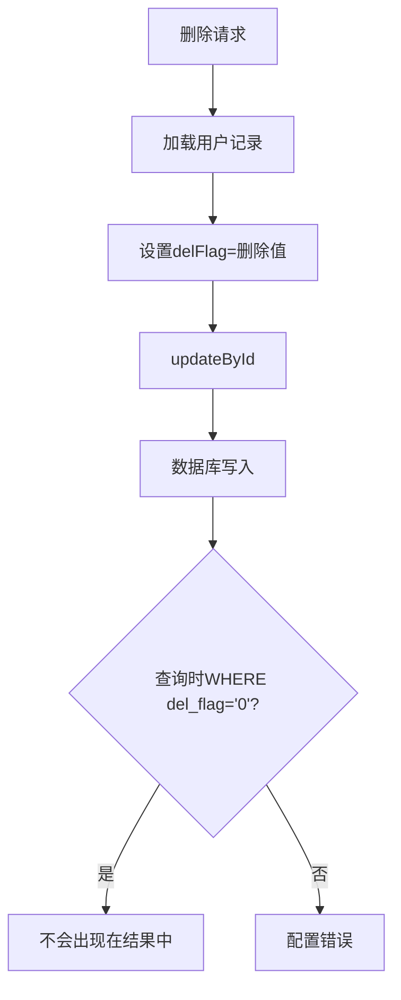
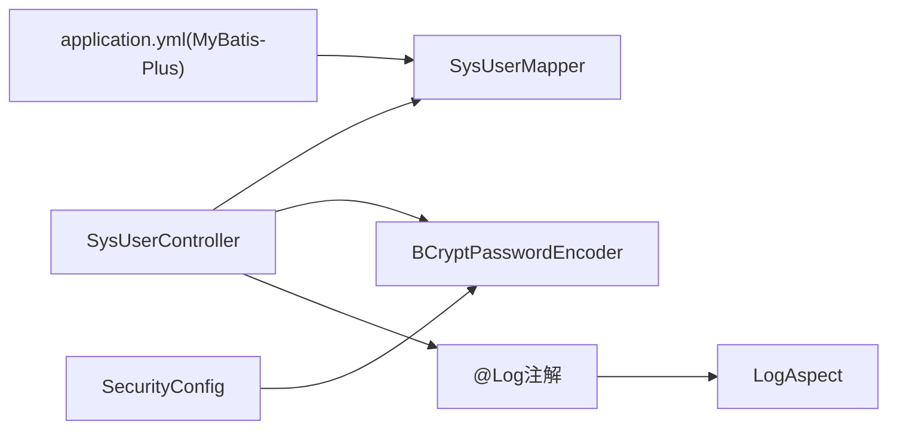

# 数据验证与处理

<cite>
**本文引用的文件**
- [TaskManagerApplication.java](file://task-manager-backend/src/main/java/com/taskmanager/TaskManagerApplication.java)
- [application.yml](file://task-manager-backend/src/main/resources/application.yml)
- [Result.java](file://task-manager-backend/src/main/java/com/taskmanager/common/Result.java)
- [GlobalExceptionHandler.java](file://task-manager-backend/src/main/java/com/taskmanager/common/exception/GlobalExceptionHandler.java)
- [SecurityConfig.java](file://task-manager-backend/src/main/java/com/taskmanager/config/SecurityConfig.java)
- [SysUser.java](file://task-manager-backend/src/main/java/com/taskmanager/domain/SysUser.java)
- [SysUserController.java](file://task-manager-backend/src/main/java/com/taskmanager/controller/SysUserController.java)
- [SysUserMapper.java](file://task-manager-backend/src/main/java/com/taskmanager/mapper/SysUserMapper.java)
- [SysUserMapper.xml](file://task-manager-backend/src/main/resources/mapper/SysUserMapper.xml)
- [Log.java](file://task-manager-backend/src/main/java/com/taskmanager/common/annotation/Log.java)
- [LogAspect.java](file://task-manager-backend/src/main/java/com/taskmanager/aspect/LogAspect.java)
- [JwtAuthenticationFilter.java](file://task-manager-backend/src/main/java/com/taskmanager/security/JwtAuthenticationFilter.java)
- [PasswordEncoder.java](file://task-manager-backend/PasswordEncoder.java)
- [PasswordGenerator.java](file://task-manager-backend/src/main/java/com/taskmanager/util/PasswordGenerator.java)
</cite>

## 目录
1. [简介](#简介)
2. [项目结构](#项目结构)
3. [核心组件](#核心组件)
4. [架构总览](#架构总览)
5. [详细组件分析](#详细组件分析)
6. [依赖分析](#依赖分析)
7. [性能考虑](#性能考虑)
8. [故障排查指南](#故障排查指南)
9. [结论](#结论)
10. [附录](#附录)

## 简介
本文件聚焦于CodeBuddy任务管理系统中“数据验证与处理”的技术要点，围绕以下主题展开：
- Spring MVC中的数据验证机制与统一异常处理
- 请求参数接收与转换（基本类型、复杂对象、数组）
- 密码加密与强度策略（BCrypt、默认密码与重置）
- 逻辑删除与软删除设计（delFlag字段与恢复机制）
- 数据传输对象（DTO）设计原则与使用场景
- 输入安全性与SQL注入防护
- 批量操作的事务与异常回滚

## 项目结构
后端采用Spring Boot + MyBatis-Plus架构，控制器层负责HTTP请求接入，领域模型承载业务数据，Mapper层对接数据库，全局异常处理器统一输出响应格式。

图表来源
- [TaskManagerApplication.java:1-18](file://task-manager-backend/src/main/java/com/taskmanager/TaskManagerApplication.java#L1-L18)
- [SecurityConfig.java:1-116](file://task-manager-backend/src/main/java/com/taskmanager/config/SecurityConfig.java#L1-L116)
- [application.yml:1-79](file://task-manager-backend/src/main/resources/application.yml#L1-L79)
- [SysUserController.java:1-132](file://task-manager-backend/src/main/java/com/taskmanager/controller/SysUserController.java#L1-L132)
- [SysUser.java:1-80](file://task-manager-backend/src/main/java/com/taskmanager/domain/SysUser.java#L1-L80)
- [SysUserMapper.java:1-39](file://task-manager-backend/src/main/java/com/taskmanager/mapper/SysUserMapper.java#L1-L39)
- [SysUserMapper.xml:1-58](file://task-manager-backend/src/main/resources/mapper/SysUserMapper.xml#L1-L58)
- [Result.java:1-76](file://task-manager-backend/src/main/java/com/taskmanager/common/Result.java#L1-L76)
- [GlobalExceptionHandler.java:1-109](file://task-manager-backend/src/main/java/com/taskmanager/common/exception/GlobalExceptionHandler.java#L1-L109)
- [Log.java:1-38](file://task-manager-backend/src/main/java/com/taskmanager/common/annotation/Log.java#L1-L38)
- [LogAspect.java:1-137](file://task-manager-backend/src/main/java/com/taskmanager/aspect/LogAspect.java#L1-L137)

章节来源
- [TaskManagerApplication.java:1-18](file://task-manager-backend/src/main/java/com/taskmanager/TaskManagerApplication.java#L1-L18)
- [application.yml:1-79](file://task-manager-backend/src/main/resources/application.yml#L1-L79)

## 核心组件
- 统一响应体：封装code/message/data，便于前端统一处理与错误提示。
- 全局异常处理器：集中处理参数校验、绑定、认证、权限等异常，返回标准Result。
- 安全与密码：启用无状态JWT过滤链，使用BCrypt进行密码编码与校验。
- 逻辑删除：MyBatis-Plus全局配置逻辑删除字段与值，Mapper/SQL自动过滤。
- 日志切面：环绕记录请求/响应、耗时、异常、IP等，敏感字段脱敏。

章节来源
- [Result.java:1-76](file://task-manager-backend/src/main/java/com/taskmanager/common/Result.java#L1-L76)
- [GlobalExceptionHandler.java:1-109](file://task-manager-backend/src/main/java/com/taskmanager/common/exception/GlobalExceptionHandler.java#L1-L109)
- [SecurityConfig.java:1-116](file://task-manager-backend/src/main/java/com/taskmanager/config/SecurityConfig.java#L1-L116)
- [application.yml:40-44](file://task-manager-backend/src/main/resources/application.yml#L40-L44)
- [LogAspect.java:1-137](file://task-manager-backend/src/main/java/com/taskmanager/aspect/LogAspect.java#L1-L137)

## 架构总览
下图展示从请求进入至数据库访问的关键路径，以及验证与异常处理的落点。

图表来源
- [JwtAuthenticationFilter.java:1-70](file://task-manager-backend/src/main/java/com/taskmanager/security/JwtAuthenticationFilter.java#L1-L70)
- [SysUserController.java:1-132](file://task-manager-backend/src/main/java/com/taskmanager/controller/SysUserController.java#L1-L132)
- [SysUserMapper.java:1-39](file://task-manager-backend/src/main/java/com/taskmanager/mapper/SysUserMapper.java#L1-L39)
- [SysUserMapper.xml:1-58](file://task-manager-backend/src/main/resources/mapper/SysUserMapper.xml#L1-L58)

## 详细组件分析

### Spring MVC数据验证与统一异常处理
- 参数校验异常：当使用@RequestBody配合@Valid发生字段校验失败时，由全局异常处理器捕获MethodArgumentNotValidException，提取第一条错误消息并返回标准Result。
- 参数绑定异常：@RequestParam等基础类型绑定失败时，捕获BindException，返回标准Result。
- 其他异常：兜底处理Exception，记录请求URI与异常栈，返回系统繁忙提示。

图表来源
- [GlobalExceptionHandler.java:76-98](file://task-manager-backend/src/main/java/com/taskmanager/common/exception/GlobalExceptionHandler.java#L76-L98)
- [Result.java:1-76](file://task-manager-backend/src/main/java/com/taskmanager/common/Result.java#L1-L76)

章节来源
- [GlobalExceptionHandler.java:1-109](file://task-manager-backend/src/main/java/com/taskmanager/common/exception/GlobalExceptionHandler.java#L1-L109)
- [Result.java:1-76](file://task-manager-backend/src/main/java/com/taskmanager/common/Result.java#L1-L76)

### 请求参数接收与转换
- 基本类型参数：通过@RequestParam接收，支持默认值与可选参数，适合简单查询条件。
- 复杂对象参数：通过@RequestBody接收JSON，交由Spring MVC的HttpMessageConverters与Jackson完成反序列化。
- 数组参数：@PathVariable Long[]用于接收多个ID，控制器内部循环处理，实现批量删除等操作。

章节来源
- [SysUserController.java:33-45](file://task-manager-backend/src/main/java/com/taskmanager/controller/SysUserController.java#L33-L45)
- [SysUserController.java:96-106](file://task-manager-backend/src/main/java/com/taskmanager/controller/SysUserController.java#L96-L106)

### 密码加密处理
- 密码编码器：SecurityConfig中定义BCryptPasswordEncoder Bean，strength默认强度。
- 控制器侧加密：新增/编辑用户时，对明文密码进行编码后入库；若仅更新其他字段且未提供新密码，则保留原密码。
- 默认密码与重置：提供重置密码接口，将密码设为默认值并再次编码后更新。
- 工具辅助：PasswordEncoder与PasswordGenerator用于生成BCrypt哈希，便于初始化或修复场景。

图表来源
- [SysUserController.java:62-89](file://task-manager-backend/src/main/java/com/taskmanager/controller/SysUserController.java#L62-L89)
- [SysUserController.java:113-120](file://task-manager-backend/src/main/java/com/taskmanager/controller/SysUserController.java#L113-L120)
- [SecurityConfig.java:102-105](file://task-manager-backend/src/main/java/com/taskmanager/config/SecurityConfig.java#L102-L105)
- [PasswordEncoder.java:1-18](file://task-manager-backend/PasswordEncoder.java#L1-L18)
- [PasswordGenerator.java:1-15](file://task-manager-backend/src/main/java/com/taskmanager/util/PasswordGenerator.java#L1-L15)

章节来源
- [SysUserController.java:62-89](file://task-manager-backend/src/main/java/com/taskmanager/controller/SysUserController.java#L62-L89)
- [SysUserController.java:113-120](file://task-manager-backend/src/main/java/com/taskmanager/controller/SysUserController.java#L113-L120)
- [SecurityConfig.java:102-105](file://task-manager-backend/src/main/java/com/taskmanager/config/SecurityConfig.java#L102-L105)
- [PasswordEncoder.java:1-18](file://task-manager-backend/PasswordEncoder.java#L1-L18)
- [PasswordGenerator.java:1-15](file://task-manager-backend/src/main/java/com/taskmanager/util/PasswordGenerator.java#L1-L15)

### 逻辑删除与软删除
- 配置层面：application.yml中开启MyBatis-Plus逻辑删除字段与值映射。
- 实体层面：SysUser包含delFlag字段，用于标识是否删除。
- 查询层面：Mapper XML中默认WHERE del_flag='0'，确保查询/分页自动过滤已删除记录。
- 删除层面：删除接口将delFlag更新为删除值，实现软删除；恢复可通过更新delFlag为存在值实现。

图表来源
- [application.yml:40-44](file://task-manager-backend/src/main/resources/application.yml#L40-L44)
- [SysUser.java:56-57](file://task-manager-backend/src/main/java/com/taskmanager/domain/SysUser.java#L56-L57)
- [SysUserMapper.xml:30-33](file://task-manager-backend/src/main/resources/mapper/SysUserMapper.xml#L30-L33)
- [SysUserMapper.xml:35-56](file://task-manager-backend/src/main/resources/mapper/SysUserMapper.xml#L35-L56)
- [SysUserController.java:96-106](file://task-manager-backend/src/main/java/com/taskmanager/controller/SysUserController.java#L96-L106)

章节来源
- [application.yml:40-44](file://task-manager-backend/src/main/resources/application.yml#L40-L44)
- [SysUser.java:56-57](file://task-manager-backend/src/main/java/com/taskmanager/domain/SysUser.java#L56-L57)
- [SysUserMapper.xml:30-33](file://task-manager-backend/src/main/resources/mapper/SysUserMapper.xml#L30-L33)
- [SysUserMapper.xml:35-56](file://task-manager-backend/src/main/resources/mapper/SysUserMapper.xml#L35-L56)
- [SysUserController.java:96-106](file://task-manager-backend/src/main/java/com/taskmanager/controller/SysUserController.java#L96-L106)

### 数据传输对象（DTO）设计原则与使用场景
- 设计原则
  - 明确职责：DTO仅承载接口所需字段，避免直接暴露领域模型的全部属性。
  - 安全优先：敏感字段（如密码）不在DTO中出现，或仅在特定接口中以只写方式传递。
  - 可扩展性：DTO字段与接口契约一致，便于版本演进与向后兼容。
- 使用场景
  - 新增/编辑接口：接收DTO进行参数校验与转换，再映射到领域模型入库。
  - 查询接口：返回DTO集合或分页包装，避免泄露内部字段。
  - 跨模块交互：通过DTO隔离不同模块的数据结构差异。

（本节为概念性指导，不直接分析具体文件）

### 输入安全性与SQL注入防护
- SQL注入防护
  - 使用MyBatis-Plus与Mapper XML，参数使用@Param与#{}占位符，避免字符串拼接。
  - 模糊查询使用CONCAT函数包裹参数，条件判断使用<if>标签，减少动态SQL风险。
- 敏感信息脱敏
  - 操作日志切面在记录请求参数时，对password字段进行正则替换脱敏，防止日志泄露。
- 认证与授权
  - JWT过滤器从请求头提取Token并解析用户信息，未认证请求统一返回401。

章节来源
- [SysUserMapper.xml:35-56](file://task-manager-backend/src/main/resources/mapper/SysUserMapper.xml#L35-L56)
- [LogAspect.java:99-111](file://task-manager-backend/src/main/java/com/taskmanager/aspect/LogAspect.java#L99-L111)
- [JwtAuthenticationFilter.java:37-68](file://task-manager-backend/src/main/java/com/taskmanager/security/JwtAuthenticationFilter.java#L37-L68)

### 批量操作的事务与异常回滚
- 当前实现
  - 批量删除接口对每个ID逐一更新delFlag，未显式声明事务注解。
- 建议
  - 对批量操作增加@Transactional，确保原子性；任一失败即整体回滚。
  - 在异常处理器中捕获运行时异常，结合全局异常返回标准Result，避免泄漏内部错误。

章节来源
- [SysUserController.java:96-106](file://task-manager-backend/src/main/java/com/taskmanager/controller/SysUserController.java#L96-L106)
- [GlobalExceptionHandler.java:103-107](file://task-manager-backend/src/main/java/com/taskmanager/common/exception/GlobalExceptionHandler.java#L103-L107)

## 依赖分析
- 控制器依赖：SysUserController依赖SysUserMapper与PasswordEncoder，体现关注点分离。
- 配置依赖：SecurityConfig提供密码编码器与JWT过滤链，贯穿认证与授权。
- ORM依赖：application.yml配置MyBatis-Plus逻辑删除，SysUserMapper.xml中SQL自动应用过滤条件。
- 日志依赖：@Log注解与LogAspect切面组合，统一记录操作日志。

图表来源
- [SysUserController.java:1-132](file://task-manager-backend/src/main/java/com/taskmanager/controller/SysUserController.java#L1-L132)
- [SysUserMapper.java:1-39](file://task-manager-backend/src/main/java/com/taskmanager/mapper/SysUserMapper.java#L1-L39)
- [SecurityConfig.java:1-116](file://task-manager-backend/src/main/java/com/taskmanager/config/SecurityConfig.java#L1-L116)
- [application.yml:40-44](file://task-manager-backend/src/main/resources/application.yml#L40-L44)
- [Log.java:1-38](file://task-manager-backend/src/main/java/com/taskmanager/common/annotation/Log.java#L1-L38)
- [LogAspect.java:1-137](file://task-manager-backend/src/main/java/com/taskmanager/aspect/LogAspect.java#L1-L137)

章节来源
- [SysUserController.java:1-132](file://task-manager-backend/src/main/java/com/taskmanager/controller/SysUserController.java#L1-L132)
- [SysUserMapper.java:1-39](file://task-manager-backend/src/main/java/com/taskmanager/mapper/SysUserMapper.java#L1-L39)
- [SecurityConfig.java:1-116](file://task-manager-backend/src/main/java/com/taskmanager/config/SecurityConfig.java#L1-L116)
- [application.yml:40-44](file://task-manager-backend/src/main/resources/application.yml#L40-L44)
- [Log.java:1-38](file://task-manager-backend/src/main/java/com/taskmanager/common/annotation/Log.java#L1-L38)
- [LogAspect.java:1-137](file://task-manager-backend/src/main/java/com/taskmanager/aspect/LogAspect.java#L1-L137)

## 性能考虑
- 分页查询：使用Page分页参数，Mapper中按创建时间降序排序，避免全表扫描。
- 逻辑删除：通过del_flag过滤减少扫描范围，但需确保索引覆盖必要列。
- 编码强度：BCrypt默认强度已足够，避免过度提升strength导致认证延迟。
- 日志写入：操作日志异步写入更佳，当前实现try-catch保护，避免阻塞主流程。

（本节提供一般性建议，不直接分析具体文件）

## 故障排查指南
- 参数校验失败：查看全局异常处理器对MethodArgumentNotValidException的处理，确认字段校验注解与消息。
- 参数绑定失败：查看BindException处理分支，定位@RequestParam类型不匹配或必填缺失。
- 认证失败/权限不足：检查JWT过滤器是否正确设置Security上下文，确认SecurityConfig放行规则与认证入口点。
- 逻辑删除未生效：确认application.yml逻辑删除配置与Mapper XML WHERE条件一致。
- 密码无法登录：核对BCrypt编码与存储一致性，必要时使用工具生成哈希并更新数据库。

章节来源
- [GlobalExceptionHandler.java:76-98](file://task-manager-backend/src/main/java/com/taskmanager/common/exception/GlobalExceptionHandler.java#L76-L98)
- [SecurityConfig.java:58-74](file://task-manager-backend/src/main/java/com/taskmanager/config/SecurityConfig.java#L58-L74)
- [application.yml:40-44](file://task-manager-backend/src/main/resources/application.yml#L40-L44)
- [PasswordEncoder.java:1-18](file://task-manager-backend/PasswordEncoder.java#L1-L18)

## 结论
本系统在数据验证方面通过Spring MVC与全局异常处理器实现了标准化的参数校验与错误反馈；在安全方面采用JWT与BCrypt，确保认证与密码存储安全；在数据层面通过MyBatis-Plus的逻辑删除实现软删除与高效查询；在可观测性方面通过日志切面与脱敏策略保障运维与审计需求。建议后续在批量操作上引入显式事务，进一步提升一致性与可靠性。

## 附录
- 关键配置项
  - MyBatis-Plus逻辑删除：logic-delete-field、logic-delete-value、logic-not-delete-value
  - Jackson时间格式与时区
  - JWT头部、前缀与过期时间
- 常用工具
  - PasswordEncoder：生成默认密码的BCrypt哈希
  - PasswordGenerator：演示BCrypt编码与匹配

章节来源
- [application.yml:40-49](file://task-manager-backend/src/main/resources/application.yml#L40-L49)
- [application.yml:51-56](file://task-manager-backend/src/main/resources/application.yml#L51-L56)
- [PasswordEncoder.java:1-18](file://task-manager-backend/PasswordEncoder.java#L1-L18)
- [PasswordGenerator.java:1-15](file://task-manager-backend/src/main/java/com/taskmanager/util/PasswordGenerator.java#L1-L15)