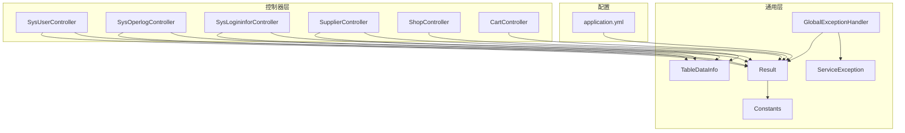
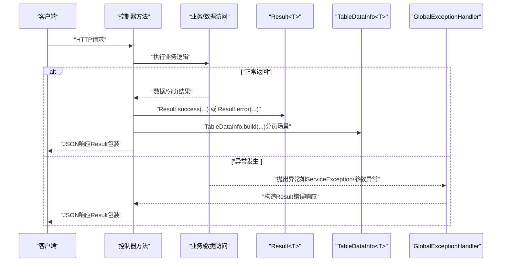
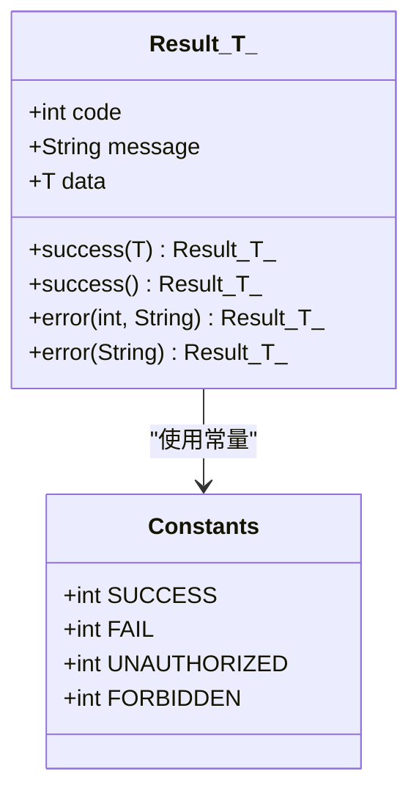
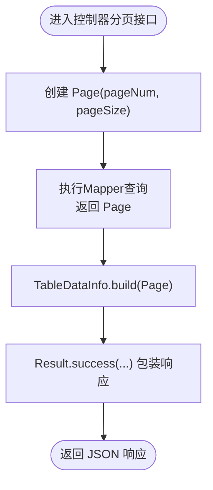
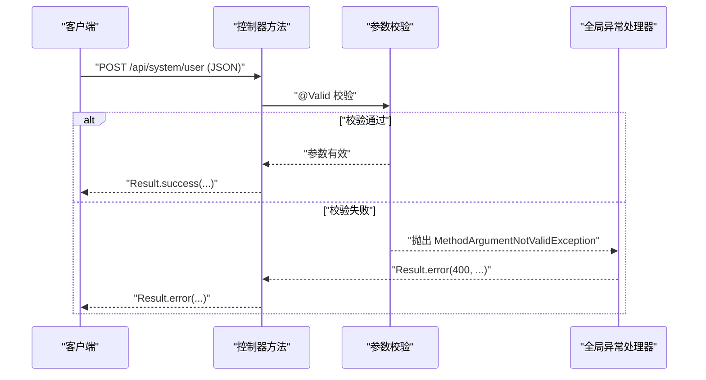
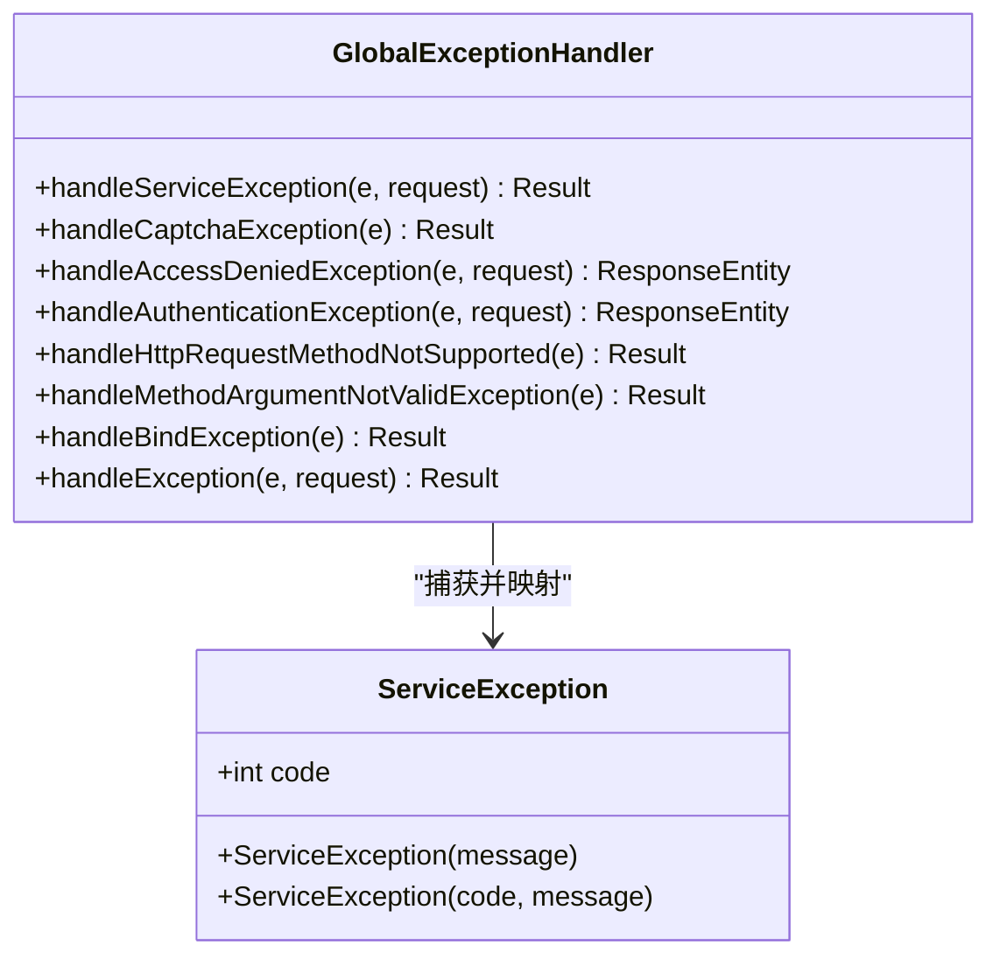
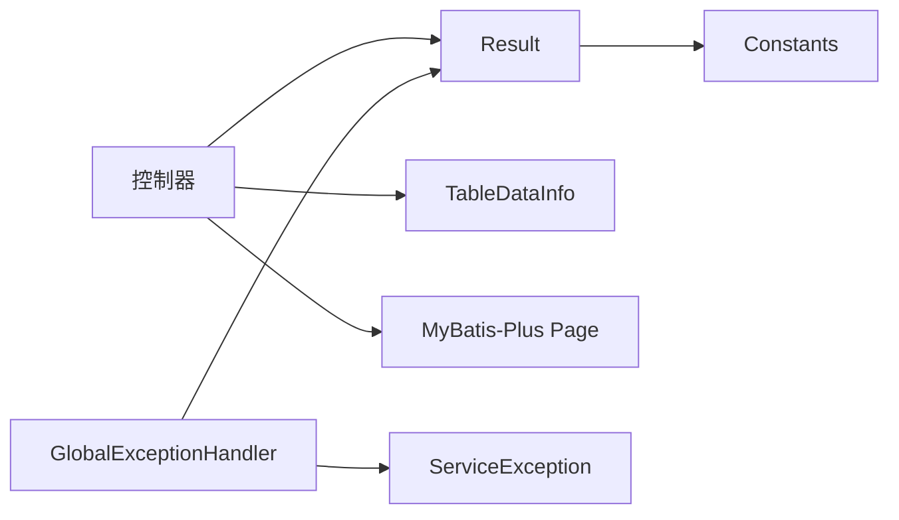

# 请求响应处理机制

<cite>
**本文引用的文件**   
- [Result.java](file://task-manager-backend/src/main/java/com/taskmanager/common/Result.java)
- [TableDataInfo.java](file://task-manager-backend/src/main/java/com/taskmanager/common/utils/TableDataInfo.java)
- [GlobalExceptionHandler.java](file://task-manager-backend/src/main/java/com/taskmanager/common/exception/GlobalExceptionHandler.java)
- [ServiceException.java](file://task-manager-backend/src/main/java/com/taskmanager/common/exception/ServiceException.java)
- [SysUserController.java](file://task-manager-backend/src/main/java/com/taskmanager/controller/SysUserController.java)
- [application.yml](file://task-manager-backend/src/main/resources/application.yml)
- [Constants.java](file://task-manager-backend/src/main/java/com/taskmanager/common/constant/Constants.java)
- [SysOperlogController.java](file://task-manager-backend/src/main/java/com/taskmanager/controller/SysOperlogController.java)
- [SysLogininforController.java](file://task-manager-backend/src/main/java/com/taskmanager/controller/SysLogininforController.java)
- [SupplierController.java](file://task-manager-backend/src/main/java/com/taskmanager/controller/SupplierController.java)
- [ShopController.java](file://task-manager-backend/src/main/java/com/taskmanager/controller/ShopController.java)
- [CartController.java](file://task-manager-backend/src/main/java/com/taskmanager/controller/CartController.java)
</cite>

## 目录
1. [引言](#引言)
2. [项目结构](#项目结构)
3. [核心组件](#核心组件)
4. [架构总览](#架构总览)
5. [详细组件分析](#详细组件分析)
6. [依赖分析](#依赖分析)
7. [性能考虑](#性能考虑)
8. [故障排查指南](#故障排查指南)
9. [结论](#结论)
10. [附录](#附录)

## 引言
本文件面向CodeBuddy任务管理系统后端的请求响应处理机制，系统性阐述统一响应格式Result的设计与实现、分页封装TableDataInfo的原理与用法、全局异常处理与错误码规范、参数绑定注解@RequestBody与@RequestParam的使用场景与规则、以及Jackson序列化配置与版本演进中的向后兼容策略。文档同时给出关键流程的时序图与类图，帮助开发者快速理解并正确使用响应体系。

## 项目结构
后端采用Spring Boot工程，响应处理相关的核心代码集中在以下位置：
- 统一响应与分页封装：common包
- 全局异常处理：common.exception包
- 控制器层：controller包，大量使用统一响应与分页封装
- 序列化配置：application.yml

图表来源
- [Result.java:1-76](file://task-manager-backend/src/main/java/com/taskmanager/common/Result.java#L1-L76)
- [TableDataInfo.java:1-60](file://task-manager-backend/src/main/java/com/taskmanager/common/utils/TableDataInfo.java#L1-L60)
- [GlobalExceptionHandler.java:1-109](file://task-manager-backend/src/main/java/com/taskmanager/common/exception/GlobalExceptionHandler.java#L1-L109)
- [ServiceException.java:1-35](file://task-manager-backend/src/main/java/com/taskmanager/common/exception/ServiceException.java#L1-L35)
- [SysUserController.java:1-132](file://task-manager-backend/src/main/java/com/taskmanager/controller/SysUserController.java#L1-L132)
- [SysOperlogController.java:1-37](file://task-manager-backend/src/main/java/com/taskmanager/controller/SysOperlogController.java#L1-L37)
- [SysLogininforController.java:1-36](file://task-manager-backend/src/main/java/com/taskmanager/controller/SysLogininforController.java#L1-L36)
- [SupplierController.java:1-41](file://task-manager-backend/src/main/java/com/taskmanager/controller/SupplierController.java#L1-L41)
- [ShopController.java:1-41](file://task-manager-backend/src/main/java/com/taskmanager/controller/ShopController.java#L1-L41)
- [CartController.java:1-46](file://task-manager-backend/src/main/java/com/taskmanager/controller/CartController.java#L1-L46)
- [application.yml:46-49](file://task-manager-backend/src/main/resources/application.yml#L46-L49)

章节来源
- [application.yml:1-79](file://task-manager-backend/src/main/resources/application.yml#L1-L79)

## 核心组件
- 统一响应Result<T>：提供泛型承载任意数据类型，内置成功与错误两类静态工厂方法，确保前后端交互的一致性与可预期性。
- 分页封装TableDataInfo<T>：将MyBatis-Plus Page对象转换为统一的分页响应载体，包含总记录数、当前页数据、页码与页大小等字段，并提供空数据构建方法。
- 全局异常处理器GlobalExceptionHandler：集中捕获各类运行期异常，统一输出Result格式响应，对认证、权限、参数校验等场景进行差异化处理。
- 业务异常ServiceException：携带业务错误码，便于前端识别具体业务问题。
- 常量Constants：定义成功、失败、未认证、无权限等状态码常量，作为统一约定。

章节来源
- [Result.java:1-76](file://task-manager-backend/src/main/java/com/taskmanager/common/Result.java#L1-L76)
- [TableDataInfo.java:1-60](file://task-manager-backend/src/main/java/com/taskmanager/common/utils/TableDataInfo.java#L1-L60)
- [GlobalExceptionHandler.java:1-109](file://task-manager-backend/src/main/java/com/taskmanager/common/exception/GlobalExceptionHandler.java#L1-L109)
- [ServiceException.java:1-35](file://task-manager-backend/src/main/java/com/taskmanager/common/exception/ServiceException.java#L1-L35)
- [Constants.java:1-40](file://task-manager-backend/src/main/java/com/taskmanager/common/constant/Constants.java#L1-L40)

## 架构总览
统一响应处理在控制器层通过Result<T>返回，在异常发生时由GlobalExceptionHandler拦截并转为标准Result格式。分页场景通过TableDataInfo<T>封装，结合MyBatis-Plus Page完成数据转换。

图表来源
- [SysUserController.java:34-44](file://task-manager-backend/src/main/java/com/taskmanager/controller/SysUserController.java#L34-L44)
- [GlobalExceptionHandler.java:27-107](file://task-manager-backend/src/main/java/com/taskmanager/common/exception/GlobalExceptionHandler.java#L27-L107)
- [TableDataInfo.java:37-45](file://task-manager-backend/src/main/java/com/taskmanager/common/utils/TableDataInfo.java#L37-L45)

## 详细组件分析

### Result统一响应格式
- 设计理念
  - 泛型设计：通过<T>承载任意数据类型，避免强转与类型丢失，提升编译期安全性。
  - 静态工厂方法：提供success(data)/success()/error(code,message)/error(message)四类工厂方法，简化调用与语义表达。
  - 统一结构：code、message、data三段式结构，便于前端统一解析与展示。
- 使用场景
  - 成功响应：直接返回Result.success(data)或Result.success()。
  - 错误响应：根据异常类型返回Result.error(...)，或在全局异常处理器中统一映射。
- 与常量的协作
  - 通过Constants中的SUCCESS/FAIL/UNAUTHORIZED/FORBIDDEN等常量，保证前后端状态码一致。

图表来源
- [Result.java:15-75](file://task-manager-backend/src/main/java/com/taskmanager/common/Result.java#L15-L75)
- [Constants.java:10-20](file://task-manager-backend/src/main/java/com/taskmanager/common/constant/Constants.java#L10-L20)

章节来源
- [Result.java:1-76](file://task-manager-backend/src/main/java/com/taskmanager/common/Result.java#L1-L76)
- [Constants.java:1-40](file://task-manager-backend/src/main/java/com/taskmanager/common/constant/Constants.java#L1-L40)

### TableDataInfo分页封装
- 设计原理
  - 字段覆盖：total、rows、pageNum、pageSize、pages，完整描述分页上下文。
  - 构建方法：build(Page<T>)从MyBatis-Plus Page转换而来；empty()提供空数据占位。
  - 泛型支持：与Result<T>组合，形成Result<TableDataInfo<T>>的典型响应结构。
- 使用方法
  - 控制器中先构造Page，查询得到Page<T>，再调用TableDataInfo.build(Page<T>)，最后Result.success(...)返回。
  - 支持条件筛选与分页参数（pageNum/pageSize），控制器方法通常使用@RequestParam接收。
- 与分页插件的集成
  - 通过MyBatis-Plus Page对象自动填充分页统计信息，减少重复计算。

图表来源
- [SysUserController.java:42-44](file://task-manager-backend/src/main/java/com/taskmanager/controller/SysUserController.java#L42-L44)
- [TableDataInfo.java:37-45](file://task-manager-backend/src/main/java/com/taskmanager/common/utils/TableDataInfo.java#L37-L45)

章节来源
- [TableDataInfo.java:1-60](file://task-manager-backend/src/main/java/com/taskmanager/common/utils/TableDataInfo.java#L1-L60)
- [SysUserController.java:34-44](file://task-manager-backend/src/main/java/com/taskmanager/controller/SysUserController.java#L34-L44)

### 参数绑定注解：@RequestBody 与 @RequestParam
- @RequestBody
  - 场景：POST/PUT请求体传参，通常用于复杂对象或批量更新。
  - 规则：与@Valid配合可触发方法级参数校验；若校验失败，由全局异常处理器捕获并返回Result.error(400,...)。
  - 示例：用户新增/编辑接口使用@RequestBody绑定SysUser对象。
- @RequestParam
  - 场景：GET路径参数或查询字符串传参，适合简单参数与分页参数。
  - 规则：支持defaultValue与required属性；分页接口常用pageNum与pageSize。
  - 示例：用户列表、日志列表、供应商列表等均使用@RequestParam接收分页与筛选条件。

图表来源
- [SysUserController.java:61-69](file://task-manager-backend/src/main/java/com/taskmanager/controller/SysUserController.java#L61-L69)
- [GlobalExceptionHandler.java:78-86](file://task-manager-backend/src/main/java/com/taskmanager/common/exception/GlobalExceptionHandler.java#L78-L86)

章节来源
- [SysUserController.java:34-44](file://task-manager-backend/src/main/java/com/taskmanager/controller/SysUserController.java#L34-L44)
- [SysOperlogController.java:28-36](file://task-manager-backend/src/main/java/com/taskmanager/controller/SysOperlogController.java#L28-L36)
- [SysLogininforController.java:27-34](file://task-manager-backend/src/main/java/com/taskmanager/controller/SysLogininforController.java#L27-L34)
- [SupplierController.java:36-41](file://task-manager-backend/src/main/java/com/taskmanager/controller/SupplierController.java#L36-L41)
- [ShopController.java:36-41](file://task-manager-backend/src/main/java/com/taskmanager/controller/ShopController.java#L36-L41)
- [CartController.java:36-41](file://task-manager-backend/src/main/java/com/taskmanager/controller/CartController.java#L36-L41)

### 全局异常处理与错误码规范
- 处理范围
  - 业务异常ServiceException：携带自定义code与message，统一Result.error(code,message)返回。
  - 验证码异常CaptchaException：统一Result.error(500,...)。
  - 权限拒绝AccessDeniedException：返回HTTP 403与Result.error(403,...)。
  - 认证失败AuthenticationException：返回HTTP 401与Result.error(401,...)。
  - 请求方式不支持：返回Result.error(405,...)。
  - 方法参数校验失败：返回Result.error(400,...)。
  - 参数绑定失败：返回Result.error(400,...)。
  - 未捕获异常：兜底返回Result.error("系统繁忙...")。
- 错误码约定
  - 成功：200（Constants.SUCCESS）
  - 失败：500（Constants.FAIL）
  - 未认证：401（Constants.UNAUTHORIZED）
  - 无权限：403（Constants.FORBIDDEN）
  - 参数错误：400
  - 请求方式不支持：405

图表来源
- [GlobalExceptionHandler.java:27-107](file://task-manager-backend/src/main/java/com/taskmanager/common/exception/GlobalExceptionHandler.java#L27-L107)
- [ServiceException.java:10-34](file://task-manager-backend/src/main/java/com/taskmanager/common/exception/ServiceException.java#L10-L34)

章节来源
- [GlobalExceptionHandler.java:1-109](file://task-manager-backend/src/main/java/com/taskmanager/common/exception/GlobalExceptionHandler.java#L1-L109)
- [ServiceException.java:1-35](file://task-manager-backend/src/main/java/com/taskmanager/common/exception/ServiceException.java#L1-L35)
- [Constants.java:10-20](file://task-manager-backend/src/main/java/com/taskmanager/common/constant/Constants.java#L10-L20)

### 响应数据序列化与反序列化配置
- Jackson配置
  - 时间格式：yyyy-MM-dd HH:mm:ss
  - 时区：GMT+8
  - 下划线转驼峰：开启map-underscore-to-camel-case
- 配置位置
  - application.yml中通过spring.jackson与mybatis-plus.configuration进行设置。

章节来源
- [application.yml:46-49](file://task-manager-backend/src/main/resources/application.yml#L46-L49)
- [application.yml:34-38](file://task-manager-backend/src/main/resources/application.yml#L34-L38)

### 版本管理与向后兼容
- 统一响应结构稳定：Result<T>的三段式结构在各版本中保持一致，便于前端长期维护。
- 错误码与消息：通过Constants与全局异常处理器约束，避免随意变更导致的兼容性问题。
- 分页封装：TableDataInfo<T>字段稳定，新增字段需谨慎评估，优先扩展而非破坏既有契约。
- 配置项：Jackson日期格式与时区为全局配置，变更时需评估对历史接口的影响。

## 依赖分析
- 控制器依赖Result与TableDataInfo进行响应封装。
- 全局异常处理器依赖Result与各类异常类型进行统一映射。
- 分页场景依赖MyBatis-Plus Page与TableDataInfo进行数据转换。
- 常量Constants为统一状态码提供约定。

图表来源
- [SysUserController.java:34-44](file://task-manager-backend/src/main/java/com/taskmanager/controller/SysUserController.java#L34-L44)
- [GlobalExceptionHandler.java:27-107](file://task-manager-backend/src/main/java/com/taskmanager/common/exception/GlobalExceptionHandler.java#L27-L107)
- [TableDataInfo.java:37-45](file://task-manager-backend/src/main/java/com/taskmanager/common/utils/TableDataInfo.java#L37-L45)
- [Constants.java:10-20](file://task-manager-backend/src/main/java/com/taskmanager/common/constant/Constants.java#L10-L20)

## 性能考虑
- 分页查询：合理设置pageNum与pageSize，避免超大页码与过大每页条数导致数据库压力与响应延迟。
- 序列化开销：Jackson配置已启用下划线转驼峰与固定时间格式，有助于减少序列化差异带来的额外处理。
- 异常处理：全局异常处理器集中处理，避免在业务代码中重复判断与包装，降低分支成本。

## 故障排查指南
- 参数校验失败
  - 现象：返回Result.error(400,...)，message来自字段校验失败提示。
  - 排查：检查@Valid与字段注解是否正确配置，确认请求体结构与字段类型匹配。
- 参数绑定失败
  - 现象：返回Result.error(400,...)，message来自绑定失败提示。
  - 排查：确认URL路径变量与查询参数命名一致，类型匹配。
- 权限不足
  - 现象：返回HTTP 403与Result.error(403,...)。
  - 排查：检查@PreAuthorize权限表达式与用户角色/权限是否匹配。
- 认证失败
  - 现象：返回HTTP 401与Result.error(401,...)。
  - 排查：检查Token有效性、过期时间与Header传递是否正确。
- 业务异常
  - 现象：返回Result.error(code,message)，code来自ServiceException。
  - 排查：查看ServiceException构造参数与业务逻辑分支，定位具体错误原因。

章节来源
- [GlobalExceptionHandler.java:27-107](file://task-manager-backend/src/main/java/com/taskmanager/common/exception/GlobalExceptionHandler.java#L27-L107)
- [ServiceException.java:10-34](file://task-manager-backend/src/main/java/com/taskmanager/common/exception/ServiceException.java#L10-L34)

## 结论
本响应处理机制通过Result<T>与TableDataInfo<T>实现了统一、可预期的前后端交互契约，配合全局异常处理器与明确的错误码规范，显著提升了系统的可观测性与可维护性。参数绑定注解与Jackson配置进一步保障了请求解析与序列化的一致性。遵循本文档的实践建议，可在保证向后兼容的前提下持续演进接口能力。

## 附录
- 常用状态码参考
  - 成功：200（Constants.SUCCESS）
  - 失败：500（Constants.FAIL）
  - 未认证：401（Constants.UNAUTHORIZED）
  - 无权限：403（Constants.FORBIDDEN）
  - 参数错误：400
  - 请求方式不支持：405