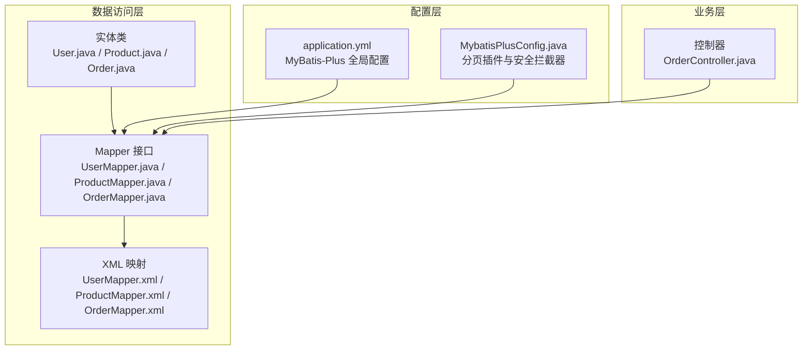
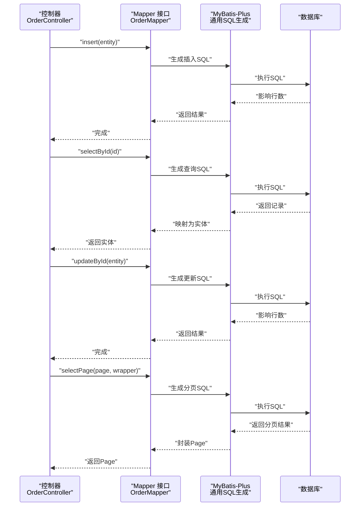
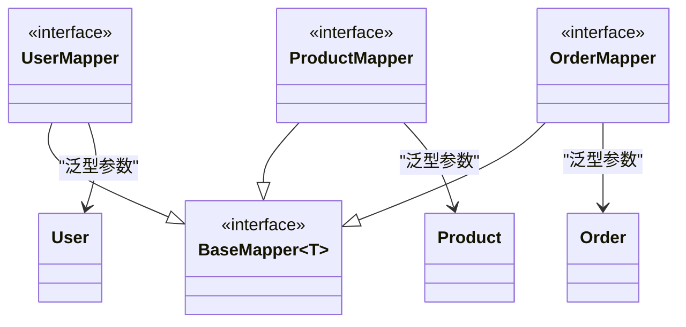
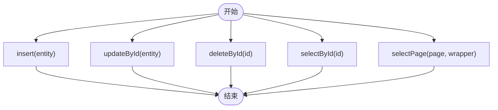
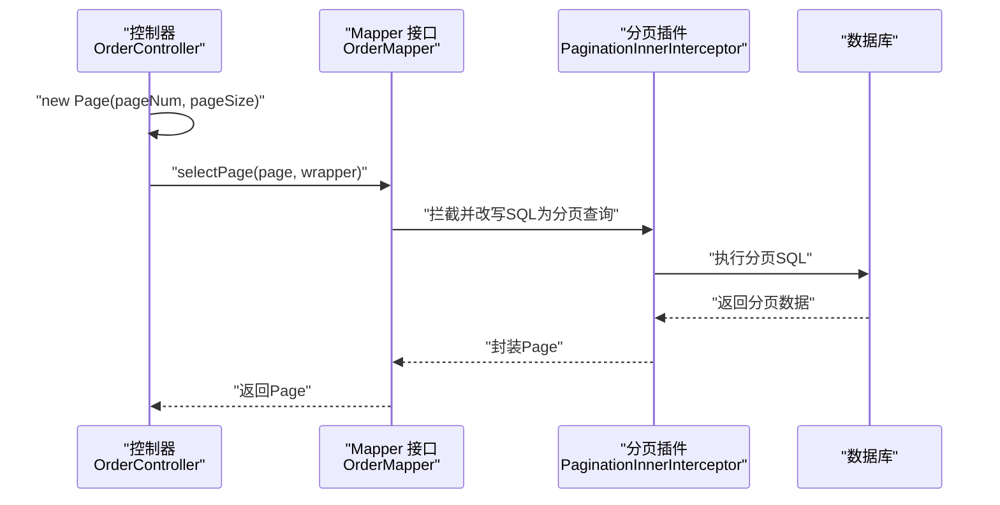
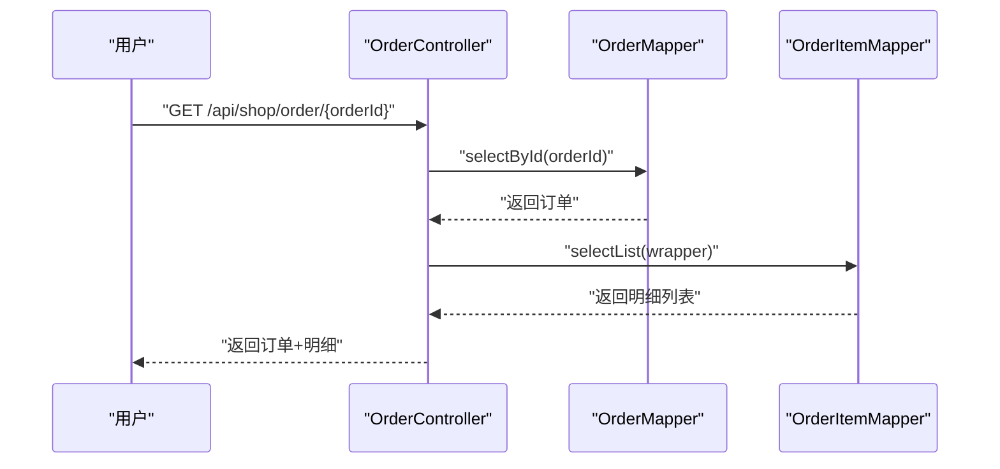
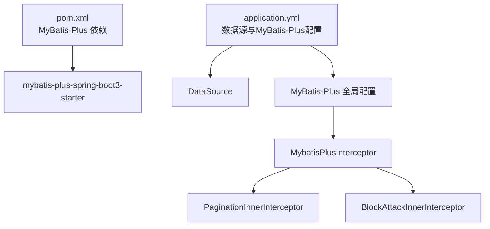

# BaseMapper基础接口使用

<cite>
**本文引用的文件**
- [UserMapper.java](file://task-manager-backend/src/main/java/com/taskmanager/mapper/UserMapper.java)
- [ProductMapper.java](file://task-manager-backend/src/main/java/com/taskmanager/mapper/ProductMapper.java)
- [OrderMapper.java](file://task-manager-backend/src/main/java/com/taskmanager/mapper/OrderMapper.java)
- [MybatisPlusConfig.java](file://task-manager-backend/src/main/java/com/taskmanager/config/MybatisPlusConfig.java)
- [application.yml](file://task-manager-backend/src/main/resources/application.yml)
- [User.java](file://task-manager-backend/src/main/java/com/taskmanager/entity/User.java)
- [Product.java](file://task-manager-backend/src/main/java/com/taskmanager/domain/Product.java)
- [Order.java](file://task-manager-backend/src/main/java/com/taskmanager/domain/Order.java)
- [UserMapper.xml](file://task-manager-backend/src/main/resources/mapper/UserMapper.xml)
- [ProductMapper.xml](file://task-manager-backend/src/main/resources/mapper/ProductMapper.xml)
- [OrderController.java](file://task-manager-backend/src/main/java/com/taskmanager/controller/OrderController.java)
- [pom.xml](file://task-manager-backend/pom.xml)
</cite>

## 目录
1. [引言](#引言)
2. [项目结构](#项目结构)
3. [核心组件](#核心组件)
4. [架构概览](#架构概览)
5. [详细组件分析](#详细组件分析)
6. [依赖分析](#依赖分析)
7. [性能考虑](#性能考虑)
8. [故障排除指南](#故障排除指南)
9. [结论](#结论)
10. [附录](#附录)

## 引言
本文件面向使用 MyBatis-Plus 的开发者，系统性讲解 BaseMapper 基础接口的使用方法，涵盖以下主题：
- BaseMapper 继承机制与泛型参数设置
- 实体类与数据库表的映射关系
- CRUD 基本操作方法的参数与返回值
- 分页查询 Page 对象的使用与分页插件配置
- 在不同业务场景中的实际应用示例
- BaseMapper 与 XML 映射文件的关系与优先级

## 项目结构
该后端工程采用 Spring Boot + MyBatis-Plus 架构，遵循“领域模型 + Mapper 接口 + XML 映射 + 控制器”的分层组织方式。与 BaseMapper 相关的关键目录与文件如下：
- 实体类：位于 domain/entity 包，标注表名与主键策略
- Mapper 接口：位于 mapper 包，统一继承 BaseMapper<T>
- XML 映射：位于 resources/mapper 目录，按 Mapper 接口命名
- 配置：Spring Boot 配置文件与 MyBatis-Plus 配置类

图表来源
- [UserMapper.java:1-22](file://task-manager-backend/src/main/java/com/taskmanager/mapper/UserMapper.java#L1-L22)
- [ProductMapper.java:1-40](file://task-manager-backend/src/main/java/com/taskmanager/mapper/ProductMapper.java#L1-L40)
- [OrderMapper.java:1-15](file://task-manager-backend/src/main/java/com/taskmanager/mapper/OrderMapper.java#L1-L15)
- [application.yml:33-44](file://task-manager-backend/src/main/resources/application.yml#L33-L44)
- [MybatisPlusConfig.java:16-31](file://task-manager-backend/src/main/java/com/taskmanager/config/MybatisPlusConfig.java#L16-L31)
- [OrderController.java:41-54](file://task-manager-backend/src/main/java/com/taskmanager/controller/OrderController.java#L41-L54)

章节来源
- [UserMapper.java:1-22](file://task-manager-backend/src/main/java/com/taskmanager/mapper/UserMapper.java#L1-L22)
- [ProductMapper.java:1-40](file://task-manager-backend/src/main/java/com/taskmanager/mapper/ProductMapper.java#L1-L40)
- [OrderMapper.java:1-15](file://task-manager-backend/src/main/java/com/taskmanager/mapper/OrderMapper.java#L1-L15)
- [application.yml:33-44](file://task-manager-backend/src/main/resources/application.yml#L33-L44)
- [MybatisPlusConfig.java:16-31](file://task-manager-backend/src/main/java/com/taskmanager/config/MybatisPlusConfig.java#L16-L31)
- [OrderController.java:41-54](file://task-manager-backend/src/main/java/com/taskmanager/controller/OrderController.java#L41-L54)

## 核心组件
- BaseMapper 泛型参数：接口定义时以实体类型作为泛型参数，例如 UserMapper extends BaseMapper<User>，表示该 Mapper 负责 User 实体的 CRUD。
- 实体类映射：通过 @TableName、@TableId 等注解建立实体与数据库表的映射关系；全局配置 application.yml 中开启下划线到驼峰映射，简化命名差异。
- 自动实现能力：继承 BaseMapper 后，即可直接使用 insert、updateById、deleteById、selectById、selectPage 等通用方法，无需编写 SQL。
- XML 映射补充：当需要复杂查询或自定义 SQL 时，在 XML 中编写语句，MyBatis-Plus 会自动加载并执行。

章节来源
- [UserMapper.java:11-12](file://task-manager-backend/src/main/java/com/taskmanager/mapper/UserMapper.java#L11-L12)
- [ProductMapper.java:15](file://task-manager-backend/src/main/java/com/taskmanager/mapper/ProductMapper.java#L15)
- [OrderMapper.java:12-13](file://task-manager-backend/src/main/java/com/taskmanager/mapper/OrderMapper.java#L12-L13)
- [User.java:12-19](file://task-manager-backend/src/main/java/com/taskmanager/entity/User.java#L12-L19)
- [Product.java:21-28](file://task-manager-backend/src/main/java/com/taskmanager/domain/Product.java#L21-L28)
- [Order.java:20-27](file://task-manager-backend/src/main/java/com/taskmanager/domain/Order.java#L20-L27)
- [application.yml:35-36](file://task-manager-backend/src/main/resources/application.yml#L35-L36)

## 架构概览
下面的序列图展示了基于 BaseMapper 的典型调用链路：控制器通过注入的 Mapper 接口调用通用方法，MyBatis-Plus 将方法解析为 SQL 并执行，最终返回结果。

图表来源
- [OrderController.java:140-141](file://task-manager-backend/src/main/java/com/taskmanager/controller/OrderController.java#L140-L141)
- [OrderController.java:175-176](file://task-manager-backend/src/main/java/com/taskmanager/controller/OrderController.java#L175-L176)
- [OrderController.java:207-208](file://task-manager-backend/src/main/java/com/taskmanager/controller/OrderController.java#L207-L208)
- [OrderController.java:162-166](file://task-manager-backend/src/main/java/com/taskmanager/controller/OrderController.java#L162-L166)

## 详细组件分析

### BaseMapper 继承与泛型参数
- 继承关系：所有业务 Mapper 均继承 BaseMapper<T>，其中 T 为对应的实体类型。例如 UserMapper、ProductMapper、OrderMapper。
- 泛型约束：MyBatis-Plus 通过泛型推断实体类型，从而确定表名、主键列等元信息。
- 注解驱动映射：实体类通过 @TableName、@TableId 等注解声明表与主键映射；application.yml 中开启 map-underscore-to-camel-case，可自动处理下划线字段与 Java 属性的映射。

图表来源
- [UserMapper.java:11-12](file://task-manager-backend/src/main/java/com/taskmanager/mapper/UserMapper.java#L11-L12)
- [ProductMapper.java:15](file://task-manager-backend/src/main/java/com/taskmanager/mapper/ProductMapper.java#L15)
- [OrderMapper.java:12-13](file://task-manager-backend/src/main/java/com/taskmanager/mapper/OrderMapper.java#L12-L13)
- [User.java:12-19](file://task-manager-backend/src/main/java/com/taskmanager/entity/User.java#L12-L19)
- [Product.java:21-28](file://task-manager-backend/src/main/java/com/taskmanager/domain/Product.java#L21-L28)
- [Order.java:20-27](file://task-manager-backend/src/main/java/com/taskmanager/domain/Order.java#L20-L27)

章节来源
- [UserMapper.java:11-12](file://task-manager-backend/src/main/java/com/taskmanager/mapper/UserMapper.java#L11-L12)
- [ProductMapper.java:15](file://task-manager-backend/src/main/java/com/taskmanager/mapper/ProductMapper.java#L15)
- [OrderMapper.java:12-13](file://task-manager-backend/src/main/java/com/taskmanager/mapper/OrderMapper.java#L12-L13)
- [User.java:12-19](file://task-manager-backend/src/main/java/com/taskmanager/entity/User.java#L12-L19)
- [Product.java:21-28](file://task-manager-backend/src/main/java/com/taskmanager/domain/Product.java#L21-L28)
- [Order.java:20-27](file://task-manager-backend/src/main/java/com/taskmanager/domain/Order.java#L20-L27)
- [application.yml:35-36](file://task-manager-backend/src/main/resources/application.yml#L35-L36)

### CRUD 基本操作方法详解
- insert(entity)：插入一条记录，返回受影响的行数。适用于新增实体。
- updateById(entity)：根据主键更新整条记录，返回受影响的行数。适用于整体更新。
- deleteById(id)：根据主键删除记录，返回受影响的行数。适用于逻辑删除需配合全局配置。
- selectById(id)：根据主键查询单条记录，返回实体或空。
- selectPage(page, wrapper)：分页查询，返回 Page 结果集，常与 LambdaQueryWrapper 组合使用。

图表来源
- [OrderController.java:140-141](file://task-manager-backend/src/main/java/com/taskmanager/controller/OrderController.java#L140-L141)
- [OrderController.java:175-176](file://task-manager-backend/src/main/java/com/taskmanager/controller/OrderController.java#L175-L176)
- [OrderController.java:207-208](file://task-manager-backend/src/main/java/com/taskmanager/controller/OrderController.java#L207-L208)
- [OrderController.java:162-166](file://task-manager-backend/src/main/java/com/taskmanager/controller/OrderController.java#L162-L166)

章节来源
- [OrderController.java:140-141](file://task-manager-backend/src/main/java/com/taskmanager/controller/OrderController.java#L140-L141)
- [OrderController.java:175-176](file://task-manager-backend/src/main/java/com/taskmanager/controller/OrderController.java#L175-L176)
- [OrderController.java:207-208](file://task-manager-backend/src/main/java/com/taskmanager/controller/OrderController.java#L207-L208)
- [OrderController.java:162-166](file://task-manager-backend/src/main/java/com/taskmanager/controller/OrderController.java#L162-L166)

### 分页查询 Page 对象与分页插件
- Page 对象：构造时传入当前页与每页大小；查询后 Page 内包含 records、total、pages 等信息。
- 分页插件：MybatisPlusConfig 中注册 MybatisPlusInterceptor，并添加 PaginationInnerInterceptor（MySQL）与 BlockAttackInnerInterceptor（防止全表更新/删除）。
- 配置位置：application.yml 中指定 mapper-locations 与全局配置（如逻辑删除字段）。

图表来源
- [OrderController.java:158-167](file://task-manager-backend/src/main/java/com/taskmanager/controller/OrderController.java#L158-L167)
- [MybatisPlusConfig.java:22-30](file://task-manager-backend/src/main/java/com/taskmanager/config/MybatisPlusConfig.java#L22-L30)
- [application.yml:38](file://task-manager-backend/src/main/resources/application.yml#L38)

章节来源
- [OrderController.java:158-167](file://task-manager-backend/src/main/java/com/taskmanager/controller/OrderController.java#L158-L167)
- [MybatisPlusConfig.java:22-30](file://task-manager-backend/src/main/java/com/taskmanager/config/MybatisPlusConfig.java#L22-L30)
- [application.yml:38](file://task-manager-backend/src/main/resources/application.yml#L38)

### 业务场景示例
- 新增订单：控制器组装订单与订单明细，分别调用 OrderMapper.insert 与 OrderItemMapper.insert 完成持久化。
- 查询订单详情：先通过 OrderMapper.selectById 获取订单，再通过 OrderItemMapper.selectList 获取明细集合，最后组合返回。
- 取消订单：先校验订单状态与权限，再将状态更新为已取消（updateById），同时恢复对应库存。
- 分页查询订单：控制器构造 Page 与 LambdaQueryWrapper，调用 OrderMapper.selectPage 返回分页结果。

图表来源
- [OrderController.java:173-187](file://task-manager-backend/src/main/java/com/taskmanager/controller/OrderController.java#L173-L187)

章节来源
- [OrderController.java:140-141](file://task-manager-backend/src/main/java/com/taskmanager/controller/OrderController.java#L140-L141)
- [OrderController.java:144-147](file://task-manager-backend/src/main/java/com/taskmanager/controller/OrderController.java#L144-L147)
- [OrderController.java:175-187](file://task-manager-backend/src/main/java/com/taskmanager/controller/OrderController.java#L175-L187)
- [OrderController.java:192-232](file://task-manager-backend/src/main/java/com/taskmanager/controller/OrderController.java#L192-L232)
- [OrderController.java:158-167](file://task-manager-backend/src/main/java/com/taskmanager/controller/OrderController.java#L158-L167)

### BaseMapper 与 XML 映射文件的关系与优先级
- 默认优先：当 Mapper 接口中未声明同名方法时，MyBatis-Plus 使用通用 SQL；当声明了同名方法时，XML 中的 SQL 会被优先执行。
- 自定义扩展：若需要复杂查询或特殊 SQL，可在 XML 中定义方法并保持方法名一致，即可覆盖默认行为。
- 示例参考：
  - UserMapper.xml 定义了 selectByUsername 方法，与接口中的同名方法对应。
  - ProductMapper.xml 定义了 selectProductList 与 selectProductById 的复杂查询，结合动态 SQL 条件过滤。

章节来源
- [UserMapper.java:20](file://task-manager-backend/src/main/java/com/taskmanager/mapper/UserMapper.java#L20)
- [UserMapper.xml:5-10](file://task-manager-backend/src/main/resources/mapper/UserMapper.xml#L5-L10)
- [ProductMapper.java:28-33](file://task-manager-backend/src/main/java/com/taskmanager/mapper/ProductMapper.java#L28-L33)
- [ProductMapper.xml:26-46](file://task-manager-backend/src/main/resources/mapper/ProductMapper.xml#L26-L46)

## 依赖分析
- MyBatis-Plus 版本：pom.xml 中声明 mybatis-plus-spring-boot3-starter 版本为 3.5.5，确保 BaseMapper 与分页插件正常工作。
- 数据源与连接池：application.yml 中配置 MySQL 数据源与 HikariCP 连接池参数。
- 全局配置：逻辑删除字段、下划线转驼峰、XML 映射路径等均在 application.yml 中集中管理。

图表来源
- [pom.xml:57-62](file://task-manager-backend/pom.xml#L57-L62)
- [application.yml:5-16](file://task-manager-backend/src/main/resources/application.yml#L5-L16)
- [application.yml:33-44](file://task-manager-backend/src/main/resources/application.yml#L33-L44)
- [MybatisPlusConfig.java:22-30](file://task-manager-backend/src/main/java/com/taskmanager/config/MybatisPlusConfig.java#L22-L30)

章节来源
- [pom.xml:57-62](file://task-manager-backend/pom.xml#L57-L62)
- [application.yml:5-16](file://task-manager-backend/src/main/resources/application.yml#L5-L16)
- [application.yml:33-44](file://task-manager-backend/src/main/resources/application.yml#L33-L44)
- [MybatisPlusConfig.java:22-30](file://task-manager-backend/src/main/java/com/taskmanager/config/MybatisPlusConfig.java#L22-L30)

## 性能考虑
- 合理使用分页：避免一次性查询大量数据，优先使用 Page 对象进行分页。
- 条件查询优化：结合 LambdaQueryWrapper 构造精确条件，减少不必要的全表扫描。
- 批量操作：对于大批量新增/更新，建议使用批量方法或批处理以降低往返次数。
- 逻辑删除：利用全局逻辑删除配置，避免真实删除造成的数据丢失风险与索引维护成本。

## 故障排除指南
- 分页不生效：检查 MybatisPlusConfig 是否正确注册分页插件，以及 application.yml 中是否配置了正确的数据库类型。
- 字段映射异常：确认实体类注解与 application.yml 的 map-underscore-to-camel-case 设置一致。
- 自定义 SQL 未执行：确保 XML 文件命名与 Mapper 接口匹配，且方法名一致；必要时检查命名空间与 SQL ID。
- 逻辑删除无效：确认 application.yml 中逻辑删除字段与值配置正确，并在实体类中使用相应注解。

章节来源
- [MybatisPlusConfig.java:22-30](file://task-manager-backend/src/main/java/com/taskmanager/config/MybatisPlusConfig.java#L22-L30)
- [application.yml:35-36](file://task-manager-backend/src/main/resources/application.yml#L35-L36)
- [application.yml:42-44](file://task-manager-backend/src/main/resources/application.yml#L42-L44)
- [UserMapper.xml:3](file://task-manager-backend/src/main/resources/mapper/UserMapper.xml#L3)
- [ProductMapper.xml:4](file://task-manager-backend/src/main/resources/mapper/ProductMapper.xml#L4)

## 结论
通过继承 BaseMapper<T>，开发者可以快速获得完善的 CRUD 能力，并结合 XML 映射实现复杂查询。配合分页插件与全局配置，能够高效、安全地支撑各类业务场景。建议在团队内统一规范实体注解、Mapper 命名与 XML 结构，以提升可维护性与一致性。

## 附录
- 常用方法速查
  - insert(entity)：新增
  - updateById(entity)：按主键更新
  - deleteById(id)：按主键删除
  - selectById(id)：按主键查询
  - selectPage(page, wrapper)：分页查询
- 关键配置参考
  - application.yml：数据源、MyBatis-Plus 全局配置、XML 映射路径
  - MybatisPlusConfig.java：分页与安全拦截器注册