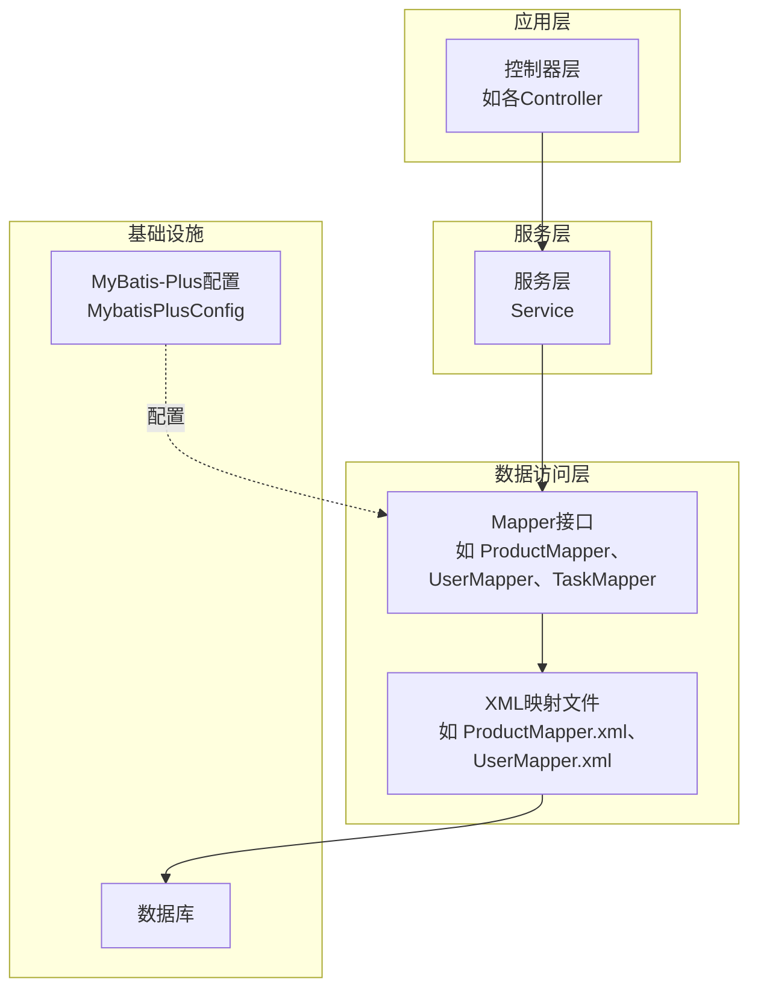
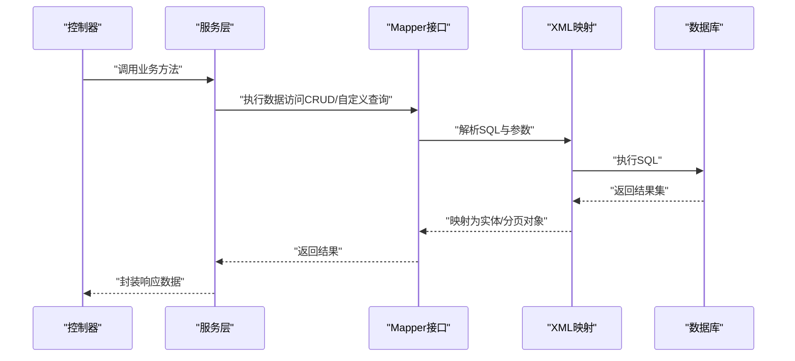
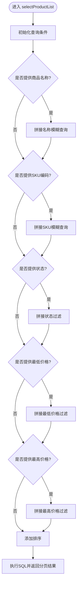
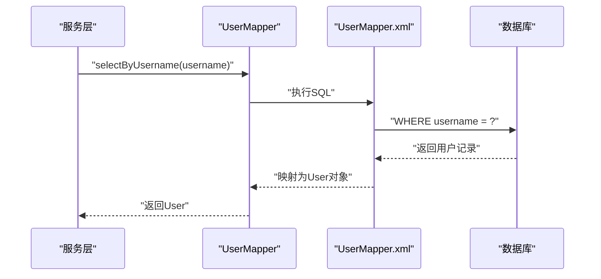
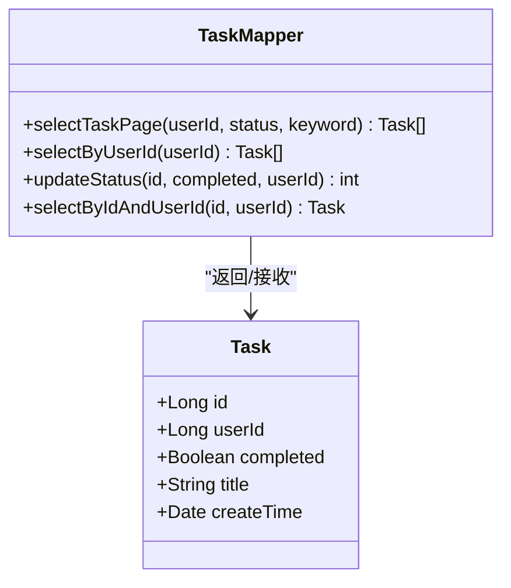
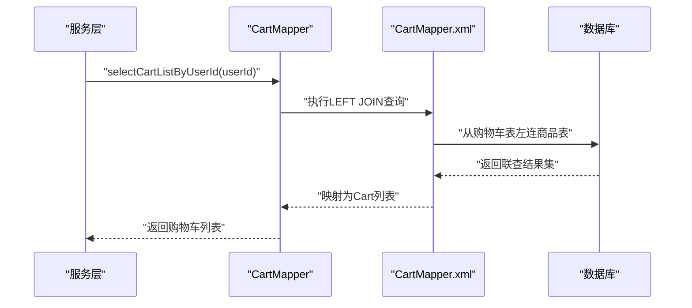
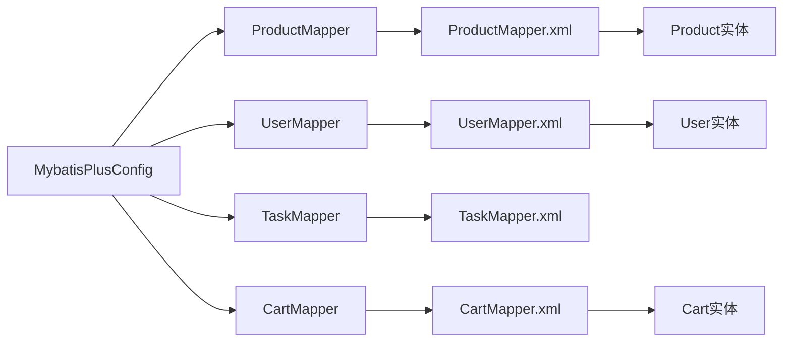

# Mapper接口设计

<cite>
**本文引用的文件**
- [ProductMapper.java](file://task-manager-backend/src/main/java/com/taskmanager/mapper/ProductMapper.java)
- [UserMapper.java](file://task-manager-backend/src/main/java/com/taskmanager/mapper/UserMapper.java)
- [OrderMapper.java](file://task-manager-backend/src/main/java/com/taskmanager/mapper/OrderMapper.java)
- [CartMapper.java](file://task-manager-backend/src/main/java/com/taskmanager/mapper/CartMapper.java)
- [TaskMapper.java](file://task-manager-backend/src/main/java/com/taskmanager/mapper/TaskMapper.java)
- [ProductMapper.xml](file://task-manager-backend/src/main/resources/mapper/ProductMapper.xml)
- [UserMapper.xml](file://task-manager-backend/src/main/resources/mapper/UserMapper.xml)
- [CartMapper.xml](file://task-manager-backend/src/main/resources/mapper/CartMapper.xml)
- [MybatisPlusConfig.java](file://task-manager-backend/src/main/java/com/taskmanager/config/MybatisPlusConfig.java)
- [Product.java](file://task-manager-backend/src/main/java/com/taskmanager/domain/Product.java)
- [User.java](file://task-manager-backend/src/main/java/com/taskmanager/entity/User.java)
- [BaseControllerTest.java](file://task-manager-backend/src/test/java/com/taskmanager/controller/BaseControllerTest.java)
</cite>

## 目录
1. [引言](#引言)
2. [项目结构](#项目结构)
3. [核心组件](#核心组件)
4. [架构总览](#架构总览)
5. [详细组件分析](#详细组件分析)
6. [依赖分析](#依赖分析)
7. [性能考虑](#性能考虑)
8. [故障排查指南](#故障排查指南)
9. [结论](#结论)
10. [附录](#附录)

## 引言
本文件围绕Mapper接口设计进行系统化技术文档整理，重点覆盖以下方面：
- 通用Mapper接口（BaseMapper）的继承与使用：泛型参数设置、基础CRUD方法的调用方式与最佳实践。
- 自定义Mapper接口设计原则：方法命名规范、参数传递方式、返回值类型选择与扩展能力。
- 复杂查询方法实现策略：多表关联查询、条件查询、聚合查询的实现路径与注意事项。
- Mapper接口的单元测试编写方法与Mock对象使用：结合控制器测试基类示例，展示如何在测试中隔离Mapper层。
- 性能优化技巧与SQL执行计划分析：分页、条件过滤、索引利用与拦截器配置对性能的影响。
- Mapper与Service层交互模式及事务管理：Mapper职责边界、Service编排与事务控制策略。

## 项目结构
该后端工程采用典型的分层架构，Mapper位于数据访问层，负责与数据库交互；XML映射文件定义SQL语句与结果映射；MyBatis-Plus配置提供分页与安全防护；领域模型与实体类分别对应业务域对象与持久化实体。

图表来源
- [ProductMapper.java:1-40](file://task-manager-backend/src/main/java/com/taskmanager/mapper/ProductMapper.java#L1-L40)
- [UserMapper.java:1-22](file://task-manager-backend/src/main/java/com/taskmanager/mapper/UserMapper.java#L1-L22)
- [TaskMapper.java:1-57](file://task-manager-backend/src/main/java/com/taskmanager/mapper/TaskMapper.java#L1-L57)
- [ProductMapper.xml:1-55](file://task-manager-backend/src/main/resources/mapper/ProductMapper.xml#L1-L55)
- [UserMapper.xml:1-13](file://task-manager-backend/src/main/resources/mapper/UserMapper.xml#L1-L13)
- [MybatisPlusConfig.java:1-32](file://task-manager-backend/src/main/java/com/taskmanager/config/MybatisPlusConfig.java#L1-L32)

章节来源
- [ProductMapper.java:1-40](file://task-manager-backend/src/main/java/com/taskmanager/mapper/ProductMapper.java#L1-L40)
- [UserMapper.java:1-22](file://task-manager-backend/src/main/java/com/taskmanager/mapper/UserMapper.java#L1-L22)
- [TaskMapper.java:1-57](file://task-manager-backend/src/main/java/com/taskmanager/mapper/TaskMapper.java#L1-L57)
- [ProductMapper.xml:1-55](file://task-manager-backend/src/main/resources/mapper/ProductMapper.xml#L1-L55)
- [UserMapper.xml:1-13](file://task-manager-backend/src/main/resources/mapper/UserMapper.xml#L1-L13)
- [MybatisPlusConfig.java:1-32](file://task-manager-backend/src/main/java/com/taskmanager/config/MybatisPlusConfig.java#L1-L32)

## 核心组件
- 通用Mapper接口（BaseMapper）继承与泛型参数
  - 所有自定义Mapper均通过继承BaseMapper并绑定具体实体类型，实现泛型化的CRUD能力。
  - 示例：ProductMapper继承BaseMapper<Product>，UserMapper继承BaseMapper<User>，TaskMapper继承BaseMapper<Task>。
- 基础CRUD方法调用
  - 继承自BaseMapper的方法包括保存、按主键更新、按主键删除、按主键查询单条记录、查询列表等。
  - 在Service层直接调用或通过自定义方法扩展查询。
- 自定义Mapper方法设计
  - 方法命名遵循“动词+名词”或“动词+条件”的约定，清晰表达意图。
  - 参数使用@Param标注，便于XML中通过#{}取值；支持多参数、可选参数与分页参数。
  - 返回值类型根据查询结果选择：单个实体、集合、分页对象、影响行数等。

章节来源
- [ProductMapper.java:15-39](file://task-manager-backend/src/main/java/com/taskmanager/mapper/ProductMapper.java#L15-L39)
- [UserMapper.java:12-21](file://task-manager-backend/src/main/java/com/taskmanager/mapper/UserMapper.java#L12-L21)
- [TaskMapper.java:14-56](file://task-manager-backend/src/main/java/com/taskmanager/mapper/TaskMapper.java#L14-L56)

## 架构总览
Mapper层与Service层的交互遵循“职责分离”原则：Mapper专注数据访问与SQL映射，Service负责业务编排与事务控制。MyBatis-Plus配置提供分页与安全防护，确保查询性能与安全性。

图表来源
- [ProductMapper.java:28-33](file://task-manager-backend/src/main/java/com/taskmanager/mapper/ProductMapper.java#L28-L33)
- [ProductMapper.xml:27-46](file://task-manager-backend/src/main/resources/mapper/ProductMapper.xml#L27-L46)
- [MybatisPlusConfig.java:23-30](file://task-manager-backend/src/main/java/com/taskmanager/config/MybatisPlusConfig.java#L23-L30)

## 详细组件分析

### ProductMapper：分页与条件查询
- 继承关系与泛型参数
  - 继承BaseMapper<Product>，获得Product实体的通用CRUD能力。
- 自定义方法
  - 分页查询：接收分页对象与多个条件参数，返回分页结果。
  - 条件查询：按商品ID查询详情。
- XML映射要点
  - 使用条件标签实现动态SQL，支持模糊匹配与范围过滤。
  - 结果映射使用resultMap以保证字段到属性的精确映射。
- 复杂度与性能
  - 动态SQL在条件较多时需注意索引与执行计划；建议对高频过滤字段建立索引。

图表来源
- [ProductMapper.java:28-33](file://task-manager-backend/src/main/java/com/taskmanager/mapper/ProductMapper.java#L28-L33)
- [ProductMapper.xml:27-46](file://task-manager-backend/src/main/resources/mapper/ProductMapper.xml#L27-L46)

章节来源
- [ProductMapper.java:15-39](file://task-manager-backend/src/main/java/com/taskmanager/mapper/ProductMapper.java#L15-L39)
- [ProductMapper.xml:1-55](file://task-manager-backend/src/main/resources/mapper/ProductMapper.xml#L1-L55)
- [Product.java:22-96](file://task-manager-backend/src/main/java/com/taskmanager/domain/Product.java#L22-L96)

### UserMapper：简单条件查询
- 继承关系与泛型参数
  - 继承BaseMapper<User>，获得User实体的通用CRUD能力。
- 自定义方法
  - 按用户名查询用户，返回单个用户对象。
- XML映射要点
  - 精简列投影，仅查询必要字段，减少网络与内存开销。
- 复杂度与性能
  - 单字段等值查询，适合在username上建立唯一索引以提升命中率。

图表来源
- [UserMapper.java:20-21](file://task-manager-backend/src/main/java/com/taskmanager/mapper/UserMapper.java#L20-L21)
- [UserMapper.xml:6-10](file://task-manager-backend/src/main/resources/mapper/UserMapper.xml#L6-L10)

章节来源
- [UserMapper.java:12-21](file://task-manager-backend/src/main/java/com/taskmanager/mapper/UserMapper.java#L12-L21)
- [UserMapper.xml:1-13](file://task-manager-backend/src/main/resources/mapper/UserMapper.xml#L1-L13)
- [User.java:13-30](file://task-manager-backend/src/main/java/com/taskmanager/entity/User.java#L13-L30)

### TaskMapper：条件查询与状态更新
- 继承关系与泛型参数
  - 继承BaseMapper<Task>，获得Task实体的通用CRUD能力。
- 自定义方法
  - 分页查询任务列表：支持用户ID、状态、关键词过滤。
  - 按用户ID查询任务列表。
  - 更新任务状态：带权限校验参数，返回影响行数。
  - 复合条件查询：按ID与用户ID联合查询。
- 设计要点
  - 多参数方法使用@Param标注，避免默认参数名歧义。
  - 状态更新返回影响行数，便于上层判断操作是否生效。

图表来源
- [TaskMapper.java:14-56](file://task-manager-backend/src/main/java/com/taskmanager/mapper/TaskMapper.java#L14-L56)

章节来源
- [TaskMapper.java:14-56](file://task-manager-backend/src/main/java/com/taskmanager/mapper/TaskMapper.java#L14-L56)

### CartMapper：多表关联查询
- 继承关系与泛型参数
  - 继承BaseMapper<Cart>，获得Cart实体的通用CRUD能力。
- 自定义方法
  - 按用户ID查询购物车列表，并联查商品名称、图片、单价与单位。
- XML映射要点
  - 使用LEFT JOIN连接商品表，过滤已删除商品，保证购物车完整性。
  - 明确列映射，避免N+1问题，提升查询效率。

图表来源
- [CartMapper.java:24-25](file://task-manager-backend/src/main/java/com/taskmanager/mapper/CartMapper.java#L24-L25)
- [CartMapper.xml:5-12](file://task-manager-backend/src/main/resources/mapper/CartMapper.xml#L5-L12)

章节来源
- [CartMapper.java:16-25](file://task-manager-backend/src/main/java/com/taskmanager/mapper/CartMapper.java#L16-L25)
- [CartMapper.xml:1-15](file://task-manager-backend/src/main/resources/mapper/CartMapper.xml#L1-L15)

### OrderMapper：空实现Mapper
- 继承关系与泛型参数
  - 继承BaseMapper<Order>，未声明自定义方法，完全复用通用CRUD能力。
- 设计建议
  - 若后续需要复杂查询，可在接口中新增方法并在XML中实现。

章节来源
- [OrderMapper.java:12-14](file://task-manager-backend/src/main/java/com/taskmanager/mapper/OrderMapper.java#L12-L14)

## 依赖分析
- Mapper与XML映射
  - Mapper接口方法名需与XML中的id一致，参数通过@Param与#{}绑定。
- Mapper与MyBatis-Plus配置
  - 分页插件用于支持分页查询；安全插件防止误操作全表更新/删除。
- Mapper与实体类
  - 实体类注解定义表名与字段映射，XML中resultMap与resultType需与实体保持一致。

图表来源
- [ProductMapper.java:15-39](file://task-manager-backend/src/main/java/com/taskmanager/mapper/ProductMapper.java#L15-L39)
- [ProductMapper.xml:1-55](file://task-manager-backend/src/main/resources/mapper/ProductMapper.xml#L1-L55)
- [UserMapper.java:12-21](file://task-manager-backend/src/main/java/com/taskmanager/mapper/UserMapper.java#L12-L21)
- [UserMapper.xml:1-13](file://task-manager-backend/src/main/resources/mapper/UserMapper.xml#L1-L13)
- [TaskMapper.java:14-56](file://task-manager-backend/src/main/java/com/taskmanager/mapper/TaskMapper.java#L14-L56)
- [CartMapper.java:16-25](file://task-manager-backend/src/main/java/com/taskmanager/mapper/CartMapper.java#L16-L25)
- [CartMapper.xml:1-15](file://task-manager-backend/src/main/resources/mapper/CartMapper.xml#L1-L15)
- [MybatisPlusConfig.java:23-30](file://task-manager-backend/src/main/java/com/taskmanager/config/MybatisPlusConfig.java#L23-L30)

章节来源
- [MybatisPlusConfig.java:1-32](file://task-manager-backend/src/main/java/com/taskmanager/config/MybatisPlusConfig.java#L1-L32)

## 性能考虑
- 分页与拦截器
  - 通过分页插件实现物理分页，避免一次性加载大量数据；在复杂查询中优先使用分页。
- 条件过滤与索引
  - 动态SQL中常用字段应建立索引，如商品名称、SKU、状态、价格区间等。
- 结果映射与投影
  - 精简查询列，避免SELECT *；使用resultMap确保字段映射准确，减少ORM处理开销。
- 安全防护
  - 启用全表更新/删除拦截器，防止误操作导致性能与数据安全问题。
- SQL执行计划分析
  - 建议在开发环境开启慢查询日志与执行计划分析，定位热点SQL并优化索引与查询条件。

章节来源
- [MybatisPlusConfig.java:23-30](file://task-manager-backend/src/main/java/com/taskmanager/config/MybatisPlusConfig.java#L23-L30)
- [ProductMapper.xml:27-46](file://task-manager-backend/src/main/resources/mapper/ProductMapper.xml#L27-L46)
- [CartMapper.xml:5-12](file://task-manager-backend/src/main/resources/mapper/CartMapper.xml#L5-L12)

## 故障排查指南
- 常见问题
  - 方法名不匹配：Mapper接口方法名需与XML中id一致，否则无法找到SQL。
  - 参数绑定错误：多参数必须使用@Param标注，避免默认参数名导致的绑定失败。
  - 返回类型不匹配：resultType与实体类不一致会导致映射异常。
  - 分页失效：未正确传入分页对象或未启用分页插件。
- 测试辅助
  - 可参考控制器测试基类提供的Mock配置，模拟认证与外部依赖，隔离Mapper层进行单元测试验证。

章节来源
- [BaseControllerTest.java:40-88](file://task-manager-backend/src/test/java/com/taskmanager/controller/BaseControllerTest.java#L40-L88)

## 结论
本项目通过继承BaseMapper实现统一的数据访问能力，结合XML映射实现灵活的查询与结果映射。自定义Mapper方法遵循清晰的命名与参数规范，配合分页与安全拦截器，兼顾了功能完整性与运行效率。建议在复杂查询场景中持续优化索引与SQL执行计划，并通过单元测试与Mock机制保障Mapper层的稳定性与可维护性。

## 附录
- 设计最佳实践
  - 命名规范：动词+名词或动词+条件，明确方法意图。
  - 参数传递：多参数使用@Param，保持参数名稳定且语义清晰。
  - 返回值选择：单条记录返回实体，集合返回List，分页返回Page，影响行数返回int。
  - 复杂查询：优先使用条件标签与合理索引，避免全表扫描。
  - 事务管理：Mapper层不直接处理事务，由Service层统一管理，确保业务一致性。