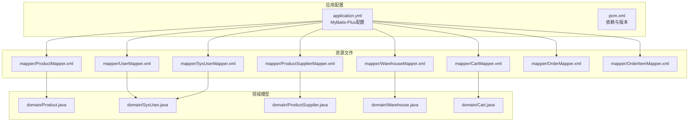
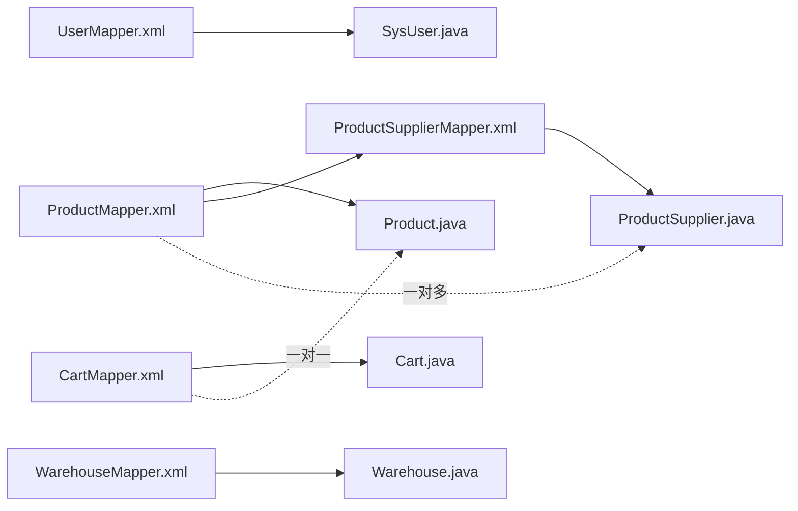
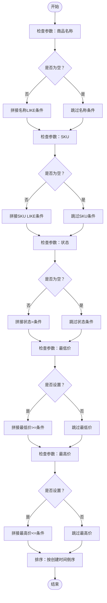
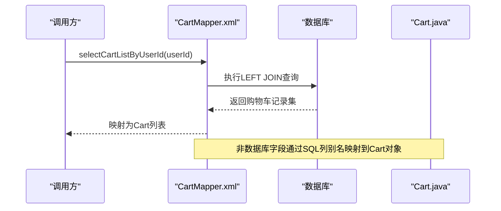
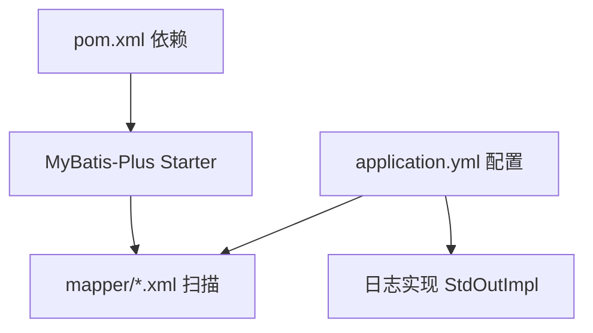

# XML映射配置

<cite>
**本文引用的文件**
- [application.yml](file://task-manager-backend/src/main/resources/application.yml)
- [pom.xml](file://task-manager-backend/pom.xml)
- [UserMapper.xml](file://task-manager-backend/src/main/resources/mapper/UserMapper.xml)
- [ProductMapper.xml](file://task-manager-backend/src/main/resources/mapper/ProductMapper.xml)
- [SysUserMapper.xml](file://task-manager-backend/src/main/resources/mapper/SysUserMapper.xml)
- [WarehouseMapper.xml](file://task-manager-backend/src/main/resources/mapper/WarehouseMapper.xml)
- [ProductSupplierMapper.xml](file://task-manager-backend/src/main/resources/mapper/ProductSupplierMapper.xml)
- [CartMapper.xml](file://task-manager-backend/src/main/resources/mapper/CartMapper.xml)
- [OrderMapper.xml](file://task-manager-backend/src/main/resources/mapper/OrderMapper.xml)
- [OrderItemMapper.xml](file://task-manager-backend/src/main/resources/mapper/OrderItemMapper.xml)
- [Product.java](file://task-manager-backend/src/main/java/com/taskmanager/domain/Product.java)
- [SysUser.java](file://task-manager-backend/src/main/java/com/taskmanager/domain/SysUser.java)
- [ProductSupplier.java](file://task-manager-backend/src/main/java/com/taskmanager/domain/ProductSupplier.java)
- [Warehouse.java](file://task-manager-backend/src/main/java/com/taskmanager/domain/Warehouse.java)
- [Cart.java](file://task-manager-backend/src/main/java/com/taskmanager/domain/Cart.java)
</cite>

## 目录
1. [引言](#引言)
2. [项目结构](#项目结构)
3. [核心组件](#核心组件)
4. [架构总览](#架构总览)
5. [详细组件分析](#详细组件分析)
6. [依赖分析](#依赖分析)
7. [性能考虑](#性能考虑)
8. [故障排查指南](#故障排查指南)
9. [结论](#结论)
10. [附录](#附录)

## 引言
本技术文档围绕XML映射配置展开，系统性阐述命名空间(namespace)、resultMap、sql标签的结构与配置要点；详解动态SQL的编写技巧（if、choose/when/otherwise、foreach等）；给出复杂关联查询的一对一、一对多、多对多映射策略；说明SQL片段抽取与复用（sql/include）机制；提供调试与SQL执行分析方法，并对比XML映射与注解方式的选择建议。

## 项目结构
MyBatis-Plus在Spring Boot中通过配置扫描mapper目录下的XML映射文件，结合实体类完成ORM映射。项目中各模块的XML映射文件位于resources/mapper目录，命名空间与Mapper接口包路径一致，便于自动识别与绑定。

图表来源
- [application.yml:33-44](file://task-manager-backend/src/main/resources/application.yml#L33-L44)
- [pom.xml:57-62](file://task-manager-backend/pom.xml#L57-L62)

章节来源
- [application.yml:1-79](file://task-manager-backend/src/main/resources/application.yml#L1-L79)
- [pom.xml:1-206](file://task-manager-backend/pom.xml#L1-L206)

## 核心组件
- 命名空间(namespace)：每个mapper XML的根元素包含namespace属性，值为对应Mapper接口的全限定名，用于将XML语句与Java接口绑定。
- 结果映射(resultMap)：通过id、result、association、collection等标签建立数据库列与实体类字段的映射关系，支持驼峰命名自动转换。
- 动态SQL：if、choose/when/otherwise、trim、where、set、foreach等标签用于构建条件查询、批量处理与条件更新。
- SQL片段(sql/include)：将重复SQL抽取到sql标签中，通过include进行复用，提升可维护性。
- 关联查询：通过resultMap中的association(collection)实现一对一、一对多、多对多的嵌套结果映射。

章节来源
- [application.yml:33-44](file://task-manager-backend/src/main/resources/application.yml#L33-L44)
- [ProductMapper.xml:6-24](file://task-manager-backend/src/main/resources/mapper/ProductMapper.xml#L6-L24)
- [SysUserMapper.xml:6-27](file://task-manager-backend/src/main/resources/mapper/SysUserMapper.xml#L6-L27)
- [WarehouseMapper.xml:23-46](file://task-manager-backend/src/main/resources/mapper/WarehouseMapper.xml#L23-L46)

## 架构总览
下图展示XML映射文件与实体类之间的映射关系及典型查询流程。

图表来源
- [UserMapper.xml:3](file://task-manager-backend/src/main/resources/mapper/UserMapper.xml#L3)
- [ProductMapper.xml:4](file://task-manager-backend/src/main/resources/mapper/ProductMapper.xml#L4)
- [ProductSupplierMapper.xml:4](file://task-manager-backend/src/main/resources/mapper/ProductSupplierMapper.xml#L4)
- [WarehouseMapper.xml:4](file://task-manager-backend/src/main/resources/mapper/WarehouseMapper.xml#L4)
- [CartMapper.xml:3](file://task-manager-backend/src/main/resources/mapper/CartMapper.xml#L3)

## 详细组件分析

### 命名空间(namespace)与基础查询
- 命名空间必须与Mapper接口全限定名一致，以便MyBatis正确绑定。
- 基础查询示例展示了简单select语句与resultType的使用，适合单表直连查询。

章节来源
- [UserMapper.xml:3](file://task-manager-backend/src/main/resources/mapper/UserMapper.xml#L3)
- [UserMapper.xml:6-10](file://task-manager-backend/src/main/resources/mapper/UserMapper.xml#L6-L10)

### 结果映射(resultMap)与驼峰命名
- 使用resultMap时，id与result标签将数据库列映射到实体属性；association用于一对一，collection用于一对多。
- application.yml中开启下划线转驼峰映射，简化resultMap配置。

章节来源
- [ProductMapper.xml:6-24](file://task-manager-backend/src/main/resources/mapper/ProductMapper.xml#L6-L24)
- [SysUserMapper.xml:6-27](file://task-manager-backend/src/main/resources/mapper/SysUserMapper.xml#L6-L27)
- [application.yml:36](file://task-manager-backend/src/main/resources/application.yml#L36)

### 动态SQL：条件查询与批量处理
- 条件查询：if标签根据参数是否为空或非空拼接WHERE子句，如按名称、SKU、状态、价格区间过滤。
- 列表过滤：foreach遍历集合生成IN子句，常用于省/市/仓库类型等多值筛选。
- 复杂条件：choose/when/otherwise实现互斥条件分支，适合多种筛选维度的优先级判断。

图表来源
- [ProductMapper.xml:30-46](file://task-manager-backend/src/main/resources/mapper/ProductMapper.xml#L30-L46)

章节来源
- [ProductMapper.xml:30-46](file://task-manager-backend/src/main/resources/mapper/ProductMapper.xml#L30-L46)
- [WarehouseMapper.xml:33-38](file://task-manager-backend/src/main/resources/mapper/WarehouseMapper.xml#L33-L38)
- [SysUserMapper.xml:41-56](file://task-manager-backend/src/main/resources/mapper/SysUserMapper.xml#L41-L56)

### 复杂关联查询：一对一、一对多、多对多
- 一对一：CartMapper通过LEFT JOIN将商品信息映射到购物车结果，使用resultType直接映射非数据库字段（商品名、图片、单价、单位）。
- 一对多：ProductMapper与ProductSupplierMapper通过product_id关联，使用resultMap的collection实现一个商品对应多个供应商。
- 多对多：可通过中间表查询并使用resultMap的collection嵌套association实现，或在业务层合并数据。

图表来源
- [CartMapper.xml:5-12](file://task-manager-backend/src/main/resources/mapper/CartMapper.xml#L5-L12)
- [Cart.java:43-60](file://task-manager-backend/src/main/java/com/taskmanager/domain/Cart.java#L43-L60)

章节来源
- [CartMapper.xml:5-12](file://task-manager-backend/src/main/resources/mapper/CartMapper.xml#L5-L12)
- [ProductSupplierMapper.xml:26-32](file://task-manager-backend/src/main/resources/mapper/ProductSupplierMapper.xml#L26-L32)
- [Product.java:85-96](file://task-manager-backend/src/main/java/com/taskmanager/domain/Product.java#L85-L96)

### SQL片段抽取与复用(sql/include)
- 将重复SQL抽取到sql标签中，通过include引用，减少重复代码，提升可维护性。
- 在大型项目中，建议将分页、通用过滤条件、权限控制等抽取为可复用片段。

章节来源
- [WarehouseMapper.xml:23-46](file://task-manager-backend/src/main/resources/mapper/WarehouseMapper.xml#L23-L46)

### 动态SQL综合示例：部门树搜索
- 通过if与IN子句配合find_in_set实现部门树范围查询，体现动态SQL在复杂条件中的灵活性。

章节来源
- [SysUserMapper.xml:50-54](file://task-manager-backend/src/main/resources/mapper/SysUserMapper.xml#L50-L54)

## 依赖分析
- MyBatis-Plus Starter：提供MyBatis-Plus自动配置与增强能力。
- Mapper XML扫描：通过application.yml的mapper-locations加载resources/mapper下的XML文件。
- 日志输出：StdOutImpl将SQL与参数输出到控制台，便于调试。

图表来源
- [pom.xml:57-62](file://task-manager-backend/pom.xml#L57-L62)
- [application.yml:38](file://task-manager-backend/src/main/resources/application.yml#L38)
- [application.yml:37](file://task-manager-backend/src/main/resources/application.yml#L37)

章节来源
- [pom.xml:57-62](file://task-manager-backend/pom.xml#L57-L62)
- [application.yml:33-44](file://task-manager-backend/src/main/resources/application.yml#L33-L44)

## 性能考虑
- 合理使用索引：对常用过滤字段（如状态、名称、SKU、部门ID）建立索引。
- 避免SELECT *：仅选择必要字段，减少网络传输与反序列化开销。
- 分页查询：对大数据量列表使用分页，避免一次性加载过多数据。
- 动态SQL优化：尽量将可复用条件抽取为片段，减少字符串拼接与重复判断。
- 关联查询：对大表JOIN时注意过滤条件前置，减少中间结果集大小。

## 故障排查指南
- 开启SQL日志：application.yml中启用StdOutImpl，观察实际执行的SQL与参数。
- 参数校验：确认传入参数类型与命名一致，避免因参数不匹配导致的条件不生效。
- 动态SQL断点：逐步注释if条件，定位问题条件段。
- JOIN与别名：确保关联查询的列别名与实体字段一致，避免映射失败。
- 逻辑删除：确认逻辑删除字段与全局配置一致，避免误删或查不到数据。

章节来源
- [application.yml:37](file://task-manager-backend/src/main/resources/application.yml#L37)
- [application.yml:42-44](file://task-manager-backend/src/main/resources/application.yml#L42-L44)

## 结论
XML映射配置在复杂查询、动态条件与关联映射方面具有天然优势。通过规范的命名空间、完善的resultMap、灵活的动态SQL与可复用的SQL片段，能够高效实现业务需求。结合日志与参数校验，可快速定位问题并持续优化性能。

## 附录

### XML映射与注解方式对比与选择建议
- XML映射优势
  - 可读性强，便于团队协作与维护
  - 动态SQL灵活，适合复杂查询与条件组合
  - 支持SQL片段抽取与复用，降低重复代码
  - 易于调试与性能分析
- 注解方式优势
  - 代码内联，减少XML文件数量
  - 对简单CRUD较为便捷
- 选择建议
  - 复杂查询、动态条件、批量操作优先XML
  - 简单增删改查可考虑注解
  - 团队协作与长期维护优先XML