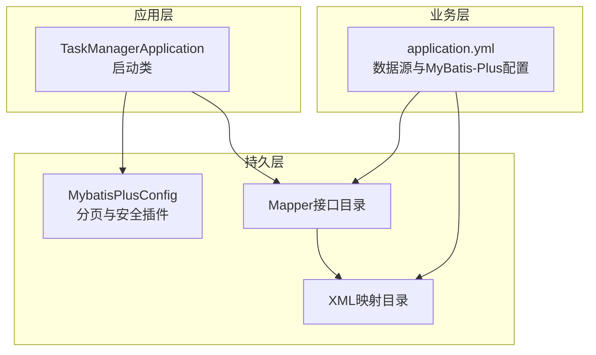
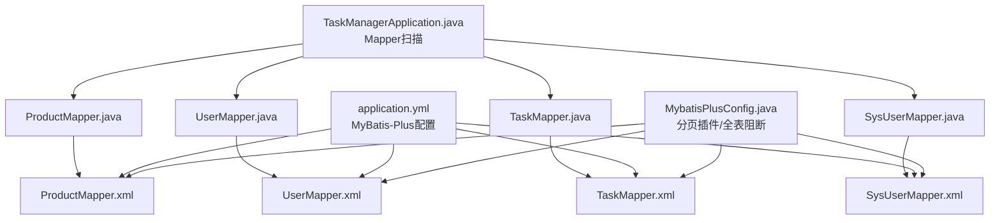
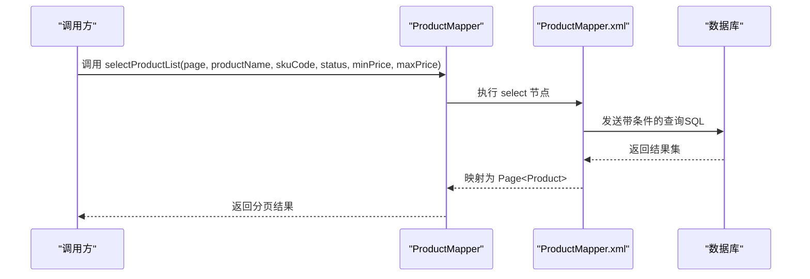
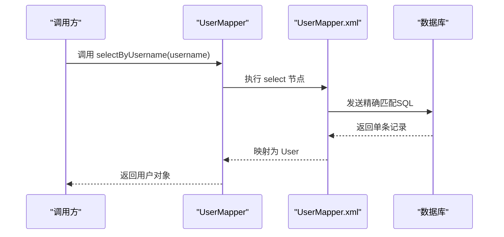
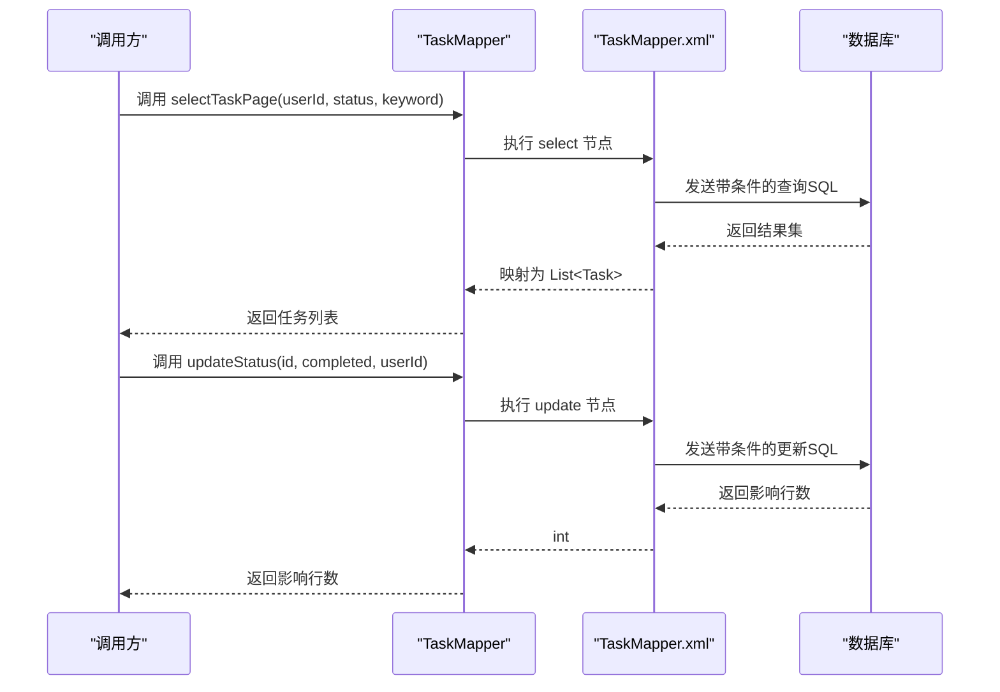
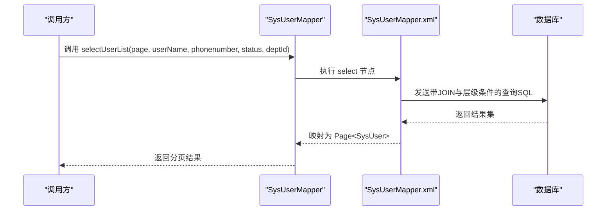
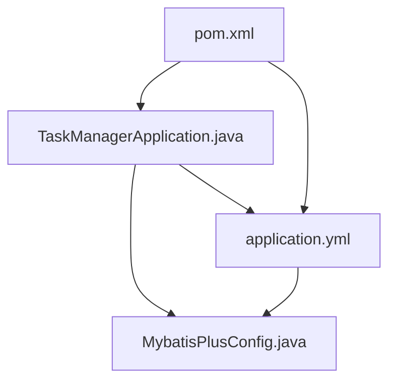
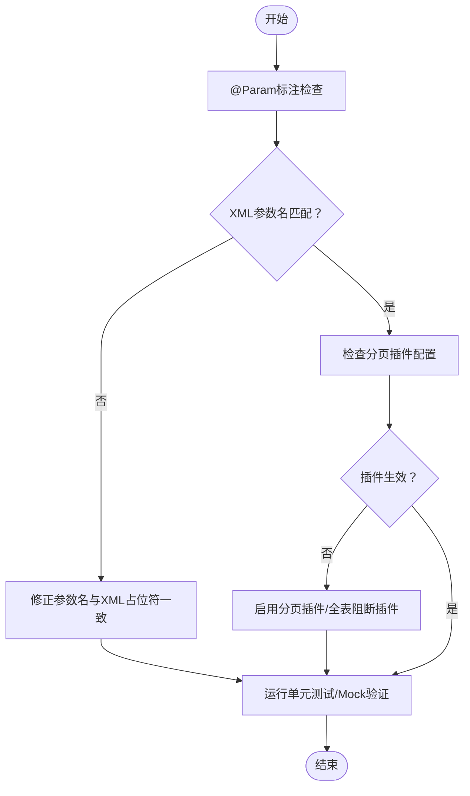

# 自定义方法设计

<cite>
**本文引用的文件**
- [ProductMapper.java](file://task-manager-backend/src/main/java/com/taskmanager/mapper/ProductMapper.java)
- [ProductMapper.xml](file://task-manager-backend/src/main/resources/mapper/ProductMapper.xml)
- [UserMapper.java](file://task-manager-backend/src/main/java/com/taskmanager/mapper/UserMapper.java)
- [UserMapper.xml](file://task-manager-backend/src/main/resources/mapper/UserMapper.xml)
- [TaskMapper.java](file://task-manager-backend/src/main/java/com/taskmanager/mapper/TaskMapper.java)
- [TaskMapper.xml](file://task-manager-backend/src/main/resources/mapper/TaskMapper.xml)
- [SysUserMapper.java](file://task-manager-backend/src/main/java/com/taskmanager/mapper/SysUserMapper.java)
- [SysUserMapper.xml](file://task-manager-backend/src/main/resources/mapper/SysUserMapper.xml)
- [application.yml](file://task-manager-backend/src/main/resources/application.yml)
- [MybatisPlusConfig.java](file://task-manager-backend/src/main/java/com/taskmanager/config/MybatisPlusConfig.java)
- [TaskManagerApplication.java](file://task-manager-backend/src/main/java/com/taskmanager/TaskManagerApplication.java)
- [BaseControllerTest.java](file://task-manager-backend/src/test/java/com/taskmanager/controller/BaseControllerTest.java)
- [SysDeptControllerTest.java](file://task-manager-backend/src/test/java/com/taskmanager/controller/SysDeptControllerTest.java)
- [pom.xml](file://task-manager-backend/pom.xml)
</cite>

## 目录
1. [简介](#简介)
2. [项目结构](#项目结构)
3. [核心组件](#核心组件)
4. [架构总览](#架构总览)
5. [详细组件分析](#详细组件分析)
6. [依赖分析](#依赖分析)
7. [性能考虑](#性能考虑)
8. [故障排查指南](#故障排查指南)
9. [结论](#结论)
10. [附录](#附录)

## 简介
本文件面向“自定义Mapper方法设计”的技术文档，结合代码库中的实际Mapper接口与XML映射文件，系统阐述以下主题：
- 自定义方法的命名规范与设计原则（语义化命名、参数设计最佳实践）
- @Param注解的使用方式与参数传递策略（多参数命名约定）
- 复杂查询方法的实现模板（条件查询、排序查询、聚合查询的SQL编写技巧）
- 方法返回值类型的选择（单个实体、集合、分页、Map与自定义DTO的适用场景）
- 方法重载与方法组合的设计模式
- 单元测试编写方法与Mock策略（基于现有测试基类与示例）

## 项目结构
后端采用Spring Boot + MyBatis-Plus的标准分层架构，Mapper接口与XML映射文件一一对应，位于以下路径：
- Mapper接口：task-manager-backend/src/main/java/com/taskmanager/mapper
- XML映射：task-manager-backend/src/main/resources/mapper
- MyBatis-Plus配置：task-manager-backend/src/main/java/com/taskmanager/config
- 应用启动类：task-manager-backend/src/main/java/com/taskmanager/TaskManagerApplication.java
- 配置文件：task-manager-backend/src/main/resources/application.yml

图表来源
- [TaskManagerApplication.java:1-17](file://task-manager-backend/src/main/java/com/taskmanager/TaskManagerApplication.java#L1-L17)
- [MybatisPlusConfig.java:1-31](file://task-manager-backend/src/main/java/com/taskmanager/config/MybatisPlusConfig.java#L1-L31)
- [application.yml:1-79](file://task-manager-backend/src/main/resources/application.yml#L1-L79)

章节来源
- [TaskManagerApplication.java:1-17](file://task-manager-backend/src/main/java/com/taskmanager/TaskManagerApplication.java#L1-L17)
- [application.yml:1-79](file://task-manager-backend/src/main/resources/application.yml#L1-L79)

## 核心组件
本节聚焦于自定义Mapper方法的典型实现与设计要点，涵盖：
- 语义化命名：方法名清晰表达意图（如selectProductList、selectByUsername）
- 参数设计：使用@Param注解明确参数名，避免位置绑定带来的脆弱性
- 返回值类型：根据业务需求选择单个实体、集合、分页或自定义DTO
- SQL条件构造：利用动态标签实现灵活的条件查询与排序

章节来源
- [ProductMapper.java:15-39](file://task-manager-backend/src/main/java/com/taskmanager/mapper/ProductMapper.java#L15-L39)
- [UserMapper.java:11-21](file://task-manager-backend/src/main/java/com/taskmanager/mapper/UserMapper.java#L11-L21)
- [TaskMapper.java:13-56](file://task-manager-backend/src/main/java/com/taskmanager/mapper/TaskMapper.java#L13-L56)
- [SysUserMapper.java:13-38](file://task-manager-backend/src/main/java/com/taskmanager/mapper/SysUserMapper.java#L13-L38)

## 架构总览
下图展示Mapper接口与其对应的XML映射之间的关系，以及MyBatis-Plus配置对分页与安全的影响。

图表来源
- [ProductMapper.java:15-39](file://task-manager-backend/src/main/java/com/taskmanager/mapper/ProductMapper.java#L15-L39)
- [ProductMapper.xml:1-55](file://task-manager-backend/src/main/resources/mapper/ProductMapper.xml#L1-L55)
- [UserMapper.java:11-21](file://task-manager-backend/src/main/java/com/taskmanager/mapper/UserMapper.java#L11-L21)
- [UserMapper.xml:1-13](file://task-manager-backend/src/main/resources/mapper/UserMapper.xml#L1-L13)
- [TaskMapper.java:13-56](file://task-manager-backend/src/main/java/com/taskmanager/mapper/TaskMapper.java#L13-L56)
- [TaskMapper.xml:1-43](file://task-manager-backend/src/main/resources/mapper/TaskMapper.xml#L1-L43)
- [SysUserMapper.java:13-38](file://task-manager-backend/src/main/java/com/taskmanager/mapper/SysUserMapper.java#L13-L38)
- [SysUserMapper.xml:1-58](file://task-manager-backend/src/main/resources/mapper/SysUserMapper.xml#L1-L58)
- [MybatisPlusConfig.java:17-31](file://task-manager-backend/src/main/java/com/taskmanager/config/MybatisPlusConfig.java#L17-L31)
- [TaskManagerApplication.java:10-12](file://task-manager-backend/src/main/java/com/taskmanager/TaskManagerApplication.java#L10-L12)
- [application.yml:33-44](file://task-manager-backend/src/main/resources/application.yml#L33-L44)

## 详细组件分析

### ProductMapper：分页与多条件查询
- 设计要点
  - 使用分页参数Page<T>作为首个参数，配合MyBatis-Plus分页插件自动分页
  - 多条件查询通过@Param为每个查询参数命名，便于XML中以属性名访问
  - SQL采用动态标签拼接条件，支持模糊匹配与范围查询
- 返回值类型
  - Page<Product>：适用于需要分页列表的场景
- 参数设计最佳实践
  - 对于字符串字段使用LIKE模糊匹配；数值字段使用范围比较
  - 注意空值判断，避免无效条件导致全表扫描
- SQL编写技巧
  - 使用<if>标签进行条件拼接，注意AND/OR的顺序与括号
  - 排序使用ORDER BY固定字段，保证结果一致性

图表来源
- [ProductMapper.java:28-33](file://task-manager-backend/src/main/java/com/taskmanager/mapper/ProductMapper.java#L28-L33)
- [ProductMapper.xml:27-46](file://task-manager-backend/src/main/resources/mapper/ProductMapper.xml#L27-L46)

章节来源
- [ProductMapper.java:15-39](file://task-manager-backend/src/main/java/com/taskmanager/mapper/ProductMapper.java#L15-L39)
- [ProductMapper.xml:1-55](file://task-manager-backend/src/main/resources/mapper/ProductMapper.xml#L1-L55)

### UserMapper：简单条件查询
- 设计要点
  - 单条件查询，使用@Param明确参数名
  - XML中直接SELECT指定字段，避免查询无关列
- 返回值类型
  - User：适用于唯一标识查询
- 参数设计最佳实践
  - 对于唯一索引字段（如用户名）使用精确匹配
  - 避免在Mapper层做业务逻辑判断，保持查询职责单一

图表来源
- [UserMapper.java:20](file://task-manager-backend/src/main/java/com/taskmanager/mapper/UserMapper.java#L20)
- [UserMapper.xml:6-10](file://task-manager-backend/src/main/resources/mapper/UserMapper.xml#L6-L10)

章节来源
- [UserMapper.java:11-21](file://task-manager-backend/src/main/java/com/taskmanager/mapper/UserMapper.java#L11-L21)
- [UserMapper.xml:1-13](file://task-manager-backend/src/main/resources/mapper/UserMapper.xml#L1-L13)

### TaskMapper：多条件筛选与状态更新
- 设计要点
  - 分页查询支持状态筛选与关键词搜索，体现“多条件+排序”的典型模式
  - 状态更新结合权限校验字段（用户ID），体现“带条件更新”
  - 提供按用户ID查询所有任务的方法，便于权限控制
- 返回值类型
  - List<Task>：适用于列表查询
  - int：适用于更新/删除影响行数
  - Task：适用于唯一查询
- 参数设计最佳实践
  - 对可选参数使用可空类型，XML中进行空值判断
  - 权限校验字段应与业务逻辑一致，避免越权操作

图表来源
- [TaskMapper.java:24-46](file://task-manager-backend/src/main/java/com/taskmanager/mapper/TaskMapper.java#L24-L46)
- [TaskMapper.xml:5-33](file://task-manager-backend/src/main/resources/mapper/TaskMapper.xml#L5-L33)

章节来源
- [TaskMapper.java:13-56](file://task-manager-backend/src/main/java/com/taskmanager/mapper/TaskMapper.java#L13-L56)
- [TaskMapper.xml:1-43](file://task-manager-backend/src/main/resources/mapper/TaskMapper.xml#L1-L43)

### SysUserMapper：复杂条件与关联查询
- 设计要点
  - 支持用户名、手机号、状态、部门ID等多条件查询
  - 部门ID支持层级查询（祖先集合），体现复杂业务条件
  - 使用ResultMap进行字段映射，提升可维护性
- 返回值类型
  - Page<SysUser>：适用于后台管理的分页列表
- SQL编写技巧
  - LEFT JOIN关联部门表，投影用户与部门信息
  - 使用find_in_set与ancestors实现部门层级查询

图表来源
- [SysUserMapper.java:33-37](file://task-manager-backend/src/main/java/com/taskmanager/mapper/SysUserMapper.java#L33-L37)
- [SysUserMapper.xml:35-56](file://task-manager-backend/src/main/resources/mapper/SysUserMapper.xml#L35-L56)

章节来源
- [SysUserMapper.java:13-38](file://task-manager-backend/src/main/java/com/taskmanager/mapper/SysUserMapper.java#L13-L38)
- [SysUserMapper.xml:1-58](file://task-manager-backend/src/main/resources/mapper/SysUserMapper.xml#L1-L58)

### @Param注解与参数传递策略
- 使用原则
  - 所有自定义方法的参数均需使用@Param标注，确保SQL中可通过参数名访问
  - 多参数时建议使用语义化命名，避免仅使用位置参数
  - 对可选参数在XML中进行空值判断，避免生成无效SQL
- 多参数命名约定
  - 与XML中#{}占位符保持一致，如#{userName}、#{deptId}
  - 对布尔值与数值类型，注意边界值与空值处理

章节来源
- [ProductMapper.java:28-33](file://task-manager-backend/src/main/java/com/taskmanager/mapper/ProductMapper.java#L28-L33)
- [TaskMapper.java:24-46](file://task-manager-backend/src/main/java/com/taskmanager/mapper/TaskMapper.java#L24-L46)
- [SysUserMapper.java:33-37](file://task-manager-backend/src/main/java/com/taskmanager/mapper/SysUserMapper.java#L33-L37)

### 复杂查询方法实现模板
- 条件查询模板
  - 使用<if>标签逐项拼接条件，注意AND/OR顺序
  - 对字符串使用LIKE模糊匹配，数值使用>=、<=范围比较
- 排序查询模板
  - 固定ORDER BY字段，避免随机排序
  - 支持多字段排序时，明确优先级
- 聚合查询模板
  - 使用COUNT(*)、SUM()等聚合函数，结合GROUP BY
  - 在XML中定义独立的聚合查询节点，避免与列表查询混用

章节来源
- [ProductMapper.xml:27-46](file://task-manager-backend/src/main/resources/mapper/ProductMapper.xml#L27-L46)
- [SysUserMapper.xml:35-56](file://task-manager-backend/src/main/resources/mapper/SysUserMapper.xml#L35-L56)
- [TaskMapper.xml:5-18](file://task-manager-backend/src/main/resources/mapper/TaskMapper.xml#L5-L18)

### 返回值类型选择指南
- 单个实体：适用于唯一查询（如按用户名查询用户）
- 集合：适用于列表查询（如按用户ID查询任务）
- 分页：适用于后台管理列表（如商品列表、用户列表）
- Map：适用于轻量查询或临时数据传输
- 自定义DTO：适用于跨表关联或字段重组场景（可在XML中投影所需字段）

章节来源
- [UserMapper.java:20](file://task-manager-backend/src/main/java/com/taskmanager/mapper/UserMapper.java#L20)
- [TaskMapper.java:24](file://task-manager-backend/src/main/java/com/taskmanager/mapper/TaskMapper.java#L24)
- [SysUserMapper.java:33](file://task-manager-backend/src/main/java/com/taskmanager/mapper/SysUserMapper.java#L33)

### 方法重载与组合设计模式
- 方法重载
  - 对同一业务场景提供不同参数粒度的方法（如仅用户ID与带筛选条件）
  - 保持方法语义化，避免过度重载导致歧义
- 方法组合
  - 将通用条件封装为私有方法或工具类，减少重复SQL
  - 在Service层组合多个Mapper方法，实现复杂业务流程

章节来源
- [TaskMapper.java:24-34](file://task-manager-backend/src/main/java/com/taskmanager/mapper/TaskMapper.java#L24-L34)

## 依赖分析
- MyBatis-Plus配置
  - 分页插件：自动拦截分页请求，注入分页参数
  - 全表阻断插件：防止误操作导致全表更新/删除
- 应用启动
  - MapperScan扫描指定包下的Mapper接口
- 配置文件
  - MyBatis-Plus mapper-locations指向XML映射目录
  - map-underscore-to-camel-case启用驼峰映射

图表来源
- [TaskManagerApplication.java:10-12](file://task-manager-backend/src/main/java/com/taskmanager/TaskManagerApplication.java#L10-L12)
- [MybatisPlusConfig.java:17-31](file://task-manager-backend/src/main/java/com/taskmanager/config/MybatisPlusConfig.java#L17-L31)
- [application.yml:33-44](file://task-manager-backend/src/main/resources/application.yml#L33-L44)
- [pom.xml:32-145](file://task-manager-backend/pom.xml#L32-L145)

章节来源
- [MybatisPlusConfig.java:1-31](file://task-manager-backend/src/main/java/com/taskmanager/config/MybatisPlusConfig.java#L1-L31)
- [application.yml:1-79](file://task-manager-backend/src/main/resources/application.yml#L1-L79)
- [pom.xml:1-206](file://task-manager-backend/pom.xml#L1-L206)

## 性能考虑
- 索引与查询条件
  - 为常用查询字段建立索引，避免全表扫描
  - LIKE以通配符开头可能导致索引失效，必要时考虑全文检索或前缀索引
- 分页优化
  - 使用MyBatis-Plus分页插件，避免一次性加载大量数据
  - 对大数据量表进行LIMIT与OFFSET优化
- SQL执行计划
  - 定期检查慢查询，优化WHERE、JOIN与ORDER BY
- 结果映射
  - 使用ResultMap或按需字段投影，减少不必要的字段传输

## 故障排查指南
- 常见问题
  - 参数未标注@Param导致绑定失败
  - XML中#{}与方法参数名不一致
  - 分页未生效：确认分页插件是否正确配置
- 单元测试与Mock
  - 基于BaseControllerTest提供的Mock配置，模拟TokenService、RedisTemplate等外部依赖
  - 在SysDeptControllerTest中演示了如何MockMapper并发起HTTP请求进行集成测试

章节来源
- [BaseControllerTest.java:1-89](file://task-manager-backend/src/test/java/com/taskmanager/controller/BaseControllerTest.java#L1-L89)
- [SysDeptControllerTest.java:1-75](file://task-manager-backend/src/test/java/com/taskmanager/controller/SysDeptControllerTest.java#L1-L75)

## 结论
通过本项目中的ProductMapper、UserMapper、TaskMapper与SysUserMapper的实践，可以总结出自定义Mapper方法设计的关键经验：
- 以语义化命名与@Param参数标注为核心，确保方法意图清晰、参数可读
- 在XML中使用动态标签实现灵活的条件查询，并结合分页与排序
- 根据业务场景选择合适的返回值类型，避免过度设计
- 在Service层进行方法组合与权限校验，保证数据安全与逻辑内聚
- 借助MyBatis-Plus配置与单元测试Mock策略，保障性能与质量

## 附录
- 测试依赖与版本
  - Spring Boot Starter Test、Mockito、Spring Security Test等用于单元测试
- Swagger/Knife4j
  - application.yml中配置了Knife4j文档，便于接口文档与调试

章节来源
- [pom.xml:32-145](file://task-manager-backend/pom.xml#L32-L145)
- [application.yml:62-79](file://task-manager-backend/src/main/resources/application.yml#L62-L79)