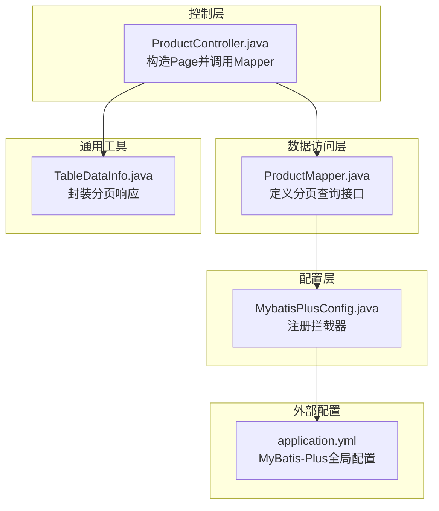
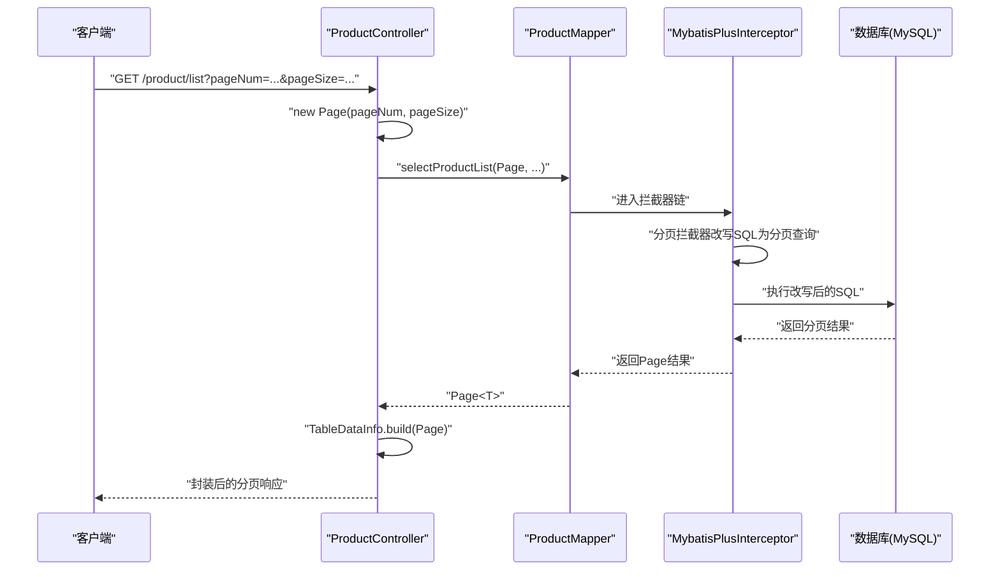
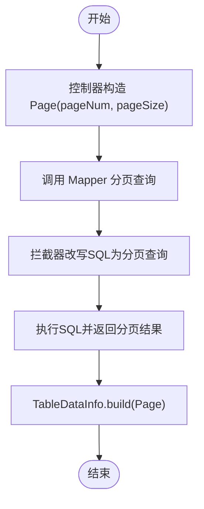
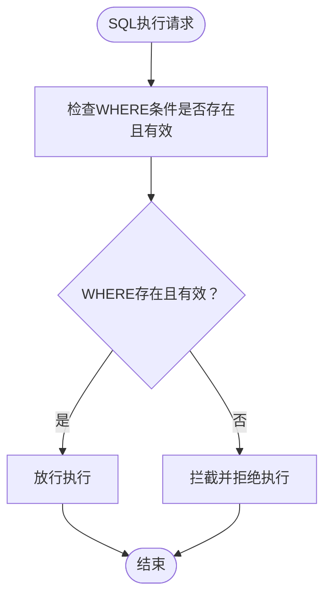
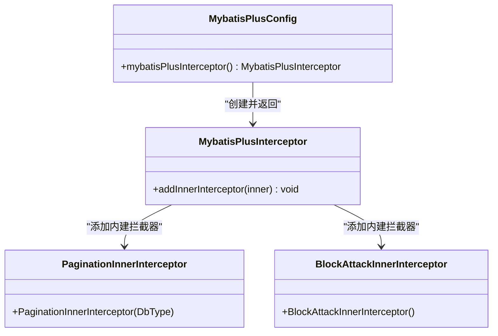
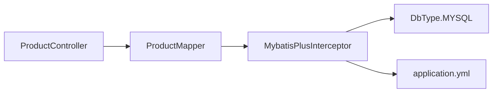

# MyBatis-Plus配置

<cite>
**本文引用的文件**
- [MybatisPlusConfig.java](file://task-manager-backend/src/main/java/com/taskmanager/config/MybatisPlusConfig.java)
- [application.yml](file://task-manager-backend/src/main/resources/application.yml)
- [ProductController.java](file://task-manager-backend/src/main/java/com/taskmanager/controller/ProductController.java)
- [TableDataInfo.java](file://task-manager-backend/src/main/java/com/taskmanager/common/utils/TableDataInfo.java)
- [ProductMapper.java](file://task-manager-backend/src/main/java/com/taskmanager/mapper/ProductMapper.java)
</cite>

## 目录
1. [简介](#简介)
2. [项目结构](#项目结构)
3. [核心组件](#核心组件)
4. [架构总览](#架构总览)
5. [详细组件分析](#详细组件分析)
6. [依赖分析](#依赖分析)
7. [性能考量](#性能考量)
8. [故障排查指南](#故障排查指南)
9. [结论](#结论)
10. [附录](#附录)

## 简介
本文件围绕 MyBatis-Plus 在本项目的配置与使用进行系统化技术说明，重点覆盖以下方面：
- 拦截器配置与作用机制：分页插件（PaginationInnerInterceptor）与防止全表更新/删除插件（BlockAttackInnerInterceptor）的配置、参数与行为。
- 数据库类型适配与分页查询实现原理：基于 DbType 的适配策略及分页 SQL 改写机制。
- 安全机制与使用场景：防止误操作导致全表更新/删除的保护策略。
- 配置类注解与 Spring 容器集成：通过 @Configuration 与 @Bean 注册拦截器。
- 不同数据库类型的配置差异与兼容性：当前配置针对 MySQL 的适配与扩展建议。
- 配置优化建议与常见错误排查：参数调优、日志与性能监控、典型问题定位。

## 项目结构
本项目后端采用 Spring Boot + MyBatis-Plus 架构，MyBatis-Plus 配置集中在配置类中统一注册拦截器；业务层通过分页 Page 对象驱动分页查询；通用返回体封装了分页结果。

图表来源
- [MybatisPlusConfig.java:16-31](file://task-manager-backend/src/main/java/com/taskmanager/config/MybatisPlusConfig.java#L16-L31)
- [ProductController.java:55-63](file://task-manager-backend/src/main/java/com/taskmanager/controller/ProductController.java#L55-L63)
- [TableDataInfo.java:37-45](file://task-manager-backend/src/main/java/com/taskmanager/common/utils/TableDataInfo.java#L37-L45)
- [application.yml:33-44](file://task-manager-backend/src/main/resources/application.yml#L33-L44)

章节来源
- [MybatisPlusConfig.java:16-31](file://task-manager-backend/src/main/java/com/taskmanager/config/MybatisPlusConfig.java#L16-L31)
- [application.yml:33-44](file://task-manager-backend/src/main/resources/application.yml#L33-L44)

## 核心组件
- MyBatis-Plus 拦截器注册：通过 @Configuration 与 @Bean 在 Spring 容器中注册 MybatisPlusInterceptor，并向其添加两个内建拦截器：
  - 分页拦截器 PaginationInnerInterceptor（DbType.MYSQL）
  - 安全拦截器 BlockAttackInnerInterceptor（防止全表更新/删除）
- 分页查询使用：控制器接收 pageNum/pageSize 参数，构造 Page 对象，调用 Mapper 的分页查询方法，最终由 TableDataInfo 封装返回。
- 全局配置：application.yml 中设置 MyBatis-Plus 的映射规则、日志实现、Mapper XML 路径以及逻辑删除字段等。

章节来源
- [MybatisPlusConfig.java:22-30](file://task-manager-backend/src/main/java/com/taskmanager/config/MybatisPlusConfig.java#L22-L30)
- [ProductController.java:55-63](file://task-manager-backend/src/main/java/com/taskmanager/controller/ProductController.java#L55-L63)
- [TableDataInfo.java:37-45](file://task-manager-backend/src/main/java/com/taskmanager/common/utils/TableDataInfo.java#L37-L45)
- [application.yml:33-44](file://task-manager-backend/src/main/resources/application.yml#L33-L44)

## 架构总览
下图展示从控制器到数据访问层再到拦截器的调用链路，以及拦截器对 SQL 的改写与安全防护。

图表来源
- [ProductController.java:55-63](file://task-manager-backend/src/main/java/com/taskmanager/controller/ProductController.java#L55-L63)
- [ProductMapper.java:28-33](file://task-manager-backend/src/main/java/com/taskmanager/mapper/ProductMapper.java#L28-L33)
- [TableDataInfo.java:37-45](file://task-manager-backend/src/main/java/com/taskmanager/common/utils/TableDataInfo.java#L37-L45)
- [MybatisPlusConfig.java:22-30](file://task-manager-backend/src/main/java/com/taskmanager/config/MybatisPlusConfig.java#L22-L30)

## 详细组件分析

### 分页插件（PaginationInnerInterceptor）配置与实现
- 配置位置与参数
  - 在配置类中以 DbType.MYSQL 初始化分页拦截器，确保分页 SQL 改写符合 MySQL 语法。
  - 分页参数来源于控制器：pageNum（默认值在控制器中设置）、pageSize。
- 实现原理
  - 控制器构造 Page 对象后交由 Mapper 执行分页查询。
  - 拦截器在执行前对 SQL 进行改写，注入 LIMIT/OFFSET 或数据库特定的分页语法，从而实现物理分页。
  - 返回的 Page 对象包含 total、records、current、size、pages 等字段，供前端渲染与交互。
- 使用示例路径
  - 控制器构造 Page 并调用 Mapper 的分页查询接口。
  - Mapper 声明分页查询方法，接收 Page 参数与业务条件。
  - 通用封装将 Page 转换为 TableDataInfo，统一输出结构。

图表来源
- [ProductController.java:55-63](file://task-manager-backend/src/main/java/com/taskmanager/controller/ProductController.java#L55-L63)
- [ProductMapper.java:28-33](file://task-manager-backend/src/main/java/com/taskmanager/mapper/ProductMapper.java#L28-L33)
- [TableDataInfo.java:37-45](file://task-manager-backend/src/main/java/com/taskmanager/common/utils/TableDataInfo.java#L37-L45)

章节来源
- [MybatisPlusConfig.java:22-30](file://task-manager-backend/src/main/java/com/taskmanager/config/MybatisPlusConfig.java#L22-L30)
- [ProductController.java:55-63](file://task-manager-backend/src/main/java/com/taskmanager/controller/ProductController.java#L55-L63)
- [ProductMapper.java:28-33](file://task-manager-backend/src/main/java/com/taskmanager/mapper/ProductMapper.java#L28-L33)
- [TableDataInfo.java:37-45](file://task-manager-backend/src/main/java/com/taskmanager/common/utils/TableDataInfo.java#L37-L45)

### 防止全表更新/删除插件（BlockAttackInnerInterceptor）安全机制
- 作用机制
  - 在执行 UPDATE/DELETE 语句时，若 WHERE 条件为空或不包含必要过滤条件，拦截器会直接阻止该 SQL 的执行，避免误伤整张表。
- 使用场景
  - 防止因业务逻辑疏漏导致的全表更新/删除风险，提升生产环境安全性。
- 配置与集成
  - 通过在拦截器中添加 BlockAttackInnerInterceptor 即可启用，无需额外参数配置。

图表来源
- [MybatisPlusConfig.java:22-30](file://task-manager-backend/src/main/java/com/taskmanager/config/MybatisPlusConfig.java#L22-L30)

章节来源
- [MybatisPlusConfig.java:22-30](file://task-manager-backend/src/main/java/com/taskmanager/config/MybatisPlusConfig.java#L22-L30)

### 配置类注解与 Spring 容器集成
- 注解使用
  - @Configuration：声明配置类，纳入 Spring 容器管理。
  - @Bean：将 MybatisPlusInterceptor 注册为 Spring Bean，供 MyBatis-Plus 使用。
- 集成方式
  - Spring Boot 自动扫描配置类，实例化拦截器 Bean 后，由 MyBatis-Plus 在执行 SQL 前后按顺序调用各拦截器。

图表来源
- [MybatisPlusConfig.java:16-31](file://task-manager-backend/src/main/java/com/taskmanager/config/MybatisPlusConfig.java#L16-L31)

章节来源
- [MybatisPlusConfig.java:16-31](file://task-manager-backend/src/main/java/com/taskmanager/config/MybatisPlusConfig.java#L16-L31)

### 不同数据库类型下的配置差异与兼容性
- 当前配置
  - 分页拦截器初始化为 DbType.MYSQL，适用于 MySQL 的分页语法。
- 兼容性建议
  - 若切换至其他数据库（如 PostgreSQL、Oracle、SQL Server），需相应调整 DbType，以确保分页 SQL 改写正确。
  - 对于多租户或跨库场景，建议在运行时根据数据源动态选择对应的 DbType，或在多数据源环境下为每个数据源分别配置拦截器。

章节来源
- [MybatisPlusConfig.java:22-28](file://task-manager-backend/src/main/java/com/taskmanager/config/MybatisPlusConfig.java#L22-L28)

### 配置优化建议
- 日志与可观测性
  - application.yml 已开启标准输出日志实现，便于开发调试；生产环境建议替换为性能更优的日志实现并配合采样策略。
- 映射与命名
  - 已开启下划线转驼峰映射，减少实体与字段命名不一致带来的问题。
- Mapper XML 与注解
  - 建议将复杂分页查询迁移到 XML 中，结合 Page 参数与条件构造，提升可维护性与可读性。
- 逻辑删除
  - 已配置逻辑删除字段与值，确保删除操作均为软删除，降低误删风险。

章节来源
- [application.yml:33-44](file://task-manager-backend/src/main/resources/application.yml#L33-L44)

## 依赖分析
- 组件耦合
  - 控制器依赖 Mapper 接口；Mapper 通过 MyBatis-Plus 间接依赖拦截器；拦截器依赖数据库类型配置。
- 外部依赖
  - 数据库驱动与连接池（HikariCP）在 application.yml 中配置，影响分页查询的连接与事务行为。
- 可能的循环依赖
  - 配置类仅暴露 Bean，不持有业务组件实例，不存在循环依赖风险。

图表来源
- [ProductController.java:55-63](file://task-manager-backend/src/main/java/com/taskmanager/controller/ProductController.java#L55-L63)
- [ProductMapper.java:28-33](file://task-manager-backend/src/main/java/com/taskmanager/mapper/ProductMapper.java#L28-L33)
- [MybatisPlusConfig.java:22-30](file://task-manager-backend/src/main/java/com/taskmanager/config/MybatisPlusConfig.java#L22-L30)
- [application.yml:33-44](file://task-manager-backend/src/main/resources/application.yml#L33-L44)

章节来源
- [ProductController.java:55-63](file://task-manager-backend/src/main/java/com/taskmanager/controller/ProductController.java#L55-L63)
- [ProductMapper.java:28-33](file://task-manager-backend/src/main/java/com/taskmanager/mapper/ProductMapper.java#L28-L33)
- [MybatisPlusConfig.java:22-30](file://task-manager-backend/src/main/java/com/taskmanager/config/MybatisPlusConfig.java#L22-L30)
- [application.yml:33-44](file://task-manager-backend/src/main/resources/application.yml#L33-L44)

## 性能考量
- 分页查询性能
  - 大数据量分页时，尽量使用索引覆盖查询条件，避免全表扫描。
  - 合理设置 pageSize，避免一次性返回过多数据。
- SQL 改写开销
  - 分页拦截器在执行前改写 SQL，通常开销较小；但应避免在高频接口上进行不必要的复杂分页查询。
- 连接池与事务
  - HikariCP 连接池参数已配置，建议结合压测结果微调最大连接数与空闲超时，确保分页查询的并发稳定性。

## 故障排查指南
- 症状：分页查询结果异常或 SQL 报错
  - 排查要点：确认 DbType 是否与实际数据库一致；检查 Mapper 中的分页查询是否正确传入 Page 参数；核对业务条件是否导致 SQL 无法命中索引。
- 症状：UPDATE/DELETE 请求被拒绝
  - 排查要点：确认 WHERE 条件是否完整；若确需全表更新/删除，请在受控场景下临时关闭安全拦截器或调整业务逻辑。
- 症状：分页总数与记录不一致
  - 排查要点：确认是否启用了逻辑删除；检查逻辑删除字段配置是否正确；核对分页查询是否包含正确的过滤条件。
- 症状：日志过多影响性能
  - 排查要点：生产环境建议关闭 StdOutImpl 日志实现，改为性能更优的日志实现并开启采样。

章节来源
- [MybatisPlusConfig.java:22-30](file://task-manager-backend/src/main/java/com/taskmanager/config/MybatisPlusConfig.java#L22-L30)
- [application.yml:33-38](file://task-manager-backend/src/main/resources/application.yml#L33-L38)

## 结论
本项目的 MyBatis-Plus 配置简洁而实用：通过统一的拦截器配置实现分页与安全防护，结合合理的全局配置与控制器分页调用模式，满足日常业务的分页需求。建议在生产环境中进一步完善日志与性能监控策略，并根据数据库类型与业务规模持续优化分页查询与拦截器参数。

## 附录
- 关键配置项参考
  - 数据源与连接池：application.yml 中的 spring.datasource 与 spring.hikari.*。
  - MyBatis-Plus 全局配置：application.yml 中的 spring.mybatis-plus.*。
  - 逻辑删除字段与值：application.yml 中的 spring.mybatis-plus.global-config.db-config.*。
- 示例路径
  - 分页拦截器注册：[MybatisPlusConfig.java:22-30](file://task-manager-backend/src/main/java/com/taskmanager/config/MybatisPlusConfig.java#L22-L30)
  - 分页查询调用：[ProductController.java:55-63](file://task-manager-backend/src/main/java/com/taskmanager/controller/ProductController.java#L55-L63)
  - 分页结果封装：[TableDataInfo.java:37-45](file://task-manager-backend/src/main/java/com/taskmanager/common/utils/TableDataInfo.java#L37-L45)