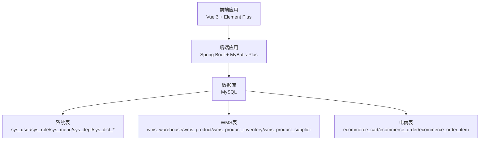
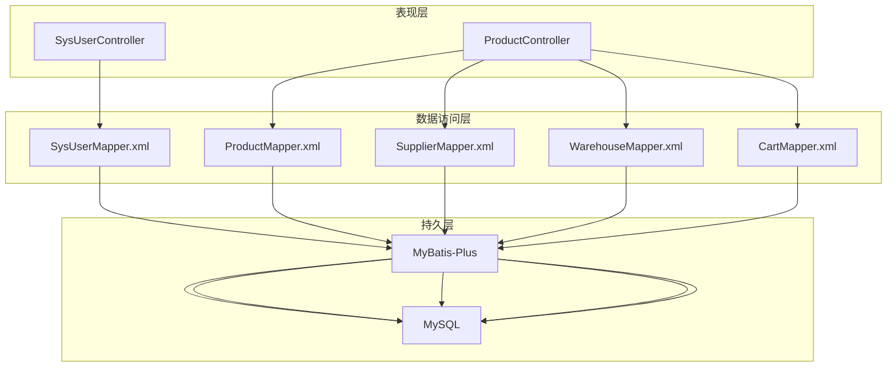
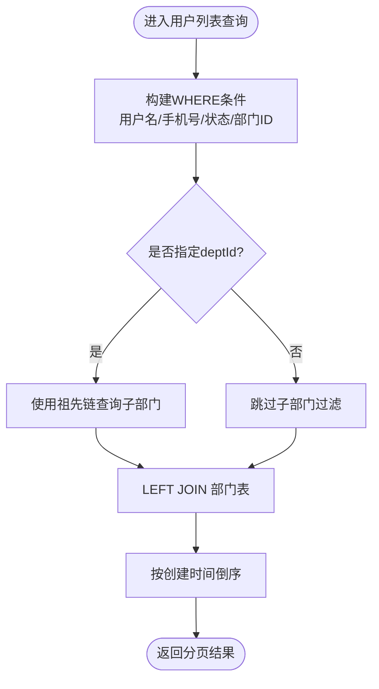
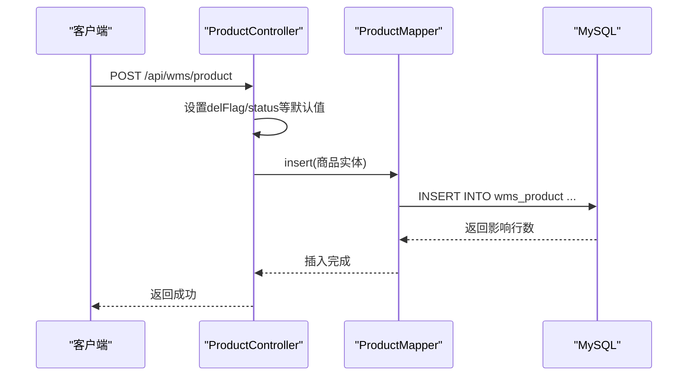
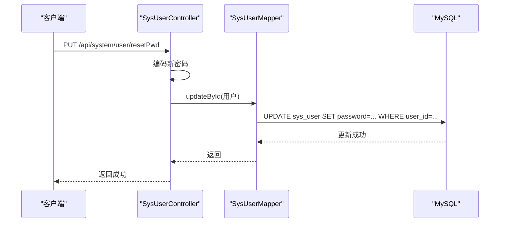
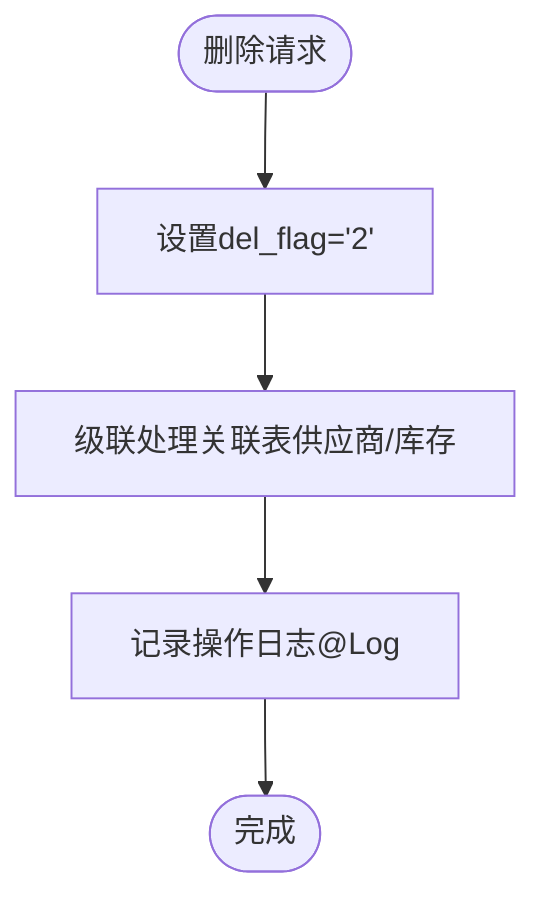
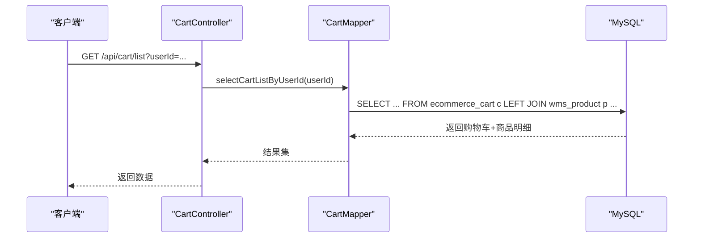
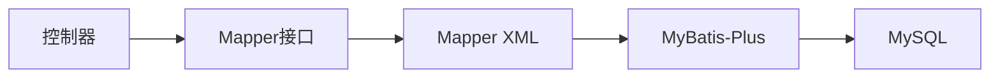

# SQL语句编写

<cite>
**本文引用的文件**
- [CODEBUDDY.md](file://CODEBUDDY.md)
- [schema.sql](file://task-manager-backend/src/main/resources/schema.sql)
- [test-data.sql](file://task-manager-backend/src/main/resources/test-data.sql)
- [SysUserMapper.xml](file://task-manager-backend/src/main/resources/mapper/SysUserMapper.xml)
- [ProductMapper.xml](file://task-manager-backend/src/main/resources/mapper/ProductMapper.xml)
- [SupplierMapper.xml](file://task-manager-backend/src/main/resources/mapper/SupplierMapper.xml)
- [WarehouseMapper.xml](file://task-manager-backend/src/main/resources/mapper/WarehouseMapper.xml)
- [CartMapper.xml](file://task-manager-backend/src/main/resources/mapper/CartMapper.xml)
- [SysUserController.java](file://task-manager-backend/src/main/java/com/taskmanager/controller/SysUserController.java)
- [ProductController.java](file://task-manager-backend/src/main/java/com/taskmanager/controller/ProductController.java)
</cite>

## 目录
1. [简介](#简介)
2. [项目结构](#项目结构)
3. [核心组件](#核心组件)
4. [架构总览](#架构总览)
5. [详细组件分析](#详细组件分析)
6. [依赖分析](#依赖分析)
7. [性能考虑](#性能考虑)
8. [故障排查指南](#故障排查指南)
9. [结论](#结论)
10. [附录](#附录)

## 简介
本文件面向SQL语句编写与优化，结合代码库中的实际实现，系统讲解以下主题：
- SELECT语句：字段选择、WHERE条件构建、JOIN查询优化
- INSERT语句：单条与批量插入策略
- UPDATE语句：条件更新与批量更新策略
- DELETE语句：安全删除与软删除实现
- 性能优化：索引使用、查询计划分析
- 参数绑定与SQL注入防护

通过阅读本文件，读者可以掌握如何在本项目中编写高质量、高性能且安全的SQL，并理解其在MyBatis-Plus与Spring MVC中的落地实践。

## 项目结构
项目采用前后端分离的三层架构，后端基于Spring Boot + MyBatis-Plus，数据库采用MySQL。核心业务涉及系统用户、角色、菜单、字典、操作日志、登录日志，以及电商与WMS相关的供应商、仓库、商品、库存、购物车、订单等模块。

图表来源
- [CODEBUDDY.md:40-77](file://CODEBUDDY.md#L40-L77)
- [schema.sql:1-608](file://task-manager-backend/src/main/resources/schema.sql#L1-L608)

章节来源
- [CODEBUDDY.md:40-77](file://CODEBUDDY.md#L40-L77)
- [schema.sql:1-608](file://task-manager-backend/src/main/resources/schema.sql#L1-L608)

## 核心组件
- 控制器层：负责接收HTTP请求、参数校验、调用Mapper执行SQL、返回统一响应。
- Mapper层：基于XML定义SQL，使用MyBatis-Plus进行分页、条件查询、逻辑删除等。
- 实体与领域模型：与数据库表一一对应，承载业务数据。
- 数据库脚本：提供完整表结构与初始化数据，涵盖系统与业务模块。

章节来源
- [CODEBUDDY.md:49-67](file://CODEBUDDY.md#L49-L67)
- [schema.sql:1-608](file://task-manager-backend/src/main/resources/schema.sql#L1-L608)

## 架构总览
后端采用“控制器-服务-数据访问层”的分层设计，其中控制器直接注入Mapper，Mapper通过XML定义SQL，MyBatis-Plus提供分页、条件构造与逻辑删除能力。系统通过统一响应Result与分页封装TableDataInfo对外输出。

图表来源
- [SysUserController.java:1-132](file://task-manager-backend/src/main/java/com/taskmanager/controller/SysUserController.java#L1-L132)
- [ProductController.java:1-237](file://task-manager-backend/src/main/java/com/taskmanager/controller/ProductController.java#L1-L237)
- [SysUserMapper.xml:1-58](file://task-manager-backend/src/main/resources/mapper/SysUserMapper.xml#L1-L58)
- [ProductMapper.xml:1-55](file://task-manager-backend/src/main/resources/mapper/ProductMapper.xml#L1-L55)
- [SupplierMapper.xml:1-57](file://task-manager-backend/src/main/resources/mapper/SupplierMapper.xml#L1-L57)
- [WarehouseMapper.xml:1-56](file://task-manager-backend/src/main/resources/mapper/WarehouseMapper.xml#L1-L56)
- [CartMapper.xml:1-15](file://task-manager-backend/src/main/resources/mapper/CartMapper.xml#L1-L15)

## 详细组件分析

### SELECT语句：字段选择、WHERE条件、JOIN优化
- 字段选择
  - 明确列出所需列，避免使用通配符，减少网络与解析开销。
  - 示例：用户列表查询明确选择用户与部门字段，避免冗余列。
- WHERE条件构建
  - 使用动态条件标签（如<if>）按需拼接WHERE子句，确保参数非空才参与过滤。
  - 示例：用户列表支持用户名、手机号、状态、部门ID等条件组合。
- JOIN查询优化
  - 使用LEFT JOIN连接部门表，避免遗漏无部门用户。
  - 使用find_in_set与祖先链实现递归部门范围查询，兼顾灵活性与性能。
  - 示例：用户列表与部门表的LEFT JOIN，以及dept_id的IN子查询。

图表来源
- [SysUserMapper.xml:35-56](file://task-manager-backend/src/main/resources/mapper/SysUserMapper.xml#L35-L56)

章节来源
- [SysUserMapper.xml:35-56](file://task-manager-backend/src/main/resources/mapper/SysUserMapper.xml#L35-L56)

### INSERT语句：单条与批量插入
- 单条插入
  - 控制器接收实体对象，设置默认字段（如del_flag、status），调用Mapper.insert完成插入。
  - 示例：用户新增、商品新增、供应商与仓库新增等均采用单条插入。
- 批量插入
  - 通过循环逐条插入，或使用事务批处理（注意数据库与驱动限制）。
  - 示例：商品导入时逐条insert，捕获异常并统计失败条数，保证幂等与可观测性。

图表来源
- [ProductController.java:82-94](file://task-manager-backend/src/main/java/com/taskmanager/controller/ProductController.java#L82-L94)
- [ProductMapper.xml:1-55](file://task-manager-backend/src/main/resources/mapper/ProductMapper.xml#L1-L55)

章节来源
- [ProductController.java:82-94](file://task-manager-backend/src/main/java/com/taskmanager/controller/ProductController.java#L82-L94)
- [ProductController.java:158-190](file://task-manager-backend/src/main/java/com/taskmanager/controller/ProductController.java#L158-L190)

### UPDATE语句：条件更新与批量更新
- 条件更新
  - 仅对需要变更的字段进行更新，避免全量更新导致锁竞争与日志膨胀。
  - 示例：用户编辑时若密码为空则保留原密码，否则重新加密后更新。
- 批量更新
  - 使用循环逐条更新，或在业务允许范围内使用IN子句批量更新。
  - 示例：删除用户采用循环将del_flag置为“删除”，实现软删除。

图表来源
- [SysUserController.java:108-120](file://task-manager-backend/src/main/java/com/taskmanager/controller/SysUserController.java#L108-L120)

章节来源
- [SysUserController.java:72-89](file://task-manager-backend/src/main/java/com/taskmanager/controller/SysUserController.java#L72-L89)
- [SysUserController.java:91-106](file://task-manager-backend/src/main/java/com/taskmanager/controller/SysUserController.java#L91-L106)

### DELETE语句：安全删除与软删除
- 软删除
  - 通过设置del_flag字段实现逻辑删除，避免物理删除带来的数据不可恢复风险。
  - 示例：用户删除、商品删除均将del_flag置为“删除”。
- 安全删除
  - 在查询时默认加上del_flag='0'过滤条件，确保不会误读已删除数据。
  - 示例：用户列表、商品列表、供应商列表、仓库列表均包含del_flag='0'过滤。

图表来源
- [SysUserController.java:91-106](file://task-manager-backend/src/main/java/com/taskmanager/controller/SysUserController.java#L91-L106)
- [ProductController.java:113-130](file://task-manager-backend/src/main/java/com/taskmanager/controller/ProductController.java#L113-L130)

章节来源
- [SysUserController.java:91-106](file://task-manager-backend/src/main/java/com/taskmanager/controller/SysUserController.java#L91-L106)
- [ProductController.java:113-130](file://task-manager-backend/src/main/java/com/taskmanager/controller/ProductController.java#L113-L130)

### JOIN查询示例：购物车与商品关联
- 使用LEFT JOIN连接商品表，确保即使商品被软删除，购物车记录仍可展示。
- 通过条件p.del_flag='0'过滤掉已删除商品，保证数据一致性。

图表来源
- [CartMapper.xml:5-12](file://task-manager-backend/src/main/resources/mapper/CartMapper.xml#L5-L12)

章节来源
- [CartMapper.xml:5-12](file://task-manager-backend/src/main/resources/mapper/CartMapper.xml#L5-L12)

## 依赖分析
- 控制器依赖Mapper接口，Mapper通过XML定义SQL。
- 查询条件依赖MyBatis-Plus的分页插件与动态SQL标签。
- 逻辑删除依赖统一的del_flag字段与查询过滤。
- 日志审计通过@Log注解自动记录操作日志。

图表来源
- [SysUserController.java:1-132](file://task-manager-backend/src/main/java/com/taskmanager/controller/SysUserController.java#L1-L132)
- [ProductController.java:1-237](file://task-manager-backend/src/main/java/com/taskmanager/controller/ProductController.java#L1-L237)
- [SysUserMapper.xml:1-58](file://task-manager-backend/src/main/resources/mapper/SysUserMapper.xml#L1-L58)
- [ProductMapper.xml:1-55](file://task-manager-backend/src/main/resources/mapper/ProductMapper.xml#L1-L55)

章节来源
- [SysUserController.java:1-132](file://task-manager-backend/src/main/java/com/taskmanager/controller/SysUserController.java#L1-L132)
- [ProductController.java:1-237](file://task-manager-backend/src/main/java/com/taskmanager/controller/ProductController.java#L1-L237)

## 性能考虑
- 索引设计
  - 主键索引：所有表主键均为自增ID，具备主键索引。
  - 唯一索引：用户表用户名唯一、商品SKU唯一、仓库编码唯一。
  - 辅助索引：部门表对role_id、菜单表对dict_type、日志表对oper_time与oper_name等。
- 查询优化
  - 使用精确条件与范围查询，避免全表扫描。
  - 动态SQL按需拼接，减少不必要的LIKE匹配。
  - JOIN时优先使用小表驱动大表，必要时为关联字段建立索引。
- 分页与排序
  - 使用MyBatis-Plus分页插件，避免一次性加载大量数据。
  - 排序字段尽量命中索引，避免FileSort。
- 批处理
  - 导入场景使用分页监听器逐批处理，降低内存占用。
- 缓存
  - 对热点字典与静态配置可引入Redis缓存，减少数据库压力。

章节来源
- [schema.sql:14-36](file://task-manager-backend/src/main/resources/schema.sql#L14-L36)
- [schema.sql:135-171](file://task-manager-backend/src/main/resources/schema.sql#L135-L171)
- [schema.sql:174-198](file://task-manager-backend/src/main/resources/schema.sql#L174-L198)
- [ProductController.java:158-190](file://task-manager-backend/src/main/java/com/taskmanager/controller/ProductController.java#L158-L190)

## 故障排查指南
- 参数绑定与SQL注入防护
  - 使用#{}占位符进行参数绑定，避免字符串拼接引发SQL注入。
  - 控制器层对输入参数进行基本校验，Mapper层使用动态SQL标签进行条件拼接。
- 逻辑删除导致的“假空”问题
  - 确保查询默认带上del_flag='0'过滤，避免误读已删除数据。
- JOIN缺失数据
  - 使用LEFT JOIN并限定关联表del_flag='0'，保证购物车等场景数据完整性。
- 导入失败定位
  - 导入时逐条处理并统计失败条数，记录失败原因，便于修复与重试。

章节来源
- [SysUserMapper.xml:35-56](file://task-manager-backend/src/main/resources/mapper/SysUserMapper.xml#L35-L56)
- [CartMapper.xml:5-12](file://task-manager-backend/src/main/resources/mapper/CartMapper.xml#L5-L12)
- [ProductController.java:163-190](file://task-manager-backend/src/main/java/com/taskmanager/controller/ProductController.java#L163-L190)

## 结论
本项目在SQL编写方面遵循了“最小必要字段、动态条件、软删除、参数绑定、分页与排序”的最佳实践。通过MyBatis-Plus与统一的分页封装，实现了灵活高效的查询与更新。建议在后续演进中持续关注索引与查询计划优化，并在高并发场景下引入缓存与读写分离策略，以进一步提升系统性能与稳定性。

## 附录
- 表结构概览与初始化数据
  - 系统表：用户、角色、菜单、部门、字典、操作日志、登录日志
  - WMS表：仓库、商品、库存、供应商关联
  - 电商表：购物车、订单、订单项
- 测试数据覆盖
  - 包含用户、角色、部门、供应商、仓库、商品、库存、日志、电商等全场景数据，便于验证SQL与业务逻辑。

章节来源
- [schema.sql:1-608](file://task-manager-backend/src/main/resources/schema.sql#L1-L608)
- [test-data.sql:1-558](file://task-manager-backend/src/main/resources/test-data.sql#L1-L558)