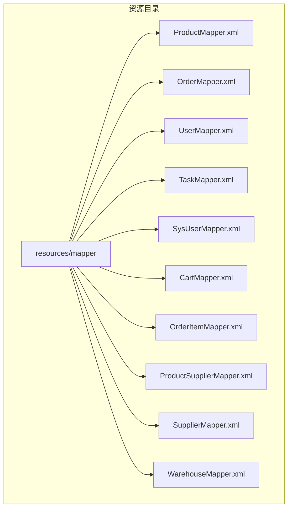
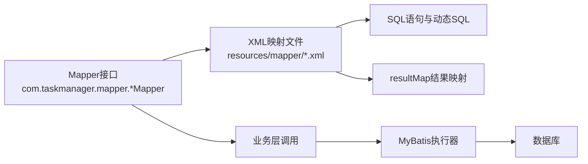
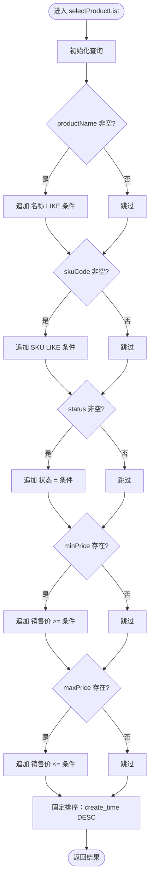
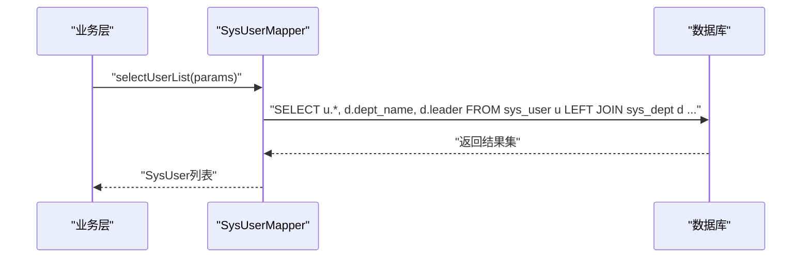
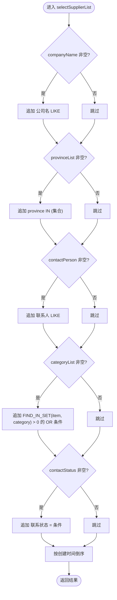
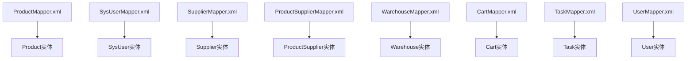

# XML映射文件

<cite>
**本文引用的文件**
- [ProductMapper.xml](file://task-manager-backend/src/main/resources/mapper/ProductMapper.xml)
- [OrderMapper.xml](file://task-manager-backend/src/main/resources/mapper/OrderMapper.xml)
- [UserMapper.xml](file://task-manager-backend/src/main/resources/mapper/UserMapper.xml)
- [TaskMapper.xml](file://task-manager-backend/src/main/resources/mapper/TaskMapper.xml)
- [SysUserMapper.xml](file://task-manager-backend/src/main/resources/mapper/SysUserMapper.xml)
- [CartMapper.xml](file://task-manager-backend/src/main/resources/mapper/CartMapper.xml)
- [OrderItemMapper.xml](file://task-manager-backend/src/main/resources/mapper/OrderItemMapper.xml)
- [ProductSupplierMapper.xml](file://task-manager-backend/src/main/resources/mapper/ProductSupplierMapper.xml)
- [SupplierMapper.xml](file://task-manager-backend/src/main/resources/mapper/SupplierMapper.xml)
- [WarehouseMapper.xml](file://task-manager-backend/src/main/resources/mapper/WarehouseMapper.xml)
</cite>

## 目录
1. [简介](#简介)
2. [项目结构](#项目结构)
3. [核心组件](#核心组件)
4. [架构总览](#架构总览)
5. [详细组件分析](#详细组件分析)
6. [依赖分析](#依赖分析)
7. [性能考虑](#性能考虑)
8. [故障排查指南](#故障排查指南)
9. [结论](#结论)
10. [附录](#附录)

## 简介
本文件面向MyBatis XML映射文件的使用与维护，系统性阐述以下主题：XML映射文件的基本结构与命名规范（namespace与Mapper接口的对应关系）、SQL语句编写规范（SELECT/INSERT/UPDATE/DELETE的优化要点）、动态SQL的常用标签用法（if/choose/when/otherwise/trim/foreach）、结果集映射（resultMap）的配置实践（含嵌套与关联处理）、SQL注入防护与性能优化策略，以及调试与执行分析方法。文中所有技术细节均基于仓库中实际存在的XML映射文件进行归纳总结。

## 项目结构
- XML映射文件位于后端资源目录下，按模块划分，每个Mapper接口对应一个同名的XML映射文件，遵循“接口全限定名”到“XML文件”的一一对应关系。
- 典型命名空间（namespace）格式为：com.{project}.mapper.{MapperName}，与Mapper接口的全限定类名保持一致，便于MyBatis自动扫描与绑定。
- 文件组织方式采用“按功能域分包”，如系统用户、商品、订单、仓库等模块各自拥有独立的XML文件与对应的Java接口。

**图表来源**
- [ProductMapper.xml:1-55](file://task-manager-backend/src/main/resources/mapper/ProductMapper.xml#L1-L55)
- [OrderMapper.xml:1-5](file://task-manager-backend/src/main/resources/mapper/OrderMapper.xml#L1-L5)
- [UserMapper.xml:1-13](file://task-manager-backend/src/main/resources/mapper/UserMapper.xml#L1-L13)
- [TaskMapper.xml:1-43](file://task-manager-backend/src/main/resources/mapper/TaskMapper.xml#L1-L43)
- [SysUserMapper.xml:1-58](file://task-manager-backend/src/main/resources/mapper/SysUserMapper.xml#L1-L58)
- [CartMapper.xml:1-15](file://task-manager-backend/src/main/resources/mapper/CartMapper.xml#L1-L15)
- [OrderItemMapper.xml:1-5](file://task-manager-backend/src/main/resources/mapper/OrderItemMapper.xml#L1-L5)
- [ProductSupplierMapper.xml:1-41](file://task-manager-backend/src/main/resources/mapper/ProductSupplierMapper.xml#L1-L41)
- [SupplierMapper.xml:1-57](file://task-manager-backend/src/main/resources/mapper/SupplierMapper.xml#L1-L57)
- [WarehouseMapper.xml:1-56](file://task-manager-backend/src/main/resources/mapper/WarehouseMapper.xml#L1-L56)

**章节来源**
- [ProductMapper.xml:1-55](file://task-manager-backend/src/main/resources/mapper/ProductMapper.xml#L1-L55)
- [SysUserMapper.xml:1-58](file://task-manager-backend/src/main/resources/mapper/SysUserMapper.xml#L1-L58)
- [SupplierMapper.xml:1-57](file://task-manager-backend/src/main/resources/mapper/SupplierMapper.xml#L1-L57)

## 核心组件
- 命名空间（namespace）与Mapper接口的对应关系
  - 命名空间必须与Mapper接口的全限定类名一致，以便MyBatis在启动时自动绑定接口与XML映射文件。
  - 示例：namespace=com.taskmanager.mapper.ProductMapper 对应 ProductMapper.java 接口。
- SQL语句与结果映射
  - 使用resultMap进行精确字段映射，避免resultType在复杂对象或联表查询中的局限。
  - 在需要联表查询或聚合字段时，优先采用resultMap以确保字段与实体属性的正确映射。
- 动态SQL
  - 使用if标签实现条件拼接；使用choose/when/otherwise实现互斥分支；使用trim对拼接字符串进行去前缀/后缀处理；使用foreach实现IN集合、批量参数等场景。
- 安全与性能
  - 所有外部输入通过#{}占位符传参，避免字符串拼接引发SQL注入风险。
  - 合理使用索引列作为查询条件，避免全表扫描；对LIKE模糊匹配使用前缀匹配或全文检索替代方案。

**章节来源**
- [ProductMapper.xml:4](file://task-manager-backend/src/main/resources/mapper/ProductMapper.xml#L4)
- [SysUserMapper.xml:4](file://task-manager-backend/src/main/resources/mapper/SysUserMapper.xml#L4)
- [SupplierMapper.xml:4](file://task-manager-backend/src/main/resources/mapper/SupplierMapper.xml#L4)
- [ProductSupplierMapper.xml:4](file://task-manager-backend/src/main/resources/mapper/ProductSupplierMapper.xml#L4)
- [WarehouseMapper.xml:4](file://task-manager-backend/src/main/resources/mapper/WarehouseMapper.xml#L4)
- [CartMapper.xml:3](file://task-manager-backend/src/main/resources/mapper/CartMapper.xml#L3)
- [TaskMapper.xml:6](file://task-manager-backend/src/main/resources/mapper/TaskMapper.xml#L6)
- [SysUserMapper.xml:36](file://task-manager-backend/src/main/resources/mapper/SysUserMapper.xml#L36)

## 架构总览
XML映射文件在MyBatis架构中的位置与职责如下：
- XML映射文件定义了SQL语句、动态条件、结果映射与缓存策略。
- Mapper接口声明方法签名，命名需与XML中的id一致。
- MyBatis在启动时解析XML，建立接口方法与SQL的绑定关系，并根据resultMap完成对象映射。

[此图为概念性架构示意，不直接映射具体源码文件，故无图表来源]

## 详细组件分析

### ProductMapper.xml
- 结构与命名规范
  - 命名空间：com.taskmanager.mapper.ProductMapper
  - 结果映射：使用resultMap将数据库列映射到实体属性，覆盖主键、通用字段、时间戳等。
- SQL语句与优化
  - 分页查询：通过多个if条件实现多维过滤（名称、SKU、状态、价格区间），排序固定为创建时间倒序。
  - 单条查询：按主键查询，返回完整实体。
  - LIKE模糊匹配：使用CONCAT函数拼接通配符，注意索引使用与前缀匹配优化。
- 动态SQL
  - 多个if标签组合实现可选条件拼接，逻辑清晰且易于扩展。
- 安全与性能
  - 所有条件值均通过#{}传入，避免SQL注入。
  - 建议对高频过滤字段建立索引，减少全表扫描。

**图表来源**
- [ProductMapper.xml:27-46](file://task-manager-backend/src/main/resources/mapper/ProductMapper.xml#L27-L46)

**章节来源**
- [ProductMapper.xml:4-52](file://task-manager-backend/src/main/resources/mapper/ProductMapper.xml#L4-L52)

### SysUserMapper.xml
- 结构与命名规范
  - 命名空间：com.taskmanager.mapper.SysUserMapper
  - 结果映射：覆盖用户基本信息、部门信息、时间戳等字段。
- SQL语句与优化
  - 联表查询：LEFT JOIN部门表，返回用户及部门名称、负责人等信息。
  - 多维过滤：用户名、手机号、状态、部门层级（祖先集合）等条件组合。
  - LIKE模糊匹配：用户名与手机号使用CONCAT拼接通配符。
- 动态SQL
  - 复合条件：if标签与嵌套子查询结合，实现部门范围的递归筛选。
- 安全与性能
  - 参数化查询，避免注入。
  - 建议对部门祖先集合查询建立合适索引，避免深度子查询导致的性能问题。

**图表来源**
- [SysUserMapper.xml:36-56](file://task-manager-backend/src/main/resources/mapper/SysUserMapper.xml#L36-L56)

**章节来源**
- [SysUserMapper.xml:4-56](file://task-manager-backend/src/main/resources/mapper/SysUserMapper.xml#L4-L56)

### SupplierMapper.xml
- 结构与命名规范
  - 命名空间：com.taskmanager.mapper.SupplierMapper
  - 结果映射：供应商基础信息与联系方式等字段映射。
- SQL语句与优化
  - 多维过滤：公司名、省份集合、联系人、分类集合、联系状态等。
  - 集合查询：使用IN与FIND_IN_SET实现多值条件。
- 动态SQL
  - foreach标签：处理省份列表与分类列表，生成IN或OR条件。
- 安全与性能
  - 所有输入通过#{}传参。
  - 对分类字段使用FIND_IN_SET时需评估性能，必要时考虑规范化设计或物化视图。

**图表来源**
- [SupplierMapper.xml:28-54](file://task-manager-backend/src/main/resources/mapper/SupplierMapper.xml#L28-L54)

**章节来源**
- [SupplierMapper.xml:4-54](file://task-manager-backend/src/main/resources/mapper/SupplierMapper.xml#L4-L54)

### ProductSupplierMapper.xml
- 结构与命名规范
  - 命名空间：com.taskmanager.mapper.ProductSupplierMapper
  - 结果映射：商品供应商关联信息与供应商名称、公司名等附加字段。
- SQL语句与优化
  - 联表查询：LEFT JOIN供应商表，返回供应商名称与公司名。
  - 逻辑删除：通过更新标志位实现软删除。
- 动态SQL
  - 条件查询：按商品ID过滤，排序优先默认供应商。
- 安全与性能
  - 参数化查询，避免注入。
  - 建议对product_id与supplier_id建立索引，提升联表效率。

**章节来源**
- [ProductSupplierMapper.xml:4-38](file://task-manager-backend/src/main/resources/mapper/ProductSupplierMapper.xml#L4-L38)

### WarehouseMapper.xml
- 结构与命名规范
  - 命名空间：com.taskmanager.mapper.WarehouseMapper
  - 结果映射：仓库基础信息与类型、状态等字段映射。
- SQL语句与优化
  - 多维过滤：仓库名、编码、省份集合、类型、状态等。
  - 集合查询：使用IN与条件组合实现灵活筛选。
  - 全量查询：按状态与名称排序返回所有正常仓库。
- 动态SQL
  - foreach标签：处理省份列表生成IN条件。
- 安全与性能
  - 参数化查询，避免注入。
  - 建议对状态、类型等维度字段建立索引，提升过滤效率。

**章节来源**
- [WarehouseMapper.xml:4-53](file://task-manager-backend/src/main/resources/mapper/WarehouseMapper.xml#L4-L53)

### CartMapper.xml
- 结构与命名规范
  - 命名空间：com.taskmanager.mapper.CartMapper
- SQL语句与优化
  - 联表查询：LEFT JOIN商品表，返回购物车与商品的组合信息。
  - 过滤条件：仅显示未删除的商品。
- 动态SQL
  - 条件过滤：按用户ID查询购物车列表。
- 安全与性能
  - 参数化查询，避免注入。
  - 建议对user_id与product_id建立索引，提升联表与过滤效率。

**章节来源**
- [CartMapper.xml:3-12](file://task-manager-backend/src/main/resources/mapper/CartMapper.xml#L3-L12)

### TaskMapper.xml
- 结构与命名规范
  - 命名空间：com.taskmanager.mapper.TaskMapper
- SQL语句与优化
  - 分页查询：支持状态筛选与关键词搜索（标题与描述）。
  - 权限校验：按ID与用户ID联合查询，用于操作前的权限验证。
  - 更新操作：按ID与用户ID更新任务状态。
- 动态SQL
  - if标签：实现状态与关键词的可选过滤。
- 安全与性能
  - 参数化查询，避免注入。
  - 建议对user_id、created_time等字段建立索引，优化分页与排序。

**章节来源**
- [TaskMapper.xml:3-40](file://task-manager-backend/src/main/resources/mapper/TaskMapper.xml#L3-L40)

### UserMapper.xml
- 结构与命名规范
  - 命名空间：com.taskmanager.mapper.UserMapper
- SQL语句与优化
  - 简单查询：按用户名查询用户，返回必要字段。
- 动态SQL
  - 无动态SQL，条件简单明确。
- 安全与性能
  - 参数化查询，避免注入。
  - 建议对username建立唯一索引，提升查询效率。

**章节来源**
- [UserMapper.xml:3-10](file://task-manager-backend/src/main/resources/mapper/UserMapper.xml#L3-L10)

### OrderMapper.xml 与 OrderItemMapper.xml
- 结构与命名规范
  - 命名空间：com.taskmanager.mapper.OrderMapper 与 com.taskmanager.mapper.OrderItemMapper
- 当前内容
  - 两个文件当前为空，仅包含命名空间声明，尚未定义具体SQL与映射。
- 建议
  - 按照现有模块风格补充resultMap与SQL语句，遵循if/choose/trim/foreach等动态SQL最佳实践。
  - 明确与ProductMapper、SysUserMapper等的关联关系，统一命名与字段映射规范。

**章节来源**
- [OrderMapper.xml:1-5](file://task-manager-backend/src/main/resources/mapper/OrderMapper.xml#L1-L5)
- [OrderItemMapper.xml:1-5](file://task-manager-backend/src/main/resources/mapper/OrderItemMapper.xml#L1-L5)

## 依赖分析
- 组件耦合
  - XML映射文件与Mapper接口强耦合，命名空间必须与接口全限定名一致。
  - 联表查询场景中，XML文件之间存在隐式依赖（如CartMapper依赖ProductMapper的字段映射）。
- 外部依赖
  - MyBatis版本与Dtd约束；数据库方言（如MySQL的CONCAT、FIND_IN_SET等函数）。
- 潜在问题
  - 动态SQL条件过多可能导致执行计划不稳定，建议定期审查与合并冗余条件。
  - foreach生成的IN列表过大可能影响性能，建议限制集合大小或分批处理。

**图表来源**
- [ProductMapper.xml:7](file://task-manager-backend/src/main/resources/mapper/ProductMapper.xml#L7)
- [SysUserMapper.xml:7](file://task-manager-backend/src/main/resources/mapper/SysUserMapper.xml#L7)
- [SupplierMapper.xml:7](file://task-manager-backend/src/main/resources/mapper/SupplierMapper.xml#L7)
- [ProductSupplierMapper.xml:7](file://task-manager-backend/src/main/resources/mapper/ProductSupplierMapper.xml#L7)
- [WarehouseMapper.xml:7](file://task-manager-backend/src/main/resources/mapper/WarehouseMapper.xml#L7)
- [CartMapper.xml:5](file://task-manager-backend/src/main/resources/mapper/CartMapper.xml#L5)
- [TaskMapper.xml:6](file://task-manager-backend/src/main/resources/mapper/TaskMapper.xml#L6)
- [UserMapper.xml:6](file://task-manager-backend/src/main/resources/mapper/UserMapper.xml#L6)

**章节来源**
- [ProductMapper.xml:7](file://task-manager-backend/src/main/resources/mapper/ProductMapper.xml#L7)
- [SysUserMapper.xml:7](file://task-manager-backend/src/main/resources/mapper/SysUserMapper.xml#L7)
- [SupplierMapper.xml:7](file://task-manager-backend/src/main/resources/mapper/SupplierMapper.xml#L7)
- [ProductSupplierMapper.xml:7](file://task-manager-backend/src/main/resources/mapper/ProductSupplierMapper.xml#L7)
- [WarehouseMapper.xml:7](file://task-manager-backend/src/main/resources/mapper/WarehouseMapper.xml#L7)
- [CartMapper.xml:5](file://task-manager-backend/src/main/resources/mapper/CartMapper.xml#L5)
- [TaskMapper.xml:6](file://task-manager-backend/src/main/resources/mapper/TaskMapper.xml#L6)
- [UserMapper.xml:6](file://task-manager-backend/src/main/resources/mapper/UserMapper.xml#L6)

## 性能考虑
- SQL编写优化
  - 优先使用索引列作为过滤条件，避免在WHERE中对列进行函数运算。
  - LIKE模糊匹配尽量使用前缀匹配，避免leading wildcard导致的索引失效。
  - 对于IN集合，控制集合规模，必要时拆分为临时表或分批处理。
- 动态SQL优化
  - 合理使用if标签，避免条件过多导致执行计划抖动。
  - 使用trim去除多余逗号或AND/OR关键字，保证SQL语法正确性与可读性。
- 结果映射优化
  - 复杂对象使用resultMap，避免resultType在联表场景下的字段歧义。
  - 对联表查询，明确选择所需列，减少不必要的字段传输。
- 数据库层面
  - 为高频查询列建立索引；定期分析慢查询日志，识别热点SQL。
  - 对长文本字段（如移动端内容）考虑延迟加载或分表策略。

[本节为通用性能指导，无需列出章节来源]

## 故障排查指南
- SQL注入防护
  - 始终使用#{}占位符传参，避免字符串拼接；仅在极少数允许的场景使用${}并严格校验输入。
- 动态SQL常见问题
  - 条件遗漏：检查if标签的判空逻辑是否覆盖所有边界条件。
  - 语法错误：使用trim清理多余的AND/OR与逗号；确保foreach的open/close与separator正确。
- 结果映射问题
  - 字段不匹配：核对resultMap的property与column映射是否与数据库列名一致。
  - 联表缺失：确认LEFT JOIN的ON条件与过滤条件是否合理，避免因过滤提前导致数据丢失。
- 调试与执行分析
  - 开启MyBatis日志，观察最终生成的SQL与参数绑定情况。
  - 使用数据库慢查询日志定位性能瓶颈，结合EXPLAIN分析执行计划。
  - 对动态SQL，打印拼接后的SQL片段，验证条件分支是否符合预期。

**章节来源**
- [ProductMapper.xml:30-44](file://task-manager-backend/src/main/resources/mapper/ProductMapper.xml#L30-L44)
- [SupplierMapper.xml:34-48](file://task-manager-backend/src/main/resources/mapper/SupplierMapper.xml#L34-L48)
- [SysUserMapper.xml:50-54](file://task-manager-backend/src/main/resources/mapper/SysUserMapper.xml#L50-L54)

## 结论
本项目的XML映射文件整体遵循了MyBatis的最佳实践：命名空间与Mapper接口一一对应、使用resultMap进行精确映射、广泛采用动态SQL实现灵活查询、并通过#{}参数化防止SQL注入。建议后续在以下方面持续改进：完善空文件（OrderMapper.xml、OrderItemMapper.xml）的内容、优化复杂动态SQL的执行计划、加强索引设计与慢查询治理、并在团队内推广统一的命名与注释规范。

[本节为总结性内容，无需列出章节来源]

## 附录
- 常用标签速查
  - if：条件判断，适合可选过滤。
  - choose/when/otherwise：互斥分支，适合多选一的分支逻辑。
  - trim：去除多余前缀/后缀，常用于动态拼接。
  - foreach：集合遍历，适合IN与批量参数。
- 命名规范建议
  - namespace与Mapper接口全限定名一致。
  - SQL id采用动词短语+名词形式，如selectXxx、updateXxx。
  - resultMap id以ResultMap结尾，如UserResultMap。

[本节为通用附录内容，无需列出章节来源]