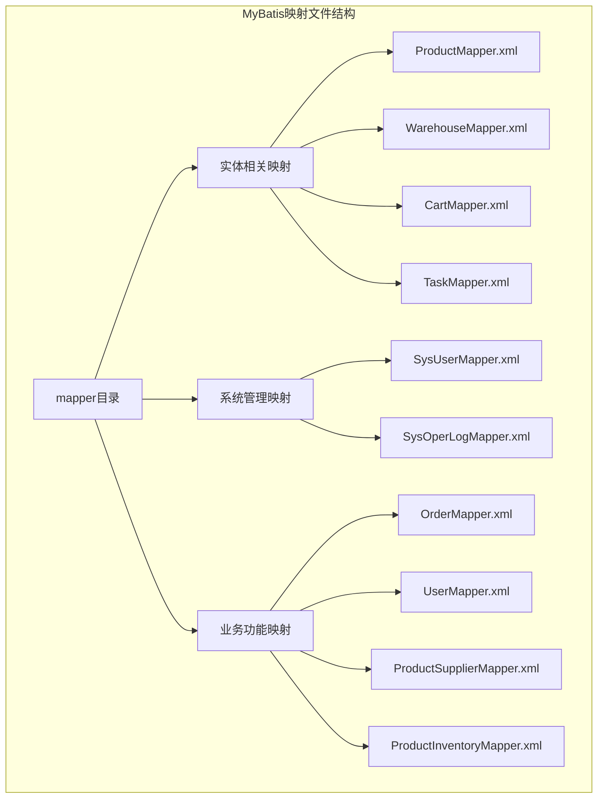
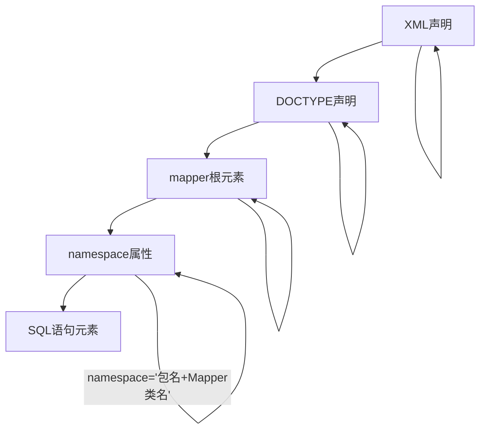
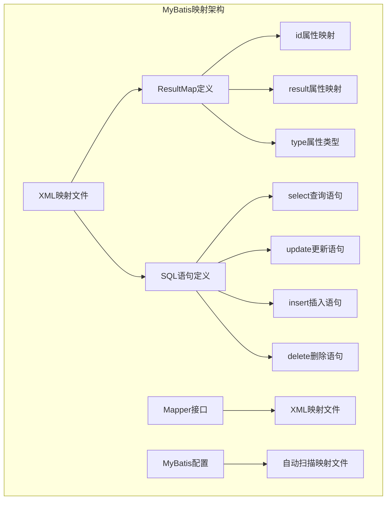
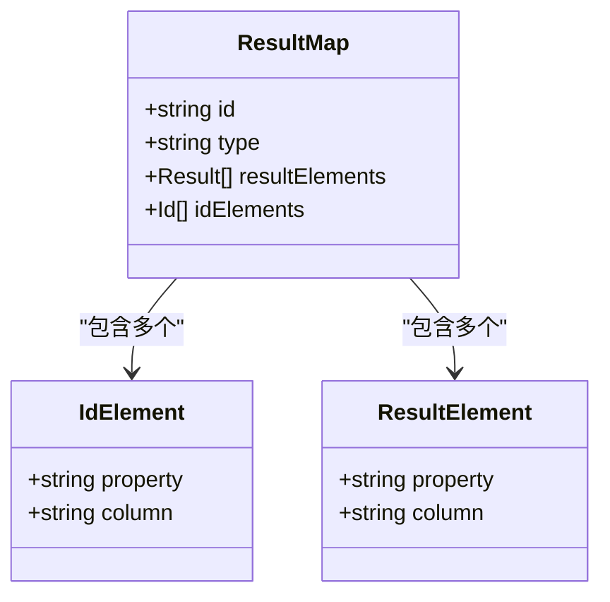
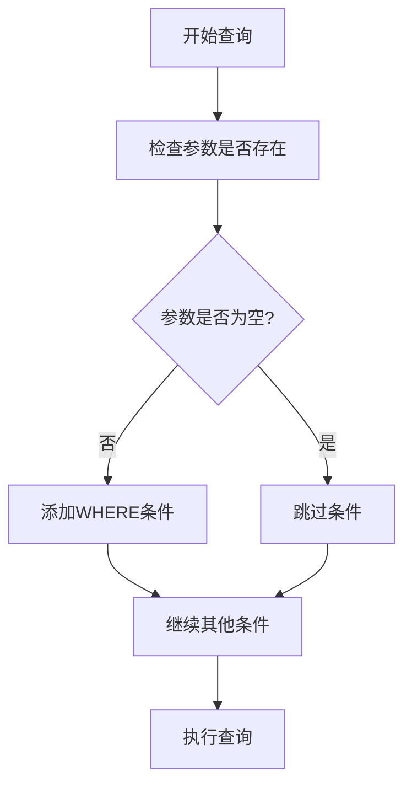
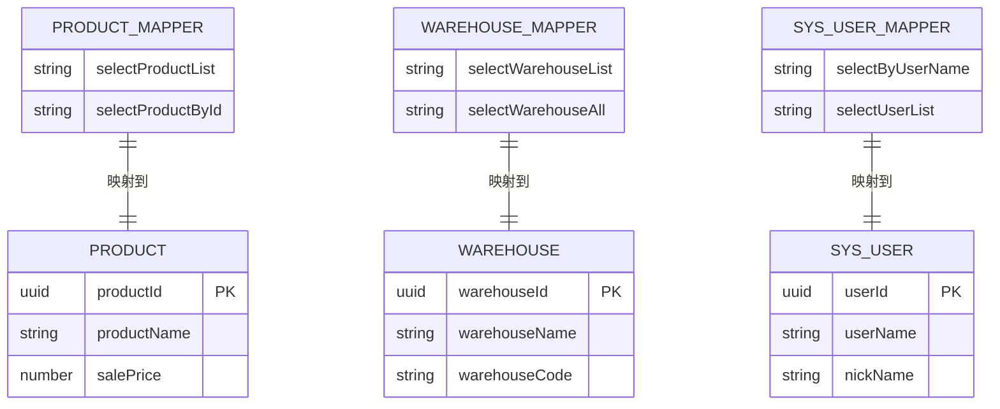
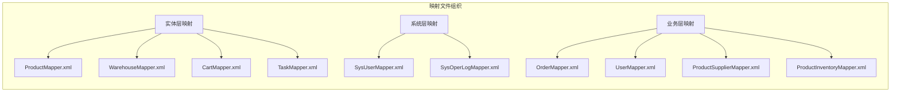
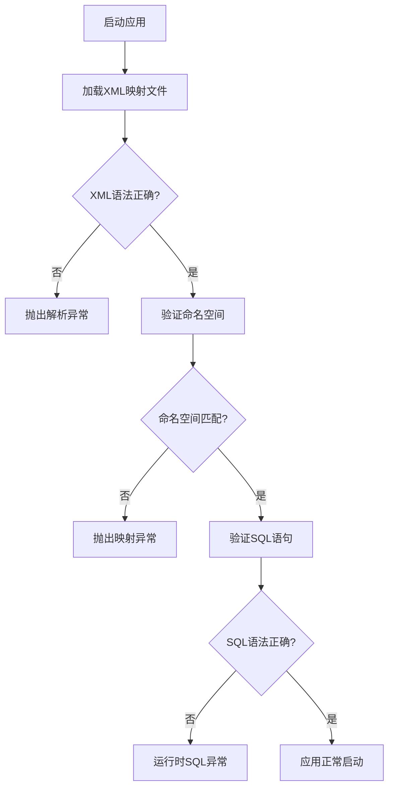

# XML映射文件基础结构

<cite>
**本文档引用的文件**
- [application.yml](file://task-manager-backend/src/main/resources/application.yml)
- [CartMapper.xml](file://task-manager-backend/src/main/resources/mapper/CartMapper.xml)
- [ProductMapper.xml](file://task-manager-backend/src/main/resources/mapper/ProductMapper.xml)
- [OrderMapper.xml](file://task-manager-backend/src/main/resources/mapper/OrderMapper.xml)
- [UserMapper.xml](file://task-manager-backend/src/main/resources/mapper/UserMapper.xml)
- [TaskMapper.xml](file://task-manager-backend/src/main/resources/mapper/TaskMapper.xml)
- [WarehouseMapper.xml](file://task-manager-backend/src/main/resources/mapper/WarehouseMapper.xml)
- [SysUserMapper.xml](file://task-manager-backend/src/main/resources/mapper/SysUserMapper.xml)
- [ProductSupplierMapper.xml](file://task-manager-backend/src/main/resources/mapper/ProductSupplierMapper.xml)
- [ProductInventoryMapper.xml](file://task-manager-backend/src/main/resources/mapper/ProductInventoryMapper.xml)
</cite>

## 目录
1. [简介](#简介)
2. [项目结构](#项目结构)
3. [核心组件](#核心组件)
4. [架构概览](#架构概览)
5. [详细组件分析](#详细组件分析)
6. [依赖关系分析](#依赖关系分析)
7. [性能考虑](#性能考虑)
8. [故障排除指南](#故障排除指南)
9. [结论](#结论)

## 简介

本文件为MyBatis XML映射文件的基础结构文档，基于实际代码库中的XML映射文件进行深入分析。文档涵盖XML映射文件的基本组成部分、命名规范、配置规则以及最佳实践。

## 项目结构

在该代码库中，XML映射文件位于`task-manager-backend/src/main/resources/mapper/`目录下，采用按功能模块分组的组织方式：

**图表来源**
- [application.yml:38-38](file://task-manager-backend/src/main/resources/application.yml#L38)

**章节来源**
- [application.yml:38-38](file://task-manager-backend/src/main/resources/application.yml#L38)

## 核心组件

### 基本XML结构

所有XML映射文件都遵循统一的头部结构：

**图表来源**
- [CartMapper.xml:1-3](file://task-manager-backend/src/main/resources/mapper/CartMapper.xml#L1-L3)
- [ProductMapper.xml:1-4](file://task-manager-backend/src/main/resources/mapper/ProductMapper.xml#L1-L4)

### DOCTYPE声明规范

所有映射文件都使用标准的MyBatis DOCTYPE声明：
- 版本：3.0
- 公共标识符：`-//mybatis.org//DTD Mapper 3.0//EN`
- 系统标识符：`http://mybatis.org/dtd/mybatis-3-mapper.dtd`

**章节来源**
- [CartMapper.xml:2-2](file://task-manager-backend/src/main/resources/mapper/CartMapper.xml#L2)
- [ProductMapper.xml:2-3](file://task-manager-backend/src/main/resources/mapper/ProductMapper.xml#L2-L3)

### mapper根元素和namespace属性

`mapper`元素是所有SQL映射的根容器，必须包含以下属性：

**namespace属性设置规范：**
- 格式：`com.公司域名.包结构.Mapper类名`
- 示例：`com.taskmanager.mapper.ProductMapper`
- 必须与对应的Java Mapper接口完全匹配

**章节来源**
- [CartMapper.xml:3-3](file://task-manager-backend/src/main/resources/mapper/CartMapper.xml#L3)
- [ProductMapper.xml:4-4](file://task-manager-backend/src/main/resources/mapper/ProductMapper.xml#L4)

## 架构概览

**图表来源**
- [application.yml:38-38](file://task-manager-backend/src/main/resources/application.yml#L38)

## 详细组件分析

### resultMap元素定义和配置

#### 基本结构

**图表来源**
- [ProductMapper.xml:6-24](file://task-manager-backend/src/main/resources/mapper/ProductMapper.xml#L6-L24)

#### id属性设置规则

- **唯一性**：每个resultMap的id必须在整个映射文件中唯一
- **命名规范**：采用驼峰命名法，如`ProductResultMap`
- **可读性**：应清晰表达映射对象的含义

#### type属性设置规则

- **完整类名**：必须包含完整的包路径
- **类型匹配**：与Java实体类完全对应
- **示例**：`com.taskmanager.domain.Product`

**章节来源**
- [ProductMapper.xml:7-7](file://task-manager-backend/src/main/resources/mapper/ProductMapper.xml#L7)
- [WarehouseMapper.xml:7-21](file://task-manager-backend/src/main/resources/mapper/WarehouseMapper.xml#L7-L21)

### SQL语句元素命名规范

#### select标签使用场景

**查询列表场景：**
- 使用`resultMap`属性进行复杂对象映射
- 支持动态条件查询
- 示例：`selectProductList`、`selectWarehouseList`

**查询单个对象场景：**
- 使用`resultType`属性指定返回类型
- 直接返回简单数据类型
- 示例：`selectByUsername`、`selectProductById`

**章节来源**
- [ProductMapper.xml:27-52](file://task-manager-backend/src/main/resources/mapper/ProductMapper.xml#L27-L52)
- [UserMapper.xml:6-10](file://task-manager-backend/src/main/resources/mapper/UserMapper.xml#L6-L10)

#### update标签使用场景

- **状态更新**：如任务完成状态更新
- **批量更新**：支持逻辑删除操作
- **条件更新**：结合用户权限验证

**章节来源**
- [TaskMapper.xml:29-33](file://task-manager-backend/src/main/resources/mapper/TaskMapper.xml#L29-L33)
- [ProductSupplierMapper.xml:35-38](file://task-manager-backend/src/main/resources/mapper/ProductSupplierMapper.xml#L35-L38)

#### insert和delete标签使用场景

在当前代码库中，insert和delete标签使用相对较少，主要集中在：
- **逻辑删除**：通过更新del_flag字段实现软删除
- **数据清理**：批量清理关联数据

**章节来源**
- [ProductSupplierMapper.xml:35-38](file://task-manager-backend/src/main/resources/mapper/ProductSupplierMapper.xml#L35-L38)
- [ProductInventoryMapper.xml:33-36](file://task-manager-backend/src/main/resources/mapper/ProductInventoryMapper.xml#L33-L36)

### 动态SQL元素

#### if标签使用模式

**图表来源**
- [ProductMapper.xml:30-45](file://task-manager-backend/src/main/resources/mapper/ProductMapper.xml#L30-L45)

**章节来源**
- [ProductMapper.xml:30-45](file://task-manager-backend/src/main/resources/mapper/ProductMapper.xml#L30-L45)
- [SysUserMapper.xml:41-56](file://task-manager-backend/src/main/resources/mapper/SysUserMapper.xml#L41-L56)

## 依赖关系分析

### 映射文件与实体类的关系

**图表来源**
- [ProductMapper.xml:7-24](file://task-manager-backend/src/main/resources/mapper/ProductMapper.xml#L7-L24)
- [WarehouseMapper.xml:7-21](file://task-manager-backend/src/main/resources/mapper/WarehouseMapper.xml#L7-L21)
- [SysUserMapper.xml:7-27](file://task-manager-backend/src/main/resources/mapper/SysUserMapper.xml#L7-L27)

### 文件组织结构

**图表来源**
- [application.yml:38-38](file://task-manager-backend/src/main/resources/application.yml#L38)

**章节来源**
- [application.yml:38-38](file://task-manager-backend/src/main/resources/application.yml#L38)

## 性能考虑

### 查询优化策略

1. **索引利用**：确保常用查询条件字段建立适当索引
2. **字段选择**：避免使用SELECT *，明确指定需要的字段
3. **分页处理**：对大数据集查询使用LIMIT和OFFSET
4. **连接优化**：合理使用LEFT JOIN和INNER JOIN

### 缓存策略

- **一级缓存**：MyBatis默认的SqlSession级别缓存
- **二级缓存**：Mapper级别的缓存，适用于只读数据
- **查询结果缓存**：对频繁访问的静态数据启用缓存

## 故障排除指南

### 常见问题诊断

#### XML语法错误

**症状**：应用启动时报XML解析错误
**解决方案**：
1. 检查XML声明格式是否正确
2. 验证DOCTYPE声明完整性
3. 确认所有标签都有对应的结束标签

#### 命名空间不匹配

**症状**：Mapper接口找不到对应的SQL语句
**解决方案**：
1. 确认namespace与Mapper接口完全一致
2. 检查包路径是否正确
3. 验证Mapper接口方法名与id属性匹配

#### 类型映射错误

**症状**：查询结果转换异常或数据丢失
**解决方案**：
1. 检查resultMap中property与column的对应关系
2. 验证type属性的完整类名
3. 确认数据库字段类型与Java类型兼容

### 验证方法

#### 手工验证步骤

1. **XML格式检查**：使用XML编辑器验证语法
2. **命名空间验证**：确认与Mapper接口匹配
3. **SQL语句测试**：在数据库客户端直接执行SQL
4. **映射关系验证**：检查resultMap字段映射

#### 自动化验证

**图表来源**
- [application.yml:38-38](file://task-manager-backend/src/main/resources/application.yml#L38)

**章节来源**
- [application.yml:38-38](file://task-manager-backend/src/main/resources/application.yml#L38)

## 结论

通过对该代码库中XML映射文件的深入分析，可以总结出以下关键要点：

1. **标准化结构**：所有映射文件都遵循统一的XML结构和命名规范
2. **类型安全**：通过完整的类名和精确的字段映射确保类型安全
3. **动态查询**：充分利用MyBatis的动态SQL特性实现灵活的查询条件
4. **模块化组织**：按功能模块组织映射文件，便于维护和扩展
5. **性能优化**：通过合理的SQL设计和缓存策略提升查询性能

这些实践为构建高质量的MyBatis应用提供了坚实的基础，建议在新项目中遵循相同的规范和最佳实践。