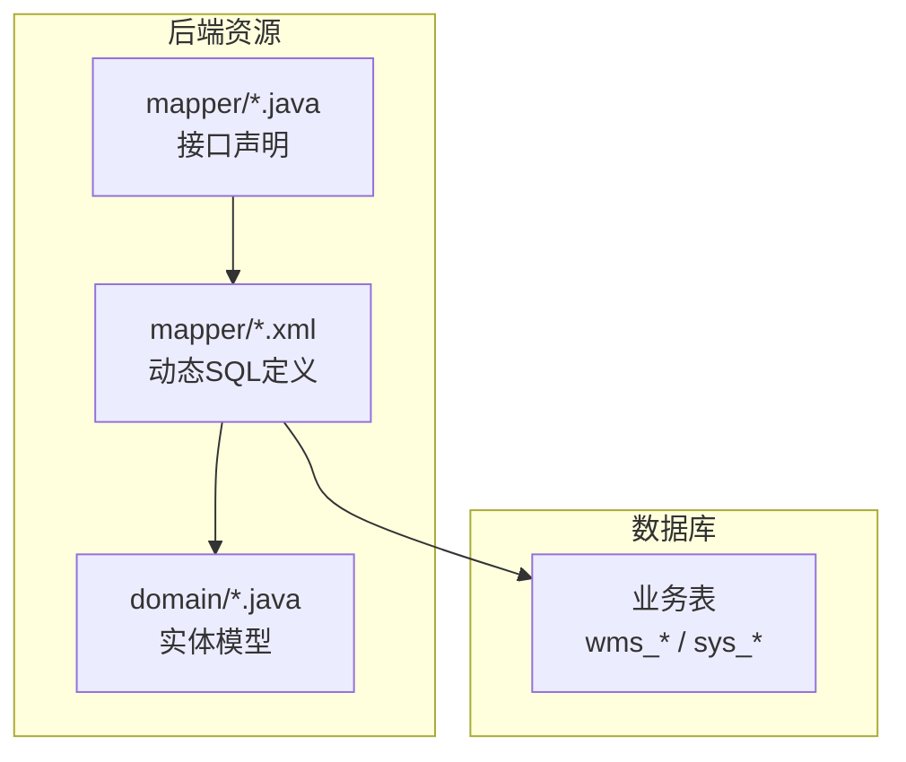
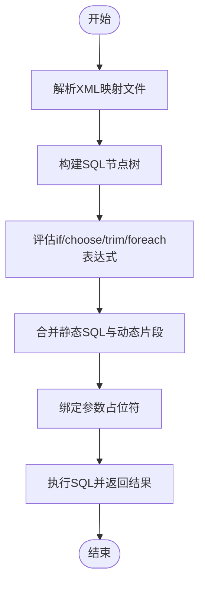
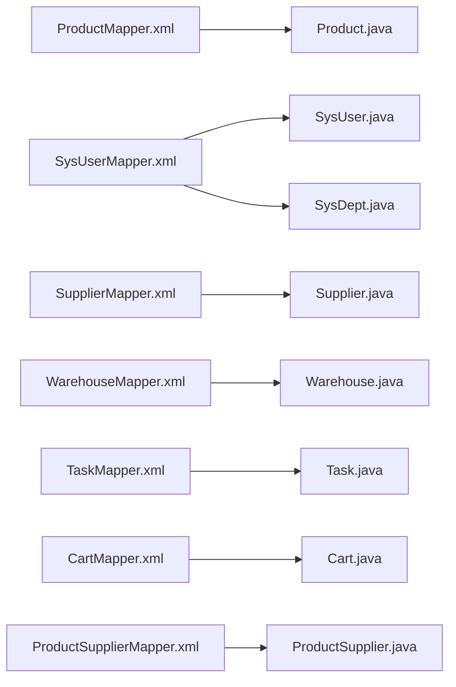

# 动态SQL处理

<cite>
**本文引用的文件**
- [ProductMapper.xml](file://task-manager-backend/src/main/resources/mapper/ProductMapper.xml)
- [SysUserMapper.xml](file://task-manager-backend/src/main/resources/mapper/SysUserMapper.xml)
- [TaskMapper.xml](file://task-manager-backend/src/main/resources/mapper/TaskMapper.xml)
- [SupplierMapper.xml](file://task-manager-backend/src/main/resources/mapper/SupplierMapper.xml)
- [WarehouseMapper.xml](file://task-manager-backend/src/main/resources/mapper/WarehouseMapper.xml)
- [CartMapper.xml](file://task-manager-backend/src/main/resources/mapper/CartMapper.xml)
- [SysDeptMapper.xml](file://task-manager-backend/src/main/resources/mapper/SysDeptMapper.xml)
- [ProductSupplierMapper.xml](file://task-manager-backend/src/main/resources/mapper/ProductSupplierMapper.xml)
</cite>

## 目录
1. [简介](#简介)
2. [项目结构](#项目结构)
3. [核心组件](#核心组件)
4. [架构总览](#架构总览)
5. [详细组件分析](#详细组件分析)
6. [依赖分析](#依赖分析)
7. [性能考虑](#性能考虑)
8. [故障排查指南](#故障排查指南)
9. [结论](#结论)
10. [附录](#附录)

## 简介
本文件围绕动态SQL在代码库中的实际应用进行系统化技术文档整理，重点覆盖以下方面：
- 动态SQL标签用法：if条件判断、choose/when/otherwise多分支选择、trim片段清理、foreach集合遍历
- 复杂查询场景：多条件搜索、权限过滤、分页查询
- 调试技巧与性能分析方法
- 动态SQL与静态SQL的结合策略
- 常见模式的最佳实践与错误处理

## 项目结构
本项目采用前后端分离架构，后端基于Spring Boot + MyBatis，动态SQL主要集中在各Mapper XML中。本文聚焦于后端资源目录下的mapper文件，这些XML定义了业务查询的SQL语句及动态片段。

[无图表来源；该图为概念性结构示意]

## 核心组件
- 条件判断：if标签用于根据参数值动态拼接WHERE子句片段
- 多分支选择：choose/when/otherwise用于互斥条件的分支控制
- 片段清理：trim标签用于去除多余的AND/OR与逗号
- 集合遍历：foreach标签用于IN列表、多值OR组合等集合场景

上述能力在多个Mapper中得到体现，例如：
- 多条件搜索：商品、用户、供应商、仓库等列表查询
- 权限过滤：部门层级查询、用户所属数据范围
- 分页查询：统一的分页查询模板与排序规则

**章节来源**
- [ProductMapper.xml:26-46](file://task-manager-backend/src/main/resources/mapper/ProductMapper.xml#L26-L46)
- [SysUserMapper.xml:35-56](file://task-manager-backend/src/main/resources/mapper/SysUserMapper.xml#L35-L56)
- [SupplierMapper.xml:27-54](file://task-manager-backend/src/main/resources/mapper/SupplierMapper.xml#L27-L54)
- [WarehouseMapper.xml:23-46](file://task-manager-backend/src/main/resources/mapper/WarehouseMapper.xml#L23-L46)

## 架构总览
动态SQL在MyBatis中通过XML映射文件定义，运行时由MyBatis解析器将动态片段与静态SQL合并生成最终可执行SQL。下图展示典型“条件拼接”流程：

[无图表来源；该图为通用流程示意]

## 详细组件分析

### if标签：条件判断与多条件搜索
- 典型用法
  - 字符串非空匹配：如商品名称、SKU、联系人姓名等模糊查询
  - 数值区间比较：如价格上下限
  - 状态精确匹配：如启用/停用状态
- 实例定位
  - 商品列表查询：[ProductMapper.xml:27-46](file://task-manager-backend/src/main/resources/mapper/ProductMapper.xml#L27-L46)
  - 用户列表查询：[SysUserMapper.xml:35-56](file://task-manager-backend/src/main/resources/mapper/SysUserMapper.xml#L35-L56)
  - 供应商列表查询：[SupplierMapper.xml:27-54](file://task-manager-backend/src/main/resources/mapper/SupplierMapper.xml#L27-L54)
  - 仓库列表查询：[WarehouseMapper.xml:23-46](file://task-manager-backend/src/main/resources/mapper/WarehouseMapper.xml#L23-L46)

最佳实践
- 对字符串参数先做非空判断，避免产生无意义的LIKE条件
- 数值比较建议成对出现（最小值与最大值），并在DAO层做好边界校验
- 使用明确的布尔或枚举值作为状态过滤，减少歧义

**章节来源**
- [ProductMapper.xml:27-46](file://task-manager-backend/src/main/resources/mapper/ProductMapper.xml#L27-L46)
- [SysUserMapper.xml:35-56](file://task-manager-backend/src/main/resources/mapper/SysUserMapper.xml#L35-L56)
- [SupplierMapper.xml:27-54](file://task-manager-backend/src/main/resources/mapper/SupplierMapper.xml#L27-L54)
- [WarehouseMapper.xml:23-46](file://task-manager-backend/src/main/resources/mapper/WarehouseMapper.xml#L23-L46)

### choose/when/otherwise：多分支选择
- 典型用法
  - 优先级条件分支：如先尝试精确匹配，再回退到模糊匹配
  - 互斥条件：如按ID优先、否则按名称/编号等
- 实例定位
  - 当前代码库未直接出现choose/when/otherwise标签的显式示例，但其思想广泛体现在if链与多条件组合中，可作为扩展模式参考

最佳实践
- 将最可能命中的条件放在前面，减少后续分支评估
- 避免过多分支导致SQL可读性下降，必要时拆分为多个独立查询或引入中间层

[本节不直接分析具体文件，故无章节来源]

### trim：SQL片段清理
- 典型用法
  - 去除多余的AND/OR与逗号，确保WHERE子句语法正确
- 实例定位
  - 当前代码库未直接出现trim标签的显式示例，但其思想广泛体现在if条件的串联与连接词的规范使用中，可作为扩展模式参考

最佳实践
- 在动态拼接WHERE子句时，统一使用AND/OR连接，并在必要处使用trim保证语法正确
- 对于复杂条件，建议在DAO层或服务层预处理，降低XML复杂度

[本节不直接分析具体文件，故无章节来源]

### foreach：集合遍历
- 典型用法
  - IN列表：如省份列表、分类列表
  - 多值OR组合：如多分类的任意匹配
- 实例定位
  - 供应商列表查询（省份列表IN）：[SupplierMapper.xml:34-39](file://task-manager-backend/src/main/resources/mapper/SupplierMapper.xml#L34-L39)
  - 供应商列表查询（分类多值OR）：[SupplierMapper.xml:43-49](file://task-manager-backend/src/main/resources/mapper/SupplierMapper.xml#L43-L49)
  - 仓库列表查询（省份列表IN）：[WarehouseMapper.xml:33-38](file://task-manager-backend/src/main/resources/mapper/WarehouseMapper.xml#L33-L38)

最佳实践
- 对集合大小进行限制，避免IN列表过大导致性能问题
- 对集合元素进行合法性校验，防止注入或无效值
- 在大数据量场景下，考虑使用临时表或批量插入替代超长IN列表

**章节来源**
- [SupplierMapper.xml:34-39](file://task-manager-backend/src/main/resources/mapper/SupplierMapper.xml#L34-L39)
- [SupplierMapper.xml:43-49](file://task-manager-backend/src/main/resources/mapper/SupplierMapper.xml#L43-L49)
- [WarehouseMapper.xml:33-38](file://task-manager-backend/src/main/resources/mapper/WarehouseMapper.xml#L33-L38)

### 复杂查询场景：多条件搜索、权限过滤、分页查询

#### 多条件搜索
- 商品列表：名称、SKU、状态、价格区间
  - 参考：[ProductMapper.xml:27-46](file://task-manager-backend/src/main/resources/mapper/ProductMapper.xml#L27-L46)
- 用户列表：用户名、手机号、状态、部门范围
  - 参考：[SysUserMapper.xml:35-56](file://task-manager-backend/src/main/resources/mapper/SysUserMapper.xml#L35-L56)
- 供应商列表：公司名、省份列表、联系人、分类列表、状态
  - 参考：[SupplierMapper.xml:27-54](file://task-manager-backend/src/main/resources/mapper/SupplierMapper.xml#L27-L54)
- 仓库列表：名称、编码、省份列表、类型、状态
  - 参考：[WarehouseMapper.xml:23-46](file://task-manager-backend/src/main/resources/mapper/WarehouseMapper.xml#L23-L46)

#### 权限过滤
- 部门层级展开：dept_id等于目标或祖先集合包含目标
  - 参考：[SysUserMapper.xml:50-54](file://task-manager-backend/src/main/resources/mapper/SysUserMapper.xml#L50-L54)
- 部门树查询：用于前端菜单/数据授权
  - 参考：[SysDeptMapper.xml:21-26](file://task-manager-backend/src/main/resources/mapper/SysDeptMapper.xml#L21-L26)

#### 分页查询
- 统一模板：WHERE + 多个if条件 + ORDER BY
- 排序字段：通常按创建时间倒序
- 示例参考：[ProductMapper.xml:27-46](file://task-manager-backend/src/main/resources/mapper/ProductMapper.xml#L27-L46)、[SysUserMapper.xml:35-56](file://task-manager-backend/src/main/resources/mapper/SysUserMapper.xml#L35-L56)、[SupplierMapper.xml:27-54](file://task-manager-backend/src/main/resources/mapper/SupplierMapper.xml#L27-L54)、[WarehouseMapper.xml:23-46](file://task-manager-backend/src/main/resources/mapper/WarehouseMapper.xml#L23-L46)

**章节来源**
- [SysUserMapper.xml:35-56](file://task-manager-backend/src/main/resources/mapper/SysUserMapper.xml#L35-L56)
- [SysDeptMapper.xml:21-26](file://task-manager-backend/src/main/resources/mapper/SysDeptMapper.xml#L21-L26)
- [ProductMapper.xml:27-46](file://task-manager-backend/src/main/resources/mapper/ProductMapper.xml#L27-L46)
- [SupplierMapper.xml:27-54](file://task-manager-backend/src/main/resources/mapper/SupplierMapper.xml#L27-L54)
- [WarehouseMapper.xml:23-46](file://task-manager-backend/src/main/resources/mapper/WarehouseMapper.xml#L23-L46)

### 动态SQL与静态SQL的结合策略
- 静态SQL负责不变的表名、列名、连接关系
- 动态SQL负责可变的过滤条件、排序与集合参数
- 结合方式
  - 固定SELECT/JOIN结构，仅在WHERE后追加动态片段
  - 对复杂条件使用多个if串联，保持SQL可读性
  - 对集合参数使用foreach，避免手写逗号分隔字符串

实例参考：
- 商品列表查询（静态表结构 + 动态过滤）：[ProductMapper.xml:27-46](file://task-manager-backend/src/main/resources/mapper/ProductMapper.xml#L27-L46)
- 供应商列表查询（静态表结构 + 动态IN/多值OR）：[SupplierMapper.xml:27-54](file://task-manager-backend/src/main/resources/mapper/SupplierMapper.xml#L27-L54)

**章节来源**
- [ProductMapper.xml:27-46](file://task-manager-backend/src/main/resources/mapper/ProductMapper.xml#L27-L46)
- [SupplierMapper.xml:27-54](file://task-manager-backend/src/main/resources/mapper/SupplierMapper.xml#L27-L54)

### 常见动态SQL模式与最佳实践
- 模式一：字符串模糊匹配
  - 规则：仅当参数非空时拼接LIKE条件
  - 参考：[ProductMapper.xml:30-38](file://task-manager-backend/src/main/resources/mapper/ProductMapper.xml#L30-L38)、[SupplierMapper.xml:31-42](file://task-manager-backend/src/main/resources/mapper/SupplierMapper.xml#L31-L42)
- 模式二：数值区间比较
  - 规则：最小值与最大值成对出现，避免单边条件
  - 参考：[ProductMapper.xml:39-44](file://task-manager-backend/src/main/resources/mapper/ProductMapper.xml#L39-L44)
- 模式三：集合参数IN与多值OR
  - 规则：先检查集合大小，再决定是否拼接
  - 参考：[SupplierMapper.xml:34-39](file://task-manager-backend/src/main/resources/mapper/SupplierMapper.xml#L34-L39)、[SupplierMapper.xml:43-49](file://task-manager-backend/src/main/resources/mapper/SupplierMapper.xml#L43-L49)
- 模式四：权限范围展开
  - 规则：dept_id等于目标或祖先集合包含目标
  - 参考：[SysUserMapper.xml:50-54](file://task-manager-backend/src/main/resources/mapper/SysUserMapper.xml#L50-L54)

错误处理建议
- 参数为空或非法时，提前返回空结果集或抛出明确异常
- 对集合参数进行长度限制与元素校验
- 对数值区间进行边界校验，防止无效范围

**章节来源**
- [ProductMapper.xml:30-44](file://task-manager-backend/src/main/resources/mapper/ProductMapper.xml#L30-L44)
- [SupplierMapper.xml:31-49](file://task-manager-backend/src/main/resources/mapper/SupplierMapper.xml#L31-L49)
- [SysUserMapper.xml:50-54](file://task-manager-backend/src/main/resources/mapper/SysUserMapper.xml#L50-L54)

## 依赖分析
动态SQL依赖关系主要体现在：
- Mapper XML依赖对应的实体类（resultMap）
- 查询方法依赖DAO接口与MyBatis配置
- 权限过滤依赖部门层级结构（ancestors）

**图表来源**
- [ProductMapper.xml:7](file://task-manager-backend/src/main/resources/mapper/ProductMapper.xml#L7)
- [SysUserMapper.xml:7](file://task-manager-backend/src/main/resources/mapper/SysUserMapper.xml#L7)
- [SupplierMapper.xml:7](file://task-manager-backend/src/main/resources/mapper/SupplierMapper.xml#L7)
- [WarehouseMapper.xml:7](file://task-manager-backend/src/main/resources/mapper/WarehouseMapper.xml#L7)
- [TaskMapper.xml:1](file://task-manager-backend/src/main/resources/mapper/TaskMapper.xml#L1)
- [CartMapper.xml:1](file://task-manager-backend/src/main/resources/mapper/CartMapper.xml#L1)
- [ProductSupplierMapper.xml:1](file://task-manager-backend/src/main/resources/mapper/ProductSupplierMapper.xml#L1)

**章节来源**
- [ProductMapper.xml:7](file://task-manager-backend/src/main/resources/mapper/ProductMapper.xml#L7)
- [SysUserMapper.xml:7](file://task-manager-backend/src/main/resources/mapper/SysUserMapper.xml#L7)
- [SupplierMapper.xml:7](file://task-manager-backend/src/main/resources/mapper/SupplierMapper.xml#L7)
- [WarehouseMapper.xml:7](file://task-manager-backend/src/main/resources/mapper/WarehouseMapper.xml#L7)
- [TaskMapper.xml:1](file://task-manager-backend/src/main/resources/mapper/TaskMapper.xml#L1)
- [CartMapper.xml:1](file://task-manager-backend/src/main/resources/mapper/CartMapper.xml#L1)
- [ProductSupplierMapper.xml:1](file://task-manager-backend/src/main/resources/mapper/ProductSupplierMapper.xml#L1)

## 性能考虑
- 条件选择
  - 优先命中率高的条件放前，减少后续评估
  - 对字符串匹配使用索引列，避免函数包裹导致索引失效
- 集合参数
  - 控制IN列表长度，必要时使用临时表或CTE
  - 对多值OR使用EXISTS或JOIN替代，提升可优化性
- 排序与分页
  - 明确ORDER BY列并建立索引
  - 分页查询使用LIMIT/OFFSET，避免全量扫描
- 执行计划
  - 定期检查慢查询日志，关注执行计划变化
  - 对复杂条件进行参数化，避免SQL碎片化

[本节提供一般性指导，不直接分析具体文件，故无章节来源]

## 故障排查指南
- 常见问题
  - SQL语法错误：检查动态片段拼接是否遗漏AND/OR或多余逗号
  - 参数绑定失败：确认参数名与占位符一致，避免大小写或命名差异
  - 权限范围异常：核对部门祖先关系与dept_id匹配逻辑
- 调试方法
  - 开启MyBatis日志，查看最终生成SQL
  - 使用数据库客户端执行相同SQL，验证语法与索引使用
  - 对集合参数打印长度与内容，确认边界条件
- 错误处理
  - 对空集合抛出明确异常，避免误判为“无数据”
  - 对越权访问返回鉴权失败，记录审计日志

[本节提供一般性指导，不直接分析具体文件，故无章节来源]

## 结论
本项目在多个Mapper中系统性地运用了动态SQL，涵盖条件判断、集合遍历与权限过滤等关键场景。通过if/choose/trim/foreach等标签的合理组合，实现了灵活且高效的查询能力。建议在后续迭代中：
- 引入trim统一清理连接词
- 对复杂条件进行模块化封装
- 加强参数校验与异常处理
- 持续监控执行计划与慢查询

[本节为总结性内容，不直接分析具体文件，故无章节来源]

## 附录
- 关键查询定位
  - 商品列表查询：[ProductMapper.xml:27-46](file://task-manager-backend/src/main/resources/mapper/ProductMapper.xml#L27-L46)
  - 用户列表查询（含部门范围）：[SysUserMapper.xml:35-56](file://task-manager-backend/src/main/resources/mapper/SysUserMapper.xml#L35-L56)
  - 供应商列表查询（IN/多值OR）：[SupplierMapper.xml:27-54](file://task-manager-backend/src/main/resources/mapper/SupplierMapper.xml#L27-L54)
  - 仓库列表查询（IN）：[WarehouseMapper.xml:23-46](file://task-manager-backend/src/main/resources/mapper/WarehouseMapper.xml#L23-L46)
  - 任务列表查询（关键词/状态）：[TaskMapper.xml:5-18](file://task-manager-backend/src/main/resources/mapper/TaskMapper.xml#L5-L18)
  - 购物车明细查询（左连接+逻辑删除）：[CartMapper.xml:5-12](file://task-manager-backend/src/main/resources/mapper/CartMapper.xml#L5-L12)
  - 部门树查询（权限基础）：[SysDeptMapper.xml:21-26](file://task-manager-backend/src/main/resources/mapper/SysDeptMapper.xml#L21-L26)
  - 商品供应商关联查询：[ProductSupplierMapper.xml:25-32](file://task-manager-backend/src/main/resources/mapper/ProductSupplierMapper.xml#L25-L32)

**章节来源**
- [ProductMapper.xml:27-46](file://task-manager-backend/src/main/resources/mapper/ProductMapper.xml#L27-L46)
- [SysUserMapper.xml:35-56](file://task-manager-backend/src/main/resources/mapper/SysUserMapper.xml#L35-L56)
- [SupplierMapper.xml:27-54](file://task-manager-backend/src/main/resources/mapper/SupplierMapper.xml#L27-L54)
- [WarehouseMapper.xml:23-46](file://task-manager-backend/src/main/resources/mapper/WarehouseMapper.xml#L23-L46)
- [TaskMapper.xml:5-18](file://task-manager-backend/src/main/resources/mapper/TaskMapper.xml#L5-L18)
- [CartMapper.xml:5-12](file://task-manager-backend/src/main/resources/mapper/CartMapper.xml#L5-L12)
- [SysDeptMapper.xml:21-26](file://task-manager-backend/src/main/resources/mapper/SysDeptMapper.xml#L21-L26)
- [ProductSupplierMapper.xml:25-32](file://task-manager-backend/src/main/resources/mapper/ProductSupplierMapper.xml#L25-L32)