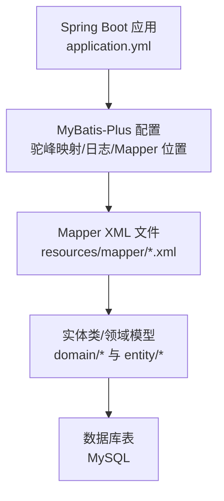
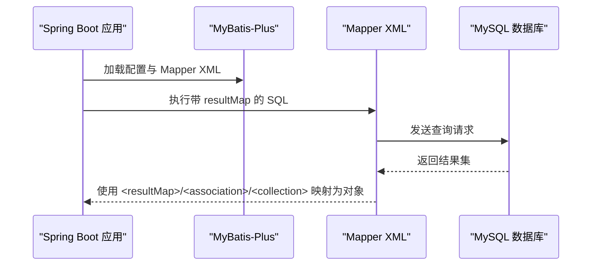

# 结果集映射

<cite>
**本文引用的文件**
- [application.yml](file://task-manager-backend/src/main/resources/application.yml)
- [ProductMapper.xml](file://task-manager-backend/src/main/resources/mapper/ProductMapper.xml)
- [SysUserMapper.xml](file://task-manager-backend/src/main/resources/mapper/SysUserMapper.xml)
- [WarehouseMapper.xml](file://task-manager-backend/src/main/resources/mapper/WarehouseMapper.xml)
- [SysDeptMapper.xml](file://task-manager-backend/src/main/resources/mapper/SysDeptMapper.xml)
- [SysRoleMapper.xml](file://task-manager-backend/src/main/resources/mapper/SysRoleMapper.xml)
- [ProductSupplierMapper.xml](file://task-manager-backend/src/main/resources/mapper/ProductSupplierMapper.xml)
- [CartMapper.xml](file://task-manager-backend/src/main/resources/mapper/CartMapper.xml)
- [OrderMapper.xml](file://task-manager-backend/src/main/resources/mapper/OrderMapper.xml)
- [OrderItemMapper.xml](file://task-manager-backend/src/main/resources/mapper/OrderItemMapper.xml)
- [UserMapper.xml](file://task-manager-backend/src/main/resources/mapper/UserMapper.xml)
- [TaskMapper.xml](file://task-manager-backend/src/main/resources/mapper/TaskMapper.xml)
</cite>

## 目录
1. [引言](#引言)
2. [项目结构](#项目结构)
3. [核心组件](#核心组件)
4. [架构总览](#架构总览)
5. [详细组件分析](#详细组件分析)
6. [依赖分析](#依赖分析)
7. [性能考虑](#性能考虑)
8. [故障排查指南](#故障排查指南)
9. [结论](#结论)
10. [附录](#附录)

## 引言
本文件围绕“结果集映射”主题，系统梳理与实践相关的配置与实现要点，重点覆盖：
- resultMap 元素的完整配置与 id/result 的使用差异
- 嵌套结果映射：association 与 collection 的使用场景与策略
- 关联查询的结果映射处理：一对多、多对多的映射思路
- resultMap 的继承与复用机制
- 性能优化技巧与常见问题的解决方案
- Java 类型与数据库类型的转换规则

本项目基于 Spring Boot + MyBatis-Plus，XML 映射文件集中于 resources/mapper 下，通过 application.yml 中的 MyBatis-Plus 配置加载。

## 项目结构
- 后端采用 Spring Boot 工程，MyBatis-Plus 负责 ORM 映射
- XML 映射文件位于 resources/mapper，命名规范清晰，便于按模块检索
- application.yml 中配置了 MyBatis-Plus 的驼峰映射、日志输出、Mapper 文件位置等关键参数

图表来源
- [application.yml:33-38](file://task-manager-backend/src/main/resources/application.yml#L33-L38)

章节来源
- [application.yml:1-79](file://task-manager-backend/src/main/resources/application.yml#L1-L79)

## 核心组件
- 结果映射定义：在各 Mapper XML 中以 <resultMap> 定义，包含 id 与 result 子元素，分别映射主键与普通字段
- 字段映射：通过 column 属性指定数据库列名，property 指定实体属性名
- 复杂映射：通过 <association> 与 <collection> 实现一对一、一对多、多对多的嵌套映射
- 关联查询：在 SQL 中进行 JOIN，由 resultMap 将结果集映射到复合对象
- 类型转换：MyBatis-Plus 默认启用下划线转驼峰映射，减少手动映射工作量

章节来源
- [ProductMapper.xml:6-24](file://task-manager-backend/src/main/resources/mapper/ProductMapper.xml#L6-L24)
- [SysUserMapper.xml:6-27](file://task-manager-backend/src/main/resources/mapper/SysUserMapper.xml#L6-L27)
- [WarehouseMapper.xml:6-21](file://task-manager-backend/src/main/resources/mapper/WarehouseMapper.xml#L6-L21)
- [SysDeptMapper.xml:6-19](file://task-manager-backend/src/main/resources/mapper/SysDeptMapper.xml#L6-L19)
- [SysRoleMapper.xml:6-17](file://task-manager-backend/src/main/resources/mapper/SysRoleMapper.xml#L6-L17)
- [ProductSupplierMapper.xml:6-23](file://task-manager-backend/src/main/resources/mapper/ProductSupplierMapper.xml#L6-L23)
- [CartMapper.xml:5-12](file://task-manager-backend/src/main/resources/mapper/CartMapper.xml#L5-L12)

## 架构总览
MyBatis-Plus 在启动时读取 application.yml 中的 mapperLocations，扫描 resources/mapper 下的 XML 文件；执行 SQL 后，依据 Mapper XML 中的 <resultMap>/<result>/<id> 或 <association>/<collection> 等节点，将数据库记录映射为 Java 对象或复合对象。

图表来源
- [application.yml:38-38](file://task-manager-backend/src/main/resources/application.yml#L38-L38)
- [ProductMapper.xml:27-46](file://task-manager-backend/src/main/resources/mapper/ProductMapper.xml#L27-L46)
- [SysUserMapper.xml:29-56](file://task-manager-backend/src/main/resources/mapper/SysUserMapper.xml#L29-L56)

## 详细组件分析

### 1) resultMap 元素与 id/result 的使用差异
- id：用于标识主键字段，MyBatis 会将其作为缓存键的一部分，提升二级缓存命中率
- result：用于普通字段映射，不参与缓存键生成
- 两者均需指定 column 与 property，确保数据库列与实体属性正确对应

示例参考：
- 商品映射：[ProductMapper.xml:6-24](file://task-manager-backend/src/main/resources/mapper/ProductMapper.xml#L6-L24)
- 用户映射：[SysUserMapper.xml:6-27](file://task-manager-backend/src/main/resources/mapper/SysUserMapper.xml#L6-L27)
- 仓库映射：[WarehouseMapper.xml:6-21](file://task-manager-backend/src/main/resources/mapper/WarehouseMapper.xml#L6-L21)

章节来源
- [ProductMapper.xml:6-24](file://task-manager-backend/src/main/resources/mapper/ProductMapper.xml#L6-L24)
- [SysUserMapper.xml:6-27](file://task-manager-backend/src/main/resources/mapper/SysUserMapper.xml#L6-L27)
- [WarehouseMapper.xml:6-21](file://task-manager-backend/src/main/resources/mapper/WarehouseMapper.xml#L6-L21)

### 2) 嵌套结果映射：association 与 collection 的使用场景
- association：用于一对一或单个对象的嵌套映射，常用于“用户所属部门”的场景
- collection：用于一对多或多对多中的集合属性，常用于“用户的角色列表”“商品的供应商列表”等
- 在本项目中，未直接出现 association/collection 的 XML 示例；但可通过以下方式实现：
  - 在 SQL 中 JOIN 并拼接字段，再由 <resultMap> 通过 <result> 映射到复合对象
  - 若需要 association/collection，可在现有 XML 中扩展，或新增专用 Mapper XML

示例参考（JOIN 拼接字段的思路）：
- 用户与部门 JOIN：[SysUserMapper.xml:36-56](file://task-manager-backend/src/main/resources/mapper/SysUserMapper.xml#L36-L56)
- 商品与供应商 JOIN：[ProductSupplierMapper.xml:26-32](file://task-manager-backend/src/main/resources/mapper/ProductSupplierMapper.xml#L26-L32)
- 购物车与商品 JOIN：[CartMapper.xml:5-12](file://task-manager-backend/src/main/resources/mapper/CartMapper.xml#L5-L12)

章节来源
- [SysUserMapper.xml:36-56](file://task-manager-backend/src/main/resources/mapper/SysUserMapper.xml#L36-L56)
- [ProductSupplierMapper.xml:26-32](file://task-manager-backend/src/main/resources/mapper/ProductSupplierMapper.xml#L26-L32)
- [CartMapper.xml:5-12](file://task-manager-backend/src/main/resources/mapper/CartMapper.xml#L5-L12)

### 3) 关联查询的结果映射处理：一对多、多对多
- 一对多：通过 JOIN 将主表与从表合并，使用一个 resultMap 将主对象与从表字段映射到复合对象
- 多对多：通过中间表拆分，先映射中间表，再在业务层组装成多对多关系
- 本项目中，用户与角色、用户与部门、商品与供应商等关系均可通过 JOIN 实现一对多映射

示例参考：
- 用户与角色（内连接）：[SysRoleMapper.xml:20-24](file://task-manager-backend/src/main/resources/mapper/SysRoleMapper.xml#L20-L24)
- 用户与部门（左连接）：[SysUserMapper.xml:36-56](file://task-manager-backend/src/main/resources/mapper/SysUserMapper.xml#L36-L56)
- 商品与供应商（左连接）：[ProductSupplierMapper.xml:26-32](file://task-manager-backend/src/main/resources/mapper/ProductSupplierMapper.xml#L26-L32)

章节来源
- [SysRoleMapper.xml:20-24](file://task-manager-backend/src/main/resources/mapper/SysRoleMapper.xml#L20-L24)
- [SysUserMapper.xml:36-56](file://task-manager-backend/src/main/resources/mapper/SysUserMapper.xml#L36-L56)
- [ProductSupplierMapper.xml:26-32](file://task-manager-backend/src/main/resources/mapper/ProductSupplierMapper.xml#L26-L32)

### 4) resultMap 的继承与复用机制
- 继承：MyBatis 支持通过 extends 属性继承已有 resultMap，避免重复定义
- 复用：将通用字段抽取到基础 resultMap，其他映射通过 extends 引入，再追加特有字段
- 本项目中未直接出现 extends 示例，建议在大型项目中推广该模式，以降低维护成本

章节来源
- [SysUserMapper.xml:6-27](file://task-manager-backend/src/main/resources/mapper/SysUserMapper.xml#L6-L27)
- [ProductMapper.xml:6-24](file://task-manager-backend/src/main/resources/mapper/ProductMapper.xml#L6-L24)

### 5) Java 类型与数据库类型的转换规则
- 驼峰映射：application.yml 中开启 mapUnderscoreToCamelCase，自动将下划线命名转换为驼峰命名，减少字段映射
- 类型适配：MyBatis-Plus 默认使用 TypeHandler 进行 Java 与 JDBC 类型之间的转换
- 注意事项：枚举、日期、布尔值等特殊类型需确保数据库与 Java 类型一致或提供自定义 TypeHandler

章节来源
- [application.yml:35-36](file://task-manager-backend/src/main/resources/application.yml#L35-L36)

### 6) 实战示例与最佳实践
- 商品列表与详情：通过 ProductMapper.xml 定义 resultMap，并在 select 中引用，实现字段级映射
- 用户列表与详情：通过 SysUserMapper.xml 定义 resultMap，并在 select 中引用，实现 JOIN 后的字段映射
- 仓库列表：通过 WarehouseMapper.xml 定义 resultMap，并在 select 中引用，实现条件过滤后的映射
- 用户与角色、用户与部门、商品与供应商：通过 JOIN 查询，结合 resultMap 实现一对多映射

章节来源
- [ProductMapper.xml:27-52](file://task-manager-backend/src/main/resources/mapper/ProductMapper.xml#L27-L52)
- [SysUserMapper.xml:29-56](file://task-manager-backend/src/main/resources/mapper/SysUserMapper.xml#L29-L56)
- [WarehouseMapper.xml:24-53](file://task-manager-backend/src/main/resources/mapper/WarehouseMapper.xml#L24-L53)
- [SysRoleMapper.xml:20-24](file://task-manager-backend/src/main/resources/mapper/SysRoleMapper.xml#L20-L24)
- [ProductSupplierMapper.xml:26-32](file://task-manager-backend/src/main/resources/mapper/ProductSupplierMapper.xml#L26-L32)

## 依赖分析
- 配置依赖：application.yml 决定 MyBatis-Plus 的扫描路径、驼峰映射与日志输出
- 映射依赖：各 Mapper XML 通过 namespace 与接口绑定，SQL 中通过 resultMap 或 resultType 指定映射策略
- 实体依赖：resultMap 的 type 指向 domain/entity 下的实体类，column 与 property 需与实体保持一致

图表来源
- [application.yml:33-38](file://task-manager-backend/src/main/resources/application.yml#L33-L38)
- [ProductMapper.xml:3-4](file://task-manager-backend/src/main/resources/mapper/ProductMapper.xml#L3-L4)
- [SysUserMapper.xml:3-4](file://task-manager-backend/src/main/resources/mapper/SysUserMapper.xml#L3-L4)

章节来源
- [application.yml:33-38](file://task-manager-backend/src/main/resources/application.yml#L33-L38)
- [ProductMapper.xml:3-4](file://task-manager-backend/src/main/resources/mapper/ProductMapper.xml#L3-L4)
- [SysUserMapper.xml:3-4](file://task-manager-backend/src/main/resources/mapper/SysUserMapper.xml#L3-L4)

## 性能考虑
- 启用驼峰映射：减少字段名映射开销，提升可维护性
- 合理使用 resultType 与 resultMap：简单映射优先 resultType，复杂映射使用 resultMap
- JOIN 查询的边界控制：避免 N+1 查询，尽量在一次查询中完成关联数据拼装
- 逻辑删除字段：利用 MyBatis-Plus 的逻辑删除配置，避免全表扫描
- 分页查询：在 SQL 中添加分页条件，避免一次性返回大量数据

章节来源
- [application.yml:35-44](file://task-manager-backend/src/main/resources/application.yml#L35-L44)
- [ProductMapper.xml:27-52](file://task-manager-backend/src/main/resources/mapper/ProductMapper.xml#L27-L52)
- [SysUserMapper.xml:36-56](file://task-manager-backend/src/main/resources/mapper/SysUserMapper.xml#L36-L56)

## 故障排查指南
- 字段映射失败：检查 XML 中 column 与 property 是否匹配，确认是否启用驼峰映射
- 关联查询结果异常：核对 JOIN 条件与字段别名，确保别名与 resultMap 中的 column 一致
- 逻辑删除导致数据缺失：确认逻辑删除字段与值配置正确
- 日志定位：开启 MyBatis 日志输出，查看实际执行的 SQL 与参数

章节来源
- [application.yml:35-37](file://task-manager-backend/src/main/resources/application.yml#L35-L37)
- [application.yml:42-44](file://task-manager-backend/src/main/resources/application.yml#L42-L44)

## 结论
- 本项目通过 XML 映射文件与 MyBatis-Plus 配置，实现了从数据库到 Java 对象的高效映射
- 建议在复杂场景中引入 association/collection 与 extends 继承机制，提升映射能力与可维护性
- 通过驼峰映射、合理选择 resultType 与 resultMap、JOIN 边界控制与逻辑删除等手段，可显著提升性能与稳定性

## 附录
- 未使用的 Mapper XML：OrderMapper.xml、OrderItemMapper.xml
  - 可在此基础上补充 resultMap 与 association/collection 示例，完善一对多/多对多映射实践
- 其他 Mapper XML：UserMapper.xml、TaskMapper.xml
  - UserMapper.xml 使用 resultType 简化映射；TaskMapper.xml 提供分页与条件查询示例

章节来源
- [OrderMapper.xml:1-5](file://task-manager-backend/src/main/resources/mapper/OrderMapper.xml#L1-L5)
- [OrderItemMapper.xml:1-5](file://task-manager-backend/src/main/resources/mapper/OrderItemMapper.xml#L1-L5)
- [UserMapper.xml:1-13](file://task-manager-backend/src/main/resources/mapper/UserMapper.xml#L1-L13)
- [TaskMapper.xml:6-18](file://task-manager-backend/src/main/resources/mapper/TaskMapper.xml#L6-L18)