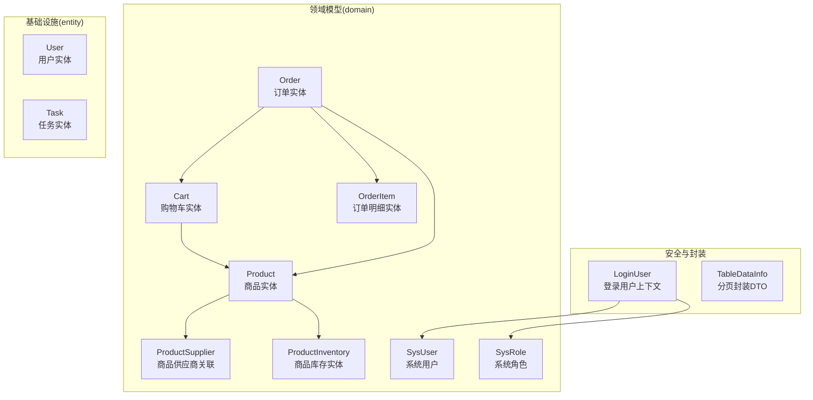
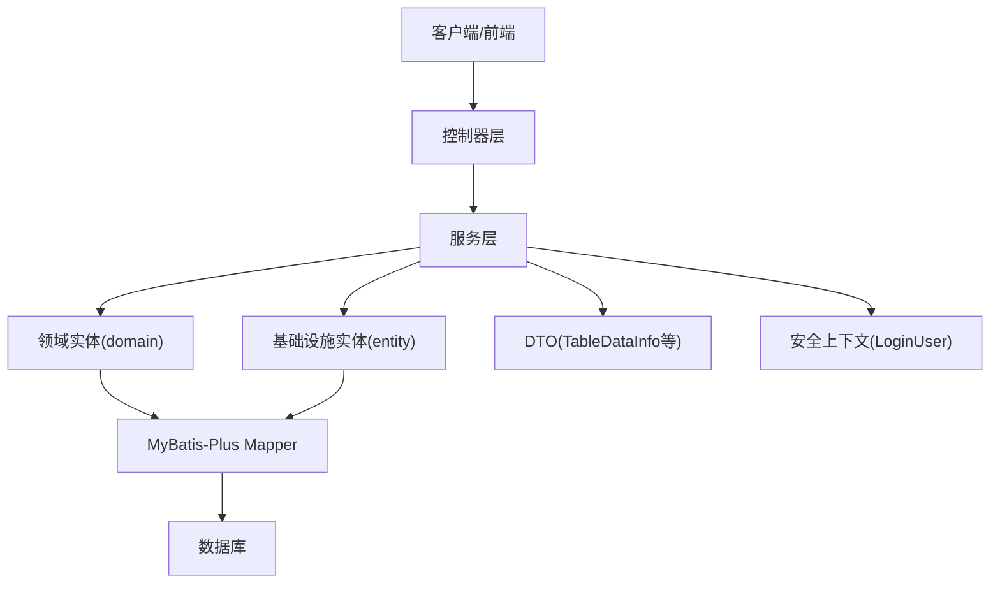
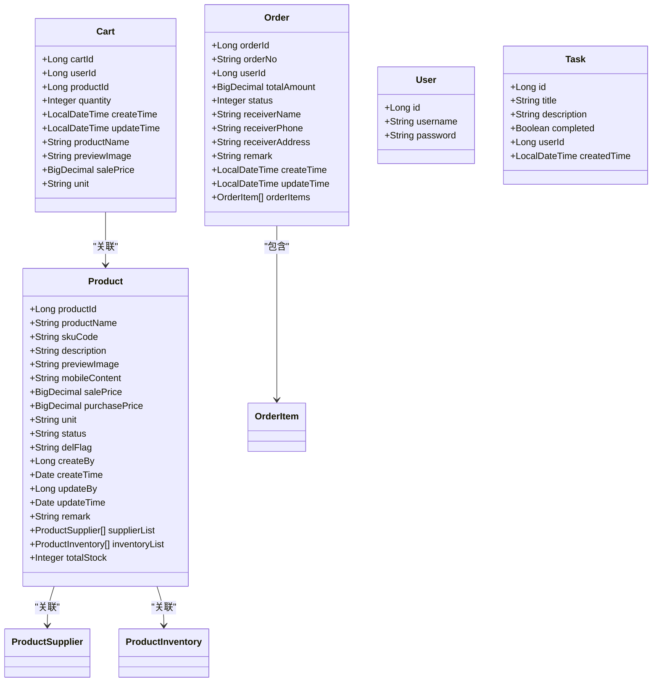
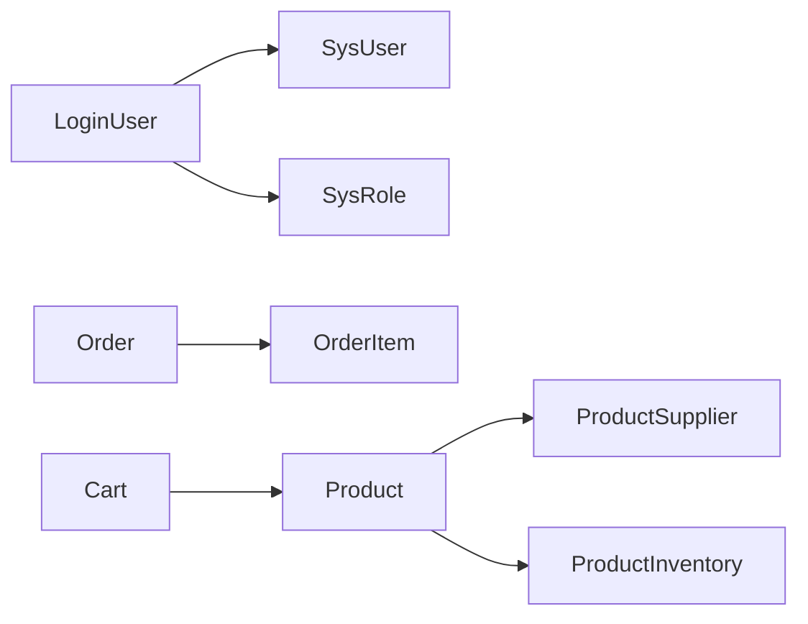

# 业务实体类

<cite>
**本文引用的文件**
- [Cart.java](file://task-manager-backend/src/main/java/com/taskmanager/domain/Cart.java)
- [Order.java](file://task-manager-backend/src/main/java/com/taskmanager/domain/Order.java)
- [OrderItem.java](file://task-manager-backend/src/main/java/com/taskmanager/domain/OrderItem.java)
- [Product.java](file://task-manager-backend/src/main/java/com/taskmanager/domain/Product.java)
- [ProductSupplier.java](file://task-manager-backend/src/main/java/com/taskmanager/domain/ProductSupplier.java)
- [ProductInventory.java](file://task-manager-backend/src/main/java/com/taskmanager/domain/ProductInventory.java)
- [SysUser.java](file://task-manager-backend/src/main/java/com/taskmanager/domain/SysUser.java)
- [SysRole.java](file://task-manager-backend/src/main/java/com/taskmanager/domain/SysRole.java)
- [LoginUser.java](file://task-manager-backend/src/main/java/com/taskmanager/security/LoginUser.java)
- [User.java](file://task-manager-backend/src/main/java/com/taskmanager/entity/User.java)
- [Task.java](file://task-manager-backend/src/main/java/com/taskmanager/entity/Task.java)
- [BaseControllerTest.java](file://task-manager-backend/src/test/java/com/taskmanager/controller/BaseControllerTest.java)
- [TableDataInfo.java](file://task-manager-backend/src/main/java/com/taskmanager/common/utils/TableDataInfo.java)
</cite>

## 目录
1. [引言](#引言)
2. [项目结构](#项目结构)
3. [核心组件](#核心组件)
4. [架构总览](#架构总览)
5. [详细组件分析](#详细组件分析)
6. [依赖分析](#依赖分析)
7. [性能考虑](#性能考虑)
8. [故障排查指南](#故障排查指南)
9. [结论](#结论)
10. [附录](#附录)

## 引言
本文件围绕业务实体类展开，结合代码库中现有的领域模型与基础设施，系统阐述业务实体类与数据库实体类的区别、应用场景、设计原则与封装策略，并给出基于该代码库的落地实践建议。同时，结合现有实体类与安全上下文，说明如何在不直接暴露数据库实体的前提下，通过业务实体类承载业务规则与行为，实现面向对象的领域建模。

## 项目结构
本项目采用后端分层结构，业务实体主要位于 domain 包，数据库实体位于 entity 包，安全上下文 LoginUser 组合了 SysUser 与 SysRole 等领域实体，形成“业务实体 + 安全上下文”的组合使用方式。分页封装 TableDataInfo 展示了 DTO 的典型形态，便于理解业务实体与 DTO 的边界。

图表来源
- [Cart.java:1-61](file://task-manager-backend/src/main/java/com/taskmanager/domain/Cart.java#L1-L61)
- [Order.java:1-65](file://task-manager-backend/src/main/java/com/taskmanager/domain/Order.java#L1-L65)
- [OrderItem.java:1-44](file://task-manager-backend/src/main/java/com/taskmanager/domain/OrderItem.java#L1-L44)
- [Product.java:1-97](file://task-manager-backend/src/main/java/com/taskmanager/domain/Product.java#L1-L97)
- [ProductSupplier.java:1-71](file://task-manager-backend/src/main/java/com/taskmanager/domain/ProductSupplier.java#L1-L71)
- [ProductInventory.java:1-67](file://task-manager-backend/src/main/java/com/taskmanager/domain/ProductInventory.java#L1-L67)
- [SysUser.java:1-80](file://task-manager-backend/src/main/java/com/taskmanager/domain/SysUser.java#L1-L80)
- [SysRole.java:1-65](file://task-manager-backend/src/main/java/com/taskmanager/domain/SysRole.java#L1-L65)
- [User.java:1-31](file://task-manager-backend/src/main/java/com/taskmanager/entity/User.java#L1-L31)
- [Task.java:1-50](file://task-manager-backend/src/main/java/com/taskmanager/entity/Task.java#L1-L50)
- [LoginUser.java:1-110](file://task-manager-backend/src/main/java/com/taskmanager/security/LoginUser.java#L1-L110)
- [TableDataInfo.java:1-60](file://task-manager-backend/src/main/java/com/taskmanager/common/utils/TableDataInfo.java#L1-L60)

章节来源
- [Cart.java:1-61](file://task-manager-backend/src/main/java/com/taskmanager/domain/Cart.java#L1-L61)
- [Order.java:1-65](file://task-manager-backend/src/main/java/com/taskmanager/domain/Order.java#L1-L65)
- [Product.java:1-97](file://task-manager-backend/src/main/java/com/taskmanager/domain/Product.java#L1-L97)
- [SysUser.java:1-80](file://task-manager-backend/src/main/java/com/taskmanager/domain/SysUser.java#L1-L80)
- [SysRole.java:1-65](file://task-manager-backend/src/main/java/com/taskmanager/domain/SysRole.java#L1-L65)
- [LoginUser.java:1-110](file://task-manager-backend/src/main/java/com/taskmanager/security/LoginUser.java#L1-L110)
- [TableDataInfo.java:1-60](file://task-manager-backend/src/main/java/com/taskmanager/common/utils/TableDataInfo.java#L1-L60)

## 核心组件
- 领域实体（domain）：以 MyBatis-Plus 注解映射数据库表，承载业务属性与跨表非持久化字段，体现“业务实体”概念。
- 基础设施实体（entity）：以 MyBatis-Plus 注解映射数据库表，通常更贴近数据库结构，可视为“数据库实体”的代表。
- 安全上下文（LoginUser）：组合 SysUser 与 SysRole，实现 UserDetails 接口，作为认证与授权的载体。
- 分页封装（TableDataInfo）：典型的 DTO，用于对外输出分页数据，体现“业务实体与DTO分离”的边界。

章节来源
- [Cart.java:1-61](file://task-manager-backend/src/main/java/com/taskmanager/domain/Cart.java#L1-L61)
- [Order.java:1-65](file://task-manager-backend/src/main/java/com/taskmanager/domain/Order.java#L1-L65)
- [Product.java:1-97](file://task-manager-backend/src/main/java/com/taskmanager/domain/Product.java#L1-L97)
- [User.java:1-31](file://task-manager-backend/src/main/java/com/taskmanager/entity/User.java#L1-L31)
- [Task.java:1-50](file://task-manager-backend/src/main/java/com/taskmanager/entity/Task.java#L1-L50)
- [LoginUser.java:1-110](file://task-manager-backend/src/main/java/com/taskmanager/security/LoginUser.java#L1-L110)
- [TableDataInfo.java:1-60](file://task-manager-backend/src/main/java/com/taskmanager/common/utils/TableDataInfo.java#L1-L60)

## 架构总览
业务实体类在本项目中承担“业务规则与行为”的职责，数据库实体负责“数据持久化”，安全上下文负责“认证与授权”，DTO 负责“跨层/跨服务的数据传输”。三者协同，避免直接暴露数据库实体给表现层或外部接口。

图表来源
- [LoginUser.java:1-110](file://task-manager-backend/src/main/java/com/taskmanager/security/LoginUser.java#L1-L110)
- [TableDataInfo.java:1-60](file://task-manager-backend/src/main/java/com/taskmanager/common/utils/TableDataInfo.java#L1-L60)
- [Cart.java:1-61](file://task-manager-backend/src/main/java/com/taskmanager/domain/Cart.java#L1-L61)
- [Order.java:1-65](file://task-manager-backend/src/main/java/com/taskmanager/domain/Order.java#L1-L65)
- [Product.java:1-97](file://task-manager-backend/src/main/java/com/taskmanager/domain/Product.java#L1-L97)
- [User.java:1-31](file://task-manager-backend/src/main/java/com/taskmanager/entity/User.java#L1-L31)

## 详细组件分析

### 业务实体类与数据库实体类的区别与应用
- 业务实体类（domain）：强调业务语义与行为，常包含跨表的非持久化字段，用于聚合展示与业务计算；适合对外输出与服务内协作。
- 数据库实体类（entity）：强调与数据库表的直接映射，字段与表结构一一对应；适合数据访问层与持久化操作。
- 在本项目中，Cart、Order、Product 等属于业务实体类，User、Task 属于数据库实体类。

图表来源
- [Cart.java:1-61](file://task-manager-backend/src/main/java/com/taskmanager/domain/Cart.java#L1-L61)
- [Order.java:1-65](file://task-manager-backend/src/main/java/com/taskmanager/domain/Order.java#L1-L65)
- [OrderItem.java:1-44](file://task-manager-backend/src/main/java/com/taskmanager/domain/OrderItem.java#L1-L44)
- [Product.java:1-97](file://task-manager-backend/src/main/java/com/taskmanager/domain/Product.java#L1-L97)
- [ProductSupplier.java:1-71](file://task-manager-backend/src/main/java/com/taskmanager/domain/ProductSupplier.java#L1-L71)
- [ProductInventory.java:1-67](file://task-manager-backend/src/main/java/com/taskmanager/domain/ProductInventory.java#L1-L67)
- [User.java:1-31](file://task-manager-backend/src/main/java/com/taskmanager/entity/User.java#L1-L31)
- [Task.java:1-50](file://task-manager-backend/src/main/java/com/taskmanager/entity/Task.java#L1-L50)

章节来源
- [Cart.java:1-61](file://task-manager-backend/src/main/java/com/taskmanager/domain/Cart.java#L1-L61)
- [Order.java:1-65](file://task-manager-backend/src/main/java/com/taskmanager/domain/Order.java#L1-L65)
- [Product.java:1-97](file://task-manager-backend/src/main/java/com/taskmanager/domain/Product.java#L1-L97)
- [User.java:1-31](file://task-manager-backend/src/main/java/com/taskmanager/entity/User.java#L1-L31)
- [Task.java:1-50](file://task-manager-backend/src/main/java/com/taskmanager/entity/Task.java#L1-L50)

### 设计原则与封装策略（含 DDD 视角）
- 聚合根与值对象：Order 作为聚合根，聚合内部包含 OrderItem；Product 作为聚合根，聚合内部包含 ProductSupplier 与 ProductInventory。这种设计体现了 DDD 的聚合边界与一致性维护。
- 非持久化字段：业务实体类通过 @TableField(exist=false) 暴露跨表聚合字段（如 productName、previewImage、salePrice、unit、supplierList、inventoryList、totalStock），减少多次查询与跨层传递复杂度。
- 不变性与封装：通过 Lombok 的 @Data 提供 getter/setter，但建议在服务层对业务实体进行受控修改，避免直接暴露可变状态给表现层。

章节来源
- [Order.java:1-65](file://task-manager-backend/src/main/java/com/taskmanager/domain/Order.java#L1-L65)
- [OrderItem.java:1-44](file://task-manager-backend/src/main/java/com/taskmanager/domain/OrderItem.java#L1-L44)
- [Product.java:1-97](file://task-manager-backend/src/main/java/com/taskmanager/domain/Product.java#L1-L97)
- [ProductSupplier.java:1-71](file://task-manager-backend/src/main/java/com/taskmanager/domain/ProductSupplier.java#L1-L71)
- [ProductInventory.java:1-67](file://task-manager-backend/src/main/java/com/taskmanager/domain/ProductInventory.java#L1-L67)

### 属性设计与行为封装（Getter/Setter 最佳实践）
- 使用 @Data 自动生成访问器，保持简洁与一致。
- 对于跨表字段（如销售价格、预览图、供应商名称等），在业务实体中统一暴露，便于服务层一次性组装。
- 对于枚举或状态字段（如订单状态、商品状态），建议在服务层进行状态流转控制，避免直接暴露底层整型状态码。

章节来源
- [Cart.java:1-61](file://task-manager-backend/src/main/java/com/taskmanager/domain/Cart.java#L1-L61)
- [Order.java:1-65](file://task-manager-backend/src/main/java/com/taskmanager/domain/Order.java#L1-L65)
- [Product.java:1-97](file://task-manager-backend/src/main/java/com/taskmanager/domain/Product.java#L1-L97)

### 构造函数设计与工厂模式应用
- LoginUser 提供带参构造函数，将 SysUser、权限集合与角色列表组合，体现“工厂式装配”思想，便于在认证流程中快速构建安全上下文。
- 建议在服务层引入工厂或 Builder，用于根据业务场景创建不同类型的业务实体（如订单、购物车等），避免在控制器或工具类中分散创建逻辑。

章节来源
- [LoginUser.java:1-110](file://task-manager-backend/src/main/java/com/taskmanager/security/LoginUser.java#L1-L110)

### 业务逻辑封装与方法设计
- LoginUser 实现 UserDetails，将权限字符串集合转换为 GrantedAuthority 集合，体现“权限封装”的方法设计。
- 建议在服务层为业务实体添加业务方法（如订单状态机、库存扣减、价格计算等），并在方法中进行参数校验与异常处理，保证业务规则的一致性。

章节来源
- [LoginUser.java:1-110](file://task-manager-backend/src/main/java/com/taskmanager/security/LoginUser.java#L1-L110)

### equals 与 hashCode 实现
- 业务实体类多为数据载体，默认 equals/hashCode 可满足大多数场景；若需按业务主键比较，应在服务层通过业务主键（如 orderId、productId）进行比较，避免直接依赖对象相等性。
- 对于集合去重，建议使用业务主键构建 Set 或 Map，确保语义清晰且性能稳定。

[本节为通用指导，无需列出具体文件来源]

### 业务实体类与 DTO 的区别与转换机制
- 区别：业务实体类强调业务语义与行为，DTO 强调跨层传输与序列化；业务实体类可能包含非持久化字段与关联集合，DTO 更偏向扁平化与轻量化。
- 转换机制：TableDataInfo 是典型的 DTO，用于封装分页结果；在服务层可将业务实体转换为 DTO 输出，避免直接暴露业务实体的内部细节。

章节来源
- [TableDataInfo.java:1-60](file://task-manager-backend/src/main/java/com/taskmanager/common/utils/TableDataInfo.java#L1-L60)

### 单元测试编写与 Mock 策略
- 测试基类 BaseControllerTest 展示了如何通过 @MockBean 注入依赖（如 TokenService、RedisTemplate），并通过工具方法模拟已认证请求，便于对控制器进行集成测试。
- 建议在单元测试中使用 Mockito 构造业务实体类的最小可用实例，配合 @MockBean 模拟服务层依赖，验证业务方法的行为与异常分支。

章节来源
- [BaseControllerTest.java:1-89](file://task-manager-backend/src/test/java/com/taskmanager/controller/BaseControllerTest.java#L1-L89)

## 依赖分析
- LoginUser 组合 SysUser 与 SysRole，实现 UserDetails，体现“安全上下文”对业务实体的依赖。
- Order 聚合 OrderItem，Product 聚合 ProductSupplier 与 ProductInventory，体现“聚合根”对子实体的依赖。
- Cart 关联 Product，体现“业务实体”对“数据库实体”的依赖。

图表来源
- [LoginUser.java:1-110](file://task-manager-backend/src/main/java/com/taskmanager/security/LoginUser.java#L1-L110)
- [Order.java:1-65](file://task-manager-backend/src/main/java/com/taskmanager/domain/Order.java#L1-L65)
- [OrderItem.java:1-44](file://task-manager-backend/src/main/java/com/taskmanager/domain/OrderItem.java#L1-L44)
- [Product.java:1-97](file://task-manager-backend/src/main/java/com/taskmanager/domain/Product.java#L1-L97)
- [ProductSupplier.java:1-71](file://task-manager-backend/src/main/java/com/taskmanager/domain/ProductSupplier.java#L1-L71)
- [ProductInventory.java:1-67](file://task-manager-backend/src/main/java/com/taskmanager/domain/ProductInventory.java#L1-L67)
- [Cart.java:1-61](file://task-manager-backend/src/main/java/com/taskmanager/domain/Cart.java#L1-L61)

章节来源
- [LoginUser.java:1-110](file://task-manager-backend/src/main/java/com/taskmanager/security/LoginUser.java#L1-L110)
- [Order.java:1-65](file://task-manager-backend/src/main/java/com/taskmanager/domain/Order.java#L1-L65)
- [Product.java:1-97](file://task-manager-backend/src/main/java/com/taskmanager/domain/Product.java#L1-L97)
- [Cart.java:1-61](file://task-manager-backend/src/main/java/com/taskmanager/domain/Cart.java#L1-L61)

## 性能考虑
- 非持久化字段的延迟加载：通过 @TableField(exist=false) 暴露跨表字段，可在需要时再查询，避免一次性加载所有关联数据。
- 分页封装：使用 TableDataInfo 与 MyBatis-Plus Page 结合，减少一次性传输大量数据带来的网络与内存压力。
- DTO 轻量化：对外输出尽量使用 DTO，避免携带不必要的业务实体内部细节。

章节来源
- [TableDataInfo.java:1-60](file://task-manager-backend/src/main/java/com/taskmanager/common/utils/TableDataInfo.java#L1-L60)

## 故障排查指南
- 认证失败：检查 LoginUser 中的权限集合与状态字段，确认 isEnabled 返回值符合预期。
- 分页数据为空：检查 TableDataInfo.build 方法传入的 Page 对象是否正确，确认 total、records、pageNum、pageSize 设置。
- 聚合数据缺失：检查业务实体类的非持久化字段是否正确映射，确认关联查询是否在服务层完成。

章节来源
- [LoginUser.java:1-110](file://task-manager-backend/src/main/java/com/taskmanager/security/LoginUser.java#L1-L110)
- [TableDataInfo.java:1-60](file://task-manager-backend/src/main/java/com/taskmanager/common/utils/TableDataInfo.java#L1-L60)

## 结论
本项目通过 domain 与 entity 的分层、LoginUser 的安全上下文封装、以及 TableDataInfo 的 DTO 传输，形成了清晰的业务实体类应用范式。建议在服务层进一步强化业务方法与状态机封装，严格区分业务实体与 DTO 的边界，确保系统的可维护性与扩展性。

## 附录
- 业务实体类命名规范：使用名词短语，反映业务领域；避免与数据库表名强耦合。
- DTO 命名规范：以“DTO/VO/Response”等后缀区分，强调传输与展示职责。
- 工厂与 Builder：在服务层引入工厂或 Builder，集中管理业务实体的创建与装配。

[本节为通用指导，无需列出具体文件来源]