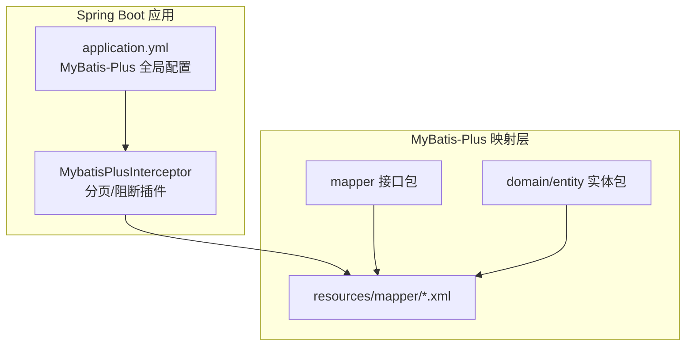
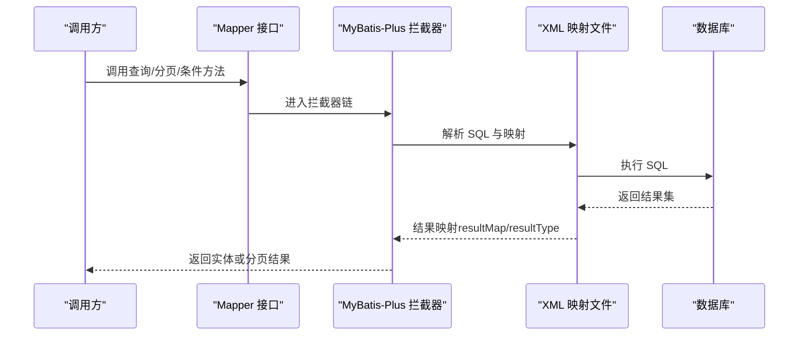
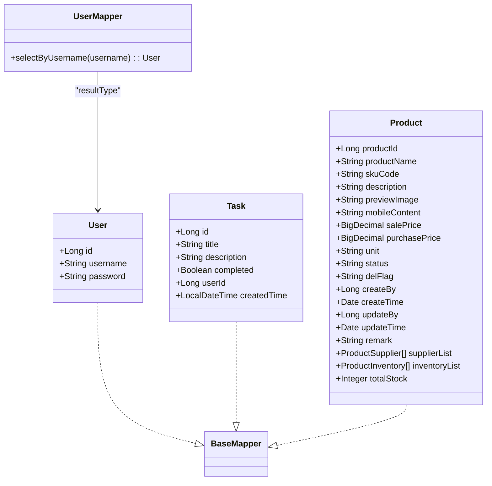
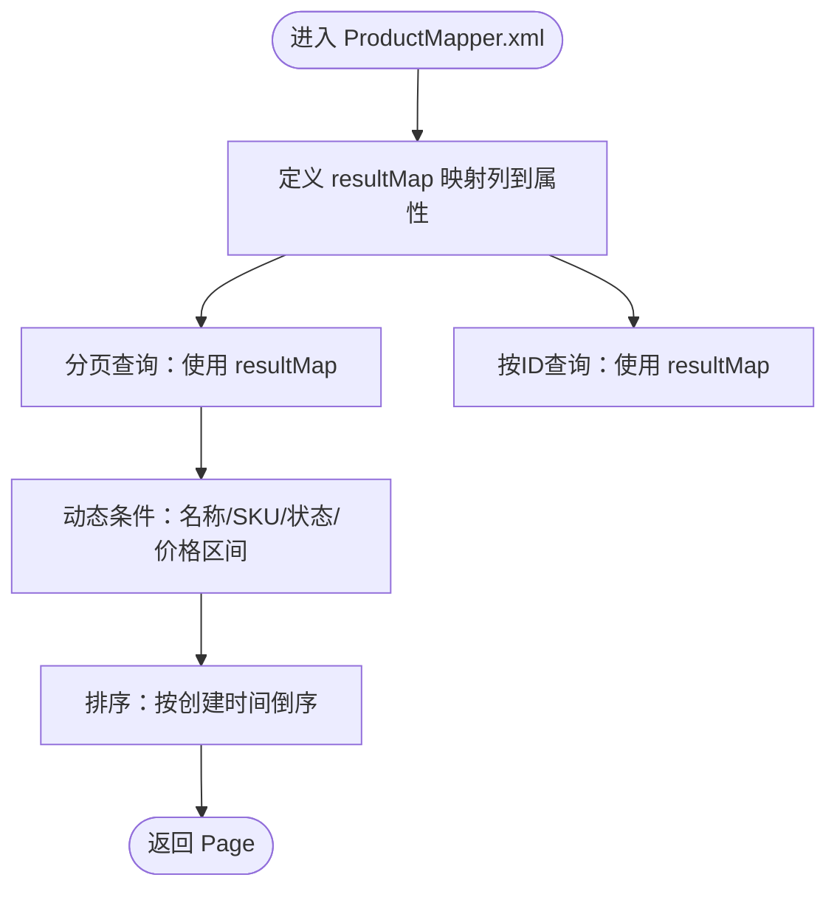
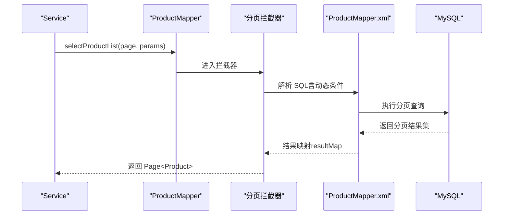
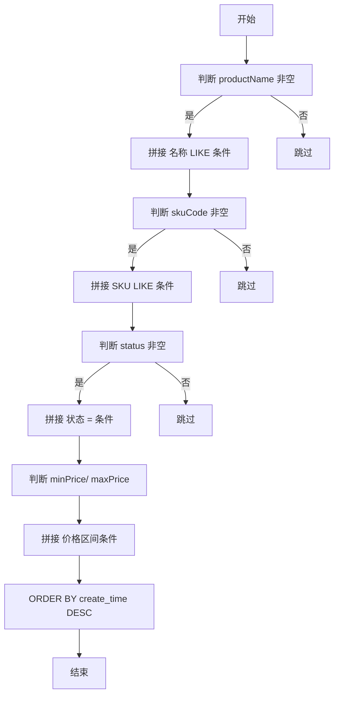

# 实体映射配置

<cite>
**本文引用的文件**
- [application.yml](file://task-manager-backend/src/main/resources/application.yml)
- [MybatisPlusConfig.java](file://task-manager-backend/src/main/java/com/taskmanager/config/MybatisPlusConfig.java)
- [pom.xml](file://task-manager-backend/pom.xml)
- [User.java](file://task-manager-backend/src/main/java/com/taskmanager/entity/User.java)
- [UserMapper.java](file://task-manager-backend/src/main/java/com/taskmanager/mapper/UserMapper.java)
- [UserMapper.xml](file://task-manager-backend/src/main/resources/mapper/UserMapper.xml)
- [Task.java](file://task-manager-backend/src/main/java/com/taskmanager/entity/Task.java)
- [TaskMapper.xml](file://task-manager-backend/src/main/resources/mapper/TaskMapper.xml)
- [Product.java](file://task-manager-backend/src/main/java/com/taskmanager/domain/Product.java)
- [ProductMapper.java](file://task-manager-backend/src/main/java/com/taskmanager/mapper/ProductMapper.java)
- [ProductMapper.xml](file://task-manager-backend/src/main/resources/mapper/ProductMapper.xml)
- [SysUser.java](file://task-manager-backend/src/main/java/com/taskmanager/domain/SysUser.java)
- [SysUserMapper.xml](file://task-manager-backend/src/main/resources/mapper/SysUserMapper.xml)
- [CartMapper.xml](file://task-manager-backend/src/main/resources/mapper/CartMapper.xml)
- [BusinessTypeEnum.java](file://task-manager-backend/src/main/java/com/taskmanager/common/enums/BusinessTypeEnum.java)
</cite>

## 目录
1. [引言](#引言)
2. [项目结构](#项目结构)
3. [核心组件](#核心组件)
4. [架构总览](#架构总览)
5. [详细组件分析](#详细组件分析)
6. [依赖分析](#依赖分析)
7. [性能考虑](#性能考虑)
8. [故障排查指南](#故障排查指南)
9. [结论](#结论)
10. [附录](#附录)

## 引言
本文件面向使用 MyBatis-Plus 的开发者，系统性阐述实体映射机制与 XML 映射文件的配置方法，覆盖以下主题：
- 实体类与 Mapper 接口的关联关系与自动映射配置
- XML 映射文件中的 resultMap 配置与字段映射规则
- 批量操作的 SQL 映射配置与性能优化策略
- 复杂查询的映射配置与嵌套结果处理
- 枚举类型的映射配置与值转换机制
- 分页查询的映射配置与分页插件使用
- 条件查询的映射配置与动态 SQL 的实现方法
- 批量插入、更新、删除的映射配置最佳实践

## 项目结构
该后端工程采用 Spring Boot + MyBatis-Plus 架构，实体类位于 domain/entity 包，Mapper 接口位于 mapper 包，对应的 XML 映射文件位于 resources/mapper 目录。全局 MyBatis-Plus 配置在 application.yml 中定义，分页与安全拦截器在 MybatisPlusConfig.java 中注册。

**图表来源**
- [application.yml:33-44](file://task-manager-backend/src/main/resources/application.yml#L33-L44)
- [MybatisPlusConfig.java:22-30](file://task-manager-backend/src/main/java/com/taskmanager/config/MybatisPlusConfig.java#L22-L30)

**章节来源**
- [application.yml:1-79](file://task-manager-backend/src/main/resources/application.yml#L1-L79)
- [MybatisPlusConfig.java:1-32](file://task-manager-backend/src/main/java/com/taskmanager/config/MybatisPlusConfig.java#L1-L32)

## 核心组件
- 全局配置
  - application.yml 中启用下划线到驼峰映射、指定 mapperLocations、设置逻辑删除字段与值等。
- 拦截器配置
  - MybatisPlusConfig 注册分页拦截器与全表更新/删除阻断拦截器。
- 实体与映射
  - 实体类通过注解标注表名与主键策略；Mapper 接口继承 BaseMapper；XML 文件提供 SQL 与 resultMap。

**章节来源**
- [application.yml:33-44](file://task-manager-backend/src/main/resources/application.yml#L33-L44)
- [MybatisPlusConfig.java:22-30](file://task-manager-backend/src/main/java/com/taskmanager/config/MybatisPlusConfig.java#L22-L30)

## 架构总览
MyBatis-Plus 在启动时读取 application.yml 的全局配置，加载 resources/mapper 下的 XML 映射文件，并通过拦截器在执行 SQL 前后注入分页与安全控制逻辑。实体类与 XML 映射文件通过命名空间与接口方法签名进行绑定。

**图表来源**
- [application.yml:38](file://task-manager-backend/src/main/resources/application.yml#L38)
- [MybatisPlusConfig.java:22-30](file://task-manager-backend/src/main/java/com/taskmanager/config/MybatisPlusConfig.java#L22-L30)

## 详细组件分析

### 实体类与 Mapper 关联及自动映射
- User 实体
  - 使用 @TableName 指定表名，@TableId 定义主键与类型。
  - 对应 Mapper 接口继承 BaseMapper，可直接获得通用 CRUD 方法。
  - XML 中通过 resultType 指向实体类，实现自动映射。
- Task 实体
  - 同样通过注解标注表与主键，XML 中以 resultType 方式返回实体。
- Product 实体
  - 通过 @TableId 定义主键，@TableField(exist=false) 标注非数据库字段。
  - XML 提供 resultMap，精确映射数据库列到实体属性。

**图表来源**
- [User.java:12-30](file://task-manager-backend/src/main/java/com/taskmanager/entity/User.java#L12-L30)
- [UserMapper.java:11-21](file://task-manager-backend/src/main/java/com/taskmanager/mapper/UserMapper.java#L11-L21)
- [Task.java:14-49](file://task-manager-backend/src/main/java/com/taskmanager/entity/Task.java#L14-L49)
- [Product.java:21-96](file://task-manager-backend/src/main/java/com/taskmanager/domain/Product.java#L21-L96)

**章节来源**
- [User.java:12-30](file://task-manager-backend/src/main/java/com/taskmanager/entity/User.java#L12-L30)
- [UserMapper.java:11-21](file://task-manager-backend/src/main/java/com/taskmanager/mapper/UserMapper.java#L11-L21)
- [UserMapper.xml:6-10](file://task-manager-backend/src/main/resources/mapper/UserMapper.xml#L6-L10)
- [Task.java:14-49](file://task-manager-backend/src/main/java/com/taskmanager/entity/Task.java#L14-L49)
- [TaskMapper.xml:6-18](file://task-manager-backend/src/main/resources/mapper/TaskMapper.xml#L6-L18)
- [Product.java:21-96](file://task-manager-backend/src/main/java/com/taskmanager/domain/Product.java#L21-L96)

### XML 映射文件与 resultMap 字段映射
- ProductMapper.xml
  - 定义 resultMap 将数据库列映射到实体属性，包括基础字段与逻辑删除字段。
  - 提供分页查询与按 ID 查询，使用 resultType 或 resultMap。
- SysUserMapper.xml
  - 定义用户结果映射，包含部门关联查询的多表场景。
  - 使用动态 SQL 条件拼接，支持用户名、手机号、状态、部门树等筛选。
- CartMapper.xml
  - 复杂联表查询，LEFT JOIN 商品表并过滤逻辑删除标志，返回购物车聚合结果。

**图表来源**
- [ProductMapper.xml:7-24](file://task-manager-backend/src/main/resources/mapper/ProductMapper.xml#L7-L24)
- [ProductMapper.xml:27-46](file://task-manager-backend/src/main/resources/mapper/ProductMapper.xml#L27-L46)
- [ProductMapper.xml:49-52](file://task-manager-backend/src/main/resources/mapper/ProductMapper.xml#L49-L52)

**章节来源**
- [ProductMapper.xml:7-24](file://task-manager-backend/src/main/resources/mapper/ProductMapper.xml#L7-L24)
- [ProductMapper.xml:27-46](file://task-manager-backend/src/main/resources/mapper/ProductMapper.xml#L27-L46)
- [ProductMapper.xml:49-52](file://task-manager-backend/src/main/resources/mapper/ProductMapper.xml#L49-L52)
- [SysUserMapper.xml:6-27](file://task-manager-backend/src/main/resources/mapper/SysUserMapper.xml#L6-L27)
- [SysUserMapper.xml:36-56](file://task-manager-backend/src/main/resources/mapper/SysUserMapper.xml#L36-L56)
- [CartMapper.xml:5-12](file://task-manager-backend/src/main/resources/mapper/CartMapper.xml#L5-L12)

### 分页查询与分页插件
- 分页接口
  - ProductMapper 提供 Page<Product> 参数，配合 XML 动态 SQL 实现分页查询。
- 插件配置
  - MybatisPlusConfig 注册 PaginationInnerInterceptor，支持 MySQL。
  - application.yml 开启下划线转驼峰映射，提升字段匹配准确性。
- 执行流程
  - Mapper 方法接收 Page 对象与查询参数，拦截器在 SQL 上下文中注入分页逻辑，最终返回 Page 结果。

**图表来源**
- [ProductMapper.java:28-33](file://task-manager-backend/src/main/java/com/taskmanager/mapper/ProductMapper.java#L28-L33)
- [ProductMapper.xml:27-46](file://task-manager-backend/src/main/resources/mapper/ProductMapper.xml#L27-L46)
- [MybatisPlusConfig.java:26](file://task-manager-backend/src/main/java/com/taskmanager/config/MybatisPlusConfig.java#L26)
- [application.yml:36](file://task-manager-backend/src/main/resources/application.yml#L36)

**章节来源**
- [ProductMapper.java:28-33](file://task-manager-backend/src/main/java/com/taskmanager/mapper/ProductMapper.java#L28-L33)
- [ProductMapper.xml:27-46](file://task-manager-backend/src/main/resources/mapper/ProductMapper.xml#L27-L46)
- [MybatisPlusConfig.java:22-30](file://task-manager-backend/src/main/java/com/taskmanager/config/MybatisPlusConfig.java#L22-L30)
- [application.yml:36](file://task-manager-backend/src/main/resources/application.yml#L36)

### 条件查询与动态 SQL
- 动态 SQL 片段
  - 使用 <if test="..."> 条件拼接，如商品名称/SKU 模糊匹配、状态相等、价格区间比较。
- 复杂条件
  - SysUserMapper.xml 展示了部门树查询（祖先集合），结合 LEFT JOIN 实现用户与部门信息联查。
- 执行建议
  - 保持参数命名清晰，避免重复条件；对 LIKE 使用 CONCAT 包裹参数，防止 SQL 注入。

**图表来源**
- [ProductMapper.xml:30-45](file://task-manager-backend/src/main/resources/mapper/ProductMapper.xml#L30-L45)
- [SysUserMapper.xml:50-54](file://task-manager-backend/src/main/resources/mapper/SysUserMapper.xml#L50-L54)

**章节来源**
- [ProductMapper.xml:30-45](file://task-manager-backend/src/main/resources/mapper/ProductMapper.xml#L30-L45)
- [SysUserMapper.xml:36-56](file://task-manager-backend/src/main/resources/mapper/SysUserMapper.xml#L36-L56)

### 枚举类型映射与值转换
- 枚举定义
  - BusinessTypeEnum 提供业务类型枚举，包含 code 与 description。
- 映射策略
  - 可通过 TypeHandler 自定义枚举与数据库值的转换；或在 Java 层统一使用 code 存储，避免复杂映射。
  - 若需在 XML 中进行值转换，可结合数据库函数或 CASE WHEN 实现，但更推荐在实体层处理。

**章节来源**
- [BusinessTypeEnum.java:8-55](file://task-manager-backend/src/main/java/com/taskmanager/common/enums/BusinessTypeEnum.java#L8-L55)

### 复杂查询与嵌套结果处理
- 多表联查
  - CartMapper.xml 展示 LEFT JOIN 商品表并过滤 del_flag，返回购物车聚合结果。
- 嵌套结果
  - 当需要返回实体内包含集合或对象时，可在 XML 中使用 association/collection 结构（本仓库示例以 resultType 为主，嵌套结构可参考标准 MyBatis-Plus 用法）。

**章节来源**
- [CartMapper.xml:5-12](file://task-manager-backend/src/main/resources/mapper/CartMapper.xml#L5-L12)

### 批量操作与性能优化
- 批量插入/更新/删除
  - 使用 MyBatis-Plus 提供的批量方法或自定义 SQL；建议分批提交、控制单批大小，避免超时与内存压力。
- 性能优化要点
  - 合理使用索引（如状态、时间范围、SKU/名称模糊字段）。
  - 减少不必要的列选择，仅查询必要字段。
  - 使用 Page 分页，避免一次性加载大量数据。
  - 启用下划线转驼峰映射，减少手动映射开销。

**章节来源**
- [application.yml:36](file://task-manager-backend/src/main/resources/application.yml#L36)
- [MybatisPlusConfig.java:26](file://task-manager-backend/src/main/java/com/taskmanager/config/MybatisPlusConfig.java#L26)

## 依赖分析
- MyBatis-Plus 版本与依赖
  - pom.xml 中声明 mybatis-plus-spring-boot3-starter 版本，确保与 Spring Boot 3.x 兼容。
- 插件与拦截器
  - MybatisPlusInterceptor 注册分页与阻断插件，保障分页正确性与安全性。

**图表来源**
- [pom.xml:23](file://task-manager-backend/pom.xml#L23)
- [application.yml:33-44](file://task-manager-backend/src/main/resources/application.yml#L33-L44)
- [MybatisPlusConfig.java:22-30](file://task-manager-backend/src/main/java/com/taskmanager/config/MybatisPlusConfig.java#L22-L30)

**章节来源**
- [pom.xml:23](file://task-manager-backend/pom.xml#L23)
- [MybatisPlusConfig.java:22-30](file://task-manager-backend/src/main/java/com/taskmanager/config/MybatisPlusConfig.java#L22-L30)

## 性能考虑
- 字段映射
  - 启用 map-underscore-to-camel-case，降低字段映射成本。
- 分页与索引
  - 使用分页插件与合理索引，避免全表扫描。
- SQL 设计
  - 动态 SQL 仅拼接必要条件；LIKE 使用前缀匹配优化。
- 连接池与缓存
  - application.yml 中配置 HikariCP，合理设置连接池大小与生命周期。

**章节来源**
- [application.yml:11-16](file://task-manager-backend/src/main/resources/application.yml#L11-L16)
- [application.yml:36](file://task-manager-backend/src/main/resources/application.yml#L36)

## 故障排查指南
- 无法映射字段
  - 检查 application.yml 是否开启下划线转驼峰；确认 XML 中 column 与 property 是否一致。
- 分页不生效
  - 确认 MybatisPlusConfig 中已注册分页拦截器；Mapper 方法是否传入 Page 参数。
- 动态 SQL 报错
  - 检查 <if test="..."> 条件表达式语法；确保参数命名与调用处一致。
- 逻辑删除异常
  - 确认 application.yml 中逻辑删除字段与值配置正确；查询时注意过滤 del_flag。

**章节来源**
- [application.yml:36](file://task-manager-backend/src/main/resources/application.yml#L36)
- [application.yml:42-44](file://task-manager-backend/src/main/resources/application.yml#L42-L44)
- [MybatisPlusConfig.java:22-30](file://task-manager-backend/src/main/java/com/taskmanager/config/MybatisPlusConfig.java#L22-L30)

## 结论
本项目通过规范的实体注解、Mapper 接口与 XML 映射文件，结合全局配置与拦截器，实现了稳定高效的实体映射与查询能力。遵循本文的映射规则、动态 SQL 编写与性能优化建议，可进一步提升系统的可维护性与运行效率。

## 附录
- 常用配置项速查
  - mapper-locations：映射文件位置
  - map-underscore-to-camel-case：字段映射策略
  - db-config.id-type：主键策略
  - db-config.logic-delete-field/value/not-delete-value：逻辑删除配置
- 推荐实践
  - 优先使用 BaseMapper 的通用方法，必要时在 XML 中补充复杂查询。
  - 动态 SQL 保持简洁，避免过度拼接导致可读性下降。
  - 对高频查询建立合适索引，配合分页与字段裁剪。