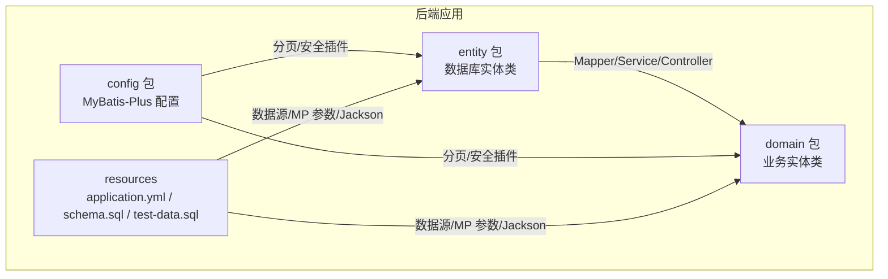
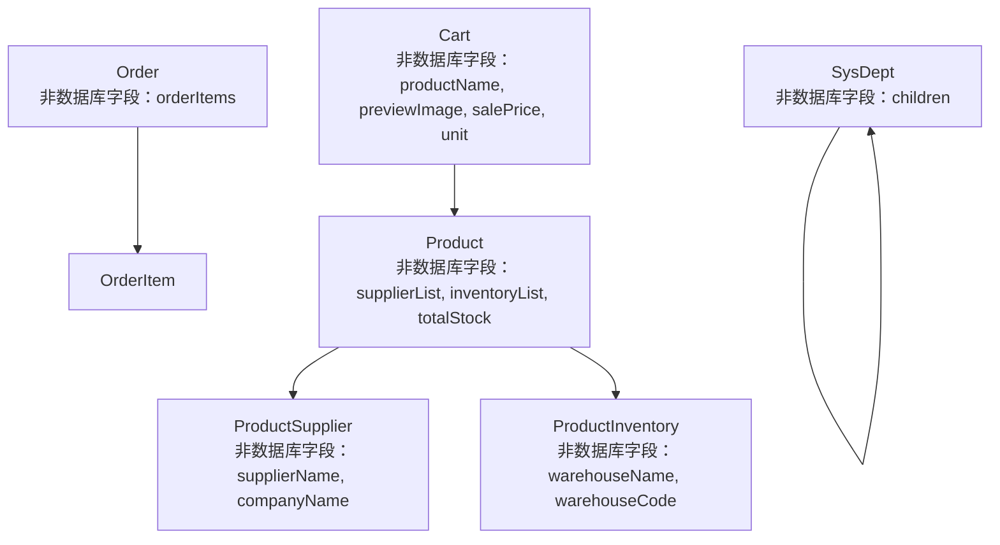

# 实体类设计

<cite>
**本文引用的文件**
- [Cart.java](file://task-manager-backend/src/main/java/com/taskmanager/domain/Cart.java)
- [Order.java](file://task-manager-backend/src/main/java/com/taskmanager/domain/Order.java)
- [OrderItem.java](file://task-manager-backend/src/main/java/com/taskmanager/domain/OrderItem.java)
- [Product.java](file://task-manager-backend/src/main/java/com/taskmanager/domain/Product.java)
- [ProductSupplier.java](file://task-manager-backend/src/main/java/com/taskmanager/domain/ProductSupplier.java)
- [ProductInventory.java](file://task-manager-backend/src/main/java/com/taskmanager/domain/ProductInventory.java)
- [SysUser.java](file://task-manager-backend/src/main/java/com/taskmanager/domain/SysUser.java)
- [SysRole.java](file://task-manager-backend/src/main/java/com/taskmanager/domain/SysRole.java)
- [SysDept.java](file://task-manager-backend/src/main/java/com/taskmanager/domain/SysDept.java)
- [User.java](file://task-manager-backend/src/main/java/com/taskmanager/entity/User.java)
- [Task.java](file://task-manager-backend/src/main/java/com/taskmanager/entity/Task.java)
- [MybatisPlusConfig.java](file://task-manager-backend/src/main/java/com/taskmanager/config/MybatisPlusConfig.java)
- [application.yml](file://task-manager-backend/src/main/resources/application.yml)
- [schema.sql](file://task-manager-backend/src/main/resources/schema.sql)
- [test-data.sql](file://task-manager-backend/src/main/resources/test-data.sql)
</cite>

## 目录
1. [引言](#引言)
2. [项目结构](#项目结构)
3. [核心组件](#核心组件)
4. [架构总览](#架构总览)
5. [详细组件分析](#详细组件分析)
6. [依赖分析](#依赖分析)
7. [性能考虑](#性能考虑)
8. [故障排查指南](#故障排查指南)
9. [结论](#结论)
10. [附录](#附录)

## 引言
本文件围绕该代码库中的实体类设计进行系统化技术说明，重点区分数据库实体类（Entity）与业务实体类（Domain），并结合实际代码示例，阐述以下主题：
- 注解使用：@TableId、@TableName、@TableField 等 MyBatis-Plus 注解的作用与配置方法
- 字段映射规则与命名策略：驼峰命名到下划线的映射机制
- 序列化与反序列化配置：Jackson 时间格式化与字段忽略策略
- 校验注解与数据校验规则：如何在实体类中体现校验意图
- 继承关系与多态设计：通过组合与非数据库字段实现扩展
- 实体类与数据库表结构的对应关系与字段约束映射

## 项目结构
该后端工程采用典型的分层架构，实体类主要分布在两个包中：
- entity 包：面向数据库表的实体类，通常直接映射表结构，字段与表列一一对应
- domain 包：面向业务的实体类，除数据库字段外，还包含用于前端展示或业务计算的“非数据库字段”

此外，MyBatis-Plus 的全局配置位于 config 包，数据库连接与 MyBatis-Plus 参数在 application.yml 中集中配置。

图表来源
- [MybatisPlusConfig.java:16-31](file://task-manager-backend/src/main/java/com/taskmanager/config/MybatisPlusConfig.java#L16-L31)
- [application.yml:33-44](file://task-manager-backend/src/main/resources/application.yml#L33-L44)

章节来源
- [MybatisPlusConfig.java:16-31](file://task-manager-backend/src/main/java/com/taskmanager/config/MybatisPlusConfig.java#L16-L31)
- [application.yml:33-44](file://task-manager-backend/src/main/resources/application.yml#L33-L44)

## 核心组件
本节对实体类进行分类与对比，明确数据库实体类与业务实体类的职责边界与典型特征。

- 数据库实体类（Entity）
  - 特征：直接映射数据库表，字段与表列一致；通常包含主键、通用字段（创建/更新时间、逻辑删除标志等）
  - 示例：User、Task
- 业务实体类（Domain）
  - 特征：除数据库字段外，还包含“非数据库字段”，用于前端展示或业务计算；常与 Mapper 查询结果进行组合
  - 示例：Cart、Order、OrderItem、Product、ProductSupplier、ProductInventory、SysUser、SysRole、SysDept

章节来源
- [User.java:11-30](file://task-manager-backend/src/main/java/com/taskmanager/entity/User.java#L11-L30)
- [Task.java:13-48](file://task-manager-backend/src/main/java/com/taskmanager/entity/Task.java#L13-L48)
- [Cart.java:18-60](file://task-manager-backend/src/main/java/com/taskmanager/domain/Cart.java#L18-L60)
- [Order.java:18-64](file://task-manager-backend/src/main/java/com/taskmanager/domain/Order.java#L18-L64)
- [OrderItem.java:16-43](file://task-manager-backend/src/main/java/com/taskmanager/domain/OrderItem.java#L16-L43)
- [Product.java:19-96](file://task-manager-backend/src/main/java/com/taskmanager/domain/Product.java#L19-L96)
- [ProductSupplier.java:16-70](file://task-manager-backend/src/main/java/com/taskmanager/domain/ProductSupplier.java#L16-L70)
- [ProductInventory.java:16-66](file://task-manager-backend/src/main/java/com/taskmanager/domain/ProductInventory.java#L16-L66)
- [SysUser.java:16-79](file://task-manager-backend/src/main/java/com/taskmanager/domain/SysUser.java#L16-L79)
- [SysRole.java:16-64](file://task-manager-backend/src/main/java/com/taskmanager/domain/SysRole.java#L16-L64)
- [SysDept.java:19-72](file://task-manager-backend/src/main/java/com/taskmanager/domain/SysDept.java#L19-L72)

## 架构总览
实体类与数据库表的映射关系如下：

```mermaid
erDiagram
USER {
bigint id PK
varchar username
varchar password
}
TASK {
bigint id PK
varchar title
varchar description
boolean completed
bigint user_id
datetime created_time
}
SYS_USER {
bigint user_id PK
bigint dept_id
varchar user_name UK
varchar nick_name
varchar user_type
varchar email
varchar phonenumber
varchar sex
varchar avatar
varchar password
varchar status
char del_flag
varchar login_ip
datetime login_date
bigint create_by
datetime create_time
bigint update_by
datetime update_time
varchar remark
}
SYS_ROLE {
bigint role_id PK
varchar role_name
varchar role_key
int role_sort
char data_scope
boolean menu_check_strictly
boolean dept_check_strictly
char status
char del_flag
bigint create_by
datetime create_time
bigint update_by
datetime update_time
varchar remark
}
SYS_DEPT {
bigint dept_id PK
bigint parent_id
varchar ancestors
varchar dept_name
int order_num
varchar leader
varchar phone
varchar email
char status
char del_flag
bigint create_by
datetime create_time
bigint update_by
datetime update_time
varchar remark
}
WMS_PRODUCT {
bigint product_id PK
varchar product_name
varchar sku_code UK
varchar description
varchar preview_image
longtext mobile_content
decimal sale_price
decimal purchase_price
varchar unit
char status
char del_flag
bigint create_by
datetime create_time
bigint update_by
datetime update_time
varchar remark
}
WMS_PRODUCT_SUPPLIER {
bigint id PK
bigint product_id
bigint supplier_id
varchar supplier_sku_code
decimal supplier_price
int lead_time
char is_default
char del_flag
bigint create_by
datetime create_time
bigint update_by
datetime update_time
varchar remark
}
WMS_PRODUCT_INVENTORY {
bigint id PK
bigint product_id
bigint warehouse_id
int stock_quantity
int warning_quantity
char del_flag
bigint create_by
datetime create_time
bigint update_by
datetime update_time
varchar remark
}
ECOMMERCE_CART {
bigint cart_id PK
bigint user_id
bigint product_id
int quantity
datetime create_time
datetime update_time
}
ECOMMERCE_ORDER {
bigint order_id PK
varchar order_no UK
bigint user_id
decimal total_amount
tinyint status
varchar receiver_name
varchar receiver_phone
varchar receiver_address
varchar remark
datetime create_time
datetime update_time
}
ECOMMERCE_ORDER_ITEM {
bigint item_id PK
bigint order_id
bigint product_id
varchar product_name
decimal sale_price
int quantity
decimal subtotal
}
```

图表来源
- [schema.sql:14-36](file://task-manager-backend/src/main/resources/schema.sql#L14-L36)
- [schema.sql:42-58](file://task-manager-backend/src/main/resources/schema.sql#L42-L58)
- [schema.sql:91-108](file://task-manager-backend/src/main/resources/schema.sql#L91-L108)
- [schema.sql:447-467](file://task-manager-backend/src/main/resources/schema.sql#L447-L467)
- [schema.sql:472-489](file://task-manager-backend/src/main/resources/schema.sql#L472-L489)
- [schema.sql:494-509](file://task-manager-backend/src/main/resources/schema.sql#L494-L509)
- [schema.sql:573-581](file://task-manager-backend/src/main/resources/schema.sql#L573-L581)
- [schema.sql:584-596](file://task-manager-backend/src/main/resources/schema.sql#L584-L596)
- [schema.sql:599-607](file://task-manager-backend/src/main/resources/schema.sql#L599-L607)

## 详细组件分析

### 数据库实体类（Entity）设计
数据库实体类直接映射底层表结构，字段与表列保持一致，便于 MyBatis-Plus 的自动映射与 CRUD 操作。

- User（用户表）
  - 主键：id（自增）
  - 字段：username、password
  - 注解：@TableName、@TableId
- Task（任务表）
  - 主键：id（自增）
  - 字段：title、description、completed、userId、createdTime
  - 注解：@TableName、@TableId、@TableField（字段名与表列不一致时指定）

章节来源
- [User.java:11-30](file://task-manager-backend/src/main/java/com/taskmanager/entity/User.java#L11-L30)
- [Task.java:13-48](file://task-manager-backend/src/main/java/com/taskmanager/entity/Task.java#L13-L48)

### 业务实体类（Domain）设计
业务实体类在数据库字段基础上，增加“非数据库字段”以满足前端展示与业务计算需求。这些字段不会参与数据库持久化，通常通过 @TableField(exist = false) 标注。

- Cart（购物车）
  - 数据库字段：cartId、userId、productId、quantity、createTime、updateTime
  - 非数据库字段：productName、previewImage、salePrice、unit
- Order（订单）
  - 数据库字段：orderId、orderNo、userId、totalAmount、status、receiverName、receiverPhone、receiverAddress、remark、createTime、updateTime
  - 非数据库字段：orderItems（订单明细列表）
- OrderItem（订单明细）
  - 数据库字段：itemId、orderId、productId、productName、salePrice、quantity、subtotal
- Product（商品）
  - 数据库字段：productId、productName、skuCode、description、previewImage、mobileContent、salePrice、purchasePrice、unit、status、delFlag、createBy、createTime、updateBy、updateTime、remark
  - 非数据库字段：supplierList、inventoryList、totalStock
- ProductSupplier（商品供应商关联）
  - 数据库字段：id、productId、supplierId、supplierSkuCode、supplierPrice、leadTime、isDefault、delFlag、createBy、createTime、updateBy、updateTime、remark
  - 非数据库字段：supplierName、companyName
- ProductInventory（商品库存）
  - 数据库字段：id、productId、warehouseId、stockQuantity、warningQuantity、delFlag、createBy、createTime、updateBy、updateTime、remark
  - 非数据库字段：warehouseName、warehouseCode
- SysUser（系统用户）
  - 数据库字段：userId、deptId、userName、nickName、userType、email、phonenumber、sex、avatar、password、status、delFlag、loginIp、loginDate、createBy、createTime、updateBy、updateTime、remark
- SysRole（系统角色）
  - 数据库字段：roleId、roleName、roleKey、roleSort、dataScope、menuCheckStrictly、deptCheckStrictly、status、delFlag、createBy、createTime、updateBy、updateTime、remark
- SysDept（系统部门）
  - 数据库字段：deptId、parentId、ancestors、deptName、orderNum、leader、phone、email、status、delFlag、createBy、createTime、updateBy、updateTime、remark
  - 非数据库字段：children（树形子节点集合）

章节来源
- [Cart.java:18-60](file://task-manager-backend/src/main/java/com/taskmanager/domain/Cart.java#L18-L60)
- [Order.java:18-64](file://task-manager-backend/src/main/java/com/taskmanager/domain/Order.java#L18-L64)
- [OrderItem.java:16-43](file://task-manager-backend/src/main/java/com/taskmanager/domain/OrderItem.java#L16-L43)
- [Product.java:19-96](file://task-manager-backend/src/main/java/com/taskmanager/domain/Product.java#L19-L96)
- [ProductSupplier.java:16-70](file://task-manager-backend/src/main/java/com/taskmanager/domain/ProductSupplier.java#L16-L70)
- [ProductInventory.java:16-66](file://task-manager-backend/src/main/java/com/taskmanager/domain/ProductInventory.java#L16-L66)
- [SysUser.java:16-79](file://task-manager-backend/src/main/java/com/taskmanager/domain/SysUser.java#L16-L79)
- [SysRole.java:16-64](file://task-manager-backend/src/main/java/com/taskmanager/domain/SysRole.java#L16-L64)
- [SysDept.java:19-72](file://task-manager-backend/src/main/java/com/taskmanager/domain/SysDept.java#L19-L72)

### 注解使用与配置方法
- @TableName：指定实体类对应的数据库表名
- @TableId：指定主键字段及其生成策略（如自增）
- @TableField：指定字段映射的表列名；当字段为“非数据库字段”时，使用 exist = false 标注
- 全局配置：MyBatis-Plus 在 application.yml 中开启下划线转驼峰映射，并设置逻辑删除字段与值

章节来源
- [application.yml:33-44](file://task-manager-backend/src/main/resources/application.yml#L33-L44)
- [MybatisPlusConfig.java:16-31](file://task-manager-backend/src/main/java/com/taskmanager/config/MybatisPlusConfig.java#L16-L31)

### 字段映射规则与命名策略
- 下划线到驼峰映射：application.yml 中启用 map-underscore-to-camel-case，使数据库下划线命名自动映射到 Java 驼峰命名
- 字段名不一致时：通过 @TableField 指定具体列名（如 Task 中的 userId、createdTime）
- 非数据库字段：通过 @TableField(exist = false) 标注，避免持久化到数据库

章节来源
- [application.yml:36-36](file://task-manager-backend/src/main/resources/application.yml#L36-L36)
- [Task.java:41-48](file://task-manager-backend/src/main/java/com/taskmanager/entity/Task.java#L41-L48)
- [Cart.java:46-59](file://task-manager-backend/src/main/java/com/taskmanager/domain/Cart.java#L46-L59)
- [Order.java:62-63](file://task-manager-backend/src/main/java/com/taskmanager/domain/Order.java#L62-L63)
- [ProductInventory.java:60-65](file://task-manager-backend/src/main/java/com/taskmanager/domain/ProductInventory.java#L60-L65)

### 序列化与反序列化配置
- Jackson 时间格式化：application.yml 中设置日期格式与时区，确保 JSON 输出的时间字段格式统一
- 字段忽略策略：可通过注解或全局配置控制序列化行为（例如排除非数据库字段）

章节来源
- [application.yml:46-49](file://task-manager-backend/src/main/resources/application.yml#L46-L49)

### 校验注解与数据校验规则
- 当前实体类未直接引入 JSR-303 校验注解（如 @NotBlank、@NotNull 等）
- 建议在业务层或 DTO 层补充校验注解，实体类保留数据模型职责
- 逻辑删除字段：通过全局配置 delFlag、logic-delete-value、logic-not-delete-value 实现软删除

章节来源
- [application.yml:42-44](file://task-manager-backend/src/main/resources/application.yml#L42-L44)

### 继承关系与多态设计
- 实体类之间无显式继承关系，采用组合方式实现扩展
- 通过“非数据库字段”承载关联信息（如 Order 的 orderItems、Product 的 supplierList/inventoryList、SysDept 的 children），实现多态化展示与业务组装

章节来源
- [Order.java:62-63](file://task-manager-backend/src/main/java/com/taskmanager/domain/Order.java#L62-L63)
- [Product.java:86-95](file://task-manager-backend/src/main/java/com/taskmanager/domain/Product.java#L86-L95)
- [ProductSupplier.java:65-69](file://task-manager-backend/src/main/java/com/taskmanager/domain/ProductSupplier.java#L65-L69)
- [ProductInventory.java:59-65](file://task-manager-backend/src/main/java/com/taskmanager/domain/ProductInventory.java#L59-L65)
- [SysDept.java:69-71](file://task-manager-backend/src/main/java/com/taskmanager/domain/SysDept.java#L69-L71)

### 实体类与数据库表结构的对应关系与字段约束映射
- 主键与唯一约束：User.id、Task.id、SysUser.user_id、SysRole.role_id、SysDept.dept_id、WMS_* 系列表主键；部分表包含唯一索引（如 SysUser.user_name、WMS_PRODUCT.sku_code、ECOMMERCE_ORDER.order_no）
- 逻辑删除：通过 delFlag 字段与全局配置实现软删除
- 时间戳：各表均包含 create_time/update_time 字段，遵循统一命名与更新策略
- 状态枚举：如 SysUser.status、WMS_PRODUCT.status、ECOMMERCE_ORDER.status 等，通过字符或数值表示状态

章节来源
- [schema.sql:14-36](file://task-manager-backend/src/main/resources/schema.sql#L14-L36)
- [schema.sql:42-58](file://task-manager-backend/src/main/resources/schema.sql#L42-L58)
- [schema.sql:91-108](file://task-manager-backend/src/main/resources/schema.sql#L91-L108)
- [schema.sql:447-467](file://task-manager-backend/src/main/resources/schema.sql#L447-L467)
- [schema.sql:472-489](file://task-manager-backend/src/main/resources/schema.sql#L472-L489)
- [schema.sql:494-509](file://task-manager-backend/src/main/resources/schema.sql#L494-L509)
- [schema.sql:573-581](file://task-manager-backend/src/main/resources/schema.sql#L573-L581)
- [schema.sql:584-596](file://task-manager-backend/src/main/resources/schema.sql#L584-L596)
- [schema.sql:599-607](file://task-manager-backend/src/main/resources/schema.sql#L599-L607)

## 依赖分析
实体类之间的依赖关系主要体现在业务组合与查询结果映射上，而非类继承。

图表来源
- [Cart.java:43-59](file://task-manager-backend/src/main/java/com/taskmanager/domain/Cart.java#L43-L59)
- [Order.java:61-63](file://task-manager-backend/src/main/java/com/taskmanager/domain/Order.java#L61-L63)
- [OrderItem.java:16-43](file://task-manager-backend/src/main/java/com/taskmanager/domain/OrderItem.java#L16-L43)
- [Product.java:85-95](file://task-manager-backend/src/main/java/com/taskmanager/domain/Product.java#L85-L95)
- [ProductSupplier.java:63-69](file://task-manager-backend/src/main/java/com/taskmanager/domain/ProductSupplier.java#L63-L69)
- [ProductInventory.java:57-65](file://task-manager-backend/src/main/java/com/taskmanager/domain/ProductInventory.java#L57-L65)
- [SysDept.java:69-71](file://task-manager-backend/src/main/java/com/taskmanager/domain/SysDept.java#L69-L71)

## 性能考虑
- 字段映射与命名策略：启用下划线到驼峰映射可减少手动映射开销，提高开发效率
- 逻辑删除：通过全局配置实现软删除，避免全表扫描与误删风险
- 分页与安全插件：MyBatis-Plus 分页插件与阻断插件可有效提升查询性能与安全性

章节来源
- [application.yml:33-44](file://task-manager-backend/src/main/resources/application.yml#L33-L44)
- [MybatisPlusConfig.java:22-30](file://task-manager-backend/src/main/java/com/taskmanager/config/MybatisPlusConfig.java#L22-L30)

## 故障排查指南
- 字段映射异常
  - 症状：数据库列名与 Java 字段名不一致导致映射失败
  - 处理：使用 @TableField 指定列名；确认 application.yml 中 map-underscore-to-camel-case 已启用
- 非数据库字段持久化问题
  - 症状：前端需要的额外字段被持久化到数据库
  - 处理：为非数据库字段添加 @TableField(exist = false)
- 逻辑删除失效
  - 症状：删除操作未生效或查询到已删除记录
  - 处理：检查 application.yml 中 delFlag、logic-delete-value、logic-not-delete-value 配置
- 时间格式异常
  - 症状：JSON 输出时间格式不符合预期
  - 处理：检查 application.yml 中 jackson.date-format 与 time-zone 配置

章节来源
- [application.yml:36-36](file://task-manager-backend/src/main/resources/application.yml#L36-L36)
- [application.yml:42-44](file://task-manager-backend/src/main/resources/application.yml#L42-L44)
- [application.yml:46-49](file://task-manager-backend/src/main/resources/application.yml#L46-L49)

## 结论
本项目在实体类设计上清晰地区分了数据库实体类（Entity）与业务实体类（Domain），并通过 MyBatis-Plus 注解与全局配置实现了高效的字段映射、命名策略与逻辑删除。业务实体类通过“非数据库字段”与关联集合，灵活地承载前端展示与业务计算所需的信息，既保证了数据模型的简洁性，又提升了系统的可维护性与扩展性。

## 附录
- 测试数据：通过 test-data.sql 提供全场景测试数据，覆盖用户、角色、部门、供应商、商品、库存、电商模块等业务场景
- 数据库初始化：schema.sql 定义了完整的表结构与约束，确保实体类与数据库表的一致性

章节来源
- [test-data.sql:1-558](file://task-manager-backend/src/main/resources/test-data.sql#L1-L558)
- [schema.sql:1-608](file://task-manager-backend/src/main/resources/schema.sql#L1-L608)