# 数据库实体类

<cite>
**本文引用的文件**
- [Task.java](file://task-manager-backend/src/main/java/com/taskmanager/entity/Task.java)
- [User.java](file://task-manager-backend/src/main/java/com/taskmanager/entity/User.java)
- [SysUser.java](file://task-manager-backend/src/main/java/com/taskmanager/domain/SysUser.java)
- [Product.java](file://task-manager-backend/src/main/java/com/taskmanager/domain/Product.java)
- [Order.java](file://task-manager-backend/src/main/java/com/taskmanager/domain/Order.java)
- [OrderItem.java](file://task-manager-backend/src/main/java/com/taskmanager/domain/OrderItem.java)
- [ProductInventory.java](file://task-manager-backend/src/main/java/com/taskmanager/domain/ProductInventory.java)
- [ProductSupplier.java](file://task-manager-backend/src/main/java/com/taskmanager/domain/ProductSupplier.java)
- [MybatisPlusConfig.java](file://task-manager-backend/src/main/java/com/taskmanager/config/MybatisPlusConfig.java)
- [pom.xml](file://task-manager-backend/pom.xml)
- [TaskMapper.xml](file://task-manager-backend/src/main/resources/mapper/TaskMapper.xml)
- [UserMapper.xml](file://task-manager-backend/src/main/resources/mapper/UserMapper.xml)
- [schema.sql](file://task-manager-backend/src/main/resources/schema.sql)
- [test-data.sql](file://task-manager-backend/src/main/resources/test-data.sql)
</cite>

## 目录
1. [引言](#引言)
2. [项目结构](#项目结构)
3. [核心组件](#核心组件)
4. [架构概览](#架构概览)
5. [详细组件分析](#详细组件分析)
6. [依赖分析](#依赖分析)
7. [性能考虑](#性能考虑)
8. [故障排查指南](#故障排查指南)
9. [结论](#结论)
10. [附录](#附录)

## 引言
本文件面向数据库实体类的设计与实现，围绕 MyBatis-Plus 框架进行系统化梳理，重点涵盖：
- 实体类注解体系：@Entity 注解家族（@TableName、@TableId、@TableField 等）的语义与配置
- 字段到列的映射关系与命名策略、驼峰转换机制
- 序列化与 JSON 处理方案
- 校验注解与数据校验规则
- 继承关系与多态设计模式
- 实体类与数据库表结构的对应关系与约束映射

## 项目结构
该后端工程采用基于包的分层组织，实体类主要分布在 domain 与 entity 两个包中，分别承载业务域模型与通用基础模型；MyBatis-Plus 配置位于 config 包，XML 映射文件位于 resources/mapper 目录。

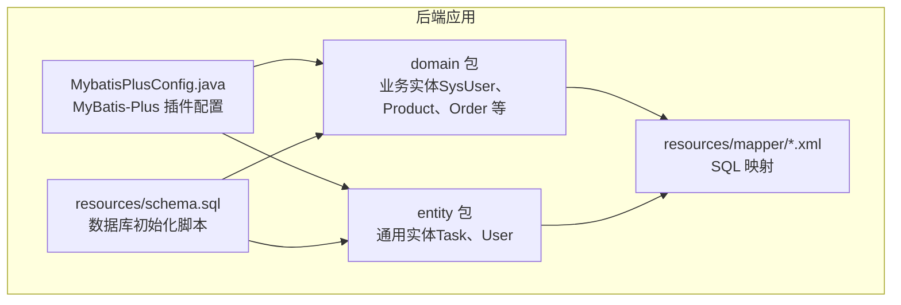

图表来源
- [MybatisPlusConfig.java:16-31](file://task-manager-backend/src/main/java/com/taskmanager/config/MybatisPlusConfig.java#L16-L31)
- [schema.sql:14-36](file://task-manager-backend/src/main/resources/schema.sql#L14-L36)

章节来源
- [MybatisPlusConfig.java:16-31](file://task-manager-backend/src/main/java/com/taskmanager/config/MybatisPlusConfig.java#L16-L31)
- [schema.sql:14-36](file://task-manager-backend/src/main/resources/schema.sql#L14-L36)

## 核心组件
本节聚焦实体类注解与字段映射，结合具体实体类进行说明。

- @TableName：声明实体类与数据库表的映射关系
- @TableId：声明主键字段及其生成策略
- @TableField：声明非主键字段与数据库列的映射，以及是否参与序列化/反序列化
- Lombok @Data：自动生成 getter/setter/toString 等方法，简化 POJO

示例要点（以 Task 为例）：
- 表映射：@TableName("task") 对应表名为 task
- 主键映射：@TableId(value = "id", type = IdType.AUTO) 指定列名为 id，主键自增
- 列映射：@TableField("user_id")、@TableField("created_time") 指定非驼峰列名
- 非数据库字段：@TableField(exist = false) 标记为非持久化字段

章节来源
- [Task.java:14-49](file://task-manager-backend/src/main/java/com/taskmanager/entity/Task.java#L14-L49)
- [User.java:12-30](file://task-manager-backend/src/main/java/com/taskmanager/entity/User.java#L12-L30)
- [SysUser.java:17-79](file://task-manager-backend/src/main/java/com/taskmanager/domain/SysUser.java#L17-L79)
- [Product.java:21-96](file://task-manager-backend/src/main/java/com/taskmanager/domain/Product.java#L21-L96)
- [Order.java:20-64](file://task-manager-backend/src/main/java/com/taskmanager/domain/Order.java#L20-L64)
- [OrderItem.java:17-43](file://task-manager-backend/src/main/java/com/taskmanager/domain/OrderItem.java#L17-L43)
- [ProductInventory.java:18-66](file://task-manager-backend/src/main/java/com/taskmanager/domain/ProductInventory.java#L18-L66)
- [ProductSupplier.java:18-70](file://task-manager-backend/src/main/java/com/taskmanager/domain/ProductSupplier.java#L18-L70)

## 架构概览
MyBatis-Plus 在本项目中的作用：
- 提供分页插件与安全防护插件（防止全表更新/删除）
- 通过注解驱动实体类与数据库表的映射
- XML 映射文件用于复杂查询与批量操作

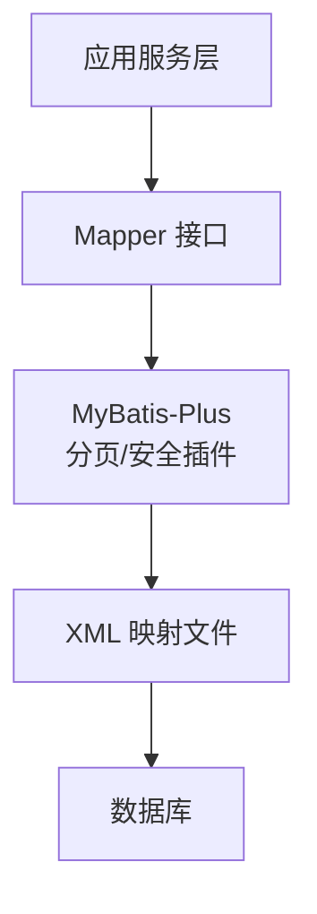

图表来源
- [MybatisPlusConfig.java:22-30](file://task-manager-backend/src/main/java/com/taskmanager/config/MybatisPlusConfig.java#L22-L30)
- [TaskMapper.xml:3-42](file://task-manager-backend/src/main/resources/mapper/TaskMapper.xml#L3-L42)
- [UserMapper.xml:3-12](file://task-manager-backend/src/main/resources/mapper/UserMapper.xml#L3-L12)

章节来源
- [MybatisPlusConfig.java:16-31](file://task-manager-backend/src/main/java/com/taskmanager/config/MybatisPlusConfig.java#L16-L31)
- [TaskMapper.xml:3-42](file://task-manager-backend/src/main/resources/mapper/TaskMapper.xml#L3-L42)
- [UserMapper.xml:3-12](file://task-manager-backend/src/main/resources/mapper/UserMapper.xml#L3-L12)

## 详细组件分析

### Task 实体类
- 设计理念：最小职责实体，承载任务的基本信息与归属用户
- 关键注解：
  - @TableName("task")
  - @TableId(value = "id", type = IdType.AUTO)
  - @TableField("user_id")、@TableField("created_time")
- 字段映射：字段名与列名一一对应，支持驼峰映射
- 非数据库字段：无
- JSON 处理：默认通过 Jackson/Lombok 序列化

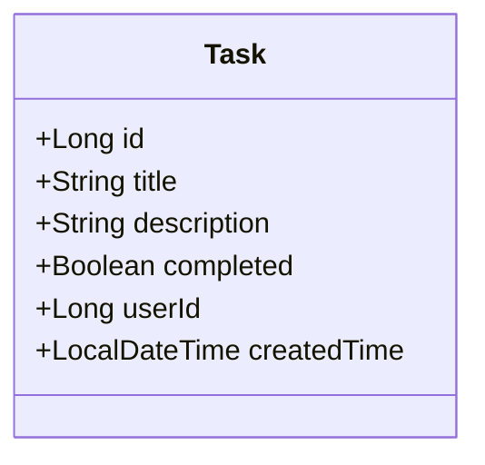

图表来源
- [Task.java:14-49](file://task-manager-backend/src/main/java/com/taskmanager/entity/Task.java#L14-L49)

章节来源
- [Task.java:14-49](file://task-manager-backend/src/main/java/com/taskmanager/entity/Task.java#L14-L49)
- [TaskMapper.xml:6-18](file://task-manager-backend/src/main/resources/mapper/TaskMapper.xml#L6-L18)

### User 实体类
- 设计理念：最小用户模型，用于认证与授权基础能力
- 关键注解：
  - @TableName("user")
  - @TableId(value = "id", type = IdType.AUTO)
- 字段映射：字段名与列名一致，支持驼峰映射
- JSON 处理：默认序列化

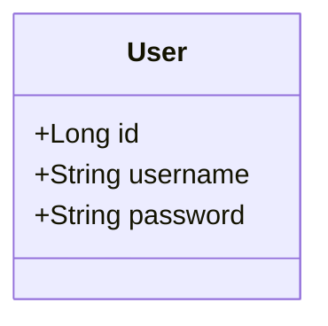

图表来源
- [User.java:12-30](file://task-manager-backend/src/main/java/com/taskmanager/entity/User.java#L12-L30)

章节来源
- [User.java:12-30](file://task-manager-backend/src/main/java/com/taskmanager/entity/User.java#L12-L30)
- [UserMapper.xml:6-10](file://task-manager-backend/src/main/resources/mapper/UserMapper.xml#L6-L10)

### SysUser 实体类（业务域用户）
- 设计理念：遵循“若依”风格的完整用户模型，包含部门、角色、状态、审计字段等
- 关键注解：
  - @TableName("sys_user")
  - @TableId(type = IdType.AUTO)
- 字段映射：字段名与列名一致，支持驼峰映射
- JSON 处理：默认序列化

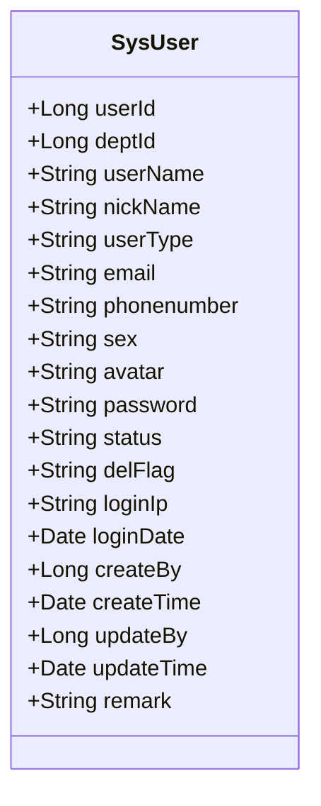

图表来源
- [SysUser.java:17-79](file://task-manager-backend/src/main/java/com/taskmanager/domain/SysUser.java#L17-L79)

章节来源
- [SysUser.java:17-79](file://task-manager-backend/src/main/java/com/taskmanager/domain/SysUser.java#L17-L79)
- [schema.sql:14-36](file://task-manager-backend/src/main/resources/schema.sql#L14-L36)

### Product 实体类（WMS 商品）
- 设计理念：商品信息实体，包含 Excel 导入标注与非数据库字段
- 关键注解：
  - @TableName("wms_product")
  - @TableId(type = IdType.AUTO)
  - @ExcelProperty 用于 EasyExcel 导入导出
  - @TableField(exist = false) 标记非数据库字段
- 字段映射：字段名与列名一致，支持驼峰映射
- 非数据库字段：supplierList、inventoryList、totalStock

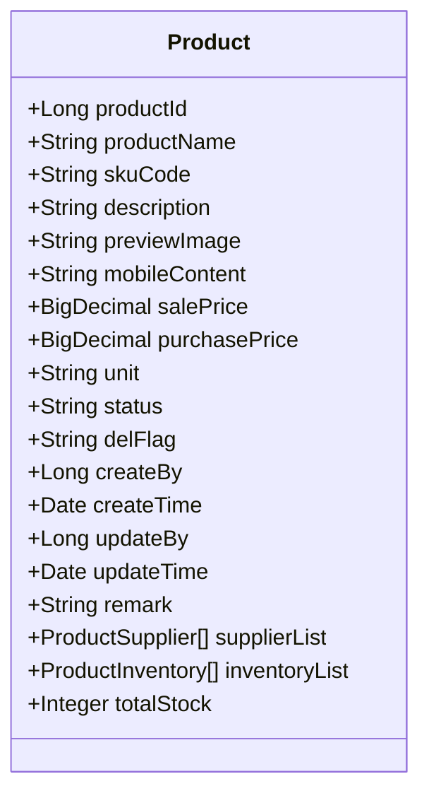

图表来源
- [Product.java:21-96](file://task-manager-backend/src/main/java/com/taskmanager/domain/Product.java#L21-L96)

章节来源
- [Product.java:21-96](file://task-manager-backend/src/main/java/com/taskmanager/domain/Product.java#L21-L96)
- [schema.sql:448-467](file://task-manager-backend/src/main/resources/schema.sql#L448-L467)

### Order 实体类（电商订单）
- 设计理念：订单主表，包含收货信息、状态与审计字段
- 关键注解：
  - @TableName("ecommerce_order")
  - @TableId(type = IdType.AUTO)
- 字段映射：字段名与列名一致，支持驼峰映射
- 非数据库字段：orderItems

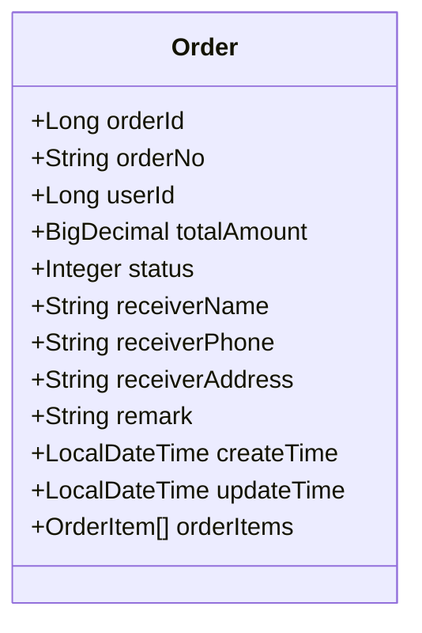

图表来源
- [Order.java:20-64](file://task-manager-backend/src/main/java/com/taskmanager/domain/Order.java#L20-L64)

章节来源
- [Order.java:20-64](file://task-manager-backend/src/main/java/com/taskmanager/domain/Order.java#L20-L64)
- [schema.sql:584-596](file://task-manager-backend/src/main/resources/schema.sql#L584-L596)

### OrderItem 实体类（电商订单明细）
- 设计理念：订单明细，记录商品与数量、金额
- 关键注解：
  - @TableName("ecommerce_order_item")
  - @TableId(type = IdType.AUTO)
- 字段映射：字段名与列名一致，支持驼峰映射

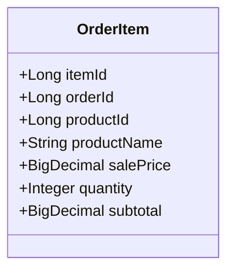

图表来源
- [OrderItem.java:17-43](file://task-manager-backend/src/main/java/com/taskmanager/domain/OrderItem.java#L17-L43)

章节来源
- [OrderItem.java:17-43](file://task-manager-backend/src/main/java/com/taskmanager/domain/OrderItem.java#L17-L43)
- [schema.sql:599-607](file://task-manager-backend/src/main/resources/schema.sql#L599-L607)

### ProductInventory 实体类（WMS 商品库存）
- 设计理念：商品库存实体，包含仓库维度与预警字段
- 关键注解：
  - @TableName("wms_product_inventory")
  - @TableId(type = IdType.AUTO)
- 字段映射：字段名与列名一致，支持驼峰映射
- 非数据库字段：warehouseName、warehouseCode

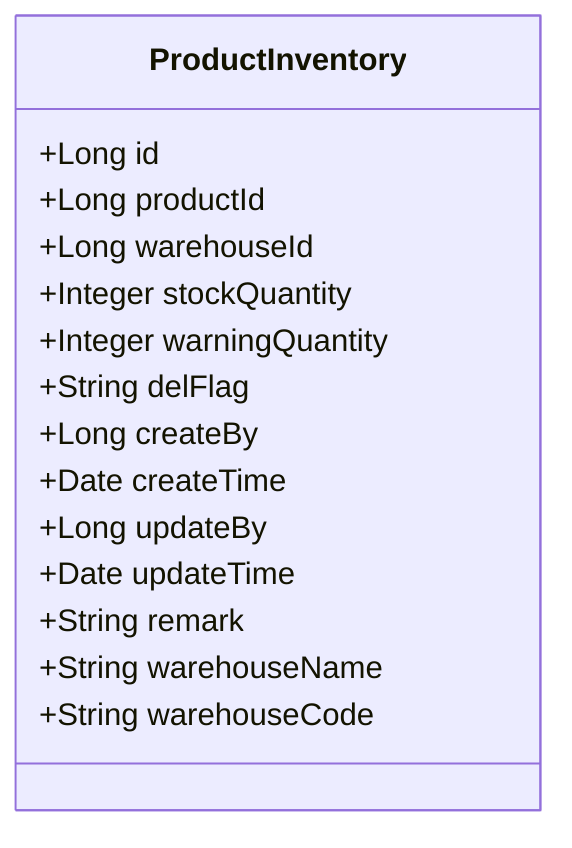

图表来源
- [ProductInventory.java:18-66](file://task-manager-backend/src/main/java/com/taskmanager/domain/ProductInventory.java#L18-L66)

章节来源
- [ProductInventory.java:18-66](file://task-manager-backend/src/main/java/com/taskmanager/domain/ProductInventory.java#L18-L66)
- [schema.sql:495-509](file://task-manager-backend/src/main/resources/schema.sql#L495-L509)

### ProductSupplier 实体类（WMS 商品供应商关联）
- 设计理念：商品与供应商的关联表，包含默认供应商与报价等
- 关键注解：
  - @TableName("wms_product_supplier")
  - @TableId(type = IdType.AUTO)
- 字段映射：字段名与列名一致，支持驼峰映射
- 非数据库字段：supplierName、companyName

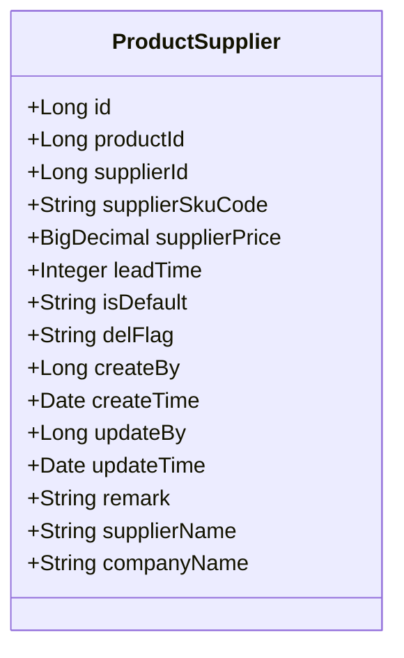

图表来源
- [ProductSupplier.java:18-70](file://task-manager-backend/src/main/java/com/taskmanager/domain/ProductSupplier.java#L18-L70)

章节来源
- [ProductSupplier.java:18-70](file://task-manager-backend/src/main/java/com/taskmanager/domain/ProductSupplier.java#L18-L70)
- [schema.sql:473-489](file://task-manager-backend/src/main/resources/schema.sql#L473-L489)

### 字段映射与命名策略
- 字段到列的映射：默认遵循驼峰转下划线策略；对于非驼峰列名，使用 @TableField 指定
- 示例：
  - @TableField("user_id")、@TableField("created_time")
- 非数据库字段：使用 @TableField(exist = false) 标记，避免持久化

章节来源
- [Task.java:41-48](file://task-manager-backend/src/main/java/com/taskmanager/entity/Task.java#L41-L48)
- [Product.java:86-95](file://task-manager-backend/src/main/java/com/taskmanager/domain/Product.java#L86-L95)
- [ProductInventory.java:60-65](file://task-manager-backend/src/main/java/com/taskmanager/domain/ProductInventory.java#L60-L65)
- [ProductSupplier.java:66-69](file://task-manager-backend/src/main/java/com/taskmanager/domain/ProductSupplier.java#L66-L69)

### 序列化与 JSON 处理
- 默认序列化：实体类通过 Lombok @Data 自动生成序列化所需方法
- JSON 处理：Jackson 默认处理 Java 对象与 JSON 的转换
- 注意事项：非数据库字段（exist = false）默认参与序列化；如需排除，可在序列化层进行配置

章节来源
- [Product.java:86-95](file://task-manager-backend/src/main/java/com/taskmanager/domain/Product.java#L86-L95)
- [ProductInventory.java:60-65](file://task-manager-backend/src/main/java/com/taskmanager/domain/ProductInventory.java#L60-L65)
- [ProductSupplier.java:66-69](file://task-manager-backend/src/main/java/com/taskmanager/domain/ProductSupplier.java#L66-L69)

### 校验注解与数据校验规则
- 当前实体类未直接使用 JSR-303 校验注解（如 @NotBlank、@NotNull 等）
- 建议在控制器或服务层对输入参数进行校验，结合全局异常处理统一返回

章节来源
- [SysUser.java:17-79](file://task-manager-backend/src/main/java/com/taskmanager/domain/SysUser.java#L17-L79)
- [Product.java:21-96](file://task-manager-backend/src/main/java/com/taskmanager/domain/Product.java#L21-L96)

### 继承关系与多态设计模式
- 实体类之间无继承关系，采用组合与关联设计
- 多态体现在业务层面：如订单状态（枚举/整型）与不同业务流程的映射

章节来源
- [Order.java:38-39](file://task-manager-backend/src/main/java/com/taskmanager/domain/Order.java#L38-L39)
- [OrderItem.java:35-36](file://task-manager-backend/src/main/java/com/taskmanager/domain/OrderItem.java#L35-L36)

### 实体类与数据库表结构的对应关系
- 通过 @TableName 与 @TableId/@TableField 建立映射
- 表结构定义见 schema.sql，包含主键、唯一索引、删除标志等约束
- 示例：
  - sys_user：主键 user_id，唯一索引 uk_user_name
  - wms_product：主键 product_id，唯一索引 uk_sku_code
  - ecommerce_order：主键 order_id，唯一索引 order_no

章节来源
- [schema.sql:14-36](file://task-manager-backend/src/main/resources/schema.sql#L14-L36)
- [schema.sql:448-467](file://task-manager-backend/src/main/resources/schema.sql#L448-L467)
- [schema.sql:584-596](file://task-manager-backend/src/main/resources/schema.sql#L584-L596)

## 依赖分析
- MyBatis-Plus 版本：3.5.5
- Spring Boot Starter：mybatis-plus-spring-boot3-starter
- 依赖注入与编译处理：Lombok 注解处理器

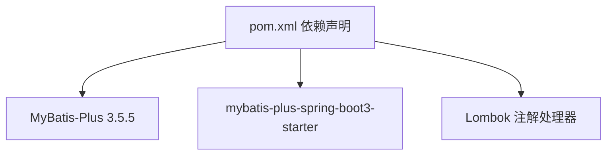

图表来源
- [pom.xml:58-62](file://task-manager-backend/pom.xml#L58-L62)
- [pom.xml:168-175](file://task-manager-backend/pom.xml#L168-L175)

章节来源
- [pom.xml:58-62](file://task-manager-backend/pom.xml#L58-L62)
- [pom.xml:168-175](file://task-manager-backend/pom.xml#L168-L175)

## 性能考虑
- 分页查询：MyBatis-Plus 分页插件已启用，建议在查询接口中使用 Page 对象
- 防全表更新/删除：BlockAttackInnerInterceptor 防护，避免误操作
- 字段选择：尽量使用字段选择查询，减少不必要的列加载
- 非必要字段：将非数据库字段标记为 exist = false，避免序列化开销

章节来源
- [MybatisPlusConfig.java:22-30](file://task-manager-backend/src/main/java/com/taskmanager/config/MybatisPlusConfig.java#L22-L30)
- [TaskMapper.xml:6-18](file://task-manager-backend/src/main/resources/mapper/TaskMapper.xml#L6-L18)

## 故障排查指南
- 查询结果为空：
  - 检查 @TableName 与实际表名是否一致
  - 检查 @TableId/@TableField 的列名映射是否正确
- 字段缺失或类型不匹配：
  - 确认 schema.sql 中的列定义与实体类字段类型一致
- 分页无效：
  - 确认调用方传入 Page 参数且 SQL 使用了分页插件
- JSON 序列化异常：
  - 检查是否存在循环引用或未序列化的字段

章节来源
- [schema.sql:14-36](file://task-manager-backend/src/main/resources/schema.sql#L14-L36)
- [TaskMapper.xml:6-18](file://task-manager-backend/src/main/resources/mapper/TaskMapper.xml#L6-L18)

## 结论
本项目的实体类设计遵循 MyBatis-Plus 注解驱动的最佳实践，通过明确的表映射与字段映射，实现了清晰的领域模型与数据库结构的对应。配合分页与安全插件，提升了查询效率与操作安全性。建议在后续迭代中补充参数校验与更完善的序列化策略，以进一步增强系统的健壮性与可维护性。

## 附录
- 初始化脚本与测试数据：schema.sql、test-data.sql
- Mapper XML 示例：TaskMapper.xml、UserMapper.xml

章节来源
- [schema.sql:1-608](file://task-manager-backend/src/main/resources/schema.sql#L1-L608)
- [test-data.sql:1-558](file://task-manager-backend/src/main/resources/test-data.sql#L1-L558)
- [TaskMapper.xml:3-42](file://task-manager-backend/src/main/resources/mapper/TaskMapper.xml#L3-L42)
- [UserMapper.xml:3-12](file://task-manager-backend/src/main/resources/mapper/UserMapper.xml#L3-L12)