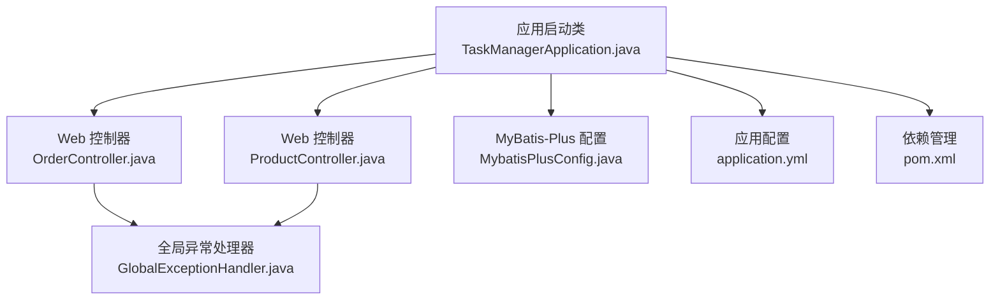
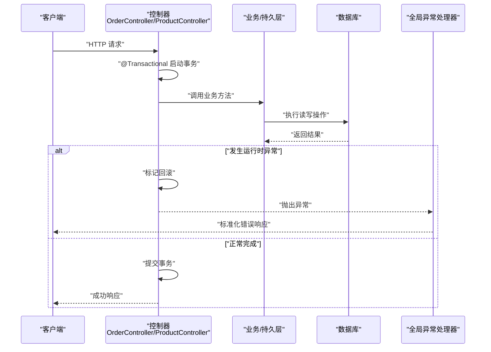
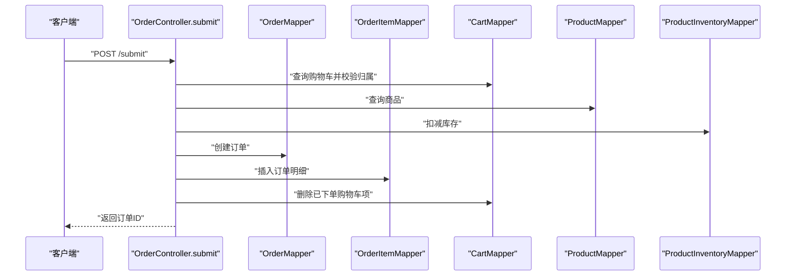
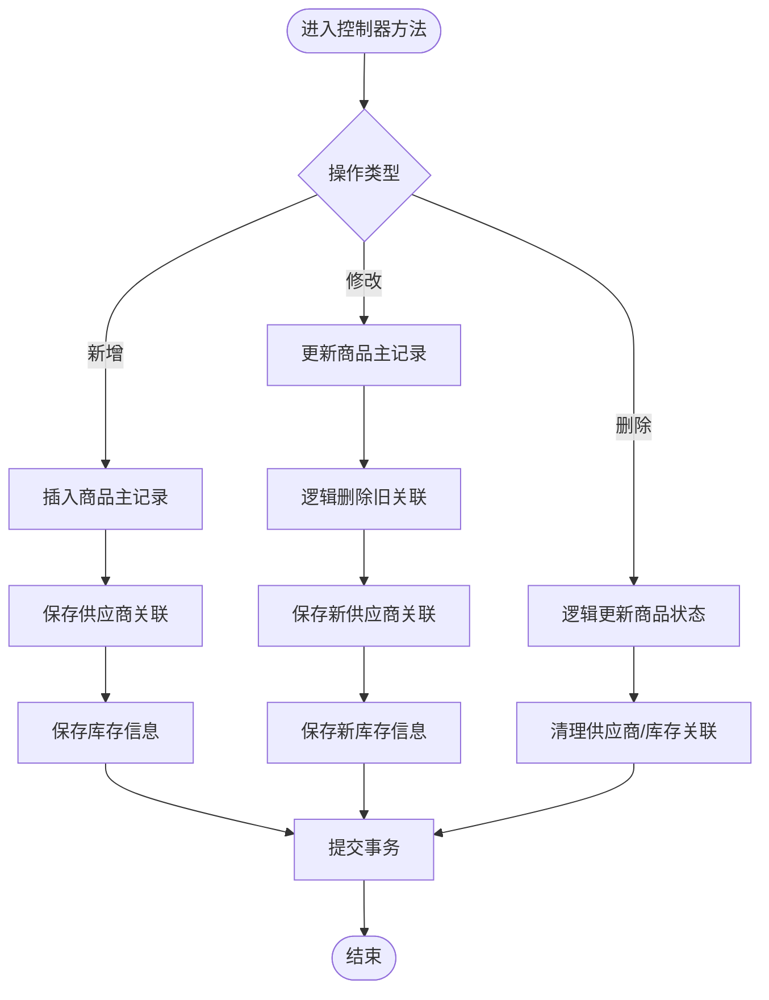
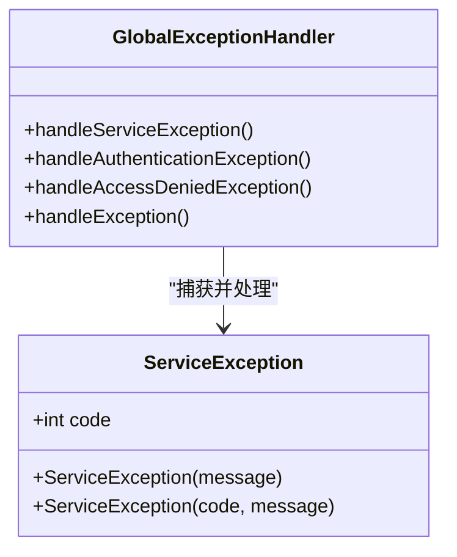
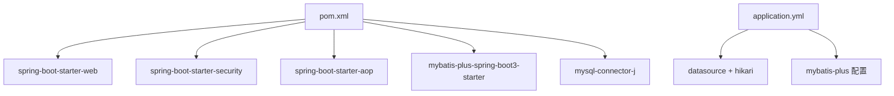

# 事务管理

<cite>
**本文引用的文件**
- [TaskManagerApplication.java](file://task-manager-backend/src/main/java/com/taskmanager/TaskManagerApplication.java)
- [OrderController.java](file://task-manager-backend/src/main/java/com/taskmanager/controller/OrderController.java)
- [ProductController.java](file://task-manager-backend/src/main/java/com/taskmanager/controller/ProductController.java)
- [GlobalExceptionHandler.java](file://task-manager-backend/src/main/java/com/taskmanager/common/exception/GlobalExceptionHandler.java)
- [ServiceException.java](file://task-manager-backend/src/main/java/com/taskmanager/common/exception/ServiceException.java)
- [MybatisPlusConfig.java](file://task-manager-backend/src/main/java/com/taskmanager/config/MybatisPlusConfig.java)
- [application.yml](file://task-manager-backend/src/main/resources/application.yml)
- [pom.xml](file://task-manager-backend/pom.xml)
</cite>

## 目录
1. [引言](#引言)
2. [项目结构](#项目结构)
3. [核心组件](#核心组件)
4. [架构总览](#架构总览)
5. [详细组件分析](#详细组件分析)
6. [依赖分析](#依赖分析)
7. [性能考虑](#性能考虑)
8. [故障排查指南](#故障排查指南)
9. [结论](#结论)
10. [附录](#附录)

## 引言
本文件围绕事务管理进行系统化技术说明，结合代码库中的实际实现，重点覆盖以下方面：
- Spring 事务注解与传播行为的使用现状与可扩展点
- Service 层事务控制策略（方法级与跨方法协调）
- 事务隔离级别与超时设置的配置现状与建议
- 事务异常处理（业务异常回滚与系统异常处理）
- 分布式事务与本地事务一致性保障的现状与建议
- 最佳实践与性能优化建议
- 复杂业务场景下的事务控制示例路径

本项目基于 Spring Boot 3 + MyBatis-Plus，采用注解驱动的事务控制，结合全局异常处理统一响应。

## 项目结构
后端模块位于 task-manager-backend，核心入口为应用启动类，事务相关主要分布在控制器层（使用 @Transactional），并通过全局异常处理器统一处理异常。

**图示来源**
- [TaskManagerApplication.java:1-18](file://task-manager-backend/src/main/java/com/taskmanager/TaskManagerApplication.java#L1-L18)
- [OrderController.java:1-303](file://task-manager-backend/src/main/java/com/taskmanager/controller/OrderController.java#L1-L303)
- [ProductController.java:1-237](file://task-manager-backend/src/main/java/com/taskmanager/controller/ProductController.java#L1-L237)
- [GlobalExceptionHandler.java:1-109](file://task-manager-backend/src/main/java/com/taskmanager/common/exception/GlobalExceptionHandler.java#L1-L109)
- [MybatisPlusConfig.java:1-32](file://task-manager-backend/src/main/java/com/taskmanager/config/MybatisPlusConfig.java#L1-L32)
- [application.yml:1-79](file://task-manager-backend/src/main/resources/application.yml#L1-L79)
- [pom.xml:1-206](file://task-manager-backend/pom.xml#L1-L206)

**章节来源**
- [TaskManagerApplication.java:1-18](file://task-manager-backend/src/main/java/com/taskmanager/TaskManagerApplication.java#L1-L18)
- [application.yml:1-79](file://task-manager-backend/src/main/resources/application.yml#L1-L79)
- [pom.xml:1-206](file://task-manager-backend/pom.xml#L1-L206)

## 核心组件
- 事务注解使用
  - 订单提交与取消：在控制器方法上使用 @Transactional，并指定 rollbackFor = Exception.class，确保运行时异常触发回滚。
  - 商品新增/修改/删除：在控制器方法上使用 @Transactional，保证多表写入的原子性。
- 全局异常处理
  - 通过 @RestControllerAdvice 统一捕获业务异常、认证/权限异常等，返回标准化结果。
- MyBatis-Plus 配置
  - 提供分页与安全防护插件，间接影响事务边界内的批量操作行为。
- 应用配置
  - 数据源连接池、MyBatis-Plus 全局配置等，为事务执行提供基础设施。

**章节来源**
- [OrderController.java:59-60](file://task-manager-backend/src/main/java/com/taskmanager/controller/OrderController.java#L59-L60)
- [OrderController.java:192-193](file://task-manager-backend/src/main/java/com/taskmanager/controller/OrderController.java#L192-L193)
- [ProductController.java:84-85](file://task-manager-backend/src/main/java/com/taskmanager/controller/ProductController.java#L84-L85)
- [ProductController.java:101-102](file://task-manager-backend/src/main/java/com/taskmanager/controller/ProductController.java#L101-L102)
- [ProductController.java:118-119](file://task-manager-backend/src/main/java/com/taskmanager/controller/ProductController.java#L118-L119)
- [GlobalExceptionHandler.java:23-109](file://task-manager-backend/src/main/java/com/taskmanager/common/exception/GlobalExceptionHandler.java#L23-L109)
- [MybatisPlusConfig.java:16-31](file://task-manager-backend/src/main/java/com/taskmanager/config/MybatisPlusConfig.java#L16-L31)
- [application.yml:5-44](file://task-manager-backend/src/main/resources/application.yml#L5-L44)

## 架构总览
下图展示了事务在请求链路中的作用位置与异常处理流程：

**图示来源**
- [OrderController.java:59-60](file://task-manager-backend/src/main/java/com/taskmanager/controller/OrderController.java#L59-L60)
- [OrderController.java:192-193](file://task-manager-backend/src/main/java/com/taskmanager/controller/OrderController.java#L192-L193)
- [ProductController.java:84-85](file://task-manager-backend/src/main/java/com/taskmanager/controller/ProductController.java#L84-L85)
- [ProductController.java:101-102](file://task-manager-backend/src/main/java/com/taskmanager/controller/ProductController.java#L101-L102)
- [ProductController.java:118-119](file://task-manager-backend/src/main/java/com/taskmanager/controller/ProductController.java#L118-L119)
- [GlobalExceptionHandler.java:23-109](file://task-manager-backend/src/main/java/com/taskmanager/common/exception/GlobalExceptionHandler.java#L23-L109)

## 详细组件分析

### 订单事务控制（提交与取消）
- 事务范围
  - 提交订单：在提交接口上标注 @Transactional，并指定 rollbackFor = Exception.class，确保运行时异常触发回滚。
  - 取消订单：同样使用 @Transactional，对订单状态更新与库存恢复进行原子化处理。
- 关键流程
  - 提交：校验购物车、扣减库存、创建订单、插入明细、清理购物车。
  - 取消：更新订单状态、按明细恢复库存。
- 异常处理
  - 方法内抛出运行时异常会触发回滚；全局异常处理器负责统一返回。

**图示来源**
- [OrderController.java:59-153](file://task-manager-backend/src/main/java/com/taskmanager/controller/OrderController.java#L59-L153)

**章节来源**
- [OrderController.java:59-60](file://task-manager-backend/src/main/java/com/taskmanager/controller/OrderController.java#L59-L60)
- [OrderController.java:192-193](file://task-manager-backend/src/main/java/com/taskmanager/controller/OrderController.java#L192-L193)
- [OrderController.java:61-153](file://task-manager-backend/src/main/java/com/taskmanager/controller/OrderController.java#L61-L153)

### 商品事务控制（新增/修改/删除）
- 事务范围
  - 新增：保存商品主记录，随后保存供应商与库存关联，整体在一个事务中。
  - 修改：先更新主记录，再逻辑删除旧关联，最后保存新关联，保证一致性。
  - 删除：逻辑更新商品状态并清理关联，保持原子性。
- 关键流程
  - 新增：插入商品 → 保存供应商 → 保存库存。
  - 修改：更新商品 → 清理旧供应商/库存 → 保存新供应商/库存。
  - 删除：更新商品状态 → 清理供应商/库存。

**图示来源**
- [ProductController.java:84-94](file://task-manager-backend/src/main/java/com/taskmanager/controller/ProductController.java#L84-L94)
- [ProductController.java:101-111](file://task-manager-backend/src/main/java/com/taskmanager/controller/ProductController.java#L101-L111)
- [ProductController.java:118-130](file://task-manager-backend/src/main/java/com/taskmanager/controller/ProductController.java#L118-L130)

**章节来源**
- [ProductController.java:84-94](file://task-manager-backend/src/main/java/com/taskmanager/controller/ProductController.java#L84-L94)
- [ProductController.java:101-111](file://task-manager-backend/src/main/java/com/taskmanager/controller/ProductController.java#L101-L111)
- [ProductController.java:118-130](file://task-manager-backend/src/main/java/com/taskmanager/controller/ProductController.java#L118-L130)

### 事务传播行为与跨方法协调
- 现状
  - 控制器方法直接标注 @Transactional，事务在控制器层开启。
  - 由于控制器方法内部调用自身方法（如工具方法）不会触发新的事务，跨方法事务协调以“同进程内调用”为主。
- 建议
  - 对于跨方法的复杂业务，建议将事务边界提升至 Service 层，避免控制器层直接承担事务职责，便于测试与复用。
  - 明确传播行为（如 REQUIRES_NEW、NESTED）以满足嵌套事务需求。

**章节来源**
- [OrderController.java:61-153](file://task-manager-backend/src/main/java/com/taskmanager/controller/OrderController.java#L61-L153)
- [ProductController.java:84-130](file://task-manager-backend/src/main/java/com/taskmanager/controller/ProductController.java#L84-L130)

### 事务隔离级别与超时设置
- 现状
  - 代码中未显式配置隔离级别与超时时间，默认遵循底层数据源与 JDBC 驱动的默认值。
- 建议
  - 对高并发写入场景（如库存扣减）可考虑设置合理的隔离级别，避免脏读/幻读。
  - 对长事务可设置超时时间，避免长时间占用锁资源。
- 配置入口
  - 可在数据源或 JPA/MyBatis 的事务管理器处进行统一配置（本项目以 MyBatis-Plus 为主，可在配置类中扩展）。

**章节来源**
- [application.yml:5-16](file://task-manager-backend/src/main/resources/application.yml#L5-L16)
- [MybatisPlusConfig.java:16-31](file://task-manager-backend/src/main/java/com/taskmanager/config/MybatisPlusConfig.java#L16-L31)

### 事务异常处理
- 业务异常
  - 自定义 ServiceException 用于承载业务错误码与消息，配合全局异常处理器返回标准响应。
- 运行时异常
  - 控制器方法标注 @Transactional(rollbackFor = Exception.class)，确保运行时异常触发回滚。
- 其他异常
  - 全局异常处理器统一处理认证/权限/参数校验等异常，返回标准化错误。

**图示来源**
- [GlobalExceptionHandler.java:23-109](file://task-manager-backend/src/main/java/com/taskmanager/common/exception/GlobalExceptionHandler.java#L23-L109)
- [ServiceException.java:10-35](file://task-manager-backend/src/main/java/com/taskmanager/common/exception/ServiceException.java#L10-L35)

**章节来源**
- [GlobalExceptionHandler.java:23-109](file://task-manager-backend/src/main/java/com/taskmanager/common/exception/GlobalExceptionHandler.java#L23-L109)
- [ServiceException.java:10-35](file://task-manager-backend/src/main/java/com/taskmanager/common/exception/ServiceException.java#L10-L35)
- [OrderController.java:59-60](file://task-manager-backend/src/main/java/com/taskmanager/controller/OrderController.java#L59-L60)
- [OrderController.java:192-193](file://task-manager-backend/src/main/java/com/taskmanager/controller/OrderController.java#L192-L193)
- [ProductController.java:84-85](file://task-manager-backend/src/main/java/com/taskmanager/controller/ProductController.java#L84-L85)
- [ProductController.java:101-102](file://task-manager-backend/src/main/java/com/taskmanager/controller/ProductController.java#L101-L102)
- [ProductController.java:118-119](file://task-manager-backend/src/main/java/com/taskmanager/controller/ProductController.java#L118-L119)

### 分布式事务与本地事务一致性
- 现状
  - 本项目为单体应用，事务边界在本地数据库内，未涉及分布式事务框架。
- 建议
  - 若未来扩展到多数据源或多服务，可引入分布式事务方案（如 TCC、Saga 或基于消息的最终一致性）。
  - 在本地事务层面，确保同一请求上下文内的多个数据变更在同一事务中完成，避免跨请求的不一致。

**章节来源**
- [TaskManagerApplication.java:10-11](file://task-manager-backend/src/main/java/com/taskmanager/TaskManagerApplication.java#L10-L11)

## 依赖分析
- 事务相关依赖
  - Spring Boot Starter Web、Security、AOP（日志切面）、MyBatis-Plus、MySQL Connector/J。
- 事务基础设施
  - 数据源连接池（HikariCP）、MyBatis-Plus 插件（分页与安全防护）。

**图示来源**
- [pom.xml:32-145](file://task-manager-backend/pom.xml#L32-L145)
- [application.yml:5-44](file://task-manager-backend/src/main/resources/application.yml#L5-L44)

**章节来源**
- [pom.xml:32-145](file://task-manager-backend/pom.xml#L32-L145)
- [application.yml:5-44](file://task-manager-backend/src/main/resources/application.yml#L5-L44)

## 性能考虑
- 事务粒度
  - 将事务范围控制在必要的最小范围内，避免在事务中执行耗时操作（如外部调用、大对象序列化）。
- 并发与锁竞争
  - 对热点写入（如库存扣减）合理设计索引与唯一约束，减少锁冲突。
- 连接池与超时
  - 结合 HikariCP 连接池参数与数据库超时设置，避免连接泄漏与长时间阻塞。
- 批量操作
  - 使用 MyBatis-Plus 的批量插入/更新能力，减少网络往返与事务持有时间。

**章节来源**
- [application.yml:10-16](file://task-manager-backend/src/main/resources/application.yml#L10-L16)
- [MybatisPlusConfig.java:22-29](file://task-manager-backend/src/main/java/com/taskmanager/config/MybatisPlusConfig.java#L22-L29)

## 故障排查指南
- 常见问题
  - 事务未生效：确认方法可见性与调用上下文（同进程内调用才会走代理）。
  - 回滚不生效：检查异常类型是否为运行时异常，或是否正确配置 rollbackFor。
  - 死锁/超时：关注数据库锁等待与连接池饱和情况。
- 定位手段
  - 查看全局异常处理器输出的日志与响应。
  - 结合数据库慢查询与锁监控定位瓶颈。

**章节来源**
- [GlobalExceptionHandler.java:23-109](file://task-manager-backend/src/main/java/com/taskmanager/common/exception/GlobalExceptionHandler.java#L23-L109)
- [OrderController.java:59-60](file://task-manager-backend/src/main/java/com/taskmanager/controller/OrderController.java#L59-L60)
- [OrderController.java:192-193](file://task-manager-backend/src/main/java/com/taskmanager/controller/OrderController.java#L192-L193)
- [ProductController.java:84-85](file://task-manager-backend/src/main/java/com/taskmanager/controller/ProductController.java#L84-L85)
- [ProductController.java:101-102](file://task-manager-backend/src/main/java/com/taskmanager/controller/ProductController.java#L101-L102)
- [ProductController.java:118-119](file://task-manager-backend/src/main/java/com/taskmanager/controller/ProductController.java#L118-L119)

## 结论
本项目在控制器层直接使用 @Transactional 实现了关键业务的事务控制，配合全局异常处理实现了统一的错误响应。为进一步提升可维护性与扩展性，建议：
- 将事务边界迁移至 Service 层，明确跨方法事务协调策略。
- 明确隔离级别与超时设置，针对高并发场景进行优化。
- 在本地事务基础上，为未来的分布式场景预留扩展点。

## 附录
- 示例路径参考
  - 订单提交事务：[OrderController.submit:61-153](file://task-manager-backend/src/main/java/com/taskmanager/controller/OrderController.java#L61-L153)
  - 订单取消事务：[OrderController.cancel:194-232](file://task-manager-backend/src/main/java/com/taskmanager/controller/OrderController.java#L194-L232)
  - 商品新增事务：[ProductController.add:84-94](file://task-manager-backend/src/main/java/com/taskmanager/controller/ProductController.java#L84-L94)
  - 商品修改事务：[ProductController.edit:102-111](file://task-manager-backend/src/main/java/com/taskmanager/controller/ProductController.java#L102-L111)
  - 商品删除事务：[ProductController.remove:118-130](file://task-manager-backend/src/main/java/com/taskmanager/controller/ProductController.java#L118-L130)
- 异常处理参考
  - 业务异常：[ServiceException:10-35](file://task-manager-backend/src/main/java/com/taskmanager/common/exception/ServiceException.java#L10-L35)
  - 全局异常：[GlobalExceptionHandler:23-109](file://task-manager-backend/src/main/java/com/taskmanager/common/exception/GlobalExceptionHandler.java#L23-109)
- 基础设施参考
  - 数据源与连接池：[application.yml:5-16](file://task-manager-backend/src/main/resources/application.yml#L5-L16)
  - MyBatis-Plus 配置：[MybatisPlusConfig:16-31](file://task-manager-backend/src/main/java/com/taskmanager/config/MybatisPlusConfig.java#L16-L31)
  - 依赖管理：[pom.xml:32-145](file://task-manager-backend/pom.xml#L32-145)