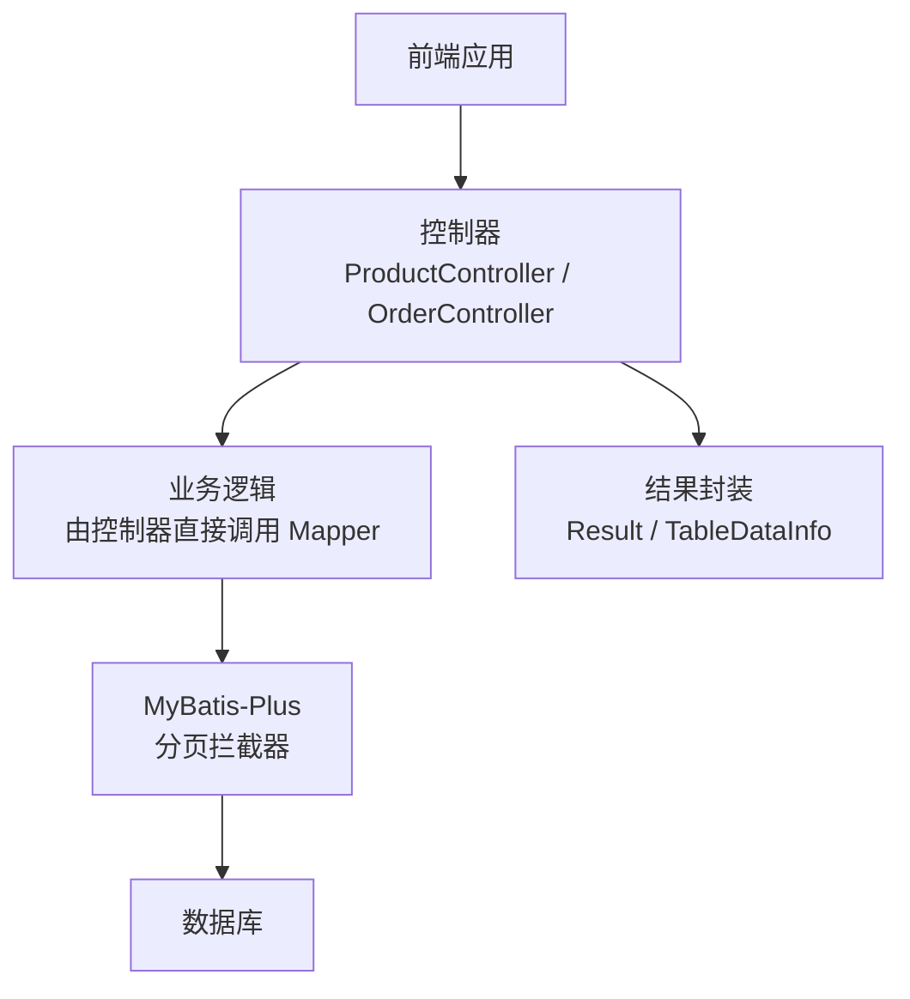
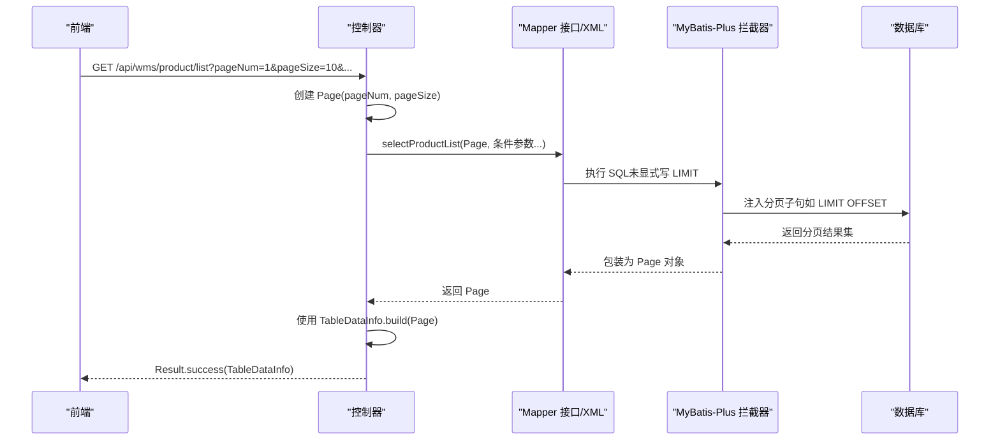
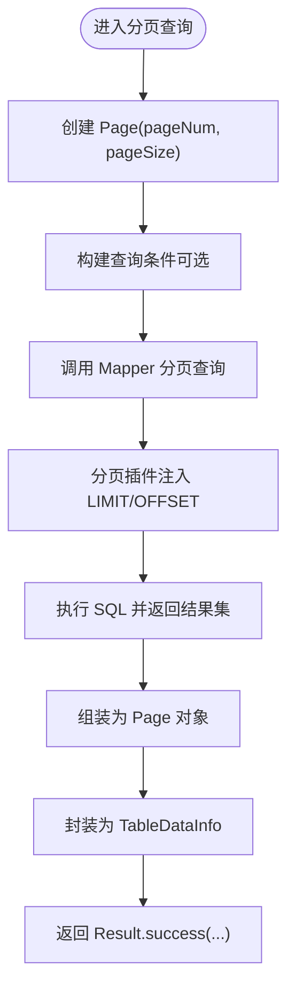
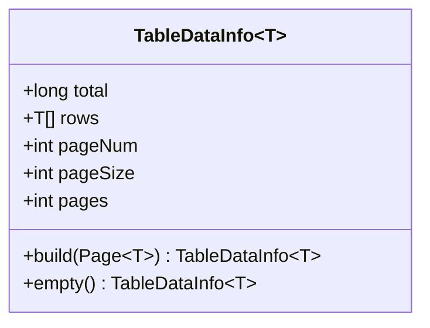
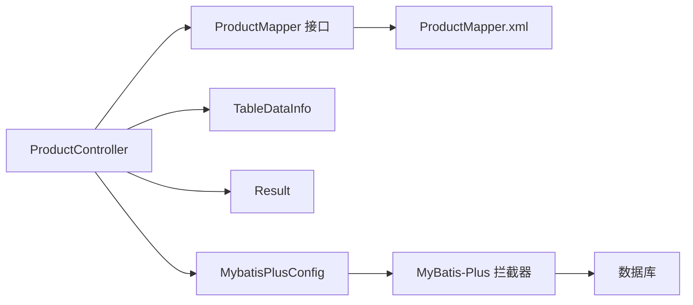

# 分页查询

<cite>
**本文引用的文件**
- [MybatisPlusConfig.java](file://task-manager-backend/src/main/java/com/taskmanager/config/MybatisPlusConfig.java)
- [TableDataInfo.java](file://task-manager-backend/src/main/java/com/taskmanager/common/utils/TableDataInfo.java)
- [Result.java](file://task-manager-backend/src/main/java/com/taskmanager/common/Result.java)
- [ProductController.java](file://task-manager-backend/src/main/java/com/taskmanager/controller/ProductController.java)
- [OrderController.java](file://task-manager-backend/src/main/java/com/taskmanager/controller/OrderController.java)
- [ProductMapper.java](file://task-manager-backend/src/main/java/com/taskmanager/mapper/ProductMapper.java)
- [ProductMapper.xml](file://task-manager-backend/src/main/resources/mapper/ProductMapper.xml)
- [SysUserMapper.xml](file://task-manager-backend/src/main/resources/mapper/SysUserMapper.xml)
- [application.yml](file://task-manager-backend/src/main/resources/application.yml)
</cite>

## 目录
1. [简介](#简介)
2. [项目结构](#项目结构)
3. [核心组件](#核心组件)
4. [架构总览](#架构总览)
5. [详细组件分析](#详细组件分析)
6. [依赖分析](#依赖分析)
7. [性能考虑](#性能考虑)
8. [故障排查指南](#故障排查指南)
9. [结论](#结论)
10. [附录](#附录)

## 简介
本文件围绕 MyBatis-Plus 的分页查询能力，系统性阐述分页插件的配置与使用、Page 对象的创建与参数设置、SQL 自动分页处理机制、条件分页查询的实现方式、前后端参数传递与结果封装、以及在大数据量场景下的性能优化策略。文中以实际代码为依据，结合图示帮助读者快速掌握分页查询的最佳实践。

## 项目结构
本项目的后端采用 Spring Boot + MyBatis-Plus 架构，分页查询相关的关键位置如下：
- 配置层：MyBatis-Plus 分页插件通过配置类注册，确保所有分页查询自动生效
- 控制器层：各业务控制器接收前端分页参数，构造 Page 对象并调用 Mapper 执行分页查询
- 映射层：Mapper XML 中编写带条件的 SQL 查询，配合分页插件自动追加分页子句
- 结果封装：统一返回体包装通用 Result，分页数据可直接使用 TableDataInfo 标准化封装

**图表来源**
- [MybatisPlusConfig.java:22-30](file://task-manager-backend/src/main/java/com/taskmanager/config/MybatisPlusConfig.java#L22-L30)
- [ProductController.java:50-63](file://task-manager-backend/src/main/java/com/taskmanager/controller/ProductController.java#L50-L63)
- [OrderController.java:158-168](file://task-manager-backend/src/main/java/com/taskmanager/controller/OrderController.java#L158-L168)
- [ProductMapper.xml:27-46](file://task-manager-backend/src/main/resources/mapper/ProductMapper.xml#L27-L46)

**章节来源**
- [MybatisPlusConfig.java:16-31](file://task-manager-backend/src/main/java/com/taskmanager/config/MybatisPlusConfig.java#L16-L31)
- [application.yml:33-44](file://task-manager-backend/src/main/resources/application.yml#L33-L44)

## 核心组件
- 分页插件配置：在配置类中注册 MyBatis-Plus 拦截器，添加 MySQL 专用的分页内核与全表更新/删除防护
- Page 对象：由控制器接收 pageNum/pageSize 参数创建，作为分页查询的上下文载体
- Mapper 接口与 XML：定义带条件的查询方法与 SQL 片段，分页插件自动注入 LIMIT/OFFSET
- 结果封装：统一返回体 Result；TableDataInfo 将 MyBatis-Plus Page 转换为前端友好的分页数据模型

**章节来源**
- [MybatisPlusConfig.java:22-30](file://task-manager-backend/src/main/java/com/taskmanager/config/MybatisPlusConfig.java#L22-L30)
- [ProductController.java:60-62](file://task-manager-backend/src/main/java/com/taskmanager/controller/ProductController.java#L60-L62)
- [ProductMapper.xml:27-46](file://task-manager-backend/src/main/resources/mapper/ProductMapper.xml#L27-L46)
- [TableDataInfo.java:37-58](file://task-manager-backend/src/main/java/com/taskmanager/common/utils/TableDataInfo.java#L37-L58)

## 架构总览
下图展示了从前端到数据库的分页查询链路，以及分页插件如何在不修改 SQL 的前提下自动注入分页子句。

**图表来源**
- [ProductController.java:50-63](file://task-manager-backend/src/main/java/com/taskmanager/controller/ProductController.java#L50-L63)
- [ProductMapper.java:28-33](file://task-manager-backend/src/main/java/com/taskmanager/mapper/ProductMapper.java#L28-L33)
- [ProductMapper.xml:27-46](file://task-manager-backend/src/main/resources/mapper/ProductMapper.xml#L27-L46)
- [TableDataInfo.java:37-44](file://task-manager-backend/src/main/java/com/taskmanager/common/utils/TableDataInfo.java#L37-L44)

## 详细组件分析

### 分页插件配置（MyBatis-PlusConfig）
- 功能：注册 MyBatis-Plus 拦截器，启用 MySQL 专用分页内核与全表更新/删除防护
- 关键点：拦截器按顺序执行，分页内核会识别分页查询并注入 LIMIT/OFFSET

**章节来源**
- [MybatisPlusConfig.java:22-30](file://task-manager-backend/src/main/java/com/taskmanager/config/MybatisPlusConfig.java#L22-L30)

### Page 对象的创建与参数设置
- 控制器接收 pageNum/pageSize，默认值通常为 1/10
- 使用 new Page<>(pageNum, pageSize) 构造分页上下文
- 将 Page 传入 Mapper 的分页查询方法，或配合 QueryWrapper/LambdaQueryWrapper 进行条件过滤

**章节来源**
- [ProductController.java:52-62](file://task-manager-backend/src/main/java/com/taskmanager/controller/ProductController.java#L52-L62)
- [OrderController.java:159-167](file://task-manager-backend/src/main/java/com/taskmanager/controller/OrderController.java#L159-L167)

### SQL 自动分页处理与结果截取
- Mapper 接口声明分页查询方法，参数包含 Page 与业务条件
- XML 中编写带条件的 SQL，不需手动写 LIMIT/OFFSET
- 分页插件在执行时自动注入分页子句，仅返回当前页数据

**章节来源**
- [ProductMapper.java:28-33](file://task-manager-backend/src/main/java/com/taskmanager/mapper/ProductMapper.java#L28-L33)
- [ProductMapper.xml:27-46](file://task-manager-backend/src/main/resources/mapper/ProductMapper.xml#L27-L46)

### 条件分页查询：多条件筛选、排序与参数传递
- 多条件：支持名称/SKU 模糊匹配、状态精确匹配、价格区间过滤等
- 排序：通常按创建时间倒序，保证最新数据优先展示
- 参数传递：控制器通过 @RequestParam 接收前端传参，Mapper 通过 @Param 接收并拼接到 SQL

**图表来源**
- [ProductController.java:50-63](file://task-manager-backend/src/main/java/com/taskmanager/controller/ProductController.java#L50-L63)
- [ProductMapper.xml:30-45](file://task-manager-backend/src/main/resources/mapper/ProductMapper.xml#L30-L45)
- [TableDataInfo.java:37-44](file://task-manager-backend/src/main/java/com/taskmanager/common/utils/TableDataInfo.java#L37-L44)

**章节来源**
- [ProductController.java:52-62](file://task-manager-backend/src/main/java/com/taskmanager/controller/ProductController.java#L52-L62)
- [ProductMapper.xml:27-46](file://task-manager-backend/src/main/resources/mapper/ProductMapper.xml#L27-L46)

### 完整示例：商品分页列表
- 前端参数：pageNum、pageSize、productName、skuCode、status、minPrice、maxPrice
- 后端处理：控制器接收参数 → 创建 Page → Mapper 条件查询 → TableDataInfo 标准化 → Result.success
- 导出场景：导出接口可使用大页大小一次性拉取数据，避免分页多次 IO

**章节来源**
- [ProductController.java:50-63](file://task-manager-backend/src/main/java/com/taskmanager/controller/ProductController.java#L50-L63)
- [ProductController.java:138-155](file://task-manager-backend/src/main/java/com/taskmanager/controller/ProductController.java#L138-L155)
- [TableDataInfo.java:37-44](file://task-manager-backend/src/main/java/com/taskmanager/common/utils/TableDataInfo.java#L37-L44)

### TableDataInfo 工具类：分页数据标准化
- 字段：total、rows、pageNum、pageSize、pages
- 构建：提供从 MyBatis-Plus Page 构建静态方法，亦提供空数据的便捷方法
- 作用：将底层 Page 的总数、记录、页码等信息标准化输出给前端

**图表来源**
- [TableDataInfo.java:14-58](file://task-manager-backend/src/main/java/com/taskmanager/common/utils/TableDataInfo.java#L14-L58)

**章节来源**
- [TableDataInfo.java:37-58](file://task-manager-backend/src/main/java/com/taskmanager/common/utils/TableDataInfo.java#L37-L58)

### 统一返回体 Result
- 字段：code、message、data
- 方法：success(data)/success()/error(code, msg)/error(msg)
- 作用：规范前后端交互格式，便于前端统一处理

**章节来源**
- [Result.java:15-75](file://task-manager-backend/src/main/java/com/taskmanager/common/Result.java#L15-L75)

## 依赖分析
- 控制器依赖：控制器通过注解接收前端参数，构造 Page 并调用 Mapper
- Mapper 依赖：Mapper 接口与 XML 映射文件共同完成条件查询
- 插件依赖：MyBatis-Plus 拦截器自动处理分页 SQL 注入
- 结果封装依赖：Result 提供统一响应，TableDataInfo 提供分页数据模型

**图表来源**
- [ProductController.java:34-63](file://task-manager-backend/src/main/java/com/taskmanager/controller/ProductController.java#L34-L63)
- [ProductMapper.java:15-39](file://task-manager-backend/src/main/java/com/taskmanager/mapper/ProductMapper.java#L15-L39)
- [ProductMapper.xml:4-54](file://task-manager-backend/src/main/resources/mapper/ProductMapper.xml#L4-L54)
- [MybatisPlusConfig.java:22-30](file://task-manager-backend/src/main/java/com/taskmanager/config/MybatisPlusConfig.java#L22-L30)

**章节来源**
- [ProductController.java:34-63](file://task-manager-backend/src/main/java/com/taskmanager/controller/ProductController.java#L34-L63)
- [ProductMapper.java:15-39](file://task-manager-backend/src/main/java/com/taskmanager/mapper/ProductMapper.java#L15-L39)
- [ProductMapper.xml:4-54](file://task-manager-backend/src/main/resources/mapper/ProductMapper.xml#L4-L54)
- [MybatisPlusConfig.java:22-30](file://task-manager-backend/src/main/java/com/taskmanager/config/MybatisPlusConfig.java#L22-L30)

## 性能考虑
- 分页插件与 SQL 注入：分页插件自动注入 LIMIT/OFFSET，避免手写分页导致的重复与遗漏
- 条件索引：对常用筛选字段（如 status、sale_price、create_time）建立合适索引，提升 WHERE 与 ORDER BY 的效率
- 大数据量导出：导出场景可使用较大页大小一次性拉取，减少分页次数与往返开销
- 排序字段：尽量使用索引列进行排序，避免隐式转换与函数导致的索引失效
- 分页上限：对 pageSize 设置合理上限，防止超大页导致内存压力与数据库负载过高
- 缓存策略：对稳定且高频的分页查询结果可引入缓存，降低数据库压力

## 故障排查指南
- 分页未生效：确认分页插件是否正确注册，SQL 是否未显式写 LIMIT/OFFSET
- 条件无效：检查前端传参是否正确传递到控制器，Mapper 的 @Param 名称与 XML 参数名是否一致
- 排序异常：确认排序字段存在索引，避免对排序字段使用函数或类型转换
- 性能问题：对筛选与排序字段建立索引；限制 pageSize；必要时使用覆盖索引
- 导出异常：导出接口使用较大页大小一次性拉取，避免分页多次 IO

**章节来源**
- [ProductController.java:52-62](file://task-manager-backend/src/main/java/com/taskmanager/controller/ProductController.java#L52-L62)
- [ProductMapper.xml:27-46](file://task-manager-backend/src/main/resources/mapper/ProductMapper.xml#L27-L46)
- [SysUserMapper.xml:35-56](file://task-manager-backend/src/main/resources/mapper/SysUserMapper.xml#L35-L56)

## 结论
通过在配置层启用 MyBatis-Plus 分页插件，在控制器层以 Page 对象承载分页参数，并在 Mapper 层编写带条件的 SQL，即可实现“零样板”的自动分页查询。配合 TableDataInfo 标准化分页数据与 Result 统一响应体，既能满足前端分页展示需求，也能在大数据量场景下保持良好的性能与可维护性。

## 附录
- 前端分页参数建议：pageNum、pageSize、多个可选筛选字段（如名称、状态、价格区间）、排序字段
- 后端处理要点：参数校验与默认值、Page 构造、条件拼接、结果封装
- 数据库层面：为筛选与排序字段建立索引，避免全表扫描