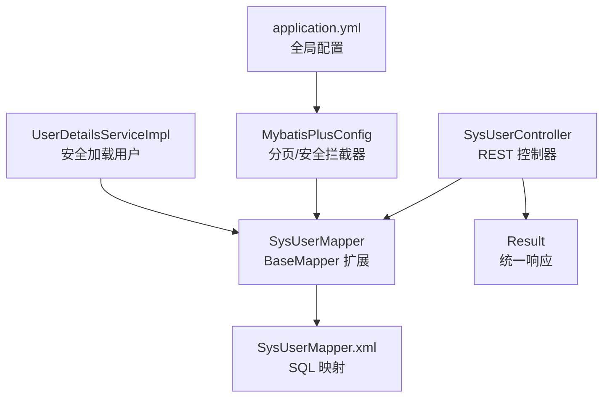
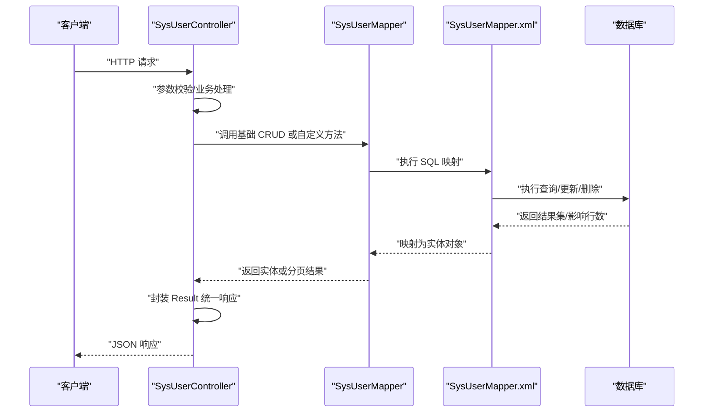
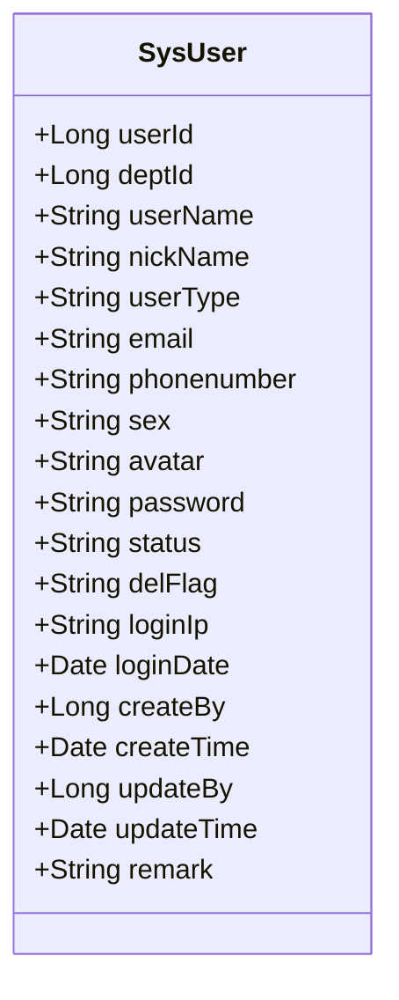
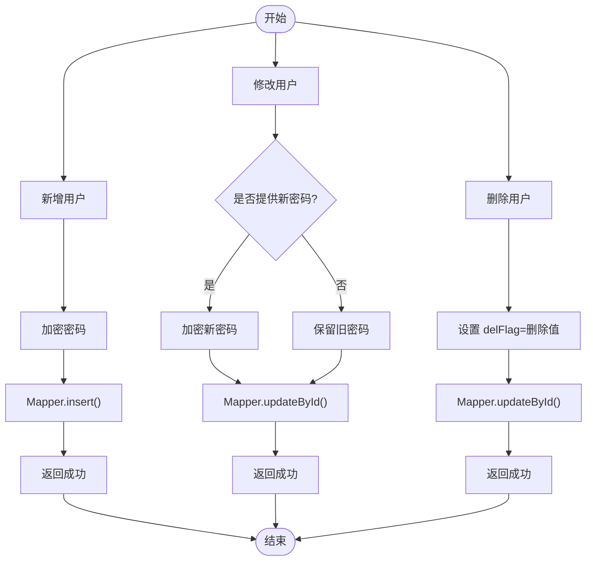
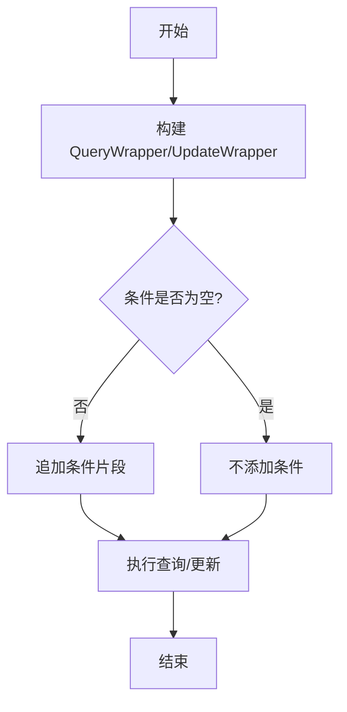
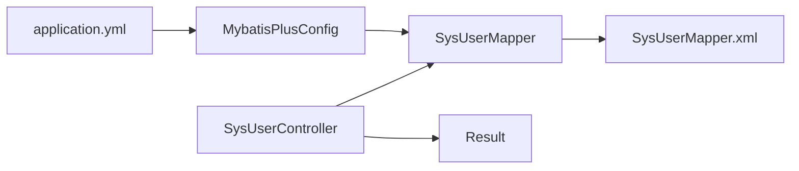

# 增删改查操作

<cite>
**本文引用的文件**
- [SysUser.java](file://task-manager-backend/src/main/java/com/taskmanager/domain/SysUser.java)
- [SysUserMapper.java](file://task-manager-backend/src/main/java/com/taskmanager/mapper/SysUserMapper.java)
- [SysUserMapper.xml](file://task-manager-backend/src/main/resources/mapper/SysUserMapper.xml)
- [SysUserController.java](file://task-manager-backend/src/main/java/com/taskmanager/controller/SysUserController.java)
- [MybatisPlusConfig.java](file://task-manager-backend/src/main/java/com/taskmanager/config/MybatisPlusConfig.java)
- [application.yml](file://task-manager-backend/src/main/resources/application.yml)
- [Result.java](file://task-manager-backend/src/main/java/com/taskmanager/common/Result.java)
- [SysUserControllerTest.java](file://task-manager-backend/src/test/java/com/taskmanager/controller/SysUserControllerTest.java)
- [UserDetailsServiceImpl.java](file://task-manager-backend/src/main/java/com/taskmanager/security/UserDetailsServiceImpl.java)
</cite>

## 目录
1. [简介](#简介)
2. [项目结构](#项目结构)
3. [核心组件](#核心组件)
4. [架构总览](#架构总览)
5. [详细组件分析](#详细组件分析)
6. [依赖分析](#依赖分析)
7. [性能考虑](#性能考虑)
8. [故障排查指南](#故障排查指南)
9. [结论](#结论)
10. [附录](#附录)

## 简介
本文件围绕“增删改查”操作展开，基于仓库中的用户管理模块，系统性讲解 MyBatis-Plus 的基础 CRUD 实现方式，涵盖实体类与数据库表映射、主键策略、字段映射、自动填充与逻辑删除、Service 层封装与业务处理、以及条件构造器的使用。同时提供完整的用户管理 CRUD 示例流程，包括参数传递、返回值处理与异常捕获。

## 项目结构
用户管理相关的核心文件组织如下：
- 控制层：SysUserController 提供 REST 接口，负责接收请求、调用 Mapper 并返回统一响应。
- 领域模型：SysUser 定义用户实体，标注表名与主键策略。
- 数据访问层：SysUserMapper 继承 BaseMapper，提供基础 CRUD 与自定义查询；XML 中定义 SQL 与条件拼接。
- 配置层：MybatisPlusConfig 注册分页与安全拦截器；application.yml 配置 MyBatis-Plus 全局行为（如逻辑删除、ID 策略）。
- 统一响应：Result 封装统一返回结构。
- 安全集成：UserDetailsServiceImpl 使用 SysUserMapper 完成登录与权限加载。

图表来源
- [SysUserController.java:1-132](file://task-manager-backend/src/main/java/com/taskmanager/controller/SysUserController.java#L1-L132)
- [SysUserMapper.java:1-39](file://task-manager-backend/src/main/java/com/taskmanager/mapper/SysUserMapper.java#L1-L39)
- [SysUserMapper.xml:1-58](file://task-manager-backend/src/main/resources/mapper/SysUserMapper.xml#L1-L58)
- [MybatisPlusConfig.java:1-32](file://task-manager-backend/src/main/java/com/taskmanager/config/MybatisPlusConfig.java#L1-L32)
- [application.yml:1-79](file://task-manager-backend/src/main/resources/application.yml#L1-L79)
- [UserDetailsServiceImpl.java:1-59](file://task-manager-backend/src/main/java/com/taskmanager/security/UserDetailsServiceImpl.java#L1-L59)

章节来源
- [SysUserController.java:1-132](file://task-manager-backend/src/main/java/com/taskmanager/controller/SysUserController.java#L1-L132)
- [SysUserMapper.java:1-39](file://task-manager-backend/src/main/java/com/taskmanager/mapper/SysUserMapper.java#L1-L39)
- [SysUserMapper.xml:1-58](file://task-manager-backend/src/main/resources/mapper/SysUserMapper.xml#L1-L58)
- [MybatisPlusConfig.java:1-32](file://task-manager-backend/src/main/java/com/taskmanager/config/MybatisPlusConfig.java#L1-L32)
- [application.yml:1-79](file://task-manager-backend/src/main/resources/application.yml#L1-L79)
- [Result.java:1-76](file://task-manager-backend/src/main/java/com/taskmanager/common/Result.java#L1-L76)
- [UserDetailsServiceImpl.java:1-59](file://task-manager-backend/src/main/java/com/taskmanager/security/UserDetailsServiceImpl.java#L1-L59)

## 核心组件
- 实体类与表映射
  - SysUser 使用注解标注表名为 sys_user，并设置主键策略为自增。
  - 字段覆盖了用户的基本信息、状态、删除标志、创建与更新时间等。
- Mapper 与 XML
  - SysUserMapper 继承 BaseMapper，天然具备 save、update、remove、getById 等基础 CRUD 能力。
  - XML 中定义了 selectByUserName 与 selectUserList（带多条件筛选）的 SQL，并通过 resultMap 完成字段映射。
- 控制器与统一响应
  - SysUserController 对外暴露 REST 接口，使用 Result 统一封装响应。
  - 控制器直接调用 Mapper 完成业务操作，未显式声明 Service 层，但遵循了“控制层-数据层”的分层思想。
- MyBatis-Plus 配置
  - 注册分页插件与防止全表更新/删除插件。
  - application.yml 设置逻辑删除字段、逻辑未删除值与删除值，以及全局 ID 策略。

章节来源
- [SysUser.java:1-80](file://task-manager-backend/src/main/java/com/taskmanager/domain/SysUser.java#L1-L80)
- [SysUserMapper.java:1-39](file://task-manager-backend/src/main/java/com/taskmanager/mapper/SysUserMapper.java#L1-L39)
- [SysUserMapper.xml:1-58](file://task-manager-backend/src/main/resources/mapper/SysUserMapper.xml#L1-L58)
- [SysUserController.java:1-132](file://task-manager-backend/src/main/java/com/taskmanager/controller/SysUserController.java#L1-L132)
- [MybatisPlusConfig.java:1-32](file://task-manager-backend/src/main/java/com/taskmanager/config/MybatisPlusConfig.java#L1-L32)
- [application.yml:33-45](file://task-manager-backend/src/main/resources/application.yml#L33-L45)
- [Result.java:1-76](file://task-manager-backend/src/main/java/com/taskmanager/common/Result.java#L1-L76)

## 架构总览
下图展示了用户管理模块的端到端调用链路：客户端请求经由控制器进入，控制器调用 Mapper，Mapper 通过 XML 执行 SQL，最终返回统一响应。

图表来源
- [SysUserController.java:30-130](file://task-manager-backend/src/main/java/com/taskmanager/controller/SysUserController.java#L30-L130)
- [SysUserMapper.java:13-39](file://task-manager-backend/src/main/java/com/taskmanager/mapper/SysUserMapper.java#L13-L39)
- [SysUserMapper.xml:29-56](file://task-manager-backend/src/main/resources/mapper/SysUserMapper.xml#L29-L56)

## 详细组件分析

### 实体类与数据库映射
- 表映射
  - 实体类通过注解绑定到 sys_user 表，字段覆盖用户基本信息、状态、删除标志及审计字段。
- 主键策略
  - 主键采用自增策略，符合大多数场景下的主键生成需求。
- 字段映射
  - XML 中通过 resultMap 将列名与属性名进行映射，确保字段正确填充。
- 自动填充与逻辑删除
  - 应用配置中设置了逻辑删除字段 delFlag 及其取值，Mapper 层可利用逻辑删除能力避免物理删除。

图表来源
- [SysUser.java:17-79](file://task-manager-backend/src/main/java/com/taskmanager/domain/SysUser.java#L17-L79)

章节来源
- [SysUser.java:17-79](file://task-manager-backend/src/main/java/com/taskmanager/domain/SysUser.java#L17-L79)
- [SysUserMapper.xml:7-27](file://task-manager-backend/src/main/resources/mapper/SysUserMapper.xml#L7-L27)
- [application.yml:42-44](file://task-manager-backend/src/main/resources/application.yml#L42-L44)

### 基础 CRUD 方法详解
- save()/insert()
  - 控制器在新增用户时对密码进行加密，并设置默认状态与删除标志，随后调用 Mapper.insert 完成保存。
- update()/updateById()
  - 修改用户时，若传入新密码则进行加密；否则保留旧密码；最后调用 Mapper.updateById 完成更新。
- remove()/deleteById()/逻辑删除
  - 删除接口采用逻辑删除策略，将 delFlag 设为删除值并更新记录。
- getById()
  - 列表详情查询与分页查询均使用 Mapper.getById 或分页查询方法，返回统一响应。

图表来源
- [SysUserController.java:62-105](file://task-manager-backend/src/main/java/com/taskmanager/controller/SysUserController.java#L62-L105)

章节来源
- [SysUserController.java:62-105](file://task-manager-backend/src/main/java/com/taskmanager/controller/SysUserController.java#L62-L105)

### 条件构造器与复杂查询
- 复杂查询条件
  - XML 中通过动态 SQL 片段实现多条件筛选，包括用户名/手机号模糊匹配、状态精确匹配、部门 ID 支持祖先树继承查询。
- 分页查询
  - 控制器传入 Page 参数，结合 XML 中的分页 SQL，实现带条件的分页查询。
- 条件构造器使用建议
  - 在 Java 代码中可使用 QueryWrapper/UpdateWrapper 构建复杂条件，结合 LambdaQueryWrapper 提升类型安全与可维护性。
  - 注意与 XML 动态 SQL 的边界：Java 条件构造器适合运行期动态拼接，XML 动态 SQL 适合 SQL 逻辑复杂且复用度高的场景。

图表来源
- [SysUserMapper.xml:41-54](file://task-manager-backend/src/main/resources/mapper/SysUserMapper.xml#L41-L54)

章节来源
- [SysUserMapper.xml:35-56](file://task-manager-backend/src/main/resources/mapper/SysUserMapper.xml#L35-L56)
- [SysUserController.java:33-44](file://task-manager-backend/src/main/java/com/taskmanager/controller/SysUserController.java#L33-L44)

### 完整 CRUD 示例：用户管理
以下为用户管理的完整 CRUD 流程示例（步骤说明，不含具体代码）：
- 新增用户
  - 参数：用户名、昵称、邮箱、手机号、密码等。
  - 处理：控制器对密码进行加密，设置默认状态与删除标志，调用 Mapper.insert。
  - 返回：Result.success()。
- 查询用户列表
  - 参数：页码、每页大小、用户名、手机号、状态、部门 ID。
  - 处理：构建 Page，调用 Mapper.selectUserList，返回分页结果。
  - 返回：Result.success(TableDataInfo.build(result))。
- 查询用户详情
  - 参数：用户 ID。
  - 处理：调用 Mapper.selectById。
  - 返回：Result.success(user)。
- 修改用户
  - 参数：用户 ID 与需要更新的字段。
  - 处理：若提供新密码则加密，否则保留旧密码；调用 Mapper.updateById。
  - 返回：Result.success()。
- 删除用户
  - 参数：用户 ID 数组。
  - 处理：循环设置 delFlag=删除值并更新。
  - 返回：Result.success()。
- 重置密码
  - 参数：用户 ID。
  - 处理：生成默认密码并加密，调用 Mapper.updateById。
  - 返回：Result.success("提示信息")。
- 修改状态
  - 参数：用户 ID 与状态。
  - 处理：调用 Mapper.updateById。
  - 返回：Result.success()。

章节来源
- [SysUserController.java:33-130](file://task-manager-backend/src/main/java/com/taskmanager/controller/SysUserController.java#L33-L130)
- [SysUserControllerTest.java:96-314](file://task-manager-backend/src/test/java/com/taskmanager/controller/SysUserControllerTest.java#L96-L314)

### 安全与权限控制
- 登录与权限加载
  - UserDetailsServiceImpl 通过 SysUserMapper.selectByUserName 加载用户，并查询角色与权限集合，用于后续鉴权。
- 接口权限
  - 控制器使用注解限制接口访问权限，例如系统用户列表查询、新增、编辑、删除、重置密码、修改状态等。

章节来源
- [UserDetailsServiceImpl.java:40-57](file://task-manager-backend/src/main/java/com/taskmanager/security/UserDetailsServiceImpl.java#L40-L57)
- [SysUserController.java:30-130](file://task-manager-backend/src/main/java/com/taskmanager/controller/SysUserController.java#L30-L130)

## 依赖分析
- 控制器依赖 Mapper
  - SysUserController 直接注入 SysUserMapper，用于执行 CRUD 与自定义查询。
- Mapper 依赖 XML
  - SysUserMapper 通过命名空间与 XML 文件关联，执行 SQL 映射。
- 配置依赖
  - MybatisPlusConfig 注册分页与安全拦截器，application.yml 提供全局配置（逻辑删除、ID 策略）。
- 统一响应
  - Result 封装所有接口返回，保证前后端交互一致性。

图表来源
- [SysUserController.java:24-28](file://task-manager-backend/src/main/java/com/taskmanager/controller/SysUserController.java#L24-L28)
- [SysUserMapper.java:13](file://task-manager-backend/src/main/java/com/taskmanager/mapper/SysUserMapper.java#L13)
- [SysUserMapper.xml:4](file://task-manager-backend/src/main/resources/mapper/SysUserMapper.xml#L4)
- [MybatisPlusConfig.java:22-30](file://task-manager-backend/src/main/java/com/taskmanager/config/MybatisPlusConfig.java#L22-L30)
- [application.yml:33-44](file://task-manager-backend/src/main/resources/application.yml#L33-L44)
- [Result.java:39-51](file://task-manager-backend/src/main/java/com/taskmanager/common/Result.java#L39-L51)

章节来源
- [SysUserController.java:24-28](file://task-manager-backend/src/main/java/com/taskmanager/controller/SysUserController.java#L24-L28)
- [SysUserMapper.java:13](file://task-manager-backend/src/main/java/com/taskmanager/mapper/SysUserMapper.java#L13)
- [SysUserMapper.xml:4](file://task-manager-backend/src/main/resources/mapper/SysUserMapper.xml#L4)
- [MybatisPlusConfig.java:22-30](file://task-manager-backend/src/main/java/com/taskmanager/config/MybatisPlusConfig.java#L22-L30)
- [application.yml:33-44](file://task-manager-backend/src/main/resources/application.yml#L33-L44)
- [Result.java:39-51](file://task-manager-backend/src/main/java/com/taskmanager/common/Result.java#L39-L51)

## 性能考虑
- 分页优化
  - 已启用分页插件，建议在大数据量场景下始终使用分页查询，避免一次性加载过多数据。
- SQL 优化
  - XML 中的动态 SQL 已针对常见条件进行拼接，建议为高频查询字段建立索引（如用户名、手机号、部门 ID）。
- 逻辑删除
  - 使用逻辑删除减少全表删除风险，同时在查询时注意过滤 delFlag=0 的记录，避免统计偏差。
- 缓存与连接池
  - application.yml 中配置了 HikariCP 连接池参数，建议根据并发与响应时间调整最大连接数与空闲超时。

## 故障排查指南
- 常见问题
  - 字段映射失败：检查 XML 中的 resultMap 是否与实体属性一致，尤其是列名大小写与驼峰转换配置。
  - 逻辑删除无效：确认 application.yml 中逻辑删除字段、删除值与未删除值配置正确，且查询 SQL 未忽略 delFlag 过滤。
  - 分页不生效：确认控制器传入 Page 参数，且 XML 中的分页 SQL 正确。
  - 权限不足：接口返回 403 时，检查用户权限与注解配置。
- 单元测试参考
  - SysUserControllerTest 提供了各接口的测试用例，可作为调试与回归测试的参考。

章节来源
- [SysUserControllerTest.java:96-314](file://task-manager-backend/src/test/java/com/taskmanager/controller/SysUserControllerTest.java#L96-L314)
- [application.yml:33-44](file://task-manager-backend/src/main/resources/application.yml#L33-L44)

## 结论
本项目基于 MyBatis-Plus 实现了用户管理的完整 CRUD 能力，通过实体类与 XML 的映射、分页与安全拦截器配置、以及统一响应封装，形成了清晰的分层架构。控制器直接调用 Mapper 的设计简洁高效，适合中小型项目的快速开发。对于更复杂的业务场景，可在现有基础上引入 Service 层以增强可测试性与可维护性。

## 附录
- 关键配置项
  - 逻辑删除字段：delFlag
  - 逻辑删除值：2
  - 逻辑未删除值：0
  - 全局 ID 策略：auto
- 推荐实践
  - 使用 QueryWrapper/UpdateWrapper 构建复杂条件，提升可读性与安全性。
  - 对敏感字段（密码）进行加密存储，避免明文泄露。
  - 为高频查询字段建立索引，优化查询性能。