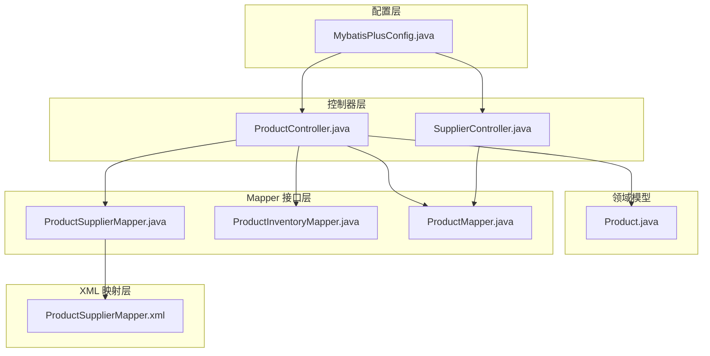
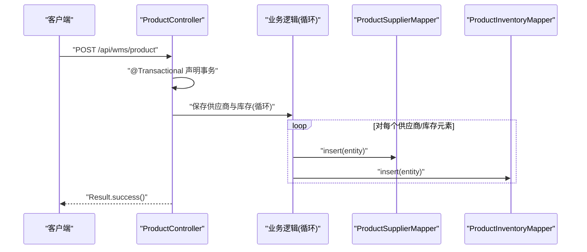
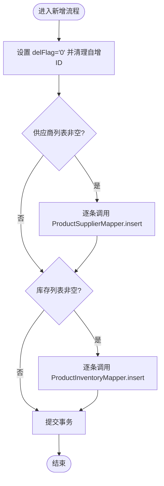
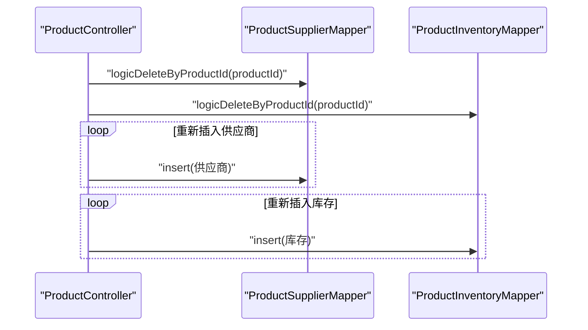
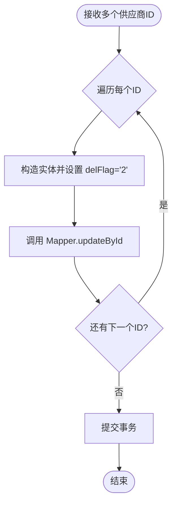
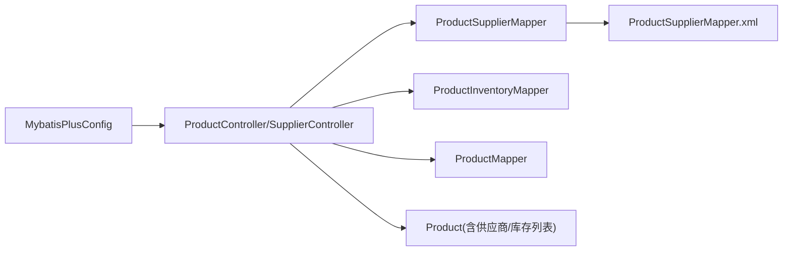

# 批量操作

<cite>
**本文引用的文件**
- [MybatisPlusConfig.java](file://task-manager-backend/src/main/java/com/taskmanager/config/MybatisPlusConfig.java)
- [ProductController.java](file://task-manager-backend/src/main/java/com/taskmanager/controller/ProductController.java)
- [SupplierController.java](file://task-manager-backend/src/main/java/com/taskmanager/controller/SupplierController.java)
- [ProductSupplierMapper.java](file://task-manager-backend/src/main/java/com/taskmanager/mapper/ProductSupplierMapper.java)
- [ProductSupplierMapper.xml](file://task-manager-backend/src/main/resources/mapper/ProductSupplierMapper.xml)
- [ProductInventoryMapper.java](file://task-manager-backend/src/main/java/com/taskmanager/mapper/ProductInventoryMapper.java)
- [ProductMapper.java](file://task-manager-backend/src/main/java/com/taskmanager/mapper/ProductMapper.java)
- [Product.java](file://task-manager-backend/src/main/java/com/taskmanager/domain/Product.java)
- [OrderController.java](file://task-manager-backend/src/main/java/com/taskmanager/controller/OrderController.java)
</cite>

## 目录
1. [引言](#引言)
2. [项目结构](#项目结构)
3. [核心组件](#核心组件)
4. [架构总览](#架构总览)
5. [详细组件分析](#详细组件分析)
6. [依赖分析](#依赖分析)
7. [性能考量](#性能考量)
8. [故障排查指南](#故障排查指南)
9. [结论](#结论)
10. [附录](#附录)

## 引言
本文件围绕 MyBatis-Plus 在本项目中的批量操作实践进行系统化技术说明，重点涵盖：
- 批量插入、批量更新、批量删除的实现策略与边界
- 事务管理与回滚机制，确保数据一致性
- 大数据量处理的最佳实践与性能优化建议
- 与单条操作的差异（SQL 生成与执行效率对比）
- 异常处理与错误恢复机制
- 代码示例路径与关键实现位置索引

需要特别说明的是：当前代码库中未发现显式的“批量执行器”（如批量插入/更新的批处理 API）直接调用；实际批量行为主要通过循环逐条执行与逻辑删除结合实现。本文将基于现有实现进行深入分析，并给出面向生产的大规模数据处理建议。

## 项目结构
后端采用 Spring Boot + MyBatis-Plus 架构，批量操作相关能力分布在以下层次：
- 配置层：MyBatis-Plus 插件（分页与安全拦截）
- 控制器层：业务入口，负责参数接收、事务声明与批量循环
- Mapper 层：基础 CRUD 与逻辑删除
- XML 层：自定义 SQL（逻辑删除等）

图表来源
- [MybatisPlusConfig.java:16-31](file://task-manager-backend/src/main/java/com/taskmanager/config/MybatisPlusConfig.java#L16-L31)
- [ProductController.java:82-130](file://task-manager-backend/src/main/java/com/taskmanager/controller/ProductController.java#L82-L130)
- [SupplierController.java:106-115](file://task-manager-backend/src/main/java/com/taskmanager/controller/SupplierController.java#L106-L115)
- [ProductSupplierMapper.java:14-25](file://task-manager-backend/src/main/java/com/taskmanager/mapper/ProductSupplierMapper.java#L14-L25)
- [ProductSupplierMapper.xml:25-38](file://task-manager-backend/src/main/resources/mapper/ProductSupplierMapper.xml#L25-L38)
- [ProductInventoryMapper.java:14-25](file://task-manager-backend/src/main/java/com/taskmanager/mapper/ProductInventoryMapper.java#L14-L25)
- [ProductMapper.java:15-39](file://task-manager-backend/src/main/java/com/taskmanager/mapper/ProductMapper.java#L15-L39)
- [Product.java:20-96](file://task-manager-backend/src/main/java/com/taskmanager/domain/Product.java#L20-L96)

章节来源
- [MybatisPlusConfig.java:16-31](file://task-manager-backend/src/main/java/com/taskmanager/config/MybatisPlusConfig.java#L16-L31)
- [ProductController.java:82-130](file://task-manager-backend/src/main/java/com/taskmanager/controller/ProductController.java#L82-L130)
- [SupplierController.java:106-115](file://task-manager-backend/src/main/java/com/taskmanager/controller/SupplierController.java#L106-L115)

## 核心组件
- MyBatis-Plus 配置：启用分页插件与全表更新/删除拦截，保障安全与性能
- ProductController：在新增/修改/删除商品时，对供应商与库存进行批量循环插入与逻辑删除
- SupplierController：在删除供应商时，对多个 ID 进行循环逻辑删除
- ProductSupplierMapper/ProductInventoryMapper：提供逻辑删除能力
- Product/ProductSupplier/ProductInventory：领域模型，承载批量操作所需的数据结构

章节来源
- [MybatisPlusConfig.java:22-30](file://task-manager-backend/src/main/java/com/taskmanager/config/MybatisPlusConfig.java#L22-L30)
- [ProductController.java:82-130](file://task-manager-backend/src/main/java/com/taskmanager/controller/ProductController.java#L82-L130)
- [SupplierController.java:106-115](file://task-manager-backend/src/main/java/com/taskmanager/controller/SupplierController.java#L106-L115)
- [ProductSupplierMapper.java:14-25](file://task-manager-backend/src/main/java/com/taskmanager/mapper/ProductSupplierMapper.java#L14-L25)
- [ProductInventoryMapper.java:14-25](file://task-manager-backend/src/main/java/com/taskmanager/mapper/ProductInventoryMapper.java#L14-L25)
- [Product.java:83-96](file://task-manager-backend/src/main/java/com/taskmanager/domain/Product.java#L83-L96)

## 架构总览
批量操作在本项目中遵循“控制器声明事务 + Mapper 循环执行”的模式。事务边界由控制器方法上的注解定义，确保批量操作在单一事务内完成，从而保证一致性。

图表来源
- [ProductController.java:82-94](file://task-manager-backend/src/main/java/com/taskmanager/controller/ProductController.java#L82-L94)
- [ProductController.java:212-235](file://task-manager-backend/src/main/java/com/taskmanager/controller/ProductController.java#L212-L235)

## 详细组件分析

### 批量插入策略
- 商品新增时，同时保存供应商与库存列表。实现方式为遍历 List，逐条调用 Mapper 的 insert 方法。
- 关键点：
  - 清理自增主键以确保生成新 ID
  - 设置删除标志为“存在”
  - 所有插入在同一个事务中执行，保证原子性

图表来源
- [ProductController.java:82-94](file://task-manager-backend/src/main/java/com/taskmanager/controller/ProductController.java#L82-L94)
- [ProductController.java:212-235](file://task-manager-backend/src/main/java/com/taskmanager/controller/ProductController.java#L212-L235)

章节来源
- [ProductController.java:82-94](file://task-manager-backend/src/main/java/com/taskmanager/controller/ProductController.java#L82-L94)
- [ProductController.java:212-235](file://task-manager-backend/src/main/java/com/taskmanager/controller/ProductController.java#L212-L235)

### 批量更新策略
- 商品修改时，先对旧的供应商与库存进行逻辑删除，再重新插入新的关联数据。该流程通过循环逐条执行逻辑删除与插入，形成“批量更新”的效果。
- 关键点：
  - 逻辑删除使用自定义 SQL 将 delFlag 更新为“删除”
  - 新增阶段同样逐条插入，保证事务一致性

图表来源
- [ProductController.java:100-111](file://task-manager-backend/src/main/java/com/taskmanager/controller/ProductController.java#L100-L111)
- [ProductSupplierMapper.xml:34-38](file://task-manager-backend/src/main/resources/mapper/ProductSupplierMapper.xml#L34-L38)
- [ProductSupplierMapper.java:21-24](file://task-manager-backend/src/main/java/com/taskmanager/mapper/ProductSupplierMapper.java#L21-L24)
- [ProductInventoryMapper.java:21-24](file://task-manager-backend/src/main/java/com/taskmanager/mapper/ProductInventoryMapper.java#L21-L24)

章节来源
- [ProductController.java:100-111](file://task-manager-backend/src/main/java/com/taskmanager/controller/ProductController.java#L100-L111)
- [ProductSupplierMapper.xml:34-38](file://task-manager-backend/src/main/resources/mapper/ProductSupplierMapper.xml#L34-L38)
- [ProductSupplierMapper.java:21-24](file://task-manager-backend/src/main/java/com/taskmanager/mapper/ProductSupplierMapper.java#L21-L24)
- [ProductInventoryMapper.java:21-24](file://task-manager-backend/src/main/java/com/taskmanager/mapper/ProductInventoryMapper.java#L21-L24)

### 批量删除策略
- 供应商删除接口支持多个 ID 的批量逻辑删除，通过循环对每个 ID 执行逻辑删除。
- 关键点：
  - 使用 @Transactional 确保批量删除在单个事务中完成
  - 逻辑删除通过更新 delFlag 实现

图表来源
- [SupplierController.java:106-115](file://task-manager-backend/src/main/java/com/taskmanager/controller/SupplierController.java#L106-L115)

章节来源
- [SupplierController.java:106-115](file://task-manager-backend/src/main/java/com/taskmanager/controller/SupplierController.java#L106-L115)

### 事务管理与回滚机制
- 商品新增/修改/删除均使用 @Transactional 声明式事务，确保批量操作在单个事务上下文中执行。
- 事务回滚：
  - 发生异常时自动回滚
  - 业务层抛出异常或底层数据库异常都会触发回滚
- 示例参考：
  - 商品新增事务：[ProductController.java:84-85](file://task-manager-backend/src/main/java/com/taskmanager/controller/ProductController.java#L84-L85)
  - 商品修改事务：[ProductController.java:101-102](file://task-manager-backend/src/main/java/com/taskmanager/controller/ProductController.java#L101-L102)
  - 商品删除事务：[ProductController.java:118-119](file://task-manager-backend/src/main/java/com/taskmanager/controller/ProductController.java#L118-L119)
  - 供应商批量删除事务：[SupplierController.java:106-106](file://task-manager-backend/src/main/java/com/taskmanager/controller/SupplierController.java#L106-L106)
  - 订单模块事务示例：[OrderController.java:59](file://task-manager-backend/src/main/java/com/taskmanager/controller/OrderController.java#L59)、[OrderController.java:192](file://task-manager-backend/src/main/java/com/taskmanager/controller/OrderController.java#L192)

章节来源
- [ProductController.java:84-85](file://task-manager-backend/src/main/java/com/taskmanager/controller/ProductController.java#L84-L85)
- [ProductController.java:101-102](file://task-manager-backend/src/main/java/com/taskmanager/controller/ProductController.java#L101-L102)
- [ProductController.java:118-119](file://task-manager-backend/src/main/java/com/taskmanager/controller/ProductController.java#L118-L119)
- [SupplierController.java:106-106](file://task-manager-backend/src/main/java/com/taskmanager/controller/SupplierController.java#L106-L106)
- [OrderController.java:59](file://task-manager-backend/src/main/java/com/taskmanager/controller/OrderController.java#L59)
- [OrderController.java:192](file://task-manager-backend/src/main/java/com/taskmanager/controller/OrderController.java#L192)

### 与单条操作的区别
- 批量操作通常指一次请求处理多个实体，本项目通过“循环 + 事务”实现批量效果，而非一次性批量执行器。
- SQL 生成与执行效率：
  - 批量循环：每条记录生成一次 SQL，适合中小规模；大规模时会产生较多网络往返与解析开销
  - 批量执行器：一次性生成批量 SQL，减少往返次数，提升吞吐
- 当前实现属于“循环批量”，适用于中低规模；大规模场景建议引入批量执行器或分批提交策略

章节来源
- [ProductController.java:212-235](file://task-manager-backend/src/main/java/com/taskmanager/controller/ProductController.java#L212-L235)
- [SupplierController.java:106-115](file://task-manager-backend/src/main/java/com/taskmanager/controller/SupplierController.java#L106-L115)

### 异常处理与错误恢复
- 控制器层对异常进行统一处理，结合事务回滚保证一致性
- 供应商导入示例展示了逐条插入时的异常捕获与错误累积，便于定位失败行并提示用户
- 建议：
  - 大批量导入时采用分批提交与重试策略
  - 对关键异常进行分类处理（如唯一约束冲突、外键约束等）
  - 记录操作日志以便审计与追踪

章节来源
- [SupplierController.java:154-184](file://task-manager-backend/src/main/java/com/taskmanager/controller/SupplierController.java#L154-L184)

## 依赖分析
- MyBatis-Plus 配置为所有批量操作提供基础能力保障（分页与安全拦截）
- 控制器依赖 Mapper 接口与 XML 映射，实现逻辑删除与批量循环
- 领域模型 Product 携带供应商与库存列表，支撑批量插入场景

图表来源
- [MybatisPlusConfig.java:22-30](file://task-manager-backend/src/main/java/com/taskmanager/config/MybatisPlusConfig.java#L22-L30)
- [ProductController.java:82-130](file://task-manager-backend/src/main/java/com/taskmanager/controller/ProductController.java#L82-L130)
- [SupplierController.java:106-115](file://task-manager-backend/src/main/java/com/taskmanager/controller/SupplierController.java#L106-L115)
- [ProductSupplierMapper.java:14-25](file://task-manager-backend/src/main/java/com/taskmanager/mapper/ProductSupplierMapper.java#L14-L25)
- [ProductSupplierMapper.xml:25-38](file://task-manager-backend/src/main/resources/mapper/ProductSupplierMapper.xml#L25-L38)
- [ProductInventoryMapper.java:14-25](file://task-manager-backend/src/main/java/com/taskmanager/mapper/ProductInventoryMapper.java#L14-L25)
- [ProductMapper.java:15-39](file://task-manager-backend/src/main/java/com/taskmanager/mapper/ProductMapper.java#L15-L39)
- [Product.java:83-96](file://task-manager-backend/src/main/java/com/taskmanager/domain/Product.java#L83-L96)

## 性能考量
- 当前实现为“循环 + 事务”，适合中小规模数据；大规模场景建议：
  - 引入批量执行器（如 JDBC 批处理或 MyBatis-Plus 批量 API）以减少往返
  - 分批提交：设定批次大小，避免单次事务过大导致锁竞争与内存压力
  - 合理设置数据库连接池与超时参数
  - 对频繁更新的表进行索引优化与分区策略
- 事务粒度：
  - 将批量操作置于单个事务中，确保一致性
  - 若单次批量过大，考虑拆分为多次小批量事务，降低锁持有时间

## 故障排查指南
- 批量导入失败：
  - 检查逐条插入异常捕获与错误消息拼接逻辑
  - 确认 Excel 数据格式与字段映射是否正确
  - 参考：[SupplierController.java:154-184](file://task-manager-backend/src/main/java/com/taskmanager/controller/SupplierController.java#L154-L184)
- 逻辑删除未生效：
  - 确认 delFlag 字段与 SQL 条件一致
  - 参考：[ProductSupplierMapper.xml:34-38](file://task-manager-backend/src/main/resources/mapper/ProductSupplierMapper.xml#L34-L38)
- 事务未回滚：
  - 确认方法可见性与异常类型是否触发回滚
  - 参考：[OrderController.java:59](file://task-manager-backend/src/main/java/com/taskmanager/controller/OrderController.java#L59)、[OrderController.java:192](file://task-manager-backend/src/main/java/com/taskmanager/controller/OrderController.java#L192)

章节来源
- [SupplierController.java:154-184](file://task-manager-backend/src/main/java/com/taskmanager/controller/SupplierController.java#L154-L184)
- [ProductSupplierMapper.xml:34-38](file://task-manager-backend/src/main/resources/mapper/ProductSupplierMapper.xml#L34-L38)
- [OrderController.java:59](file://task-manager-backend/src/main/java/com/taskmanager/controller/OrderController.java#L59)
- [OrderController.java:192](file://task-manager-backend/src/main/java/com/taskmanager/controller/OrderController.java#L192)

## 结论
- 本项目通过“循环 + 事务”的方式实现了批量插入、批量更新与批量删除，满足中小规模数据处理需求
- 事务管理与逻辑删除共同保障了数据一致性与可追溯性
- 面向更大规模的数据处理，建议引入批量执行器与分批提交策略，以获得更优的吞吐与稳定性

## 附录
- 代码示例路径索引：
  - 商品新增（含供应商/库存批量插入）：[ProductController.java:82-94](file://task-manager-backend/src/main/java/com/taskmanager/controller/ProductController.java#L82-L94)
  - 商品修改（逻辑删除 + 重新批量插入）：[ProductController.java:100-111](file://task-manager-backend/src/main/java/com/taskmanager/controller/ProductController.java#L100-L111)
  - 商品删除（循环逻辑删除）：[ProductController.java:118-130](file://task-manager-backend/src/main/java/com/taskmanager/controller/ProductController.java#L118-L130)
  - 供应商批量删除：[SupplierController.java:106-115](file://task-manager-backend/src/main/java/com/taskmanager/controller/SupplierController.java#L106-L115)
  - 供应商导入（逐条插入与异常处理）：[SupplierController.java:154-184](file://task-manager-backend/src/main/java/com/taskmanager/controller/SupplierController.java#L154-L184)
  - 逻辑删除 SQL（供应商）：[ProductSupplierMapper.xml:34-38](file://task-manager-backend/src/main/resources/mapper/ProductSupplierMapper.xml#L34-L38)
  - 逻辑删除 SQL（库存）：[ProductSupplierMapper.java:21-24](file://task-manager-backend/src/main/java/com/taskmanager/mapper/ProductSupplierMapper.java#L21-L24)、[ProductInventoryMapper.java:21-24](file://task-manager-backend/src/main/java/com/taskmanager/mapper/ProductInventoryMapper.java#L21-L24)
  - 领域模型（供应商/库存列表）：[Product.java:83-96](file://task-manager-backend/src/main/java/com/taskmanager/domain/Product.java#L83-L96)