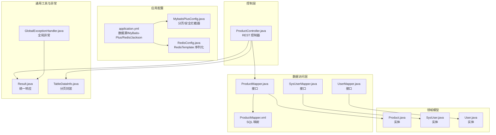
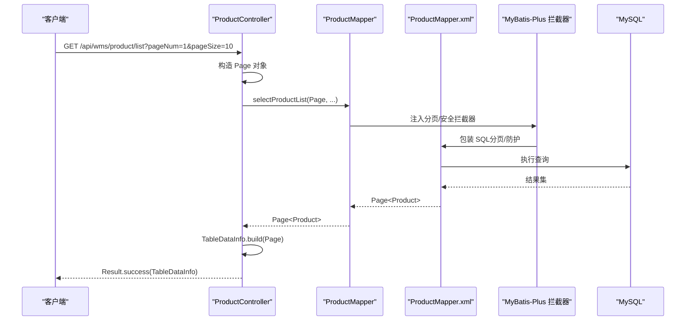
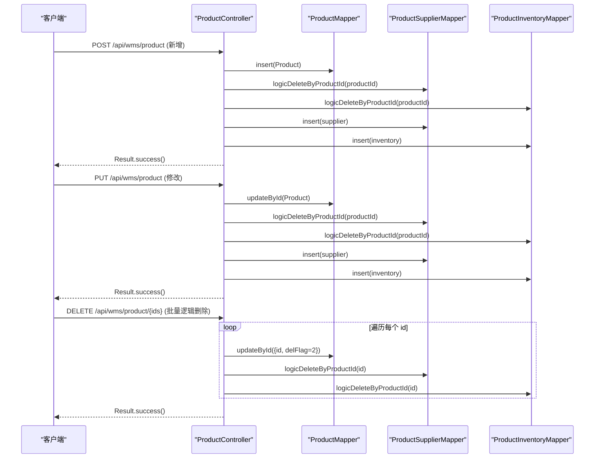
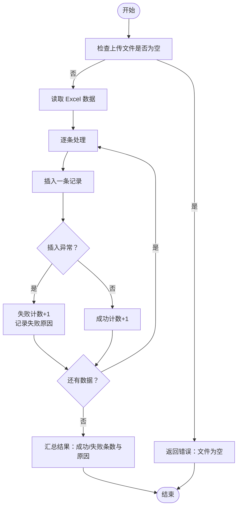
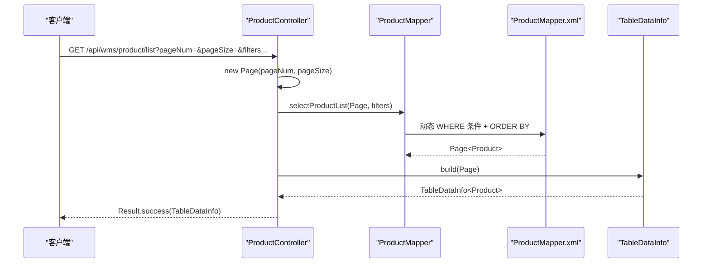
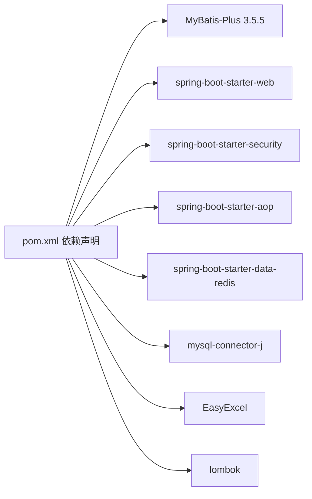

# 数据库操作

<cite>
**本文引用的文件**
- [MybatisPlusConfig.java](file://task-manager-backend/src/main/java/com/taskmanager/config/MybatisPlusConfig.java)
- [application.yml](file://task-manager-backend/src/main/resources/application.yml)
- [pom.xml](file://task-manager-backend/pom.xml)
- [Result.java](file://task-manager-backend/src/main/java/com/taskmanager/common/Result.java)
- [TableDataInfo.java](file://task-manager-backend/src/main/java/com/taskmanager/common/utils/TableDataInfo.java)
- [GlobalExceptionHandler.java](file://task-manager-backend/src/main/java/com/taskmanager/common/exception/GlobalExceptionHandler.java)
- [Product.java](file://task-manager-backend/src/main/java/com/taskmanager/domain/Product.java)
- [SysUser.java](file://task-manager-backend/src/main/java/com/taskmanager/domain/SysUser.java)
- [User.java](file://task-manager-backend/src/main/java/com/taskmanager/entity/User.java)
- [ProductMapper.java](file://task-manager-backend/src/main/java/com/taskmanager/mapper/ProductMapper.java)
- [SysUserMapper.java](file://task-manager-backend/src/main/java/com/taskmanager/mapper/SysUserMapper.java)
- [UserMapper.java](file://task-manager-backend/src/main/java/com/taskmanager/mapper/UserMapper.java)
- [ProductMapper.xml](file://task-manager-backend/src/main/resources/mapper/ProductMapper.xml)
- [ProductController.java](file://task-manager-backend/src/main/java/com/taskmanager/controller/ProductController.java)
- [RedisConfig.java](file://task-manager-backend/src/main/java/com/taskmanager/config/RedisConfig.java)
</cite>

## 目录
1. [引言](#引言)
2. [项目结构](#项目结构)
3. [核心组件](#核心组件)
4. [架构总览](#架构总览)
5. [详细组件分析](#详细组件分析)
6. [依赖分析](#依赖分析)
7. [性能考量](#性能考量)
8. [故障排查指南](#故障排查指南)
9. [结论](#结论)
10. [附录](#附录)

## 引言
本文件面向数据库访问层（DAO/Service/Controller）的技术文档，围绕以下主题展开：基础 CRUD 操作的调用与参数传递、批量操作策略（批量插入/更新/删除）、分页查询机制（Page 对象、分页参数与结果封装）、条件构造器（QueryWrapper/UpdateWrapper 的使用建议与复杂条件构建）、事务管理与传播行为、异常处理与错误恢复、以及缓存策略与失效处理。本文以实际代码为依据，结合 MyBatis-Plus 配置与 Spring Boot 集成，帮助读者快速理解并正确使用该系统的数据访问能力。

## 项目结构
后端采用 Spring Boot + MyBatis-Plus 架构，数据库连接池为 HikariCP，Redis 用于缓存，Knife4j 提供 OpenAPI 文档。数据访问层主要由 Mapper 接口与 XML 映射文件组成，并通过 Controller 暴露 REST API。

**图表来源**
- [application.yml:1-79](file://task-manager-backend/src/main/resources/application.yml#L1-L79)
- [MybatisPlusConfig.java:16-31](file://task-manager-backend/src/main/java/com/taskmanager/config/MybatisPlusConfig.java#L16-L31)
- [RedisConfig.java:15-32](file://task-manager-backend/src/main/java/com/taskmanager/config/RedisConfig.java#L15-L32)
- [ProductMapper.java:15-39](file://task-manager-backend/src/main/java/com/taskmanager/mapper/ProductMapper.java#L15-L39)
- [ProductMapper.xml:4-54](file://task-manager-backend/src/main/resources/mapper/ProductMapper.xml#L4-L54)
- [SysUserMapper.java:13-38](file://task-manager-backend/src/main/java/com/taskmanager/mapper/SysUserMapper.java#L13-L38)
- [UserMapper.java:11-21](file://task-manager-backend/src/main/java/com/taskmanager/mapper/UserMapper.java#L11-L21)
- [Product.java:20-96](file://task-manager-backend/src/main/java/com/taskmanager/domain/Product.java#L20-L96)
- [SysUser.java:16-79](file://task-manager-backend/src/main/java/com/taskmanager/domain/SysUser.java#L16-L79)
- [User.java:11-30](file://task-manager-backend/src/main/java/com/taskmanager/entity/User.java#L11-L30)
- [ProductController.java:34-236](file://task-manager-backend/src/main/java/com/taskmanager/controller/ProductController.java#L34-L236)
- [Result.java:12-75](file://task-manager-backend/src/main/java/com/taskmanager/common/Result.java#L12-L75)
- [TableDataInfo.java:14-59](file://task-manager-backend/src/main/java/com/taskmanager/common/utils/TableDataInfo.java#L14-L59)
- [GlobalExceptionHandler.java:23-108](file://task-manager-backend/src/main/java/com/taskmanager/common/exception/GlobalExceptionHandler.java#L23-L108)

**章节来源**
- [application.yml:1-79](file://task-manager-backend/src/main/resources/application.yml#L1-L79)
- [MybatisPlusConfig.java:16-31](file://task-manager-backend/src/main/java/com/taskmanager/config/MybatisPlusConfig.java#L16-L31)
- [RedisConfig.java:15-32](file://task-manager-backend/src/main/java/com/taskmanager/config/RedisConfig.java#L15-L32)
- [ProductController.java:34-236](file://task-manager-backend/src/main/java/com/taskmanager/controller/ProductController.java#L34-L236)

## 核心组件
- MyBatis-Plus 配置：启用分页插件与全表更新/删除防护，确保分页与安全。
- 数据源与连接池：HikariCP，支持最小空闲、最大连接、空闲超时等参数。
- Redis 缓存：统一 Key/Value 序列化策略，便于对象缓存。
- 统一响应与分页封装：Result 统一返回结构；TableDataInfo 封装分页数据。
- 全局异常处理：集中处理业务、认证、权限、参数校验等异常，返回标准 Result。

**章节来源**
- [MybatisPlusConfig.java:16-31](file://task-manager-backend/src/main/java/com/taskmanager/config/MybatisPlusConfig.java#L16-L31)
- [application.yml:5-44](file://task-manager-backend/src/main/resources/application.yml#L5-L44)
- [RedisConfig.java:18-31](file://task-manager-backend/src/main/java/com/taskmanager/config/RedisConfig.java#L18-L31)
- [Result.java:12-75](file://task-manager-backend/src/main/java/com/taskmanager/common/Result.java#L12-L75)
- [TableDataInfo.java:14-59](file://task-manager-backend/src/main/java/com/taskmanager/common/utils/TableDataInfo.java#L14-L59)
- [GlobalExceptionHandler.java:23-108](file://task-manager-backend/src/main/java/com/taskmanager/common/exception/GlobalExceptionHandler.java#L23-L108)

## 架构总览
数据访问层遵循“Controller → Service → Mapper/XML”的分层设计。Controller 负责参数接收与结果封装；Mapper 定义数据访问接口；XML 中编写 SQL 并通过 MyBatis-Plus 插件自动注入分页与安全能力。

**图表来源**
- [ProductController.java:50-63](file://task-manager-backend/src/main/java/com/taskmanager/controller/ProductController.java#L50-L63)
- [ProductMapper.java:28-33](file://task-manager-backend/src/main/java/com/taskmanager/mapper/ProductMapper.java#L28-L33)
- [ProductMapper.xml:26-46](file://task-manager-backend/src/main/resources/mapper/ProductMapper.xml#L26-L46)
- [MybatisPlusConfig.java:22-30](file://task-manager-backend/src/main/java/com/taskmanager/config/MybatisPlusConfig.java#L22-L30)

## 详细组件分析

### 基础 CRUD 实现与调用
- 查询单个：通过 ProductController 的路径参数获取商品详情，Mapper 调用 XML 中的按 ID 查询语句，同时补充供应商与库存列表。
- 新增：ProductController 使用 @PostMapping，开启事务，先插入主表，再分别保存供应商与库存关联。
- 修改：@PutMapping，开启事务，先更新主表，再对旧关联执行逻辑删除，最后写入新关联。
- 删除：@DeleteMapping，批量删除时逐条设置 delFlag 为删除值并清理关联，实现逻辑删除。

**图表来源**
- [ProductController.java:82-130](file://task-manager-backend/src/main/java/com/taskmanager/controller/ProductController.java#L82-L130)
- [ProductController.java:208-235](file://task-manager-backend/src/main/java/com/taskmanager/controller/ProductController.java#L208-L235)

**章节来源**
- [ProductController.java:68-130](file://task-manager-backend/src/main/java/com/taskmanager/controller/ProductController.java#L68-L130)
- [ProductController.java:208-235](file://task-manager-backend/src/main/java/com/taskmanager/controller/ProductController.java#L208-L235)

### 批量操作策略
- 批量插入：导入 Excel 时逐条插入，遇到异常累计失败条数与原因，最终返回汇总结果。适合离线批量入库场景。
- 批量更新/删除：在 Controller 中循环遍历 ID 列表，逐条更新 delFlag 或清理关联，保证事务一致性。
- 性能考虑：批量插入建议使用批处理或临时表导入；批量更新/删除建议控制单次批量大小，避免长事务锁表。

**图表来源**
- [ProductController.java:158-190](file://task-manager-backend/src/main/java/com/taskmanager/controller/ProductController.java#L158-L190)

**章节来源**
- [ProductController.java:158-190](file://task-manager-backend/src/main/java/com/taskmanager/controller/ProductController.java#L158-L190)

### 分页查询机制
- Page 对象：Controller 接收 pageNum/pageSize，构造 Page 并传入 Mapper。
- XML 条件拼接：根据传入参数动态拼接 WHERE 条件（如名称/编码模糊匹配、状态精确匹配、价格区间）。
- 结果封装：Mapper 返回 Page<Product>，Controller 调用 TableDataInfo.build 将总数、记录、页码、页大小、总页数封装为统一结构。

**图表来源**
- [ProductController.java:48-63](file://task-manager-backend/src/main/java/com/taskmanager/controller/ProductController.java#L48-L63)
- [ProductMapper.java:28-33](file://task-manager-backend/src/main/java/com/taskmanager/mapper/ProductMapper.java#L28-L33)
- [ProductMapper.xml:26-46](file://task-manager-backend/src/main/resources/mapper/ProductMapper.xml#L26-L46)
- [TableDataInfo.java:37-45](file://task-manager-backend/src/main/java/com/taskmanager/common/utils/TableDataInfo.java#L37-L45)

**章节来源**
- [ProductController.java:48-63](file://task-manager-backend/src/main/java/com/taskmanager/controller/ProductController.java#L48-L63)
- [ProductMapper.xml:26-46](file://task-manager-backend/src/main/resources/mapper/ProductMapper.xml#L26-L46)
- [TableDataInfo.java:37-45](file://task-manager-backend/src/main/java/com/taskmanager/common/utils/TableDataInfo.java#L37-L45)

### 条件构造器（QueryWrapper/UpdateWrapper）使用建议
- 在 MyBatis-Plus 中，推荐使用 QueryWrapper/UpdateWrapper 构建复杂查询与更新条件，支持链式调用、嵌套条件与函数表达式。
- 适用场景：多字段组合查询、范围查询、模糊匹配、排序与分组、联表条件等。
- 注意事项：避免全表扫描，合理使用索引字段；注意 SQL 注入防护，尽量使用参数化查询。

（本节为概念性指导，不直接分析具体文件）

### 事务管理与传播行为
- 事务注解：Controller 方法标注 @Transactional，确保新增/修改/删除及其关联写入在同一个事务中。
- 传播行为：默认使用 REQUIRED，若需要跨事务边界的行为可调整（如 REQUIRES_NEW、NESTED），但需谨慎评估隔离级别与锁竞争。
- 事务边界：建议将业务逻辑集中在 Service 层，Controller 只负责参数与结果封装，便于统一事务控制。

**章节来源**
- [ProductController.java:84-130](file://task-manager-backend/src/main/java/com/taskmanager/controller/ProductController.java#L84-L130)

### 数据访问层异常处理与错误恢复
- 统一响应：Result 提供 success/error 静态方法，Controller 返回标准结构。
- 全局异常：GlobalExceptionHandler 捕获业务异常、认证/权限异常、参数校验异常等，统一返回 Result。
- 错误恢复：对于导入失败的 Excel 行，记录失败原因并继续处理剩余数据，最终汇总返回。

**章节来源**
- [Result.java:12-75](file://task-manager-backend/src/main/java/com/taskmanager/common/Result.java#L12-L75)
- [GlobalExceptionHandler.java:23-108](file://task-manager-backend/src/main/java/com/taskmanager/common/exception/GlobalExceptionHandler.java#L23-L108)
- [ProductController.java:163-190](file://task-manager-backend/src/main/java/com/taskmanager/controller/ProductController.java#L163-L190)

### 缓存策略与缓存失效
- Redis 配置：RedisConfig 统一 Key/HashKey 字符串序列化，Value 使用 JSON 序列化，适配复杂对象缓存。
- 使用建议：热点查询（如字典、配置、商品基础信息）可缓存；写操作后主动失效或延时双删，避免脏读。
- 与分页结合：分页结果可缓存列表，但需为每页维护独立 Key，并在数据变更时批量失效。

**章节来源**
- [RedisConfig.java:18-31](file://task-manager-backend/src/main/java/com/taskmanager/config/RedisConfig.java#L18-L31)

## 依赖分析
- MyBatis-Plus 版本：3.5.5，提供分页、逻辑删除、安全拦截器等能力。
- 数据源：MySQL Connector/J，HikariCP 连接池参数在 application.yml 中配置。
- Redis：Spring Boot Starter Data Redis，配合 RedisConfig。
- 依赖范围：starter-web、security、aop、knife4j、hutool、commons-lang3、easy-captcha、easyexcel、lombok 等。

**图表来源**
- [pom.xml:32-144](file://task-manager-backend/pom.xml#L32-L144)

**章节来源**
- [pom.xml:20-30](file://task-manager-backend/pom.xml#L20-L30)
- [pom.xml:32-144](file://task-manager-backend/pom.xml#L32-L144)

## 性能考量
- 分页优化：仅查询必要字段，避免 SELECT *；WHERE 条件尽量命中索引；合理设置 pageSize，避免超大页码。
- 批量导入：分批提交，控制内存占用；对异常行进行局部回滚与跳过，提升整体成功率。
- 连接池：根据并发与慢查询情况调整最小空闲、最大连接、空闲超时等参数。
- 缓存：热点数据加缓存，写后失效；避免缓存穿透与雪崩，必要时加入互斥锁与过期时间抖动。

（本节提供通用建议，不直接分析具体文件）

## 故障排查指南
- 分页不生效：确认 MybatisPlusInterceptor 是否注册了 PaginationInnerInterceptor；检查 Page 对象是否正确传入。
- 全表更新/删除被拦截：BlockAttackInnerInterceptor 防护生效，需显式添加条件或使用逻辑删除。
- 参数校验失败：查看 GlobalExceptionHandler 对 MethodArgumentNotValidException 的处理，定位字段错误。
- 认证/权限异常：401/403 由全局异常处理器统一返回，检查 Token 与权限注解。
- 导入失败：关注失败计数与失败原因汇总，逐行定位问题数据。

**章节来源**
- [MybatisPlusConfig.java:22-30](file://task-manager-backend/src/main/java/com/taskmanager/config/MybatisPlusConfig.java#L22-L30)
- [GlobalExceptionHandler.java:76-98](file://task-manager-backend/src/main/java/com/taskmanager/common/exception/GlobalExceptionHandler.java#L76-L98)
- [ProductController.java:163-190](file://task-manager-backend/src/main/java/com/taskmanager/controller/ProductController.java#L163-L190)

## 结论
该系统基于 MyBatis-Plus 提供了完善的分页、安全拦截与逻辑删除能力，结合统一响应与全局异常处理，使数据访问层具备良好的可维护性与稳定性。通过合理的事务边界、缓存策略与批量处理，可在保证一致性的同时提升性能。建议在复杂查询中善用 QueryWrapper/UpdateWrapper，并持续优化索引与 SQL。

## 附录
- 关键实体与映射
  - Product 实体对应 wms_product 表，包含基础字段与非持久化扩展字段。
  - SysUser 实体对应 sys_user 表，用于系统用户管理。
  - User 实体对应 user 表，用于简单用户模型。

**章节来源**
- [Product.java:20-96](file://task-manager-backend/src/main/java/com/taskmanager/domain/Product.java#L20-L96)
- [SysUser.java:16-79](file://task-manager-backend/src/main/java/com/taskmanager/domain/SysUser.java#L16-L79)
- [User.java:11-30](file://task-manager-backend/src/main/java/com/taskmanager/entity/User.java#L11-L30)