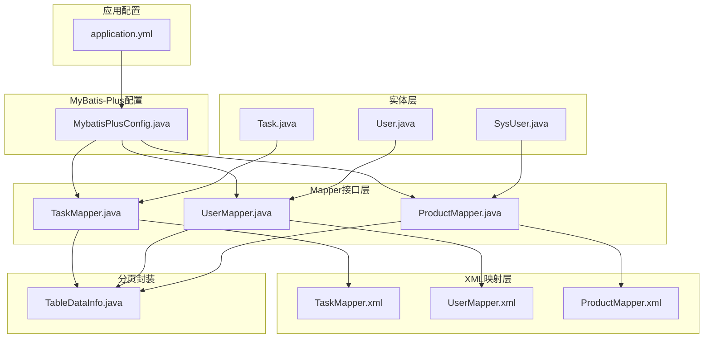
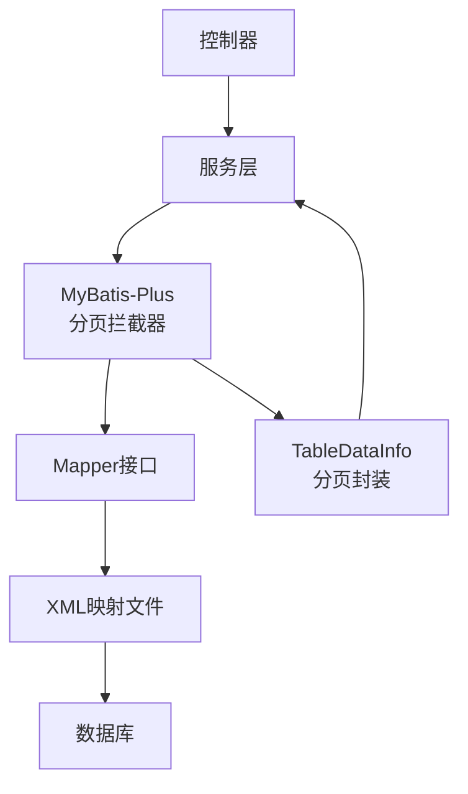
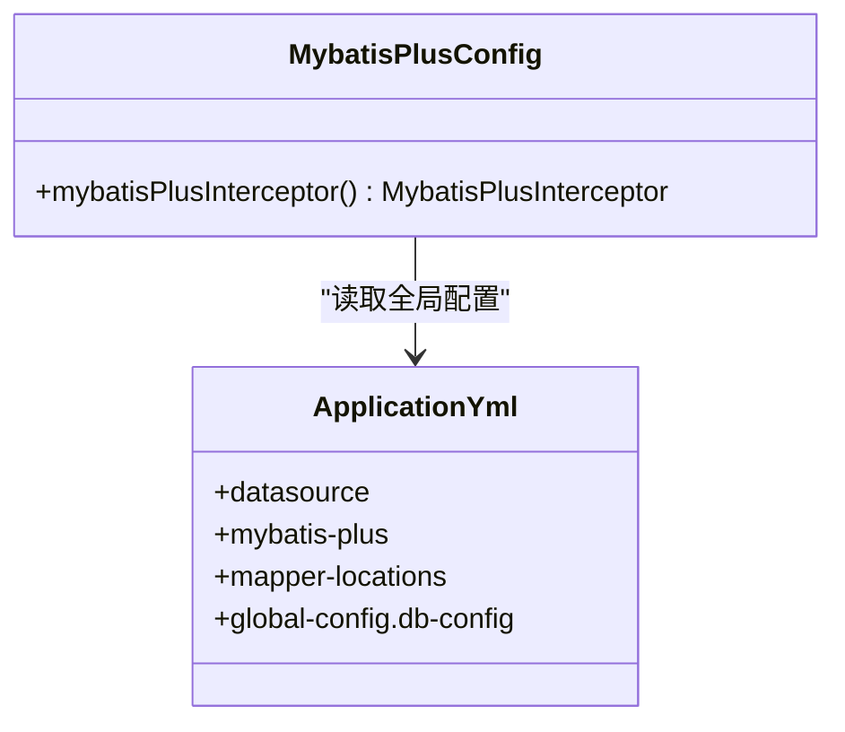
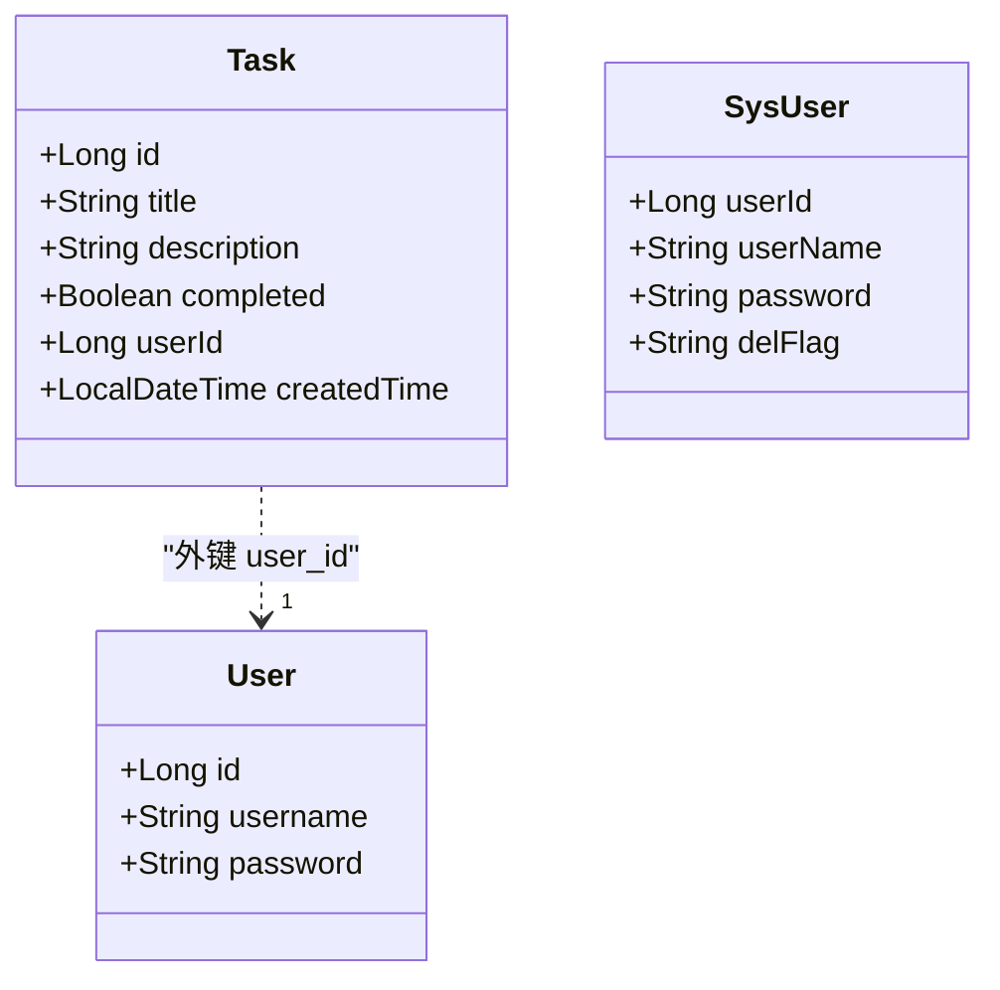
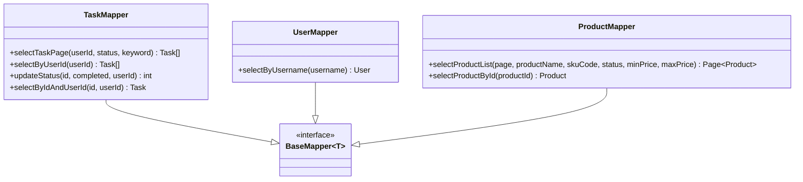
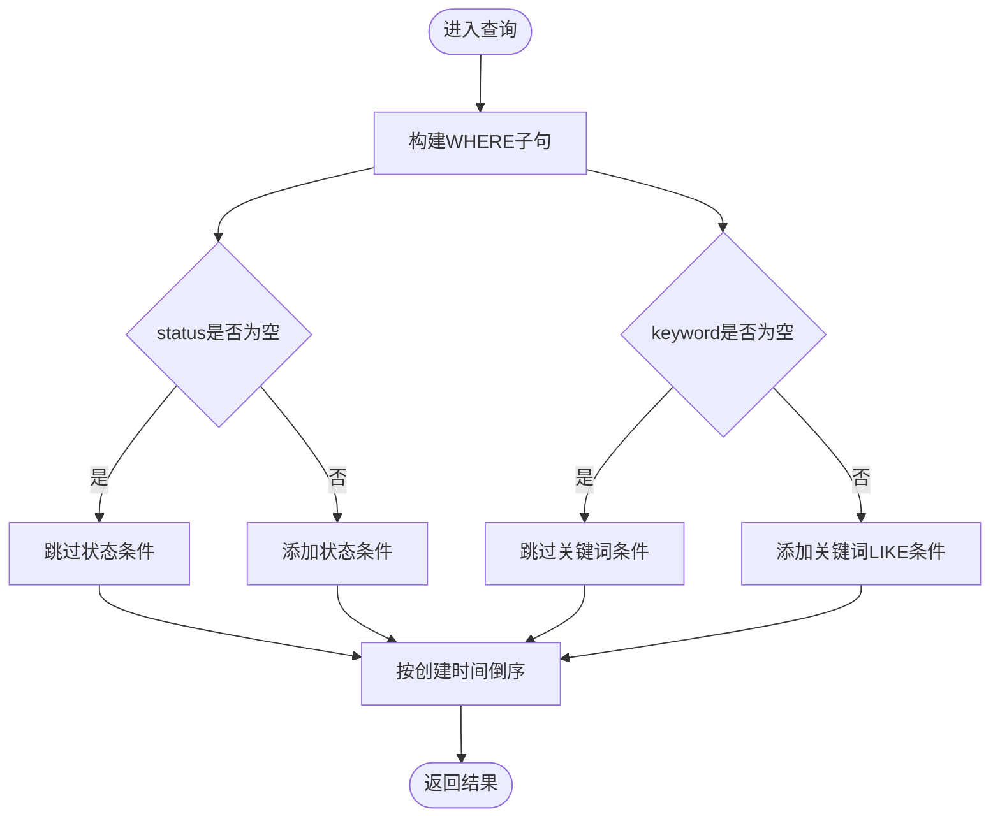
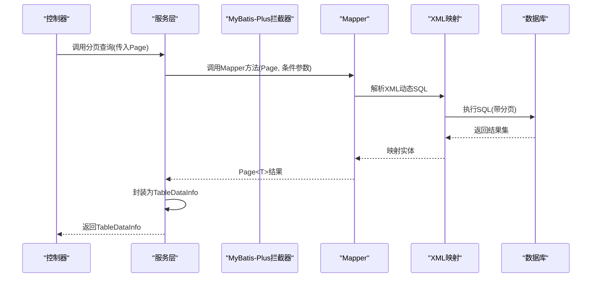
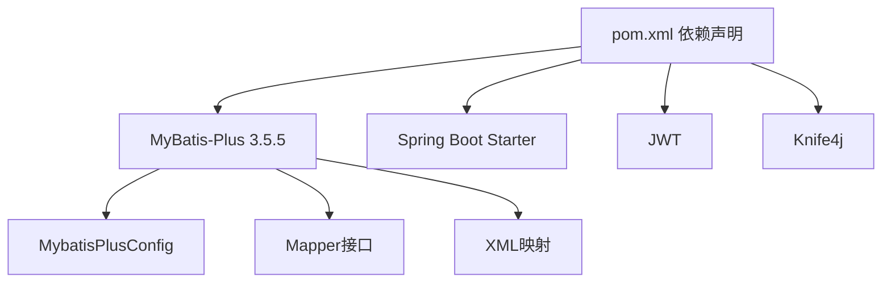

# 数据访问层

<cite>
**本文引用的文件**
- [MybatisPlusConfig.java](file://task-manager-backend/src/main/java/com/taskmanager/config/MybatisPlusConfig.java)
- [application.yml](file://task-manager-backend/src/main/resources/application.yml)
- [Task.java](file://task-manager-backend/src/main/java/com/taskmanager/entity/Task.java)
- [User.java](file://task-manager-backend/src/main/java/com/taskmanager/entity/User.java)
- [SysUser.java](file://task-manager-backend/src/main/java/com/taskmanager/domain/SysUser.java)
- [TaskMapper.java](file://task-manager-backend/src/main/java/com/taskmanager/mapper/TaskMapper.java)
- [UserMapper.java](file://task-manager-backend/src/main/java/com/taskmanager/mapper/UserMapper.java)
- [ProductMapper.java](file://task-manager-backend/src/main/java/com/taskmanager/mapper/ProductMapper.java)
- [TaskMapper.xml](file://task-manager-backend/src/main/resources/mapper/TaskMapper.xml)
- [UserMapper.xml](file://task-manager-backend/src/main/resources/mapper/UserMapper.xml)
- [ProductMapper.xml](file://task-manager-backend/src/main/resources/mapper/ProductMapper.xml)
- [TableDataInfo.java](file://task-manager-backend/src/main/java/com/taskmanager/common/utils/TableDataInfo.java)
- [BaseControllerTest.java](file://task-manager-backend/src/test/java/com/taskmanager/controller/BaseControllerTest.java)
- [pom.xml](file://task-manager-backend/pom.xml)
</cite>

## 目录
1. [简介](#简介)
2. [项目结构](#项目结构)
3. [核心组件](#核心组件)
4. [架构总览](#架构总览)
5. [详细组件分析](#详细组件分析)
6. [依赖分析](#依赖分析)
7. [性能考虑](#性能考虑)
8. [故障排查指南](#故障排查指南)
9. [结论](#结论)
10. [附录](#附录)

## 简介
本文件面向CodeBuddy任务管理系统的数据访问层，系统性阐述MyBatis-Plus在本项目中的配置与使用，涵盖实体类映射、自动ID生成、逻辑删除字段配置；Mapper接口的设计原则与命名规范；XML映射文件的编写规范（SQL优化、动态SQL、结果集映射）；实体类设计模式（数据库实体与业务实体区分与转换）；性能优化策略（索引设计、查询优化、批量操作）；分页查询实现机制与分页参数传递方式；以及数据访问层的单元测试与Mock数据准备方法。

## 项目结构
数据访问层主要由以下部分组成：
- 实体类：位于entity与domain包，分别对应业务域模型与系统域模型
- Mapper接口：位于mapper包，遵循“实体名 + Mapper”的命名规范，并继承BaseMapper以获得通用CRUD能力
- XML映射文件：位于resources/mapper目录，按Mapper接口命名
- MyBatis-Plus配置：位于config包，注册分页与安全拦截器
- 应用配置：位于resources/application.yml，集中配置数据源、连接池、MyBatis-Plus全局配置（含逻辑删除）
- 分页封装：common/utils下的TableDataInfo用于统一返回分页数据结构

图表来源
- [MybatisPlusConfig.java:16-31](file://task-manager-backend/src/main/java/com/taskmanager/config/MybatisPlusConfig.java#L16-L31)
- [application.yml:33-44](file://task-manager-backend/src/main/resources/application.yml#L33-L44)
- [Task.java:14-49](file://task-manager-backend/src/main/java/com/taskmanager/entity/Task.java#L14-L49)
- [User.java:12-30](file://task-manager-backend/src/main/java/com/taskmanager/entity/User.java#L12-L30)
- [SysUser.java:17-79](file://task-manager-backend/src/main/java/com/taskmanager/domain/SysUser.java#L17-L79)
- [TaskMapper.java:13-56](file://task-manager-backend/src/main/java/com/taskmanager/mapper/TaskMapper.java#L13-L56)
- [UserMapper.java:11-21](file://task-manager-backend/src/main/java/com/taskmanager/mapper/UserMapper.java#L11-L21)
- [ProductMapper.java:15-39](file://task-manager-backend/src/main/java/com/taskmanager/mapper/ProductMapper.java#L15-L39)
- [TaskMapper.xml:3-42](file://task-manager-backend/src/main/resources/mapper/TaskMapper.xml#L3-L42)
- [UserMapper.xml:3-12](file://task-manager-backend/src/main/resources/mapper/UserMapper.xml#L3-L12)
- [ProductMapper.xml:4-54](file://task-manager-backend/src/main/resources/mapper/ProductMapper.xml#L4-L54)
- [TableDataInfo.java:14-59](file://task-manager-backend/src/main/java/com/taskmanager/common/utils/TableDataInfo.java#L14-L59)

章节来源
- [MybatisPlusConfig.java:16-31](file://task-manager-backend/src/main/java/com/taskmanager/config/MybatisPlusConfig.java#L16-L31)
- [application.yml:33-44](file://task-manager-backend/src/main/resources/application.yml#L33-L44)
- [Task.java:14-49](file://task-manager-backend/src/main/java/com/taskmanager/entity/Task.java#L14-L49)
- [User.java:12-30](file://task-manager-backend/src/main/java/com/taskmanager/entity/User.java#L12-L30)
- [SysUser.java:17-79](file://task-manager-backend/src/main/java/com/taskmanager/domain/SysUser.java#L17-L79)
- [TaskMapper.java:13-56](file://task-manager-backend/src/main/java/com/taskmanager/mapper/TaskMapper.java#L13-L56)
- [UserMapper.java:11-21](file://task-manager-backend/src/main/java/com/taskmanager/mapper/UserMapper.java#L11-L21)
- [ProductMapper.java:15-39](file://task-manager-backend/src/main/java/com/taskmanager/mapper/ProductMapper.java#L15-L39)
- [TaskMapper.xml:3-42](file://task-manager-backend/src/main/resources/mapper/TaskMapper.xml#L3-L42)
- [UserMapper.xml:3-12](file://task-manager-backend/src/main/resources/mapper/UserMapper.xml#L3-L12)
- [ProductMapper.xml:4-54](file://task-manager-backend/src/main/resources/mapper/ProductMapper.xml#L4-L54)
- [TableDataInfo.java:14-59](file://task-manager-backend/src/main/java/com/taskmanager/common/utils/TableDataInfo.java#L14-L59)

## 核心组件
- MyBatis-Plus配置：注册分页插件与全表更新/删除防护插件，确保分页与安全
- 实体类映射：通过注解标注表名、主键、字段映射，支持自动ID生成与逻辑删除字段
- Mapper接口：继承BaseMapper获得通用CRUD；自定义方法用于复杂查询与业务操作
- XML映射：定义动态SQL、结果集映射与分页查询
- 分页封装：TableDataInfo统一分页响应结构，便于前后端交互

章节来源
- [MybatisPlusConfig.java:16-31](file://task-manager-backend/src/main/java/com/taskmanager/config/MybatisPlusConfig.java#L16-L31)
- [application.yml:33-44](file://task-manager-backend/src/main/resources/application.yml#L33-L44)
- [Task.java:14-49](file://task-manager-backend/src/main/java/com/taskmanager/entity/Task.java#L14-L49)
- [TaskMapper.java:13-56](file://task-manager-backend/src/main/java/com/taskmanager/mapper/TaskMapper.java#L13-L56)
- [TaskMapper.xml:3-42](file://task-manager-backend/src/main/resources/mapper/TaskMapper.xml#L3-L42)
- [TableDataInfo.java:14-59](file://task-manager-backend/src/main/java/com/taskmanager/common/utils/TableDataInfo.java#L14-L59)

## 架构总览
MyBatis-Plus在本项目中承担ORM职责，结合Spring Boot自动装配与配置类完成拦截器注册与全局配置。实体类通过注解映射数据库表，Mapper接口负责声明查询方法，XML文件提供SQL实现与结果映射。分页通过Page对象与TableDataInfo进行封装，最终由控制器返回给前端。

图表来源
- [MybatisPlusConfig.java:22-30](file://task-manager-backend/src/main/java/com/taskmanager/config/MybatisPlusConfig.java#L22-L30)
- [application.yml:33-44](file://task-manager-backend/src/main/resources/application.yml#L33-L44)
- [TableDataInfo.java:37-45](file://task-manager-backend/src/main/java/com/taskmanager/common/utils/TableDataInfo.java#L37-L45)

## 详细组件分析

### MyBatis-Plus配置与拦截器
- 分页插件：针对MySQL数据库启用PaginationInnerInterceptor，自动处理分页参数与SQL改写
- 安全插件：BlockAttackInnerInterceptor防止全表更新/删除误操作
- 全局配置：application.yml中设置驼峰映射、Mapper扫描路径、逻辑删除字段与值

图表来源
- [MybatisPlusConfig.java:22-30](file://task-manager-backend/src/main/java/com/taskmanager/config/MybatisPlusConfig.java#L22-L30)
- [application.yml:33-44](file://task-manager-backend/src/main/resources/application.yml#L33-L44)

章节来源
- [MybatisPlusConfig.java:16-31](file://task-manager-backend/src/main/java/com/taskmanager/config/MybatisPlusConfig.java#L16-L31)
- [application.yml:33-44](file://task-manager-backend/src/main/resources/application.yml#L33-L44)

### 实体类映射与自动ID生成
- 表名映射：@TableName指定数据库表名
- 主键策略：@TableId(type = IdType.AUTO)启用数据库自增
- 字段映射：@TableField用于非默认字段名映射
- 逻辑删除：application.yml中配置logic-delete-field与逻辑删除值，实体类无需显式字段，但查询时自动生效

图表来源
- [Task.java:14-49](file://task-manager-backend/src/main/java/com/taskmanager/entity/Task.java#L14-L49)
- [User.java:12-30](file://task-manager-backend/src/main/java/com/taskmanager/entity/User.java#L12-L30)
- [SysUser.java:17-79](file://task-manager-backend/src/main/java/com/taskmanager/domain/SysUser.java#L17-L79)

章节来源
- [Task.java:14-49](file://task-manager-backend/src/main/java/com/taskmanager/entity/Task.java#L14-L49)
- [User.java:12-30](file://task-manager-backend/src/main/java/com/taskmanager/entity/User.java#L12-L30)
- [SysUser.java:17-79](file://task-manager-backend/src/main/java/com/taskmanager/domain/SysUser.java#L17-L79)
- [application.yml:39-44](file://task-manager-backend/src/main/resources/application.yml#L39-L44)

### Mapper接口设计原则与命名规范
- 统一命名：实体名 + Mapper，如TaskMapper、UserMapper、ProductMapper
- 继承BaseMapper：获得通用CRUD能力，减少重复代码
- 自定义方法：按业务需求扩展，如分页查询、条件筛选、状态更新等
- 参数传递：使用@Param标注，便于XML中引用

图表来源
- [TaskMapper.java:13-56](file://task-manager-backend/src/main/java/com/taskmanager/mapper/TaskMapper.java#L13-L56)
- [UserMapper.java:11-21](file://task-manager-backend/src/main/java/com/taskmanager/mapper/UserMapper.java#L11-L21)
- [ProductMapper.java:15-39](file://task-manager-backend/src/main/java/com/taskmanager/mapper/ProductMapper.java#L15-L39)

章节来源
- [TaskMapper.java:13-56](file://task-manager-backend/src/main/java/com/taskmanager/mapper/TaskMapper.java#L13-L56)
- [UserMapper.java:11-21](file://task-manager-backend/src/main/java/com/taskmanager/mapper/UserMapper.java#L11-L21)
- [ProductMapper.java:15-39](file://task-manager-backend/src/main/java/com/taskmanager/mapper/ProductMapper.java#L15-L39)

### XML映射文件编写规范
- 动态SQL：使用<if>标签根据参数是否存在拼接WHERE条件，避免硬编码
- 结果集映射：对于复杂表或字段不一致场景，使用<resultMap>精确映射
- SQL优化：合理使用LIKE CONCAT('%', ...)进行模糊匹配；对常用查询字段建立索引
- 条件过滤：逻辑删除字段在查询中自动生效，无需在SQL中重复判断

图表来源
- [TaskMapper.xml:6-18](file://task-manager-backend/src/main/resources/mapper/TaskMapper.xml#L6-L18)

章节来源
- [TaskMapper.xml:3-42](file://task-manager-backend/src/main/resources/mapper/TaskMapper.xml#L3-L42)
- [UserMapper.xml:3-12](file://task-manager-backend/src/main/resources/mapper/UserMapper.xml#L3-L12)
- [ProductMapper.xml:4-54](file://task-manager-backend/src/main/resources/mapper/ProductMapper.xml#L4-L54)

### 实体类设计模式：数据库实体与业务实体
- 数据库实体：直接映射数据库表结构，如Task、User、SysUser，字段与表列一一对应
- 业务实体：如domain包下的Product等，承载更丰富的业务属性与关系
- 转换策略：通过DTO/VO或服务层组装，避免在DAO层直接做复杂转换，保持DAO纯粹

章节来源
- [Task.java:14-49](file://task-manager-backend/src/main/java/com/taskmanager/entity/Task.java#L14-L49)
- [User.java:12-30](file://task-manager-backend/src/main/java/com/taskmanager/entity/User.java#L12-L30)
- [SysUser.java:17-79](file://task-manager-backend/src/main/java/com/taskmanager/domain/SysUser.java#L17-L79)

### 分页查询实现机制与参数传递
- 分页参数：通过Page泛型对象传入Mapper方法，MyBatis-Plus拦截器自动注入分页SQL
- 返回封装：使用TableDataInfo封装total、rows、pageNum、pageSize、pages
- 控制器对接：控制器接收Page对象调用服务层，服务层再调用Mapper，最后将结果封装为TableDataInfo返回

图表来源
- [ProductMapper.java:28-33](file://task-manager-backend/src/main/java/com/taskmanager/mapper/ProductMapper.java#L28-L33)
- [TableDataInfo.java:37-45](file://task-manager-backend/src/main/java/com/taskmanager/common/utils/TableDataInfo.java#L37-L45)

章节来源
- [ProductMapper.java:15-39](file://task-manager-backend/src/main/java/com/taskmanager/mapper/ProductMapper.java#L15-L39)
- [TableDataInfo.java:14-59](file://task-manager-backend/src/main/java/com/taskmanager/common/utils/TableDataInfo.java#L14-L59)

### 单元测试与Mock数据准备
- 测试基类：BaseControllerTest提供MockMvc、ObjectMapper、RedisTemplate、TokenService等Mock配置
- 登录模拟：通过buildAdminLoginUser与mockAuthentication构造已认证上下文
- 测试范围：可扩展到Mapper层测试，使用嵌入式数据库或Flyway/H2进行隔离测试

章节来源
- [BaseControllerTest.java:34-88](file://task-manager-backend/src/test/java/com/taskmanager/controller/BaseControllerTest.java#L34-L88)

## 依赖分析
- MyBatis-Plus版本：3.5.5，提供分页、逻辑删除、自动ID等能力
- Spring Boot Starter：集成Web、Security、AOP、Redis等
- 依赖注入：通过Spring容器管理Mapper与配置类

图表来源
- [pom.xml:23-62](file://task-manager-backend/pom.xml#L23-L62)
- [MybatisPlusConfig.java:16-31](file://task-manager-backend/src/main/java/com/taskmanager/config/MybatisPlusConfig.java#L16-L31)

章节来源
- [pom.xml:23-62](file://task-manager-backend/pom.xml#L23-L62)
- [pom.xml:132-144](file://task-manager-backend/pom.xml#L132-L144)

## 性能考虑
- 索引设计：为常用筛选字段（如user_id、status、keyword相关列）建立复合索引，避免全表扫描
- 查询优化：优先使用等值查询与范围查询，减少LIKE通配符开头的模糊匹配；必要时使用全文索引或搜索引擎
- 批量操作：使用批量插入/更新接口，减少网络往返；注意事务边界与回滚策略
- 缓存策略：对热点查询结果使用Redis缓存，降低数据库压力
- 连接池：合理配置HikariCP连接池参数，平衡吞吐与延迟

## 故障排查指南
- 分页不生效：检查MyBatis-Plus拦截器是否正确注册与数据库类型配置
- 逻辑删除异常：确认application.yml中逻辑删除字段与值配置一致，实体类未重复定义相同字段
- 动态SQL报错：核对XML中参数名与Mapper方法@Param一致，条件标签语法正确
- 性能问题：使用慢查询日志与索引分析工具定位瓶颈，优化WHERE与JOIN条件

## 结论
本项目采用MyBatis-Plus实现数据访问层，通过统一的配置与规范化的Mapper/XML设计，实现了清晰的分层与良好的可维护性。结合分页封装与安全拦截器，既保证了功能完整性，也兼顾了性能与安全性。建议在后续迭代中持续完善索引策略与缓存方案，进一步提升查询效率。

## 附录
- 开发环境：JDK 17、MySQL、Redis、Spring Boot 3.x
- 版本信息：MyBatis-Plus 3.5.5、Knife4j 4.3.0、JWT 0.12.5