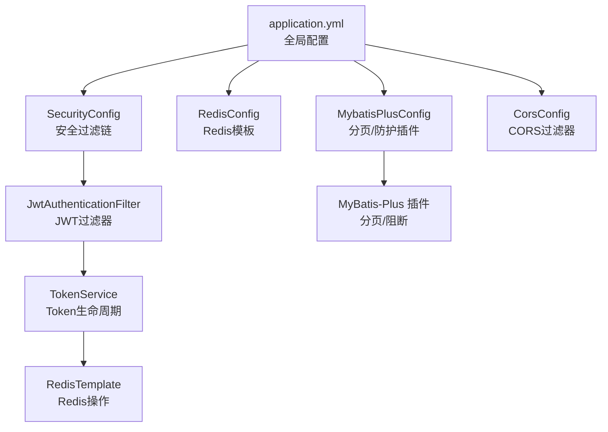
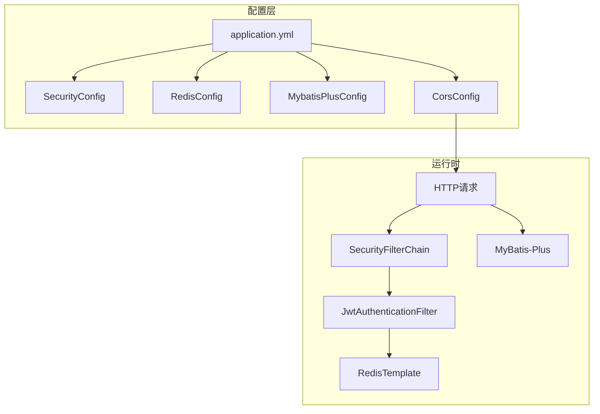
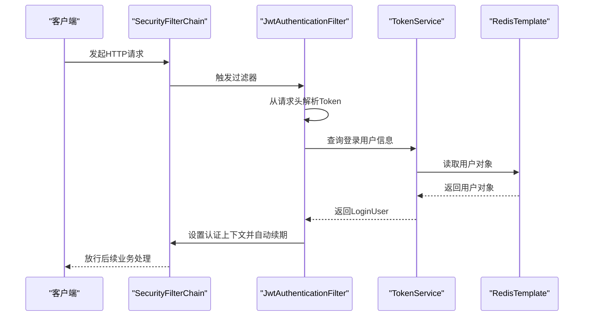
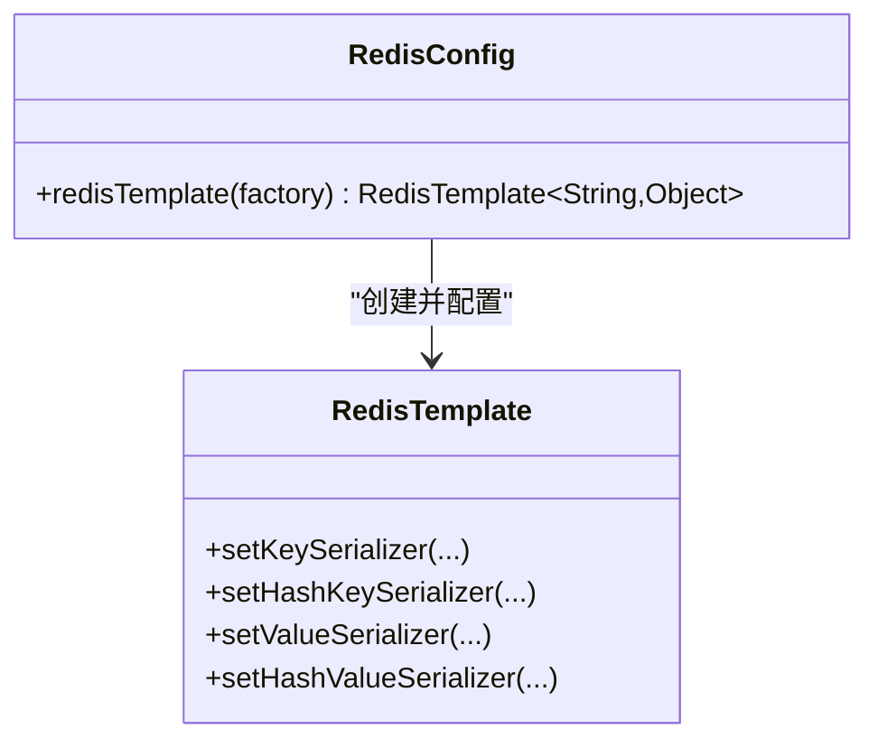
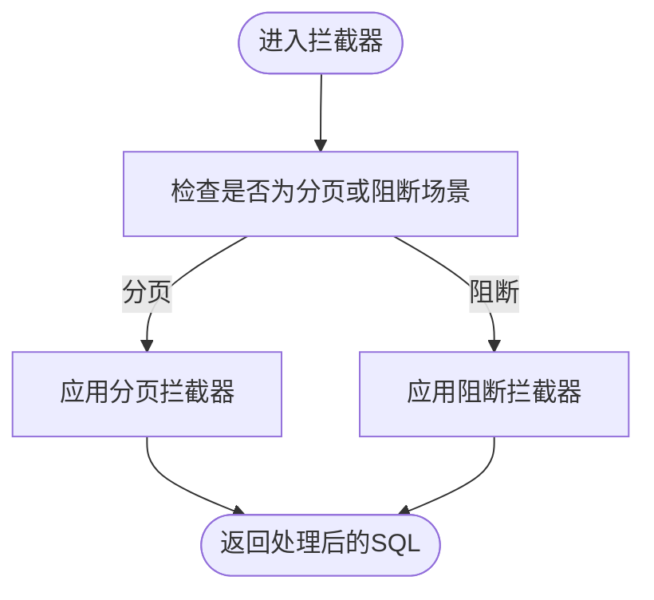
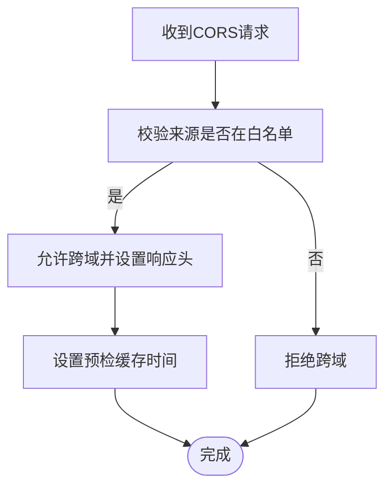
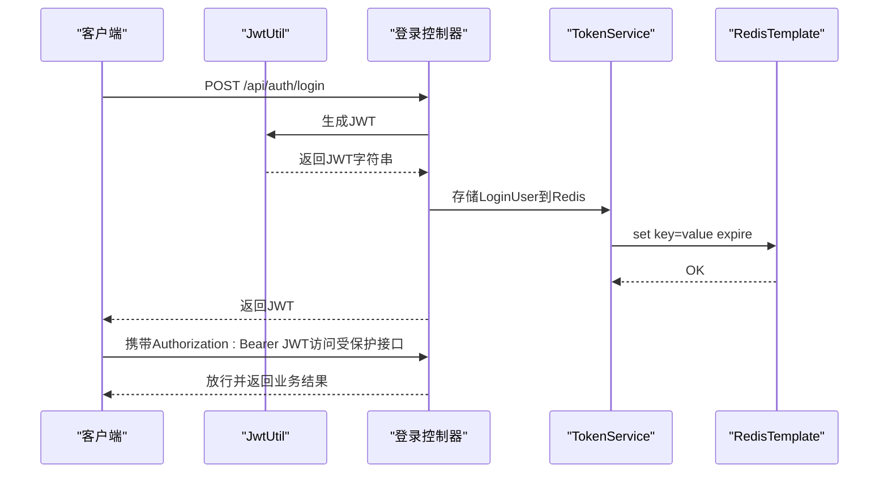
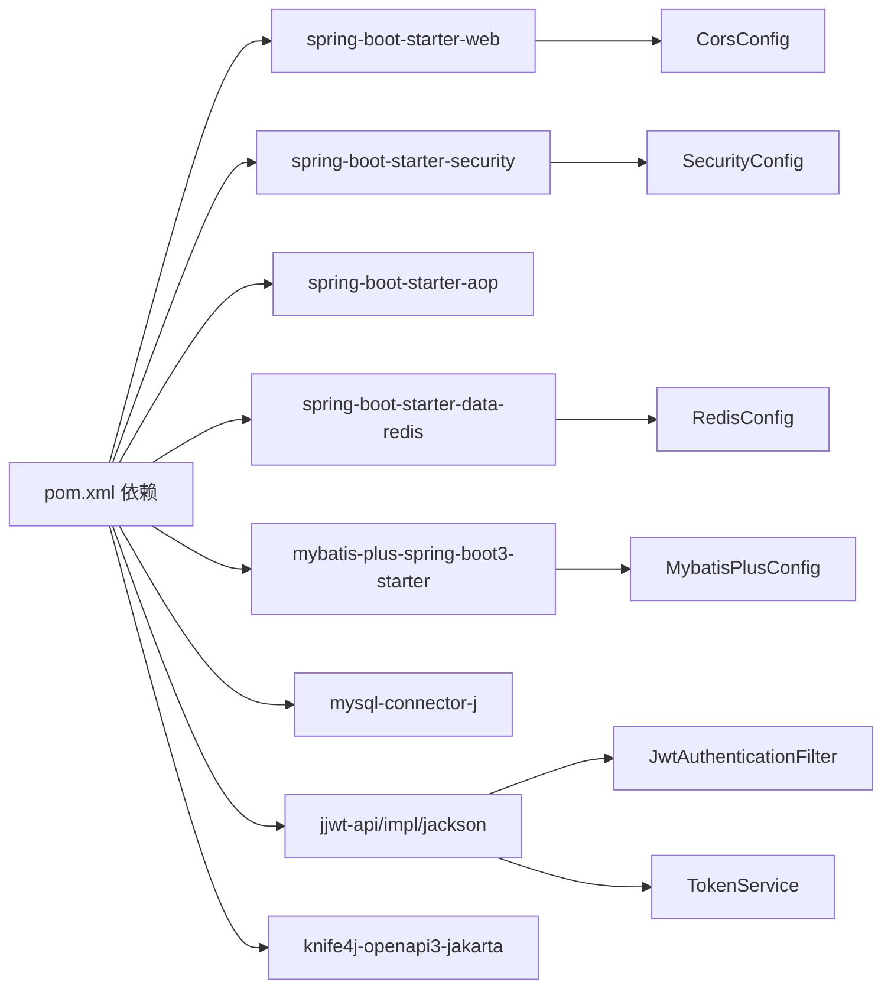

# 核心配置

<cite>
**本文引用的文件**
- [application.yml](file://task-manager-backend/src/main/resources/application.yml)
- [SecurityConfig.java](file://task-manager-backend/src/main/java/com/taskmanager/config/SecurityConfig.java)
- [RedisConfig.java](file://task-manager-backend/src/main/java/com/taskmanager/config/RedisConfig.java)
- [MybatisPlusConfig.java](file://task-manager-backend/src/main/java/com/taskmanager/config/MybatisPlusConfig.java)
- [CorsConfig.java](file://task-manager-backend/src/main/java/com/taskmanager/config/CorsConfig.java)
- [JwtAuthenticationFilter.java](file://task-manager-backend/src/main/java/com/taskmanager/security/JwtAuthenticationFilter.java)
- [TokenService.java](file://task-manager-backend/src/main/java/com/taskmanager/security/TokenService.java)
- [JwtUtil.java](file://task-manager-backend/src/main/java/com/taskmanager/utils/JwtUtil.java)
- [Constants.java](file://task-manager-backend/src/main/java/com/taskmanager/common/constant/Constants.java)
- [application-test.yml](file://task-manager-backend/src/test/resources/application-test.yml)
- [pom.xml](file://task-manager-backend/pom.xml)
</cite>

## 目录
1. [简介](#简介)
2. [项目结构](#项目结构)
3. [核心组件](#核心组件)
4. [架构总览](#架构总览)
5. [详细组件分析](#详细组件分析)
6. [依赖分析](#依赖分析)
7. [性能考虑](#性能考虑)
8. [故障排查指南](#故障排查指南)
9. [结论](#结论)
10. [附录](#附录)

## 简介
本文件聚焦于CodeBuddy任务管理系统后端的核心配置，系统性解读application.yml中的各项配置及其在Spring Boot应用中的作用，并结合四个关键配置类（SecurityConfig、RedisConfig、MybatisPlusConfig、CorsConfig）说明其设计目的与实现原理。同时提供JWT配置、数据库连接池、缓存连接参数、MyBatis-Plus逻辑删除与驼峰映射、跨域策略等最佳实践与常见问题解决方案，并给出配置文件版本管理与环境差异处理方法。

## 项目结构
后端采用Spring Boot标准目录结构，核心配置集中在resources目录下的application.yml；安全、缓存、数据访问、跨域等配置分别以独立配置类形式注入容器。

图表来源
- [application.yml:1-79](file://task-manager-backend/src/main/resources/application.yml#L1-L79)
- [SecurityConfig.java:47-96](file://task-manager-backend/src/main/java/com/taskmanager/config/SecurityConfig.java#L47-L96)
- [RedisConfig.java:18-31](file://task-manager-backend/src/main/java/com/taskmanager/config/RedisConfig.java#L18-L31)
- [MybatisPlusConfig.java:22-30](file://task-manager-backend/src/main/java/com/taskmanager/config/MybatisPlusConfig.java#L22-L30)
- [CorsConfig.java:21-45](file://task-manager-backend/src/main/java/com/taskmanager/config/CorsConfig.java#L21-L45)
- [JwtAuthenticationFilter.java:37-57](file://task-manager-backend/src/main/java/com/taskmanager/security/JwtAuthenticationFilter.java#L37-L57)
- [TokenService.java:34-41](file://task-manager-backend/src/main/java/com/taskmanager/security/TokenService.java#L34-L41)

章节来源
- [application.yml:1-79](file://task-manager-backend/src/main/resources/application.yml#L1-L79)
- [SecurityConfig.java:31-115](file://task-manager-backend/src/main/java/com/taskmanager/config/SecurityConfig.java#L31-L115)
- [RedisConfig.java:15-32](file://task-manager-backend/src/main/java/com/taskmanager/config/RedisConfig.java#L15-L32)
- [MybatisPlusConfig.java:16-31](file://task-manager-backend/src/main/java/com/taskmanager/config/MybatisPlusConfig.java#L16-L31)
- [CorsConfig.java:17-46](file://task-manager-backend/src/main/java/com/taskmanager/config/CorsConfig.java#L17-L46)

## 核心组件
- 数据源配置（MySQL/HikariCP）：定义JDBC连接URL、用户名、密码、驱动类以及Hikari连接池的关键参数，保障高并发下的稳定连接与资源回收。
- Redis配置：定义主机、端口、数据库索引、超时、连接池参数，配合RedisConfig统一Key/Value序列化策略，避免乱码并提升可读性。
- MyBatis-Plus配置：启用驼峰命名映射、Mapper XML扫描路径、全局主键自增策略、逻辑删除字段与值约定，以及分页与全表更新/删除防护插件。
- JWT配置：定义密钥、过期时间、请求头标识与前缀，配合JwtAuthenticationFilter与TokenService实现无状态认证与自动续期。
- 安全配置：禁用CSRF、基于Token无状态会话、统一异常处理、放行公开接口、在UsernamePasswordAuthenticationFilter之前加入JWT过滤器。
- 跨域配置：允许Cookie凭证、指定前端开发端口、允许所有请求头与方法、暴露全部响应头、设置预检缓存时间。

章节来源
- [application.yml:5-44](file://task-manager-backend/src/main/resources/application.yml#L5-L44)
- [SecurityConfig.java:47-96](file://task-manager-backend/src/main/java/com/taskmanager/config/SecurityConfig.java#L47-L96)
- [RedisConfig.java:18-31](file://task-manager-backend/src/main/java/com/taskmanager/config/RedisConfig.java#L18-L31)
- [MybatisPlusConfig.java:22-30](file://task-manager-backend/src/main/java/com/taskmanager/config/MybatisPlusConfig.java#L22-L30)
- [CorsConfig.java:21-45](file://task-manager-backend/src/main/java/com/taskmanager/config/CorsConfig.java#L21-L45)

## 架构总览
下图展示配置如何影响运行时行为：application.yml提供基础参数，配置类将其注入到Spring容器，最终在运行时生效于安全过滤链、数据访问层、缓存层与跨域处理。

图表来源
- [application.yml:1-79](file://task-manager-backend/src/main/resources/application.yml#L1-L79)
- [SecurityConfig.java:47-96](file://task-manager-backend/src/main/java/com/taskmanager/config/SecurityConfig.java#L47-L96)
- [JwtAuthenticationFilter.java:37-57](file://task-manager-backend/src/main/java/com/taskmanager/security/JwtAuthenticationFilter.java#L37-L57)
- [RedisConfig.java:18-31](file://task-manager-backend/src/main/java/com/taskmanager/config/RedisConfig.java#L18-L31)
- [MybatisPlusConfig.java:22-30](file://task-manager-backend/src/main/java/com/taskmanager/config/MybatisPlusConfig.java#L22-L30)
- [CorsConfig.java:21-45](file://task-manager-backend/src/main/java/com/taskmanager/config/CorsConfig.java#L21-L45)

## 详细组件分析

### application.yml 配置详解
- 数据源（MySQL/HikariCP）
  - JDBC URL、用户名、密码、驱动类：建立数据库连接。
  - HikariCP参数：最小空闲连接、最大池大小、空闲超时、最大生存时间、连接超时，用于平衡吞吐与资源占用。
- Redis
  - 主机、端口、密码、数据库索引、超时、Lettuce连接池参数：控制缓存连接质量与并发能力。
- MyBatis-Plus
  - 驼峰命名映射、日志实现、Mapper XML扫描路径、全局主键策略、逻辑删除字段与值约定。
- Jackson
  - 时间格式与时区：统一响应时间显示。
- JWT
  - 密钥、过期时间（毫秒）、请求头名称、Token前缀。
- 服务端口
  - HTTP监听端口。
- Knife4j/SpringDoc
  - Swagger UI路径、API文档路径、分组扫描包。

章节来源
- [application.yml:1-79](file://task-manager-backend/src/main/resources/application.yml#L1-L79)

### SecurityConfig 安全配置
- 设计目的
  - 基于Token的无状态认证，禁用CSRF，统一会话策略为STATELESS。
  - 统一未认证与无权限的错误响应格式，便于前端处理。
  - 在标准过滤器链之前插入JWT过滤器，实现自动解析与续期。
- 实现要点
  - 放行公开接口（如登录、注册、验证码、商品列表、Knife4j文档等）。
  - 未认证与无权限分别返回401与403，JSON格式。
  - 注册BCrypt密码编码器与认证管理器。
- 与JWT的协作
  - JwtAuthenticationFilter从请求头读取Token，从Redis解析用户信息，构建认证上下文并自动续期。

图表来源
- [SecurityConfig.java:47-96](file://task-manager-backend/src/main/java/com/taskmanager/config/SecurityConfig.java#L47-L96)
- [JwtAuthenticationFilter.java:37-57](file://task-manager-backend/src/main/java/com/taskmanager/security/JwtAuthenticationFilter.java#L37-L57)
- [TokenService.java:49-62](file://task-manager-backend/src/main/java/com/taskmanager/security/TokenService.java#L49-L62)

章节来源
- [SecurityConfig.java:31-115](file://task-manager-backend/src/main/java/com/taskmanager/config/SecurityConfig.java#L31-L115)
- [JwtAuthenticationFilter.java:16-70](file://task-manager-backend/src/main/java/com/taskmanager/security/JwtAuthenticationFilter.java#L16-L70)
- [TokenService.java:12-89](file://task-manager-backend/src/main/java/com/taskmanager/security/TokenService.java#L12-L89)

### RedisConfig 缓存配置
- 设计目的
  - 统一Key/HashKey为字符串序列化，Value/HashValue为JSON序列化，避免乱码并支持复杂对象存储。
- 实现要点
  - 使用StringRedisSerializer保证Key可读性。
  - 使用GenericJackson2JsonRedisSerializer支持对象序列化。
  - 在afterPropertiesSet后初始化模板。

图表来源
- [RedisConfig.java:18-31](file://task-manager-backend/src/main/java/com/taskmanager/config/RedisConfig.java#L18-L31)

章节来源
- [RedisConfig.java:9-32](file://task-manager-backend/src/main/java/com/taskmanager/config/RedisConfig.java#L9-L32)

### MybatisPlusConfig 数据访问配置
- 设计目的
  - 提供分页能力与安全防护，防止误操作导致全表更新/删除。
- 实现要点
  - 分页插件（MySQL）：自动拦截分页SQL。
  - 阻断插件：拦截未带条件的UPDATE/DELETE，避免全表危险操作。

图表来源
- [MybatisPlusConfig.java:22-30](file://task-manager-backend/src/main/java/com/taskmanager/config/MybatisPlusConfig.java#L22-L30)

章节来源
- [MybatisPlusConfig.java:10-31](file://task-manager-backend/src/main/java/com/taskmanager/config/MybatisPlusConfig.java#L10-L31)

### CorsConfig 跨域配置
- 设计目的
  - 允许前端开发服务器跨域访问后端API，支持Cookie凭证、暴露全部响应头、设置预检缓存。
- 实现要点
  - 允许来源：本地多个开发端口。
  - 允许头与方法：全部。
  - 预检缓存：1小时。

图表来源
- [CorsConfig.java:21-45](file://task-manager-backend/src/main/java/com/taskmanager/config/CorsConfig.java#L21-L45)

章节来源
- [CorsConfig.java:11-46](file://task-manager-backend/src/main/java/com/taskmanager/config/CorsConfig.java#L11-L46)

### JWT配置与实现
- application.yml中的JWT参数
  - 密钥、过期时间（毫秒）、请求头名称、Token前缀。
- JwtUtil
  - 从配置读取密钥与过期时间，生成JWT字符串。
- JwtAuthenticationFilter
  - 从请求头读取Token，去除前缀，从Redis解析用户信息，构建认证上下文并自动续期。
- TokenService
  - 在Redis中保存登录用户信息，按过期时间设置TTL，提供创建、刷新、删除与查询。

图表来源
- [JwtUtil.java:24-53](file://task-manager-backend/src/main/java/com/taskmanager/utils/JwtUtil.java#L24-L53)
- [TokenService.java:34-41](file://task-manager-backend/src/main/java/com/taskmanager/security/TokenService.java#L34-L41)
- [JwtAuthenticationFilter.java:62-68](file://task-manager-backend/src/main/java/com/taskmanager/security/JwtAuthenticationFilter.java#L62-L68)

章节来源
- [application.yml:51-56](file://task-manager-backend/src/main/resources/application.yml#L51-L56)
- [JwtUtil.java:15-55](file://task-manager-backend/src/main/java/com/taskmanager/utils/JwtUtil.java#L15-L55)
- [JwtAuthenticationFilter.java:16-70](file://task-manager-backend/src/main/java/com/taskmanager/security/JwtAuthenticationFilter.java#L16-L70)
- [TokenService.java:12-89](file://task-manager-backend/src/main/java/com/taskmanager/security/TokenService.java#L12-L89)
- [Constants.java:28-32](file://task-manager-backend/src/main/java/com/taskmanager/common/constant/Constants.java#L28-L32)

## 依赖分析
- 外部依赖
  - Spring Boot Starter Web、Security、AOP、Data Redis、MyBatis-Plus、MySQL Connector、JWT、Knife4j等。
- 内部耦合
  - SecurityConfig依赖JwtAuthenticationFilter；JwtAuthenticationFilter依赖TokenService；TokenService依赖RedisTemplate；MybatisPlusConfig依赖MyBatis-Plus插件；CorsConfig独立提供过滤器。

图表来源
- [pom.xml:32-88](file://task-manager-backend/pom.xml#L32-L88)
- [SecurityConfig.java:36-42](file://task-manager-backend/src/main/java/com/taskmanager/config/SecurityConfig.java#L36-L42)
- [JwtAuthenticationFilter.java:31-35](file://task-manager-backend/src/main/java/com/taskmanager/security/JwtAuthenticationFilter.java#L31-L35)
- [TokenService.java:25-26](file://task-manager-backend/src/main/java/com/taskmanager/security/TokenService.java#L25-L26)
- [RedisConfig.java:18-31](file://task-manager-backend/src/main/java/com/taskmanager/config/RedisConfig.java#L18-L31)
- [MybatisPlusConfig.java:22-30](file://task-manager-backend/src/main/java/com/taskmanager/config/MybatisPlusConfig.java#L22-L30)
- [CorsConfig.java:21-45](file://task-manager-backend/src/main/java/com/taskmanager/config/CorsConfig.java#L21-L45)

章节来源
- [pom.xml:32-88](file://task-manager-backend/pom.xml#L32-L88)

## 性能考虑
- 数据库连接池
  - 合理设置最小空闲与最大池大小，避免频繁创建销毁连接；根据QPS调整连接超时与空闲超时。
- 缓存连接池
  - Lettuce连接池的max-active与max-idle应与后端并发相匹配；max-wait设为-1表示不限制等待。
- 分页与防护
  - 分页插件仅对分页查询生效，避免对全表扫描造成压力；阻断插件可防止误操作引发的性能灾难。
- JWT续期
  - 通过自动续期减少频繁登录，但需注意Redis写入开销；建议结合业务请求频率优化过期时间。

## 故障排查指南
- 认证失败（401）
  - 检查请求头是否包含正确的头部标识与Token前缀；确认JWT密钥与过期时间一致；核对Redis中是否存在对应Token键。
- 无权限（403）
  - 检查用户角色与权限是否正确授予；确认SecurityConfig中放行规则是否覆盖目标接口。
- 跨域问题
  - 确认CorsConfig中允许的来源是否包含当前前端端口；检查是否携带Cookie且允许凭证。
- 数据库连接失败
  - 检查application.yml中的JDBC URL、用户名、密码与驱动类；核对HikariCP参数是否合理。
- 缓存序列化异常
  - 确保RedisConfig中Key/Value序列化策略与存储对象类型匹配；避免存储不可序列化对象。
- 测试环境Redis不可用
  - application-test.yml已排除Redis自动配置，确保测试用例不依赖Redis。

章节来源
- [application-test.yml:1-10](file://task-manager-backend/src/test/resources/application-test.yml#L1-L10)
- [SecurityConfig.java:59-74](file://task-manager-backend/src/main/java/com/taskmanager/config/SecurityConfig.java#L59-L74)
- [CorsConfig.java:24-40](file://task-manager-backend/src/main/java/com/taskmanager/config/CorsConfig.java#L24-L40)
- [RedisConfig.java:22-28](file://task-manager-backend/src/main/java/com/taskmanager/config/RedisConfig.java#L22-L28)
- [TokenService.java:49-62](file://task-manager-backend/src/main/java/com/taskmanager/security/TokenService.java#L49-L62)

## 结论
本配置体系围绕“无状态认证、稳定数据访问、可靠缓存与开放跨域”展开：application.yml提供统一参数，四大配置类分别负责安全、缓存、数据访问与跨域，形成清晰的职责边界与可维护性。结合最佳实践与故障排查清单，可在不同环境中快速部署并保持高性能与高可用。

## 附录

### 配置参数最佳实践
- 数据源与连接池
  - 最小空闲连接建议为CPU核心数×2；最大池大小根据峰值并发与数据库承载能力设定；连接超时与空闲超时应与业务请求时长匹配。
- Redis
  - Key/Value序列化策略应与业务对象一致；池大小与最大活跃连接应与QPS匹配；设置合理的超时与TTL。
- MyBatis-Plus
  - 逻辑删除字段与值需与数据库一致；分页插件仅在需要分页的接口使用；阻断插件开启以避免误删。
- JWT
  - 密钥必须保密且定期轮换；过期时间应结合业务场景权衡用户体验与安全性；Token前缀与请求头需与前端一致。
- 跨域
  - 生产环境应限制来源白名单，避免使用通配符；预检缓存时间应适中以兼顾性能与变更效率。

### 环境差异与版本管理
- 环境变量与Profiles
  - 可通过Spring Profiles区分开发、测试、生产环境，将敏感配置移至外部配置中心或环境变量。
- 配置文件版本管理
  - application.yml与application-test.yml分别管理运行与测试环境配置；建议对敏感字段进行加密或占位处理。
- 版本与依赖
  - pom.xml中统一管理依赖版本，确保JWT、MyBatis-Plus、Knife4j等版本兼容。

章节来源
- [application.yml:1-79](file://task-manager-backend/src/main/resources/application.yml#L1-L79)
- [application-test.yml:1-10](file://task-manager-backend/src/test/resources/application-test.yml#L1-L10)
- [pom.xml:20-30](file://task-manager-backend/pom.xml#L20-L30)