# JWT认证机制

<cite>
**本文档引用的文件**
- [JwtAuthenticationFilter.java](file://task-manager-backend/src/main/java/com/taskmanager/security/JwtAuthenticationFilter.java)
- [TokenService.java](file://task-manager-backend/src/main/java/com/taskmanager/security/TokenService.java)
- [JwtUtil.java](file://task-manager-backend/src/main/java/com/taskmanager/utils/JwtUtil.java)
- [LoginUser.java](file://task-manager-backend/src/main/java/com/taskmanager/security/LoginUser.java)
- [UserDetailsServiceImpl.java](file://task-manager-backend/src/main/java/com/taskmanager/security/UserDetailsServiceImpl.java)
- [SysLoginController.java](file://task-manager-backend/src/main/java/com/taskmanager/controller/SysLoginController.java)
- [SecurityConfig.java](file://task-manager-backend/src/main/java/com/taskmanager/config/SecurityConfig.java)
- [RedisConfig.java](file://task-manager-backend/src/main/java/com/taskmanager/config/RedisConfig.java)
- [application.yml](file://task-manager-backend/src/main/resources/application.yml)
- [Constants.java](file://task-manager-backend/src/main/java/com/taskmanager/common/constant/Constants.java)
- [SysLoginControllerTest.java](file://task-manager-backend/src/test/java/com/taskmanager/controller/SysLoginControllerTest.java)
</cite>

## 目录
1. [简介](#简介)
2. [项目结构](#项目结构)
3. [核心组件](#核心组件)
4. [架构总览](#架构总览)
5. [详细组件分析](#详细组件分析)
6. [依赖关系分析](#依赖关系分析)
7. [性能考虑](#性能考虑)
8. [故障排除指南](#故障排除指南)
9. [结论](#结论)
10. [附录](#附录)

## 简介
本文件面向CodeBuddy系统的JWT认证机制，系统采用基于Token的无状态认证方案，结合Spring Security与Redis实现完整的登录、鉴权、续期与登出流程。文档将深入解析以下关键点：
- JWT工作原理与在系统中的落地实现
- JwtAuthenticationFilter过滤器的请求头解析、Token提取、用户信息验证与自动续期逻辑
- TokenService的Token管理能力：生成、验证、刷新与删除
- JwtUtil工具类的JWT操作方法：签名算法、过期时间、载荷处理
- 完整认证流程图与代码示例路径
- Token安全最佳实践与常见问题解决方案

## 项目结构
后端采用分层架构，JWT认证相关代码主要分布在以下包中：
- security：认证过滤器、用户详情服务、Token服务、登录用户模型
- utils：JWT工具类
- config：Spring Security与Redis配置
- controller：认证控制器（登录、登出、获取用户信息、动态路由）
- resources：应用配置文件（包含JWT配置）

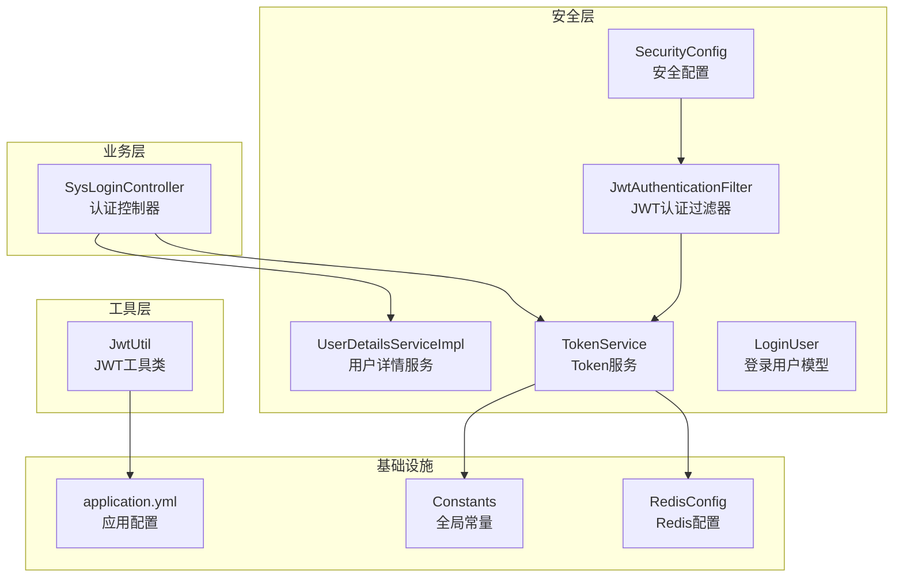

**图表来源**
- [SecurityConfig.java:47-97](file://task-manager-backend/src/main/java/com/taskmanager/config/SecurityConfig.java#L47-L97)
- [JwtAuthenticationFilter.java:37-57](file://task-manager-backend/src/main/java/com/taskmanager/security/JwtAuthenticationFilter.java#L37-L57)
- [UserDetailsServiceImpl.java:39-57](file://task-manager-backend/src/main/java/com/taskmanager/security/UserDetailsServiceImpl.java#L39-L57)
- [TokenService.java:34-87](file://task-manager-backend/src/main/java/com/taskmanager/security/TokenService.java#L34-L87)
- [JwtUtil.java:39-94](file://task-manager-backend/src/main/java/com/taskmanager/utils/JwtUtil.java#L39-L94)
- [RedisConfig.java:18-31](file://task-manager-backend/src/main/java/com/taskmanager/config/RedisConfig.java#L18-L31)
- [application.yml:51-57](file://task-manager-backend/src/main/resources/application.yml#L51-L57)
- [Constants.java:28-32](file://task-manager-backend/src/main/java/com/taskmanager/common/constant/Constants.java#L28-L32)

**章节来源**
- [SecurityConfig.java:47-97](file://task-manager-backend/src/main/java/com/taskmanager/config/SecurityConfig.java#L47-L97)
- [application.yml:51-57](file://task-manager-backend/src/main/resources/application.yml#L51-L57)

## 核心组件
本节对JWT认证的关键组件进行深入分析，涵盖职责、数据结构、处理逻辑与性能影响。

- JwtAuthenticationFilter：从请求头提取Token，从Redis解析用户信息，构建认证令牌并设置到Security上下文，同时触发Token自动续期。
- TokenService：负责Token生成（UUID）、Redis存储与过期时间设置、用户信息读取、Token续期与删除。
- JwtUtil：提供JWT生成、验证与载荷解析（用户名）等工具方法，使用HMAC-SHA算法与配置的密钥。
- LoginUser：实现Spring Security的UserDetails接口，封装用户实体、权限集合与角色列表，并提供认证所需的Authority集合。
- UserDetailsServiceImpl：根据用户名查询用户、角色与权限，组装LoginUser对象供后续认证使用。
- SysLoginController：处理登录、登出、获取用户信息与动态路由，完成认证与Token下发。
- SecurityConfig：配置无状态会话、放行认证接口、添加JWT过滤器、异常处理策略。
- RedisConfig：配置Redis序列化，确保复杂对象（如LoginUser）可正确存储与读取。
- application.yml：集中配置JWT密钥、过期时间、请求头与前缀等参数。
- Constants：定义Redis键前缀与HTTP状态码等全局常量。

**章节来源**
- [JwtAuthenticationFilter.java:37-68](file://task-manager-backend/src/main/java/com/taskmanager/security/JwtAuthenticationFilter.java#L37-L68)
- [TokenService.java:34-87](file://task-manager-backend/src/main/java/com/taskmanager/security/TokenService.java#L34-L87)
- [JwtUtil.java:39-94](file://task-manager-backend/src/main/java/com/taskmanager/utils/JwtUtil.java#L39-L94)
- [LoginUser.java:58-108](file://task-manager-backend/src/main/java/com/taskmanager/security/LoginUser.java#L58-L108)
- [UserDetailsServiceImpl.java:39-57](file://task-manager-backend/src/main/java/com/taskmanager/security/UserDetailsServiceImpl.java#L39-L57)
- [SysLoginController.java:103-135](file://task-manager-backend/src/main/java/com/taskmanager/controller/SysLoginController.java#L103-L135)
- [SecurityConfig.java:47-97](file://task-manager-backend/src/main/java/com/taskmanager/config/SecurityConfig.java#L47-L97)
- [RedisConfig.java:18-31](file://task-manager-backend/src/main/java/com/taskmanager/config/RedisConfig.java#L18-L31)
- [application.yml:51-57](file://task-manager-backend/src/main/resources/application.yml#L51-L57)
- [Constants.java:28-32](file://task-manager-backend/src/main/java/com/taskmanager/common/constant/Constants.java#L28-L32)

## 架构总览
下图展示了从客户端发起登录请求到Token验证的完整流程，以及过滤器如何在请求生命周期中介入。

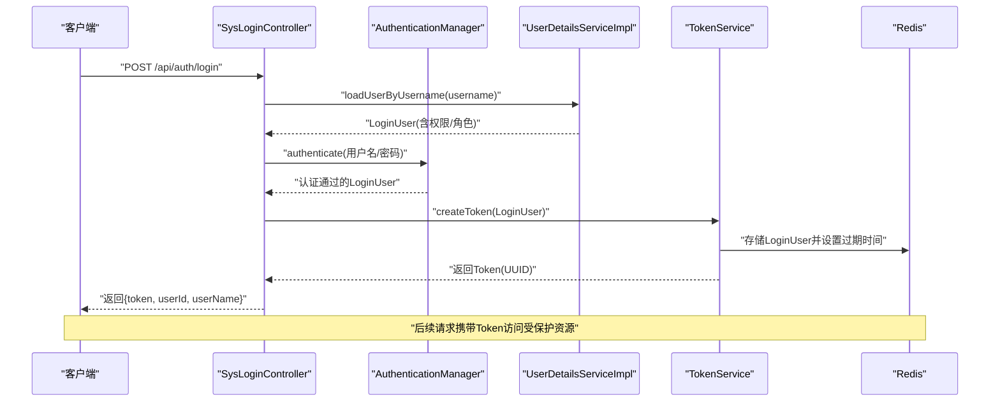

**图表来源**
- [SysLoginController.java:103-135](file://task-manager-backend/src/main/java/com/taskmanager/controller/SysLoginController.java#L103-L135)
- [UserDetailsServiceImpl.java:39-57](file://task-manager-backend/src/main/java/com/taskmanager/security/UserDetailsServiceImpl.java#L39-L57)
- [TokenService.java:34-41](file://task-manager-backend/src/main/java/com/taskmanager/security/TokenService.java#L34-L41)
- [RedisConfig.java:18-31](file://task-manager-backend/src/main/java/com/taskmanager/config/RedisConfig.java#L18-L31)

**章节来源**
- [SysLoginController.java:103-135](file://task-manager-backend/src/main/java/com/taskmanager/controller/SysLoginController.java#L103-L135)
- [UserDetailsServiceImpl.java:39-57](file://task-manager-backend/src/main/java/com/taskmanager/security/UserDetailsServiceImpl.java#L39-L57)
- [TokenService.java:34-41](file://task-manager-backend/src/main/java/com/taskmanager/security/TokenService.java#L34-L41)

## 详细组件分析

### JwtAuthenticationFilter 过滤器
该过滤器在每个请求进入时执行，负责：
- 从请求头解析Token（支持自定义Header名称与前缀）
- 从Redis读取LoginUser并验证有效性
- 构建UsernamePasswordAuthenticationToken并设置到Security上下文
- 对有效请求自动续期Token

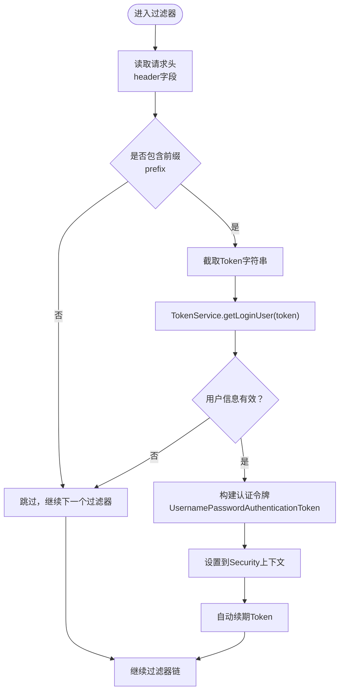

**图表来源**
- [JwtAuthenticationFilter.java:37-68](file://task-manager-backend/src/main/java/com/taskmanager/security/JwtAuthenticationFilter.java#L37-L68)
- [TokenService.java:49-62](file://task-manager-backend/src/main/java/com/taskmanager/security/TokenService.java#L49-L62)

**章节来源**
- [JwtAuthenticationFilter.java:37-68](file://task-manager-backend/src/main/java/com/taskmanager/security/JwtAuthenticationFilter.java#L37-L68)
- [TokenService.java:49-62](file://task-manager-backend/src/main/java/com/taskmanager/security/TokenService.java#L49-L62)

### TokenService Token管理
TokenService负责Token的全生命周期管理：
- createToken：生成UUID作为Token，设置LoginUser的token字段，并将LoginUser存入Redis，设置过期时间
- getLoginUser：从Redis读取LoginUser，类型校验并返回
- refreshToken：对有效Token进行续期（延长过期时间）
- delLoginUser：登出时删除Redis中的用户信息
- getTokenKey：构造Redis键（前缀+token）

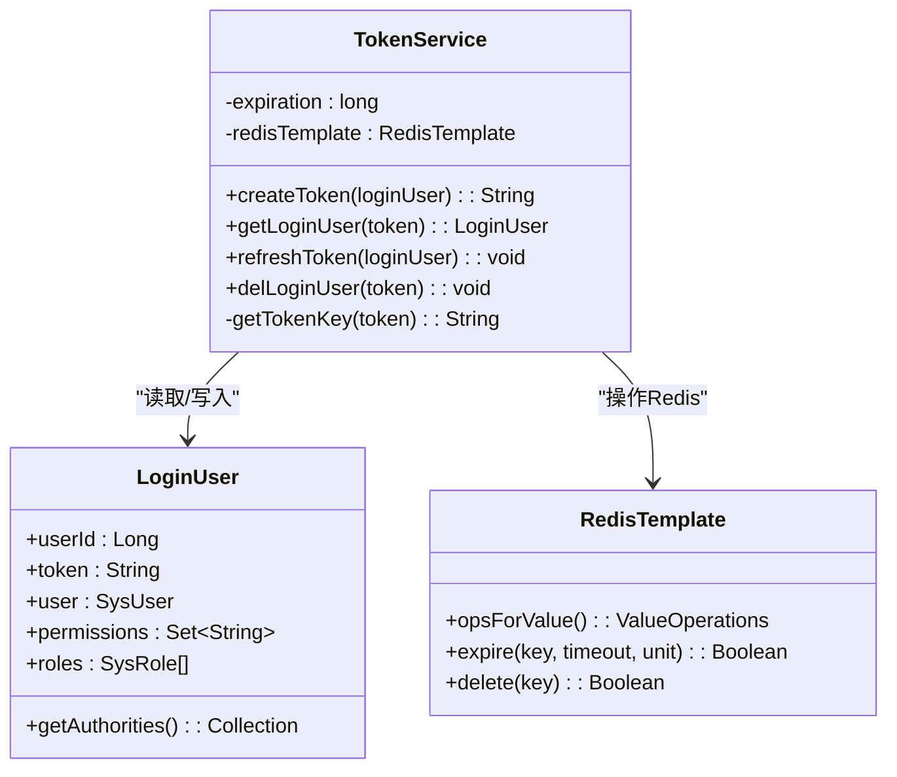

**图表来源**
- [TokenService.java:34-87](file://task-manager-backend/src/main/java/com/taskmanager/security/TokenService.java#L34-L87)
- [LoginUser.java:25-108](file://task-manager-backend/src/main/java/com/taskmanager/security/LoginUser.java#L25-L108)
- [Constants.java:28-32](file://task-manager-backend/src/main/java/com/taskmanager/common/constant/Constants.java#L28-L32)

**章节来源**
- [TokenService.java:34-87](file://task-manager-backend/src/main/java/com/taskmanager/security/TokenService.java#L34-L87)
- [Constants.java:28-32](file://task-manager-backend/src/main/java/com/taskmanager/common/constant/Constants.java#L28-L32)

### JwtUtil 工具类
JwtUtil提供JWT的核心操作：
- generateToken：生成JWT，包含用户名载荷、签发时间、过期时间与签名
- validateToken：验证JWT签名与有效性
- getUsernameFromToken：从JWT中解析用户名
- getSecretKey：基于配置密钥生成HMAC-SHA密钥对象

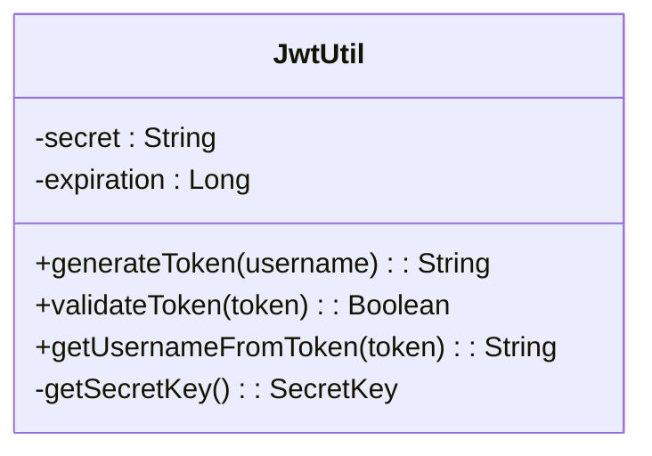

**图表来源**
- [JwtUtil.java:39-94](file://task-manager-backend/src/main/java/com/taskmanager/utils/JwtUtil.java#L39-L94)
- [application.yml:51-57](file://task-manager-backend/src/main/resources/application.yml#L51-L57)

**章节来源**
- [JwtUtil.java:39-94](file://task-manager-backend/src/main/java/com/taskmanager/utils/JwtUtil.java#L39-L94)
- [application.yml:51-57](file://task-manager-backend/src/main/resources/application.yml#L51-L57)

### LoginUser 用户详情模型
LoginUser实现Spring Security的UserDetails接口，关键点：
- getAuthorities：将权限字符串集合转换为GrantedAuthority集合
- isAccountNonExpired/isAccountNonLocked/isCredentialsNonExpired：统一返回true，由isEnabled控制可用性
- isEnabled：根据用户状态字段判断是否启用

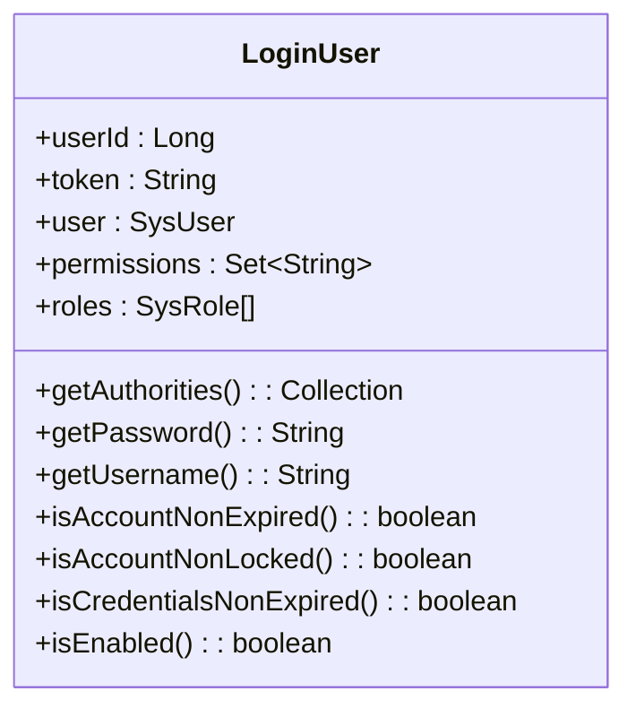

**图表来源**
- [LoginUser.java:58-108](file://task-manager-backend/src/main/java/com/taskmanager/security/LoginUser.java#L58-L108)

**章节来源**
- [LoginUser.java:58-108](file://task-manager-backend/src/main/java/com/taskmanager/security/LoginUser.java#L58-L108)

### UserDetailsServiceImpl 用户详情服务
- 根据用户名查询用户基础信息
- 查询用户角色列表
- 查询用户权限集合（通过角色菜单权限）
- 组装并返回LoginUser

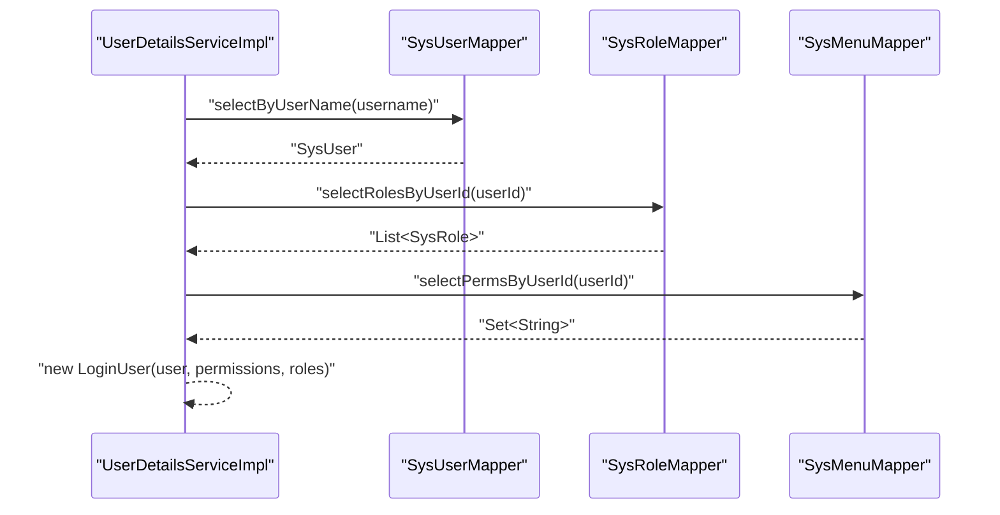

**图表来源**
- [UserDetailsServiceImpl.java:39-57](file://task-manager-backend/src/main/java/com/taskmanager/security/UserDetailsServiceImpl.java#L39-L57)

**章节来源**
- [UserDetailsServiceImpl.java:39-57](file://task-manager-backend/src/main/java/com/taskmanager/security/UserDetailsServiceImpl.java#L39-L57)

### SysLoginController 认证控制器
- 登录：调用AuthenticationManager进行认证，获取LoginUser后调用TokenService.createToken生成Token并返回
- 登出：从Security上下文获取LoginUser，调用TokenService.delLoginUser删除Redis中的用户信息并清理上下文
- 获取用户信息：从Security上下文获取LoginUser并返回用户、角色与权限信息
- 动态路由：根据角色决定管理员获取全部菜单或普通用户获取分配菜单

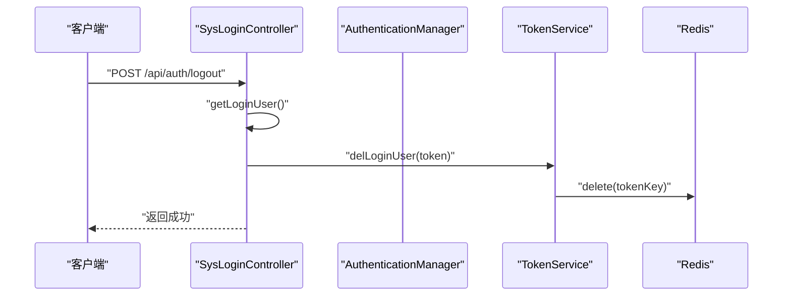

**图表来源**
- [SysLoginController.java:137-148](file://task-manager-backend/src/main/java/com/taskmanager/controller/SysLoginController.java#L137-L148)
- [TokenService.java:76-80](file://task-manager-backend/src/main/java/com/taskmanager/security/TokenService.java#L76-L80)

**章节来源**
- [SysLoginController.java:137-148](file://task-manager-backend/src/main/java/com/taskmanager/controller/SysLoginController.java#L137-L148)
- [TokenService.java:76-80](file://task-manager-backend/src/main/java/com/taskmanager/security/TokenService.java#L76-L80)

### SecurityConfig 安全配置
- 无状态会话：禁用Session，使用STATELESS策略
- 放行接口：登录、注册、验证码、Knife4j文档等接口无需认证
- 异常处理：未认证返回401，无权限返回403
- 添加过滤器：在UsernamePasswordAuthenticationFilter之前添加JwtAuthenticationFilter

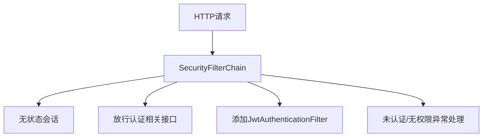

**图表来源**
- [SecurityConfig.java:47-97](file://task-manager-backend/src/main/java/com/taskmanager/config/SecurityConfig.java#L47-L97)

**章节来源**
- [SecurityConfig.java:47-97](file://task-manager-backend/src/main/java/com/taskmanager/config/SecurityConfig.java#L47-L97)

### RedisConfig Redis配置
- Key序列化：StringRedisSerializer
- Value序列化：GenericJackson2JsonRedisSerializer，支持复杂对象（如LoginUser）
- afterPropertiesSet：初始化模板

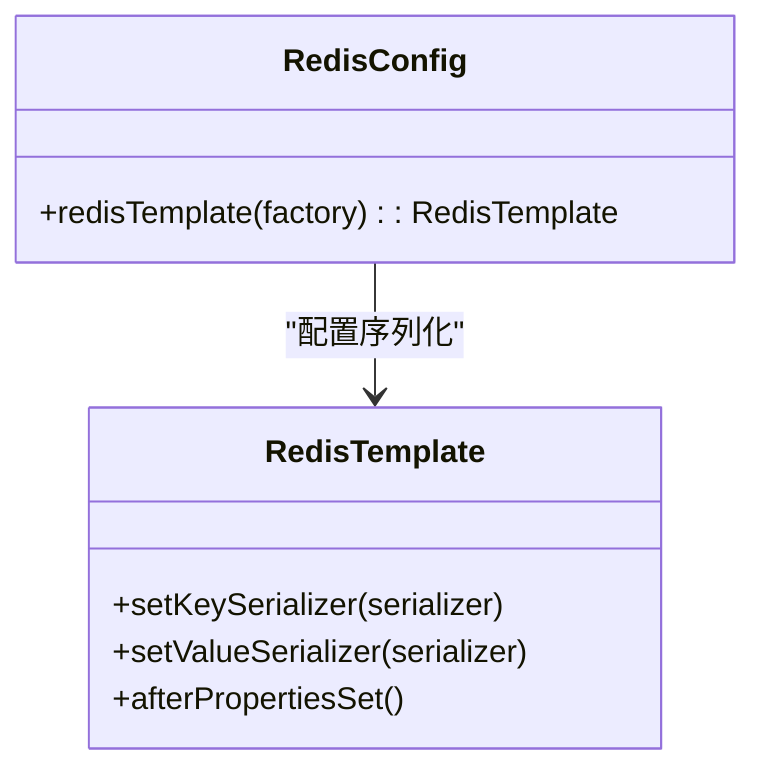

**图表来源**
- [RedisConfig.java:18-31](file://task-manager-backend/src/main/java/com/taskmanager/config/RedisConfig.java#L18-L31)

**章节来源**
- [RedisConfig.java:18-31](file://task-manager-backend/src/main/java/com/taskmanager/config/RedisConfig.java#L18-L31)

## 依赖关系分析
JWT认证机制的组件耦合关系如下：
- SysLoginController依赖AuthenticationManager、TokenService、CaptchaService与各Mapper
- JwtAuthenticationFilter依赖TokenService与配置的Header与前缀
- TokenService依赖RedisTemplate与Constants中的键前缀
- UserDetailsServiceImpl依赖多个Mapper以组装LoginUser
- SecurityConfig依赖JwtAuthenticationFilter并配置过滤器链
- RedisConfig为TokenService提供序列化支持

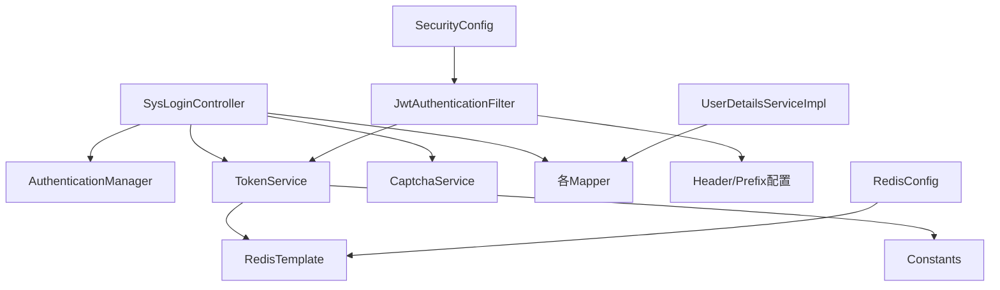

**图表来源**
- [SysLoginController.java:35-57](file://task-manager-backend/src/main/java/com/taskmanager/controller/SysLoginController.java#L35-L57)
- [JwtAuthenticationFilter.java:31-35](file://task-manager-backend/src/main/java/com/taskmanager/security/JwtAuthenticationFilter.java#L31-L35)
- [TokenService.java:25-26](file://task-manager-backend/src/main/java/com/taskmanager/security/TokenService.java#L25-L26)
- [UserDetailsServiceImpl.java:24-34](file://task-manager-backend/src/main/java/com/taskmanager/security/UserDetailsServiceImpl.java#L24-L34)
- [SecurityConfig.java:36-42](file://task-manager-backend/src/main/java/com/taskmanager/config/SecurityConfig.java#L36-L42)
- [RedisConfig.java:18-31](file://task-manager-backend/src/main/java/com/taskmanager/config/RedisConfig.java#L18-L31)

**章节来源**
- [SysLoginController.java:35-57](file://task-manager-backend/src/main/java/com/taskmanager/controller/SysLoginController.java#L35-L57)
- [JwtAuthenticationFilter.java:31-35](file://task-manager-backend/src/main/java/com/taskmanager/security/JwtAuthenticationFilter.java#L31-L35)
- [TokenService.java:25-26](file://task-manager-backend/src/main/java/com/taskmanager/security/TokenService.java#L25-L26)
- [UserDetailsServiceImpl.java:24-34](file://task-manager-backend/src/main/java/com/taskmanager/security/UserDetailsServiceImpl.java#L24-L34)
- [SecurityConfig.java:36-42](file://task-manager-backend/src/main/java/com/taskmanager/config/SecurityConfig.java#L36-L42)
- [RedisConfig.java:18-31](file://task-manager-backend/src/main/java/com/taskmanager/config/RedisConfig.java#L18-L31)

## 性能考虑
- Token存储与读取：TokenService通过Redis存储LoginUser，建议合理设置过期时间，避免内存泄漏；读取时进行类型校验，减少异常开销
- 自动续期：过滤器在每次有效请求时调用refreshToken，建议评估请求频率与Redis写放大带来的成本
- 序列化优化：RedisConfig使用JSON序列化，便于跨语言读取，但序列化/反序列化有CPU开销；可结合业务场景评估压缩或缓存策略
- 密钥长度与算法：JwtUtil使用HMAC-SHA，建议使用足够长度的密钥并定期轮换
- 过期时间：application.yml中配置了合理的过期时间，默认2小时，可根据业务调整

[本节为通用性能指导，不直接分析具体文件]

## 故障排除指南
- 未认证访问受保护接口：检查SecurityConfig的放行规则与JwtAuthenticationFilter是否正确拦截请求头
- Token无效或过期：确认application.yml中的jwt.secret与jwt.expiration配置一致；检查Redis中是否存在对应的tokenKey
- 登录后无法获取用户信息：确认SysLoginController在登录成功后调用了TokenService.createToken并返回Token；前端请求头是否携带正确的Authorization头
- 登出后仍可访问：确认SysLoginController.logout是否调用了TokenService.delLoginUser并清理了Security上下文
- 验证码错误：检查CaptchaService.validateCaptcha的Redis键与过期时间配置

**章节来源**
- [SysLoginControllerTest.java:301-307](file://task-manager-backend/src/test/java/com/taskmanager/controller/SysLoginControllerTest.java#L301-L307)
- [SecurityConfig.java:76-92](file://task-manager-backend/src/main/java/com/taskmanager/config/SecurityConfig.java#L76-L92)
- [application.yml:51-57](file://task-manager-backend/src/main/resources/application.yml#L51-L57)

## 结论
CodeBuddy系统的JWT认证机制通过Spring Security与Redis实现了高可用、可扩展的无状态认证方案。JwtAuthenticationFilter负责请求拦截与自动续期，TokenService管理Token生命周期，JwtUtil提供JWT工具方法，LoginUser与UserDetailsServiceImpl确保权限体系完整。配合SecurityConfig的放行规则与异常处理，整体架构清晰、职责明确，适合在生产环境中部署与维护。

[本节为总结性内容，不直接分析具体文件]

## 附录
- 配置项参考
  - jwt.secret：JWT签名密钥
  - jwt.expiration：Token过期时间（毫秒）
  - jwt.header：请求头名称（默认Authorization）
  - jwt.prefix：Token前缀（默认Bearer）
- 关键代码示例路径
  - 登录流程：[SysLoginController.java:103-135](file://task-manager-backend/src/main/java/com/taskmanager/controller/SysLoginController.java#L103-L135)
  - 过滤器链配置：[SecurityConfig.java:47-97](file://task-manager-backend/src/main/java/com/taskmanager/config/SecurityConfig.java#L47-L97)
  - Token生成与续期：[TokenService.java:34-71](file://task-manager-backend/src/main/java/com/taskmanager/security/TokenService.java#L34-L71)
  - 请求头解析与认证：[JwtAuthenticationFilter.java:37-68](file://task-manager-backend/src/main/java/com/taskmanager/security/JwtAuthenticationFilter.java#L37-L68)
  - JWT工具方法：[JwtUtil.java:39-94](file://task-manager-backend/src/main/java/com/taskmanager/utils/JwtUtil.java#L39-L94)

**章节来源**
- [application.yml:51-57](file://task-manager-backend/src/main/resources/application.yml#L51-L57)
- [SysLoginController.java:103-135](file://task-manager-backend/src/main/java/com/taskmanager/controller/SysLoginController.java#L103-L135)
- [SecurityConfig.java:47-97](file://task-manager-backend/src/main/java/com/taskmanager/config/SecurityConfig.java#L47-L97)
- [TokenService.java:34-71](file://task-manager-backend/src/main/java/com/taskmanager/security/TokenService.java#L34-L71)
- [JwtAuthenticationFilter.java:37-68](file://task-manager-backend/src/main/java/com/taskmanager/security/JwtAuthenticationFilter.java#L37-L68)
- [JwtUtil.java:39-94](file://task-manager-backend/src/main/java/com/taskmanager/utils/JwtUtil.java#L39-L94)