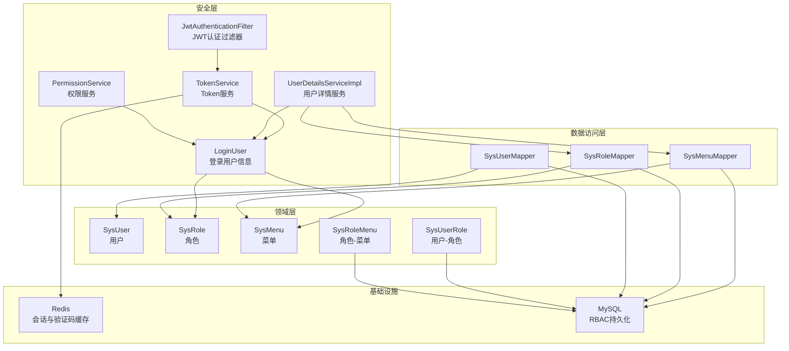
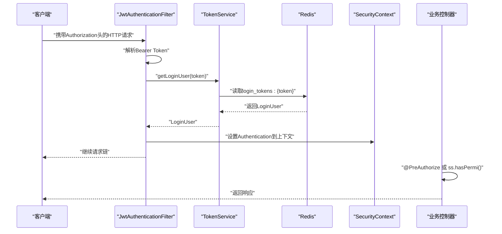
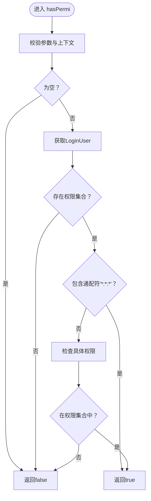
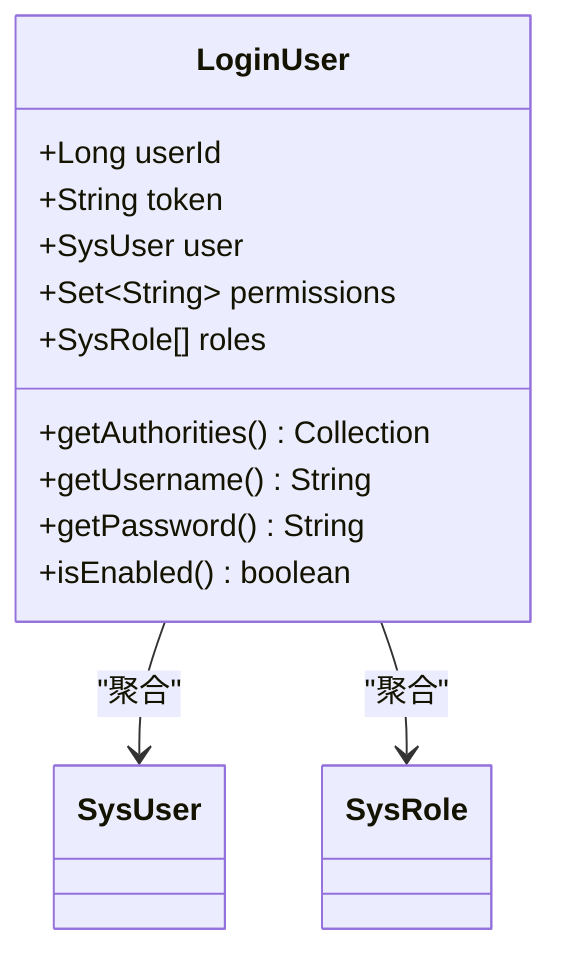
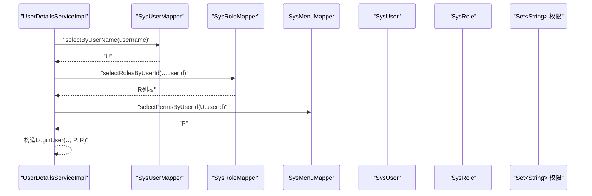
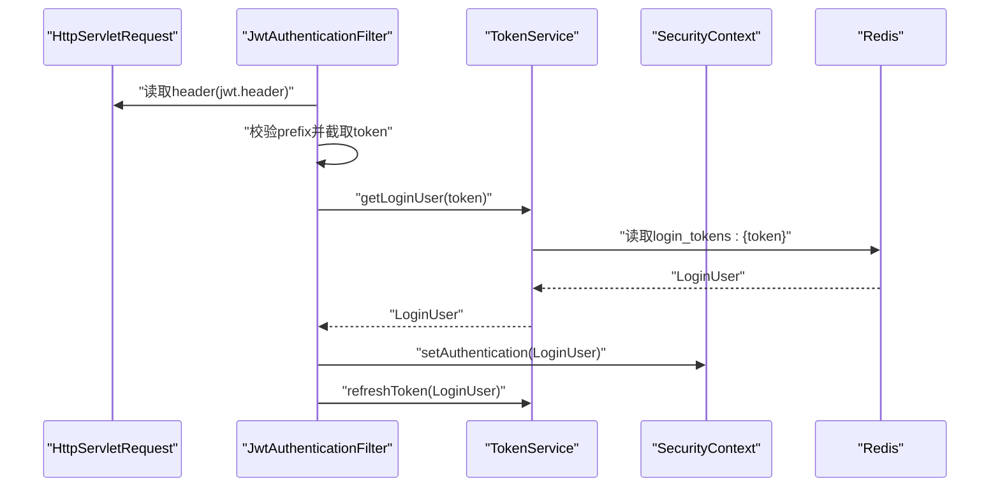
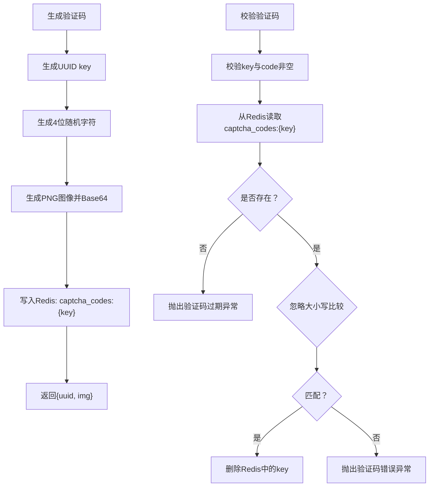
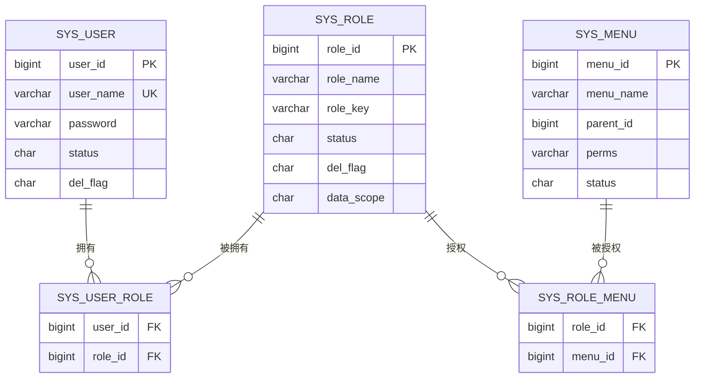
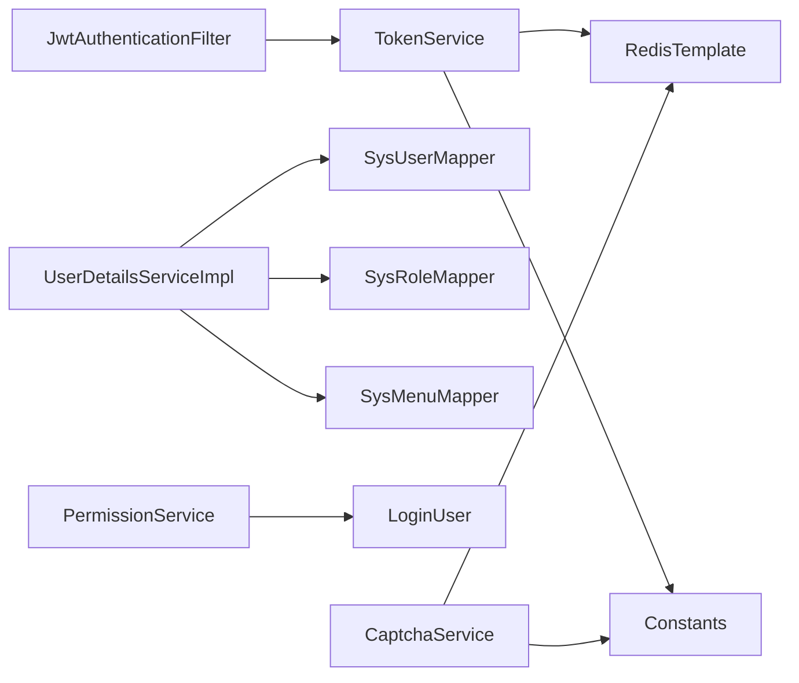

# 权限验证服务

<cite>
**本文引用的文件**
- [PermissionService.java](file://task-manager-backend/src/main/java/com/taskmanager/security/PermissionService.java)
- [CaptchaService.java](file://task-manager-backend/src/main/java/com/taskmanager/security/CaptchaService.java)
- [JwtAuthenticationFilter.java](file://task-manager-backend/src/main/java/com/taskmanager/security/JwtAuthenticationFilter.java)
- [LoginUser.java](file://task-manager-backend/src/main/java/com/taskmanager/security/LoginUser.java)
- [TokenService.java](file://task-manager-backend/src/main/java/com/taskmanager/security/TokenService.java)
- [UserDetailsServiceImpl.java](file://task-manager-backend/src/main/java/com/taskmanager/security/UserDetailsServiceImpl.java)
- [SysRole.java](file://task-manager-backend/src/main/java/com/taskmanager/domain/SysRole.java)
- [SysUserRole.java](file://task-manager-backend/src/main/java/com/taskmanager/domain/SysUserRole.java)
- [SysMenu.java](file://task-manager-backend/src/main/java/com/taskmanager/domain/SysMenu.java)
- [SysRoleMenu.java](file://task-manager-backend/src/main/java/com/taskmanager/domain/SysRoleMenu.java)
- [SysMenuMapper.java](file://task-manager-backend/src/main/java/com/taskmanager/mapper/SysMenuMapper.java)
- [SysRoleMapper.java](file://task-manager-backend/src/main/java/com/taskmanager/mapper/SysRoleMapper.java)
- [SysUserMapper.java](file://task-manager-backend/src/main/java/com/taskmanager/mapper/SysUserMapper.java)
- [Constants.java](file://task-manager-backend/src/main/java/com/taskmanager/common/constant/Constants.java)
- [application.yml](file://task-manager-backend/src/main/resources/application.yml)
- [schema.sql](file://task-manager-backend/src/main/resources/schema.sql)
- [test-data.sql](file://task-manager-backend/src/main/resources/test-data.sql)
</cite>

## 目录
1. [引言](#引言)
2. [项目结构](#项目结构)
3. [核心组件](#核心组件)
4. [架构总览](#架构总览)
5. [详细组件分析](#详细组件分析)
6. [依赖分析](#依赖分析)
7. [性能考虑](#性能考虑)
8. [故障排查指南](#故障排查指南)
9. [结论](#结论)
10. [附录](#附录)

## 引言
本文件面向权限验证服务的技术文档，围绕以下目标展开：
- 深入解释 PermissionService 的权限验证机制，包括角色权限匹配、接口权限控制、数据权限过滤等核心功能
- 详细分析权限检查的实现逻辑，说明如何根据用户角色和权限标识进行访问控制
- 解释验证码服务 CaptchaService 的实现，包括图形验证码生成、验证逻辑、防刷机制等
- 提供 RBAC 权限模型的具体实现方案，包括角色-权限关联表设计、用户-角色关联查询、权限继承规则等
- 包含权限缓存策略、性能优化方案和权限配置的最佳实践
- 提供权限验证失败的错误处理和日志记录机制

## 项目结构
后端采用 Spring Boot + Spring Security + MyBatis-Plus + Redis 的技术栈，权限体系围绕以下层次组织：
- 安全层：JWT 过滤器、Token 服务、用户详情服务、权限服务
- 领域层：用户、角色、菜单、角色-菜单、用户-角色等实体
- 数据访问层：MyBatis Mapper 接口
- 配置层：应用配置、Redis 配置、安全配置（由现有代码可知）
- 常量层：全局常量（验证码、登录 Token 等）

图表来源
- [JwtAuthenticationFilter.java:1-70](file://task-manager-backend/src/main/java/com/taskmanager/security/JwtAuthenticationFilter.java#L1-70)
- [TokenService.java:1-89](file://task-manager-backend/src/main/java/com/taskmanager/security/TokenService.java#L1-89)
- [UserDetailsServiceImpl.java:1-59](file://task-manager-backend/src/main/java/com/taskmanager/security/UserDetailsServiceImpl.java#L1-59)
- [PermissionService.java:1-64](file://task-manager-backend/src/main/java/com/taskmanager/security/PermissionService.java#L1-64)
- [LoginUser.java:1-110](file://task-manager-backend/src/main/java/com/taskmanager/security/LoginUser.java#L1-110)
- [SysUserMapper.java:1-39](file://task-manager-backend/src/main/java/com/taskmanager/mapper/SysUserMapper.java#L1-39)
- [SysRoleMapper.java:1-30](file://task-manager-backend/src/main/java/com/taskmanager/mapper/SysRoleMapper.java#L1-30)
- [SysMenuMapper.java:1-29](file://task-manager-backend/src/main/java/com/taskmanager/mapper/SysMenuMapper.java#L1-29)
- [SysUserRole.java:1-26](file://task-manager-backend/src/main/java/com/taskmanager/domain/SysUserRole.java#L1-26)
- [SysRoleMenu.java:1-25](file://task-manager-backend/src/main/java/com/taskmanager/domain/SysRoleMenu.java#L1-25)
- [SysUser.java:1-200](file://task-manager-backend/src/main/java/com/taskmanager/domain/SysUser.java#L1-200)
- [SysRole.java:1-65](file://task-manager-backend/src/main/java/com/taskmanager/domain/SysRole.java#L1-65)
- [SysMenu.java:1-92](file://task-manager-backend/src/main/java/com/taskmanager/domain/SysMenu.java#L1-92)

章节来源
- [JwtAuthenticationFilter.java:1-70](file://task-manager-backend/src/main/java/com/taskmanager/security/JwtAuthenticationFilter.java#L1-70)
- [TokenService.java:1-89](file://task-manager-backend/src/main/java/com/taskmanager/security/TokenService.java#L1-89)
- [UserDetailsServiceImpl.java:1-59](file://task-manager-backend/src/main/java/com/taskmanager/security/UserDetailsServiceImpl.java#L1-59)
- [PermissionService.java:1-64](file://task-manager-backend/src/main/java/com/taskmanager/security/PermissionService.java#L1-64)
- [LoginUser.java:1-110](file://task-manager-backend/src/main/java/com/taskmanager/security/LoginUser.java#L1-110)
- [SysUserMapper.java:1-39](file://task-manager-backend/src/main/java/com/taskmanager/mapper/SysUserMapper.java#L1-39)
- [SysRoleMapper.java:1-30](file://task-manager-backend/src/main/java/com/taskmanager/mapper/SysRoleMapper.java#L1-30)
- [SysMenuMapper.java:1-29](file://task-manager-backend/src/main/java/com/taskmanager/mapper/SysMenuMapper.java#L1-29)
- [SysUserRole.java:1-26](file://task-manager-backend/src/main/java/com/taskmanager/domain/SysUserRole.java#L1-26)
- [SysRoleMenu.java:1-25](file://task-manager-backend/src/main/java/com/taskmanager/domain/SysRoleMenu.java#L1-25)
- [SysUser.java:1-200](file://task-manager-backend/src/main/java/com/taskmanager/domain/SysUser.java#L1-200)
- [SysRole.java:1-65](file://task-manager-backend/src/main/java/com/taskmanager/domain/SysRole.java#L1-65)
- [SysMenu.java:1-92](file://task-manager-backend/src/main/java/com/taskmanager/domain/SysMenu.java#L1-92)

## 核心组件
本节聚焦权限验证服务的关键构件及其职责。

- 权限服务 PermissionService
  - 提供 hasPermi 与 lacksPermi 方法，基于当前登录用户的权限集合进行判定
  - 支持通配符权限“*:*:*”作为超级管理员标识
  - 通过 Spring Security 上下文获取 LoginUser，读取 permissions 集合

- 登录用户 LoginUser
  - 实现 UserDetails，承载用户实体、角色列表、权限集合
  - 将权限字符串集合转换为 GrantedAuthority 集合，供 Spring Security 使用
  - 提供 isEnabled 等账户状态判断

- 用户详情服务 UserDetailsServiceImpl
  - 实现 UserDetailsService，按用户名加载用户详情
  - 查询用户基本信息、角色列表、权限标识集合（通过菜单权限）
  - 返回 LoginUser 对象

- JWT 认证过滤器 JwtAuthenticationFilter
  - 从请求头提取 Token，从 Redis 解析用户信息
  - 构建 UsernamePasswordAuthenticationToken，设置到 Security 上下文
  - 自动续期 Token

- Token 服务 TokenService
  - 管理 Redis 中的用户会话：创建、刷新、删除、查询
  - 以 Constants.LOGIN_TOKEN_KEY 为前缀的 Redis Key

- 验证码服务 CaptchaService
  - 生成图形验证码并存储到 Redis，带过期时间
  - 校验验证码（忽略大小写），校验后立即删除
  - 使用 Constants.CAPTCHA_CODE_KEY 作为 Redis Key 前缀

章节来源
- [PermissionService.java:1-64](file://task-manager-backend/src/main/java/com/taskmanager/security/PermissionService.java#L1-64)
- [LoginUser.java:1-110](file://task-manager-backend/src/main/java/com/taskmanager/security/LoginUser.java#L1-110)
- [UserDetailsServiceImpl.java:1-59](file://task-manager-backend/src/main/java/com/taskmanager/security/UserDetailsServiceImpl.java#L1-59)
- [JwtAuthenticationFilter.java:1-70](file://task-manager-backend/src/main/java/com/taskmanager/security/JwtAuthenticationFilter.java#L1-70)
- [TokenService.java:1-89](file://task-manager-backend/src/main/java/com/taskmanager/security/TokenService.java#L1-89)
- [CaptchaService.java:1-129](file://task-manager-backend/src/main/java/com/taskmanager/security/CaptchaService.java#L1-129)
- [Constants.java:1-40](file://task-manager-backend/src/main/java/com/taskmanager/common/constant/Constants.java#L1-40)

## 架构总览
权限验证的整体流程如下：
- 请求进入，JwtAuthenticationFilter 从请求头解析 Token
- 从 Redis 读取 LoginUser，构建 Authentication 并放入 SecurityContext
- 控制器或切面通过 @PreAuthorize 或 PermissionService 进行权限校验
- 权限校验基于 LoginUser 的权限集合，支持通配符“*:*:*”

图表来源
- [JwtAuthenticationFilter.java:1-70](file://task-manager-backend/src/main/java/com/taskmanager/security/JwtAuthenticationFilter.java#L1-70)
- [TokenService.java:1-89](file://task-manager-backend/src/main/java/com/taskmanager/security/TokenService.java#L1-89)
- [Constants.java:1-40](file://task-manager-backend/src/main/java/com/taskmanager/common/constant/Constants.java#L1-40)

## 详细组件分析

### 权限服务 PermissionService
- 设计要点
  - 通过 SecurityContextHolder 获取当前 Authentication，从中取出 LoginUser
  - 读取 LoginUser.permissions 集合，支持“*:*:*”通配符
  - 提供 hasPermi 与 lacksPermi 两个对外方法
- 复杂度
  - hasPermi 为 O(n) 查找（Set.contains），n 为用户权限数量
- 边界与健壮性
  - 对空值与非 LoginUser 类型进行保护
  - 超级管理员直接放行

图表来源
- [PermissionService.java:1-64](file://task-manager-backend/src/main/java/com/taskmanager/security/PermissionService.java#L1-64)

章节来源
- [PermissionService.java:1-64](file://task-manager-backend/src/main/java/com/taskmanager/security/PermissionService.java#L1-64)

### 登录用户 LoginUser
- 设计要点
  - 实现 UserDetails，提供 authorities、username、password、isEnabled 等
  - permissions 转换为 GrantedAuthority 列表
  - isEnabled 基于用户状态字段判断
- 复杂度
  - authorities 转换为 Stream + map，复杂度 O(m)，m 为权限数量

图表来源
- [LoginUser.java:1-110](file://task-manager-backend/src/main/java/com/taskmanager/security/LoginUser.java#L1-110)

章节来源
- [LoginUser.java:1-110](file://task-manager-backend/src/main/java/com/taskmanager/security/LoginUser.java#L1-110)

### 用户详情服务 UserDetailsServiceImpl
- 设计要点
  - 通过 SysUserMapper、SysRoleMapper、SysMenuMapper 查询用户、角色、权限
  - 返回 LoginUser，其中 permissions 由菜单 perms 字段组成
- 复杂度
  - 多次数据库查询，取决于用户角色数与菜单数

图表来源
- [UserDetailsServiceImpl.java:1-59](file://task-manager-backend/src/main/java/com/taskmanager/security/UserDetailsServiceImpl.java#L1-59)
- [SysUserMapper.java:1-39](file://task-manager-backend/src/main/java/com/taskmanager/mapper/SysUserMapper.java#L1-39)
- [SysRoleMapper.java:1-30](file://task-manager-backend/src/main/java/com/taskmanager/mapper/SysRoleMapper.java#L1-30)
- [SysMenuMapper.java:1-29](file://task-manager-backend/src/main/java/com/taskmanager/mapper/SysMenuMapper.java#L1-29)

章节来源
- [UserDetailsServiceImpl.java:1-59](file://task-manager-backend/src/main/java/com/taskmanager/security/UserDetailsServiceImpl.java#L1-59)
- [SysUserMapper.java:1-39](file://task-manager-backend/src/main/java/com/taskmanager/mapper/SysUserMapper.java#L1-39)
- [SysRoleMapper.java:1-30](file://task-manager-backend/src/main/java/com/taskmanager/mapper/SysRoleMapper.java#L1-30)
- [SysMenuMapper.java:1-29](file://task-manager-backend/src/main/java/com/taskmanager/mapper/SysMenuMapper.java#L1-29)

### JWT 认证过滤器 JwtAuthenticationFilter
- 设计要点
  - 从请求头 Authorization 中提取 Token（前缀 Bearer）
  - 通过 TokenService 从 Redis 读取 LoginUser
  - 构建 Authentication 并放入 SecurityContext
  - 调用 TokenService.refreshToken 自动续期

图表来源
- [JwtAuthenticationFilter.java:1-70](file://task-manager-backend/src/main/java/com/taskmanager/security/JwtAuthenticationFilter.java#L1-70)
- [TokenService.java:1-89](file://task-manager-backend/src/main/java/com/taskmanager/security/TokenService.java#L1-89)
- [application.yml:52-56](file://task-manager-backend/src/main/resources/application.yml#L52-56)

章节来源
- [JwtAuthenticationFilter.java:1-70](file://task-manager-backend/src/main/java/com/taskmanager/security/JwtAuthenticationFilter.java#L1-70)
- [TokenService.java:1-89](file://task-manager-backend/src/main/java/com/taskmanager/security/TokenService.java#L1-89)
- [application.yml:52-56](file://task-manager-backend/src/main/resources/application.yml#L52-56)

### Token 服务 TokenService
- 设计要点
  - createToken：生成 UUID 作为 token，并将 LoginUser 写入 Redis，设置过期时间
  - getLoginUser：从 Redis 读取 LoginUser
  - refreshToken：延长 Redis 中 LoginUser 的过期时间
  - delLoginUser：登出时删除 Redis 中的用户信息
- 复杂度
  - 基于 Redis 的 O(1) 操作

章节来源
- [TokenService.java:1-89](file://task-manager-backend/src/main/java/com/taskmanager/security/TokenService.java#L1-89)
- [Constants.java:1-40](file://task-manager-backend/src/main/java/com/taskmanager/common/constant/Constants.java#L1-40)
- [application.yml:52-56](file://task-manager-backend/src/main/resources/application.yml#L52-56)

### 验证码服务 CaptchaService
- 设计要点
  - 生成验证码：随机字符 + 图像 Base64，key 为 UUID，存储到 Redis，带过期时间
  - 校验验证码：从 Redis 读取并比较（忽略大小写），校验成功后删除
- 复杂度
  - 生成图像为 CPU 密集型，但仅在生成时发生；Redis 操作为 O(1)

图表来源
- [CaptchaService.java:1-129](file://task-manager-backend/src/main/java/com/taskmanager/security/CaptchaService.java#L1-129)
- [Constants.java:1-40](file://task-manager-backend/src/main/java/com/taskmanager/common/constant/Constants.java#L1-40)

章节来源
- [CaptchaService.java:1-129](file://task-manager-backend/src/main/java/com/taskmanager/security/CaptchaService.java#L1-129)
- [Constants.java:1-40](file://task-manager-backend/src/main/java/com/taskmanager/common/constant/Constants.java#L1-40)

### RBAC 权限模型实现
- 表结构与实体
  - sys_user：用户表
  - sys_role：角色表（含 roleKey 作为角色权限字符串）
  - sys_menu：菜单表（含 perms 作为权限标识）
  - sys_user_role：用户-角色关联（复合主键）
  - sys_role_menu：角色-菜单关联（复合主键）
- 权限继承与计算
  - 用户权限来源于其角色所关联的菜单权限标识集合
  - 超级管理员角色通过 roleKey 或通配符“*:*:*”获得所有权限
- 数据范围与过滤
  - sys_role.data_scope 定义数据范围（全部/自定义/本部门/本部门及以下/仅本人）
  - 该字段用于后续数据权限过滤（在现有代码中未见具体实现，可在业务层扩展）

图表来源
- [schema.sql:14-86](file://task-manager-backend/src/main/resources/schema.sql#L14-L86)
- [SysUser.java:1-200](file://task-manager-backend/src/main/java/com/taskmanager/domain/SysUser.java#L1-200)
- [SysRole.java:1-65](file://task-manager-backend/src/main/java/com/taskmanager/domain/SysRole.java#L1-65)
- [SysMenu.java:1-92](file://task-manager-backend/src/main/java/com/taskmanager/domain/SysMenu.java#L1-92)
- [SysUserRole.java:1-26](file://task-manager-backend/src/main/java/com/taskmanager/domain/SysUserRole.java#L1-26)
- [SysRoleMenu.java:1-25](file://task-manager-backend/src/main/java/com/taskmanager/domain/SysRoleMenu.java#L1-25)

章节来源
- [schema.sql:14-86](file://task-manager-backend/src/main/resources/schema.sql#L14-L86)
- [SysUser.java:1-200](file://task-manager-backend/src/main/java/com/taskmanager/domain/SysUser.java#L1-200)
- [SysRole.java:1-65](file://task-manager-backend/src/main/java/com/taskmanager/domain/SysRole.java#L1-65)
- [SysMenu.java:1-92](file://task-manager-backend/src/main/java/com/taskmanager/domain/SysMenu.java#L1-92)
- [SysUserRole.java:1-26](file://task-manager-backend/src/main/java/com/taskmanager/domain/SysUserRole.java#L1-26)
- [SysRoleMenu.java:1-25](file://task-manager-backend/src/main/java/com/taskmanager/domain/SysRoleMenu.java#L1-25)

## 依赖分析
- 组件耦合
  - JwtAuthenticationFilter 依赖 TokenService
  - UserDetailsServiceImpl 依赖三个 Mapper（用户、角色、菜单）
  - PermissionService 依赖 SecurityContextHolder 与 LoginUser
  - TokenService 依赖 RedisTemplate
  - CaptchaService 依赖 RedisTemplate 与 Constants
- 外部依赖
  - Redis：会话与验证码缓存
  - MySQL：RBAC 数据持久化
  - Spring Security：认证与授权框架

图表来源
- [JwtAuthenticationFilter.java:1-70](file://task-manager-backend/src/main/java/com/taskmanager/security/JwtAuthenticationFilter.java#L1-70)
- [TokenService.java:1-89](file://task-manager-backend/src/main/java/com/taskmanager/security/TokenService.java#L1-89)
- [UserDetailsServiceImpl.java:1-59](file://task-manager-backend/src/main/java/com/taskmanager/security/UserDetailsServiceImpl.java#L1-59)
- [PermissionService.java:1-64](file://task-manager-backend/src/main/java/com/taskmanager/security/PermissionService.java#L1-64)
- [CaptchaService.java:1-129](file://task-manager-backend/src/main/java/com/taskmanager/security/CaptchaService.java#L1-129)
- [Constants.java:1-40](file://task-manager-backend/src/main/java/com/taskmanager/common/constant/Constants.java#L1-40)

章节来源
- [JwtAuthenticationFilter.java:1-70](file://task-manager-backend/src/main/java/com/taskmanager/security/JwtAuthenticationFilter.java#L1-70)
- [TokenService.java:1-89](file://task-manager-backend/src/main/java/com/taskmanager/security/TokenService.java#L1-89)
- [UserDetailsServiceImpl.java:1-59](file://task-manager-backend/src/main/java/com/taskmanager/security/UserDetailsServiceImpl.java#L1-59)
- [PermissionService.java:1-64](file://task-manager-backend/src/main/java/com/taskmanager/security/PermissionService.java#L1-64)
- [CaptchaService.java:1-129](file://task-manager-backend/src/main/java/com/taskmanager/security/CaptchaService.java#L1-129)
- [Constants.java:1-40](file://task-manager-backend/src/main/java/com/taskmanager/common/constant/Constants.java#L1-40)

## 性能考虑
- 缓存策略
  - 登录会话：TokenService 将 LoginUser 存入 Redis，避免重复查询用户与权限
  - 验证码：CaptchaService 将验证码存入 Redis，设置短期过期，降低数据库压力
- 认证链路优化
  - JwtAuthenticationFilter 在每次请求都会执行，应确保 Redis 访问高效
  - 可在 TokenService 中对 Redis Key 命名进行规范化，便于运维与清理
- 权限检查
  - PermissionService 的权限集合为 Set，contains 操作为 O(1)，整体开销较小
  - 建议在 LoginUser 构造时对权限集合进行去重与预处理
- 数据库访问
  - UserDetailsServiceImpl 会进行多次查询，可通过合理的索引与 SQL 优化减少延迟
  - 建议对 sys_user_role、sys_role_menu 建立复合索引以加速关联查询

[本节为通用性能建议，无需特定文件引用]

## 故障排查指南
- 登录失败
  - 检查请求头 Authorization 是否正确携带 Bearer Token
  - 核对 application.yml 中 jwt.header 与 jwt.prefix 配置
  - 确认 Redis 中 login_tokens:{token} 是否存在且未过期
- 权限不足
  - 确认用户是否拥有对应菜单的 perms 权限标识
  - 检查角色是否正确关联到菜单
  - 超级管理员角色是否配置了“*:*:*”
- 验证码问题
  - 检查 captcha_codes:{key} 是否存在且未过期
  - 校验输入是否忽略大小写
  - 确认验证码生成与存储过程是否成功执行

章节来源
- [JwtAuthenticationFilter.java:1-70](file://task-manager-backend/src/main/java/com/taskmanager/security/JwtAuthenticationFilter.java#L1-70)
- [TokenService.java:1-89](file://task-manager-backend/src/main/java/com/taskmanager/security/TokenService.java#L1-89)
- [CaptchaService.java:1-129](file://task-manager-backend/src/main/java/com/taskmanager/security/CaptchaService.java#L1-129)
- [application.yml:52-56](file://task-manager-backend/src/main/resources/application.yml#L52-56)

## 结论
本权限验证服务以 JWT + Redis + RBAC 为核心，实现了：
- 基于角色的细粒度权限控制（菜单 perms）
- 超级管理员通配符权限支持
- 会话与验证码的高效缓存
- 清晰的认证链路与可扩展的领域模型

建议在后续版本中补充数据权限过滤（基于 sys_role.data_scope）与更完善的日志审计，以满足企业级安全需求。

[本节为总结性内容，无需特定文件引用]

## 附录

### RBAC 表设计与初始化数据
- 关键表与字段
  - sys_user：用户基本信息、状态、删除标志
  - sys_role：角色名称、角色权限字符串、数据范围、状态
  - sys_menu：菜单名称、父菜单、权限标识、状态
  - sys_user_role：用户-角色关联
  - sys_role_menu：角色-菜单关联
- 初始化数据
  - admin 超级管理员拥有所有菜单权限
  - 多角色与多权限组合，覆盖典型业务场景

章节来源
- [schema.sql:14-86](file://task-manager-backend/src/main/resources/schema.sql#L14-L86)
- [test-data.sql:223-300](file://task-manager-backend/src/main/resources/test-data.sql#L223-L300)

### 配置参考
- JWT 配置
  - jwt.header：请求头名称（默认 Authorization）
  - jwt.prefix：前缀（默认 Bearer）
  - jwt.expiration：Token 有效期（毫秒）
- Redis 配置
  - host/port/password/database/timeout 等连接参数
- MyBatis-Plus 配置
  - 下划线转驼峰、日志输出、mapper 路径、逻辑删除字段

章节来源
- [application.yml:1-79](file://task-manager-backend/src/main/resources/application.yml#L1-L79)