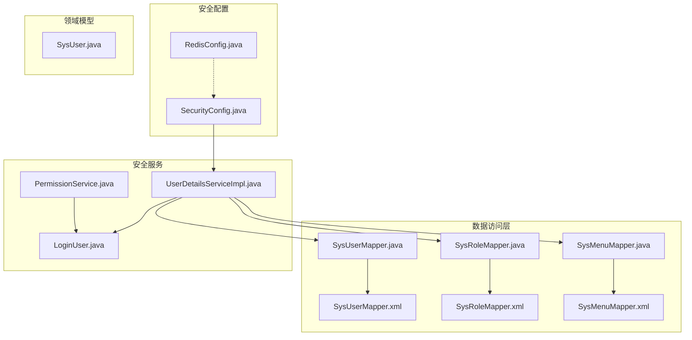
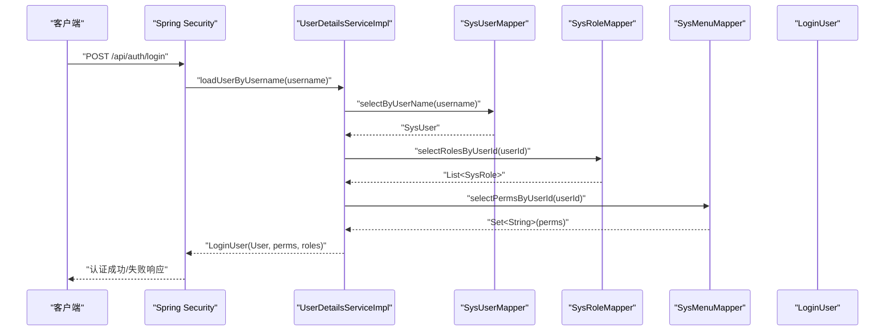
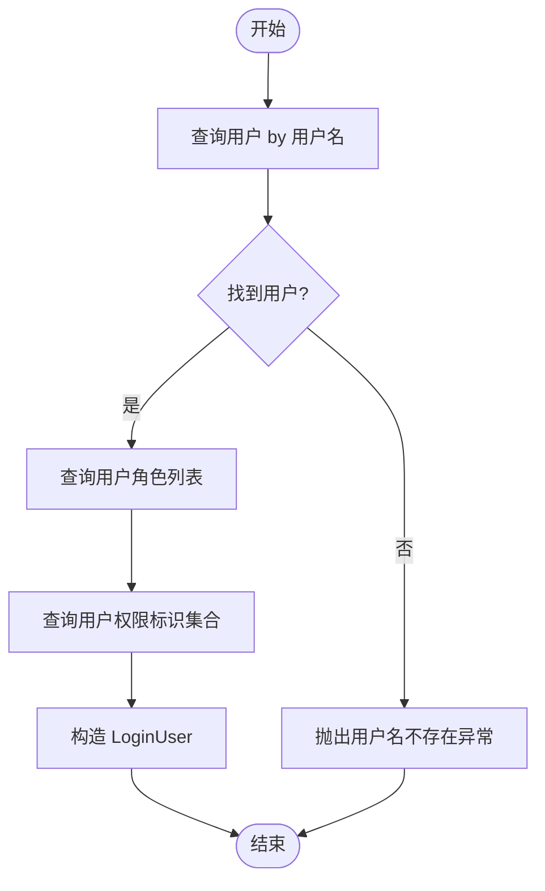
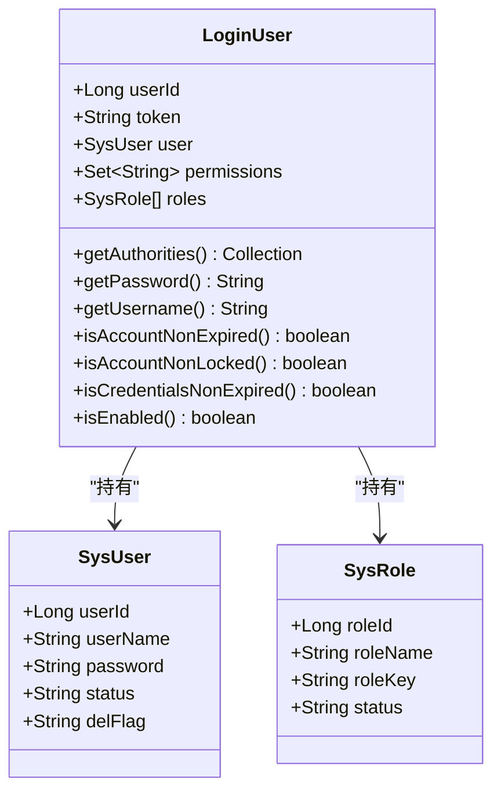
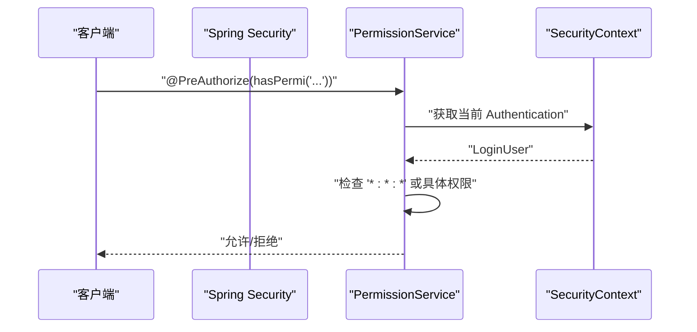
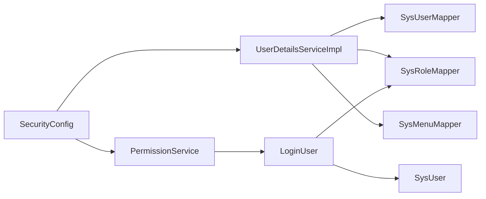

# 用户详情服务

<cite>
**本文引用的文件**
- [UserDetailsServiceImpl.java](file://task-manager-backend/src/main/java/com/taskmanager/security/UserDetailsServiceImpl.java)
- [LoginUser.java](file://task-manager-backend/src/main/java/com/taskmanager/security/LoginUser.java)
- [SysUser.java](file://task-manager-backend/src/main/java/com/taskmanager/domain/SysUser.java)
- [SysUserMapper.java](file://task-manager-backend/src/main/java/com/taskmanager/mapper/SysUserMapper.java)
- [SysRoleMapper.java](file://task-manager-backend/src/main/java/com/taskmanager/mapper/SysRoleMapper.java)
- [SysMenuMapper.java](file://task-manager-backend/src/main/java/com/taskmanager/mapper/SysMenuMapper.java)
- [SysUserMapper.xml](file://task-manager-backend/src/main/resources/mapper/SysUserMapper.xml)
- [SysRoleMapper.xml](file://task-manager-backend/src/main/resources/mapper/SysRoleMapper.xml)
- [SysMenuMapper.xml](file://task-manager-backend/src/main/resources/mapper/SysMenuMapper.xml)
- [SecurityConfig.java](file://task-manager-backend/src/main/java/com/taskmanager/config/SecurityConfig.java)
- [RedisConfig.java](file://task-manager-backend/src/main/java/com/taskmanager/config/RedisConfig.java)
- [application.yml](file://task-manager-backend/src/main/resources/application.yml)
- [PermissionService.java](file://task-manager-backend/src/main/java/com/taskmanager/security/PermissionService.java)
</cite>

## 目录
1. [简介](#简介)
2. [项目结构](#项目结构)
3. [核心组件](#核心组件)
4. [架构总览](#架构总览)
5. [详细组件分析](#详细组件分析)
6. [依赖分析](#依赖分析)
7. [性能考虑](#性能考虑)
8. [故障排查指南](#故障排查指南)
9. [结论](#结论)
10. [附录](#附录)

## 简介
本文件面向“用户详情服务”的技术文档，聚焦于 Spring Security 的用户认证与授权子系统，围绕以下目标展开：
- 解释 UserDetailsServiceImpl 的实现原理：如何从数据库加载用户信息、密码验证机制、账户状态检查等。
- 深入分析 UserDetails 接口的实现：用户权限信息的加载与缓存策略。
- 解释 LoginUser 封装类的设计思路：用户基本信息、权限集合、账户状态等属性的管理。
- 提供用户认证流程的详细说明：用户名密码验证、账户锁定检查、权限继承等逻辑。
- 包含用户信息缓存策略与性能优化建议，以及常见认证问题的排查方法。

## 项目结构
本项目采用前后端分离架构，后端基于 Spring Boot + Spring Security + MyBatis-Plus + MySQL + Redis。用户详情服务位于后端模块的 security 包中，配合 domain、mapper 层完成用户认证与授权。

图表来源
- [SecurityConfig.java:1-116](file://task-manager-backend/src/main/java/com/taskmanager/config/SecurityConfig.java#L1-L116)
- [RedisConfig.java:1-33](file://task-manager-backend/src/main/java/com/taskmanager/config/RedisConfig.java#L1-L33)
- [SysUser.java:1-80](file://task-manager-backend/src/main/java/com/taskmanager/domain/SysUser.java#L1-L80)
- [SysUserMapper.java:1-39](file://task-manager-backend/src/main/java/com/taskmanager/mapper/SysUserMapper.java#L1-L39)
- [SysRoleMapper.java:1-30](file://task-manager-backend/src/main/java/com/taskmanager/mapper/SysRoleMapper.java#L1-L30)
- [SysMenuMapper.java:1-29](file://task-manager-backend/src/main/java/com/taskmanager/mapper/SysMenuMapper.java#L1-L29)
- [SysUserMapper.xml:1-58](file://task-manager-backend/src/main/resources/mapper/SysUserMapper.xml#L1-L58)
- [SysRoleMapper.xml:1-42](file://task-manager-backend/src/main/resources/mapper/SysRoleMapper.xml#L1-L42)
- [SysMenuMapper.xml:1-56](file://task-manager-backend/src/main/resources/mapper/SysMenuMapper.xml#L1-L56)
- [UserDetailsServiceImpl.java:1-59](file://task-manager-backend/src/main/java/com/taskmanager/security/UserDetailsServiceImpl.java#L1-L59)
- [LoginUser.java:1-110](file://task-manager-backend/src/main/java/com/taskmanager/security/LoginUser.java#L1-L110)
- [PermissionService.java:1-64](file://task-manager-backend/src/main/java/com/taskmanager/security/PermissionService.java#L1-L64)

章节来源
- [SecurityConfig.java:1-116](file://task-manager-backend/src/main/java/com/taskmanager/config/SecurityConfig.java#L1-L116)
- [application.yml:1-79](file://task-manager-backend/src/main/resources/application.yml#L1-L79)

## 核心组件
- UserDetailsServiceImpl：实现 Spring Security 的 UserDetailsService，负责按用户名加载用户详情（含角色与权限），并返回 LoginUser。
- LoginUser：实现 UserDetails，封装用户实体、权限集合、角色列表，并提供账户状态判断与权限集合转换。
- SysUser/SysRole/SysMenu 及其 Mapper/XML：提供用户、角色、菜单权限的数据访问能力。
- SecurityConfig：配置无状态会话、放行规则、JWT 过滤器链、密码编码器等。
- PermissionService：基于 @PreAuthorize 的权限校验服务，支持通配符权限。

章节来源
- [UserDetailsServiceImpl.java:1-59](file://task-manager-backend/src/main/java/com/taskmanager/security/UserDetailsServiceImpl.java#L1-L59)
- [LoginUser.java:1-110](file://task-manager-backend/src/main/java/com/taskmanager/security/LoginUser.java#L1-L110)
- [SysUser.java:1-80](file://task-manager-backend/src/main/java/com/taskmanager/domain/SysUser.java#L1-L80)
- [SysRoleMapper.java:1-30](file://task-manager-backend/src/main/java/com/taskmanager/mapper/SysRoleMapper.java#L1-L30)
- [SysMenuMapper.java:1-29](file://task-manager-backend/src/main/java/com/taskmanager/mapper/SysMenuMapper.java#L1-L29)
- [SecurityConfig.java:1-116](file://task-manager-backend/src/main/java/com/taskmanager/config/SecurityConfig.java#L1-L116)
- [PermissionService.java:1-64](file://task-manager-backend/src/main/java/com/taskmanager/security/PermissionService.java#L1-L64)

## 架构总览
用户认证与授权的整体流程如下：
- 客户端提交用户名/密码。
- Spring Security 触发认证管理器，调用自定义 UserDetailsService（UserDetailsServiceImpl）。
- UserDetailsServiceImpl 从数据库加载用户、角色与权限，构造 LoginUser。
- Spring Security 使用 LoginUser 的密码与权限信息完成认证与授权。
- 权限校验通过 @PreAuthorize 或 PermissionService.hasPermi() 执行。

图表来源
- [UserDetailsServiceImpl.java:36-57](file://task-manager-backend/src/main/java/com/taskmanager/security/UserDetailsServiceImpl.java#L36-L57)
- [SysUserMapper.java:15-21](file://task-manager-backend/src/main/java/com/taskmanager/mapper/SysUserMapper.java#L15-L21)
- [SysRoleMapper.java:17-20](file://task-manager-backend/src/main/java/com/taskmanager/mapper/SysRoleMapper.java#L17-L20)
- [SysMenuMapper.java:23-24](file://task-manager-backend/src/main/java/com/taskmanager/mapper/SysMenuMapper.java#L23-L24)
- [LoginUser.java:47-52](file://task-manager-backend/src/main/java/com/taskmanager/security/LoginUser.java#L47-L52)

## 详细组件分析

### UserDetailsServiceImpl 实现原理
- 数据库加载顺序
  - 通过 SysUserMapper 按用户名查询用户，过滤逻辑删除标志。
  - 通过 SysRoleMapper 查询用户的角色列表。
  - 通过 SysMenuMapper 查询用户的权限标识集合（按钮级权限）。
- 返回 LoginUser：将用户、权限与角色封装为 UserDetails 实例，供 Spring Security 使用。
- 异常处理：当用户不存在时抛出 UsernameNotFoundException。

图表来源
- [UserDetailsServiceImpl.java:40-57](file://task-manager-backend/src/main/java/com/taskmanager/security/UserDetailsServiceImpl.java#L40-L57)
- [SysUserMapper.xml:29-33](file://task-manager-backend/src/main/resources/mapper/SysUserMapper.xml#L29-L33)
- [SysRoleMapper.xml:19-24](file://task-manager-backend/src/main/resources/mapper/SysRoleMapper.xml#L19-L24)
- [SysMenuMapper.xml:42-49](file://task-manager-backend/src/main/resources/mapper/SysMenuMapper.xml#L42-L49)

章节来源
- [UserDetailsServiceImpl.java:16-57](file://task-manager-backend/src/main/java/com/taskmanager/security/UserDetailsServiceImpl.java#L16-L57)
- [SysUserMapper.java:15-21](file://task-manager-backend/src/main/java/com/taskmanager/mapper/SysUserMapper.java#L15-L21)
- [SysRoleMapper.java:17-20](file://task-manager-backend/src/main/java/com/taskmanager/mapper/SysRoleMapper.java#L17-L20)
- [SysMenuMapper.java:23-24](file://task-manager-backend/src/main/java/com/taskmanager/mapper/SysMenuMapper.java#L23-L24)

### UserDetails 接口实现（LoginUser）
- 权限集合转换：将 Set<String> 权限转换为 GrantedAuthority 列表，供 Spring Security 校验。
- 账户状态判断：
  - isAccountNonExpired/isCredentialsNonExpired：始终返回 true。
  - isAccountNonLocked：始终返回 true（账户锁定检查由上层业务或全局策略处理）。
  - isEnabled：根据 SysUser.status 判断（0=启用，1=停用）。
- 其他字段：保存用户实体、权限集合、角色列表，并提供 token 字段用于会话标识。

图表来源
- [LoginUser.java:25-108](file://task-manager-backend/src/main/java/com/taskmanager/security/LoginUser.java#L25-L108)
- [SysUser.java:18-79](file://task-manager-backend/src/main/java/com/taskmanager/domain/SysUser.java#L18-L79)
- [SysRoleMapper.java:15-30](file://task-manager-backend/src/main/java/com/taskmanager/mapper/SysRoleMapper.java#L15-L30)

章节来源
- [LoginUser.java:17-108](file://task-manager-backend/src/main/java/com/taskmanager/security/LoginUser.java#L17-L108)
- [SysUser.java:11-79](file://task-manager-backend/src/main/java/com/taskmanager/domain/SysUser.java#L11-L79)

### 权限加载与缓存策略
- 权限来源：通过 SysMenuMapper.selectPermsByUserId 获取用户直接或间接拥有的权限标识集合（按钮级权限）。
- 缓存策略：当前实现未在 UserDetailsServiceImpl 中显式引入缓存；可结合 Redis 在认证成功后缓存 LoginUser 或权限集合，以降低数据库压力。
- 缓存键设计建议：以用户ID或用户名为前缀，结合过期时间与命名空间，避免与其他业务键冲突。

章节来源
- [SysMenuMapper.java:23-24](file://task-manager-backend/src/main/java/com/taskmanager/mapper/SysMenuMapper.java#L23-L24)
- [SysMenuMapper.xml:42-49](file://task-manager-backend/src/main/resources/mapper/SysMenuMapper.xml#L42-L49)
- [RedisConfig.java:18-31](file://task-manager-backend/src/main/java/com/taskmanager/config/RedisConfig.java#L18-L31)

### 认证流程与权限校验
- 认证流程
  - 客户端提交用户名/密码。
  - SecurityConfig 配置无状态会话与放行规则。
  - UserDetailsServiceImpl 加载用户详情并返回 LoginUser。
  - Spring Security 使用 LoginUser 的密码与权限完成认证。
- 权限校验
  - 方法级权限：通过 @PreAuthorize 调用 PermissionService.hasPermi(permission)。
  - 通配符权限：若用户权限包含 "*:*:*"，则视为超级管理员，拥有所有权限。
  - 未登录/无权限：统一由 SecurityConfig 的异常处理器返回 401/403。

图表来源
- [PermissionService.java:25-38](file://task-manager-backend/src/main/java/com/taskmanager/security/PermissionService.java#L25-L38)
- [SecurityConfig.java:47-97](file://task-manager-backend/src/main/java/com/taskmanager/config/SecurityConfig.java#L47-L97)

章节来源
- [PermissionService.java:1-64](file://task-manager-backend/src/main/java/com/taskmanager/security/PermissionService.java#L1-L64)
- [SecurityConfig.java:31-116](file://task-manager-backend/src/main/java/com/taskmanager/config/SecurityConfig.java#L31-L116)

## 依赖分析
- 组件耦合
  - UserDetailsServiceImpl 依赖三个 Mapper：SysUserMapper、SysRoleMapper、SysMenuMapper。
  - LoginUser 依赖 SysUser 与 SysRole，用于权限与状态判断。
  - PermissionService 依赖 SecurityContextHolder 获取当前用户上下文。
- 外部依赖
  - Spring Security：认证与授权框架。
  - MyBatis-Plus：ORM 映射与 SQL 执行。
  - Redis：可选缓存（当前未在认证流程中直接使用）。

图表来源
- [UserDetailsServiceImpl.java:24-34](file://task-manager-backend/src/main/java/com/taskmanager/security/UserDetailsServiceImpl.java#L24-L34)
- [LoginUser.java:35-42](file://task-manager-backend/src/main/java/com/taskmanager/security/LoginUser.java#L35-L42)
- [PermissionService.java:53-62](file://task-manager-backend/src/main/java/com/taskmanager/security/PermissionService.java#L53-L62)
- [SecurityConfig.java:36-42](file://task-manager-backend/src/main/java/com/taskmanager/config/SecurityConfig.java#L36-L42)

章节来源
- [UserDetailsServiceImpl.java:1-59](file://task-manager-backend/src/main/java/com/taskmanager/security/UserDetailsServiceImpl.java#L1-L59)
- [LoginUser.java:1-110](file://task-manager-backend/src/main/java/com/taskmanager/security/LoginUser.java#L1-L110)
- [PermissionService.java:1-64](file://task-manager-backend/src/main/java/com/taskmanager/security/PermissionService.java#L1-L64)
- [SecurityConfig.java:1-116](file://task-manager-backend/src/main/java/com/taskmanager/config/SecurityConfig.java#L1-L116)

## 性能考虑
- 数据库访问
  - 当前每次认证均执行三次查询：用户、角色、权限。建议在认证成功后将 LoginUser 或权限集合写入 Redis，并设置合理过期时间。
- 缓存键设计
  - 建议使用“用户ID/用户名 + 版本号/时间戳”作为键，避免并发更新导致的脏读。
- 连接池与序列化
  - application.yml 已配置 HikariCP 连接池与 MyBatis-Plus 日志输出，便于监控慢查询。
  - RedisConfig 使用 JSON 序列化，适合复杂对象缓存。

章节来源
- [application.yml:10-16](file://task-manager-backend/src/main/resources/application.yml#L10-L16)
- [application.yml:33-44](file://task-manager-backend/src/main/resources/application.yml#L33-L44)
- [RedisConfig.java:18-31](file://task-manager-backend/src/main/java/com/taskmanager/config/RedisConfig.java#L18-L31)

## 故障排查指南
- 用户名不存在
  - 现象：抛出 UsernameNotFoundException。
  - 排查：确认用户名拼写、大小写、逻辑删除标志（del_flag=0）。
- 密码不匹配
  - 现象：认证失败。
  - 排查：确认数据库中密码为 BCrypt 哈希；确保 SecurityConfig 配置了 BCryptPasswordEncoder。
- 账户被禁用
  - 现象：isEnabled 返回 false。
  - 排查：检查 SysUser.status 是否为“0（启用）”。
- 权限不足
  - 现象：@PreAuthorize 或 PermissionService.hasPermi 返回 false。
  - 排查：确认用户权限集合是否包含所需权限或通配符 "*:*:*"。
- 缓存一致性问题
  - 现象：权限变更后仍使用旧权限。
  - 排查：清理对应用户缓存键或缩短过期时间。

章节来源
- [UserDetailsServiceImpl.java:44-47](file://task-manager-backend/src/main/java/com/taskmanager/security/UserDetailsServiceImpl.java#L44-L47)
- [LoginUser.java:103-108](file://task-manager-backend/src/main/java/com/taskmanager/security/LoginUser.java#L103-L108)
- [PermissionService.java:25-38](file://task-manager-backend/src/main/java/com/taskmanager/security/PermissionService.java#L25-L38)
- [SecurityConfig.java:102-105](file://task-manager-backend/src/main/java/com/taskmanager/config/SecurityConfig.java#L102-L105)

## 结论
本用户详情服务通过 UserDetailsServiceImpl 将用户、角色与权限整合为 LoginUser，配合 Spring Security 完成认证与授权。当前实现简洁清晰，建议在生产环境引入 Redis 缓存以提升性能，并完善缓存失效与一致性策略。权限校验可通过 @PreAuthorize 与 PermissionService 组合实现细粒度控制。

## 附录
- 关键配置参考
  - 数据源与连接池：application.yml 中的 spring.datasource.hikari.*。
  - MyBatis-Plus：application.yml 中的 spring.mybatis-plus.*。
  - Redis：application.yml 中的 spring.data.redis.* 与 RedisConfig。
  - JWT 与安全：application.yml 中的 jwt.* 与 SecurityConfig。

章节来源
- [application.yml:5-16](file://task-manager-backend/src/main/resources/application.yml#L5-L16)
- [application.yml:18-31](file://task-manager-backend/src/main/resources/application.yml#L18-L31)
- [application.yml:33-44](file://task-manager-backend/src/main/resources/application.yml#L33-L44)
- [application.yml:51-56](file://task-manager-backend/src/main/resources/application.yml#L51-L56)
- [SecurityConfig.java:47-97](file://task-manager-backend/src/main/java/com/taskmanager/config/SecurityConfig.java#L47-L97)
- [RedisConfig.java:18-31](file://task-manager-backend/src/main/java/com/taskmanager/config/RedisConfig.java#L18-L31)