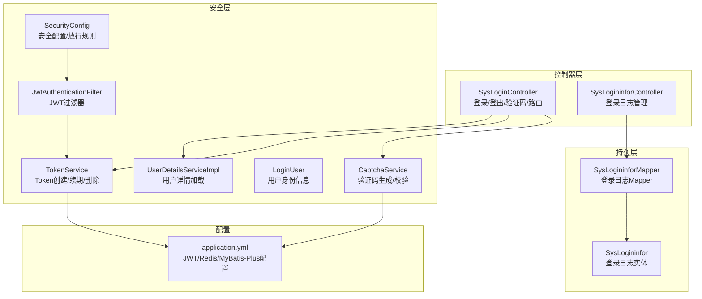
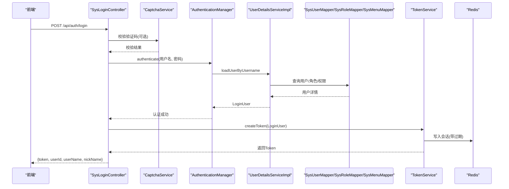
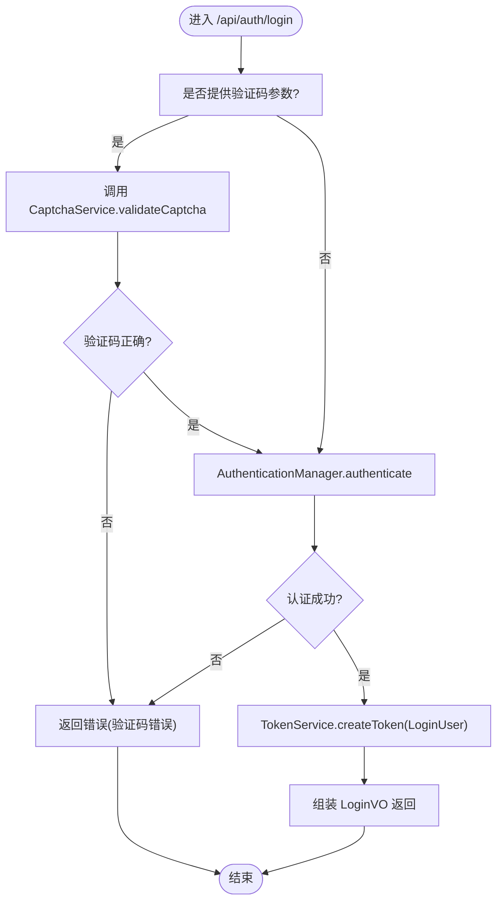
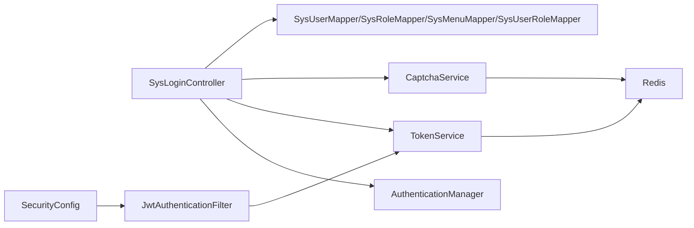

# 登录控制器

<cite>
**本文引用的文件**
- [SysLoginController.java](file://task-manager-backend/src/main/java/com/taskmanager/controller/SysLoginController.java)
- [TokenService.java](file://task-manager-backend/src/main/java/com/taskmanager/security/TokenService.java)
- [CaptchaService.java](file://task-manager-backend/src/main/java/com/taskmanager/security/CaptchaService.java)
- [LoginUser.java](file://task-manager-backend/src/main/java/com/taskmanager/security/LoginUser.java)
- [SecurityConfig.java](file://task-manager-backend/src/main/java/com/taskmanager/config/SecurityConfig.java)
- [JwtAuthenticationFilter.java](file://task-manager-backend/src/main/java/com/taskmanager/security/JwtAuthenticationFilter.java)
- [SysLogininfor.java](file://task-manager-backend/src/main/java/com/taskmanager/domain/SysLogininfor.java)
- [SysLogininforMapper.java](file://task-manager-backend/src/main/java/com/taskmanager/mapper/SysLogininforMapper.java)
- [SysLogininforController.java](file://task-manager-backend/src/main/java/com/taskmanager/controller/SysLogininforController.java)
- [application.yml](file://task-manager-backend/src/main/resources/application.yml)
- [SysLoginControllerTest.java](file://task-manager-backend/src/test/java/com/taskmanager/controller/SysLoginControllerTest.java)
</cite>

## 目录
1. [简介](#简介)
2. [项目结构](#项目结构)
3. [核心组件](#核心组件)
4. [架构总览](#架构总览)
5. [详细组件分析](#详细组件分析)
6. [依赖分析](#依赖分析)
7. [性能考虑](#性能考虑)
8. [故障排查指南](#故障排查指南)
9. [结论](#结论)
10. [附录](#附录)

## 简介
本文件为登录控制器的技术文档，围绕 SysLoginController 的实现进行全面解析，涵盖以下主题：
- 用户登录接口设计与请求参数验证
- 登录成功后的 Token 发放与会话管理
- 登录失败处理机制（密码错误、账户状态异常、验证码错误等）
- 登录日志记录（成功/失败、IP 地址、浏览器与操作系统识别）
- 登录接口 API 文档（请求格式、响应结构、错误码说明）
- 登录安全措施与防暴力破解策略

## 项目结构
后端采用 Spring Boot + Spring Security + Redis + MyBatis-Plus 技术栈，登录相关模块集中于 controller、security、config、domain、mapper 层，并通过统一结果封装 Result 返回。

图表来源
- [SysLoginController.java:103-135](file://task-manager-backend/src/main/java/com/taskmanager/controller/SysLoginController.java#L103-L135)
- [TokenService.java:34-41](file://task-manager-backend/src/main/java/com/taskmanager/security/TokenService.java#L34-L41)
- [CaptchaService.java:39-50](file://task-manager-backend/src/main/java/com/taskmanager/security/CaptchaService.java#L39-L50)
- [SecurityConfig.java:47-97](file://task-manager-backend/src/main/java/com/taskmanager/config/SecurityConfig.java#L47-L97)
- [JwtAuthenticationFilter.java:37-57](file://task-manager-backend/src/main/java/com/taskmanager/security/JwtAuthenticationFilter.java#L37-L57)
- [SysLogininfor.java:16-49](file://task-manager-backend/src/main/java/com/taskmanager/domain/SysLogininfor.java#L16-L49)
- [SysLogininforMapper.java:11-12](file://task-manager-backend/src/main/java/com/taskmanager/mapper/SysLogininforMapper.java#L11-L12)
- [application.yml:18-57](file://task-manager-backend/src/main/resources/application.yml#L18-L57)

章节来源
- [SysLoginController.java:103-135](file://task-manager-backend/src/main/java/com/taskmanager/controller/SysLoginController.java#L103-L135)
- [SecurityConfig.java:76-92](file://task-manager-backend/src/main/java/com/taskmanager/config/SecurityConfig.java#L76-L92)
- [application.yml:51-57](file://task-manager-backend/src/main/resources/application.yml#L51-L57)

## 核心组件
- 登录控制器 SysLoginController：提供 /api/auth/login、/api/auth/logout、/api/auth/captcha、/api/auth/getInfo、/api/auth/getRouters 等接口，负责登录认证、验证码、用户信息与动态路由返回。
- TokenService：基于 Redis 的 Token 管理，负责创建、续期与删除 Token，并以统一键前缀存储用户会话。
- CaptchaService：生成图形验证码并校验，验证码存入 Redis，带过期时间，支持忽略大小写比较。
- SecurityConfig：配置无状态会话、放行登录/注册/验证码等接口、JWT 过滤器链与认证入口点。
- JwtAuthenticationFilter：从请求头提取 Token，从 Redis 读取用户信息，构建认证上下文并自动续期。
- 登录日志 SysLogininfor/SysLogininforMapper/SysLogininforController：记录登录成功/失败、IP、浏览器、操作系统、提示信息等；提供分页查询与清理能力。

章节来源
- [SysLoginController.java:103-197](file://task-manager-backend/src/main/java/com/taskmanager/controller/SysLoginController.java#L103-L197)
- [TokenService.java:34-80](file://task-manager-backend/src/main/java/com/taskmanager/security/TokenService.java#L34-L80)
- [CaptchaService.java:39-112](file://task-manager-backend/src/main/java/com/taskmanager/security/CaptchaService.java#L39-L112)
- [SecurityConfig.java:47-97](file://task-manager-backend/src/main/java/com/taskmanager/config/SecurityConfig.java#L47-L97)
- [JwtAuthenticationFilter.java:37-57](file://task-manager-backend/src/main/java/com/taskmanager/security/JwtAuthenticationFilter.java#L37-L57)
- [SysLogininfor.java:16-49](file://task-manager-backend/src/main/java/com/taskmanager/domain/SysLogininfor.java#L16-L49)
- [SysLogininforMapper.java:11-12](file://task-manager-backend/src/main/java/com/taskmanager/mapper/SysLogininforMapper.java#L11-L12)
- [SysLogininforController.java:27-75](file://task-manager-backend/src/main/java/com/taskmanager/controller/SysLogininforController.java#L27-L75)

## 架构总览
登录认证采用“无状态 Token + Redis 会话”的模式：
- 前端请求 /api/auth/login，携带用户名/密码（可选验证码）。
- 控制器先校验验证码（若提供），再交由 Spring Security 的 AuthenticationManager 进行认证。
- 认证通过后，使用 TokenService 将用户信息写入 Redis 并返回 Token。
- 前端后续请求在请求头携带 Authorization: Bearer Token，JWT 过滤器从 Redis 读取用户信息并注入认证上下文。

图表来源
- [SysLoginController.java:103-135](file://task-manager-backend/src/main/java/com/taskmanager/controller/SysLoginController.java#L103-L135)
- [CaptchaService.java:99-112](file://task-manager-backend/src/main/java/com/taskmanager/security/CaptchaService.java#L99-L112)
- [UserDetailsServiceImpl.java:39-57](file://task-manager-backend/src/main/java/com/taskmanager/security/UserDetailsServiceImpl.java#L39-L57)
- [TokenService.java:34-41](file://task-manager-backend/src/main/java/com/taskmanager/security/TokenService.java#L34-L41)
- [application.yml:51-57](file://task-manager-backend/src/main/resources/application.yml#L51-L57)

## 详细组件分析

### 登录接口实现与流程
- 接口路径：/api/auth/login
- 方法：POST
- 请求体：LoginDTO（包含 userName、password、uuid、code、rememberMe）
- 处理逻辑：
  1) 若提供 uuid 与 code，则调用 CaptchaService.validateCaptcha 校验验证码。
  2) 使用 AuthenticationManager.authenticate(username, password) 进行认证。
  3) 认证成功后，从 Authentication.getPrincipal() 获取 LoginUser。
  4) 调用 TokenService.createToken(LoginUser) 生成 Token 并写入 Redis。
  5) 组装 LoginVO 返回 token、userId、userName、nickName。

图表来源
- [SysLoginController.java:103-135](file://task-manager-backend/src/main/java/com/taskmanager/controller/SysLoginController.java#L103-L135)
- [CaptchaService.java:99-112](file://task-manager-backend/src/main/java/com/taskmanager/security/CaptchaService.java#L99-L112)
- [TokenService.java:34-41](file://task-manager-backend/src/main/java/com/taskmanager/security/TokenService.java#L34-L41)

章节来源
- [SysLoginController.java:103-135](file://task-manager-backend/src/main/java/com/taskmanager/controller/SysLoginController.java#L103-L135)

### 登录失败处理机制
- 验证码错误：CaptchaService.validateCaptcha 抛出 CaptchaException，SysLoginController 捕获并返回 500 错误。
- 用户名不存在或密码错误：AuthenticationManager.authenticate 抛出异常，最终由 SecurityConfig 的认证入口点返回 401。
- 账户状态异常：UserDetailsServiceImpl 中 LoginUser.isEnabled() 基于用户状态字段判断，禁用状态将导致认证失败。
- 登出：SysLoginController.logout 从 Redis 删除 Token 并清空 Security 上下文。

章节来源
- [CaptchaService.java:99-112](file://task-manager-backend/src/main/java/com/taskmanager/security/CaptchaService.java#L99-L112)
- [UserDetailsServiceImpl.java:106-108](file://task-manager-backend/src/main/java/com/taskmanager/security/LoginUser.java#L106-L108)
- [SecurityConfig.java:59-74](file://task-manager-backend/src/main/java/com/taskmanager/config/SecurityConfig.java#L59-L74)
- [SysLoginController.java:137-148](file://task-manager-backend/src/main/java/com/taskmanager/controller/SysLoginController.java#L137-L148)

### Token 发放与会话管理
- TokenService.createToken：生成 UUID 形式的 token，设置 LoginUser.token，并将 LoginUser 写入 Redis，键前缀为 login_tokens:，过期时间来自 jwt.expiration。
- JwtAuthenticationFilter：从请求头 Authorization 中提取 Bearer Token，从 Redis 读取 LoginUser，构建 UsernamePasswordAuthenticationToken 注入 SecurityContext，并自动续期。
- 登出时调用 TokenService.delLoginUser 删除 Redis 中的会话。

章节来源
- [TokenService.java:34-80](file://task-manager-backend/src/main/java/com/taskmanager/security/TokenService.java#L34-L80)
- [JwtAuthenticationFilter.java:37-57](file://task-manager-backend/src/main/java/com/taskmanager/security/JwtAuthenticationFilter.java#L37-L57)
- [application.yml:51-57](file://task-manager-backend/src/main/resources/application.yml#L51-L57)

### 登录日志记录
- 登录日志实体 SysLogininfor 包含：infoId、userName、ipaddr、loginLocation、browser、os、status、msg、loginTime。
- 登录日志管理接口 SysLogininforController 提供分页查询、详情、批量删除、清空与预留的账号解锁接口。
- 日志记录建议：可在登录控制器中增加登录日志写入（成功/失败、IP、UA 解析浏览器与操作系统、提示消息），并调用 SysLogininforMapper.insert。

章节来源
- [SysLogininfor.java:16-49](file://task-manager-backend/src/main/java/com/taskmanager/domain/SysLogininfor.java#L16-L49)
- [SysLogininforMapper.java:11-12](file://task-manager-backend/src/main/java/com/taskmanager/mapper/SysLogininforMapper.java#L11-L12)
- [SysLogininforController.java:27-85](file://task-manager-backend/src/main/java/com/taskmanager/controller/SysLogininforController.java#L27-L85)

### API 文档

- 获取验证码
  - 方法：GET
  - 路径：/api/auth/captcha
  - 响应：包含 uuid 与 base64 图片数据
  - 用途：生产环境建议在登录时强制传入 uuid/code

- 用户登录
  - 方法：POST
  - 路径：/api/auth/login
  - 请求体：LoginDTO
    - userName: string，必填
    - password: string，必填
    - uuid: string，可选（配合验证码）
    - code: string，可选（配合验证码）
    - rememberMe: boolean，可选
  - 成功响应：包含 token、userId、userName、nickName
  - 失败响应：验证码错误返回 500；认证失败返回 401

- 用户登出
  - 方法：POST
  - 路径：/api/auth/logout
  - 请求头：Authorization: Bearer {token}
  - 成功响应：空数据

- 获取当前用户信息
  - 方法：GET
  - 路径：/api/auth/getInfo
  - 请求头：Authorization: Bearer {token}
  - 成功响应：user、roles、permissions

- 获取动态路由
  - 方法：GET
  - 路径：/api/auth/getRouters
  - 请求头：Authorization: Bearer {token}
  - 成功响应：前端路由结构（名称、路径、组件、元信息、子节点）

章节来源
- [SysLoginController.java:95-197](file://task-manager-backend/src/main/java/com/taskmanager/controller/SysLoginController.java#L95-L197)
- [application.yml:51-57](file://task-manager-backend/src/main/resources/application.yml#L51-L57)

### 登录安全措施与防暴力破解
- 验证码防护：生产环境强制要求登录时提供 uuid 与 code，验证码生成与校验由 CaptchaService 完成，过期时间短，校验后即删除。
- 无状态会话：基于 Token 的无状态认证，避免服务端会话膨胀。
- Redis 会话：Token 与用户信息存储在 Redis，便于横向扩展与统一登出。
- 认证入口点：未认证访问受保护接口返回 401，避免默认重定向。
- 密码加密：使用 BCryptPasswordEncoder 对密码进行加密存储。
- 防暴力破解建议（扩展点）：
  - 在 Redis 中对同一 IP/用户名增加失败计数与封禁阈值（预留 SysLogininforController.unlock 接口）。
  - 对频繁登录请求增加限流（如基于 IP 的 QPS 限制）。
  - 登录失败时延迟响应或引入挑战-响应机制。

章节来源
- [CaptchaService.java:39-112](file://task-manager-backend/src/main/java/com/taskmanager/security/CaptchaService.java#L39-L112)
- [SecurityConfig.java:59-74](file://task-manager-backend/src/main/java/com/taskmanager/config/SecurityConfig.java#L59-L74)
- [application.yml:101-105](file://task-manager-backend/src/main/resources/application.yml#L101-L105)
- [SysLogininforController.java:77-85](file://task-manager-backend/src/main/java/com/taskmanager/controller/SysLogininforController.java#L77-L85)

## 依赖分析
- 控制器依赖：
  - AuthenticationManager：触发认证流程
  - TokenService：创建/续期/删除 Token
  - CaptchaService：验证码生成与校验
  - SysMenuMapper/SysRoleMapper/SysUserMapper/SysUserRoleMapper：用户、角色、菜单、权限数据查询
  - PasswordEncoder：密码加密
- 安全层依赖：
  - SecurityConfig：放行规则、无状态会话、认证入口点
  - JwtAuthenticationFilter：从请求头提取 Token 并注入认证上下文
  - LoginUser：实现 UserDetails，承载用户权限与角色
- 存储依赖：
  - Redis：验证码与登录会话缓存
  - MySQL：登录日志表 sys_logininfor

图表来源
- [SysLoginController.java:35-57](file://task-manager-backend/src/main/java/com/taskmanager/controller/SysLoginController.java#L35-L57)
- [TokenService.java:25-26](file://task-manager-backend/src/main/java/com/taskmanager/security/TokenService.java#L25-L26)
- [CaptchaService.java:33-34](file://task-manager-backend/src/main/java/com/taskmanager/security/CaptchaService.java#L33-L34)
- [SecurityConfig.java:36-42](file://task-manager-backend/src/main/java/com/taskmanager/config/SecurityConfig.java#L36-L42)
- [JwtAuthenticationFilter.java:31-35](file://task-manager-backend/src/main/java/com/taskmanager/security/JwtAuthenticationFilter.java#L31-L35)

章节来源
- [SysLoginController.java:35-57](file://task-manager-backend/src/main/java/com/taskmanager/controller/SysLoginController.java#L35-L57)
- [SecurityConfig.java:36-42](file://task-manager-backend/src/main/java/com/taskmanager/config/SecurityConfig.java#L36-L42)

## 性能考虑
- Token 基于 Redis 存储，读写开销低，适合高并发场景。
- 登录流程仅涉及一次 Redis 写入与一次认证，整体延迟较低。
- 建议：
  - 合理设置 jwt.expiration，平衡安全性与用户体验。
  - 对验证码与登录接口开启必要的限流策略，避免突发流量冲击。
  - 使用连接池与合适的超时配置，确保 Redis 与数据库稳定。

## 故障排查指南
- 登录返回 401 未认证
  - 检查请求头 Authorization 是否正确携带 Bearer Token
  - 确认 Token 未过期（Redis 中 login_tokens: 前缀键是否存在）
  - 查看 SecurityConfig 的认证入口点是否被触发
- 验证码错误
  - 确认 uuid 与 code 是否匹配，验证码是否过期
  - 检查 Redis 中 captcha_codes: 前缀键是否被提前删除
- 登录成功但获取用户信息/路由返回 401
  - 确认 JwtAuthenticationFilter 已正确注入认证上下文
  - 检查 TokenService.refreshToken 是否正常续期
- 登录日志缺失
  - 在登录控制器中补充登录日志写入逻辑（成功/失败、IP、UA 解析、提示消息）

章节来源
- [SysLoginController.java:137-197](file://task-manager-backend/src/main/java/com/taskmanager/controller/SysLoginController.java#L137-L197)
- [CaptchaService.java:99-112](file://task-manager-backend/src/main/java/com/taskmanager/security/CaptchaService.java#L99-L112)
- [JwtAuthenticationFilter.java:37-57](file://task-manager-backend/src/main/java/com/taskmanager/security/JwtAuthenticationFilter.java#L37-L57)
- [TokenService.java:67-71](file://task-manager-backend/src/main/java/com/taskmanager/security/TokenService.java#L67-L71)

## 结论
SysLoginController 通过 Spring Security 与 Redis 实现了安全、高效的无状态登录流程。验证码校验、Token 管理、JWT 过滤器与统一异常处理共同构成了完整的认证体系。建议在现有基础上完善登录日志与防暴力破解策略，进一步提升系统的安全性与可观测性。

## 附录

### 登录接口测试要点（参考）
- 获取验证码：断言返回 uuid 与图片数据
- 登录成功：断言返回 token、用户信息
- 登录带验证码：断言验证码校验通过后登录成功
- 验证码错误：断言返回 500 与错误消息
- 登出：断言 Redis 中会话被删除
- 获取用户信息/路由：断言返回正确的角色与权限

章节来源
- [SysLoginControllerTest.java:114-308](file://task-manager-backend/src/test/java/com/taskmanager/controller/SysLoginControllerTest.java#L114-L308)