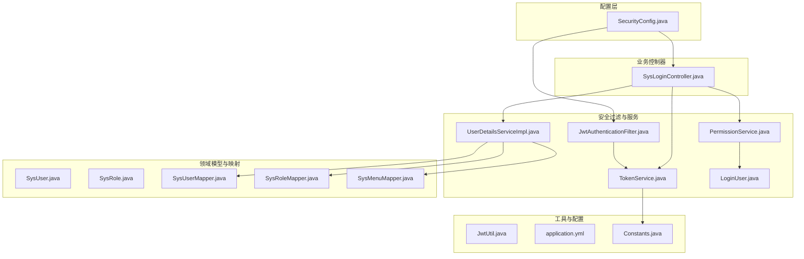
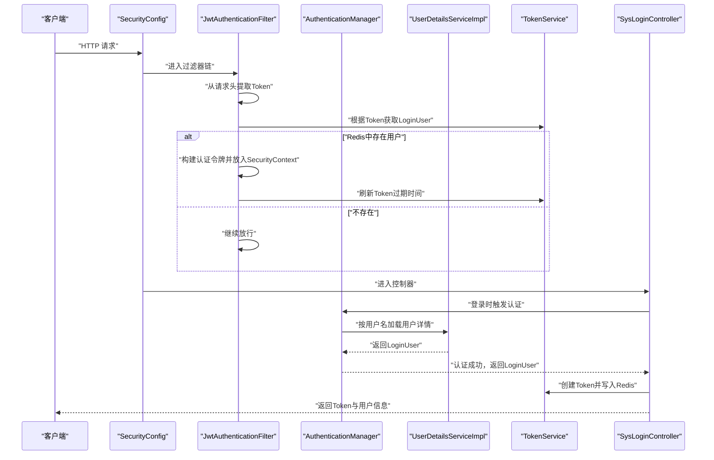
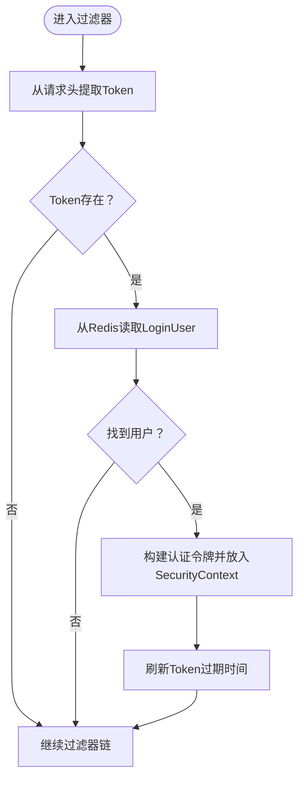
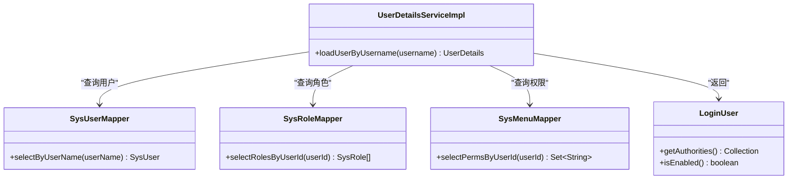
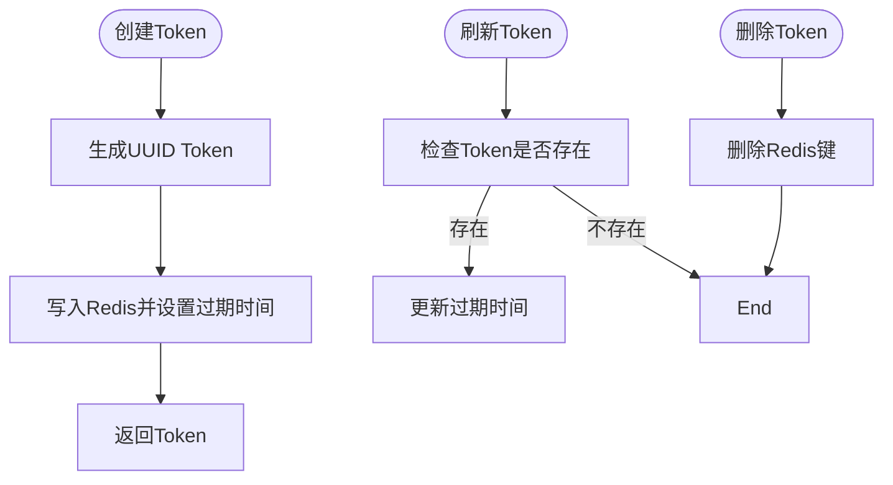
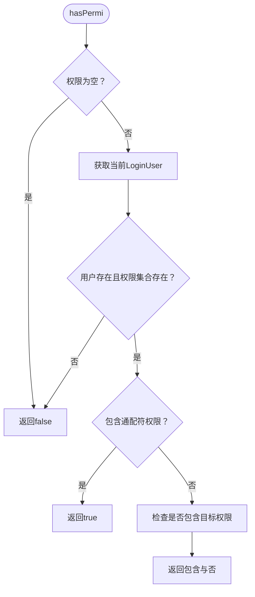
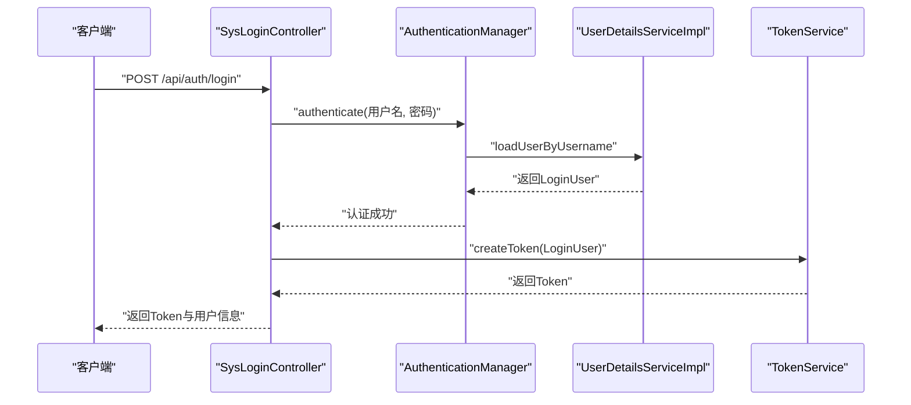
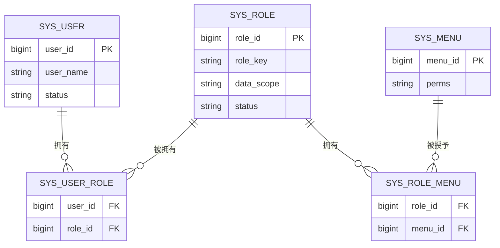
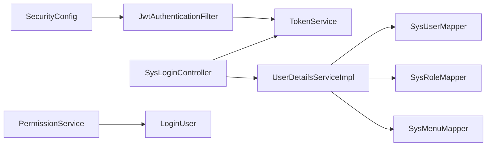

# 认证授权系统

<cite>
**本文引用的文件**
- [JwtAuthenticationFilter.java](file://task-manager-backend/src/main/java/com/taskmanager/security/JwtAuthenticationFilter.java)
- [UserDetailsServiceImpl.java](file://task-manager-backend/src/main/java/com/taskmanager/security/UserDetailsServiceImpl.java)
- [PermissionService.java](file://task-manager-backend/src/main/java/com/taskmanager/security/PermissionService.java)
- [TokenService.java](file://task-manager-backend/src/main/java/com/taskmanager/security/TokenService.java)
- [LoginUser.java](file://task-manager-backend/src/main/java/com/taskmanager/security/LoginUser.java)
- [JwtUtil.java](file://task-manager-backend/src/main/java/com/taskmanager/utils/JwtUtil.java)
- [SecurityConfig.java](file://task-manager-backend/src/main/java/com/taskmanager/config/SecurityConfig.java)
- [SysLoginController.java](file://task-manager-backend/src/main/java/com/taskmanager/controller/SysLoginController.java)
- [SysUser.java](file://task-manager-backend/src/main/java/com/taskmanager/domain/SysUser.java)
- [SysRole.java](file://task-manager-backend/src/main/java/com/taskmanager/domain/SysRole.java)
- [SysUserMapper.java](file://task-manager-backend/src/main/java/com/taskmanager/mapper/SysUserMapper.java)
- [SysRoleMapper.java](file://task-manager-backend/src/main/java/com/taskmanager/mapper/SysRoleMapper.java)
- [SysMenuMapper.java](file://task-manager-backend/src/main/java/com/taskmanager/mapper/SysMenuMapper.java)
- [application.yml](file://task-manager-backend/src/main/resources/application.yml)
- [Constants.java](file://task-manager-backend/src/main/java/com/taskmanager/common/constant/Constants.java)
</cite>

## 目录
1. [简介](#简介)
2. [项目结构](#项目结构)
3. [核心组件](#核心组件)
4. [架构总览](#架构总览)
5. [详细组件分析](#详细组件分析)
6. [依赖分析](#依赖分析)
7. [性能考虑](#性能考虑)
8. [故障排查指南](#故障排查指南)
9. [结论](#结论)
10. [附录](#附录)

## 简介
本文件面向CodeBuddy任务管理系统中的认证授权体系，系统采用基于Token的无状态认证模式，结合Spring Security与Redis实现用户登录、鉴权、权限控制与会话续期。文档重点覆盖以下方面：
- JWT认证机制的完整流程：登录验证、Token生成与验证、Token刷新与续期
- JwtAuthenticationFilter的拦截逻辑与在请求到达Controller前的身份验证过程
- UserDetailsServiceImpl的用户详情加载、密码验证与账户状态检查
- PermissionService的权限验证机制：角色权限匹配、接口权限控制、数据权限过滤
- RBAC权限模型的实现：角色-权限关联、用户-角色关联的设计与查询优化
- 安全配置最佳实践与常见安全漏洞的防护

## 项目结构
后端采用分层架构，认证授权相关代码集中在security包与config包中，并通过控制器与Mapper完成登录、权限查询与路由构建。

图表来源
- [SecurityConfig.java:47-97](file://task-manager-backend/src/main/java/com/taskmanager/config/SecurityConfig.java#L47-L97)
- [JwtAuthenticationFilter.java:37-57](file://task-manager-backend/src/main/java/com/taskmanager/security/JwtAuthenticationFilter.java#L37-L57)
- [TokenService.java:34-81](file://task-manager-backend/src/main/java/com/taskmanager/security/TokenService.java#L34-L81)
- [UserDetailsServiceImpl.java:39-57](file://task-manager-backend/src/main/java/com/taskmanager/security/UserDetailsServiceImpl.java#L39-L57)
- [SysLoginController.java:103-135](file://task-manager-backend/src/main/java/com/taskmanager/controller/SysLoginController.java#L103-L135)
- [PermissionService.java:25-38](file://task-manager-backend/src/main/java/com/taskmanager/security/PermissionService.java#L25-L38)
- [SysUser.java:18-80](file://task-manager-backend/src/main/java/com/taskmanager/domain/SysUser.java#L18-L80)
- [SysRole.java:18-65](file://task-manager-backend/src/main/java/com/taskmanager/domain/SysRole.java#L18-L65)
- [application.yml:51-57](file://task-manager-backend/src/main/resources/application.yml#L51-L57)
- [Constants.java:28-32](file://task-manager-backend/src/main/java/com/taskmanager/common/constant/Constants.java#L28-L32)

章节来源
- [SecurityConfig.java:47-97](file://task-manager-backend/src/main/java/com/taskmanager/config/SecurityConfig.java#L47-L97)
- [application.yml:51-57](file://task-manager-backend/src/main/resources/application.yml#L51-L57)

## 核心组件
- JwtAuthenticationFilter：在请求进入Controller前从请求头提取Token，从Redis解析用户信息，构建认证令牌并设置到Security上下文，同时进行Token自动续期。
- UserDetailsServiceImpl：实现UserDetailsService接口，按用户名加载用户、角色与权限，返回LoginUser对象供Spring Security使用。
- TokenService：负责Token创建、Redis存储、过期时间刷新、登出删除等会话生命周期管理。
- PermissionService：提供权限校验能力，支持通配符权限与@PreAuthorize注解配合使用。
- LoginUser：实现UserDetails接口，封装用户实体、权限集合与角色列表，并提供账户状态判断。
- SecurityConfig：配置无状态会话、放行路径、异常处理、密码编码器与过滤器链。
- SysLoginController：提供登录、登出、获取用户信息与动态路由等接口，完成认证与Token发放。
- JwtUtil：提供JWT签名、验证与载荷解析能力（与当前实现的Redis会话策略并存）。
- Mapper与Domain：SysUser、SysRole、SysMenu及其Mapper支撑用户、角色、权限的数据查询。

章节来源
- [JwtAuthenticationFilter.java:37-57](file://task-manager-backend/src/main/java/com/taskmanager/security/JwtAuthenticationFilter.java#L37-L57)
- [UserDetailsServiceImpl.java:39-57](file://task-manager-backend/src/main/java/com/taskmanager/security/UserDetailsServiceImpl.java#L39-L57)
- [TokenService.java:34-81](file://task-manager-backend/src/main/java/com/taskmanager/security/TokenService.java#L34-L81)
- [PermissionService.java:25-38](file://task-manager-backend/src/main/java/com/taskmanager/security/PermissionService.java#L25-L38)
- [LoginUser.java:58-108](file://task-manager-backend/src/main/java/com/taskmanager/security/LoginUser.java#L58-L108)
- [SecurityConfig.java:47-97](file://task-manager-backend/src/main/java/com/taskmanager/config/SecurityConfig.java#L47-L97)
- [SysLoginController.java:103-135](file://task-manager-backend/src/main/java/com/taskmanager/controller/SysLoginController.java#L103-L135)
- [JwtUtil.java:39-86](file://task-manager-backend/src/main/java/com/taskmanager/utils/JwtUtil.java#L39-L86)

## 架构总览
系统采用“请求-过滤器-控制器-服务-持久层”的标准流程，认证阶段在过滤器中完成，鉴权在方法级别通过注解与权限服务完成。

图表来源
- [SecurityConfig.java:47-97](file://task-manager-backend/src/main/java/com/taskmanager/config/SecurityConfig.java#L47-L97)
- [JwtAuthenticationFilter.java:37-57](file://task-manager-backend/src/main/java/com/taskmanager/security/JwtAuthenticationFilter.java#L37-L57)
- [SysLoginController.java:103-135](file://task-manager-backend/src/main/java/com/taskmanager/controller/SysLoginController.java#L103-L135)
- [UserDetailsServiceImpl.java:39-57](file://task-manager-backend/src/main/java/com/taskmanager/security/UserDetailsServiceImpl.java#L39-L57)
- [TokenService.java:34-81](file://task-manager-backend/src/main/java/com/taskmanager/security/TokenService.java#L34-L81)

## 详细组件分析

### JwtAuthenticationFilter：请求拦截与身份注入
- 功能要点
  - 从请求头读取配置的Header与前缀，提取纯Token字符串
  - 通过TokenService从Redis读取LoginUser
  - 若存在用户信息，构造UsernamePasswordAuthenticationToken并设置到SecurityContext
  - 调用TokenService刷新Token过期时间，实现自动续期
  - 继续执行后续过滤器链
- 关键行为
  - 仅在请求头存在有效Token时才进行身份注入
  - 未认证请求将被SecurityConfig的异常处理器统一返回401/403
- 与配置的关系
  - 在SecurityConfig中作为前置过滤器插入，确保在UsernamePasswordAuthenticationFilter之前执行

图表来源
- [JwtAuthenticationFilter.java:37-57](file://task-manager-backend/src/main/java/com/taskmanager/security/JwtAuthenticationFilter.java#L37-L57)
- [TokenService.java:49-71](file://task-manager-backend/src/main/java/com/taskmanager/security/TokenService.java#L49-L71)

章节来源
- [JwtAuthenticationFilter.java:37-57](file://task-manager-backend/src/main/java/com/taskmanager/security/JwtAuthenticationFilter.java#L37-L57)
- [SecurityConfig.java:93-94](file://task-manager-backend/src/main/java/com/taskmanager/config/SecurityConfig.java#L93-L94)

### UserDetailsServiceImpl：用户详情加载与权限装配
- 功能要点
  - 根据用户名查询SysUser
  - 查询用户对应的角色列表
  - 查询用户权限标识集合（通过角色关联的菜单权限）
  - 返回LoginUser对象，其中包含用户、角色与权限
- 账户状态检查
  - isEnabled依据SysUser.status字段判断（0表示启用）

图表来源
- [UserDetailsServiceImpl.java:39-57](file://task-manager-backend/src/main/java/com/taskmanager/security/UserDetailsServiceImpl.java#L39-L57)
- [SysUserMapper.java:21](file://task-manager-backend/src/main/java/com/taskmanager/mapper/SysUserMapper.java#L21)
- [SysRoleMapper.java:20](file://task-manager-backend/src/main/java/com/taskmanager/mapper/SysRoleMapper.java#L20)
- [SysMenuMapper.java:24](file://task-manager-backend/src/main/java/com/taskmanager/mapper/SysMenuMapper.java#L24)
- [LoginUser.java:58-108](file://task-manager-backend/src/main/java/com/taskmanager/security/LoginUser.java#L58-L108)

章节来源
- [UserDetailsServiceImpl.java:39-57](file://task-manager-backend/src/main/java/com/taskmanager/security/UserDetailsServiceImpl.java#L39-L57)
- [SysUser.java:50-54](file://task-manager-backend/src/main/java/com/taskmanager/domain/SysUser.java#L50-L54)

### TokenService：Token生命周期管理
- 功能要点
  - createToken：生成UUID格式Token并写入Redis，设置过期时间
  - getLoginUser：从Redis读取LoginUser
  - refreshToken：对有效请求进行过期时间续期
  - delLoginUser：登出时删除Redis中的用户会话
- 存储键规范
  - 使用Constants.LOGIN_TOKEN_KEY作为Redis键前缀

图表来源
- [TokenService.java:34-81](file://task-manager-backend/src/main/java/com/taskmanager/security/TokenService.java#L34-L81)
- [Constants.java:28-32](file://task-manager-backend/src/main/java/com/taskmanager/common/constant/Constants.java#L28-L32)

章节来源
- [TokenService.java:34-81](file://task-manager-backend/src/main/java/com/taskmanager/security/TokenService.java#L34-L81)
- [Constants.java:28-32](file://task-manager-backend/src/main/java/com/taskmanager/common/constant/Constants.java#L28-L32)

### PermissionService：权限验证与方法级控制
- 功能要点
  - hasPermi：校验用户是否具备某权限标识；若权限集合包含通配符"*:*:*"，直接返回true
  - lacksPermi：与hasPermi相反
  - 通过SecurityContextHolder获取当前LoginUser
- 使用方式
  - 在Controller或Service上使用@PreAuthorize配合该服务进行方法级权限控制

图表来源
- [PermissionService.java:25-38](file://task-manager-backend/src/main/java/com/taskmanager/security/PermissionService.java#L25-L38)

章节来源
- [PermissionService.java:25-38](file://task-manager-backend/src/main/java/com/taskmanager/security/PermissionService.java#L25-L38)

### LoginUser：用户详情与账户状态
- 功能要点
  - 实现UserDetails接口，提供用户名、密码、权限集合、账户状态等
  - isEnabled依据SysUser.status字段判断（0表示启用）
  - 权限集合转换为GrantedAuthority集合供Spring Security使用

章节来源
- [LoginUser.java:58-108](file://task-manager-backend/src/main/java/com/taskmanager/security/LoginUser.java#L58-L108)
- [SysUser.java:50-54](file://task-manager-backend/src/main/java/com/taskmanager/domain/SysUser.java#L50-L54)

### SysLoginController：登录、登出与动态路由
- 登录流程
  - 可选验证码校验
  - 使用AuthenticationManager进行用户名/密码认证
  - 认证成功后调用TokenService创建Token并写入Redis
  - 返回Token与用户信息
- 登出流程
  - 清除Redis中的Token并清理Security上下文
- 动态路由
  - 根据用户角色决定菜单树范围，构建前端路由结构

图表来源
- [SysLoginController.java:103-135](file://task-manager-backend/src/main/java/com/taskmanager/controller/SysLoginController.java#L103-L135)
- [UserDetailsServiceImpl.java:39-57](file://task-manager-backend/src/main/java/com/taskmanager/security/UserDetailsServiceImpl.java#L39-L57)
- [TokenService.java:34-41](file://task-manager-backend/src/main/java/com/taskmanager/security/TokenService.java#L34-L41)

章节来源
- [SysLoginController.java:103-135](file://task-manager-backend/src/main/java/com/taskmanager/controller/SysLoginController.java#L103-L135)

### RBAC权限模型实现
- 角色-权限关联
  - 通过SysMenuMapper的权限标识集合查询，形成角色到权限的映射
- 用户-角色关联
  - 通过SysRoleMapper按用户ID查询角色列表
- 数据权限过滤
  - SysRole实体包含dataScope字段，可用于在查询数据时按范围过滤（例如“全部”、“本部门”、“仅本人”等）

图表来源
- [SysUser.java:24-31](file://task-manager-backend/src/main/java/com/taskmanager/domain/SysUser.java#L24-L31)
- [SysRole.java:24-30](file://task-manager-backend/src/main/java/com/taskmanager/domain/SysRole.java#L24-L30)
- [SysMenuMapper.java:24](file://task-manager-backend/src/main/java/com/taskmanager/mapper/SysMenuMapper.java#L24)
- [SysRoleMapper.java:20](file://task-manager-backend/src/main/java/com/taskmanager/mapper/SysRoleMapper.java#L20)

章节来源
- [SysRole.java:30-36](file://task-manager-backend/src/main/java/com/taskmanager/domain/SysRole.java#L30-L36)
- [SysMenuMapper.java:24](file://task-manager-backend/src/main/java/com/taskmanager/mapper/SysMenuMapper.java#L24)
- [SysRoleMapper.java:20](file://task-manager-backend/src/main/java/com/taskmanager/mapper/SysRoleMapper.java#L20)

## 依赖分析
- 组件耦合
  - SecurityConfig集中配置过滤器链与放行规则，耦合度低，便于扩展
  - JwtAuthenticationFilter依赖TokenService，职责单一，易于测试
  - UserDetailsServiceImpl依赖三个Mapper，承担用户详情装配职责
  - SysLoginController依赖AuthenticationManager、TokenService与多个Mapper，承担认证与会话管理职责
- 外部依赖
  - Redis：用于Token与验证码等缓存
  - Spring Security：提供认证与授权框架
  - MyBatis-Plus：提供ORM与Mapper能力

图表来源
- [SecurityConfig.java:47-97](file://task-manager-backend/src/main/java/com/taskmanager/config/SecurityConfig.java#L47-L97)
- [JwtAuthenticationFilter.java:31](file://task-manager-backend/src/main/java/com/taskmanager/security/JwtAuthenticationFilter.java#L31)
- [SysLoginController.java:36-57](file://task-manager-backend/src/main/java/com/taskmanager/controller/SysLoginController.java#L36-L57)
- [UserDetailsServiceImpl.java:24-34](file://task-manager-backend/src/main/java/com/taskmanager/security/UserDetailsServiceImpl.java#L24-L34)

章节来源
- [SecurityConfig.java:47-97](file://task-manager-backend/src/main/java/com/taskmanager/config/SecurityConfig.java#L47-L97)

## 性能考虑
- Token存储与续期
  - 使用Redis存储LoginUser，避免数据库频繁查询；通过refreshToken实现自动续期，降低重复登录成本
- 查询优化
  - UserDetailsServiceImpl按需查询用户、角色与权限，建议在数据库层面建立索引以提升查询效率
- 会话过期
  - 通过配置文件控制过期时间，合理设置可平衡安全性与用户体验
- 异常处理
  - 未认证与无权限场景统一返回JSON错误，减少浏览器重定向开销

## 故障排查指南
- 401未认证
  - 检查请求头是否包含正确的Header与前缀，确认Token未过期
  - 确认TokenService中Redis键前缀与过期时间配置一致
- 403无权限
  - 检查PermissionService的权限标识是否正确传入
  - 确认用户角色与菜单权限映射是否正确
- 登录失败
  - 检查UserDetailsServiceImpl是否能正确加载用户、角色与权限
  - 确认SysUser.status字段为“0”，否则isEnabled返回false
- 登出后仍可访问
  - 检查SysLoginController.logout是否调用了TokenService.delLoginUser并清空Security上下文

章节来源
- [SecurityConfig.java:59-74](file://task-manager-backend/src/main/java/com/taskmanager/config/SecurityConfig.java#L59-L74)
- [TokenService.java:76-80](file://task-manager-backend/src/main/java/com/taskmanager/security/TokenService.java#L76-L80)
- [SysLoginController.java:140-148](file://task-manager-backend/src/main/java/com/taskmanager/controller/SysLoginController.java#L140-L148)
- [LoginUser.java:103-108](file://task-manager-backend/src/main/java/com/taskmanager/security/LoginUser.java#L103-L108)

## 结论
本认证授权系统通过Spring Security与Redis实现了高可用的无状态认证与细粒度权限控制。JwtAuthenticationFilter在请求到达Controller前完成身份注入与Token续期，UserDetailsServiceImpl与Mapper共同完成用户详情与权限装配，PermissionService提供方法级权限校验能力。整体设计清晰、职责明确，具备良好的扩展性与安全性。

## 附录
- 安全配置要点
  - 禁用CSRF（前后端分离场景）
  - 无状态会话（STATELESS）
  - 放行认证相关接口与静态资源
  - 统一异常处理返回JSON
- 常见安全漏洞防护
  - 强制HTTPS传输
  - 合理设置Token过期时间与刷新策略
  - 使用强密码策略与验证码
  - 严格控制权限标识与数据范围

章节来源
- [SecurityConfig.java:52-94](file://task-manager-backend/src/main/java/com/taskmanager/config/SecurityConfig.java#L52-L94)
- [application.yml:51-57](file://task-manager-backend/src/main/resources/application.yml#L51-L57)